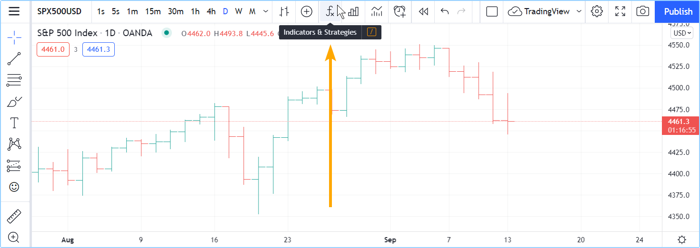
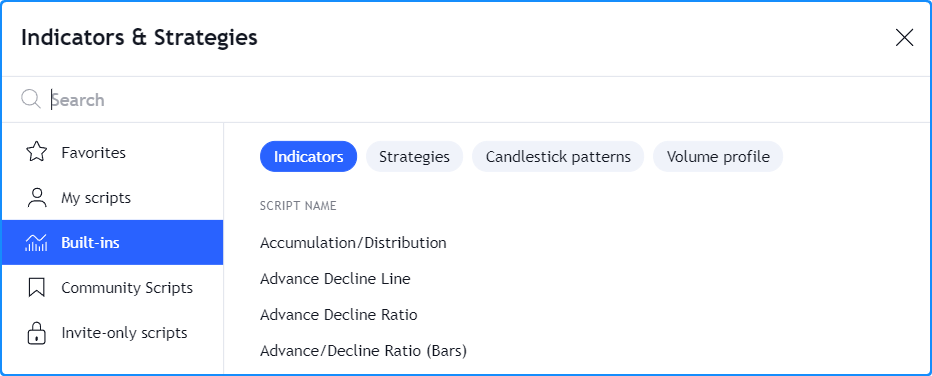
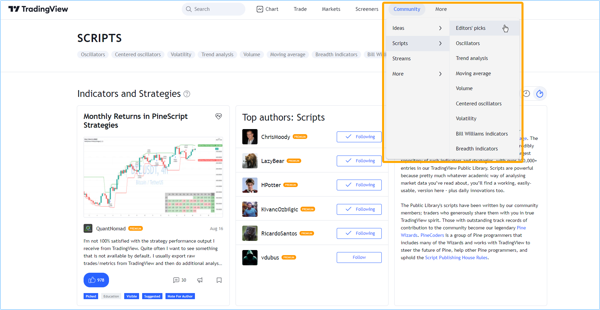
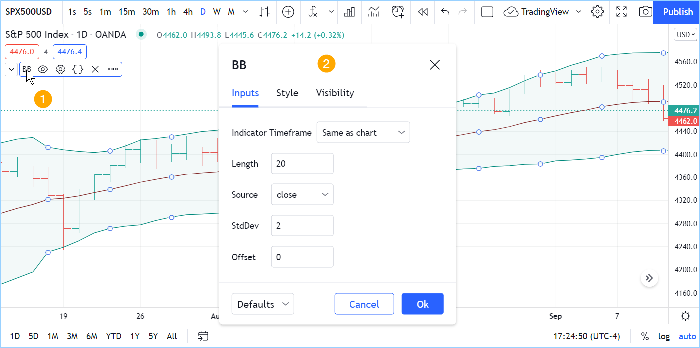
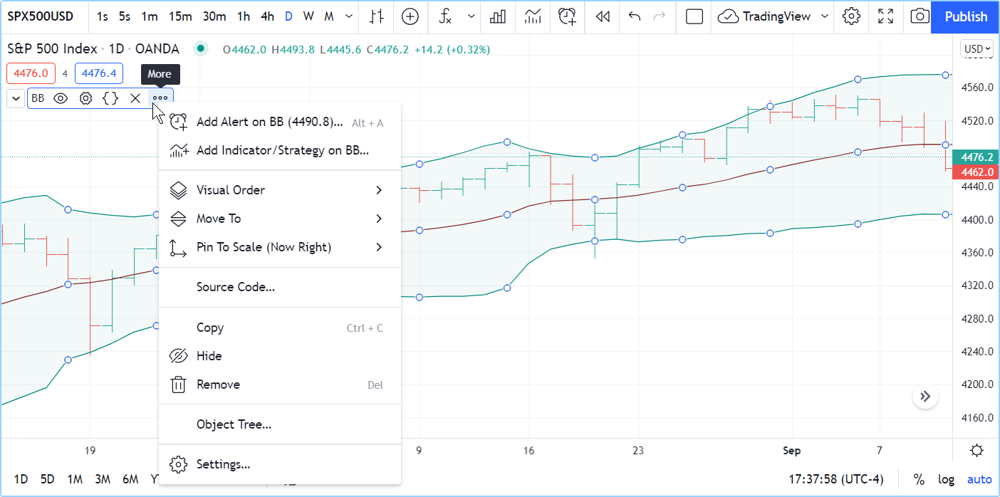
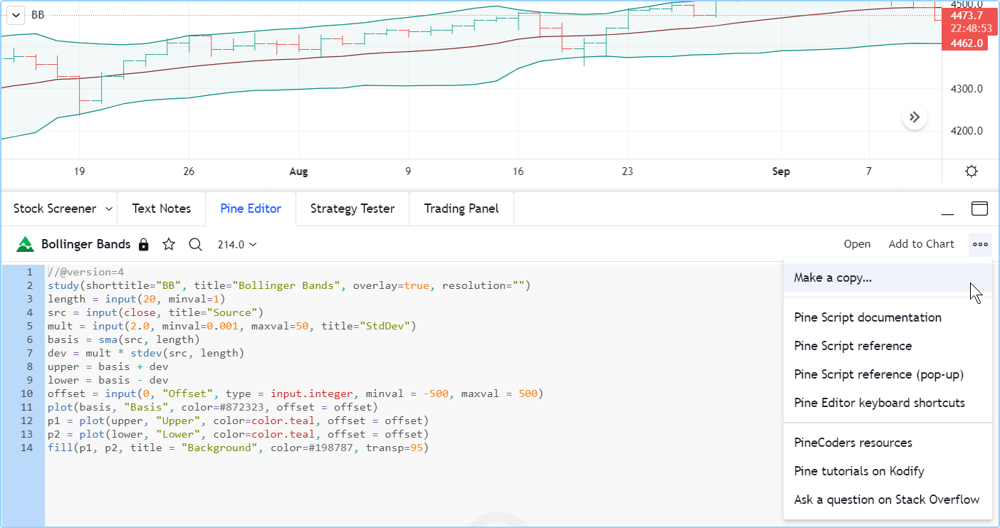

# Introdução

Bem-vindo ao Manual do Usuário do Pine Script v5, que irá acompanhá-lo em sua jornada para aprender a programar suas próprias ferramentas de negociação em Pine Script.
Seja também muito bem-vindo à comunidade ativa de programadores de Pine Script no TradingView.

Nesta página, apresentamos uma abordagem passo a passo para que você pode seguir para se tornar mais familiarizado com indicadores e estratégias (também chamados de scripts) escritos em Pine Script no TradingView. Vamos orientá-lo no início da sua jornada para:

1. __Utilize__ alguns dos milhares de scripts existentes na plataforma.
2. __Leia__ o código Pine Script dos scripts existentes.
3. __Desenvolva__ scripts em Pine Script.

Se você já está familiarizado com o uso de Pine scripts no TradingView e está pronto para aprender a criar seus próprios scripts, então pule para a seção [Desenvolver Scripts](01_primeiros_passos.md#desenvolver-scripts) desta página.

Se você é novo em nossa plataforma, por favor, continue lendo!

# Utilizando Scripts

Se você está interessado em utilizar indicadores técnicos ou estratégias no TradingView, você pode começar explorando os milhares de indicadores já disponíveis em nossa plataforma.
Você pode acessar os indicadores existentes na plataforma de duas maneiras diferentes:

* Ao usar o botão "Indicadores e Estratégias" do gráfico, ou
* Ao navegar pelos Scripts da Comunidade do TradingView, o maior repositório de scripts de negociação do mundo, com mais de 100.000 scripts, a maioria sendo gratuitos e código aberto (_open source_), o que significa que pode ser visto o código Pine Script deles.

Encontrando as ferramentas que precisa, pode ser uma boa maneira de começar e gradualmente se tornar proficiente como usuário de script, até estar preparado para começar sua jornada de programação em Pine Script.

# Carregando Scripts do Gráfico

Para explorar e carregar scripts do seu gráfico, utilize o botão "Indicadores e Estratégias" (_Indicators & Strategies_):

A caixa de diálogo apresenta scripts de diferentes categorias no painel esquerdo:

* "__Favoritos__" (__Favorites__) lista os scripts que você "favoritou" ao clicar no ícone de estrela que aparece à esquerda do nome.
* "__Meus scripts__" (__My scripts__) exibe os scripts que você criou e salvou no Editor do Pine (_Pine Editor_). São salvos na nuvem (_cloud_) do TradingView.
* "__Funcionalidades incorporadas__" (__Built-ins__) agrupa todos os recursos integrados do TradingView organizados em quatro categorias: indicadores, estratégias, padrões de vela (_candlestick_) e perfis de volume. A maioria escritos em Pine Script e disponíveis gratuitamente. _"Built-ins" são ferramentas integradas e fornecidas pela plataforma_.
* "__Scripts da comunidade__" (__Community scripts__) é onde pode pesquisar entre os mais de 100.000 scripts publicados escritos por usuários do TradingView.
* "__Scripts por convite__" (__Invite-only scripts__) contém a lista dos scripts restritos por convite na qual foi concedido acesso pelos seus autores. _São scripts privados_.

Aqui, nesta imagem contém os recursos integrados do TradingView:

Ao clicar em um dos indicadores ou estratégias (aqueles com as setas verdes e vermelhas seguido de seus nomes), é carregado no seu gráfico.

# Navegando pelos Scripts da Comunidade

A partir da página inicial do [TradingView](https://www.tradingview.com), pode ter acesso aos Scripts da Comunidade através do menu "Comunidade" (_Community_).
Aqui, estamos destacando a seção "Escolhas dos Editores" (_Editors’ Picks_), porém existem outras categorias que você pode escolher:

Os scripts pode ser pesquisado usando o campo "Pesquisa" (_Search_) da página inicial e filtrar os scripts usando diferentes critérios.
O Centro de Ajuda tem uma página explicando os [diferentes tipos de scripts](https://www.tradingview.com/support/solutions/43000558522) disponíveis.

O stream de scripts mostra os widgets, ou seja, espaços reservados que exibem uma visualização em miniatura do gráfico de cada publicação, sua descrição e seu autor.
Ao clicar, abrirá a página do script, onde poderá ver o script em um gráfico, ler a descrição do autor, curtir o script, deixar comentários ou ler o código-fonte do script se ele for publicado como código aberto.
Assim que encontrar um script de seu interesse nos Scripts da Comunidade, siga as instruções no Centro de Ajuda para [carregá-lo em seu gráfico](https://www.tradingview.com/support/solutions/43000555216).
_"Stream" é lista contínua de informações ou widgets de script que são exibidos na interface_.

# Modificando Configurações do Script

Assim que o script é carregado no gráfico, clique duas vezes no mesmo (#1) para abrir a aba "Configurações/Entradas" (#2) (_Settings/Inputs_):

A aba "Entradas" (_Inputs_) permite a alteração das configurações em que o autor do script tornou-os editáveis.
Consegue-se configurar algumas das visualizações do script usando a aba "Estilo" (_Style_) da mesma caixa de diálogo e quais períodos de tempo o script deve aparecer usando a aba "Visibilidade" (_Visibility_).

Outras configurações encontra-se disponíveis em todos os scripts nos botões que aparecem à direita de seu nome quando o mouse passa sobre ele, e no menu "Mais" (_More_) (ícone dos três "_pontinhos_"):

# Lendo Scripts

Consumir códigos escritos por bons programadores é uma maneira eficiente de desenvolver sua compreensão da linguagem.
E Isso é tão real para o Pine Script quanto para outras linguagens de programação.
Encontrar um bom código aberto em Pine Script é relativamente fácil, aqui encontra-se fontes confiáveis de códigos escritos por estes programadores no TradingView:

* Indicadores integrados do TradingView (_Built-ins_).
* Scripts selecionados como ["Escolhas dos Editores"](https://www.tradingview.com/scripts/editors-picks) (_Editors’ Picks_).
* Scripts pelos [autores seguidos pela conta PineCoders](https://www.tradingview.com/u/PineCoders/#following-people).
* Scripts de autores com alta reputação e publicações de código aberto.

Ler código dos [Scripts da Comunidade](https://www.tradingview.com/scripts) é fácil; caso não veja um ícone de "cadeado" de cor cinza ou vermelha no canto superior direito do widget do script, isso indica que o script é código aberto. Ao abrir a página do script, você poderá ver seu código-fonte.

Para ver o código dos recursos integrados do TradingView, carregue o indicador no gráfico, em seguida, passe o mouse sobre o nome do indicador e selecione o ícone de chaves de "Código-fonte" (_Source code_) (se não o ver, é porque o código-fonte do indicador encontra-se indisponível).
Ao clicar no ícone, o Editor do Pine (_Pine Editor_) será aberto e apartir daí, poderá ver o código do script. Caso queira mexê-lo, precisará usar o botão "Mais" (_More_) do menu do Editor, localizado no canto superior direito do painel do Editor, e então selecionar em "Fazer uma cópia..." (_Make a copy…_).
Poderá alterá-lo e salvar o código, e como terá criado uma versão diferente do script, precisará usar o botão "Adicionar ao Gráfico" (_Add to Chart_) no Editor para adicionar essa nova cópia ao gráfico.

Isto mostra o Editor do Pine sendo aberto após ter selecionado o botão "Ver código-fonte" (_View source_) do indicador no gráfico.
Estamos prestes em fazer uma cópia de sua origem pois atualmente está como leitura (_read-only_) (indicado pelo ícone de "cadeado" próximo ao nome do arquivo no Editor):

Pode-se também abrir os indicadores integrados do TradingView a partir do Editor do Pine (acessível na aba "Editor do Pine" (_Pine Editor_) na parte inferior do gráfico) usando "Abrir/Novo script integrado padrão..." (_Open/New default built-in script…_) da seleção do menu.

# Desenvolvendo Scripts

Desenvolvemos o Pine Script para capacitar tanto traders iniciantes quanto experientes para criar suas próprias ferramentas de negociação.
Projetamos de forma que seja relativamente fácil de aprender para programadores iniciantes — embora aprender a primeira linguagem de programação, assim como o trading, possa ser um grande desafio para qualquer pessoa — mesmo assim, é muito eficaz para que programadores experientes possam construir ferramentas de complexidade moderada.

O Pine Script permite que crie três tipos de scripts:

* __Indicadores__ como Index de Força Relativa (IFR, (_RSI_)), Convergência e Divergência de Médias Móveis (_MACD_), Bandas de Bollinger, Médias Móveis (_MAs_), etc...
* __Estratégias__ na qual incluem lógica para emitir ordens de negociação e podem ser testadas historicamente e testadas para frente (_backtest & forwardtest_).
* __Bibliotecas__ na qual são usadas por programadores mais avançados para agrupar funções frequentemente utilizadas que podem ser reutilizadas em outros scripts.

O próximo passo recomendado é criar o seu [primeiro indicador](02_primeiro_indicador.md).

