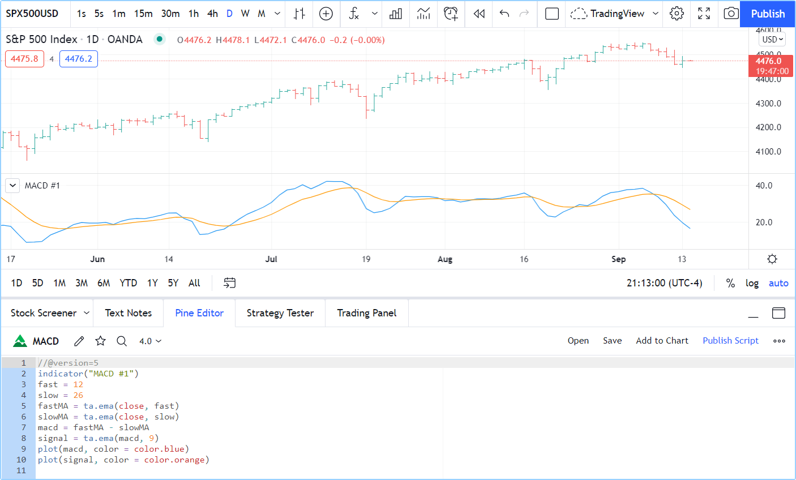
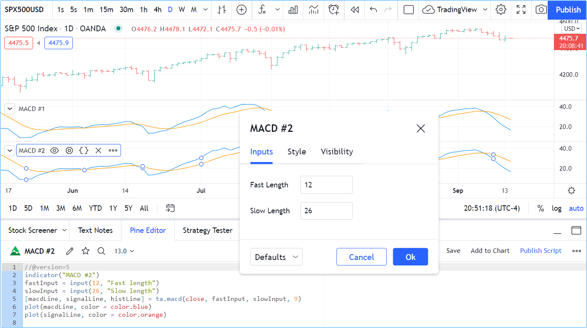

# O Editor Pine

O Editor Pine é a área de trabalho dos seus scripts.
Embora possa usar qualquer editor de texto que desejar para escrever seus scripts em Pine, usar o nosso Editor possui muitas vantagens:

* Destaca seu código seguindo a sintaxe do Pine Script.
* Exibe lembretes de sintaxe para funções integradas e de bibliotecas ao passar o mouse sobre elas.
* Fornece rápido acesso ao Manual de Referência do Pine Script v5 através de um popup ao pressionar `ctrl` + `click` / `cmd` + `click` nas palavras-chave do Pine Script.
* Disponibiliza um recurso de auto-completar que pode ser ativado com `ctrl` + `espaço` / `cmd` + `espaço`.
* Execução imediata ao salvar uma nova versão de um script já carregado no gráfico, tornando o ciclo de escrever/compilar/executar ágil.
* Embora não seja tão repleto de recursos quanto os principais editores disponíveis, o Editor Pine oferece funcionalidades-chave, como busca e substituição, múltiplos cursores (edição simultânea) e versionamento.

Para abrir o Editor, clique na aba "Editor Pine" (_Pine Editor_) na parte inferior do gráfico no TradingView. E isso abrirá o painel do Editor.


# Primeira Versão

Criando o primeiro script funcional em Pine, uma implementação do indicador [_MACD_](https://www.tradingview.com/support/solutions/43000502344-macd-moving-average-convergence-divergence) em Pine Script:

```c
//@version=5
indicator("MACD #1")
fast = 12
slow = 26
fastMA = ta.ema(close, fast)
slowMA = ta.ema(close, slow)
macd = fastMA - slowMA
signal = ta.ema(macd, 9)
plot(macd, color = color.blue)
plot(signal, color = color.orange)
```

* Através do menu suspenso em "Abrir" (_Open_) localizado no canto superior direito do Editor selecione "Novo indicador" (_New indicator_).
* Em seguida, copie o script de exemplo acima.
* Selecione todo o código já no editor e substitua-o pelo script de exemplo copiado.
* Clique em "Salvar" (_Save_) e escolha um nome para o seu script. O script agora está salvo na nuvem do TradingView, mas sob o nome da sua conta. Ninguém além de você pode usá-lo.
* Ao clicar em "Adicionar ao gráfico" (_Add to chart_) na barra de menu do Editor, o indicador MACD aparecerá em um Painel (_Pane_) separado abaixo do seu gráfico.

Seu primeiro script Pine está sendo executado no gráfico, que deve se assemelhar a isto:



Vamos analisar o código do script, linha por linha:

__Linha 1: `//@version=5`__
- Esta é uma [anotação do compilador](000_compiler_annotation.md) informando ao compilador que o script usará a versão 5 do Pine Script.

__Linha 2: `indicator("MACD #1")`__
- Define o nome do script que aparecerá no gráfico como "_MACD_".

__Linha 3: `fast = 12`__
- Define a variável do tipo _integer_ com nome de `fast` que será o comprimento da _EMA (Média Móvel Exponencial)_ rápida.

__Linha 4: `slow = 26`__
- Define a variável do tipo _integer_ com nome de `slow` que será o comprimento da _EMA (Média Móvel Exponencial)_ lenta.

__Linha 5: `fastMA = ta.ema(close, fast)`__
- Define a variável `fastMA`, contendo o resultado do cálculo da _EMA (Média Móvel Exponencial)_ com um comprimento igual a _fast (12)_, na série de fechamento, ou seja, o preço de fechamento da barra (_candlestick_).

__Linha 6: `slowMA = ta.ema(close, slow)`__
- Define a variável `slowMA`, contendo o resultado do cálculo da _EMA_ com um comprimento igual a _slow (26)_, a partir do fechamento.

__Linha 7: `macd = fastMA - slowMA`__
- Define a variável `macd` como a diferença entre as duas _EMAs_.

__Linha 8: `signal = ta.ema(macd, 9)`__
- Define a variável `signal` como um valor suavizado (_smoothed_) de `macd` usando o algoritmo _EMA_ com um comprimento de 9.

__Linha 9: `plot(macd, color = color.blue)`__
- Função `plot` é chamada para exibir a variável `macd` usando uma linha de cor azul.

__Linha 10: `plot(signal, color = color.orange)`__
- Função `plot` é chamada para exibir a variável `signal` usando uma linha de cor laranja.


# Segunda Versão

A primeira versão do script calculou o MACD de forma "manual", e como o Pine Script é formulado para desenvolver indicadores e estratégias, existem funções nativas da própria linguagem para vários indicadores comuns, incluindo um para...
__MACD__: [ta.macd()](https://www.tradingview.com/pine-script-reference/v5/#fun_ta{dot}macd).

Esta é a segunda versão do script:

```c
//@version=5
indicator("MACD #2")
fastInput = input(12, "Fast length")
slowInput = input(26, "Slow length")
[macdLine, signalLine, histLine] = ta.macd(close, fastInput, slowInput, 9)
plot(macdLine, color = color.blue)
plot(signalLine, color = color.orange)
```

Perceba que:

- Foi adicionado entradas (_input_) para que possa alterar os comprimentos das EMAs.
- Foi adicionado a função embutida [ta.macd()](https://www.tradingview.com/pine-script-reference/v5/#fun_ta{dot}macd) para calcular o MACD, na qual poupa algumas linhas no código e torna-o mais fácil de ler.

Repetindo o mesmo processo anterior para copiar esse código em um novo indicador:

* Através do menu suspenso em "Abrir" (_Open_) localizado no canto superior direito do Editor selecione "Novo indicador" (_New indicator_).
* Em seguida, copie o script de exemplo acima.
* Selecione todo o código já no editor e substitua-o pela segunda versão do script.
* Clique em "Salvar" (_Save_) e modifique o nome para o seu script.
* Ao clicar em "Adicionar ao gráfico" (_Add to chart_) na barra de menu do Editor, o indicador "MACD #2" aparece em um painel separado abaixo do indicador "MACD #1".

O seu segundo script Pine é executado no seu gráfico. Ao clicar duas vezes no nome do indicador no seu gráfico, abrirá a aba "Configurações/Entradas" (_Settings/Inputs_) do script, onde agora pode alterar os comprimentos lento e rápido (_slow length/fast length_):



Vamos analisar as modificações da segunda versão do script:

__Linha 2: `indicator("MACD #2")`__
- Foi alterado _#1_ para _#2_ para que a segunda versão do indicador exiba um nome diferente no gráfico.

__Linha 3: `fastInput = input(12, "Fast length")`__
- Em vez de declarar um valor constante a uma variável, está sendo usado a função [input()](https://www.tradingview.com/pine-script-reference/v5/#fun_input) para que possa alterar o valor na aba "Configurações/Entradas" (_Settings/Inputs_) do script.
`12` será o valor padrão e o nome do campo será "Comprimento rápido" (_`Fast length`_). Se o valor for mudado na aba de "Entradas" (_Inputs_), o conteúdo da variável `fastInput` conterá um novo valor e o script será re-executado no gráfico com esse novo valor. Note que, conforme recomendado no [Guia de Estilo](000_style_guide.md) do Pine Script, foi adicionado o `Input` para ter em mente, mais adiante no script, de que seu valor provém de uma entrada do usuário.

__Linha 4: `slowInput = input(26, "Slow length")`__
- Feito o mesmo para o "Comprimento lento" (_`Slow length`_), usando um nome de variável, valor padrão e texto diferentes para o nome do campo.

__Linha 5: `[macdLine, signalLine, histLine] = ta.macd(close, fastInput, slowInput, 9)`__
- Aqui é onde é chamado a função integrada [ta.macd()](https://www.tradingview.com/pine-script-reference/v5/#fun_ta{dot}macd) para efetuar todos os cálculos da primeira versão em apenas numa única linha. A função exige quatro parâmetros (os valores após o nome da função, entre parênteses).
Retornando três valores para as três variáveis em vez de apenas um, como as funções que usamos até agora.
É preciso colocar a lista de três variáveis que recebem o resultado da função entre colchetes, à esquerda do sinal de `=`. Observe que dois dos valores que foi proporcionado para a função são as variáveis "input" que contêm os comprimentos rápido e lento: `fastInput` e `slowInput`.

__Linha 6 e 7:__
- Mudaram os nomes das variáveis que está sendo plotado, mas as linhas estão fazendo a mesma coisa que na primeira versão.

A segunda versão realiza os mesmos cálculos que a primeira, podendo alterar os dois comprimentos usados para calculá-lo através dos "inputs".
O código também é mais simples, com menos linhas. Resumindo, o script foi refinado.