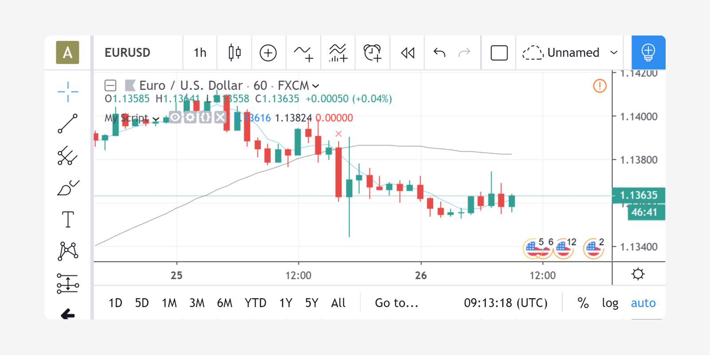
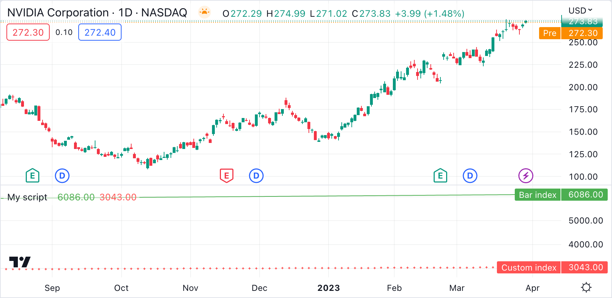
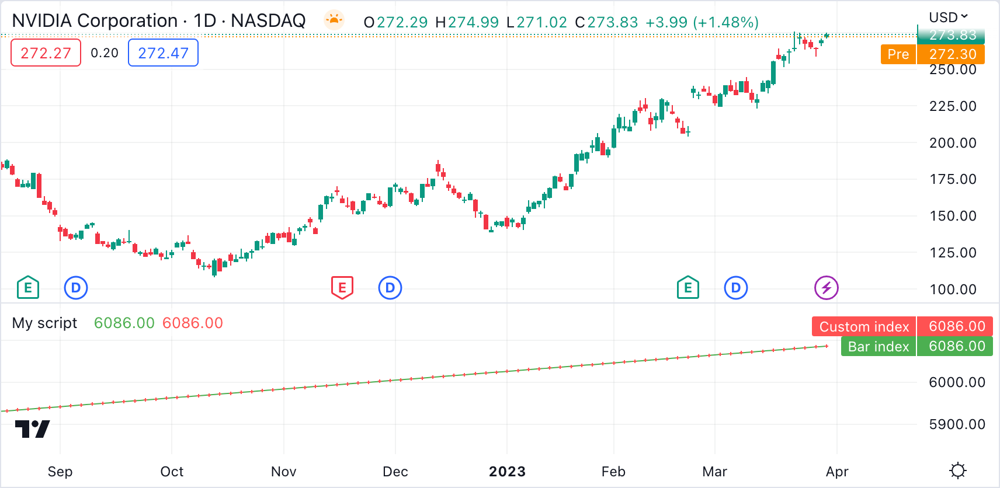
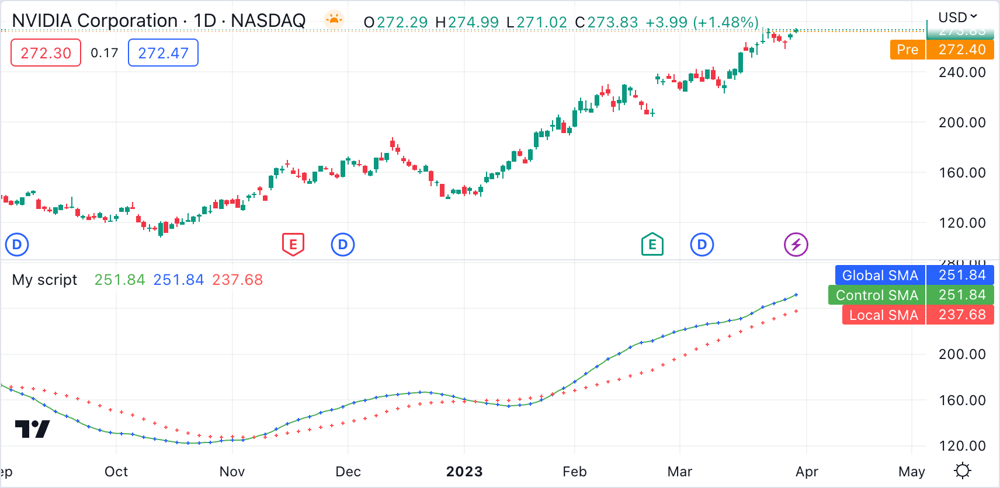

# Modelo de Execução

O modelo de execução do tempo de execução do Pine Script está intimamente ligado à [série temporal](./000_time_series.md) e a [tipagem do sistema](./000_type_system.md) do Pine Script. Entender os três é fundamental para aproveitar ao máximo o poder do Pine Script.

O modelo de execução determina como o script é executado nos gráficos e, portanto, como o código desenvolvido nos scripts funciona. O código nada faria se não fosse pelo tempo de execução do Pine Script, que entra em ação após ser compilado e, é executado no gráfico porque um dos [eventos que desencadeia a execução de um script](./04_01_modelo_de_execucao.md#eventos-desencadeiando-a-execução-do-script) ocorreu.

Quando um script Pine é carregado em um gráfico, o mesmo é executado uma vez em cada barra histórica usando os valores __OHLCV__ (open, high, low, close, volume) (_abertura, alta, baixa, fechamento, volume_) disponíveis para cada barra. Assim que a execução do script alcança última barra disponível nos dados do gráfico, se a negociação estiver atualmente ativa no símbolo do gráfico, então os indicadores Pine Script serão executados a cada vez que ocorrer uma atualização, ou por, mudanças no preço ou volume. Por padrão as estratégias do Pine Script só serão executadas quando a última barra se fechar, mas também podem ser configuradas para executar a cada atualização, como os indicadores.

Todos os pares de __símbolos/períodos de tempo__ têm um conjunto de dados composto por um número limitado de barras.
Ao explorar um gráfico para a esquerda para ver as barras anteriores do conjunto de dados, as barras correspondentes são carregadas no gráfico.
O processo de carregamento é interrompido quando não há mais barras para aquele par específico do __símbolo/período de tempo__ ou quando o [número máximo de barras](./000_chart_bars.md) permitido pelo tipo de conta foi carregado. Consegue-se navegar pelo gráfico para a esquerda até a primeira barra do conjunto de dados, que tem um valor de índice (_index_) de 0 (veja [bar_index](https://br.tradingview.com/pine-script-reference/v5/#var_bar_index)).

Quando o script é executado pela primeira vez num gráfico, todas as barras num conjunto de dados são _barras históricas_, exceto a mais à direita, ou seja, a barra atual se uma sessão de negociação estiver ativa. Quando a negociação está ativa na barra mais recente, essa é chamada de _barra em tempo real_. A barra em tempo real é atualizada quando uma mudança de preço ou volume é detectada. Quando a barra em tempo real se fecha, ela se torna uma barra em tempo real decorrida, ou seja, uma barra concluída e uma nova barra em tempo real se abre.


# Cálculo Baseado em Barras Históricas

Vamos usar este simples script e acompanhar sua execução em barras históricas:

```c
//@version=5
indicator("My Script", overlay = true)
src = close
a = ta.sma(src, 5)
b = ta.sma(src, 50)
c = ta.cross(a, b)
plot(a, color = color.blue)
plot(b, color = color.black)
plotshape(c, color = color.red)
```

Nas barras históricas, um script é executado equivalentemente no fechamento da barra, quando os valores __OHLCV__ são todos conhecidos para aquela barra. Antes da execução do script na barra, as variáveis integradas como __open__, __high__, __low__, __close__, __volume__ e __time__ (_abertura_, _máxima_, _mínima_, _fechamento_, _volume_ e _tempo_) são definidas com valores correspondentes aos daquela barra. O script é executado __uma vez por barra histórica__.

Nosso exemplo de script é executado pela primeira vez na primeira barra do conjunto de dados no índice 0 (_index 0_). Cada instrução é executada usando os valores da barra atual. Portanto, na primeira barra do conjunto de dados, a seguinte instrução:

```c
src = close
```

Inicializa a variável `src` com o valor `close` para aquela primeira barra, e cada uma das próximas linhas é executada sequencialmente. Como o script só é executado uma vez para cada barra histórica, o script sempre calculará usando o mesmo valor `close` para uma barra histórica específica.

A execução de cada linha no script produz cálculos que, por sua vez, geram os valores de saída do indicador, que podem então ser plotados no gráfico. No exemplo utiliza as funções `plot` e `plotshape` no final do script para produzir valores de saída. No caso de uma estratégia, o resultado dos cálculos pode ser usado para plotar valores ou ditar as ordens a serem colocadas.

Após a execução e a plotagem na primeira barra, o script é executado na segunda barra do conjunto de dados, que tem um índice de 1 (_index 1_). O processo então se repete até que todas as barras históricas no conjunto de dados sejam processadas e o script alcance a barra mais atual no gráfico.




# Cálculo Baseado em Barras em Tempo Real

O comportamento de um script Pine na barra em tempo real é muito diferente do que as barras históricas. Recorde que a barra em tempo real é a mais à direita no gráfico quando a negociação está ativa no símbolo do gráfico. Além disso, lembre-se de que as estratégias podem se comportar de duas maneiras diferentes na barra em tempo real. Por padrão, elas só são executadas quando a barra em tempo real se fecha, mas o parâmetro `calc_on_every_tick` da declaração de `strategy` pode ser definido como `true` para modificar o comportamento da estratégia para que ela seja executada cada vez que a barra em tempo real é atualizada, como os indicadores fazem. O comportamento descrito para os indicadores se aplicará apenas a estratégias que usam `calc_on_every_tick=true`.

A diferença mais importante entre a execução de scripts em barras históricas e em tempo real é que enquanto eles são executados apenas uma vez em barras históricas, os scripts são executados toda vez que uma atualização ocorre durante uma barra em tempo real. Isso implica que variáveis embutidas, como `high`, `low` e `close`, que nunca mudam em uma barra histórica, __podem__ mudar a cada iteração do script na barra em tempo real. Mudanças nas variáveis integradas usadas nos cálculos do script, por sua vez, induzirão mudanças nos resultados desses cálculos. Isso é necessário para que o script acompanhe a ação do preço em tempo real. Como resultado, o mesmo script pode produzir resultados diferentes cada vez que é executado durante a barra em tempo real.

__Observação__: Na barra em tempo real, a variável `close` sempre representa o __preço atual__. Da mesma forma, as variáveis embutidas `high` e `low` representam a _máxima mais alta_ e a _mínima mais baixa_ alcançadas desde o início da barra em tempo real. As variáveis integradas do Pine Script só representarão os valores finais da barra em tempo real na última barra atualizada.

Vamos acompanhar nosso exemplo de script na barra em tempo real.

Quando o script alcança a barra em tempo real, ele é executado pela primeira vez. Utiliza os valores atuais das variáveis embutidas para produzir um conjunto de resultados e os plota, se necessário. Antes do script executar novamente quando a próxima atualização ocorre, as variáveis definidas pelo usuário são redefinidas para um estado conhecido correspondente ao último _registro de mudanças_ (_commit_) no fechamento da barra anterior. Se nenhuma confirmação foi feita nas variáveis porque elas são inicializadas a cada barra, então elas são reinicializadas, ou seja, se as variáveis não foram confirmadas por serem inicializadas a cada barra, então são reinicializadas a cada barra. Em ambos os casos, o último estado calculado é perdido. O estado das _etiquetas_ e _linhas_ (_labels_ e _lines_) plotadas também é redefinido. Essa redefinição das variáveis definidas pelo usuário do script e dos desenhos anteriores de cada nova iteração do script na barra em tempo real é chamada de _rollback_. Seu efeito é resetar o script para o mesmo estado conhecido em que estava quando a barra em tempo real foi aberta, então os cálculos na barra em tempo real são sempre realizados a partir de um estado limpo.

O recálculo constante dos valores de um script à medida que o preço ou volume mudam na barra em tempo real pode levar a uma situação em que a variável `c` em nosso exemplo se torna verdade porque ocorreu um cruzamento, e então a marca de cor vermelha plotado pela última linha do script apareceria no gráfico. Se na próxima atualização de preço o preço se movimentar de tal forma que o valor de `close` não produza mais cálculos fazendo com que `c` seja verdadeira porque não há mais cruzamento, então o marcador previamente plotado desaparecerá.

Quando a barra em tempo real se fecha, o script é executado uma última vez. Como de costume, as variáveis são redefinidas antes da execução. No entanto, como esta iteração é a última na barra em tempo real, as variáveis são confirmadas com seus valores finais para a barra quando os cálculos são concluídos.

Resumindo o processo da barra em tempo real:

- Um script é executado __na abertura da barra em tempo real e então uma vez a cada atualização__.
- As variáveis são redefinidas __antes de cada atualização em tempo real__.
- As variáveis são confirmadas __uma vez na atualização de fechamento da barra__.


# Eventos Desencadeando a Execução do Script

O script é executado em todas as barras disponíveis no gráfico quando um dos seguintes eventos ocorre:

- Um novo símbolo ou período de tempo é carregado no gráfico.
- Um script é salvo ou adicionado ao gráfico, pelo Editor Pine Script ou da caixa de diálogo "Indicadores e estratégias" (_“Indicators & strategies”_) do gráfico.
- Um valor é modificado na caixa de diálogo "Configurações/Entradas" ("_Settings/Inputs_") do script.
- Um valor é modificado na caixa de diálogo "Configurações/Propriedades" ("_Settings/Properties_") de uma estratégia.
- O navegador é atualizado (_refresh_).

O script é executado na barra em tempo real quando a negociação está ativa e:

- Uma das condições acima ocorre, fazendo com que o script seja executado na abertura da barra em tempo real.
- A barra em tempo real é atualizada ou pela mudança de preço ou volume detectados.

Note que quando um gráfico não é alterado enquanto o mercado está ativo, uma sucessão de barras em tempo real que foram abertas e depois fechadas seguirá a barra em tempo real atual. Embora essas barras em _tempo real decorridas_ tenham sido _confirmadas_ pois suas variáveis foram todas registradas, o script ainda não terá sido executado nelas em seu estado histórico, pois elas não existiam quando o script foi executado pela última vez no conjunto de dados do gráfico.

Quando um evento gatilha a execução do script no gráfico e faz com que ele seja executado nas barras que agora se tornaram barras históricas, os cálculos do script podem às vezes variar daqueles feitos na última atualização de fechamento das mesmas barras quando eram barras em tempo real. Isso pode ser causado por pequenas variações entre os valores __OHLCV__ salvos no fechamento das barras em tempo real e aqueles obtidos dos _feeds_ de dados quando as mesmas barras se tornaram barras históricas. Esse comportamento é uma das possíveis causas do _repintamento_ (_repainting_).


# Mais Informação

- As variáveis integradas `barstate.*` fornecem informações sobre o [tipo de barra ou o evento](./000_bar_states.md) onde o script está executando. A página onde são documentadas também contém um script que permite visualizar a diferença entre barras em tempo real decorridas e barras históricas, por exemplo.
- A página de [Estratégias](./000_strategies.md) explica detalhadamente os cálculos das estratégias, que não são idênticos aos dos indicadores.


# Valores Históricos das Funções

Cada chamada de função no Pine deixa um rastro de valores históricos que o script pode acessar em barras subsequentes usando o operador [[]](https://br.tradingview.com/pine-script-reference/v5/#op_%5B%5D). A série histórica de funções depende de chamadas sucessivas para registrar a saída em cada barra. Quando um script não chama funções em cada barra, pode produzir um histórico inconsistente que afeta cálculos e resultados, especialmente quando depende da continuidade de sua série histórica para operar conforme o esperado. O compilador adverte os usuários nesses casos para alertá-los de que os valores de uma função, seja ela embutida ou definida pelo usuário, podem ser enganosos/falsos.

Para demonstrar, vamos criar um script que calcula o índice da barra atual e imprime esse valor em cada segunda barra. No script a seguir, definimos uma função `calcBarIndex()` que adiciona 1 ao valor anterior de sua variável de índice (_index_) interna em cada barra. O script chama a função em cada barra em que a condição (`condition`) retorna verdadeiro (`true`) (em cada outra barra, ou seja, uma barra sim e outra não) para atualizar o valor `customIndex`. Plota esse valor ao lado do `bar_index` integrado para validar a saída:



```c
//@version=5
indicator("My script")

//@function Calculates the index of the current bar by adding 1 to its own value from the previous bar.
// The first bar will have an index of 0.
calcBarIndex() =>
    int index = na
    index := nz(index[1], replacement = -1) + 1

//@variable Returns `true` on every other bar.
condition = bar_index % 2 == 0

int customIndex = na

// Call `calcBarIndex()` when the `condition` is `true`. This prompts the compiler to raise a warning.
if condition
    customIndex := calcBarIndex()

plot(bar_index,   "Bar index",    color = color.green)
plot(customIndex, "Custom index", color = color.red, style = plot.style_cross)
```

__Note que:__

- A função [nz()](https://br.tradingview.com/pine-script-reference/v5/#fun_nz) substitui os valores [na](https://br.tradingview.com/pine-script-reference/v5/#var_na) "não disponível" por um valor de substituição (`replacement`) especificado (0 por padrão (_default_)). Na primeira barra do script, quando a série de índices (`index`) não tem histórico, o valor [na](https://br.tradingview.com/pine-script-reference/v5/#var_na) é substituído por -1 antes de adicionar 1 para retornar um valor inicial de 0.

Ao inspecionar o gráfico, observamos que os dois plots diferem drasticamente. A razão para este comportamento é que o script chamou a função `calcBarIndex()` dentro do escopo de uma estrutura [if](https://br.tradingview.com/pine-script-reference/v5/#op_if) em cada outra barra, resultando em uma saída histórica inconsistente com a série `bar_index`. Ao chamar a função uma vez a cada duas barras, referenciar internamente o valor anterior do `index` obtém o valor de duas barras atrás, ou seja, a última barra em que a função foi executada. Esse comportamento resulta em um valor `customIndex` equivalente à metade do `bar_index` integrado.

Para alinhar a saída de `calcBarIndex()` com o `bar_index`, podemos mover a chamada da função para o escopo global do script. Dessa forma, a função será executada em todas as barras, permitindo que todo o seu histórico seja registrado e referenciado, ao invés de apenas os resultados de cada duas barras, alternadamente. No código abaixo, definimos uma variável `globalScopeBarIndex` no escopo global e a atribuímos ao retorno de `calcBarIndex()` em vez de chamar a função localmente. O script define o `customIndex` com o valor de `globalScopeBarIndex` na ocorrência da condição (`condition`):



```c
//@version=5
indicator("My script")

//@function Calculates the index of the current bar by adding 1 to its own value from the previous bar.
// The first bar will have an index of 0.
calcBarIndex() =>
    int index = na
    index := nz(index[1], replacement = -1) + 1

//@variable Returns `true` on every second bar.
condition = bar_index % 2 == 0

globalScopeBarIndex = calcBarIndex()
int customIndex = na

// Assign `customIndex` to `globalScopeBarIndex` when the `condition` is `true`. This won't produce a warning.
if condition
    customIndex := globalScopeBarIndex

plot(bar_index,   "Bar index",    color = color.green)
plot(customIndex, "Custom index", color = color.red, style = plot.style_cross)
```

Esse comportamento pode impactar radicalmente as funções embutidas que referenciam o histórico internamente. Por exemplo, a função [ta.sma()](https://br.tradingview.com/pine-script-reference/v5/#fun_ta{dot}sma) referencia valores passados "por debaixo dos panos". Se um script chama essa função condicionalmente em vez de em todas as barras, os valores dentro do cálculo podem mudar significativamente. Podemos garantir a consistência dos cálculos atribuindo [ta.sma()](https://br.tradingview.com/pine-script-reference/v5/#fun_ta{dot}sma) a uma variável no escopo global e referenciando o histórico dessa variável conforme necessário.

O exemplo a seguir calcula três séries SMA: `controlSMA`, `localSMA` e `globalSMA`. O script calcula `controlSMA` no escopo global e `localSMA` dentro do escopo local de uma estrutura [if](https://br.tradingview.com/pine-script-reference/v5/#op_if). Dentro da estrutura [if](https://br.tradingview.com/pine-script-reference/v5/#op_if), atualiza o valor de `globalSMA` usando o valor de `controlSMA`. Como podemos ver, os valores das séries `globalSMA` e `controlSMA` se alinham, enquanto a série `localSMA` diverge das outras duas porque usa um histórico incompleto, na qual afeta os cálculos:



```c
//@version=5
indicator("My script")

//@variable Returns `true` on every second bar.
condition = bar_index % 2 == 0

controlSMA = ta.sma(close, 20)
float globalSMA = na
float localSMA  = na

// Update `globalSMA` and `localSMA` when `condition` is `true`.
if condition
    globalSMA := controlSMA        // No warning.
    localSMA  := ta.sma(close, 20) // Raises warning. This function depends on its history to work as intended.

plot(controlSMA, "Control SMA", color = color.green)
plot(globalSMA,  "Global SMA",  color = color.blue, style = plot.style_cross)
plot(localSMA,   "Local SMA",   color = color.red,  style = plot.style_cross)
```


# Motivo pelo Comportamento?

Esse comportamento é necessário porque, forçar a execução de funções em cada barra levaria a resultados inesperados em funções que produzem efeitos colaterais, ou seja, aquelas que fazem algo além de retornar o valor. Por exemplo, a função [label.new()](https://br.tradingview.com/pine-script-reference/v5/#fun_label{dot}new) cria um rótulo no gráfico, então forçá-la a ser chamada em cada barra mesmo quando estiver dentro de uma estrutura [if](https://br.tradingview.com/pine-script-reference/v5/#op_if) criaria rótulos onde logicamente não deveriam aparecer.


# Exceções

Nem todas as funções integradas usam seus valores anteriores em seus cálculos, o que significa que nem todas exigem execução em cada barra. Por exemplo, [math.max()](https://br.tradingview.com/pine-script-reference/v5/#fun_math{dot}max) compara todos os argumentos passados para retornar o valor mais alto. Funções como essas, que não interagem com histórico de forma alguma, não requerem tratamento especial.

Se o uso de uma função dentro de um bloco condicional não causar um aviso do compilador, é seguro usá-la sem afetar os cálculos. Caso contrário, mova a chamada da função para o escopo global para forçar uma execução consistente. Quando manter uma chamada de função dentro de um bloco condicional apesar do aviso, garante-se de que a saída está correta pra pelo menos evitar resultados inesperados.
