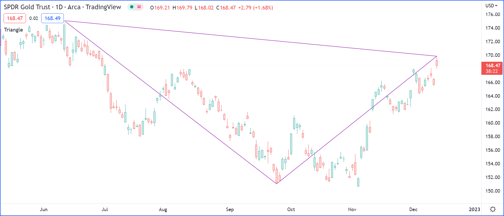

# Estrutura do Script

Um script Pine segue a seguinte estrutura geral:

```c
<version>
<declaration_statement>
<code>
```


# Versão

Uma [anotação do compilador](./04_03_estrutura_do_script.md#anotações-do-compilador) no seguinte formato informa ao compilador em qual das versões do Pine Script o script está programado:

```c
//@version=5
```

- O número do versionamento é entre 1 e 5.
- A anotação do compilador não é obrigatória. Quando omitida, assume-se a versão 1. É extremamente recomendado sempre utilizar a versão mais recente da linguagem.
- Embora seja sintaticamente correto colocar a anotação do compilador em qualquer lugar do script, é muito mais útil para os leitores quando ela aparece no topo do script.

Alterações significativas na versão atual do Pine Script são documentadas nas [Notas de Lançamento](https://www.tradingview.com/pine-script-docs/en/v5/Release_notes.html#pagereleasenotes).


# Declaração de Instrução

Todos os scripts Pine devem conter uma declaração de instrução, que é uma chamada a uma dessas funções:

- Indicador > [indicator()](https://br.tradingview.com/pine-script-reference/v5/#fun_indicator)
- Estratégia > [strategy()](https://br.tradingview.com/pine-script-reference/v5/#fun_strategy)
- Biblioteca > [library()](https://br.tradingview.com/pine-script-reference/v5/#fun_library)

A _declaração de instrução_:

- Identifica o tipo do script, que por sua vez dita qual conteúdo é permitido nele e como pode ser usado e executado.
- Define propriedades-chave do script, como _nome_ próprio, onde aparecerá ao ser adicionado no gráfico, a precisão e formato dos valores que exibe, e certos valores que governam o próprio comportamento em tempo de execução, como o número máximo de objetos de desenho que serão exibidos no gráfico. Com estratégias, as propriedades incluem parâmetros que controlam o _backtesting_, como capital inicial (_initial capital_), comissão (_commission_), variação de preço (_slippage_), etc.

Cada tipo de script possui requisitos distintos:

- Indicadores devem conter pelo menos uma chamada de função que produza a saída no gráfico (por exemplo, [plot()](https://br.tradingview.com/pine-script-reference/v5/#fun_plot), [plotshape()](https://br.tradingview.com/pine-script-reference/v5/#fun_plotshape), [barcolor()](https://br.tradingview.com/pine-script-reference/v5/#fun_barcolor), [line.new()](https://br.tradingview.com/pine-script-reference/v5/#fun_line{dot}new), etc.).
- Estratégias devem conter pelo menos uma chamada de `strategy.*()`, por exemplo, [strategy.entry()](https://br.tradingview.com/pine-script-reference/v5/#fun_strategy{dot}entry).
- Bibliotecas devem conter pelo menos uma [função](./05_11_libraries.md#funções-de-biblioteca) exportada ou um [tipo definido pelo usuário](./05_11_libraries.md#tipos-e-objetos-definidos-pelo-usuário).


# Código

Linhas em um script que não são [comentários](./04_03_estrutura_do_script.md#comentários) ou [anotações do compilador](./04_03_estrutura_do_script.md#anotações-do-compilador) são _instruções_, que implementam o algoritmo do script. Uma instrução pode ser uma das seguintes:

- Declaração de variável.
- Reatribuição de variável.
- Declaração de função.
- Chamada de função interna, chamada de [função definida pelo usuário](./04_11_funcoes_definidas_pelo_usuario.md) ou chamada de [função de biblioteca](././05_11_libraries.md#usando-uma-biblioteca).
- _Estrutura_ [if](https://br.tradingview.com/pine-script-reference/v5/#op_if), [for](https://br.tradingview.com/pine-script-reference/v5/#op_for), [while](https://br.tradingview.com/pine-script-reference/v5/#op_while), [switch](https://br.tradingview.com/pine-script-reference/v5/#op_switch) ou [type](https://br.tradingview.com/pine-script-reference/v5/#op_type).

As instruções podem ser organizadas em várias maneiras:

- Algumas instruções podem ser expressas em uma única linha, como a maioria das declarações de variáveis, linhas contendo apenas uma chamada de função ou declarações de função em uma única linha. As linhas também podem ser [quebradas](./04_03_estrutura_do_script.md#quebra-de-linha) (continuadas em diversas linhas). Múltiplas instruções de uma linha podem ser concatenadas em uma única linha usando a vírgula como separador.
- Outras instruções, como estruturas ou declarações de função em múltiplas linhas, sempre exigem várias linhas porque necessitam de um _bloco local_. Um bloco local (_local block_) deve ser indentado por uma tabulação (_tab_) ou quatro espaços (_spaces_). Cada bloco local define um _escopo local_ distinto.
- Instruções no _escopo global_ do script (isto é, que não fazem parte de blocos locais) não podem começar com espaço em branco (um espaço ou uma tabulação). O primeiro caractere delas também deve ser o primeiro caractere da linha. Linhas que começam na primeira posição de uma linha se tornam, por definição, parte do _escopo global_ do script.

Um simples indicador Pine Script v5 válido pode ser criado no Editor Pine Script ao usar o botão "Abrir" ("_Open_") e selecionar "Novo indicador" ("_New indicator_"):

```c
//@version=5
indicator("My Script")
plot(close)
```

Este indicador inclui três blocos locais, um na declaração da função `f()` e dois na declaração da variável usando uma estrutura [if](https://br.tradingview.com/pine-script-reference/v5/#op_if):

```c
//@version=5

indicator("", "", true)    // Declaration statement (global scope)

barIsUp() =>    // Function declaration (global scope)
    close > open    // Local block (local scope)

plotColor = if barIsUp()  // Variable declaration (global scope)
    color.green     // Local block (local scope)
else
    color.red       // Local block (local scope)

bgcolor(color.new(plotColor, 70))   // Call to a built-in function  (global scope)
```

Consegue-se criar uma estratégia simples em Pine Script v5 selecionando "Nova estratégia" ("_New strategy_"):

```c
//@version=5
strategy("My Strategy", overlay=true, margin_long=100, margin_short=100)

longCondition = ta.crossover(ta.sma(close, 14), ta.sma(close, 28))
if (longCondition)
    strategy.entry("My Long Entry Id", strategy.long)

shortCondition = ta.crossunder(ta.sma(close, 14), ta.sma(close, 28))
if (shortCondition)
    strategy.entry("My Short Entry Id", strategy.short)
```


# Comentários

Barras duplas (`//`) definem comentários no Pine Script. Os comentários podem começar em qualquer lugar da linha. Eles também podem seguir o código do Pine Script na mesma linha:

```c
//@version=5
indicator("")
// This line is a comment
a = close // This is also a comment
plot(a)
```

O Editor Pine tem um atalho no teclado para comentar/descomentar linhas: `ctrl` + `/`. Pode ser usado em várias linhas destacando-as primeiro.


# Quebra de Linha

Linhas longas podem ser separadas em diversas linhas, ou "quebradas". Linhas quebradas devem ser indentadas com qualquer número de espaços, desde que não seja um múltiplo de quatro (esses limites são usados para indentar blocos locais):

```c
a = open + high + low + close
```

Pode ser quebrada assim:

```c
a = open +
      high +
          low +
             close
```

A função [plot()](https://br.tradingview.com/pine-script-reference/v5/#fun_plot) pode ser quebrada assim:

```c
plot(ta.correlation(src, ovr, length),
   color = color.new(color.purple, 40),
   style = plot.style_area,
   trackprice = true)
```

Instruções dentro de declarações de funções definidas pelo usuário também podem ser quebradas em múltiplas linhas. No entanto, como um bloco local deve começar sintaticamente com uma indentação (4 espaços ou 1 tab), ao dividir para a próxima linha, a continuação da instrução deve começar com mais de uma indentação (não igual a um múltiplo de quatro espaços). Por exemplo:

```c
updown(s) =>
    isEqual = s == s[1]
    isGrowing = s > s[1]
    ud = isEqual ?
           0 :
           isGrowing ?
               (nz(ud[1]) <= 0 ?
                     1 :
                   nz(ud[1])+1) :
               (nz(ud[1]) >= 0 ?
                   -1 :
                   nz(ud[1])-1)
```

Pode-se usar comentários em linhas quebradas:

```c
//@version=5
indicator("")
c = open > close ? color.red :
  high > high[1] ? color.lime : // A comment
  low < low[1] ? color.blue : color.black
bgcolor(c)
```


# Anotações do Compilador

As anotações do compilador são [comentários](./04_03_estrutura_do_script.md#comentários) que emitem instruções especiais para um script:

- `//@version=` especifica a versão do PineScript que o compilador utilizará. O número nesta anotação não deve ser confundido com o número de revisão do script, que é atualizado a cada alteração salva no código.
- `//@description` define uma descrição personalizada para scripts que utilizam a instrução de declaração [library()](https://br.tradingview.com/pine-script-reference/v5/#fun_library).
- `//@function`, `//@param` e `//@returns` adicionam descrições personalizadas para uma função definida pelo usuário, seus parâmetros e seu resultado quando colocados acima da declaração da função.
- `//@type` e `//@field` adicionam descrições customizadas para um [tipo definido pelo usuário (UDT)](./04_09_tipagem_do_sistema.md#tipos-definidos-pelo-usuário) e seus campos quando colocados acima da declaração do tipo.
- `//@variable` adiciona uma descrição personalizada para uma variável quando colocada acima de sua declaração.
- `//@strategy_alert_message` fornece uma mensagem padrão para scripts de estratégia preencherem o campo "Mensagem" ("_Message_") no diálogo da criação do alerta.
- `//#region` e `//#endregion` criam regiões de código que podem ser recolhidas no Editor Pine. Clicar na seta suspensa ao lado de `//#region` _oculta_ e/ou _colapsa_ as linhas de código entre as duas anotações.

Este script desenha um retângulo usando três pontos selecionados interativamente no gráfico. Ilustrando como as anotações do compilador podem ser usadas:



```c
//@version=5
indicator("Triangle", "", true)

int   TIME_DEFAULT  = 0
float PRICE_DEFAULT = 0.0

x1Input = input.time(TIME_DEFAULT,   "Point 1", inline = "1", confirm = true)
y1Input = input.price(PRICE_DEFAULT, "",        inline = "1", tooltip = "Pick point 1", confirm = true)
x2Input = input.time(TIME_DEFAULT,   "Point 2", inline = "2", confirm = true)
y2Input = input.price(PRICE_DEFAULT, "",        inline = "2", tooltip = "Pick point 2", confirm = true)
x3Input = input.time(TIME_DEFAULT,   "Point 3", inline = "3", confirm = true)
y3Input = input.price(PRICE_DEFAULT, "",        inline = "3", tooltip = "Pick point 3", confirm = true)

// @type            Used to represent the coordinates and color to draw a triangle.
// @field time1     Time of first point.
// @field time2     Time of second point.
// @field time3     Time of third point.
// @field price1    Price of first point.
// @field price2    Price of second point.
// @field price3    Price of third point.
// @field lineColor Color to be used to draw the triangle lines.
type Triangle
    int   time1
    int   time2
    int   time3
    float price1
    float price2
    float price3
    color lineColor

//@function Draws a triangle using the coordinates of the `t` object.
//@param t  (Triangle) Object representing the triangle to be drawn.
//@returns  The ID of the last line drawn.
drawTriangle(Triangle t) =>
    line.new(t.time1, t.price1, t.time2, t.price2, xloc = xloc.bar_time, color = t.lineColor)
    line.new(t.time2, t.price2, t.time3, t.price3, xloc = xloc.bar_time, color = t.lineColor)
    line.new(t.time1, t.price1, t.time3, t.price3, xloc = xloc.bar_time, color = t.lineColor)

// Draw the triangle only once on the last historical bar.
if barstate.islastconfirmedhistory
    //@variable Used to hold the Triangle object to be drawn.
    Triangle triangle = Triangle.new()

    triangle.time1  := x1Input
    triangle.time2  := x2Input
    triangle.time3  := x3Input
    triangle.price1 := y1Input
    triangle.price2 := y2Input
    triangle.price3 := y3Input
    triangle.lineColor := color.purple

    drawTriangle(triangle)
```
