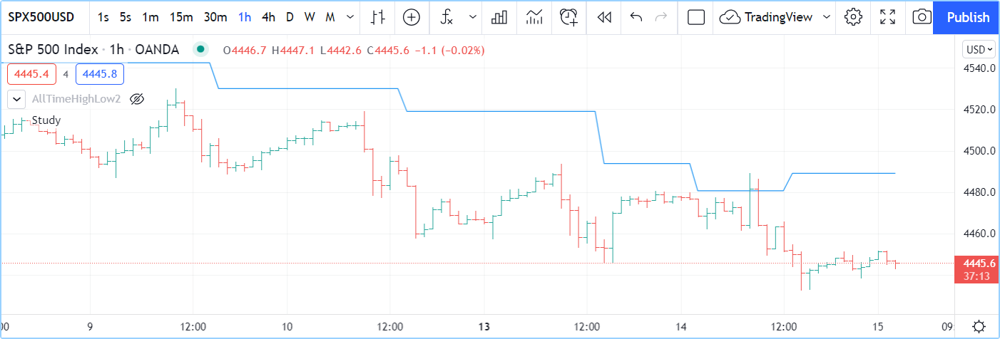

# Operadores

Alguns operadores são utilizados para construir _expressões_ que retornam um resultado:

- Operadores aritméticos.
- Operadores de comparação.
- Operadores lógicos.
- O operador ternário [?:](https://br.tradingview.com/pine-script-reference/v5/#op_{question}{colon}).
- O operador de referência de histórico [[]](https://br.tradingview.com/pine-script-reference/v5/#op_[]).

Outros operadores são usados para atribuir valores a variáveis:

- `=` é usado para atribuir um valor a uma variável, __mas apenas quando a variável é declarada__ (na primeira vez que a usa).
- `:=` é usado para atribuir um valor a uma variável __previamente declarada__. Os seguintes operadores também podem ser usados dessa maneira: `+=`, `-=`, `*=`, `/=`, `%=`.

Explicado em [Tipagem do Sistema](./04_09_tipagem_do_sistema.md), _qualificadores_ e _tipos_ desempenham um papel crítico na determinação do tipo de resultados que as expressões produzem. Por sua vez, tem um impacto sobre como e com quais funções é permitido usar esses resultados. As expressões sempre retornam um valor com o qualificador mais forte usado na expressão, por exemplo, se multiplicar um "input int" com um "series int", a expressão produzirá um resultado "series int", o qual não poderá utilizar como argumento para o _comprimento_ (`length`) em [ta.ema()](https://br.tradingview.com/pine-script-reference/v5/#fun_ta{dot}ema).

O script seguinte produzirá um erro de compilação:

```c
//@version=5
indicator("")
lenInput = input.int(14, "Length")
factor = year > 2020 ? 3 : 1
adjustedLength = lenInput * factor
ma = ta.ema(close, adjustedLength)  // Compilation error!
plot(ma)
```

O compilador avisará: Não é possível chamar 'ta.ema' com o argumento 'length'='adjustedLength' (_Cannot call ‘ta.ema’ with argument ‘length’=’adjustedLength’_). _Foi utilizado um argumento do tipo 'series int', mas é esperado um 'simple int';_. Isso ocorre porque `lenInput` é um "input int", mas `factor` é um "series int" (só pode ser determinado olhando para o valor de [year](https://br.tradingview.com/pine-script-reference/v5/#var_year) em cada barra). Portanto, a variável `adjustedLength` recebe um valor do tipo "series int". O problema é que a entrada no _Manual de Referência_ para [ta.ema()](https://br.tradingview.com/pine-script-reference/v5/#fun_ta{dot}ema) nos diz que seu parâmetro `length` requer um valor "simple", que é um qualificador mais _fraco/menos restritivo_ do que "series", então um valor do tipo "series int" não é permitido.

A solução para este dilema requer uma das duas opções:

- Usar outra função de média móvel que suporta um comprimento "series int", como [ta.sma()](https://br.tradingview.com/pine-script-reference/v5/#fun_ta{dot}sma).
- Não utilizar o cálculo que produza um valor "series int" para o comprimento.


# Operadores Aritméticos

Existem cinco operadores aritméticos no Pine Script:

|     |                                  |
| --- | -------------------------------: |
| `+` | Adição e concatenação de strings |
| `-` | Subtração                        |
| `*` | Multiplicação                    |
| `/` | Divisão                          |
| `%` | Módulo (sobra/resto da divisão)  |
|     |                                  |

Os operadores aritméticos acima são todos binários (significa que precisam de _dois operandos_ - ou valores - para funcionar, exemplo `1 + 2`). O `+` e o `-` também servem como operadores unários (significa que funcionam com um único operando, como `-1` ou `+1`).

Se ambos os operandos são números, mas pelo menos um deles é do tipo [float](https://br.tradingview.com/pine-script-reference/v5/#op_float), o resultado também será um [float](https://br.tradingview.com/pine-script-reference/v5/#op_float). Se ambos os operandos são do tipo [int](https://br.tradingview.com/pine-script-reference/v5/#op_int), o resultado também será um [int](https://br.tradingview.com/pine-script-reference/v5/#op_int). Se pelo menos um operando for [na](https://br.tradingview.com/pine-script-reference/v5/#var_na), o resultado também será [na](https://br.tradingview.com/pine-script-reference/v5/#var_na).

O operador `+` também serve como operador de concatenação para strings. `"EUR" + "USD"` resulta na [string](https://br.tradingview.com/pine-script-reference/v5/#op_string) `"EURUSD"`.

O operador `%` calcula o módulo arredondando para baixo o quociente para o menor valor possível. Aqui está um exemplo simples que ajuda a ilustrar como o módulo é calculado nos bastidores:

```c
//@version=5
indicator("Modulo function")
modulo(series int a, series int b) =>
    a - b * math.floor(nz(a/b))
plot(modulo(-1, 100))
```


# Operadores de Comparação

Existem seis operadores de comparação no Pine Script:

|      |                  |
| ---- | ---------------: |
| `<`  | Menor que        |
| `<=` | Menor ou igual a |
| `!=` | Não igual        |
| `==` | Igual            |
| `>`  | Maior que        |
| `>=` | Maior ou igual a |
|      |                  |

As operações de comparação são binárias. Se ambos os operandos tiverem um valor numérico, o resultado será do tipo [bool](https://br.tradingview.com/pine-script-reference/v5/#type_bool), isto é, `true`, `false` ou [na](https://br.tradingview.com/pine-script-reference/v5/#var_na).

Exemplos:

```c
1 > 2  // false
1 != 1 // false
close >= open  // Depends on values of `close` and `open`
```


# Operadores Lógicos

Existem três operadores lógicos no Pine Script:

|       |                  |
| ----- | ---------------: |
| `not` | Negação          |
| `and` | Conjunção lógica |
| `or`  | Disjunção lógica |
|       |                  |

O operador `not` é unário. Quando aplicado a um operando `true`, o resultado será `false`, e vice-versa.

Tabela verdade do operador `and`:

| a     | b     | a and b |
| ----- | ----- | ------: |
| true  | true  | true    |
| true  | false | false   |
| false | true  | false   |
| false | false | false   |
|       |       |         |

Tabela verdade do operador `or`:

| a     | b     | a or b  |
| ----- | ----- | ------: |
| true  | true  | true    |
| true  | false | true    |
| false | true  | true    |
| false | false | false   |
|       |       |         |


# Operador ternário `?:`

O operador ternário `?:` é usado para criar expressões do tipo:

```c
condition ? valueWhenConditionIsTrue : valueWhenConditionIsFalse
```

O operador ternário retorna um resultado que depende do valor da `condition`. Se for `true`, então `valueWhenConditionIsTrue` é retornado. Se `condition` for `false` ou [na](https://br.tradingview.com/pine-script-reference/v5/#var_na), então `valueWhenConditionIsFalse` é retornado.

Uma combinação de expressões ternárias pode ser usada para alcançar o mesmo efeito de uma estrutura [switch](https://br.tradingview.com/pine-script-reference/v5/#op_switch), por exemplo:

```c
timeframe.isintraday ? color.red : timeframe.isdaily ? color.green : timeframe.ismonthly ? color.blue : na
```

O exemplo é calculado da esquerda para a direita:

- Se [timeframe.isintraday](https://br.tradingview.com/pine-script-reference/v5/#var_timeframe{dot}isintraday) for `true`, então é retornado `color.red`. Se for `false`, então [timeframe.isdaily](https://br.tradingview.com/pine-script-reference/v5/#var_timeframe{dot}isdaily) é avaliado.
- Se [timeframe.isdaily](https://br.tradingview.com/pine-script-reference/v5/#var_timeframe{dot}isdaily) for `true`, então é retornado `color.green`. Se for `false`, então [timeframe.ismonthly](https://br.tradingview.com/pine-script-reference/v5/#var_timeframe{dot}ismonthly) é avaliado.
- Se [timeframe.ismonthly](https://br.tradingview.com/pine-script-reference/v5/#var_timeframe{dot}ismonthly) for `true`, então é retornado `color.blue`, caso contrário, é retornado [na](https://br.tradingview.com/pine-script-reference/v5/#var_na).

Repare que os valores de retorno em cada lado do `:` são expressões — não blocos locais, então eles não afetarão o limite de 500 blocos locais por escopo.


# Operador de Referência Histórica `[]`

É possível fazer referência dos valores passados das [séries temporais](./04_02_series_temporais.md) usando o operador de referência histórica [[]](https://br.tradingview.com/pine-script-reference/v5/#op_[]). Valores passados são os valores que uma variável teve em barras anteriores à barra onde o script está executando atualmente - a barra _atual_. Consulte a página [Modelo de Execução](./04_01_modelo_de_execucao.md) para mais informações sobre a maneira como os scripts são executados nas barras.

O operador [[]](https://br.tradingview.com/pine-script-reference/v5/#op_[]) é usado após uma variável, expressão ou chamada de função. O valor usado dentro dos colchetes do operador é o deslocamento no passado ao qual referir. Para fazer referência ao valor da variável integrada do [volume](https://br.tradingview.com/pine-script-reference/v5/#var_volume) de duas barras atrás da barra atual, usaria `volume[2]`.

Como as séries crescem dinamicamente, à medida que o script avança em barras sucessivas, o deslocamento usado com o operador se referirá a diferentes barras. Veja como o valor retornado pelo mesmo deslocamento é dinâmico e por que as séries são muito diferentes de arrays. No Pine Script, a variável [close](https://br.tradingview.com/pine-script-reference/v5/#var_close), ou `close[0]` que é equivalente, contém o valor do "fechamento" da barra atual. Se o código estiver sendo executado na __terceira__ barra do _conjunto de dados_ (o conjunto de todas as barras no gráfico), `close` conterá o preço no fechamento daquela barra, `close[1]` conterá o preço no fechamento da barra anterior (a segunda barra do conjunto de dados), e `close[2]`, a primeira barra. `close[3]` retornará [na](https://br.tradingview.com/pine-script-reference/v5/#var_na) porque nenhuma barra existe nessa posição, e portanto seu valor é _não disponível_.

Quando o mesmo código é executado na próxima barra, a __quarta__ do conjunto de dados, `close` conterá o preço de fechamento daquela barra, e o mesmo `close[1]` usado no código agora se referirá ao "fechamento" da terceira barra no conjunto de dados. O fechamento da primeira barra no conjunto de dados agora será `close[3]`, e desta vez `close[4]` retornará [na](https://br.tradingview.com/pine-script-reference/v5/#var_na).

No ambiente de execução do Pine Script, à medida que o código é executado uma vez para cada barra histórica no conjunto de dados, começando da esquerda do gráfico, o Pine Script está adicionando um novo elemento na série no index 0 e movendo os elementos pré-existentes na série para abrir espaço para um novo elemento. [Arrays](https://br.tradingview.com/pine-script-reference/v5/#type_array), em comparação, podem ter tamanhos constantes ou variáveis, e seu conteúdo ou estrutura de indexação não são modificados pelo ambiente de execução. Portanto, as séries do Pine Script são muito diferentes de arrays e apenas compartilham familiaridade por meio de sua sintaxe de indexação.

Pine Script possui uma variável que contém o número da barra na qual o script está sendo executado: [bar_index](https://br.tradingview.com/pine-script-reference/v5/#var_bar_index). Na primeira barra, [bar_index](https://br.tradingview.com/pine-script-reference/v5/#var_bar_index) é igual a 0 e aumenta em 1 a cada barra sucessiva em que o script é executado. Na última barra, [bar_index](https://br.tradingview.com/pine-script-reference/v5/#var_bar_index) é igual ao número de barras no conjunto de dados, _menos um_.

Há outra consideração importante para ter em mente ao usar o operador `[]` em Pine Script. Vimos casos em que uma referência histórica pode retornar o valor [na](https://br.tradingview.com/pine-script-reference/v5/#var_na). O [na](https://br.tradingview.com/pine-script-reference/v5/#var_na) representa um valor que não é um número e usar isso em qualquer expressão resultará em [na](https://br.tradingview.com/pine-script-reference/v5/#var_na) (semelhante a [NaN](https://pt.wikipedia.org/wiki/NaN)). Esses casos geralmente ocorrem durante os cálculos do script nas primeiras barras do conjunto de dados, mas também pode ocorrer em barras posteriores sob certas condições. Se o código não lidar explicitamente com esses casos especiais, pode introduzir resultados inválidos nos cálculos do script, que pode-se propagar até a barra em tempo real. As funções [na](https://br.tradingview.com/pine-script-reference/v5/#fun_na) e [nz](https://br.tradingview.com/pine-script-reference/v5/#fun_nz) são projetadas para lidar com tais casos.

Estes são usos válidos do operador [[]](https://br.tradingview.com/pine-script-reference/v5/#op_[]):

```c
high[10]
ta.sma(close, 10)[1]
ta.highest(high, 10)[20]
close > nz(close[1], open)
```

Note que o operador [[]](https://br.tradingview.com/pine-script-reference/v5/#op_[]) só pode ser usado uma única vez no mesmo valor.

Isso não é permitido:

```c
close[1][2] // Error: incorrect use of [] operator
```


# Operadores de Precedência

A ordem dos cálculos é determinada pela __prioridade__ dos operadores. Operadores com __maior precedência são calculados primeiro__.

Abaixo está uma lista de operadores ordenados por precedência decrescente:

| Precedência     | Operador                      |
| :-------------- | ----------------------------- |
| 9               | `[]`                          |
| 8               | unário `+`, unário `-`, `not` |
| 7               | `*`, `/`, `%`                 |
| 6               | `+`, `-`                      |
| 5               | `>`, `<`, `>=`, `<=`          |
| 4               | `==`, `!=`                    |
| 3               | `and`                         |
| 2               | `or`                          |
| 1               | `?:`                          |
|                 |                               |

Se em uma expressão houver vários operadores com a mesma precedência, então eles são calculados da esquerda para a direita.

Se a expressão deve ser calculada em uma ordem diferente da que a precedência indicaria, então partes da expressão podem ser agrupadas com parênteses.


# Operador de Atribuição `=`

O operador `=` é utilizado para atribuir valor a uma variável ao ser inicializada - ou declarada -, ou seja, na primeira vez que é utilizada. Ele aponta que se _trata de uma nova variável que será utilizada, e deseja-se que ela comece em cada barra com este valor_.

Estas são declarações de variáveis válidas:

```c
i = 1
MS_IN_ONE_MINUTE = 1000 * 60
showPlotInput = input.bool(true, "Show plots")
pHi = pivothigh(5, 5)
plotColor = color.green
```

Consulte [Declarações de Variável](./04_06_declaracoes_de_variavel.md) para mais informações sobre como declarar variáveis.


# Operador de Reatribuição `:=`

O operador `:=` é usado para reatribuir valor a uma variável existente. Isso significa _usar esta variável que foi declarada anteriormente no script e atribuir a ela um novo valor_.

Variáveis que foram primeiramente declaradas e, em seguida, reatribuídas com o operador `:=`, são chamadas de _variáveis mutáveis_.
Encontrará mais informações sobre como [var](https://br.tradingview.com/pine-script-reference/v5/#op_var) funciona na seção [modo de declaração 'var'](./04_06_declaracoes_de_variavel.md#var).

Estas são reatribuições de variáveis válidas:

```c
//@version=5
indicator("", "", true)
// Declare `pHi` and initilize it on the first bar only.
var float pHi = na
// Reassign a value to `pHi`
pHi := nz(ta.pivothigh(5, 5), pHi)
plot(pHi)
```

Note que:

- Declaramos `pHi` com este código: `var float pHi = na`. A palavra-chave [var](https://br.tradingview.com/pine-script-reference/v5/#op_var) informa ao Pine Script que apenas essa variável seja inicializada com [na](https://br.tradingview.com/pine-script-reference/v5/#var_na) na primeira barra do conjunto de dados. A palavra-chave [`float`](https://br.tradingview.com/pine-script-reference/v5/#type_float) informa ao compilador que estamos declarando uma variável do tipo "float". Isso é necessário porque, ao contrário da maioria dos casos, o compilador não pode determinar automaticamente o tipo do valor do lado direito do sinal `=`.
- Enquanto a declaração de variável será executada apenas na primeira barra por usa [var](https://br.tradingview.com/pine-script-reference/v5/#op_var), a linha `pHi := nz(ta.pivothigh(5, 5), pHi)` será executada em todas as barras do gráfico. Em cada barra, ela avalia se a chamada da função [pivothigh()](https://br.tradingview.com/pine-script-reference/v5/#fun_ta{dot}pivothigh) retorna [na](https://br.tradingview.com/pine-script-reference/v5/#var_na) porque é isso que a função faz quando _não encontrou_ um novo pivô (_pivot_). A função [nz()](https://br.tradingview.com/pine-script-reference/v5/#fun_nz) é a que faz o trabalho de "verificar por [na](https://br.tradingview.com/pine-script-reference/v5/#var_na)". Quando seu primeiro argumento (`ta.pivothigh(5, 5)`) é [na](https://br.tradingview.com/pine-script-reference/v5/#var_na), ela retorna o segundo argumento (`pHi`) em vez do primeiro. Quando [pivothigh()](https://br.tradingview.com/pine-script-reference/v5/#fun_ta{dot}pivothigh) retorna o ponto de preço de um novo pivô encontrado, esse valor é atribuído a `pHi`. Quando ele retorna [na](https://br.tradingview.com/pine-script-reference/v5/#var_na) porque nenhum novo pivô foi encontrado, atribuímos o valor anterior de `pHi` a si mesmo, efetivamente preservando seu valor anterior.

A saída do script aparenta-se com isto:



Note que:

- A linha preserva seu valor anterior até que um novo pivô seja encontrado.
- Os pivôs são detectados cinco barras após o pivô realmente ocorrer pois na chamada de função `ta.pivothigh(5, 5)` indica que precisamos de cinco altas mais baixas de ambos os lados de um ponto alto para que seja detectado como um pivô.

Consulte [Reatribuição de Variável](./04_06_declaracoes_de_variavel.md#reatribuição-de-variável) para mais informações sobre como reatribuir valores a variáveis.
