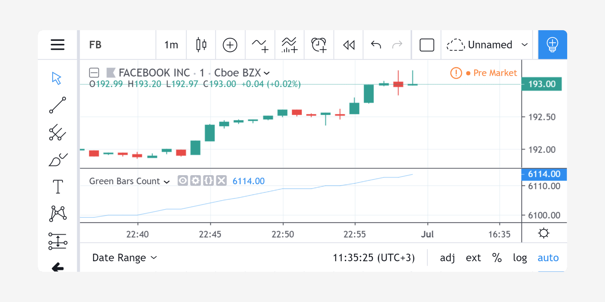

# Declarações de Variável

Variáveis são [identificadores](./04_04_identificadores.md) que armazenam valores. Devem ser _declaradas_ no código antes de serem utilizadas.

A sintaxe para declaração de variáveis é:

```c
[<declaration_mode>] [<type>] <identifier> = <expression> | <structure>
```

_OU_

```c
<tuple_declaration> = <function_call> | <structure>
```

Onde:

- O símbolo `|` significa "`or`" (_ou_), e partes contidas entre colchetes (`[]`) podem aparecer nunhuma ou uma vez, significa que a parte entre colchetes pode estar presente no texto (aparecer uma vez) ou pode não estar presente (não aparecer), ou seja, é opcional.
- `<declaration_mode>` é o [modo de declaração](./04_06_declaracoes_de_variavel.md#modos-de-declaração) da variável. Pode ser [var](https://br.tradingview.com/pine-script-reference/v5/#op_var) ou [varip](https://br.tradingview.com/pine-script-reference/v5/#op_varip), ou nothing (_nada_).
- `<type>` é opcional, como na maioria das declarações de variáveis no Pine Script (veja [tipos](./04_09_tipagem_do_sistema.md#tipos)).
- `<identifier>` é o [nome](./04_04_identificadores.md) da variável.
- `<expression>` pode ser um literal, uma variável, uma expressão ou uma chamada de função.
- `<structure>` pode ser uma estrutura [if](https://br.tradingview.com/pine-script-reference/v5/#op_if), [for](https://br.tradingview.com/pine-script-reference/v5/#op_for), [while](https://br.tradingview.com/pine-script-reference/v5/#op_while) ou [switch](https://br.tradingview.com/pine-script-reference/v5/#op_switch).
- `<tuple_declaration>` é uma lista separada por vírgulas de nomes de variáveis entre colchetes (`[]`), por exemplo, `[ma, upperBand, lowerBand]`.

Estas são declarações válidas de variáveis. A última requer quatro linhas:

```c
BULL_COLOR = color.lime
i = 1
len = input(20, "Length")
float f = 10.5
closeRoundedToTick = math.round_to_mintick(close)
st = ta.supertrend(4, 14)
var barRange = float(na)
var firstBarOpen = open
varip float lastClose = na
[macdLine, signalLine, histLine] = ta.macd(close, 12, 26, 9)
plotColor = if close > open
    color.green
else
    color.red
```

> __Observação__\
> As declarações acima todas contêm o operador de atribuição `=` porque são __declarações de variáveis__. Quando encontrar linhas semelhantes usando o operador de reatribuição `:=`, o código está __reatribuindo__ um valor a uma variável que __já foi declarada__. Essas são __reatribuições de variáveis__. Certifique-se de entender a distinção, pois isso é uma armadilha comum para iniciantes no Pine Script. Consulte a próxima seção sobre [Reatribuição de Variáveis](./04_06_declaracoes_de_variavel.md#reatribuição-de-variável) para mais detalhes.

A sintaxe formal de uma declaração de variável é:

```c
<variable_declaration>
    [<declaration_mode>] [<type>] <identifier> = <expression> | <structure>
    |
    <tuple_declaration> = <function_call> | <structure>

<declaration_mode>
    var | varip

<type>
    int | float | bool | color | string | line | linefill | label | box | table | array<type> | matrix<type> | UDF
```


# Inicialização com `na`

Na maioria dos casos, uma declaração explícita de tipo é redundante porque o tipo é automaticamente inferido a partir do valor à direita do `=` durante a compilação, então a decisão de usá-los geralmente é uma questão de preferência. 

Por exemplo:

```c
baseLine0 = na          // compile time error!
float baseLine1 = na    // OK
baseLine2 = float(na)   // OK
```

Na primeira linha do exemplo, o compilador não pode determinar o tipo da variável `baseLine0` porque [na](https://br.tradingview.com/pine-script-reference/v5/#var_na) é um valor genérico sem um tipo específico. A declaração da variável `baseLine1` está correta porque seu tipo [float](https://br.tradingview.com/pine-script-reference/v5/#op_float) é declarado explicitamente. A declaração da variável `baseLine2` também está correta porque seu tipo pode ser derivado da expressão `float(na)`, que é uma conversão explícita do valor [na](https://br.tradingview.com/pine-script-reference/v5/#var_na) para o tipo [float](https://br.tradingview.com/pine-script-reference/v5/#op_float). As declarações de `baseLine1` e `baseLine2` são equivalentes.


# Declarações de Tupla

Chamadas de função ou estruturas podem retornar múltiplos valores. Ao chamá-las e armazená-las os valores que retornam, é necessário usar uma _declaração de tupla_, que é um conjunto separado por vírgulas de um ou mais valores entre colchetes. Isso nos permite declarar múltiplas variáveis simultaneamente.

Como exemplo, a função embutida [ta.bb()](https://br.tradingview.com/pine-script-reference/v5/#fun_ta{dot}bb) para _Bandas de Bollinger_ retorna três valores:

```c
[bbMiddle, bbUpper, bbLower] = ta.bb(close, 5, 4)
```


# Reatribuição de Variável

Uma reatribuição de variável é realizada usando o operador de reatribuição [:=](./04_05_operadores.md#operador-de-reatribuição). Isso só pode ser feito depois que uma variável foi declarada inicialmente e recebeu um valor inicial. Reatribuir um novo valor a uma variável é frequentemente necessário em cálculos, e é sempre necessário quando uma variável do escopo global precisa receber um novo valor de dentro do bloco local de uma estrutura.

Por exemplo:

```c
//@version=5
indicator("", "", true)
sensitivityInput = input.int(2, "Sensitivity", minval = 1, tooltip = "Higher values make color changes less sensitive.")
ma = ta.sma(close, 20)
maUp = ta.rising(ma, sensitivityInput)
maDn = ta.falling(ma, sensitivityInput)

// On first bar only, initialize color to gray
var maColor = color.gray
if maUp
    // MA has risen for two bars in a row; make it lime.
    maColor := color.lime
else if maDn
    // MA has fallen for two bars in a row; make it fuchsia.
    maColor := color.fuchsia

plot(ma, "MA", maColor, 2)
```

Note que:

- A variável `maColor` foi inicializada apenas na primeira barra, para que preserve seu valor através das barras subsequentes.
- A cada barra, a instrução [if](https://br.tradingview.com/pine-script-reference/v5/#op_if) verifica se a média móvel tem aumentado ou diminuído pelo número especificado de barras pelo usuário (o padrão é 2). Quando isso acontece, o valor de `maColor` precisa ser reatribuído a um novo valor de dentro dos blocos locais [if](https://br.tradingview.com/pine-script-reference/v5/#op_if). Para fazer isso, utilize-se o operador de reatribuição [:=](./04_05_operadores.md#operador-de-reatribuição).
- Caso não utiliza-se o operador de reatribuição [:=](./04_05_operadores.md#operador-de-reatribuição), o efeito seria inicializar uma nova variável local `maColor` que teria o mesmo nome que a do escopo global, mas na verdade seria uma entidade independente muito confusa que persistiria apenas pelo comprimento do bloco local e então desapareceria sem deixar rastros.

Todas as variáveis definidas pelo usuário no Pine Script são _mutáveis_, o que significa que seu valor pode ser alterado usando o operador de reatribuição [:=](./04_05_operadores.md#operador-de-reatribuição). Atribuir um novo valor a uma variável pode alterar seu _qualificador de tipo_ (consulte [Tipagem do Sistema](./04_09_tipagem_do_sistema.md) do Pine Script para maiores informações). Uma variável pode receber um novo valor quantas vezes forem necessárias durante a execução do script em uma barra, então um script pode conter qualquer número de reatribuições de uma variável. O [modo de declaração](./04_06_declaracoes_de_variavel.md#modos-de-declaração) de uma variável determina como os novos valores atribuídos a ela serão salvos.


# Modos de Declaração

Para compreender o impacto que os modos de declaração têm sobre o comportamento das variáveis, é necessário ter conhecimento prévio do [modelo de execução](./04_01_modelo_de_execucao.md) do Pine Script.

Ao declarar uma variável, se um modo de declaração for especificado, esse deve vir primeiro.

Três modos podem ser usados:

- "Em cada barra", quando nenhum é especificado.
- [var](https://br.tradingview.com/pine-script-reference/v5/#op_var).
- [varip](https://br.tradingview.com/pine-script-reference/v5/#op_varip).

## Em Cada Barra

Quando nenhum modo de declaração explícito é especificado, ou seja, nenhuma palavra-chave [var](https://br.tradingview.com/pine-script-reference/v5/#op_var) ou [varip](https://br.tradingview.com/pine-script-reference/v5/#op_varip) é usada, a variável é declarada e inicializada em cada barra.

Por exemplo, as seguintes declarações:

```c
BULL_COLOR = color.lime
i = 1
len = input(20, "Length")
float f = 10.5
closeRoundedToTick = math.round_to_mintick(close)
st = ta.supertrend(4, 14)
[macdLine, signalLine, histLine] = ta.macd(close, 12, 26, 9)
plotColor = if close > open
    color.green
else
    color.red
```

## Var `var`

Quando a palavra-chave [var](https://br.tradingview.com/pine-script-reference/v5/#op_var) é usada, a variável é inicializada apenas uma vez, na primeira barra, se a declaração estiver no escopo global, ou na primeira vez que o bloco local é executado se a declaração estiver dentro de um bloco local. Após isso, ela preservará seu último valor nas barras sucessivas, até que reatribua um novo valor a ela. Esse comportamento é muito útil em muitos casos onde o valor de uma variável deve persistir através das iterações de um script em barras sucessivas.

Por exemplo, contagem de barras verdes no gráfico:

```c
//@version=5
indicator("Green Bars Count")
var count = 0
isGreen = close >= open
if isGreen
    count := count + 1
plot(count)
```



Sem o modificador `var`, a variável `count` seria resetada para zero (perdendo assim seu valor) toda vez que uma nova atualização de barra disparasse um novo recálculo do script.

Declarar variáveis apenas na primeira barra é frequentemente útil para gerenciar desenhos de forma mais eficiente. Suponha que queiramos estender a linha de [close](https://br.tradingview.com/pine-script-reference/v5/#var_close) da última barra para a direita do gráfico.

Por exemplo:

```c
//@version=5
indicator("Inefficient version", "", true)
closeLine = line.new(bar_index - 1, close, bar_index, close, extend = extend.right, width = 3)
line.delete(closeLine[1])
```

Porém isso é ineficiente porque estamos criando e deletando a linha em cada barra histórica e em cada atualização na barra em tempo real.

É mais eficiente usar:

```c
//@version=5
indicator("Efficient version", "", true)
var closeLine = line.new(bar_index - 1, close, bar_index, close, extend = extend.right, width = 3)
if barstate.islast
    line.set_xy1(closeLine, bar_index - 1, close)
    line.set_xy2(closeLine, bar_index, close)
```

Note que:

- O `closeLine` foi inicializado apenas na primeira barra, usando o modo de declaração [var](https://br.tradingview.com/pine-script-reference/v5/#op_var).
- Foi restringido a execução do restante do código à última barra do gráfico ao incluir o código que atualiza a linha em uma estrutura [if](https://br.tradingview.com/pine-script-reference/v5/#op_if) [barstate.islast](https://br.tradingview.com/pine-script-reference/v5/#var_barstate{dot}islast).

Há uma penalidade muito leve de desempenho ao usar o modo de declaração [var](https://br.tradingview.com/pine-script-reference/v5/#op_var). Por esse motivo, ao declarar constantes, é preferível não utilizar [var](https://br.tradingview.com/pine-script-reference/v5/#op_var) se o desempenho for uma preocupação, a menos que a inicialização envolva cálculos que levem mais tempo do que a penalidade de manutenção, por exemplo, funções com código complexo ou manipulações de string.

## Varip `varip`

Para compreender o comportamento das variáveis usando o modo de declaração [varip](https://br.tradingview.com/pine-script-reference/v5/#op_varip), é necessário ter conhecimento prévio do [modelo de execução](./04_01_modelo_de_execucao.md) do Pine Script e dos [estados das barras](./000_bar_states.md).

A palavra-chave [varip](https://br.tradingview.com/pine-script-reference/v5/#op_varip) pode ser usada para declarar variáveis que escapam do _processo de rollback_, sobre o qual é explicado no [modelo de execução](./04_01_modelo_de_execucao.md) do Pine Script.

Enquanto os scripts executam apenas uma vez no fechamento de barras históricas, quando um script está sendo executado em tempo real, o mesmo executa toda vez que o feed (fluxo de dados em tempo real que fornece informações atualizadas) do gráfico detecta uma atualização de preço ou volume. Em cada atualização em tempo real, o tempo de execução do Pine Script normalmente redefine os valores das variáveis do script para o seu último valor confirmado, isto é, o valor que tinham quando a barra anterior fechou. Isso geralmente é útil, já que cada execução de script em tempo real começa de um estado conhecido, o que simplifica a lógica do script.

Às vezes, no entanto, a lógica do script requer que o código possa salvar valores de variáveis __entre diferentes execuções__ na barra em tempo real. Declarar variáveis com [varip](https://br.tradingview.com/pine-script-reference/v5/#op_varip) torna isso possível. O "ip" em [varip](https://br.tradingview.com/pine-script-reference/v5/#op_varip) significa persistência intrabar (_intrabar persist_).

Olhe o código a seguir, que não utiliza [varip](https://br.tradingview.com/pine-script-reference/v5/#op_varip):

```c
//@version=5
indicator("")
int updateNo = na
if barstate.isnew
    updateNo := 1
else
    updateNo := updateNo + 1

plot(updateNo, style = plot.style_circles)
```

Nas barras históricas, [barstate.isnew](https://br.tradingview.com/pine-script-reference/v5/#var_barstate{dot}isnew) sempre é verdadeiro, então o gráfico mostra um valor de "1" porque a parte `else` da estrutura [if](https://br.tradingview.com/pine-script-reference/v5/#op_if) nunca é executada. Nas barras em tempo real, [barstate.isnew](https://br.tradingview.com/pine-script-reference/v5/#var_barstate{dot}isnew) só é [true](https://br.tradingview.com/pine-script-reference/v5/#const_true) quando o script é executado pela primeira vez na "abertura" da barra. O gráfico então exibirá brevemente "1" até que ocorram execuções subsequentes. Nas próximas execuções durante a barra em tempo real, o segundo ramo da instrução [if](https://br.tradingview.com/pine-script-reference/v5/#op_if) é executado porque [barstate.isnew](https://br.tradingview.com/pine-script-reference/v5/#var_barstate{dot}isnew) já não é [true](https://br.tradingview.com/pine-script-reference/v5/#const_true). Como `updateNo` é inicializado como [na](https://br.tradingview.com/pine-script-reference/v5/#var_na) em cada execução, a expressão `updateNo + 1` resulta em [na](https://br.tradingview.com/pine-script-reference/v5/#var_na), então nada é plotado em execuções posteriores em tempo real do script.

Agora, se usarmos [varip](https://br.tradingview.com/pine-script-reference/v5/#op_varip) para declarar a variável `updateNo`, o script se comporta de maneira muito diferente:

```c
//@version=5
indicator("")
varip int updateNo = na
if barstate.isnew
    updateNo := 1
else
    updateNo := updateNo + 1

plot(updateNo, style = plot.style_circles)
```

A diferença agora é que o `updateNo` acompanha o número de atualizações em tempo real que ocorrem em cada barra em tempo real. Isso pode acontecer porque a declaração [varip](https://br.tradingview.com/pine-script-reference/v5/#op_varip) permite que o valor de `updateNo` seja preservado entre as atualizações em tempo real; não é mais revertido a cada execução em tempo real do script. O teste em [barstate.isnew](https://br.tradingview.com/pine-script-reference/v5/#var_barstate{dot}isnew) permite redefinir a contagem de atualizações quando uma nova barra em tempo real aparece.

Como [varip](https://br.tradingview.com/pine-script-reference/v5/#op_varip) afeta apenas o comportamento do código na barra em tempo real, segue-se que os resultados de backtest em estratégias projetadas usando lógica baseada em variáveis [varip](https://br.tradingview.com/pine-script-reference/v5/#op_varip) não serão capazes de reproduzir esse comportamento em barras históricas, o que invalidará os resultados dos testes nelas. Isso também implica que os gráficos em barras históricas não serão capazes de reproduzir o comportamento do script em tempo real.
