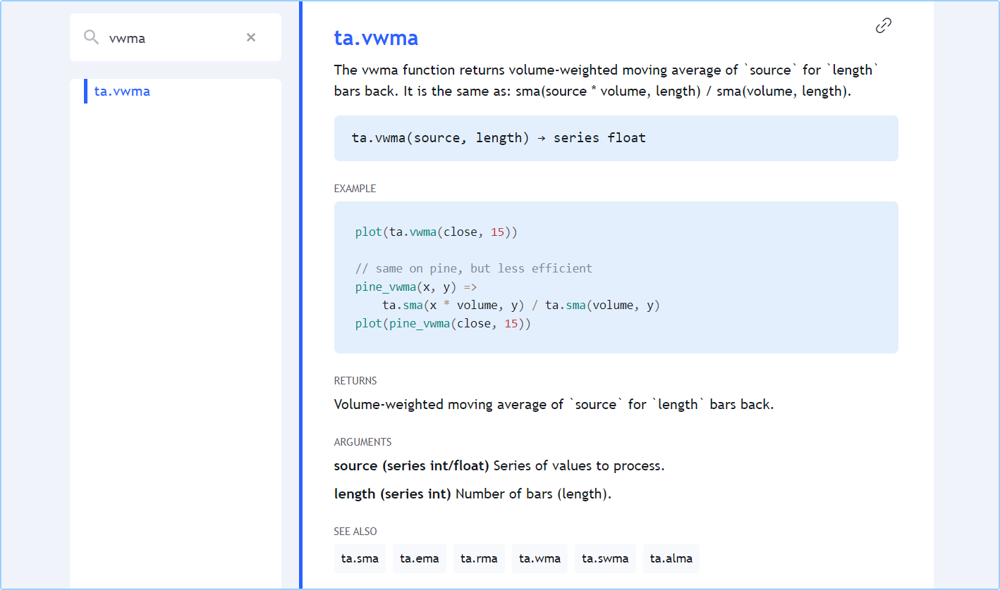

# Incorporados

Pine Script possui centenas de variáveis e funções _incorporadas_. Elas fornecem informações valiosas para os scripts e realizam cálculos, dispensando a necessidade de codificá-los. Quanto mais conhece dos recursos incorporados, mais poderá fazer com Pine Script.

Nesta seção, apresenta uma visão geral de algumas das variáveis e funções incorporadas do Pine Script. Elas serão abordadas com mais detalhes nas páginas deste manual cobrindo temas específicos.

Todas as variáveis e funções integradas são definidas no [Manual de Referência](https://br.tradingview.com/pine-script-reference/v5) do Pine Script v5. É chamado de "Manual de Referência" porque é a referência definitiva sobre a linguagem Pine Script. É uma ferramenta essencial que o acompanhará sempre que estiver codificando em Pine, seja um iniciante ou um especialista. Se está aprendendo a primeira linguagem de programação, faça do [Manual de Referência](https://br.tradingview.com/pine-script-reference/v5/) um grande amigo. Ignorá-lo tornará a experiência de programação com Pine Script difícil e frustrante — assim como seria com qualquer outra linguagem de programação.

Variáveis e funções na mesma família compartilham o mesmo _namespace_ (_espaço de nomes_), que é um prefixo para o nome da função. A função [ta.sma()](https://br.tradingview.com/pine-script-reference/v5/#fun_ta{dot}sma), por exemplo, está no _espaço de nomes_ `ta`, que significa "__technical analysis__" (_análise técnica_). Um _espaço de nomes_ pode conter tanto variáveis quanto funções.

Algumas variáveis também têm versões de função, por exemplo:

- A variável [ta.tr](https://br.tradingview.com/pine-script-reference/v5/#fun_ta{dot}tr) retorna "True Range" (_Amplitude Real_) da barra atual. A chamada de função [ta.tr(true)](https://br.tradingview.com/pine-script-reference/v5/#fun_ta{dot}tr) também retorna "True Range", mas quando o valor anterior de [close](https://br.tradingview.com/pine-script-reference/v5/#var_close), que normalmente é necessário para calculá-la, é [na](https://br.tradingview.com/pine-script-reference/v5/#var_na) e em vez disso, ela calcula usando `high - low`.
- A variável [time](https://br.tradingview.com/pine-script-reference/v5/#var_time) fornece o horário do [open](https://br.tradingview.com/pine-script-reference/v5/#var_open) da barra atual. A função [time(timeframe)](https://br.tradingview.com/pine-script-reference/v5/#fun_time) retorna o horário do [open](https://br.tradingview.com/pine-script-reference/v5/#var_open) da barra do `timeframe` especificado, mesmo se o `timeframe` do gráfico for diferente. A função [time(timeframe, session)](https://br.tradingview.com/pine-script-reference/v5/#fun_time) retorna o horário do [open](https://br.tradingview.com/pine-script-reference/v5/#var_open) da barra do `timeframe` especificado, mas somente se estiver dentro do horário da `session`. A função [time(timeframe, session, timezone)](https://br.tradingview.com/pine-script-reference/v5/#fun_time) retorna o horário do [open](https://br.tradingview.com/pine-script-reference/v5/#var_open) da barra do `timeframe` especificado, mas somente se estiver dentro do `session` no `timezone` especificado.


# Variáveis Incorporadas

Existem variáveis integradas para diferentes propósitos.

Aqui estão alguns exemplos:

- Variáveis relacionadas a _preço_ e _volume_:  [open](https://br.tradingview.com/pine-script-reference/v5/#var_open), [high](https://br.tradingview.com/pine-script-reference/v5/#var_high), [low](https://br.tradingview.com/pine-script-reference/v5/#var_low), [close](https://br.tradingview.com/pine-script-reference/v5/#var_close), [hl2](https://br.tradingview.com/pine-script-reference/v5/#var_hl2), [hlc3](https://br.tradingview.com/pine-script-reference/v5/#var_hlc3), [ohlc4](https://br.tradingview.com/pine-script-reference/v5/#var_ohlc4), e [volume](https://br.tradingview.com/pine-script-reference/v5/#var_volume).
- Informações relacionadas ao símbolo `syminfo`: [syminfo.basecurrency](https://br.tradingview.com/pine-script-reference/v5/#var_syminfo{dot}basecurrency), [syminfo.currency](https://br.tradingview.com/pine-script-reference/v5/#var_syminfo{dot}currency), [syminfo.description](https://br.tradingview.com/pine-script-reference/v5/#var_syminfo{dot}description), [syminfo.mintick](https://br.tradingview.com/pine-script-reference/v5/#var_syminfo{dot}mintick), [syminfo.pointvalue](https://br.tradingview.com/pine-script-reference/v5/#var_syminfo{dot}pointvalue), [syminfo.prefix](https://br.tradingview.com/pine-script-reference/v5/#var_syminfo{dot}prefix), [syminfo.root](https://br.tradingview.com/pine-script-reference/v5/#var_syminfo{dot}root), [syminfo.session](https://br.tradingview.com/pine-script-reference/v5/#var_syminfo{dot}session), [syminfo.ticker](https://br.tradingview.com/pine-script-reference/v5/#var_syminfo{dot}ticker), [syminfo.tickerid](https://br.tradingview.com/pine-script-reference/v5/#var_syminfo{dot}tickerid), [syminfo.timezone](https://br.tradingview.com/pine-script-reference/v5/#var_syminfo{dot}timezone) e [syminfo.type](https://br.tradingview.com/pine-script-reference/v5/#var_syminfo{dot}type).
- Variáveis de `timeframe` (_intervalo de tempo_) (conhecidas como “interval” ou “resolution” ("_intervalo_" ou "_resolução_"), por exemplo, 15seg, 30min, 60min, 1D, 3M): [timeframe.isseconds](https://br.tradingview.com/pine-script-reference/v5/#var_timeframe{dot}isseconds), [timeframe.isminutes](https://br.tradingview.com/pine-script-reference/v5/#var_timeframe{dot}isminutes), [timeframe.isintraday](https://br.tradingview.com/pine-script-reference/v5/#var_timeframe{dot}isintraday), [timeframe.isdaily](https://br.tradingview.com/pine-script-reference/v5/#var_timeframe{dot}isdaily), [timeframe.isweekly](https://br.tradingview.com/pine-script-reference/v5/#var_timeframe{dot}isweekly), [timeframe.ismonthly](https://br.tradingview.com/pine-script-reference/v5/#var_timeframe{dot}ismonthly), [timeframe.isdwm](https://br.tradingview.com/pine-script-reference/v5/#var_timeframe{dot}isdwm), [timeframe.multiplier](https://br.tradingview.com/pine-script-reference/v5/#var_timeframe{dot}multiplier) e [timeframe.period](https://br.tradingview.com/pine-script-reference/v5/#var_timeframe{dot}period).
- Estados do candle em `barstate` (veja [Estados da Barra](./000_bar_states.md)): [barstate.isconfirmed](https://br.tradingview.com/pine-script-reference/v5/#var_barstate{dot}isconfirmed), [barstate.isfirst](https://br.tradingview.com/pine-script-reference/v5/#var_barstate{dot}isfirst), [barstate.ishistory](https://br.tradingview.com/pine-script-reference/v5/#var_barstate{dot}ishistory), [barstate.islast](https://br.tradingview.com/pine-script-reference/v5/#var_barstate{dot}islast), [barstate.islastconfirmedhistory](https://br.tradingview.com/pine-script-reference/v5/#var_barstate{dot}islastconfirmedhistory), [barstate.isnew](https://br.tradingview.com/pine-script-reference/v5/#var_barstate{dot}isnew) e [barstate.isrealtime](https://br.tradingview.com/pine-script-reference/v5/#var_barstate{dot}isrealtime).
- Informações relacionadas à estratégia em `strategy`: [strategy.equity](https://br.tradingview.com/pine-script-reference/v5/#var_strategy{dot}equity), [strategy.initial_capital](https://br.tradingview.com/pine-script-reference/v5/#var_strategy{dot}initial_capital), [strategy.grossloss](https://br.tradingview.com/pine-script-reference/v5/#var_strategy{dot}grossloss), [strategy.grossprofit](https://br.tradingview.com/pine-script-reference/v5/#var_strategy{dot}grossprofit), [strategy.wintrades](https://br.tradingview.com/pine-script-reference/v5/#var_strategy{dot}wintrades), [strategy.losstrades](https://br.tradingview.com/pine-script-reference/v5/#var_strategy{dot}losstrades), [strategy.position_size](https://br.tradingview.com/pine-script-reference/v5/#var_strategy{dot}position_size), [strategy.position_avg_price](https://br.tradingview.com/pine-script-reference/v5/#var_strategy{dot}position_avg_price), [strategy.wintrades](https://br.tradingview.com/pine-script-reference/v5/#var_strategy{dot}wintrades), etc.


# Funções Incorporadas

Muitas funções são usadas pelo(s) resultado(s) que retornam.

Estes são alguns exemplos:

- Funções relacionadas à matemática no _espaço de nomes_ em `math`: [math.abs()](https://br.tradingview.com/pine-script-reference/v5/#fun_math{dot}abs), [math.log()](https://br.tradingview.com/pine-script-reference/v5/#fun_math{dot}log), [math.max()](https://br.tradingview.com/pine-script-reference/v5/#fun_math{dot}max), [math.random()](https://br.tradingview.com/pine-script-reference/v5/#fun_math{dot}random), [math.round_to_mintick()](https://br.tradingview.com/pine-script-reference/v5/#fun_math{dot}round_to_mintick), etc.
- Indicadores técnicos em `ta`: [ta.sma()](https://br.tradingview.com/pine-script-reference/v5/#fun_ta{dot}sma), [ta.ema()](https://br.tradingview.com/pine-script-reference/v5/#fun_ta{dot}ema), [ta.macd()](https://br.tradingview.com/pine-script-reference/v5/#fun_ta{dot}macd), [ta.rsi()](https://br.tradingview.com/pine-script-reference/v5/#fun_ta{dot}rsi), [ta.supertrend()](https://br.tradingview.com/pine-script-reference/v5/#fun_ta{dot}supertrend), etc.
- Funções de suporte bastante utilizadas para calcular indicadores técnicos no _espaço de nomes_ em `ta`: [ta.barssince()](https://br.tradingview.com/pine-script-reference/v5/#fun_ta{dot}barssince), [ta.crossover()](https://br.tradingview.com/pine-script-reference/v5/#fun_ta{dot}crossover), [ta.highest()](https://br.tradingview.com/pine-script-reference/v5/#fun_ta{dot}highest), etc.
- Funções para solicitar dados de outros símbolos ou timeframes em `request`: [request.dividends()](https://br.tradingview.com/pine-script-reference/v5/#fun_request{dot}dividends), [request.earnings()](https://br.tradingview.com/pine-script-reference/v5/#fun_request{dot}earnings), [request.financial()](https://br.tradingview.com/pine-script-reference/v5/#fun_request{dot}financial), [request.quandl()](https://br.tradingview.com/pine-script-reference/v5/#fun_request{dot}quandl), [request.security()](https://br.tradingview.com/pine-script-reference/v5/#fun_request{dot}security), [request.splits()](https://br.tradingview.com/pine-script-reference/v5/#fun_request{dot}splits).
- Funções para manipular strings em `str`: [str.format()](https://br.tradingview.com/pine-script-reference/v5/#fun_str{dot}format), [str.length()](https://br.tradingview.com/pine-script-reference/v5/#fun_str{dot}length), [str.tonumber()](https://br.tradingview.com/pine-script-reference/v5/#fun_str{dot}tonumber), [str.tostring()](https://br.tradingview.com/pine-script-reference/v5/#fun_str{dot}tostring), etc.
- Funções usadas para definir os valores de input (_entrada_) que os usuários do script podem modificar na guia "Settings/Inputs" ("_Configurações/Entradas_") do script, no _espaço de nomes_ em `input`: [input()](https://br.tradingview.com/pine-script-reference/v5/#fun_input), [input.color()](https://br.tradingview.com/pine-script-reference/v5/#fun_input{dot}color), [input.int()](https://br.tradingview.com/pine-script-reference/v5/#fun_input{dot}int), [input.session()](https://br.tradingview.com/pine-script-reference/v5/#fun_input{dot}session), [input.symbol()](https://br.tradingview.com/pine-script-reference/v5/#fun_input{dot}symbol), etc.
- Funções usadas para manipular cores em `color`: [color.from_gradient()](https://br.tradingview.com/pine-script-reference/v5/#fun_color{dot}from_gradient), [color.new()](https://br.tradingview.com/pine-script-reference/v5/#fun_color{dot}new), [color.rgb()](https://br.tradingview.com/pine-script-reference/v5/#fun_color{dot}rgb), etc.

Algumas funções não retornam resultado(s), mas são usadas por seus efeitos colaterais/adicionais, o que significa que fazem alguma ação, mesmo que não retornem um resultado:

- Funções usadas como instrução de declaração que define um dos três tipos de scripts em Pine e suas propriedades. Cada script deve começar com uma chamada a uma dessas funções: [indicator()](https://br.tradingview.com/pine-script-reference/v5/#fun_indicator), [strategy()](https://br.tradingview.com/pine-script-reference/v5/#fun_strategy) ou [library()](https://br.tradingview.com/pine-script-reference/v5/#fun_library).
- Funções de plotagem ou coloração: [bgcolor()](https://br.tradingview.com/pine-script-reference/v5/#fun_bgcolor), [plotbar()](https://br.tradingview.com/pine-script-reference/v5/#fun_plotbar), [plotcandle()](https://br.tradingview.com/pine-script-reference/v5/#fun_plotcandle), [plotchar()](https://br.tradingview.com/pine-script-reference/v5/#fun_plotchar), [plotshape()](https://br.tradingview.com/pine-script-reference/v5/#fun_plotshape), [fill()](https://br.tradingview.com/pine-script-reference/v5/#fun_fill).
- Funções de estratégia para pedidos de ordens, no _espaço de nomes_ em `strategy`: [strategy.cancel()](https://br.tradingview.com/pine-script-reference/v5/#fun_strategy{dot}cancel), [strategy.close()](https://br.tradingview.com/pine-script-reference/v5/#fun_strategy{dot}close), [strategy.entry()](https://br.tradingview.com/pine-script-reference/v5/#fun_strategy{dot}entry), [strategy.exit()](https://br.tradingview.com/pine-script-reference/v5/#fun_strategy{dot}exit), [strategy.order()](https://br.tradingview.com/pine-script-reference/v5/#fun_strategy{dot}order), etc.
- Funções de estratégia que retornam informações sobre negociações passadas em `strategy`: [strategy.closedtrades.entry_bar_index()](https://br.tradingview.com/pine-script-reference/v5/#fun_strategy{dot}closedtrades{dot}entry_bar_index), [strategy.closedtrades.entry_price()](https://br.tradingview.com/pine-script-reference/v5/#fun_strategy{dot}closedtrades{dot}entry_price), [strategy.closedtrades.entry_time()](https://br.tradingview.com/pine-script-reference/v5/#fun_strategy{dot}closedtrades{dot}entry_time), [strategy.closedtrades.exit_bar_index()](https://br.tradingview.com/pine-script-reference/v5/#fun_strategy{dot}closedtrades{dot}exit_bar_index), [strategy.closedtrades.max_drawdown()](https://br.tradingview.com/pine-script-reference/v5/#fun_strategy{dot}closedtrades{dot}max_drawdown), [strategy.closedtrades.max_runup()](https://br.tradingview.com/pine-script-reference/v5/#fun_strategy{dot}closedtrades{dot}max_runup), [strategy.closedtrades.profit()](https://br.tradingview.com/pine-script-reference/v5/#fun_strategy{dot}closedtrades{dot}profit), etc.
- Funções para gerar eventos de alerta: [alert()](https://br.tradingview.com/pine-script-reference/v5/#fun_alert) e [alertcondition()](https://br.tradingview.com/pine-script-reference/v5/#fun_alertcondition).

Outras funções retornam um resultado, mas nem sempre é utilizado, por exemplo: [hline()](https://br.tradingview.com/pine-script-reference/v5/#fun_hline), [plot()](https://br.tradingview.com/pine-script-reference/v5/#fun_plot), [array.pop()](https://br.tradingview.com/pine-script-reference/v5/#fun_array{dot}pop), [label.new()](https://br.tradingview.com/pine-script-reference/v5/#fun_label{dot}new), etc.

Todas as funções embutidas são definidas no [Manual de Referência](https://br.tradingview.com/pine-script-reference/v5) do Pine Script v5. Pode-se clicar em qualquer um dos nomes das funções listadas para ir para sua entrada no _Manual de Referência_, que documenta a assinatura da função, ou seja, a lista de _parâmetros_ que é aceita e o tipo qualificado do valor ou valores que é retornado (uma função pode retornar mais de um resultado).

A entrada no _Manual de Referência_ também listará, para cada parâmetro:

- Seu nome.
- O tipo qualificado do valor que requer (é usado _argumento_ para nomear os valores passados para uma função ao chamá-la).
- Se o parâmetro é obrigatório ou não.

Todas as funções incorporadas têm um ou mais parâmetros definidos em sua assinatura. Nem todos os parâmetros são necessários para cada função.

Observando a função [ta.vwma()](https://br.tradingview.com/pine-script-reference/v5/#fun_ta{dot}vwma), que retorna a média móvel ponderada pelo volume de um valor de origem. Este é o seu registro no [Manual de Referência](https://br.tradingview.com/pine-script-reference/v5):



O registro fornece as informações necessárias para usá-lo:

- O que a função faz.
- Sua assinatura (ou definição):
```c
ta.vwma(source, length) → series float
```
- Os parâmetros incluídos: `source` e `length`.
- O tipo qualificado do resultado retornado: "series float".
- Um exemplo mostrando seu uso: `plot(ta.vwma(close, 15))`.
- Um exemplo mostrando o que faz, mas em um _maior_ formato, para que possa entender melhor seus cálculos. Note que isso é destinado a explicar (não como código utilizável, porque é mais complicado e leva mais tempo para ser executado). Há apenas desvantagens em usar a forma longa.
- A seção "RETURNS" ("_RETORNA_") explica exatamente qual valor a função retorna.
- A seção "ARGUMENTS" ("_ARGUMENTOS_") lista cada parâmetro e fornece informações críticas sobre qual tipo qualificado é necessário para os argumentos usados ao chamar a função.
- A seção "SEE ALSO" ("_VEJA TAMBÉM_") o remete a entradas relacionadas no [Manual de Referência](https://br.tradingview.com/pine-script-reference/v5).

Este é um chamado à função em uma linha de código que declara uma variável `myVwma` e atribui o resultado de `ta.vwma(close, 20)` a ela:

```c
myVwma = ta.vwma(close, 20)
```

__Note que:__

- Usa-se a variável incorporada [close](https://br.tradingview.com/pine-script-reference/v5/#var_close) como argumento para o parâmetro `source`.
- Usa-se `20` como argumento para o parâmetro `length`.
- Se colocado no escopo global (isto é, iniciando na primeira posição de uma linha), será executado pelo tempo de execução do Pine Script em cada barra do gráfico.

Também pode-se usar os nomes dos parâmetros ao chamar a função. Os nomes dos parâmetros são chamados de _argumentos de palavra-chave_ quando usados em uma chamada de função:

```c
myVwma = ta.vwma(source = close, length = 20)
```

Consegue-se alterar a posição dos argumentos ao usar argumentos de palavra-chave, mas apenas se os usar para todos seus argumentos. Ao chamar funções com muitos parâmetros, como [indicator()](https://br.tradingview.com/pine-script-reference/v5/#fun_indicator), pode-se também evitar argumentos de palavra-chave para os primeiros argumentos, desde que _ignore nenhum_. Se ignorar, então deve usar argumentos de palavra-chave para que o compilador Pine Script possa descobrir a qual parâmetro se correspondem.

Por exemplo:

```c
indicator("Example", "Ex", true, max_bars_back = 100)
```

Misturar as coisas dessa maneira não é permitido:

```c
indicator(precision = 3, "Example") // Compilation error!
```

__Ao chamar funções incorporadas, é crucial garantir que os argumentos utilizados sejam do tipo qualificado necessário, que variará para cada parâmetro.__

Para aprender a fazer isso, é necessário entender o [Sistema de Tipos](./04_09_tipagem_do_sistema.md) do Pine Script. A entrada no Manual de Referência para cada função integrada inclui uma seção "ARGUMENTS" ("_ARGUMENTOS_") que lista o tipo qualificado necessário para o argumento fornecido a cada um dos parâmetros da função.
