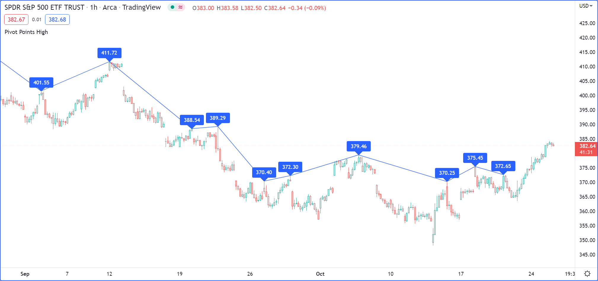

# Objetos

> __Observação__\
> Esta seção contém material avançado. Se és um programador iniciante em Pine Script, recomendamos que se familiarize com outros recursos do Pine Script, mais acessíveis, antes de se _aventurar_ nessa parte.

Os objetos Pine Script são instâncias de _tipos definidos pelo usuário (UDTs)_. São equivalentes a variáveis contendo partes chamadas de _fields_ (_campos_), cada uma capaz de conter valores independentes que podem ser de vários tipos.

Programadores experientes podem pensar nos _UDTs_ como classes sem métodos. Permitindo aos usuários que criem tipos personalizados que organizam diferentes valores sob uma única entidade lógica.


# Criando Objetos

Antes que um objeto possa ser criado, seu tipo deve ser definido. A seção [Tipos Definidos pelo Usuário](./04_09_tipagem_do_sistema.md#tipos-definidos-pelo-usuário) do [Sistema de Tipos](./04_09_tipagem_do_sistema.md) explica como deve ser feito.

Definindo um tipo `pivotPoint` para armazenar informações de ponto de pivô:

```c
type pivotPoint
    int x
    float y
    string xloc = xloc.bar_time
```

Note que:

- Usa-se a palavra-chave [type](https://br.tradingview.com/pine-script-reference/v5/#kw_type) para declarar a criação de um _UDT_.
- Nomea-se o _UDT_ como `pivotPoint`.
- Após a primeira linha, cria-se um bloco local contendo o tipo e o nome de cada campo.
- O campo `x` irá armazenar a _coordenada-x_ do pivô. É declarado como um "int" porque irá conter ou um carimbo de _timestamp_ ou um _index_ do tipo "int".
- O `y` é um "float" porque irá armazenar o preço do pivô.
- O `xloc` é um campo que especificará as unidades de `x`: [xloc.bar_index](https://br.tradingview.com/pine-script-reference/v5/#const_xloc{dot}bar_index) ou [xloc.bar_time](https://br.tradingview.com/pine-script-reference/v5/#const_xloc{dot}bar_time). Definindo seu valor padrão como [xloc.bar_time](https://br.tradingview.com/pine-script-reference/v5/#const_xloc{dot}bar_time) usando o operador `=`. Quando um objeto é criado a partir desse _UDT_, seu campo `xloc` será definido para esse valor.

Agora que o _UDT_ `pivotPoint` está definido, consegue-se prosseguir para criar objetos a partir dele. Criando objetos usando o método integrado `new()` do _UDT_. Para criar um novo objeto `foundPoint` do _UDT_ `pivotPoint`, usa-se:

```c
foundPoint = pivotPoint.new()
```

Também pode-se especificar valores dos campos para o objeto criado usando o seguinte:

```c
foundPoint = pivotPoint.new(time, high)
```

Ou equivalente:

```c
foundPoint = pivotPoint.new(x = time, y = high)
```

Neste ponto, o campo `x` do objeto `foundPoint` conterá o valor da variável incorporada [time](https://br.tradingview.com/pine-script-reference/v5/#var_time) quando for criado, `y` conterá o valor de [high](https://br.tradingview.com/pine-script-reference/v5/#var_high) e o campo `xloc` conterá o valor padrão de [xloc.bar_time](https://br.tradingview.com/pine-script-reference/v5/#const_xloc{dot}bar_time) porque nenhum valor foi definido para criar o objeto.

_Object placeholders_ (_Espaços reservados de objeto_) também podem ser criados ao declarar nomes de objetos [na](https://br.tradingview.com/pine-script-reference/v5/#var_na) usando o seguinte:

```c
pivotPoint foundPoint = na
```

O exemplo abaixo exibe um _label_ onde os pivot de alta são detectados. Os pivot são detectados `legsInput` barras após ocorrerem, então deve-se plotar o _label_ no passado para que apareça no pivot:

```c
//@version=5
indicator("Pivot labels", overlay = true)
int legsInput = input(10)

// Define the `pivotPoint` UDT.
type pivotPoint
    int x
    float y
    string xloc = xloc.bar_time

// Detect high pivots.
pivotHighPrice = ta.pivothigh(legsInput, legsInput)
if not na(pivotHighPrice)
    // A new high pivot was found; display a label where it occurred `legsInput` bars back.
    foundPoint = pivotPoint.new(time[legsInput], pivotHighPrice)
    label.new(
      foundPoint.x,
      foundPoint.y,
      str.tostring(foundPoint.y, format.mintick),
      foundPoint.xloc,
      textcolor = color.white)
```

Repare nesta linha do exemplo acima:

```c
foundPoint = pivotPoint.new(time[legsInput], pivotHighPrice)
```

Isso também poderia ser feito usando o seguinte:

```c
pivotPoint foundPoint = na
foundPoint := pivotPoint.new(time[legsInput], pivotHighPrice)
```

Ao usar a palavra-chave [var](https://br.tradingview.com/pine-script-reference/v5/#kw_var) ao declarar uma variável atribuída a um objeto de um [tipo definido pelo usuário](./04_09_tipagem_do_sistema.md#tipos-definidos-pelo-usuário), a palavra-chave se aplica automaticamente a todos os campos do objeto:

```c
//@version=5
indicator("Objects using `var` demo")

//@type A custom type to hold index, price, and volume information.
type BarInfo
    int   index = bar_index
    float price = close
    float vol   = volume

//@variable A `BarInfo` instance whose fields persist through all iterations, starting from the first bar.
var BarInfo firstBar = BarInfo.new()
//@variable A `BarInfo` instance declared on every bar.
BarInfo currentBar = BarInfo.new()

// Plot the `index` fields of both instances to compare the difference.
plot(firstBar.index)
plot(currentBar.index)
```

É importante observar que atribuir um objeto a uma variável que usa a palavra-chave [varip](https://br.tradingview.com/pine-script-reference/v5/#kw_varip) _não_ permite automaticamente que os campos do objeto persistam sem reverter em cada atualização _intrabarra_. É necessário aplicar a palavra-chave a cada campo desejado na declaração do tipo para alcançar tal comportamento.

Por exemplo:

```c
//@version=5
indicator("Objects using `varip` fields demo")

//@type A custom type that counts the bars and ticks in the script's execution.
type Counter
    int       bars  = 0
    varip int ticks = 0

//@variable A `Counter` object whose reference persists throughout all bars.
var Counter counter = Counter.new()

// Add 1 to the `bars` and `ticks` fields. The `ticks` field is not subject to rollback on unconfirmed bars.
counter.bars  += 1
counter.ticks += 1

// Plot both fields for comparison.
plot(counter.bars, "Bar counter", color.blue, 3)
plot(counter.ticks, "Tick counter", color.purple, 3)
```

Observe que:

- Utiliza-se a palavra-chave [var](https://br.tradingview.com/pine-script-reference/v5/#kw_var) para especificar que o objeto `Counter` atribuído à variável `counter` persiste durante a execução do script.
- O campo `bars` reverte em barras em tempo real, enquanto o campo `ticks` não reverte, pois foi incluído [varip](https://br.tradingview.com/pine-script-reference/v5/#kw_varip) na declaração.


# Alterando Valores dos Campos

O valor dos campos de um objeto pode ser alterado usando o operador de reatribuição [:=](./000_operators.md#operador-de-reatribuição).

Olhe esta linha do exemplo anterior:

```c
foundPoint = pivotPoint.new(time[legsInput], pivotHighPrice)
```

Pode ser escrita da seguinte maneira:

```c
foundPoint = pivotPoint.new()
foundPoint.x := time[legsInput]
foundPoint.y := pivotHighPrice
```


# Coletando Objetos

As coleções do Pine Script ([arrays](./000_arrays.md), [matrices](./000_matrices.md), e [maps](./000_maps.md)) (_arrays_, _matrizes_ e _mapas_) podem conter objetos, permitindo aos usuários adicionar dimensões virtuais às suas estruturas de dados. Para declarar uma coleção de objetos, passe o nome de um _UDT_ em seu [Template de Tipo](./04_09_tipagem_do_sistema.md#templates-de-tipo).

O exemplo a seguir declara um [array](https://br.tradingview.com/pine-script-reference/v5/#type_array) vazio que conterá objetos de um tipo definido pelo usuário chamado `pivotPoint`:

```c
pivotHighArray = array.new<pivotPoint>()
```

Para declarar explicitamente o tipo de uma variável como um [array](https://br.tradingview.com/pine-script-reference/v5/#type_array), [matrices](https://br.tradingview.com/pine-script-reference/v5/#type_matrix) ou [maps](https://br.tradingview.com/pine-script-reference/v5/#type_map) de um [tipo definido pelo usuário](./04_09_tipagem_do_sistema.md#tipos-definidos-pelo-usuário), use a palavra-chave de tipo da coleção seguida pelo seu [modelo de tipo](./04_09_tipagem_do_sistema.md#templates-de-tipo).

Por exemplo:

```c
var array<pivotPoint> pivotHighArray = na
pivotHighArray := array.new<pivotPoint>()
```

Usando o que foi aprendido para criar um script que detecta pontos de pivot altos. O script primeiro coleta informações de pivot históricas em um [array](https://br.tradingview.com/pine-script-reference/v5/#type_array). Em seguida, ele percorre o array na última barra histórica, criando um _label_ para cada pivot e conectando os pivots com linhas:



```c
//@version=5
indicator("Pivot Points High", overlay = true)

int legsInput = input(10)

// Define the `pivotPoint` UDT containing the time and price of pivots.
type pivotPoint
    int openTime
    float level

// Create an empty `pivotPoint` array.
var pivotHighArray = array.new<pivotPoint>()

// Detect new pivots (`na` is returned when no pivot is found).
pivotHighPrice = ta.pivothigh(legsInput, legsInput)

// Add a new `pivotPoint` object to the end of the array for each detected pivot.
if not na(pivotHighPrice)
    // A new pivot is found; create a new object of `pivotPoint` type, setting its `openTime` and `level` fields.
    newPivot = pivotPoint.new(time[legsInput], pivotHighPrice)
    // Add the new pivot object to the array.
    array.push(pivotHighArray, newPivot)

// On the last historical bar, draw pivot labels and connecting lines.
if barstate.islastconfirmedhistory
    var pivotPoint previousPoint = na
    for eachPivot in pivotHighArray
        // Display a label at the pivot point.
        label.new(eachPivot.openTime, eachPivot.level, str.tostring(eachPivot.level, format.mintick), xloc.bar_time, textcolor = color.white)
        // Create a line between pivots.
        if not na(previousPoint)
            // Only create a line starting at the loop's second iteration because lines connect two pivots.
            line.new(previousPoint.openTime, previousPoint.level, eachPivot.openTime, eachPivot.level, xloc = xloc.bar_time)
        // Save the pivot for use in the next iteration.
        previousPoint := eachPivot
```


<!-- # Copiando Objetos

No Pine, objetos são atribuídos por referência. Quando um objeto existente é atribuído a uma nova variável, ambas apontam para o mesmo objeto.

No exemplo abaixo, criamos um objeto pivot1 e definimos seu campo x como 1000. Em seguida, declaramos uma variável pivot2 contendo a referência ao objeto pivot1, então ambas apontam para a mesma instância. Alterar pivot2.x também alterará pivot1.x, pois ambas se referem ao campo x do mesmo objeto: -->