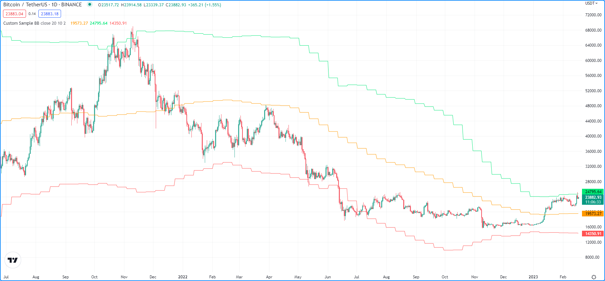
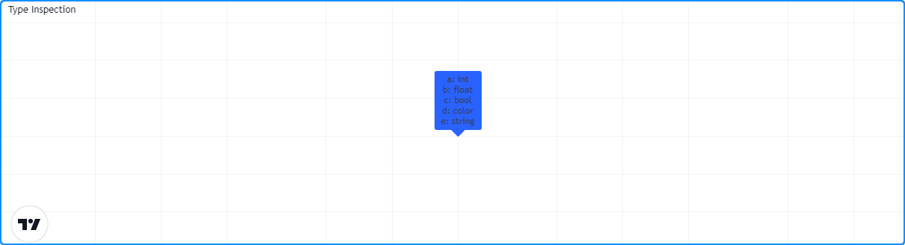

# Métodos

> __Observação__\
> Esta seção contém material avançado. Se és um programador iniciante em Pine Script, recomendamos que se familiarize com outros recursos do Pine Script, mais acessíveis, antes de se _aventurar_ nessa parte.

Os métodos do Pine Script são funções especializadas associadas a instâncias específicas de [tipos](./04_09_tipagem_do_sistema.md) incorporados ou definidos pelo usuário. São essencialmente os mesmos que funções regulares na maioria dos aspectos, mas oferecem uma sintaxe mais curta e conveniente. Os usuários podem acessar os métodos utilizando a _dot notation_ (_notação de ponto_) diretamente nas variáveis, assim como acessam os campos de um [objeto](./04_12_objetos.md) do Pine Script.


# Métodos Incorporados

O Pine Script inclui métodos integrados para todos os _tipos especiais_, incluindo [array](https://br.tradingview.com/pine-script-reference/v5/#type_array), [matrix](https://br.tradingview.com/pine-script-reference/v5/#type_matrix), [map](https://br.tradingview.com/pine-script-reference/v5/#type_map), [line](https://br.tradingview.com/pine-script-reference/v5/#type_line), [linefill](https://br.tradingview.com/pine-script-reference/v5/#type_linefill), [box](https://br.tradingview.com/pine-script-reference/v5/#type_box), [polyline](https://br.tradingview.com/pine-script-reference/v5/#type_polyline), [label](https://br.tradingview.com/pine-script-reference/v5/#type_label), e [table](https://br.tradingview.com/pine-script-reference/v5/#type_table) (_array_, _matriz_, _mapa_, _linha_, _preenchimento de linha_, _caixa_, _polilinha_, _rótulo_ e _tabela_). Esses métodos oferecem aos usuários uma maneira mais concisa de chamar rotinas especializadas para esses tipos dentro dos scripts.

Ao usar esses tipos especiais, as expressões:

```c
<namespace>.<functionName>([paramName =] <objectName>, …)
```

E:

```c
<objectName>.<functionName>(…)
```

São equivalentes. Por exemplo, em vez de usar:

```c
array.get(id, index)
```

Para obter o valor de um `id` de array no `index` especificado, pode-se simplesmente usar:

```c
id.get(index)
```

Para alcançar o mesmo efeito. Esta notação elimina a necessidade dos usuários referenciarem o _namespace_ da função, já que [get()](https://br.tradingview.com/pine-script-reference/v5/#fun_array{dot}get) é um método de `id` neste contexto.

Abaixo está um exemplo prático para demonstrar o uso de métodos integrados em lugar de funções.

O script a seguir calcula as _Bandas de Bollinger_ sobre um número especificado de preços amostrados uma vez a cada `n` barras. Chamando [array.push()](https://br.tradingview.com/pine-script-reference/v5/#fun_array{dot}push) e [array.shift()](https://br.tradingview.com/pine-script-reference/v5/#fun_array{dot}shift) para enfileirar valores de `sourceInput` através do `sourceArray`, em seguida [array.avg()](https://br.tradingview.com/pine-script-reference/v5/#fun_array{dot}avg) e [array.stdev()](https://br.tradingview.com/pine-script-reference/v5/#fun_array{dot}stdev) para calcular o `sampleMean` e `sampleDev`. O script então utiliza esses valores para calcular o `highBand` e `lowBand`, que é plotado no gráfico junto com o `sampleMean`:



```c
//@version=5
indicator("Custom Sample BB", overlay = true)

float sourceInput  = input.source(close, "Source")
int   samplesInput = input.int(20, "Samples")
int   n            = input.int(10, "Bars")
float multiplier   = input.float(2.0, "StdDev")

var array<float> sourceArray = array.new<float>(samplesInput)
var float        sampleMean  = na
var float        sampleDev   = na

// Identify if `n` bars have passed.
if bar_index % n == 0
    // Update the queue.
    array.push(sourceArray, sourceInput)
    array.shift(sourceArray)
    // Update the mean and standard deviaiton values.
    sampleMean := array.avg(sourceArray)
    sampleDev  := array.stdev(sourceArray) * multiplier

// Calculate bands.
float highBand = sampleMean + sampleDev
float lowBand  = sampleMean - sampleDev

plot(sampleMean, "Basis", color.orange)
plot(highBand, "Upper", color.lime)
plot(lowBand, "Lower", color.red)
```

Reescrevendo este código para utilizar métodos em vez de funções integradas. Nesta versão, foi substituído todas as funções integradas [array.*](https://br.tradingview.com/pine-script-reference/v5/#type_array) no script por métodos equivalentes:

```c
//@version=5
indicator("Custom Sample BB", overlay = true)

float sourceInput  = input.source(close, "Source")
int   samplesInput = input.int(20, "Samples")
int   n            = input.int(10, "Bars")
float multiplier   = input.float(2.0, "StdDev")

var array<float> sourceArray = array.new<float>(samplesInput)
var float        sampleMean  = na
var float        sampleDev   = na

// Identify if `n` bars have passed.
if bar_index % n == 0
    // Update the queue.
    sourceArray.push(sourceInput)
    sourceArray.shift()
    // Update the mean and standard deviaiton values.
    sampleMean := sourceArray.avg()
    sampleDev  := sourceArray.stdev() * multiplier

// Calculate band values.
float highBand = sampleMean + sampleDev
float lowBand  = sampleMean - sampleDev

plot(sampleMean, "Basis", color.orange)
plot(highBand, "Upper", color.lime)
plot(lowBand, "Lower", color.red)
```

Observe que:

- Chama-se os métodos do array usando `sourceArray.*` em vez de referenciar o _namespace_ do [array](https://br.tradingview.com/pine-script-reference/v5/#type_array).
- Não é incluído `sourceArray` como um parâmetro quando chama-se os métodos, uma vez que já fazem referência ao objeto.


# Métodos Definidos pelo Usuário

O Pine Script permite que os usuários definam métodos personalizados para uso com objetos de qualquer tipo embutido ou definido pelo usuário.
Definir um método é essencialmente o mesmo que definir uma função, mas com duas principais diferenças:

- A palavra-chave [method](https://br.tradingview.com/pine-script-reference/v5/#kw_method) deve ser incluída antes do nome da função.
- O tipo do primeiro parâmetro na assinatura deve ser explicitamente declarado, pois representa o tipo de objeto ao qual o método será associado.

```c
[export] method <functionName>(<paramType> <paramName> [= <defaultValue>], …) =>
    <functionBlock>
```

Aplicando métodos definidos pelo usuário ao exemplo anterior de _Bandas de Bollinger_ para encapsular operações do escopo global, na qual simplificará o código e promoverá a reutilização.

Veja esta parte do exemplo:

```c
// Identify if `n` bars have passed.
if bar_index % n == 0
    // Update the queue.
    sourceArray.push(sourceInput)
    sourceArray.shift()
    // Update the mean and standard deviaiton values.
    sampleMean := sourceArray.avg()
    sampleDev  := sourceArray.stdev() * multiplier

// Calculate band values.
float highBand = sampleMean + sampleDev
float lowBand  = sampleMean - sampleDev
```

Definindo um método simples para enfileirar valores através de um array em uma única chamada.
Este método `maintainQueue()` invoca os métodos [push()](https://br.tradingview.com/pine-script-reference/v5/#fun_array{dot}push) e [shift()](https://br.tradingview.com/pine-script-reference/v5/#fun_array{dot}shift) no `srcArray` quando `takeSample` é `true` e retorna o objeto:

```c
// @function         Maintains a queue of the size of `srcArray`.
//                   It appends a `value` to the array and removes its oldest element at position zero.
// @param srcArray   (array<float>) The array where the queue is maintained.
// @param value      (float) The new value to be added to the queue.
//                   The queue's oldest value is also removed, so its size is constant.
// @param takeSample (bool) A new `value` is only pushed into the queue if this is true.
// @returns          (array<float>) `srcArray` object.
method maintainQueue(array<float> srcArray, float value, bool takeSample = true) =>
    if takeSample
        srcArray.push(value)
        srcArray.shift()
    srcArray
```

Note que:

- Assim como com funções definidas pelo usuário, usa-se a [anotação de compilador](./04_03_estrutura_do_script.md#anotações-do-compilador) `@function` para documentar descrições de métodos.

Agora pode substituir `sourceArray.push()` e `sourceArray.shift()` por `sourceArray.maintainQueue()` no seguinte exemplo:

```c
// Identify if `n` bars have passed.
if bar_index % n == 0
    // Update the queue.
    sourceArray.maintainQueue(sourceInput)
    // Update the mean and standard deviaiton values.
    sampleMean  := sourceArray.avg()
    sampleDev   := sourceArray.stdev() * multiplier

// Calculate band values.
float highBand  = sampleMean + sampleDev
float lowBand   = sampleMean - sampleDev
```

A partir daqui, é possível simplificar ainda mais o código definindo um método que lida com todos os cálculos das _Bandas de Bollinger_ dentro do próprio escopo.

O método `calcBB()` aciona os métodos [avg()](https://br.tradingview.com/pine-script-reference/v5/#fun_array{dot}avg) e [stdev()](https://br.tradingview.com/pine-script-reference/v5/#fun_array{dot}stdev) no `srcArray` para atualizar os valores de `mean` e `dev` quando `calculate` for `true`. O método utiliza esses valores para retornar uma tupla contendo os valores de _basis_, _upper band_, e _lower band_ (_base_, _banda superior_ e _banda inferior_), respectivamente:

```c
// @function         Computes Bollinger Band values from an array of data.
// @param srcArray   (array<float>) The array where the queue is maintained.
// @param multiplier (float) Standard deviaiton multiplier.
// @param calcuate   (bool) The method will only calculate new values when this is true.
// @returns          A tuple containing the basis, upper band, and lower band respectively.
method calcBB(array<float> srcArray, float mult, bool calculate = true) =>
    var float mean = na
    var float dev  = na
    if calculate
        // Compute the mean and standard deviation of the array.
        mean := srcArray.avg()
        dev  := srcArray.stdev() * mult
    [mean, mean + dev, mean - dev]
```

Com este método, agora é possível remover os cálculos das _Bandas de Bollinger_ do escopo global e melhorar a legibilidade do código:

```c
// Identify if `n` bars have passed.
bool newSample = bar_index % n == 0

// Update the queue and compute new BB values on each new sample.
[sampleMean, highBand, lowBand] = sourceArray.maintainQueue(sourceInput, newSample).calcBB(multiplier, newSample)
```

Perceba que:

- Em vez de usar um bloco `if` no escopo global, foi definido uma variável `newSample` que é `true` apenas uma vez a cada `n` barras. Os métodos `maintainQueue()` e `calcBB()` utilizam esse valor para seus respectivos parâmetros `takeSample` e `calculate`.
- Uma vez que o método `maintainQueue()` retorna o objeto ao qual se refere, é possível invocar `calcBB()` na mesma linha de código, já que ambos os métodos se aplicam a instâncias de `array<float>`.

Eis como o script completo se apresenta após a aplicação dos métodos definidos pelo usuário:

```c
//@version=5
indicator("Custom Sample BB", overlay = true)

float sourceInput  = input.source(close, "Source")
int   samplesInput = input.int(20, "Samples")
int   n            = input.int(10, "Bars")
float multiplier   = input.float(2.0, "StdDev")

var array<float> sourceArray = array.new<float>(samplesInput)

// @function         Maintains a queue of the size of `srcArray`.
//                   It appends a `value` to the array and removes its oldest element at position zero.
// @param srcArray   (array<float>) The array where the queue is maintained.
// @param value      (float) The new value to be added to the queue.
//                   The queue's oldest value is also removed, so its size is constant.
// @param takeSample (bool) A new `value` is only pushed into the queue if this is true.
// @returns          (array<float>) `srcArray` object.
method maintainQueue(array<float> srcArray, float value, bool takeSample = true) =>
    if takeSample
        srcArray.push(value)
        srcArray.shift()
    srcArray

// @function         Computes Bollinger Band values from an array of data.
// @param srcArray   (array<float>) The array where the queue is maintained.
// @param multiplier (float) Standard deviaiton multiplier.
// @param calcuate   (bool) The method will only calculate new values when this is true.
// @returns          A tuple containing the basis, upper band, and lower band respectively.
method calcBB(array<float> srcArray, float mult, bool calculate = true) =>
    var float mean = na
    var float dev  = na
    if calculate
        // Compute the mean and standard deviation of the array.
        mean := srcArray.avg()
        dev  := srcArray.stdev() * mult
    [mean, mean + dev, mean - dev]

// Identify if `n` bars have passed.
bool newSample = bar_index % n == 0

// Update the queue and compute new BB values on each new sample.
[sampleMean, highBand, lowBand] = sourceArray.maintainQueue(sourceInput, newSample).calcBB(multiplier, newSample)

plot(sampleMean, "Basis", color.orange)
plot(highBand, "Upper", color.lime)
plot(lowBand, "Lower", color.red)
```


# Sobrecarga de Métodos

Métodos definidos pelo usuário podem sobrescrever e sobrecarregar métodos integrados e definidos pelo usuário já existentes com o mesmo identificador. Essa capacidade permite aos usuários definir múltiplas rotinas associadas a diferentes assinaturas de parâmetros sob o mesmo nome de método.

Como um exemplo simples, suponha a definição de um método para identificar o tipo de uma variável. Uma vez que é necessário especificar explicitamente o tipo de objeto associado a um método definido pelo usuário, será preciso definir sobrecargas para cada tipo que se deseja reconhecer.

Abaixo, é definido um método `getType()` que retorna uma representação em string do tipo de uma variável, com sobrecargas para os cinco tipos primitivos:

```c
// @function   Identifies an object's type.
// @param this Object to inspect.
// @returns    (string) A string representation of the type.
method getType(int this) =>
    na(this) ? "int(na)" : "int"

method getType(float this) =>
    na(this) ? "float(na)" : "float"

method getType(bool this) =>
    na(this) ? "bool(na)" : "bool"

method getType(color this) =>
    na(this) ? "color(na)" : "color"

method getType(string this) =>
    na(this) ? "string(na)" : "string"
```

Agora é possível utilizar essas sobrecargas para inspecionar algumas variáveis. Este script usa [str.format()](https://br.tradingview.com/pine-script-reference/v5/#fun_str{dot}format) para formatar os resultados obtidos ao chamar o método `getType()` em cinco variáveis diferentes em uma única string de `results` (_resultados_), e então exibe a string no label `lbl` usando o método integrado [set_text()](https://br.tradingview.com/pine-script-reference/v5/#fun_label{dot}set_text):



```c
//@version=5
indicator("Type Inspection")

// @function   Identifies an object's type.
// @param this Object to inspect.
// @returns    (string) A string representation of the type.
method getType(int this) =>
    na(this) ? "int(na)" : "int"

method getType(float this) =>
    na(this) ? "float(na)" : "float"

method getType(bool this) =>
    na(this) ? "bool(na)" : "bool"

method getType(color this) =>
    na(this) ? "color(na)" : "color"

method getType(string this) =>
    na(this) ? "string(na)" : "string"

a = 1
b = 1.0
c = true
d = color.white
e = "1"

// Inspect variables and format results.
results = str.format(
 "a: {0}\nb: {1}\nc: {2}\nd: {3}\ne: {4}",
 a.getType(), b.getType(), c.getType(), d.getType(), e.getType()
 )

var label lbl = label.new(0, 0)
lbl.set_x(bar_index)
lbl.set_text(results)
```

Note que:

- O tipo subjacente de cada variável determina qual sobrecarga do `getType()` o compilador utilizará.
- O método irá juntar “(na)” à string de saída quando uma variável estiver como `na` para demarcar que está vazia.


<!-- # Exemplo Avançado -->
