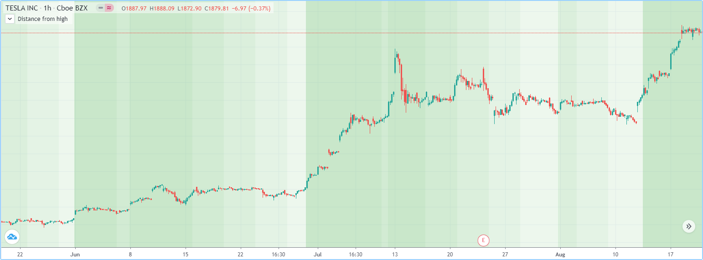
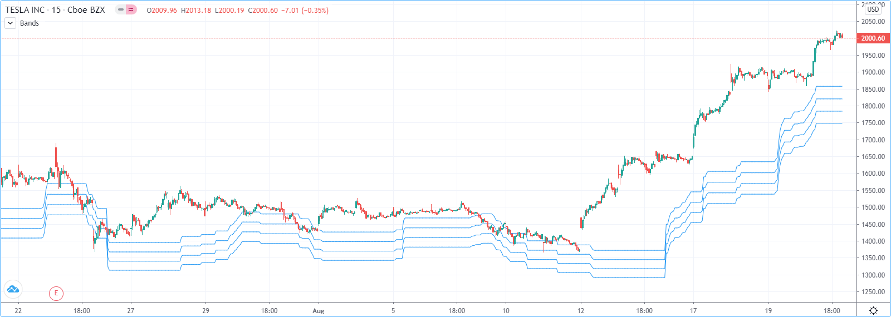
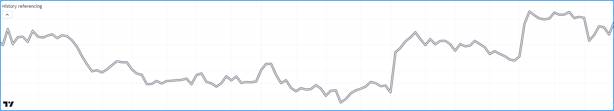
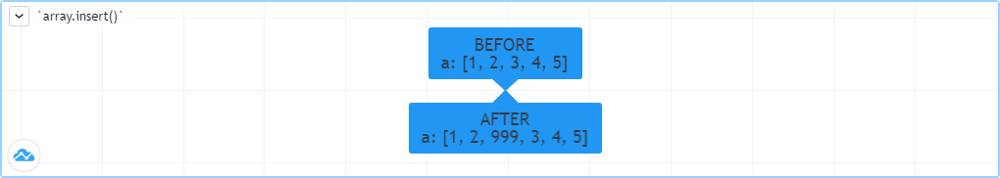
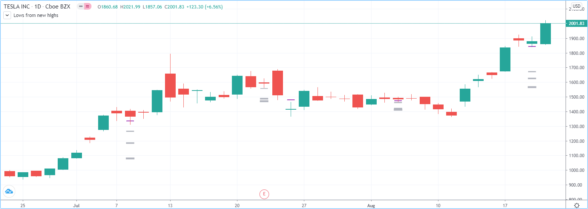
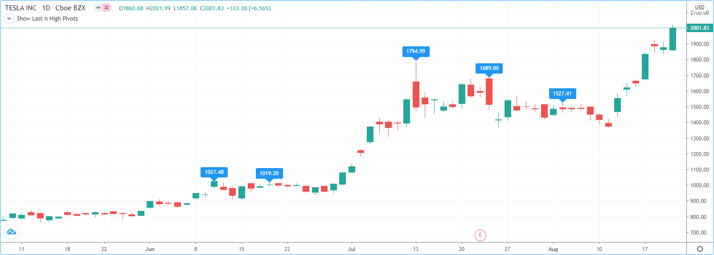
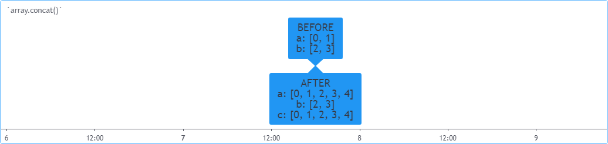
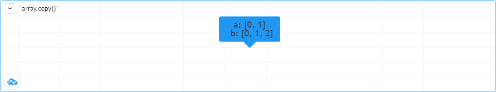
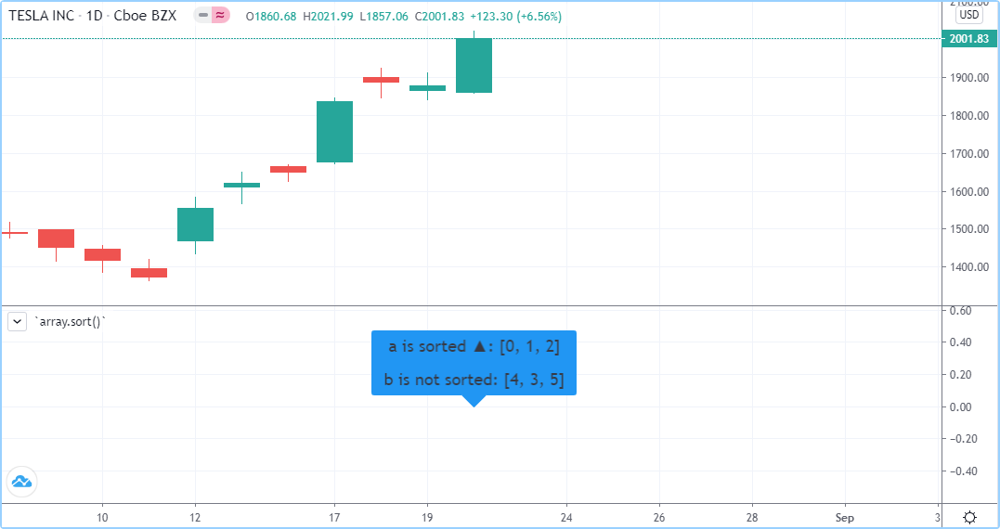
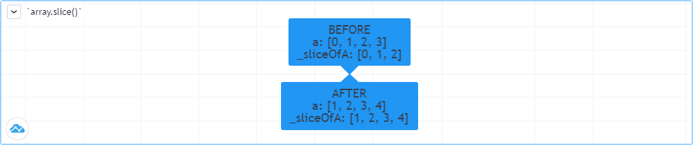

# Arrays

> __Observação__\
> Esta seção contém material avançado. Recomenda-se que programadores iniciantes em Pine Script se familiarizem com outras funcionalidades do Pine Script mais acessíveis antes de explorarem este conteúdo.

Arrays do Pine Script são coleções unidimensionais capazes de armazenar múltiplas referências de valores. Podem ser considerados uma forma mais eficiente de lidar com situações nas quais seria necessário declarar explicitamente um conjunto de variáveis similares (por exemplo, `price00`, `price01`, `price02`, ...).

Todos os elementos dentro de um array devem ser do mesmo tipo, que pode ser um tipo [integrado](./04_09_tipagem_do_sistema.md#qualificadores) ou [definido pelo usuário](./04_09_tipagem_do_sistema.md#tipos-definidos-pelo-usuário), sempre qualificado como "series". Scripts referenciam arrays usando um ID de array semelhante aos IDs de linhas, labels e outros tipos especiais. O Pine Script não utiliza um operador de indexação para referenciar elementos individuais de array. Em vez disso, funções como [array.get()](https://br.tradingview.com/pine-script-reference/v5/#fun_array{dot}get) e [array.set()](https://br.tradingview.com/pine-script-reference/v5/#fun_array{dot}set) são utilizadas para ler e escrever os valores dos elementos do array. Valores de array podem ser utilizados em expressões e funções que aceitam valores do tipo "series".

Scripts referenciam os elementos de um array usando um _index_, que começa em _0_ e vai até o _número de elementos no array menos um_. Arrays no Pine Script podem ter um tamanho dinâmico que varia ao longo das barras, já que é possível alterar o número de elementos em um array a cada iteração de um script. Scripts podem conter múltiplas instâncias de arrays. O tamanho dos arrays é limitado a 100.000 elementos.

> __Observação__\
> Utiliza-se o termo "início de um array" para designar o index 0, e "final de um array" para designar o elemento do array com o maior valor de index. Também se ampliará o significado de array para incluir IDs de array, em prol da brevidade.


# Declaração de Arrays

O Pine Script utiliza a seguinte sintaxe para declarar arrays:

```c
[var/varip ][array<type>/<type[]> ]<identifier> = <expression>
```

Onde `<type>` é um [modelo de tipo](./04_09_tipagem_do_sistema.md#templates-de-tipo) para o array que declara o tipo de valores que ele conterá, e a `<expression>` retorna um array do tipo especificado ou `na`.

Ao declarar uma variável como um array, pode-se utilizar a palavra-chave [array](https://br.tradingview.com/pine-script-reference/v5/#type_array) seguida de um [template de tipo](./04_09_tipagem_do_sistema.md#templates-de-tipo). Alternativamente, pode-se usar o nome do `type` seguido do modificador `[]` (que não deve ser confundido com o _operador de referência histórica_ [[]](https://br.tradingview.com/pine-script-reference/v5/#op_[])).

Como o Pine sempre utiliza funções específicas de tipo para criar arrays, a parte `array<type>/type[]` da declaração é redundante, exceto ao declarar uma variável de array atribuída a `na`. Mesmo quando não é necessário, declarar explicitamente o tipo do array ajuda a esclarecer a intenção para os leitores.

Esta linha de código declara uma variável de array chamada `prices` que aponta para `na`. Neste caso, é necessário especificar o tipo para declarar que a variável pode referenciar arrays contendo valores do tipo "float":

```c
array<float> prices = na
```

Também é possível criar o exemplo acima desta forma:

```c
float[] prices = na
```

Ao declarar um array e a `<expression>` não for `na`, utiliza uma das seguintes funções: [array.new<type>(size, initial_value)](https://br.tradingview.com/pine-script-reference/v5/#fun_array.new%3Ctype%3E), [array.from()](https://br.tradingview.com/pine-script-reference/v5/#fun_array{dot}from), ou [array.copy()](https://br.tradingview.com/pine-script-reference/v5/#fun_array{dot}copy). Para as funções [`array.new<type>(size, initial_value)`](https://br.tradingview.com/pine-script-reference/v5/#fun_array.new%3Ctype%3E), os argumentos dos parâmetros `size` e `initial_value` podem ser do tipo "series" para permitir o dimensionamento dinâmico e a inicialização dos elementos do array.

O exemplo a seguir cria um array contendo zero elementos do tipo "float", e desta vez, o ID do array retornado pela chamada da função [`array.new<float>()`](https://br.tradingview.com/pine-script-reference/v5/#fun_array.new%3Ctype%3E) é atribuído a `prices`:

```c
prices = array.new<float>(0)
```

> __Observação__\
> O _namespace_ `array.*` também contém funções específicas de tipo para a criação de arrays, incluindo [array.new_int()](https://br.tradingview.com/pine-script-reference/v5/#fun_array{dot}new_int), [array.new_float()](https://br.tradingview.com/pine-script-reference/v5/#fun_array{dot}new_float), [array.new_bool()](https://br.tradingview.com/pine-script-reference/v5/#fun_array{dot}new_bool), [array.new_color()](https://br.tradingview.com/pine-script-reference/v5/#fun_array{dot}new_color), [array.new_string()](https://br.tradingview.com/pine-script-reference/v5/#fun_array{dot}new_string), [array.new_line()](https://br.tradingview.com/pine-script-reference/v5/#fun_array{dot}new_line), [array.new_linefill()](https://br.tradingview.com/pine-script-reference/v5/#fun_array{dot}new_linefill), [array.new_label()](https://br.tradingview.com/pine-script-reference/v5/#fun_array{dot}new_label), [array.new_box()](https://br.tradingview.com/pine-script-reference/v5/#fun_array{dot}new_box) e [array.new_table()](https://br.tradingview.com/pine-script-reference/v5/#fun_array{dot}new_table). A função [array.new<type>()](https://br.tradingview.com/pine-script-reference/v5/#fun_array.new%3Ctype%3E) pode criar um array de qualquer tipo, incluindo [tipos definidos pelo usuário](./04_09_tipagem_do_sistema.md#tipos-definidos-pelo-usuário).

O parâmetro `initial_value` das funções `array.new*` permite aos usuários definir todos os elementos do array para um valor especificado. Se nenhum argumento for fornecido para `initial_value`, o array será preenchido com valores `na`.

Esta linha declara um ID de array chamado `prices` que aponta para um array contendo dois elementos, cada um atribuído ao valor de `close` da barra:

```c
prices = array.new<float>(2, close)
```

Para criar um array e inicializar seus elementos com valores diferentes, utiliza-se [array.from()](https://br.tradingview.com/pine-script-reference/v5/#fun_array{dot}from). Esta função infere o tamanho do array e o tipo de elementos que conterá a partir dos argumentos na chamada da função. Assim como as funções `array.new*`, aceita argumentos do tipo "series". Todos os valores fornecidos à função devem ser do mesmo tipo.

Por exemplo, todas estas três linhas de código criarão arrays "bool" idênticos com os mesmos dois elementos:

```c
statesArray = array.from(close > open, high != close)
bool[] statesArray = array.from(close > open, high != close)
array<bool> statesArray = array.from(close > open, high != close)
```

## Utilizando as Palavras-Chave `var` e `varip`

É possível utilizar as palavras-chave [var](https://br.tradingview.com/pine-script-reference/v5/#kw_var) e [varip](https://br.tradingview.com/pine-script-reference/v5/#kw_varip) para instruir um script a declarar uma variável de array apenas uma vez na primeira iteração do script na primeira barra do gráfico. Variáveis de array declaradas usando essas palavras-chave apontam para as mesmas instâncias de array até serem explicitamente reatribuídas, permitindo que um array e suas referências de elementos persistam ao longo das barras.

Ao declarar uma variável de array usando essas palavras-chave e adicionar um novo valor ao final do array referenciado em cada barra, o array crescerá em um a cada barra e terá o tamanho de `bar_index + 1` ([bar_index](https://br.tradingview.com/pine-script-reference/v5/#var_bar_index) começa em _zero_) quando o script for executado na última barra, conforme demonstra o código abaixo:

```c
//@version=5
indicator("Using `var`")
//@variable An array that expands its size by 1 on each bar.
var a = array.new<float>(0)
array.push(a, close)

if barstate.islast
    //@variable A string containing the size of `a` and the current `bar_index` value.
    string labelText = "Array size: " + str.tostring(a.size()) + "\nbar_index: " + str.tostring(bar_index)
    // Display the `labelText`.
    label.new(bar_index, 0, labelText, size = size.large)
```

O mesmo código sem a palavra-chave [var](https://br.tradingview.com/pine-script-reference/v5/#kw_var) resultaria na redeclaração do array em cada barra. Neste caso, após a execução da chamada [array.push()](https://br.tradingview.com/pine-script-reference/v5/#fun_array{dot}push), a chamada [a.size()](https://br.tradingview.com/pine-script-reference/v5/#fun_array{dot}size) retornaria o valor de 1.

> __Observação__\
> Variáveis de array declaradas usando [varip](https://br.tradingview.com/pine-script-reference/v5/#kw_varip) comportam-se como as que utilizam [var](https://br.tradingview.com/pine-script-reference/v5/#kw_var) em _dados históricos_, mas atualizam seus valores para barras em tempo real (ou seja, as barras desde a última compilação do script) a cada novo tick de preço. Arrays atribuídos a variáveis [varip](https://br.tradingview.com/pine-script-reference/v5/#kw_varip) podem conter apenas tipos [int](https://br.tradingview.com/pine-script-reference/v5/#type_int), [float](https://br.tradingview.com/pine-script-reference/v5/#type_float), [bool](https://br.tradingview.com/pine-script-reference/v5/#type_bool), [color](https://br.tradingview.com/pine-script-reference/v5/#type_color) ou [string](https://br.tradingview.com/pine-script-reference/v5/#type_string) ou [tipos definidos pelo usuário](./04_09_tipagem_do_sistema.md#tipos-definidos-pelo-usuário) que contenham exclusivamente em seus campos esses tipos ou coleções ([arrays](./04_14_arrays.md), [matrices](./04_15_matrices.md) ou [maps](./04_16_mapas.md)) desses tipos.


# Leitura e Escrita de Elementos de Array

Scripts podem escrever valores em elementos individuais existentes de um array usando [array.set(id, index, value)](https://br.tradingview.com/pine-script-reference/v5/#fun_array{dot}set) e ler usando [array.get(id, index)](https://br.tradingview.com/pine-script-reference/v5/#fun_array{dot}get). Ao usar essas funções, é crucial que o `index` na chamada da função seja sempre menor ou igual ao tamanho do array (porque os _indices_ de array começam em _zero_). Para obter o tamanho de um array, utiliza-se a função [array.size(id)](https://br.tradingview.com/pine-script-reference/v5/#fun_array{dot}size).

O exemplo a seguir utiliza o método [array.set()](https://br.tradingview.com/pine-script-reference/v5/#fun_array{dot}set) para preencher um array `fillColors` com instâncias de uma cor base usando diferentes níveis de transparência. Em seguida, usa [array.get()](https://br.tradingview.com/pine-script-reference/v5/#fun_array{dot}get) para buscar uma das cores do array com base na localização da barra com o preço mais alto dentro das últimas barras `lookbackInput`:



```c
//@version=5
indicator("Distance from high", "", true)
lookbackInput = input.int(100)
FILL_COLOR = color.green
// Declare array and set its values on the first bar only.
var fillColors = array.new<color>(5)
if barstate.isfirst
    // Initialize the array elements with progressively lighter shades of the fill color.
    fillColors.set(0, color.new(FILL_COLOR, 70))
    fillColors.set(1, color.new(FILL_COLOR, 75))
    fillColors.set(2, color.new(FILL_COLOR, 80))
    fillColors.set(3, color.new(FILL_COLOR, 85))
    fillColors.set(4, color.new(FILL_COLOR, 90))

// Find the offset to highest high. Change its sign because the function returns a negative value.
lastHiBar = - ta.highestbars(high, lookbackInput)
// Convert the offset to an array index, capping it to 4 to avoid a runtime error.
// The index used by `array.get()` will be the equivalent of `floor(fillNo)`.
fillNo = math.min(lastHiBar / (lookbackInput / 5), 4)
// Set background to a progressively lighter fill with increasing distance from location of highest high.
bgcolor(array.get(fillColors, fillNo))
// Plot key values to the Data Window for debugging.
plotchar(lastHiBar, "lastHiBar", "", location.top, size = size.tiny)
plotchar(fillNo, "fillNo", "", location.top, size = size.tiny)
```

Outra técnica para inicializar os elementos em um array é criar um _array vazio_ (um array sem elementos) e, em seguida, utilizar [array.push()](https://br.tradingview.com/pine-script-reference/v5/#fun_array{dot}push) para adicionar __novos__ elementos ao _final_ do array, aumentando o tamanho do array em um a cada chamada.

O código a seguir tem a mesma funcionalidade que a seção de inicialização do script anterior:

```c
// Declare array and set its values on the first bar only.
var fillColors = array.new<color>(0)
if barstate.isfirst
    // Initialize the array elements with progressively lighter shades of the fill color.
    array.push(fillColors, color.new(FILL_COLOR, 70))
    array.push(fillColors, color.new(FILL_COLOR, 75))
    array.push(fillColors, color.new(FILL_COLOR, 80))
    array.push(fillColors, color.new(FILL_COLOR, 85))
    array.push(fillColors, color.new(FILL_COLOR, 90))
```

O código abaixo é equivalente ao anterior, mas utiliza [array.unshift()](https://br.tradingview.com/pine-script-reference/v5/#fun_array{dot}unshift) para inserir novos elementos no _início_ do array `fillColors`:

```c
// Declare array and set its values on the first bar only.
var fillColors = array.new<color>(0)
if barstate.isfirst
    // Initialize the array elements with progressively lighter shades of the fill color.
    array.unshift(fillColors, color.new(FILL_COLOR, 90))
    array.unshift(fillColors, color.new(FILL_COLOR, 85))
    array.unshift(fillColors, color.new(FILL_COLOR, 80))
    array.unshift(fillColors, color.new(FILL_COLOR, 75))
    array.unshift(fillColors, color.new(FILL_COLOR, 70))
```

Também é possível utilizar [array.from()](https://br.tradingview.com/pine-script-reference/v5/#fun_array{dot}from) para criar o mesmo array `fillColors` com uma única chamada de função:

```c
//@version=5
indicator("Using `var`")
FILL_COLOR = color.green
var array<color> fillColors = array.from(
     color.new(FILL_COLOR, 70),
     color.new(FILL_COLOR, 75),
     color.new(FILL_COLOR, 80),
     color.new(FILL_COLOR, 85),
     color.new(FILL_COLOR, 90)
 )
// Cycle background through the array's colors.
bgcolor(array.get(fillColors, bar_index % (fillColors.size())))
```

A função [array.fill(id, value, index_from, index_to)](https://br.tradingview.com/pine-script-reference/v5/#fun_array{dot}fill) direciona todos os elementos do array, ou os elementos dentro do intervalo de `index_from` a `index_to`, para um `value` especificado. Sem os dois últimos parâmetros opcionais, a função preenche todo o array, então:

```c
a = array.new<float>(10, close)
```

E:

```c
a = array.new<float>(10)
a.fill(close)
```

São equivalentes, porém:

```c
a = array.new<float>(10)
a.fill(close, 1, 3)
```

Preenche apenas o segundo e o terceiro elementos (nos _index_ 1 e 2) do array com `close`. Note como o último parâmetro de [array.fill()](https://br.tradingview.com/pine-script-reference/v5/#fun_array{dot}fill), `index_to`, deve ser um a mais que o último _index_ que a função preencherá. Os elementos restantes conterão valores `na`, pois a chamada da função [array.new()](https://br.tradingview.com/pine-script-reference/v5/#fun_array.new%3Ctype%3E) não contém um argumento `initial_value`.


# Percorrendo Elementos de um Array

Ao percorrer os _indices_ dos elementos de um array e o tamanho do array é desconhecido, pode-se usar a função [array.size()](https://br.tradingview.com/pine-script-reference/v5/#fun_array{dot}size) para obter o valor máximo do _index_.

Por exemplo:

```c
//@version=5
indicator("Protected `for` loop", overlay = true)
//@variable An array of `close` prices from the 1-minute timeframe.
array<float> a = request.security_lower_tf(syminfo.tickerid, "1", close)

//@variable A string representation of the elements in `a`.
string labelText = ""
for i = 0 to (array.size(a) == 0 ? na : array.size(a) - 1)
    labelText += str.tostring(array.get(a, i)) + "\n"

label.new(bar_index, high, text = labelText)
```

__Note que:__

- Utiliza-se a função [request.security_lower_tf()](https://br.tradingview.com/pine-script-reference/v5/#fun_request{dot}security_lower_tf), que retorna um array de preços de [close](https://br.tradingview.com/pine-script-reference/v5/#var_close) no _timeframe_ de `1 minute`.
- Este exemplo de código gerará um erro se utilizado em um intervalo de tempo do gráfico menor que `1 minute`.
- _Loops_ [for](https://br.tradingview.com/pine-script-reference/v5/#kw_for) não são executados se a expressão `to` for [na](https://br.tradingview.com/pine-script-reference/v5/#var_na). Note que o valor de `to` é avaliado apenas uma vez ao entrar.

Um método alternativo para percorrer um array é usar um _loop_ [for…in](https://br.tradingview.com/pine-script-reference/v5/#kw_for...in). Essa abordagem é uma variação do _loop_ [for](https://br.tradingview.com/pine-script-reference/v5/#kw_for) padrão que pode iterar sobre as referências de valores e _indices_ em um array.

Aqui está um exemplo de como reescrever o código acima usando um _loop_ [`for...in`](https://br.tradingview.com/pine-script-reference/v5/#kw_for...in):

```c
//@version=5
indicator("`for...in` loop", overlay = true)
//@variable An array of `close` prices from the 1-minute timeframe.
array<float> a = request.security_lower_tf(syminfo.tickerid, "1", close)

//@variable A string representation of the elements in `a`.
string labelText = ""
for price in a
    labelText += str.tostring(price) + "\n"

label.new(bar_index, high, text = labelText)
```

__Note que:__

- _Loops_ [for...in](https://br.tradingview.com/pine-script-reference/v5/#kw_for...in) podem retornar uma tupla contendo cada _index_ e o elemento correspondente. Por exemplo, `for [i, price] in a` retorna o _index_ `i` e o valor `price` para cada elemento em `a`.

Um comando de [while](https://br.tradingview.com/pine-script-reference/v5/#kw_while) _loop_ também pode ser utilizado:

```c
//@version=5
indicator("`while` loop", overlay = true)
array<float> a = request.security_lower_tf(syminfo.tickerid, "1", close)

string labelText = ""
int i = 0
while i < array.size(a)
    labelText += str.tostring(array.get(a, i)) + "\n"
    i += 1

label.new(bar_index, high, text = labelText)
```


# Escopo

É possível declarar arrays tanto no escopo global de um script quanto nos escopos locais de [functions](./04_11_funcoes_definida_pelo_usuario.md) ([@function](https://br.tradingview.com/pine-script-reference/v5/#an_@function)), [methods](./04_13_metodos.md) ([method](https://br.tradingview.com/pine-script-reference/v5/#kw_method)) e [conditional structures](./04_07_estruturas_condicionais.md). Diferentemente de alguns outros tipos incorporados, especificamente os tipos _fundamental_ (_fundamentais_), é possível modificar arrays atribuídos globalmente a partir de escopos locais, permitindo a implementação de variáveis globais com as quais qualquer função no script pode interagir diretamente.

Essa funcionalidade é utilizada aqui para calcular níveis de preços progressivamente menores ou maiores:



```c
//@version=5
indicator("Bands", "", true)
//@variable The distance ratio between plotted price levels.
factorInput = 1 + (input.float(-2., "Step %") / 100)
//@variable A single-value array holding the lowest `ohlc4` value within a 50 bar window from 10 bars back.
level = array.new<float>(1, ta.lowest(ohlc4, 50)[10])

nextLevel(val) =>
    newLevel = level.get(0) * val
    // Write new level to the global `level` array so we can use it as the base in the next function call.
    level.set(0, newLevel)
    newLevel

plot(nextLevel(1))
plot(nextLevel(factorInput))
plot(nextLevel(factorInput))
plot(nextLevel(factorInput))
```


# Referência Histórica
O operador de referência histórica [[]](https://br.tradingview.com/pine-script-reference/v5/#op_[]) do Pine Script pode acessar o histórico de variáveis de array, permitindo que scripts interajam com instâncias passadas de arrays previamente atribuídas a uma variável.

Para ilustrar, é apresentado um exemplo simples que demonstra como se pode obter o valor de `close` da barra anterior de duas maneiras equivalentes. Neste script, o operador [[]](https://br.tradingview.com/pine-script-reference/v5/#op_[]) é utilizado para acessar a instância do array atribuída a `a` na barra anterior, e em seguida, o método [get()](https://br.tradingview.com/pine-script-reference/v5/#fun_array.get) é utilizado para recuperar o valor do primeiro elemento (`previousClose1`). Para `previousClose2`, o operador de referência histórica é aplicado diretamente na variável `close` para obter o valor. Conforme indicado pelos gráficos, `previousClose1` e `previousClose2` retornam valores idênticos:



```c
//@version=5
indicator("History referencing")

//@variable A single-value array declared on each bar.
a = array.new<float>(1)
// Set the value of the only element in `a` to `close`.
array.set(a, 0, close)

//@variable The array instance assigned to `a` on the previous bar.
previous = a[1]

previousClose1 = na(previous) ? na : previous.get(0)
previousClose2 = close[1]

plot(previousClose1, "previousClose1", color.gray, 6)
plot(previousClose2, "previousClose2", color.white, 2)
```


# Inserindo e Removendo Elementos do Array

## Inserção

As três funções a seguir podem inserir novos elementos em um array:

- A função [array.unshift()](https://br.tradingview.com/pine-script-reference/v5/#fun_array{dot}unshift) insere um novo elemento no início de um array (_index_ 0) e aumenta os valores de _index_ de quaisquer elementos existentes em um.
- A função [array.push()](https://br.tradingview.com/pine-script-reference/v5/#fun_array{dot}push) adiciona um novo elemento no final de um array.
- A função [array.insert()](https://br.tradingview.com/pine-script-reference/v5/#fun_array{dot}insert) insere um novo elemento no _index_ especificado e aumenta o _index_ dos elementos existentes a partir desse _index_ em um.



```c
//@version=5
indicator("`array.insert()`")
a = array.new<float>(5, 0)
for i = 0 to 4
    array.set(a, i, i + 1)
if barstate.islast
    label.new(bar_index, 0, "BEFORE\na: " + str.tostring(a), size = size.large)
    array.insert(a, 2, 999)
    label.new(bar_index, 0, "AFTER\na: " + str.tostring(a), style = label.style_label_up, size = size.large)
```

## Remoção

Estas quatro funções removem elementos de um array:

- A função [array.remove()](https://br.tradingview.com/pine-script-reference/v5/#fun_array{dot}remove) remove o elemento no _index_ especificado e _retorna o valor desse elemento removido_.
- A função [array.shift()](https://br.tradingview.com/pine-script-reference/v5/#fun_array{dot}shift) remove o primeiro elemento de um array e _retorna o valor desse elemento removido_.
- A função [array.pop()](https://br.tradingview.com/pine-script-reference/v5/#fun_array{dot}pop) remove o último elemento de um array e _retorna o valor desse elemento removido_.
- A função [array.clear()](https://br.tradingview.com/pine-script-reference/v5/#fun_array{dot}clear) remove todos os elementos de um array.

Note-se que _clearing_ (_limpar_) um array não deleta quaisquer objetos aos quais seus elementos faziam referência. Veja o exemplo abaixo que ilustra como isso funciona:

```c
//@version=5
indicator("`array.clear()` example", overlay = true)

// Create a label array and add a label to the array on each new bar.
var a = array.new<label>()
label lbl = label.new(bar_index, high, "Text", color = color.red)
array.push(a, lbl)

var table t = table.new(position.top_right, 1, 1)
// Clear the array on the last bar. This doesn't remove the labels from the chart.
if barstate.islast
    array.clear(a)
    table.cell(t, 0, 0, "Array elements count: " + str.tostring(array.size(a)), bgcolor = color.yellow)
```

## Utilizando um Array como uma Stack (_Pilha_)

Stacks (_Pilhas_) são construções LIFO (Last In, First Out - (_último a entrar_, _primeiro a sair_)). Comportam-se de maneira similar a uma pilha vertical de livros na qual os livros podem ser adicionados ou removidos um de cada vez, sempre do topo. Arrays do Pine Script podem ser utilizados como uma pilha, caso em que as funções [array.push()](https://br.tradingview.com/pine-script-reference/v5/#fun_array{dot}push) e [array.pop()](https://br.tradingview.com/pine-script-reference/v5/#fun_array{dot}pop) são utilizadas para adicionar e remover elementos no final do array:

- O `array.push(prices, close)` adicionará um novo elemento ao final do array `prices`, aumentando o tamanho do array em um.
- O `array.pop(prices)` removerá o último elemento do array `prices`, retornará seu valor e diminuirá o tamanho do array em um.

Veja como as funções são utilizadas aqui para rastrear mínimos sucessivos em _rallies_, ou seja, monitoramento de pontos de preço mais baixos durante períodos de _rally_:



```c
//@version=5
indicator("Lows from new highs", "", true)
var lows = array.new<float>(0)
flushLows = false

// Remove last element from the stack when `_cond` is true.
array_pop(id, cond) => cond and array.size(id) > 0 ? array.pop(id) : float(na)

if ta.rising(high, 1)
    // Rising highs; push a new low on the stack.
    lows.push(low)
    // Force the return type of this `if` block to be the same as that of the next block.
    bool(na)
else if lows.size() >= 4 or low < array.min(lows)
    // We have at least 4 lows or price has breached the lowest low;
    // sort lows and set flag indicating we will plot and flush the levels.
    array.sort(lows, order.ascending)
    flushLows := true

// If needed, plot and flush lows.
lowLevel = array_pop(lows, flushLows)
plot(lowLevel, "Low 1", low > lowLevel ? color.silver : color.purple, 2, plot.style_linebr)
lowLevel := array_pop(lows, flushLows)
plot(lowLevel, "Low 2", low > lowLevel ? color.silver : color.purple, 3, plot.style_linebr)
lowLevel := array_pop(lows, flushLows)
plot(lowLevel, "Low 3", low > lowLevel ? color.silver : color.purple, 4, plot.style_linebr)
lowLevel := array_pop(lows, flushLows)
plot(lowLevel, "Low 4", low > lowLevel ? color.silver : color.purple, 5, plot.style_linebr)

if flushLows
    // Clear remaining levels after the last 4 have been plotted.
    lows.clear()
```

## Utilizando um Array como uma Fila

Filas são construções FIFO (first in, first out - (_primeiro a entrar_, _primeiro a sair_)). Comportam-se de forma similar a carros chegando em um semáforo vermelho. Novos carros são enfileirados no final da fila, e o primeiro carro a sair será o primeiro que chegou ao semáforo.

No exemplo de código a seguir, permite-se que os usuários decidam por meio dos _inputs_ (_entradas_) do script quantos _labels_ desejam ter em seu gráfico. Essa quantidade é utilizada para determinar o tamanho do array de _labels_ que será criado, inicializando os elementos do array como `na`.

Quando um novo _pivot_ é detectado, um _label_ é criado para ele, salvando o ID do _label_ na variável `pLabel`. Em seguida, o ID desse _label_ é enfileirado usando [array.push()](https://br.tradingview.com/pine-script-reference/v5/#fun_array{dot}push) para adicionar o ID do novo _label_ ao final do array, aumentando o tamanho do array em um, além do número máximo de _labels_ a serem mantidas no gráfico.

Por fim, o _label_ mais antigo é desenfileirado removendo o primeiro elemento do array com [array.shift()](https://br.tradingview.com/pine-script-reference/v5/#fun_array{dot}shift) e deletando o _label_ referenciado pelo valor desse elemento do array. Como agora um elemento foi desenfileirado da fila, o array contém elementos `pivotCountInput` mais uma vez. Note que nas primeiras barras do conjunto de dados serão deletados IDs de _labels_ `na` até que o número máximo de _labels_ seja criado, mas isso não resulta em erros de execução.

A análise do código é apresentada a seguir:



```c
//@version=5
MAX_LABELS = 100
indicator("Show Last n High Pivots", "", true, max_labels_count = MAX_LABELS)

pivotCountInput = input.int(5, "How many pivots to show", minval = 0, maxval = MAX_LABELS)
pivotLegsInput  = input.int(3, "Pivot legs", minval = 1, maxval = 5)

// Create an array containing the user-selected max count of label IDs.
var labelIds = array.new<label>(pivotCountInput)

pHi = ta.pivothigh(pivotLegsInput, pivotLegsInput)
if not na(pHi)
    // New pivot found; plot its label `i_pivotLegs` bars back.
    pLabel = label.new(bar_index[pivotLegsInput], pHi, str.tostring(pHi, format.mintick), textcolor = color.white)
    // Queue the new label's ID by appending it to the end of the array.
    array.push(labelIds, pLabel)
    // De-queue the oldest label ID from the queue and delete the corresponding label.
    label.delete(array.shift(labelIds))
```


# Cálculos em Arrays

Enquanto variáveis do tipo _series_ podem ser vistas como um conjunto horizontal de valores que se estendem no tempo, os arrays unidimensionais do Pine Script podem ser vistos como estruturas verticais presentes em cada barra. Como o conjunto de elementos de um array não constitui uma _series_ temporal, as funções matemáticas usuais do Pine Script não são permitidas para uso direto com eles. Funções de propósito específico devem ser utilizadas para operar sobre todos os valores de um array. As funções disponíveis incluem: [array.abs()](https://br.tradingview.com/pine-script-reference/v5/#fun_array{dot}abs), [array.avg()](https://br.tradingview.com/pine-script-reference/v5/#fun_array{dot}avg), [array.covariance()](https://br.tradingview.com/pine-script-reference/v5/#fun_array{dot}covariance), [array.min()](https://br.tradingview.com/pine-script-reference/v5/#fun_array{dot}min), [array.max()](https://br.tradingview.com/pine-script-reference/v5/#fun_array{dot}max), [array.median()](https://br.tradingview.com/pine-script-reference/v5/#fun_array{dot}median), [array.mode()](https://br.tradingview.com/pine-script-reference/v5/#fun_array{dot}mode), [array.percentile_linear_interpolation()](https://br.tradingview.com/pine-script-reference/v5/#fun_array{dot}percentile_linear_interpolation), [array.percentile_nearest_rank()](https://br.tradingview.com/pine-script-reference/v5/#fun_array{dot}percentile_nearest_rank), [array.percentrank()](https://br.tradingview.com/pine-script-reference/v5/#fun_array{dot}percentrank), [array.range()](https://br.tradingview.com/pine-script-reference/v5/#fun_array{dot}range), [array.standardize()](https://br.tradingview.com/pine-script-reference/v5/#fun_array{dot}standardize), [array.stdev()](https://br.tradingview.com/pine-script-reference/v5/#fun_array{dot}stdev), [array.sum()](https://br.tradingview.com/pine-script-reference/v5/#fun_array{dot}sum), [array.variance()](https://br.tradingview.com/pine-script-reference/v5/#fun_array{dot}variance).

Observa-se que, ao contrário das funções matemáticas usuais no Pine Script, aquelas utilizadas em arrays não retornam `na` quando alguns dos valores nos quais calculam possuem valores `na`. Existem algumas exceções a esta regra:

- Quando todos os elementos do array têm valor `na` ou o array não contém elementos, `na` é retornado. `array.standardize()`, no entanto, retornará um array vazio.
- O `array.mode()` retornará `na` quando nenhum modo for encontrado.


# Manipulação de Arrays

## Concatenação

Dois arrays podem ser mesclados — ou concatenados — utilizando [array.concat()](https://br.tradingview.com/pine-script-reference/v5/#fun_array{dot}concat). Quando arrays são concatenados, o segundo array é anexado ao final do primeiro, de modo que o primeiro array é modificado enquanto o segundo permanece intacto. A função retorna o ID do array do primeiro array:



```c
//@version=5
indicator("`array.concat()`")
a = array.new<float>(0)
b = array.new<float>(0)
array.push(a, 0)
array.push(a, 1)
array.push(b, 2)
array.push(b, 3)
if barstate.islast
    label.new(bar_index, 0, "BEFORE\na: " + str.tostring(a) + "\nb: " + str.tostring(b), size = size.large)
    c = array.concat(a, b)
    array.push(c, 4)
    label.new(bar_index, 0, "AFTER\na: " + str.tostring(a) + "\nb: " + str.tostring(b) + "\nc: " + str.tostring(c), style = label.style_label_up, size = size.large)
```

## Copiando

É possível copiar um array utilizando [array.copy()](https://br.tradingview.com/pine-script-reference/v5/#fun_array{dot}copy). Aqui, o array `a` é copiado para um novo array denominado `_b`:



```c
//@version=5
indicator("`array.copy()`")
a = array.new<float>(0)
array.push(a, 0)
array.push(a, 1)
if barstate.islast
    b = array.copy(a)
    array.push(b, 2)
    label.new(bar_index, 0, "a: " + str.tostring(a) + "\nb: " + str.tostring(b), size = size.large)
```

Observe que simplesmente ao usar `_b = a` no exemplo anterior não teria copiado o array, mas apenas seu ID. A partir daí, ambas as variáveis apontariam para o mesmo array, então usar qualquer uma delas afetaria o mesmo array.

## Junção

Utiliza-se [array.join()](https://br.tradingview.com/pine-script-reference/v5/#fun_array{dot}join) para concatenar todos os elementos do array em uma string e separá-los com o separador especificado:

```c
//@version=5
indicator("")
v1 = array.new<string>(10, "test")
v2 = array.new<string>(10, "test")
array.push(v2, "test1")
v3 = array.new_float(5, 5)
v4 = array.new_int(5, 5)
l1 = label.new(bar_index, close, array.join(v1))
l2 = label.new(bar_index, close, array.join(v2, ","))
l3 = label.new(bar_index, close, array.join(v3, ","))
l4 = label.new(bar_index, close, array.join(v4, ","))
```

## Ordenação

Arrays que contêm elementos do tipo "int" ou "float" podem ser ordenados em ordem ascendente ou descendente utilizando [array.sort()](https://br.tradingview.com/pine-script-reference/v5/#fun_array{dot}sort). O parâmetro `order` é opcional e o valor padrão é [order.ascending](https://br.tradingview.com/pine-script-reference/v5/#const_order{dot}ascending). Como todos os argumentos da função `array.*()`, ele é qualificado como "series", podendo ser determinado em tempo de execução, como é feito aqui. Observe que, no exemplo, qual array será ordenado também é determinado em tempo de execução:



```c
//@version=5
indicator("`array.sort()`")
a = array.new<float>(0)
b = array.new<float>(0)
array.push(a, 2)
array.push(a, 0)
array.push(a, 1)
array.push(b, 4)
array.push(b, 3)
array.push(b, 5)
if barstate.islast
    barUp = close > open
    array.sort(barUp ? a : b, barUp ? order.ascending : order.descending)
    label.new(bar_index, 0,
      "a " + (barUp ? "is sorted ▲: "   : "is not sorted: ") + str.tostring(a) + "\n\n" +
      "b " + (barUp ? "is not sorted: " : "is sorted ▼: ")   + str.tostring(b), size = size.large)
```

Outra opção útil para ordenar arrays é o uso da função [array.sort_indices()](https://br.tradingview.com/pine-script-reference/v5/#fun_array{dot}sort_indices), que recebe uma referência ao array original e retorna um array contendo os _indices_ do array original. É importante notar que essa função não modifica o array original. O parâmetro `order` é opcional e o valor padrão é [order.ascending](https://br.tradingview.com/pine-script-reference/v5/#const_order{dot}ascending).

## Inversão

Utiliza-se [array.reverse()](https://br.tradingview.com/pine-script-reference/v5/#fun_array{dot}reverse) para inverter um array:

```c
//@version=5
indicator("`array.reverse()`")
a = array.new<float>(0)
array.push(a, 0)
array.push(a, 1)
array.push(a, 2)
if barstate.islast
    array.reverse(a)
    label.new(bar_index, 0, "a: " + str.tostring(a))
```

## Fatiamento
Fatiar um array usando [array.slice()](https://br.tradingview.com/pine-script-reference/v5/#fun_array{dot}slice) cria uma cópia superficial de um subconjunto do array pai. O tamanho do subconjunto a ser fatiado é determinado pelos parâmetros `index_from` e `index_to`. O argumento `index_to` deve ser um a mais que o final do subconjunto que se deseja fatiar.

A cópia superficial criada pelo fatiamento funciona como uma janela para o conteúdo do array pai. Os _indices_ usados para o fatiamento definem a posição e o tamanho da janela sobre o array pai. Se, como no exemplo abaixo, um fatiamento é criado a partir dos três primeiros elementos de um array (_indices_ 0 a 2), então, independentemente das alterações feitas no array pai, e contanto que contenha pelo menos três elementos, a cópia superficial sempre conterá os três primeiros elementos do array pai.

Além disso, uma vez que a cópia superficial é criada, operações na cópia são refletidas no array pai. Adicionar um elemento ao final da cópia superficial, como é feito no exemplo a seguir, ampliará a janela em um elemento e também inserirá esse elemento no array pai no _index_ 3. Neste exemplo, para fatiar o subconjunto do _index_ 0 ao _index_ 2 do array `a`, deve-se usar `_sliceOfA = array.slice(a, 0, 3)`:



```c
//@version=5
indicator("`array.slice()`")
a = array.new<float>(0)
array.push(a, 0)
array.push(a, 1)
array.push(a, 2)
array.push(a, 3)
if barstate.islast
    // Create a shadow of elements at index 1 and 2 from array `a`.
    sliceOfA = array.slice(a, 0, 3)
    label.new(bar_index, 0, "BEFORE\na: " + str.tostring(a) + "\nsliceOfA: " + str.tostring(sliceOfA))
    // Remove first element of parent array `a`.
    array.remove(a, 0)
    // Add a new element at the end of the shallow copy, thus also affecting the original array `a`.
    array.push(sliceOfA, 4)
    label.new(bar_index, 0, "AFTER\na: " + str.tostring(a) + "\nsliceOfA: " + str.tostring(sliceOfA), style = label.style_label_up)
```

## Pesquisa em Arrays

É possível verificar se um valor faz parte de um array com a função [array.includes()](https://br.tradingview.com/pine-script-reference/v5/#fun_array{dot}includes), que retorna verdadeiro se o elemento for encontrado. Pode-se encontrar a primeira ocorrência de um valor em um array usando a função [array.indexof()](https://br.tradingview.com/pine-script-reference/v5/#fun_array{dot}indexof). A primeira ocorrência é aquela com o menor _index_. Também é possível encontrar a última ocorrência de um valor com [array.lastindexof()](https://br.tradingview.com/pine-script-reference/v5/#fun_array{dot}lastindexof):

```c
//@version=5
indicator("Searching in arrays")
valueInput = input.int(1)
a = array.new<float>(0)
array.push(a, 0)
array.push(a, 1)
array.push(a, 2)
array.push(a, 1)
if barstate.islast
    valueFound      = array.includes(a, valueInput)
    firstIndexFound = array.indexof(a, valueInput)
    lastIndexFound  = array.lastindexof(a, valueInput)
    label.new(bar_index, 0, "a: " + str.tostring(a) +
      "\nFirst " + str.tostring(valueInput) + (firstIndexFound != -1 ? " value was found at index: " + str.tostring(firstIndexFound) : " value was not found.") +
      "\nLast " + str.tostring(valueInput)  + (lastIndexFound  != -1 ? " value was found at index: " + str.tostring(lastIndexFound) : " value was not found."))
```

Também é possível realizar uma busca binária em um array, mas é importante notar que realizar uma busca binária exige que o array esteja previamente ordenado em ordem ascendente. A função [array.binary_search()](https://br.tradingview.com/pine-script-reference/v5/#fun_array{dot}binary_search) retornará o _index_ do valor se ele for encontrado ou -1 se não for. Caso se deseje retornar sempre um _index_ existente do array mesmo que o valor escolhido não seja encontrado, então pode-se utilizar uma das outras funções de busca binária disponíveis. A função [array.binary_search_leftmost()](https://br.tradingview.com/pine-script-reference/v5/#fun_array{dot}binary_search_leftmost) retorna um _index_ se o valor for encontrado ou o primeiro _index_ à esquerda onde o valor seria encontrado. A função [array.binary_search_rightmost()](https://br.tradingview.com/pine-script-reference/v5/#fun_array{dot}binary_search_rightmost) é quase idêntica e retorna um _index_ se o valor for encontrado ou o primeiro _index_ à direita onde o valor seria encontrado.


# Tratamento de Erros

Sintaxe malformada em chamadas de `array.*()` em scripts Pine causará as usuais mensagens de erro do __compilador__ a aparecerem no console do Editor Pine, na parte inferior da janela, ao salvar um script. Consulte o [Manual de Referência](https://br.tradingview.com/pine-script-reference/v5) do Pine Script v5 em caso de dúvidas sobre a sintaxe exata das chamadas de função.

Scripts que utilizam arrays também podem gerar erros de __execução__, que aparecem como um ponto de exclamação ao lado do nome do indicador no gráfico. Esses erros de execução são discutidos nesta seção.

## Index xx Está Fora dos Limites. Tamanho do Array é yy

Este provavelmente será o erro mais frequente que encontrará. Ocorrerá quando referenciar um _index_ de array inexistente. O valor "xx" será o valor do _index_ problemático que tentou usar, e "yy" será o tamanho do array. Lembre-se de que os _indices_ de array começam em zero — não em um — e terminam no tamanho do array menos um. Portanto, o último _index_ válido de um array de tamanho 3 é 2.

Para evitar esse erro, é necessário fazer previsões na lógica do código para evitar o uso de um _index_ que esteja fora dos limites de _index_ do array. Este código gerará o erro porque o último _index_ usado no loop está fora do intervalo de _indices_ válidos para o array:

```c
//@version=5
indicator("Out of bounds index")
a = array.new<float>(3)
for i = 1 to 3
    array.set(a, i, i)
plot(array.pop(a))
```

A instrução `for` correta é:

```c
for i = 0 to 2
```

Para percorrer todos os elementos de um array de tamanho desconhecido, utiliza-se:

```c
//@version=5
indicator("Protected `for` loop")
sizeInput = input.int(0, "Array size", minval = 0, maxval = 100000)
a = array.new<float>(sizeInput)
for i = 0 to (array.size(a) == 0 ? na : array.size(a) - 1)
    array.set(a, i, i)
plot(array.pop(a))
```

Quando arrays são dimensionados dinamicamente usando um campo na aba _Settings/Inputs_ (_Configurações/Entradas_) do script, proteja os limites desse valor utilizando os parâmetros `minval` e `maxval` de [input.int()](https://br.tradingview.com/pine-script-reference/v5/#fun_input{dot}int):

```c
//@version=5
indicator("Protected array size")
sizeInput = input.int(10, "Array size", minval = 1, maxval = 100000)
a = array.new<float>(sizeInput)
for i = 0 to sizeInput - 1
    array.set(a, i, i)
plot(array.size(a))
```

Consulte a seção de [Looping](./04_14_arrays.md#percorrendo-elementos-de-um-array) desta seção para mais informações.

## Não é Possível Chamar Métodos de Array quando o ID do Aarray é `na`

Quando um ID de array é inicializado como `na`, operações nele não são permitidas, pois nenhum array existe. Tudo o que existe nesse ponto é uma variável de array contendo o valor `na`, em vez de um ID de array válido apontando para um array existente. Observe que um array criado sem elementos, como se faz ao usar `a = array.new_int(0)`, possui um ID válido mesmo assim.

Este código gerará o erro em discussão:

```c
//@version=5
indicator("Out of bounds index")
array<int> a = na
array.push(a, 111)
label.new(bar_index, 0, "a: " + str.tostring(a))
```

Para evitar isso, crie um array com tamanho zero utilizando:

```c
array<int> a = array.new_int(0)
```

Ou:

```c
a = array.new_int(0)
```

## Array é Grande Demais. O Tamanho Máximo é 100000

Este erro aparecerá se o código tentar declarar um array com um tamanho superior a 100.000. Também ocorrerá se, ao adicionar elementos dinamicamente a um array, um novo elemento aumentar o tamanho do array além do máximo.

## Não é Possível Criar um Array com Tamanho Negativo
Ainda não encontramos utilidade para arrays de tamanho negativo, mas se algum dia encontrarmos, possa ser permitidos ':)'

## Não é Possível Usar shift() se o Array estiver Vazio
Este erro ocorrerá se [array.shift()](https://br.tradingview.com/pine-script-reference/v5/#fun_array{dot}shift) for chamado para remover o primeiro elemento de um array vazio.

## Não é Possível Usar pop() se o Array estiver Vazio
Este erro ocorrerá se [array.pop()](https://br.tradingview.com/pine-script-reference/v5/#fun_array{dot}pop) for chamado para remover o último elemento de um array vazio.

## Index 'De' deve ser Menor que o Index 'Para'
Quando dois _indices_ são utilizados em funções como [array.slice()](https://br.tradingview.com/pine-script-reference/v5/#fun_array{dot}slice), o primeiro _index_ deve sempre ser menor que o segundo.

## Fatiamento (_Slice_) está Fora dos Limites do Array Pai

Esta mensagem ocorre sempre que o tamanho do array pai é modificado de tal maneira que faz a cópia superficial criada por um _slice_ apontar para fora dos limites do array pai. Este código reproduzirá esse erro porque, após criar um _slice_ do _index_ 3 ao 4 (os dois últimos elementos do array pai de cinco elementos), remove-se o primeiro elemento do pai, fazendo com que seu tamanho seja reduzido para quatro e seu último _index_ para 3. A partir desse momento, a cópia superficial, que ainda está apontando para "janela" ("_window_") nos _indices_ 3 a 4 do array pai, está apontando para fora dos limites do array pai:

```c
//@version=5
indicator("Slice out of bounds")
a = array.new<float>(5, 0)
b = array.slice(a, 3, 5)
array.remove(a, 0)
c = array.indexof(b, 2)
plot(c)
```
