# Matrices (_Matrix_)

> __Observação__\
> Esta seção contém material avançado. Recomenda-se que programadores iniciantes em Pine Script se familiarizem com outras funcionalidades do Pine Script mais acessíveis antes de explorarem este conteúdo.

_Matrices_ no Pine Script são coleções que armazenam referências de valores em um formato retangular. Elas são essencialmente equivalentes a objetos de [array](https://br.tradingview.com/pine-script-reference/v5/#type_array) bidimensionais com funções e métodos para inspeção, modificação e cálculos especializados. Assim como os [arrays](./04_14_arrays.md), todos os elementos de uma _matrix_ devem ser do mesmo [type](./04_09_tipagem_do_sistema.md#tipos) (_tipo_), que pode ser um [tipo integrado](./04_09_tipagem_do_sistema.md#qualificadores) ou [definido pelo usuário](./04_09_tipagem_do_sistema.md#tipos-definidos-pelo-usuário).

_Matrices_ referenciam seus elementos usando dois _indices_: um _index_ para suas linhas e outro para suas colunas. Cada _index_ começa em _0_ e se estende até o _número de linhas/colunas na matrix_ menos um_. _Matrices_ no Pine podem ter números dinâmicos de linhas e colunas que variam ao longo das barras. O [número total de elementos](https://br.tradingview.com/pine-script-reference/v5/#fun_matrix.elements_count) dentro de uma _matrix_ é o produto do número de [rows](https://br.tradingview.com/pine-script-reference/v5/#fun_matrix.rows) (_linhas_) e [columns](https://br.tradingview.com/pine-script-reference/v5/#fun_matrix.columns) (_colunas_) (por exemplo, uma _matrix_ 5x5 tem um total de 25). Como os [arrays](./04_14_arrays.md), o número total de elementos em uma _matrix_ não pode exceder _100.000_.


# Declarando _Matrix_

O Pine Script utiliza a seguinte sintaxe para a declaração de _matrix_:

```c
[var/varip ][matrix<type> ]<identifier> = <expression>
```

Onde `<type>` é um [template de tipo](./04_09_tipagem_do_sistema.md#templates-de-tipo) para a _matrix_ que declara o tipo de valores que ela conterá, e `<expression>` retorna uma instância de _matrix_ desse tipo ou `na`.

Ao declarar uma variável de _matrix_ como `na`, deve-se especificar que o identificador fará referência a _matrices_ de um tipo específico, incluindo a palavra-chave [matrix](https://br.tradingview.com/pine-script-reference/v5/#type_matrix) seguida de um [template de tipo](./04_09_tipagem_do_sistema.md#templates-de-tipo).

Esta linha declara uma nova variável `myMatrix` com um valor de `na`. Ela declara explicitamente a variável como `matrix<float>`, o que indica ao compilador que a variável só pode aceitar objetos de _[matrix](https://br.tradingview.com/pine-script-reference/v5/#type_matrix)_ contendo valores do tipo [float](https://br.tradingview.com/pine-script-reference/v5/#type_float):

```c
matrix<float> myMatrix = na
```

Quando uma variável de _matrix_ não é atribuída a `na`, a palavra-chave [matrix](https://br.tradingview.com/pine-script-reference/v5/#type_matrix) e seu [modelo de tipo](./04_09_tipagem_do_sistema.md#templates-de-tipo) são opcionais, pois o compilador utilizará as informações de tipo do objeto ao qual a variável faz referência.

Aqui, declara-se uma variável `myMatrix` referenciando uma nova instância de `matrix<float>` com duas linhas, duas colunas e um `initial_value` de _0_. A variável obtém suas informações de tipo do novo objeto neste caso, portanto, não requer uma declaração de tipo explícita:

```c
myMatrix = matrix.new<float>(2, 2, 0.0)
```

## Utilizando as Palavras-Chave `var` e `varip`

Assim como com as outras variáveis, pode-se incluir as palavras-chave [var](https://br.tradingview.com/pine-script-reference/v5/#kw_var) ou [varip](https://br.tradingview.com/pine-script-reference/v5/#kw_varip) para instruir um script a declarar uma variável de _matrix_ apenas uma vez, em vez de em cada barra. Uma variável de _matrix_ declarada com essa palavra-chave apontará para a mesma instância ao longo do período do gráfico, a menos que o script atribua explicitamente outra _matrix_ a ela, permitindo que uma _matrix_ e suas referências de elementos persistam entre as iterações do script.

Este script declara uma variável `m` atribuída a uma _matrix_ que contém uma única linha de dois elementos [int](https://br.tradingview.com/pine-script-reference/v5/#type_int) usando a palavra-chave [var](https://br.tradingview.com/pine-script-reference/v5/#kw_var). A cada _20ª_ barra, o script adiciona 1 ao primeiro elemento na primeira linha da _matrix_ `m`. A chamada de [plot()](https://br.tradingview.com/pine-script-reference/v5/#fun_plot) exibe esse elemento no gráfico. Conforme observado a _plotagem_ no gráfico, o valor de [m.get(0, 0)](https://br.tradingview.com/pine-script-reference/v5/#fun_matrix.get) persiste entre as barras, nunca retornando ao valor inicial de _0_:


```c
//@version=5
indicator("var matrix demo")

//@variable A 1x2 rectangular matrix declared only at `bar_index == 0`, i.e., the first bar.
var m = matrix.new<int>(1, 2, 0)

//@variable Is `true` on every 20th bar.
bool update = bar_index % 20 == 0

if update
    int currentValue = m.get(0, 0) // Get the current value of the first row and column.
    m.set(0, 0, currentValue + 1)  // Set the first row and column element value to `currentValue + 1`.

plot(m.get(0, 0), linewidth = 3) // Plot the value from the first row and column.
```

> __Observação__\
> Variáveis de _matrix_ declaradas usando [varip](https://br.tradingview.com/pine-script-reference/v5/#kw_varip) comportam-se como as que utilizam [var](https://br.tradingview.com/pine-script-reference/v5/#kw_var) em dados históricos, mas atualizam seus valores para barras em tempo real (ou seja, as barras desde a última compilação do script) a cada novo tick de preço. _Matrices_ atribuídas a variáveis [varip](https://br.tradingview.com/pine-script-reference/v5/#kw_varip) podem conter apenas tipos [int](https://br.tradingview.com/pine-script-reference/v5/#type_int), [float](https://br.tradingview.com/pine-script-reference/v5/#type_float), [bool](https://br.tradingview.com/pine-script-reference/v5/#type_bool), [color](https://br.tradingview.com/pine-script-reference/v5/#type_color) ou [string](https://br.tradingview.com/pine-script-reference/v5/#type_string) ou [tipos definidos pelo usuário](./04_09_tipagem_do_sistema.md#tipos-definidos-pelo-usuário) que contenham exclusivamente em seus campos esses tipos ou coleções ([arrays](./04_14_arrays.md), [matrices](./04_15_matrices.md), ou [maps](./04_16_mapas.md)) (_arrays_, _matrizes_ ou _mapas_) desses tipos.


# Leitura e Escrita de Elementos de _Matrix_

## `matrix.get()` e `matrix.set()`

Para buscar o valor de uma _matrix_ em um _index_ de `row` (_linha_) e `column` (_coluna_) especificados, utiliza-se [matrix.get()](https://br.tradingview.com/pine-script-reference/v5/#fun_matrix.get). Esta função localiza o elemento de _matrix_ especificado e retorna seu valor. Da mesma forma, para sobrescrever o valor de um elemento específico, usa-se [matrix.set()](https://br.tradingview.com/pine-script-reference/v5/#fun_matrix.set) para atribuir o elemento no _index_ de `row` (_linha_) e `column` (_coluna_) especificados a um novo `value` (_valor_).

O exemplo abaixo define uma _matrix_ quadrada `m` com duas linhas e colunas e um `initial_value` de _0_ para todos os elementos na primeira barra. O script adiciona 1 ao valor de cada elemento em barras diferentes usando os métodos [m.get()](https://br.tradingview.com/pine-script-reference/v5/#fun_matrix.get) e [m.set()](https://br.tradingview.com/pine-script-reference/v5/#fun_matrix.set). Atualiza o primeiro valor da primeira linha a cada 11 barras, o segundo valor da primeira linha a cada 7 barras, o primeiro valor da segunda linha a cada 5 barras e o segundo valor da segunda linha a cada 3 barras.

O script _plota_ o valor de cada elemento no gráfico:


```c
//@version=5
indicator("Reading and writing elements demo")

//@variable A 2x2 square matrix of `float` values.
var m = matrix.new<float>(2, 2, 0.0)

switch
    bar_index % 11 == 0 => m.set(0, 0, m.get(0, 0) + 1.0) // Adds 1 to the value at row 0, column 0 every 11th bar.
    bar_index % 7  == 0 => m.set(0, 1, m.get(0, 1) + 1.0) // Adds 1 to the value at row 0, column 1 every 7th bar.
    bar_index % 5  == 0 => m.set(1, 0, m.get(1, 0) + 1.0) // Adds 1 to the value at row 1, column 0 every 5th bar.
    bar_index % 3  == 0 => m.set(1, 1, m.get(1, 1) + 1.0) // Adds 1 to the value at row 1, column 1 every 3rd bar.

plot(m.get(0, 0), "Row 0, Column 0 Value", color.red, 2)
plot(m.get(0, 1), "Row 0, Column 1 Value", color.orange, 2)
plot(m.get(1, 0), "Row 1, Column 0 Value", color.green, 2)
plot(m.get(1, 1), "Row 1, Column 1 Value", color.blue, 2)
```

## `matrix.fill()`

Para sobrescrever todos os elementos da _matrix_ com um valor específico, utiliza-se [matrix.fill()](https://br.tradingview.com/pine-script-reference/v5/#fun_matrix.fill). Essa função direciona todos os itens na _matrix_ inteira ou dentro do intervalo de _indices_ `from_row/column` a `to_row/column` para o `value` especificado na chamada.

Por exemplo, este exemplo declara uma _matrix_ quadrada 4x4 e, em seguida, preenche seus elementos com um valor [random](https://br.tradingview.com/pine-script-reference/v5/#fun_math.random) (_aleatório_):

```c
myMatrix = matrix.new<float>(4, 4)
myMatrix.fill(math.random())
```

Observe que, ao usar [matrix.fill()](https://br.tradingview.com/pine-script-reference/v5/#fun_matrix.fill) com _matrices_ contendo tipos especiais ([line](https://br.tradingview.com/pine-script-reference/v5/#type_line), [linefill](https://br.tradingview.com/pine-script-reference/v5/#type_linefill), [box](https://br.tradingview.com/pine-script-reference/v5/#type_box), [polyline](https://br.tradingview.com/pine-script-reference/v5/#type_polyline), [label](https://br.tradingview.com/pine-script-reference/v5/#type_label), [table](https://br.tradingview.com/pine-script-reference/v5/#type_table) ou [chart.point](https://br.tradingview.com/pine-script-reference/v5/#type_chart.point)) ou [_UDTs_](./04_09_tipagem_do_sistema.md#tipos-definidos-pelo-usuário), todos os elementos substituídos apontarão para o mesmo objeto passado na chamada da função.

Este script declara uma _matrix_ com quatro linhas e colunas de referências de [_label_](https://br.tradingview.com/pine-script-reference/v5/#type_label), que são preenchidas com um novo objeto de[ _label_](https://br.tradingview.com/pine-script-reference/v5/#type_label) na primeira barra. Em cada barra, o script define o atributo `x` da _label_ referenciada na linha 0, coluna 0 para [bar_index](https://br.tradingview.com/pine-script-reference/v5/#var_bar_index), e o atributo `text` daquela referenciada na linha 3, coluna 3 para o número de _labels_ no gráfico. Embora a _matrix_ possa referenciar 16 (4x4) _labels_, cada elemento aponta para a _mesma_ instância, resultando em apenas uma _label_ no gráfico que atualiza seus atributos `x` e `text` a cada barra:


```c
//@version=5
indicator("Object matrix fill demo")

//@variable A 4x4 label matrix.
var matrix<label> m = matrix.new<label>(4, 4)

// Fill `m` with a new label object on the first bar.
if bar_index == 0
    m.fill(label.new(0, 0, textcolor = color.white, size = size.huge))

//@variable The number of label objects on the chart.
int numLabels = label.all.size()

// Set the `x` of the label from the first row and column to `bar_index`.
m.get(0, 0).set_x(bar_index)
// Set the `text` of the label at the last row and column to the number of labels.
m.get(3, 3).set_text(str.format("Total labels on the chart: {0}", numLabels))
```


# Linhas e Colunas

## Resgatando

_Matrices_ facilitam recuperar todos os valores de uma linha ou coluna específica por meio das funções [matrix.row()](https://br.tradingview.com/pine-script-reference/v5/#fun_matrix.row) e [matrix.col()](https://br.tradingview.com/pine-script-reference/v5/#fun_matrix.col). Essas funções retornam os valores como um objeto [array](https://br.tradingview.com/pine-script-reference/v5/#type_array) dimensionado de acordo com a outra dimensão da _matrix_, isto é, o tamanho de um array [matrix.row()](https://br.tradingview.com/pine-script-reference/v5/#fun_matrix.row) é igual ao [número de colunas](https://br.tradingview.com/pine-script-reference/v5/#fun_matrix.columns) e o tamanho de um array [matrix.col()](https://br.tradingview.com/pine-script-reference/v5/#fun_matrix.col) é igual ao [número de linhas](https://br.tradingview.com/pine-script-reference/v5/#fun_matrix.rows).

O script abaixo preenche uma _matrix_ `m` 3x2 com os valores de 1 a 6 na primeira barra do gráfico. Ele chama os métodos [m.row()](https://br.tradingview.com/pine-script-reference/v5/#fun_matrix.row) e [m.col()](https://br.tradingview.com/pine-script-reference/v5/#fun_matrix.col) para acessar os arrays da primeira linha e coluna da _matrix_ e os exibe no gráfico em uma _label_ junto com os tamanhos dos arrays:

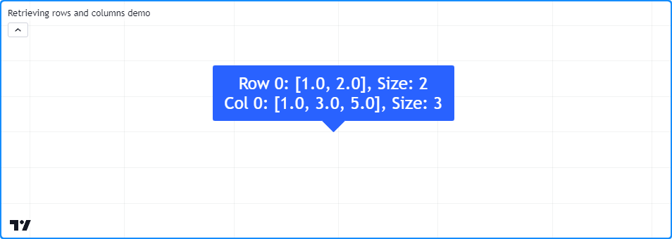

```c
//@version=5
indicator("Retrieving rows and columns demo")

//@variable A 3x2 rectangular matrix.
var matrix<float> m = matrix.new<float>(3, 2)

if bar_index == 0
    m.set(0, 0, 1.0) // Set row 0, column 0 value to 1.
    m.set(0, 1, 2.0) // Set row 0, column 1 value to 2.
    m.set(1, 0, 3.0) // Set row 1, column 0 value to 3.
    m.set(1, 1, 4.0) // Set row 1, column 1 value to 4.
    m.set(2, 0, 5.0) // Set row 1, column 0 value to 5.
    m.set(2, 1, 6.0) // Set row 1, column 1 value to 6.

//@variable The first row of the matrix.
array<float> row0 = m.row(0)
//@variable The first column of the matrix.
array<float> column0 = m.col(0)

//@variable Displays the first row and column of the matrix and their sizes in a label.
var label debugLabel = label.new(0, 0, color = color.blue, textcolor = color.white, size = size.huge)
debugLabel.set_x(bar_index)
debugLabel.set_text(str.format("Row 0: {0}, Size: {1}\nCol 0: {2}, Size: {3}", row0, m.columns(), column0, m.rows()))
```

__Note que:__

- Para obter os tamanhos dos arrays exibidos no _label_, empregaram-se os métodos [rows()](https://br.tradingview.com/pine-script-reference/v5/#fun_matrix.rows) e [columns()](https://br.tradingview.com/pine-script-reference/v5/#fun_matrix.columns) em vez de [array.size()](https://br.tradingview.com/pine-script-reference/v5/#fun_array.size), para demonstrar que o tamanho do array `row0` é igual ao número de colunas e o tamanho do array `column0` é igual ao número de linhas.

As funções [matrix.row()](https://br.tradingview.com/pine-script-reference/v5/#fun_matrix.row) e [matrix.col()](https://br.tradingview.com/pine-script-reference/v5/#fun_matrix.col) copiam as referências em uma linha/coluna para um novo [array](https://br.tradingview.com/pine-script-reference/v5/#type_array). Modificações nos [arrays](./04_14_arrays.md) retornados por essas funções não afetam diretamente os elementos ou a estrutura de uma _matrix_.

Aqui, o script anterior foi modificado para definir o primeiro elemento de `row0` como 10 por meio do método [array.set()](https://br.tradingview.com/pine-script-reference/v5/#fun_array.set) antes de exibir o _label_. Este script também _plota_ o valor da linha 0, coluna 0. Observa-se que o _label_ indica que o primeiro elemento do array `row0` é 10. No entanto, o [_plot_](https://br.tradingview.com/pine-script-reference/v5/#fun_plot) mostra que o elemento correspondente na _matrix_ ainda tem um valor de 1:

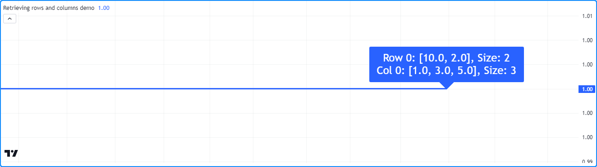

```c
//@version=5
indicator("Retrieving rows and columns demo")

//@variable A 3x2 rectangular matrix.
var matrix<float> m = matrix.new<float>(3, 2)

if bar_index == 0
    m.set(0, 0, 1.0) // Set row 0, column 0 value to 1.
    m.set(0, 1, 2.0) // Set row 0, column 1 value to 2.
    m.set(1, 0, 3.0) // Set row 1, column 0 value to 3.
    m.set(1, 1, 4.0) // Set row 1, column 1 value to 4.
    m.set(2, 0, 5.0) // Set row 1, column 0 value to 5.
    m.set(2, 1, 6.0) // Set row 1, column 1 value to 6.

//@variable The first row of the matrix.
array<float> row0 = m.row(0)
//@variable The first column of the matrix.
array<float> column0 = m.col(0)

// Set the first `row` element to 10.
row0.set(0, 10)

//@variable Displays the first row and column of the matrix and their sizes in a label.
var label debugLabel = label.new(0, m.get(0, 0), color = color.blue, textcolor = color.white, size = size.huge)
debugLabel.set_x(bar_index)
debugLabel.set_text(str.format("Row 0: {0}, Size: {1}\nCol 0: {2}, Size: {3}", row0, m.columns(), column0, m.rows()))

// Plot the first element of `m`.
plot(m.get(0, 0), linewidth = 3)
```

Embora as alterações em um [array](https://br.tradingview.com/pine-script-reference/v5/#type_array) retornado por [matrix.row()](https://br.tradingview.com/pine-script-reference/v5/#fun_matrix.row) ou [matrix.col()](https://br.tradingview.com/pine-script-reference/v5/#fun_matrix.col) não afetem diretamente uma _matrix_ pai, é importante notar que o array resultante de uma _matrix_ contendo [_UDTs_](./04_09_tipagem_do_sistema.md#tipos-definidos-pelo-usuário) ou tipos especiais, incluindo [line](https://br.tradingview.com/pine-script-reference/v5/#type_line), [linefill](https://br.tradingview.com/pine-script-reference/v5/#type_linefill), [box](https://br.tradingview.com/pine-script-reference/v5/#type_box), [polyline](https://br.tradingview.com/pine-script-reference/v5/#type_polyline), [label](https://br.tradingview.com/pine-script-reference/v5/#type_label), [table](https://br.tradingview.com/pine-script-reference/v5/#type_table) ou [chart.point](https://br.tradingview.com/pine-script-reference/v5/#type_chart.point), comporta-se como uma _shallow copy_ (_cópia superficial_) de uma linha/coluna, ou seja, os elementos dentro de um array retornado dessas funções apontam para os mesmos objetos que os elementos correspondentes na _matrix_.

Este script contém um tipo personalizado `myUDT` que inclui um campo de `value` com um valor inicial de 0. Ele declara uma _matrix_ `m` 1x1 para conter uma única instância de `myUDT` na primeira barra, depois chama `m.row(0)` para copiar a primeira linha da _matrix_ como um [array](https://br.tradingview.com/pine-script-reference/v5/#type_array). Em cada barra do gráfico, o script adiciona 1 ao campo `value` do primeiro elemento do array da `row` (_linha_). Neste caso, o campo `value` do elemento da _matrix_ também aumenta a cada barra, pois ambos os elementos referenciam o mesmo objeto:

```c
//@version=5
indicator("Row with reference types demo")

//@type A custom type that holds a float value.
type myUDT
    float value = 0.0

//@variable A 1x1 matrix of `myUDT` type.
var matrix<myUDT> m = matrix.new<myUDT>(1, 1, myUDT.new())
//@variable A shallow copy of the first row of `m`.
array<myUDT> row = m.row(0)
//@variable The first element of the `row`.
myUDT firstElement = row.get(0)

firstElement.value += 1.0 // Add 1 to the `value` field of `firstElement`. Also affects the element in the matrix.

plot(m.get(0, 0).value, linewidth = 3) // Plot the `value` of the `myUDT` object from the first row and column of `m`.
```

## Inserindo

Scripts podem adicionar novas linhas e colunas a uma _matrix_ por meio de [matrix.add_row()](https://br.tradingview.com/pine-script-reference/v5/#fun_matrix.add_row) e [matrix.add_col()](https://br.tradingview.com/pine-script-reference/v5/#fun_matrix.add_col). Essas funções inserem as referências de valor de um [array](https://br.tradingview.com/pine-script-reference/v5/#type_array) em uma _matrix_ no _index_ de `row/column` (_linha/coluna_) especificado. Se a _matrix_ `id` estiver vazia (sem linhas ou colunas), o `array_id` na chamada pode ser de qualquer tamanho. Se uma linha/coluna existir no _index_ especificado, a _matrix_ aumenta o valor do _index_ para a linha/coluna existente e todas as subsequentes em 1.

O script abaixo declara uma _matrix_ `m` vazia e insere linhas e colunas usando os métodos [m.add_row()](https://br.tradingview.com/pine-script-reference/v5/#fun_matrix.add_row) e [m.add_col()](https://br.tradingview.com/pine-script-reference/v5/#fun_matrix.add_col). Primeiro, insere um array com três elementos na linha 0, transformando `m` em uma _matrix_ 1x3, depois outro na linha 1, alterando a forma para 2x3. Em seguida, o script insere outro array na linha 0, o que muda a forma de `m` para 3x3 e desloca o _index_ de todas as linhas anteriormente no _index_ 0 ou mais. Insere outro array no último _index_ de coluna, mudando a forma para 3x4. Por fim, adiciona um array com quatro valores no _index_ da última linha.

A _matrix_ resultante tem quatro linhas e colunas e contém valores de 1 a 16 em ordem ascendente. O script exibe as linhas de `m` após cada inserção de linha/coluna com uma função `debugLabel()` definida pelo usuário para visualizar o processo:

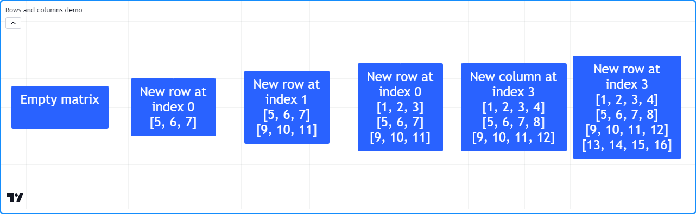

```c
//@version=5
indicator("Rows and columns demo")

//@function Displays the rows of a matrix in a label with a note.
//@param    this The matrix to display.
//@param    barIndex The `bar_index` to display the label at.
//@param    bgColor The background color of the label.
//@param    textColor The color of the label's text.
//@param    note The text to display above the rows.
method debugLabel(
     matrix<float> this, int barIndex = bar_index, color bgColor = color.blue,
     color textColor = color.white, string note = ""
 ) =>
    labelText = note + "\n" + str.tostring(this)
    if barstate.ishistory
        label.new(
             barIndex, 0, labelText, color = bgColor, style = label.style_label_center,
             textcolor = textColor, size = size.huge
         )

//Create an empty matrix.
var m = matrix.new<float>()

if bar_index == last_bar_index - 1
    debugLabel(m, bar_index - 30, note = "Empty matrix")

    // Insert an array at row 0. `m` will now have 1 row and 3 columns.
    m.add_row(0, array.from(5, 6, 7))
    debugLabel(m, bar_index - 20, note = "New row at\nindex 0")

    // Insert an array at row 1. `m` will now have 2 rows and 3 columns.
    m.add_row(1, array.from(9, 10, 11))
    debugLabel(m, bar_index - 10, note = "New row at\nindex 1")

    // Insert another array at row 0. `m` will now have 3 rows and 3 columns.
    // The values previously on row 0 will now be on row 1, and the values from row 1 will be on row 2.
    m.add_row(0, array.from(1, 2, 3))
    debugLabel(m, bar_index, note = "New row at\nindex 0")

    // Insert an array at column 3. `m` will now have 3 rows and 4 columns.
    m.add_col(3, array.from(4, 8, 12))
    debugLabel(m, bar_index + 10, note = "New column at\nindex 3")

    // Insert an array at row 3. `m` will now have 4 rows and 4 columns.
    m.add_row(3, array.from(13, 14, 15, 16))
    debugLabel(m, bar_index + 20, note = "New row at\nindex 3")
```

> __Observação__\
> Assim como as _matrices_ de linhas ou colunas [resgatados](./04_15_matrices.md#resgatando) de uma _matrix_ de instâncias do tipo [line](https://br.tradingview.com/pine-script-reference/v5/#type_line), [linefill](https://br.tradingview.com/pine-script-reference/v5/#type_linefill), [box](https://br.tradingview.com/pine-script-reference/v5/#type_box), [polyline](https://br.tradingview.com/pine-script-reference/v5/#type_polyline), [label](https://br.tradingview.com/pine-script-reference/v5/#type_label), [table](https://br.tradingview.com/pine-script-reference/v5/#type_table), [chart.point](https://br.tradingview.com/pine-script-reference/v5/#type_chart.point) ou [_UDTs_](./04_09_tipagem_do_sistema.md#tipos-definidos-pelo-usuário) comportam-se como cópias superficiais, os elementos de _matrices_ contendo tais tipos referenciam os mesmos objetos que os [arrays](./04_14_arrays.md) inseridos nelas. Modificações nos valores dos elementos em qualquer um dos objetos afetam o outro nesses casos.

## Removendo

Para remover uma linha ou coluna específica de uma _matrix_, utiliza-se [matrix.remove_row()](https://br.tradingview.com/pine-script-reference/v5/#fun_matrix.remove_row) e [matrix.remove_col()](https://br.tradingview.com/pine-script-reference/v5/#fun_matrix.remove_col). Essas funções removem a linha/coluna especificada e diminuem os valores dos _indices_ de todas as linhas/colunas subsequentes em 1.

Para este exemplo, adicionaram-se estas linhas de código ao script de demonstração "_Rows and columns demo_" da [seção anterior](./04_15_matrices.md#inserindo):

```c
// Removing example

    // Remove the first row and last column from the matrix. `m` will now have 3 rows and 3 columns.
    m.remove_row(0)
    m.remove_col(3)
    debugLabel(m, bar_index + 30, color.red, note = "Removed row 0\nand column 3")
```

Este código elimina a primeira linha e a última coluna da _matrix_ `m` utilizando os métodos [m.remove_row()](https://br.tradingview.com/pine-script-reference/v5/#fun_matrix.remove_row) e [m.remove_col()](https://br.tradingview.com/pine-script-reference/v5/#fun_matrix.remove_col), e exibe as linhas em uma _label_ em `bar_index + 30`. Como pode-se observar, `m` assume a forma 3x3 após a execução deste bloco, e os valores dos _indices_ para todas as linhas existentes são reduzidos em 1:

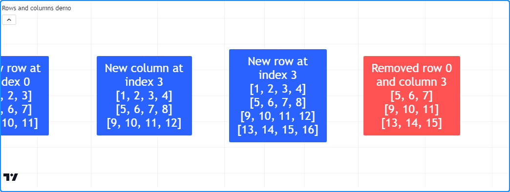

## Trocando (_Swapping_)

Para trocar as linhas e colunas de uma _matrix_ sem alterar suas dimensões, utiliza-se [matrix.swap_rows()](https://br.tradingview.com/pine-script-reference/v5/#fun_matrix.swap_rows) e [matrix.swap_columns()](https://br.tradingview.com/pine-script-reference/v5/#fun_matrix.swap_columns). Essas funções trocam as posições dos elementos nos _indices_ `row1/column1` e `row2/column2`.

Adicionam-se as seguintes linhas ao [exemplo anterior](./04_15_matrices.md#removendo), que trocam a primeira e a última linhas de `m` e exibem as alterações no _label_ em `bar_index + 40`:

```c
// Swapping example

    // Swap the first and last row. `m` retains the same dimensions.
    m.swap_rows(0, 2)
    debugLabel(m, bar_index + 40, color.purple, note = "Swapped rows 0\nand 2")
```

No novo _label_, observa-se que a _matrix_ mantém o mesmo número de linhas que antes, e as primeiras e últimas linhas trocaram de posições:

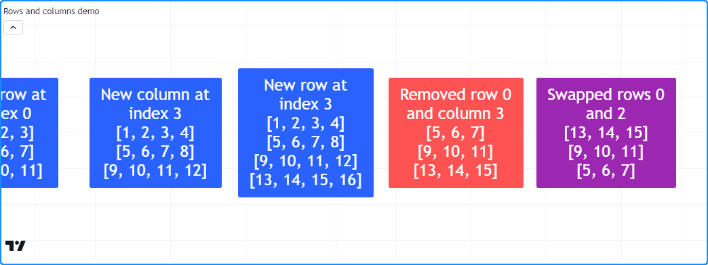

## Substituindo

Em alguns casos, pode ser desejável _substituir_ completamente uma linha ou coluna em uma _matrix_. Para fazer isso, [insere](./04_15_matrices.md#inserindo)-se o novo array no _index_ da `row/column` (_linha/coluna_) desejada e [remove](./04_15_matrices.md#removendo)-se os elementos antigos que estavam anteriormente naquele _index_.

No código a seguir, definiu-se um método `replaceRow()` que utiliza o método [add_row()](https://br.tradingview.com/pine-script-reference/v5/#fun_matrix.add_row) para inserir os novos `values` (_valores_) no index da `row` (_linha_) e o método [remove_row()](https://br.tradingview.com/pine-script-reference/v5/#fun_matrix.remove_row) para eliminar a linha antiga que foi deslocada para o _index_ `row + 1`. Este script utiliza o método `replaceRow()` para preencher as linhas de uma _matrix_ 3x3 com os números de 1 a 9. Ele desenha um _label_ no gráfico antes e depois de substituir as linhas usando o método customizado `debugLabel()`:

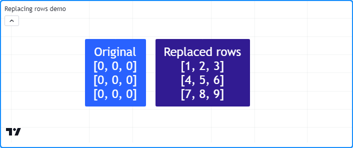

```c
//@version=5
indicator("Replacing rows demo")

//@function Displays the rows of a matrix in a label with a note.
//@param    this The matrix to display.
//@param    barIndex The `bar_index` to display the label at.
//@param    bgColor The background color of the label.
//@param    textColor The color of the label's text.
//@param    note The text to display above the rows.
method debugLabel(
     matrix<float> this, int barIndex = bar_index, color bgColor = color.blue,
     color textColor = color.white, string note = ""
 ) =>
    labelText = note + "\n" + str.tostring(this)
    if barstate.ishistory
        label.new(
             barIndex, 0, labelText, color = bgColor, style = label.style_label_center,
             textcolor = textColor, size = size.huge
         )

//@function Replaces the `row` of `this` matrix with a new array of `values`.
//@param    row The row index to replace.
//@param    values The array of values to insert.
method replaceRow(matrix<float> this, int row, array<float> values) =>
    this.add_row(row, values) // Inserts a copy of the `values` array at the `row`.
    this.remove_row(row + 1)  // Removes the old elements previously at the `row`.

//@variable A 3x3 matrix.
var matrix<float> m = matrix.new<float>(3, 3, 0.0)

if bar_index == last_bar_index - 1
    m.debugLabel(note = "Original")
    // Replace each row of `m`.
    m.replaceRow(0, array.from(1.0, 2.0, 3.0))
    m.replaceRow(1, array.from(4.0, 5.0, 6.0))
    m.replaceRow(2, array.from(7.0, 8.0, 9.0))
    m.debugLabel(bar_index + 10, note = "Replaced rows")
```


# Percorrendo uma _Matrix_

## `for`

Quando um script precisa apenas iterar sobre os _indices_ de linha/coluna em uma _matrix_, o método mais comum é usar [for](https://br.tradingview.com/pine-script-reference/v5/#kw_for) _loop_. Por exemplo, esta linha cria um _loop_ com um valor de `row` (_linha_) que começa em _0_ e aumenta em _um_ até alcançar um a menos que o número de linhas na _matrix_ `m` (ou seja, o último _index_ de linha):

```c
for row = 0 to m.rows() - 1
```

Para iterar sobre todos os valores de _index_ na _matrix_ `m`, pode-se criar um _loop aninhado_ que itera sobre cada _index_ de `column` (_coluna_) em cada valor de `row` (_linha_):

```c
for row = 0 to m.rows() - 1
    for column = 0 to m.columns() - 1
```

Utiliza-se essa estrutura aninhada para criar um [método](./04_13_metodos.md) que visualiza os elementos da _matrix_. No script abaixo, definiu-se um método `toTable()` que exibe os elementos de uma _matrix_ dentro de um objeto de [table](https://br.tradingview.com/pine-script-reference/v5/#type_table) (_tabela_). Ele itera sobre cada _index_ de `row` (_linha_) e sobre cada _index_ de `column` (_coluna_) em cada linha. Dentro do _loop_, converte cada elemento para [string](https://br.tradingview.com/pine-script-reference/v5/#type_string) para exibir na célula da tabela correspondente.

Na primeira barra, o script cria uma _matrix_ `m` vazia, a preenche com linhas e invoca `m.toTable()` para exibir seus elementos:

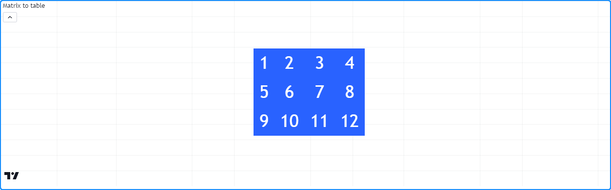

```c
//@version=5
indicator("for loop demo", "Matrix to table")

//@function Displays the elements of `this` matrix in a table.
//@param    this The matrix to display.
//@param    position The position of the table on the chart.
//@param    bgColor The background color of the table.
//@param    textColor The color of the text in each cell.
//@param    note A note string to display on the bottom row of the table.
//@returns  A new `table` object with cells corresponding to each element of `this` matrix.
method toTable(
     matrix<float> this, string position = position.middle_center,
     color bgColor = color.blue, color textColor = color.white,
     string note = na
 ) =>
    //@variable The number of rows in `this` matrix.
    int rows = this.rows()
    //@variable The number of columns in `this` matrix.
    int columns = this.columns()
    //@variable A table that displays the elements of `this` matrix with an optional `note` cell.
    table result = table.new(position, columns, rows + 1, bgColor)

    // Iterate over each row index of `this` matrix.
    for row = 0 to rows - 1
        // Iterate over each column index of `this` matrix on each `row`.
        for col = 0 to columns - 1
            //@variable The element from `this` matrix at the `row` and `col` index.
            float element = this.get(row, col)
            // Initialize the corresponding `result` cell with the `element` value.
            result.cell(col, row, str.tostring(element), text_color = textColor, text_size = size.huge)

    // Initialize a merged cell on the bottom row if a `note` is provided.
    if not na(note)
        result.cell(0, rows, note, text_color = textColor, text_size = size.huge)
        result.merge_cells(0, rows, columns - 1, rows)

    result // Return the `result` table.

//@variable A 3x4 matrix of values.
var m = matrix.new<float>()

if bar_index == 0
    // Add rows to `m`.
    m.add_row(0, array.from(1, 2, 3))
    m.add_row(1, array.from(5, 6, 7))
    m.add_row(2, array.from(9, 10, 11))
    // Add a column to `m`.
    m.add_col(3, array.from(4, 8, 12))
    // Display the elements of `m` in a table.
    m.toTable()
```

## `for…in`

Quando um script precisa iterar e recuperar as linhas de uma _matrix_, a estrutura [for…in](https://br.tradingview.com/pine-script-reference/v5/#kw_for...in) é preferível em relação ao _loop_ `for` padrão. Essa estrutura referencia diretamente os [arrays](./04_14_arrays.md) de linhas em uma _matrix_, tornando-a uma opção mais conveniente para tais casos de uso. Por exemplo, esta linha cria um _loop_ que retorna um array de `row` (_linha_) para cada linha na _matrix_ `m`:

```c
for row in m
```

O seguinte indicador calcula a média móvel dos dados __OHLC__ com um `length` de entrada e exibe os valores no gráfico. O método personalizado `rowWiseAvg()` percorre as linhas de uma _matrix_ usando uma estrutura `for...in` para produzir um array contendo o [array.avg()](https://br.tradingview.com/pine-script-reference/v5/#fun_array.avg) de cada `row` (_linha_).

Na primeira barra do gráfico, o script cria uma nova _matrix_ `m` com quatro linhas e colunas de `length`, na qual enfileira uma nova coluna de dados __OHLC__ por meio dos métodos [m.add_col()](https://br.tradingview.com/pine-script-reference/v5/#fun_matrix.add_col) e [m.remove_col()](https://br.tradingview.com/pine-script-reference/v5/#fun_matrix.remove_col) em cada barra subsequente. Utiliza `m.rowWiseAvg()` para calcular o array de `averages` (_médias_) por linha e, em seguida, plota os valores dos elementos no gráfico:

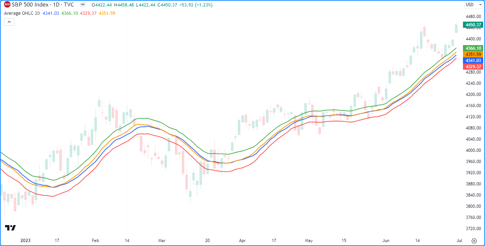

```c
//@version=5
indicator("for...in loop demo", "Average OHLC", overlay = true)

//@variable The number of terms in the average.
int length = input.int(20, "Length", minval = 1)

//@function Calculates the average of each matrix row.
method rowWiseAvg(matrix<float> this) =>
    //@variable An array with elements corresponding to each row's average.
    array<float> result = array.new<float>()
    // Iterate over each `row` of `this` matrix.
    for row in this
        // Push the average of each `row` into the `result`.
        result.push(row.avg())
    result // Return the resulting array.

//@variable A 4x`length` matrix of values.
var matrix<float> m = matrix.new<float>(4, length)

// Add a new column containing OHLC values to the matrix.
m.add_col(m.columns(), array.from(open, high, low, close))
// Remove the first column.
m.remove_col(0)

//@variable An array containing averages of `open`, `high`, `low`, and `close` over `length` bars.
array<float> averages = m.rowWiseAvg()

plot(averages.get(0), "Average Open",  color.blue,   2)
plot(averages.get(1), "Average High",  color.green,  2)
plot(averages.get(2), "Average Low",   color.red,    2)
plot(averages.get(3), "Average Close", color.orange, 2)
```

__Note que:__

- _Loops_ `for...in` também podem referenciar o valor do _index_ de cada linha. Por exemplo, `for [i, row] in m` cria uma tupla contendo o _index_ `i` da linha e o array de `row` (_linha_) correspondente da _matrix_ `m` a cada iteração do _loop_.


# Copiando _Matrix_

## Cópias Superficiais

Scripts Pine podem copiar _matrices_ através de [matrix.copy()](https://br.tradingview.com/pine-script-reference/v5/#fun_matrix.copy). Esta função retorna uma _cópia superficial_ de uma _matrix_ que não afeta a forma da _matrix_ original nem suas referências.

Por exemplo, este script atribui uma nova _matrix_ à variável `myMatrix` e adiciona duas colunas. Ele cria uma nova _matrix_ `myCopy` a partir de `myMatrix` usando o método [myMatrix.copy()](https://br.tradingview.com/pine-script-reference/v5/#fun_matrix.copy), em seguida, adiciona uma nova linha. Exibe as linhas de ambas as _matrices_ em _labels_ por meio da função definida pelo usuário `debugLabel()`:

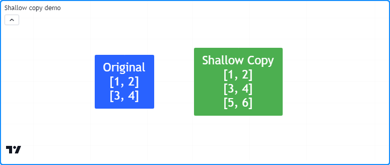

```c
//@version=5
indicator("Shallow copy demo")

//@function Displays the rows of a matrix in a label with a note.
//@param    this The matrix to display.
//@param    barIndex The `bar_index` to display the label at.
//@param    bgColor The background color of the label.
//@param    textColor The color of the label's text.
//@param    note The text to display above the rows.
method debugLabel(
     matrix<float> this, int barIndex = bar_index, color bgColor = color.blue,
     color textColor = color.white, string note = ""
 ) =>
    labelText = note + "\n" + str.tostring(this)
    if barstate.ishistory
        label.new(
             barIndex, 0, labelText, color = bgColor, style = label.style_label_center,
             textcolor = textColor, size = size.huge
         )

//@variable A 2x2 `float` matrix.
matrix<float> myMatrix = matrix.new<float>()
myMatrix.add_col(0, array.from(1.0, 3.0))
myMatrix.add_col(1, array.from(2.0, 4.0))

//@variable A shallow copy of `myMatrix`.
matrix<float> myCopy = myMatrix.copy()
// Add a row to the last index of `myCopy`.
myCopy.add_row(myCopy.rows(), array.from(5.0, 6.0))

if bar_index == last_bar_index - 1
    // Display the rows of both matrices in separate labels.
    myMatrix.debugLabel(note = "Original")
    myCopy.debugLabel(bar_index + 10, color.green, note = "Shallow Copy")
```

É importante notar que os elementos dentro de cópias superficiais de uma _matrix_ apontam para os mesmos valores que a _matrix_ original. Quando as _matrices_ contêm tipos especiais ([line](https://br.tradingview.com/pine-script-reference/v5/#type_line), [linefill](https://br.tradingview.com/pine-script-reference/v5/#type_linefill), [box](https://br.tradingview.com/pine-script-reference/v5/#type_box), [polyline](https://br.tradingview.com/pine-script-reference/v5/#type_polyline), [label](https://br.tradingview.com/pine-script-reference/v5/#type_label), [table](https://br.tradingview.com/pine-script-reference/v5/#type_table) ou [chart.point](https://br.tradingview.com/pine-script-reference/v5/#type_chart.point)) ou [tipos definidos pelo usuário](./04_09_tipagem_do_sistema.md#tipos-definidos-pelo-usuário), os elementos de uma cópia superficial referenciam os mesmos objetos que o original.

Este script declara uma variável `myMatrix` com `newLabel` como valor inicial. Em seguida, copia `myMatrix` para uma variável `myCopy` via [myMatrix.copy()](https://br.tradingview.com/pine-script-reference/v5/#fun_matrix.copy) e plota o número de _labels_. Pode-se observar abaixo, há apenas um _label_ no gráfico, pois o elemento em `myCopy` referencia o mesmo objeto que o elemento em `myMatrix`. Consequentemente, mudanças nos valores dos elementos em `myCopy` afetam os valores em ambas as _matrices_:

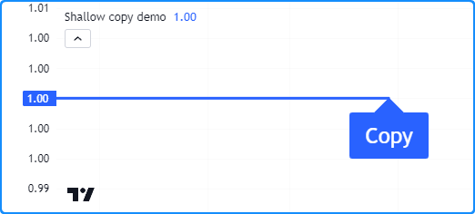

```c
//@version=5
indicator("Shallow copy demo")

//@variable Initial value of the original matrix elements.
var label newLabel = label.new(
     bar_index, 1, "Original", color = color.blue, textcolor = color.white, size = size.huge
 )

//@variable A 1x1 matrix containing a new `label` instance.
var matrix<label> myMatrix = matrix.new<label>(1, 1, newLabel)
//@variable A shallow copy of `myMatrix`.
var matrix<label> myCopy = myMatrix.copy()

//@variable The first label from the `myCopy` matrix.
label testLabel = myCopy.get(0, 0)

// Change the `text`, `style`, and `x` values of `testLabel`. Also affects the `newLabel`.
testLabel.set_text("Copy")
testLabel.set_style(label.style_label_up)
testLabel.set_x(bar_index)

// Plot the total number of labels.
plot(label.all.size(), linewidth = 3)
```

## Cópias Profundas (_Deep Copies_)

É possível produzir uma _cópia profunda_ de uma _matrix_ (ou seja, uma _matrix_ cujos elementos apontam para cópias dos valores originais) copiando explicitamente cada objeto que a _matrix_ referencia.

Aqui, um método definido pelo usuário chamado `deepCopy()` foi adicionado ao script anterior. O método cria uma nova _matrix_ e usa [_loops_ for aninhados](./04_15_matrices.md#for) para atribuir todos os elementos a cópias dos originais. Quando o script chama este método em vez do [copy()](https://br.tradingview.com/pine-script-reference/v5/#fun_matrix.copy) integrado, observa-se que agora há duas _labels_ no gráfico, e quaisquer alterações no _label_ de `myCopy` não afetam a de `myMatrix`:

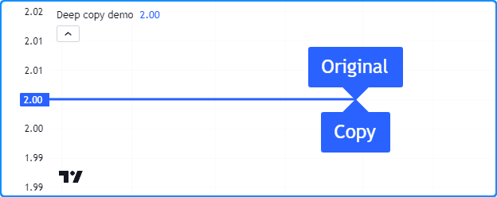

```c
//@version=5
indicator("Deep copy demo")

//@function Returns a deep copy of a label matrix.
method deepCopy(matrix<label> this) =>
    //@variable A deep copy of `this` matrix.
    matrix<label> that = this.copy()
    for row = 0 to that.rows() - 1
        for column = 0 to that.columns() - 1
            // Assign the element at each `row` and `column` of `that` matrix to a copy of the retrieved label.
            that.set(row, column, that.get(row, column).copy())
    that

//@variable Initial value of the original matrix.
var label newLabel = label.new(
     bar_index, 2, "Original", color = color.blue, textcolor = color.white, size = size.huge
 )

//@variable A 1x1 matrix containing a new `label` instance.
var matrix<label> myMatrix = matrix.new<label>(1, 1, newLabel)
//@variable A deep copy of `myMatrix`.
var matrix<label> myCopy = myMatrix.deepCopy()

//@variable The first label from the `myCopy` matrix.
label testLabel = myCopy.get(0, 0)

// Change the `text`, `style`, and `x` values of `testLabel`. Does not affect the `newLabel`.
testLabel.set_text("Copy")
testLabel.set_style(label.style_label_up)
testLabel.set_x(bar_index)

// Change the `x` value of `newLabel`.
newLabel.set_x(bar_index)

// Plot the total number of labels.
plot(label.all.size(), linewidth = 3)
```


# Submatrizes (_Submatrices_)

No Pine, uma _submatrix_ é uma [cópia superficial](./04_15_matrices.md#cópias-superficiais) de uma _matrix_ existente que inclui apenas as linhas e colunas especificadas pelos parâmetros `from_row/column` e `to_row/column`. Essencialmente, é uma cópia fatiada de uma _matrix_.

Por exemplo, o script abaixo cria uma _matrix_ `mSub` a partir da _matrix_ `m` por meio do método [m.submatrix()](https://br.tradingview.com/pine-script-reference/v5/#fun_matrix.submatrix), e então chama a função `debugLabel()` definida pelo usuário para exibir as linhas de ambas as _matrices_ em _labels_:

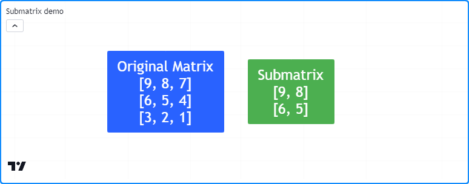

```c
//@version=5
indicator("Submatrix demo")

//@function Displays the rows of a matrix in a label with a note.
//@param    this The matrix to display.
//@param    barIndex The `bar_index` to display the label at.
//@param    bgColor The background color of the label.
//@param    textColor The color of the label's text.
//@param    note The text to display above the rows.
method debugLabel(
     matrix<float> this, int barIndex = bar_index, color bgColor = color.blue,
     color textColor = color.white, string note = ""
 ) =>
    labelText = note + "\n" + str.tostring(this)
    if barstate.ishistory
        label.new(
             barIndex, 0, labelText, color = bgColor, style = label.style_label_center,
             textcolor = textColor, size = size.huge
         )

//@variable A 3x3 matrix of values.
var m = matrix.new<float>()

if bar_index == last_bar_index - 1
    // Add columns to `m`.
    m.add_col(0, array.from(9, 6, 3))
    m.add_col(1, array.from(8, 5, 2))
    m.add_col(2, array.from(7, 4, 1))
    // Display the rows of `m`.
    m.debugLabel(note = "Original Matrix")

    //@variable A 2x2 submatrix of `m` containing the first two rows and columns.
    matrix<float> mSub = m.submatrix(from_row = 0, to_row = 2, from_column = 0, to_column = 2)
    // Display the rows of `mSub`
    debugLabel(mSub, bar_index + 10, bgColor = color.green, note = "Submatrix")
```


# Escopo e Histórico

Variáveis de _matrix_ registram trilhas históricas em cada barra, permitindo que scripts utilizem o operador de referência histórica [[]](https://br.tradingview.com/pine-script-reference/v5/#op_[]) para interagir com instâncias passadas das _matrices_ previamente atribuídas a uma variável. Adicionalmente, é possível modificar _matrices_ atribuídas a variáveis globais dentro dos escopos de [funções](./04_11_funcoes_definida_pelo_usuario.md), [métodos](./04_13_metodos.md) e [estruturas condicionais](./04_07_estruturas_condicionais.md).

Este script calcula as _médias das proporções_ (_average ratios_) entre as distâncias dos corpos e dos pavios em relação ao alcanve/intervalo da barra ao longo de `length` barras. Os dados são exibidos junto com valores `length` das barras anteriores em uma tabela. A função definida pelo usuário `addData()` adiciona colunas de proporções atuais e históricas à `globalMatrix`, e a função `calcAvg()` referencia à _matrices_ anteriores `previous` atribuídas à `globalMatrix` usando o operador [[]](https://br.tradingview.com/pine-script-reference/v5/#op_[]) para calcular uma _matrix_ de médias:

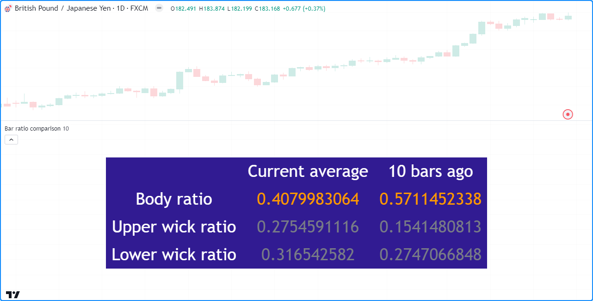

```c
//@version=5
indicator("Scope and history demo", "Bar ratio comparison")

int length = input.int(10, "Length", 1)

//@variable A global matrix.
matrix<float> globalMatrix = matrix.new<float>()

//@function Calculates the ratio of body range to candle range.
bodyRatio() =>
    math.abs(close - open) / (high - low)

//@function Calculates the ratio of upper wick range to candle range.
upperWickRatio() =>
    (high - math.max(open, close)) / (high - low)

//@function Calculates the ratio of lower wick range to candle range.
lowerWickRatio() =>
    (math.min(open, close) - low) / (high - low)

//@function Adds data to the `globalMatrix`.
addData() =>
    // Add a new column of data at `column` 0.
    globalMatrix.add_col(0, array.from(bodyRatio(), upperWickRatio(), lowerWickRatio()))
    //@variable The column of `globalMatrix` from index 0 `length` bars ago.
    array<float> pastValues = globalMatrix.col(0)[length]
    // Add `pastValues` to the `globalMatrix`, or an array of `na` if `pastValues` is `na`.
    if na(pastValues)
        globalMatrix.add_col(1, array.new<float>(3))
    else
        globalMatrix.add_col(1, pastValues)

//@function Returns the `length`-bar average of matrices assigned to `globalMatrix` on historical bars.
calcAvg() =>
    //@variable The sum historical `globalMatrix` matrices.
    matrix<float> sums = matrix.new<float>(globalMatrix.rows(), globalMatrix.columns(), 0.0)
    for i = 0 to length - 1
        //@variable The `globalMatrix` matrix `i` bars before the current bar.
        matrix<float> previous = globalMatrix[i]
        // Break the loop if `previous` is `na`.
        if na(previous)
            sums.fill(na)
            break
        // Assign the sum of `sums` and `previous` to `sums`.
        sums := matrix.sum(sums, previous)
    // Divide the `sums` matrix by the `length`.
    result = sums.mult(1.0 / length)

// Add data to the `globalMatrix`.
addData()

//@variable The historical average of the `globalMatrix` matrices.
globalAvg = calcAvg()

//@variable A `table` displaying information from the `globalMatrix`.
var table infoTable = table.new(
     position.middle_center, globalMatrix.columns() + 1, globalMatrix.rows() + 1, bgcolor = color.navy
 )

// Define value cells.
for [i, row] in globalAvg
    for [j, value] in row
        color textColor = value > 0.333 ? color.orange : color.gray
        infoTable.cell(j + 1, i + 1, str.tostring(value), text_color = textColor, text_size = size.huge)

// Define header cells.
infoTable.cell(0, 1, "Body ratio", text_color = color.white, text_size = size.huge)
infoTable.cell(0, 2, "Upper wick ratio", text_color = color.white, text_size = size.huge)
infoTable.cell(0, 3, "Lower wick ratio", text_color = color.white, text_size = size.huge)
infoTable.cell(1, 0, "Current average", text_color = color.white, text_size = size.huge)
infoTable.cell(2, 0, str.format("{0} bars ago", length), text_color = color.white, text_size = size.huge)
```

__Note que:__

- As funções `addData()` e `calcAvg()` não possuem parâmetros, pois interagem diretamente com as variáveis `globalMatrix` e `length` declaradas no escopo externo.
- A função `calcAvg()` calcula a média somando _matrices_ anteriores `previous` usando [matrix.sum()](https://br.tradingview.com/pine-script-reference/v5/#fun_matrix.sum) e multiplicando todos os elementos por `1 / length` usando [matrix.mult()](https://br.tradingview.com/pine-script-reference/v5/#fun_matrix.mult). Essas e outras funções especializadas são discutidas na seção abaixo sobre [Cálculos com Matrizes](./04_15_matrices.md#cálculos-com-matrizes).


# Inspecionando _Matrix_

A capacidade de inspecionar a forma de uma _matrix_ e os padrões dentro de seus elementos é crucial, pois ajuda a revelar informações importantes sobre uma _matrix_ e sua compatibilidade com vários cálculos e transformações. O Pine Script inclui várias funções [incorporadas](./04_10_incorporados.md) para inspeção de _matrices_, incluindo [matrix.is_square()](https://br.tradingview.com/pine-script-reference/v5/#fun_matrix.is_square), [matrix.is_identity()](https://br.tradingview.com/pine-script-reference/v5/#fun_matrix.is_identity), [matrix.is_diagonal()](https://br.tradingview.com/pine-script-reference/v5/#fun_matrix.is_diagonal), [matrix.is_antidiagonal()](https://br.tradingview.com/pine-script-reference/v5/#fun_matrix.is_antidiagonal), [matrix.is_symmetric()](https://br.tradingview.com/pine-script-reference/v5/#fun_matrix.is_symmetric), [matrix.is_antisymmetric()](https://br.tradingview.com/pine-script-reference/v5/#fun_matrix.is_antisymmetric), [matrix.is_triangular()](https://br.tradingview.com/pine-script-reference/v5/#fun_matrix.is_triangular), [matrix.is_stochastic()](https://br.tradingview.com/pine-script-reference/v5/#fun_matrix.is_stochastic), [matrix.is_binary()](https://br.tradingview.com/pine-script-reference/v5/#fun_matrix.is_binary) e [matrix.is_zero()](https://br.tradingview.com/pine-script-reference/v5/#fun_matrix.is_zero).

Para demonstrar esses recursos, este exemplo contém um método personalizado `inspect()` que utiliza blocos condicionais com funções `matrix.is_*()` para retornar informações sobre uma _matrix_. Ele exibe uma representação em string de uma _matrix_ `m` e a descrição retornada de `m.inspect()` em _labels_ no gráfico:

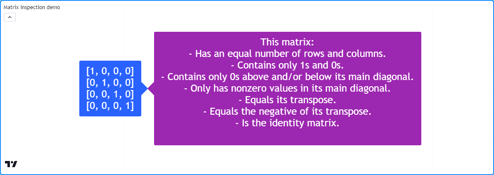

```c
//@version=5
indicator("Matrix inspection demo")

//@function Inspects a matrix using `matrix.is_*()` functions and returns a `string` describing some of its features.
method inspect(matrix<int> this)=>
    //@variable A string describing `this` matrix.
    string result = "This matrix:\n"
    if this.is_square()
        result += "- Has an equal number of rows and columns.\n"
    if this.is_binary()
        result += "- Contains only 1s and 0s.\n"
    if this.is_zero()
        result += "- Is filled with 0s.\n"
    if this.is_triangular()
        result += "- Contains only 0s above and/or below its main diagonal.\n"
    if this.is_diagonal()
        result += "- Only has nonzero values in its main diagonal.\n"
    if this.is_antidiagonal()
        result += "- Only has nonzero values in its main antidiagonal.\n"
    if this.is_symmetric()
        result += "- Equals its transpose.\n"
    if this.is_antisymmetric()
        result += "- Equals the negative of its transpose.\n"
    if this.is_identity()
        result += "- Is the identity matrix.\n"
    result

//@variable A 4x4 identity matrix.
matrix<int> m = matrix.new<int>()

// Add rows to the matrix.
m.add_row(0, array.from(1, 0, 0, 0))
m.add_row(1, array.from(0, 1, 0, 0))
m.add_row(2, array.from(0, 0, 1, 0))
m.add_row(3, array.from(0, 0, 0, 1))

if bar_index == last_bar_index - 1
    // Display the `m` matrix in a blue label.
    label.new(
         bar_index, 0, str.tostring(m), color = color.blue, style = label.style_label_right,
         textcolor = color.white, size = size.huge
     )
    // Display the result of `m.inspect()` in a purple label.
    label.new(
         bar_index, 0, m.inspect(), color = color.purple, style = label.style_label_left,
         textcolor = color.white, size = size.huge
     )
```


# Manipulando _Matrix_

## Remodelando

A forma de uma _matrix_ pode determinar sua compatibilidade com várias _matrix operations_ (_operações matriciais_). Em alguns casos, é necessário alterar as dimensões de uma _matrix_ sem afetar o número de elementos ou os valores a que se referem, o que é conhecido como _remodelando_. Para remodelar uma _matrix_ no Pine, utiliza-se a função [matrix.reshape()](https://br.tradingview.com/pine-script-reference/v5/#fun_matrix.reshape).

Este exemplo demonstra os resultados de múltiplas operações de remodelação em uma _matrix_. A _matrix_ `m` inicial tem uma forma de 1x8 (uma linha e oito colunas). Por meio de chamadas sucessivas ao método [m.reshape()](https://br.tradingview.com/pine-script-reference/v5/#fun_matrix.reshape), o script altera a forma de `m` para 2x4, 4x2 e 8x1. Ele exibe cada _matrix_ remodelada em uma _label_ no gráfico usando o método personalizado `debugLabel()`:

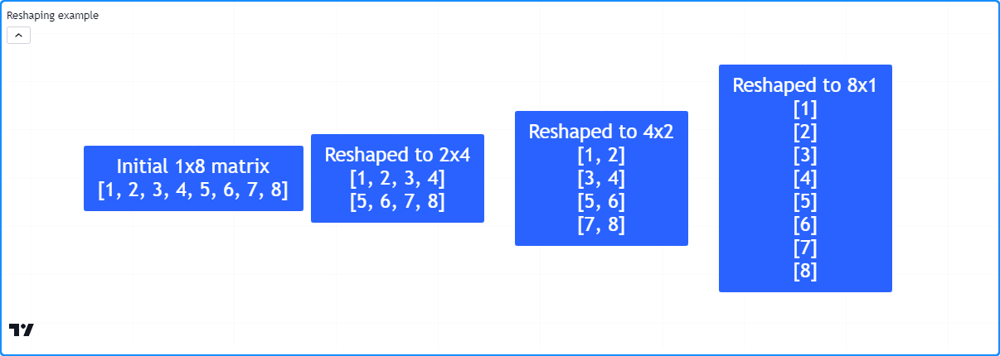

```c
//@version=5
indicator("Reshaping example")

//@function Displays the rows of a matrix in a label with a note.
//@param    this The matrix to display.
//@param    barIndex The `bar_index` to display the label at.
//@param    bgColor The background color of the label.
//@param    textColor The color of the label's text.
//@param    note The text to display above the rows.
method debugLabel(
     matrix<float> this, int barIndex = bar_index, color bgColor = color.blue,
     color textColor = color.white, string note = ""
 ) =>
    labelText = note + "\n" + str.tostring(this)
    if barstate.ishistory
        label.new(
             barIndex, 0, labelText, color = bgColor, style = label.style_label_center,
             textcolor = textColor, size = size.huge
         )

//@variable A matrix containing the values 1-8.
matrix<int> m = matrix.new<int>()

if bar_index == last_bar_index - 1
    // Add the initial vector of values.
    m.add_row(0, array.from(1, 2, 3, 4, 5, 6, 7, 8))
    m.debugLabel(note = "Initial 1x8 matrix")

    // Reshape. `m` now has 2 rows and 4 columns.
    m.reshape(2, 4)
    m.debugLabel(bar_index + 10, note = "Reshaped to 2x4")

    // Reshape. `m` now has 4 rows and 2 columns.
    m.reshape(4, 2)
    m.debugLabel(bar_index + 20, note = "Reshaped to 4x2")

    // Reshape. `m` now has 8 rows and 1 column.
    m.reshape(8, 1)
    m.debugLabel(bar_index + 30, note = "Reshaped to 8x1")
```

__Note que:__

- A ordem dos elementos em `m` não muda a cada invocação de `m.reshape()`.
- Ao remodelar uma _matrix_, o produto dos argumentos de `rows` (_linhas_) e `columns` (_colunas_) deve igualar o valor de [matrix.elements_count()](https://br.tradingview.com/pine-script-reference/v5/#fun_matrix.elements_count), pois [matrix.reshape()](https://br.tradingview.com/pine-script-reference/v5/#fun_matrix.reshape) não pode alterar o número de elementos na _matrix_.

## Invertendo

Pode-se reverter a ordem de todos os elementos em uma _matrix_ usando [matrix.reverse()](https://br.tradingview.com/pine-script-reference/v5/#fun_matrix.reverse). Esta função move as referências de uma _matrix_ __m-por-n__ no `id` da __i-th__ (_i-ésima_) linha e __j-th__ (_j-ésima_) coluna para a linha __m - 1 - i__ e coluna __n - 1 - j__.

Por exemplo, este script cria uma _matrix_ 3x3 contendo os valores de 1 a 9 em ordem ascendente, em seguida, utiliza o método [reverse()](https://br.tradingview.com/pine-script-reference/v5/#fun_matrix.reverse) para reverter seu conteúdo. Ele exibe as versões original e modificada da _matrix_ em _labels_ no gráfico por meio de `m.debugLabel()`:

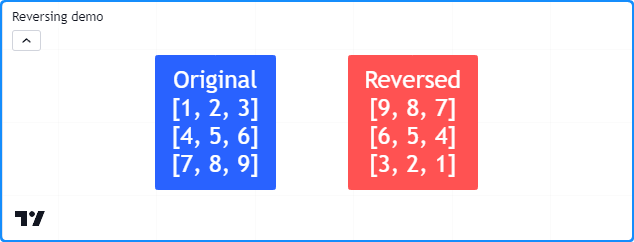

```c
//@version=5
indicator("Reversing demo")

//@function Displays the rows of a matrix in a label with a note.
//@param    this The matrix to display.
//@param    barIndex The `bar_index` to display the label at.
//@param    bgColor The background color of the label.
//@param    textColor The color of the label's text.
//@param    note The text to display above the rows.
method debugLabel(
     matrix<float> this, int barIndex = bar_index, color bgColor = color.blue,
     color textColor = color.white, string note = ""
 ) =>
    labelText = note + "\n" + str.tostring(this)
    if barstate.ishistory
        label.new(
             barIndex, 0, labelText, color = bgColor, style = label.style_label_center,
             textcolor = textColor, size = size.huge
         )

//@variable A 3x3 matrix.
matrix<float> m = matrix.new<float>()

// Add rows to `m`.
m.add_row(0, array.from(1, 2, 3))
m.add_row(1, array.from(4, 5, 6))
m.add_row(2, array.from(7, 8, 9))

if bar_index == last_bar_index - 1
    // Display the contents of `m`.
    m.debugLabel(note = "Original")
    // Reverse `m`, then display its contents.
    m.reverse()
    m.debugLabel(bar_index + 10, color.red, note = "Reversed")
```

## Transpondo

Transpor uma _matrix_ é uma operação fundamental que inverte todas as linhas e colunas de uma _matrix_ em relação à sua _diagonal principal_ (a diagonal formada pelos valores nos quais o _index_ da linha é igual ao _index_ da coluna). Esse processo gera uma nova _matrix_ com as dimensões de linha e coluna invertidas, conhecida como _transpose_ (_transpor_). Scripts podem calcular a transposta de uma _matrix_ usando [matrix.transpose()](https://br.tradingview.com/pine-script-reference/v5/#fun_matrix.transpose).

Para qualquer _matrix_ de _m-row_ (_m-linhas_) e _n-column_ (_n-colunas_), a _matrix_ retornada de [matrix.transpose()](https://br.tradingview.com/pine-script-reference/v5/#fun_matrix.transpose) terá _n row_ (_n linhas_) e _m columns_ (_m colunas_). Todos os elementos em uma _matrix_ na _i-th row_ (_i-ésima linha_) e _j-th column_ (_j-ésima_) coluna correspondem aos elementos em sua transposta na _j-th row_ (_j-ésima linha_) e _i-th column_ (_i-ésima coluna_).

Este exemplo declara uma _matrix_ `m` de 2x4, calcula sua transposta usando o método [m.transpose()](https://br.tradingview.com/pine-script-reference/v5/#fun_matrix.transpose) e exibe ambas as _matrices_ no gráfico utilizando o método personalizado `debugLabel()`. Como pode-se observar abaixo, a _matrix_ transposta tem uma forma de 4x2, e as linhas da transposta correspondem às colunas da original:

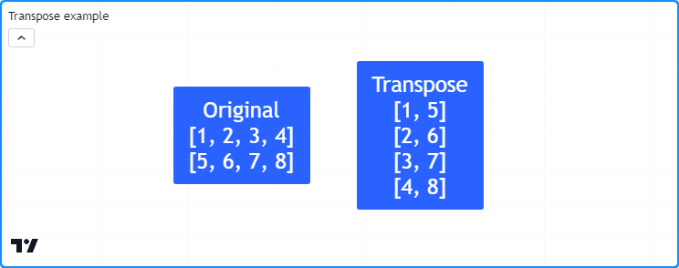

```c
//@version=5
indicator("Transpose example")

//@function Displays the rows of a matrix in a label with a note.
//@param    this The matrix to display.
//@param    barIndex The `bar_index` to display the label at.
//@param    bgColor The background color of the label.
//@param    textColor The color of the label's text.
//@param    note The text to display above the rows.
method debugLabel(
     matrix<float> this, int barIndex = bar_index, color bgColor = color.blue,
     color textColor = color.white, string note = ""
 ) =>
    labelText = note + "\n" + str.tostring(this)
    if barstate.ishistory
        label.new(
             barIndex, 0, labelText, color = bgColor, style = label.style_label_center,
             textcolor = textColor, size = size.huge
         )

//@variable A 2x4 matrix.
matrix<int> m = matrix.new<int>()

// Add columns to `m`.
m.add_col(0, array.from(1, 5))
m.add_col(1, array.from(2, 6))
m.add_col(2, array.from(3, 7))
m.add_col(3, array.from(4, 8))

//@variable The transpose of `m`. Has a 4x2 shape.
matrix<int> mt = m.transpose()

if bar_index == last_bar_index - 1
    m.debugLabel(note = "Original")
    mt.debugLabel(bar_index + 10, note = "Transpose")
```

## Ordenando

Scripts podem ordenar o conteúdo de uma _matrix_ por meio de [matrix.sort()](https://br.tradingview.com/pine-script-reference/v5/#fun_matrix.sort). Diferente de [array.sort()](https://br.tradingview.com/pine-script-reference/v5/#fun_array.sort), que ordena _elementos_, esta função organiza todas as _linhas_ de uma _matrix_ em uma `order` (_ordem_) especificada ([order.ascending](https://br.tradingview.com/pine-script-reference/v5/#var_order.ascending) por padrão) baseada nos valores de uma `column` (_coluna_) especificada.

Este script declara uma _matrix_ `m` de 3x3, organiza as linhas da cópia `m1` em ordem ascendente com base na primeira coluna e as linhas da cópia `m2` em ordem descendente com base na segunda coluna. A _matrix_ original e as cópias ordenadas são exibidas em _labels_ utilizando o método `debugLabel()`:

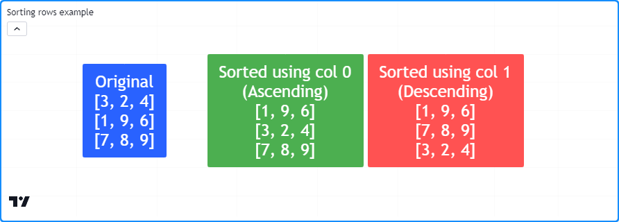

```c
//@version=5
indicator("Sorting rows example")

//@function Displays the rows of a matrix in a label with a note.
//@param    this The matrix to display.
//@param    barIndex The `bar_index` to display the label at.
//@param    bgColor The background color of the label.
//@param    textColor The color of the label's text.
//@param    note The text to display above the rows.
method debugLabel(
     matrix<float> this, int barIndex = bar_index, color bgColor = color.blue,
     color textColor = color.white, string note = ""
 ) =>
    labelText = note + "\n" + str.tostring(this)
    if barstate.ishistory
        label.new(
             barIndex, 0, labelText, color = bgColor, style = label.style_label_center,
             textcolor = textColor, size = size.huge
         )

//@variable A 3x3 matrix.
matrix<int> m = matrix.new<int>()

if bar_index == last_bar_index - 1
    // Add rows to `m`.
    m.add_row(0, array.from(3, 2, 4))
    m.add_row(1, array.from(1, 9, 6))
    m.add_row(2, array.from(7, 8, 9))
    m.debugLabel(note = "Original")

    // Copy `m` and sort rows in ascending order based on the first column (default).
    matrix<int> m1 = m.copy()
    m1.sort()
    m1.debugLabel(bar_index + 10, color.green, note = "Sorted using col 0\n(Ascending)")

    // Copy `m` and sort rows in descending order based on the second column.
    matrix<int> m2 = m.copy()
    m2.sort(1, order.descending)
    m2.debugLabel(bar_index + 20, color.red, note = "Sorted using col 1\n(Descending)")
```

É importante observar que [matrix.sort()](https://br.tradingview.com/pine-script-reference/v5/#fun_matrix.sort) não ordena as colunas de uma _matrix_. No entanto, _pode-se_ utilizar essa função para ordenar as colunas de uma _matrix_ com a ajuda de [matrix.transpose()](https://br.tradingview.com/pine-script-reference/v5/#fun_matrix.transpose).

Como exemplo, este script contém um método `sortColumns()` que utiliza o método [sort()](https://br.tradingview.com/pine-script-reference/v5/#fun_matrix.sort) para ordenar a [transposta](https://br.tradingview.com/pine-script-reference/v5/#fun_matrix.transpose) de uma _matrix_ usando a coluna correspondente à `row` (_linha_) da _matrix_ original. O script utiliza esse método para ordenar a _matrix_ `m` com base no conteúdo de sua primeira linha:

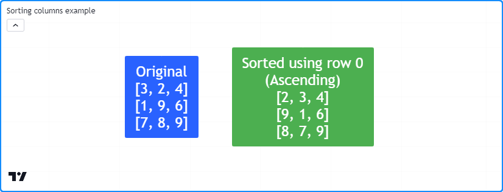

```c
//@version=5
indicator("Sorting columns example")

//@function Displays the rows of a matrix in a label with a note.
//@param    this The matrix to display.
//@param    barIndex The `bar_index` to display the label at.
//@param    bgColor The background color of the label.
//@param    textColor The color of the label's text.
//@param    note The text to display above the rows.
method debugLabel(
     matrix<float> this, int barIndex = bar_index, color bgColor = color.blue,
     color textColor = color.white, string note = ""
 ) =>
    labelText = note + "\n" + str.tostring(this)
    if barstate.ishistory
        label.new(
             barIndex, 0, labelText, color = bgColor, style = label.style_label_center,
             textcolor = textColor, size = size.huge
         )

//@function Sorts the columns of `this` matrix based on the values in the specified `row`.
method sortColumns(matrix<int> this, int row = 0, bool ascending = true) =>
    //@variable The transpose of `this` matrix.
    matrix<int> thisT = this.transpose()
    //@variable Is `order.ascending` when `ascending` is `true`, `order.descending` otherwise.
    order = ascending ? order.ascending : order.descending
    // Sort the rows of `thisT` using the `row` column.
    thisT.sort(row, order)
    //@variable A copy of `this` matrix with sorted columns.
    result = thisT.transpose()

//@variable A 3x3 matrix.
matrix<int> m = matrix.new<int>()

if bar_index == last_bar_index - 1
    // Add rows to `m`.
    m.add_row(0, array.from(3, 2, 4))
    m.add_row(1, array.from(1, 9, 6))
    m.add_row(2, array.from(7, 8, 9))
    m.debugLabel(note = "Original")

    // Sort the columns of `m` based on the first row and display the result.
    m.sortColumns(0).debugLabel(bar_index + 10, note = "Sorted using row 0\n(Ascending)")
```

## Concatenando

Scripts podem _concatenar_ duas _matrices_ usando [matrix.concat()](https://br.tradingview.com/pine-script-reference/v5/#fun_matrix.concat). Esta função anexa as linhas da _matrix_ `id2` ao final da _matrix_ `id1`, que deve ter o mesmo número de colunas, ou seja, o número de colunas em ambas as _matrices_ deve ser idêntico.

Para criar uma _matrix_ cujos elementos representam as _colunas_ de uma _matrix_ concatenada a outra, [transponha](./04_15_matrices.md#transpondo) ambas as _matrices_, utilize [matrix.concat()](https://br.tradingview.com/pine-script-reference/v5/#fun_matrix.concat) nas _matrices_ transpostas e, em seguida, aplique [transpose()](https://br.tradingview.com/pine-script-reference/v5/#fun_matrix.transpose) no resultado.

Por exemplo, este script anexa as linhas da _matrix_ `m2` à _matrix_ `m1` e anexa suas colunas usando cópias _transpostas_ das _matrices_. Ele exibe as _matrices_ `m1` e `m2` e os resultados após concatenar suas linhas e colunas em _labels_ utilizando o método personalizado `debugLabel()`:

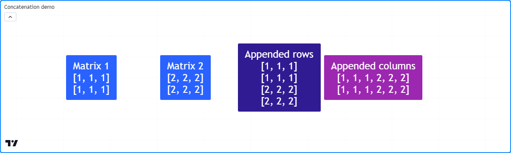

```c
//@version=5
indicator("Concatenation demo")

//@function Displays the rows of a matrix in a label with a note.
//@param    this The matrix to display.
//@param    barIndex The `bar_index` to display the label at.
//@param    bgColor The background color of the label.
//@param    textColor The color of the label's text.
//@param    note The text to display above the rows.
method debugLabel(
     matrix<float> this, int barIndex = bar_index, color bgColor = color.blue,
     color textColor = color.white, string note = ""
 ) =>
    labelText = note + "\n" + str.tostring(this)
    if barstate.ishistory
        label.new(
             barIndex, 0, labelText, color = bgColor, style = label.style_label_center,
             textcolor = textColor, size = size.huge
         )

//@variable A 2x3 matrix filled with 1s.
matrix<int> m1 = matrix.new<int>(2, 3, 1)
//@variable A 2x3 matrix filled with 2s.
matrix<int> m2 = matrix.new<int>(2, 3, 2)

//@variable The transpose of `m1`.
t1 = m1.transpose()
//@variable The transpose of `m2`.
t2 = m2.transpose()

if bar_index == last_bar_index - 1
    // Display the original matrices.
    m1.debugLabel(note = "Matrix 1")
    m2.debugLabel(bar_index + 10, note = "Matrix 2")
    // Append the rows of `m2` to the end of `m1` and display `m1`.
    m1.concat(m2)
    m1.debugLabel(bar_index + 20, color.blue, note = "Appended rows")
    // Append the rows of `t2` to the end of `t1`, then display the transpose of `t1.
    t1.concat(t2)
    t1.transpose().debugLabel(bar_index + 30, color.purple, note = "Appended columns")
```


# Cálculos com _Matrix_

## Cálculos Elemento a Elemento

Os scripts Pine podem calcular o _average_, _minimum_, _maximum_, e o _mode_ (_média_, o _mínimo_, o _máximo_ e a _moda_) de todos os elementos dentro de uma _matrix_ por meio das funções [matrix.avg()](https://br.tradingview.com/pine-script-reference/v5/#fun_matrix.avg), [matrix.min()](https://br.tradingview.com/pine-script-reference/v5/#fun_matrix.min), [matrix.max()](https://br.tradingview.com/pine-script-reference/v5/#fun_matrix.max) e [matrix.mode()](https://br.tradingview.com/pine-script-reference/v5/#fun_matrix.mode). Essas funções operam da mesma maneira que seus equivalentes em `array.*`, permitindo aos usuários realizar cálculos elemento a elemento em uma _matrix_, suas [_submatrices_](./04_15_matrices.md#submatrizes-submatrices), e suas [linhas e colunas](./04_15_matrices.md#linhas-e-colunas) usando a mesma sintaxe. Por exemplo, as funções incorporadas `*.avg()` chamadas em uma _matrix_ 3x3 com valores de 1 a 9 e um [array](https://br.tradingview.com/pine-script-reference/v5/#type_array) com os mesmos nove elementos retornarão ambos um valor de 5.

O script abaixo utiliza os métodos `*.avg()`, `*.max()` e `*.min()` para calcular as médias em desenvolvimento e os extremos dos dados __OHLC__ em um período. Ele adiciona uma nova coluna de valores de [open](https://br.tradingview.com/pine-script-reference/v5/#var_open), [high](https://br.tradingview.com/pine-script-reference/v5/#var_high), [low](https://br.tradingview.com/pine-script-reference/v5/#var_low) e [close](https://br.tradingview.com/pine-script-reference/v5/#var_close) (_abertura_, _máxima_, _mínima_ e _fechamento_) ao final da _matrix_ `ohlcData` sempre que `queueColumn` é `true`. Quando `false`, o script usa os métodos [get()](https://br.tradingview.com/pine-script-reference/v5/#fun_matrix.get) e [set()](https://br.tradingview.com/pine-script-reference/v5/#fun_matrix.set) da _matrix_ para ajustar os elementos na última coluna para os valores __HLC__ em desenvolvimento no período atual. Ele utiliza a _matrix_ `ohlcData`, uma [_submatrix_()](https://br.tradingview.com/pine-script-reference/v5/#fun_matrix.submatrix), e arrays [row()](https://br.tradingview.com/pine-script-reference/v5/#fun_matrix.row) e [col()](https://br.tradingview.com/pine-script-reference/v5/#fun_matrix.col) para calcular as médias desenvolventes __OHLC4__ e __HL2__ ao longo dos períodos de `length`, a máxima alta e a mínima baixa ao longo dos períodos de `length`, e o preço __OHLC4__ em desenvolvimento do período atual:

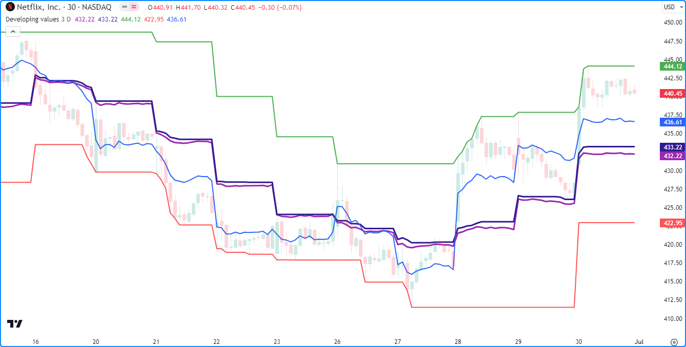

```c
//@version=5
indicator("Element-wise calculations example", "Developing values", overlay = true)

//@variable The number of data points in the averages.
int length = input.int(3, "Length", 1)
//@variable The timeframe of each reset period.
string timeframe = input.timeframe("D", "Reset Timeframe")

//@variable A 4x`length` matrix of OHLC values.
var matrix<float> ohlcData = matrix.new<float>(4, length)

//@variable Is `true` at the start of a new bar at the `timeframe`.
bool queueColumn = timeframe.change(timeframe)

if queueColumn
    // Add new values to the end column of `ohlcData`.
    ohlcData.add_col(length, array.from(open, high, low, close))
    // Remove the oldest column from `ohlcData`.
    ohlcData.remove_col(0)
else
    // Adjust the last element of column 1 for new highs.
    if high > ohlcData.get(1, length - 1)
        ohlcData.set(1, length - 1, high)
    // Adjust the last element of column 2 for new lows.
    if low < ohlcData.get(2, length - 1)
        ohlcData.set(2, length - 1, low)
    // Adjust the last element of column 3 for the new closing price.
    ohlcData.set(3, length - 1, close)

//@variable The `matrix.avg()` of all elements in `ohlcData`.
avgOHLC4 = ohlcData.avg()
//@variable The `matrix.avg()` of all elements in rows 1 and 2, i.e., the average of all `high` and `low` values.
avgHL2   = ohlcData.submatrix(from_row = 1, to_row = 3).avg()
//@variable The `matrix.max()` of all values in `ohlcData`. Equivalent to `ohlcData.row(1).max()`.
maxHigh = ohlcData.max()
//@variable The `array.min()` of all `low` values in `ohlcData`. Equivalent to `ohlcData.min()`.
minLow = ohlcData.row(2).min()
//@variable The `array.avg()` of the last column in `ohlcData`, i.e., the current OHLC4.
ohlc4Value = ohlcData.col(length - 1).avg()

plot(avgOHLC4, "Average OHLC4", color.purple, 2)
plot(avgHL2, "Average HL2", color.navy, 2)
plot(maxHigh, "Max High", color.green)
plot(minLow, "Min Low", color.red)
plot(ohlc4Value, "Current OHLC4", color.blue)
```

__Note que:__

- Neste exemplo, utilizaram-se métodos [array.*()](https://br.tradingview.com/pine-script-reference/v5/#type_array) e [matrix.*()](https://br.tradingview.com/pine-script-reference/v5/#type_matrix) de forma intercambiável para demonstrar suas semelhanças em sintaxe e comportamento.
- Usuários podem calcular o equivalente em _matrix_ de [array.sum()](https://br.tradingview.com/pine-script-reference/v5/#fun_array.sum) multiplicando [matrix.avg()](https://br.tradingview.com/pine-script-reference/v5/#fun_matrix.avg) pelo [matrix.elements_count()](https://br.tradingview.com/pine-script-reference/v5/#fun_matrix.elements_count).

## Cálculos Especiais

O Pine Script possui várias funções incorporadas para realizar cálculos aritméticos essenciais de _matrices_ e operações de álgebra linear, incluindo [matrix.sum()](https://br.tradingview.com/pine-script-reference/v5/#fun_matrix.sum), [matrix.diff()](https://br.tradingview.com/pine-script-reference/v5/#fun_matrix.diff), [matrix.mult()](https://br.tradingview.com/pine-script-reference/v5/#fun_matrix.mult), [matrix.pow()](https://br.tradingview.com/pine-script-reference/v5/#fun_matrix.pow), [matrix.det()](https://br.tradingview.com/pine-script-reference/v5/#fun_matrix.det), [matrix.inv()](https://br.tradingview.com/pine-script-reference/v5/#fun_matrix.inv), [matrix.pinv()](https://br.tradingview.com/pine-script-reference/v5/#fun_matrix.pinv), [matrix.rank()](https://br.tradingview.com/pine-script-reference/v5/#fun_matrix.rank), [matrix.trace()](https://br.tradingview.com/pine-script-reference/v5/#fun_matrix.trace), [matrix.eigenvalues()](https://br.tradingview.com/pine-script-reference/v5/#fun_matrix.eigenvalues), [matrix.eigenvectors()](https://br.tradingview.com/pine-script-reference/v5/#fun_matrix.eigenvectors) e [matrix.kron()](https://br.tradingview.com/pine-script-reference/v5/#fun_matrix.kron). Essas funções são recursos avançados que facilitam uma variedade de cálculos e transformações com _matrices_.

A seguir abaixo, abordam-se algumas funções fundamentais com exemplos básicos.

### `matrix.sum()` e `matrix.diff()`

Scripts podem realizar adição e subtração de duas _matrices_ com a mesma forma ou de uma _matrix_ e um valor escalar usando as funções [matrix.sum()](https://br.tradingview.com/pine-script-reference/v5/#fun_matrix.sum) e [matrix.diff()](https://br.tradingview.com/pine-script-reference/v5/#fun_matrix.diff). Essas funções utilizam os valores da _matrix_ `id2` ou escalar para adicionar ou subtrair dos elementos em `id1`.

Este script demonstra um exemplo simples de adição e subtração de _matrices_ no Pine. Ele cria uma _matrix_ 3x3, calcula sua [transposta](./04_15_matrices.md#transpondo), em seguida, calcula a [matrix.sum()](https://br.tradingview.com/pine-script-reference/v5/#fun_matrix.sum) e [matrix.diff()](https://br.tradingview.com/pine-script-reference/v5/#fun_matrix.diff) das duas _matrices_. Este exemplo exibe a _matrix_ original, sua [transposta](https://br.tradingview.com/pine-script-reference/v5/#fun_matrix.transpose) e as _matrices_ resultantes da soma e diferença em _labels_ no gráfico:

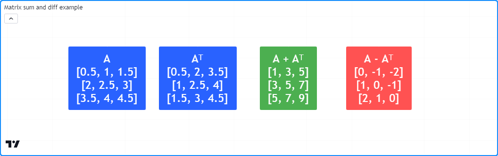

```c
//@version=5
indicator("Matrix sum and diff example")

//@function Displays the rows of a matrix in a label with a note.
//@param    this The matrix to display.
//@param    barIndex The `bar_index` to display the label at.
//@param    bgColor The background color of the label.
//@param    textColor The color of the label's text.
//@param    note The text to display above the rows.
method debugLabel(
     matrix<float> this, int barIndex = bar_index, color bgColor = color.blue,
     color textColor = color.white, string note = ""
 ) =>
    labelText = note + "\n" + str.tostring(this)
    if barstate.ishistory
        label.new(
             barIndex, 0, labelText, color = bgColor, style = label.style_label_center,
             textcolor = textColor, size = size.huge
         )

//@variable A 3x3 matrix.
m = matrix.new<float>()

// Add rows to `m`.
m.add_row(0, array.from(0.5, 1.0, 1.5))
m.add_row(1, array.from(2.0, 2.5, 3.0))
m.add_row(2, array.from(3.5, 4.0, 4.5))

if bar_index == last_bar_index - 1
    // Display `m`.
    m.debugLabel(note = "A")
    // Get and display the transpose of `m`.
    matrix<float> t = m.transpose()
    t.debugLabel(bar_index + 10, note = "Aᵀ")
    // Calculate the sum of the two matrices. The resulting matrix is symmetric.
    matrix.sum(m, t).debugLabel(bar_index + 20, color.green, note = "A + Aᵀ")
    // Calculate the difference between the two matrices. The resulting matrix is antisymmetric.
    matrix.diff(m, t).debugLabel(bar_index + 30, color.red, note = "A - Aᵀ")
```

__Note que:__

- Neste exemplo, rotulou-se a _matrix_ original como "A" e a transposta como "AT".
- Ao adicionar "A" e "AT" produz uma _matrix_ [simétrica](https://br.tradingview.com/pine-script-reference/v5/#fun_matrix.is_symmetric), e ao subtrair uma da outra produz uma _matrix_ [antissimétrica](https://br.tradingview.com/pine-script-reference/v5/#fun_matrix.is_antisymmetric).

### `matrix.mult()`

Scripts podem multiplicar duas _matrices_ por meio da função [matrix.mult()](https://br.tradingview.com/pine-script-reference/v5/#fun_matrix.mult). Esta função também facilita a multiplicação de uma _matrix_ por um [array](https://br.tradingview.com/pine-script-reference/v5/#type_array) ou um valor escalar.

No caso da multiplicação de duas _matrices_, ao contrário da adição e subtração, a multiplicação de _matrices_ não exige que as duas _matrices_ compartilhem a mesma forma. No entanto, o número de colunas na primeira _matrix_ deve ser igual ao número de linhas na segunda. A _matrix_ resultante retornada por [matrix.mult()](https://br.tradingview.com/pine-script-reference/v5/#fun_matrix.mult) conterá o mesmo número de linhas que `id1` e o mesmo número de colunas que `id2`. Por exemplo, uma _matrix_ 2x3 multiplicada por uma _matrix_ 3x4 produzirá uma _matrix_ com duas linhas e quatro colunas, conforme mostrado abaixo. Cada valor na _matrix_ resultante é o [produto escalar](https://pt.wikipedia.org/wiki/Produto_escalar) da linha correspondente em `id1` e coluna em `id2`:

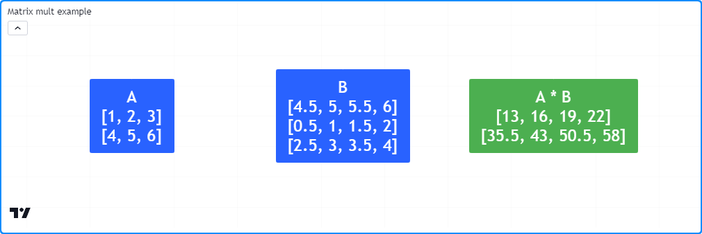

```c
//@version=5
indicator("Matrix mult example")

//@function Displays the rows of a matrix in a label with a note.
//@param    this The matrix to display.
//@param    barIndex The `bar_index` to display the label at.
//@param    bgColor The background color of the label.
//@param    textColor The color of the label's text.
//@param    note The text to display above the rows.
method debugLabel(
     matrix<float> this, int barIndex = bar_index, color bgColor = color.blue,
     color textColor = color.white, string note = ""
 ) =>
    labelText = note + "\n" + str.tostring(this)
    if barstate.ishistory
        label.new(
             barIndex, 0, labelText, color = bgColor, style = label.style_label_center,
             textcolor = textColor, size = size.huge
         )

//@variable A 2x3 matrix.
a = matrix.new<float>()
//@variable A 3x4 matrix.
b = matrix.new<float>()

// Add rows to `a`.
a.add_row(0, array.from(1, 2, 3))
a.add_row(1, array.from(4, 5, 6))

// Add rows to `b`.
b.add_row(0, array.from(0.5, 1.0, 1.5, 2.0))
b.add_row(1, array.from(2.5, 3.0, 3.5, 4.0))
b.add_row(0, array.from(4.5, 5.0, 5.5, 6.0))

if bar_index == last_bar_index - 1
    //@variable The result of `a` * `b`.
    matrix<float> ab = a.mult(b)
    // Display `a`, `b`, and `ab` matrices.
    debugLabel(a, note = "A")
    debugLabel(b, bar_index + 10, note = "B")
    debugLabel(ab, bar_index + 20, color.green, note = "A * B")
```

__Note que:__

- Em contraste com a multiplicação de escalares, a multiplicação de _matrices_ _não é comutativa_, ou seja, `matrix.mult(a, b)` não necessariamente produz o mesmo resultado que `matrix.mult(b, a)`. No contexto do exemplo acima , o último causará um erro de execução porque o número de colunas em `b` não é igual ao número de linhas em `a`.

Ao multiplicar uma _matrix_ e um [array](https://br.tradingview.com/pine-script-reference/v5/#type_array), esta função trata a operação da mesma maneira que multiplicar `id1` por uma _matrix_ de uma única coluna, mas retorna um [array](https://br.tradingview.com/pine-script-reference/v5/#type_array) com o mesmo número de elementos que o número de linhas em `id1`. Quando [matrix.mult()](https://br.tradingview.com/pine-script-reference/v5/#fun_matrix.mult) recebe um valor escalar como seu `id2`, a função retorna uma nova _matrix_ cujos elementos são os elementos em `id1` multiplicados pelo valor `id2`.

### `matrix.det()`

O [_determinante_](https://pt.wikipedia.org/wiki/Determinante) é um valor escalar associado a uma _matrix_ [quadrada](https://br.tradingview.com/pine-script-reference/v5/#fun_matrix.is_square) que descreve algumas de suas características, principalmente sua [invertibilidade](https://pt.wikipedia.org/wiki/Matriz_inversa). Se uma _matrix_ possui uma [inversa](https://br.tradingview.com/pine-script-reference/v5/#fun_matrix.inv), seu determinante não é zero. Caso contrário, a _matrix_ é _singular_ (não-invertível). Scripts podem calcular o determinante de uma _matrix_ por meio de [matrix.det()](https://br.tradingview.com/pine-script-reference/v5/#fun_matrix.det).

Programadores podem usar determinantes para detectar semelhanças entre _matrices_, identificar _matrices_ de [_posto completo_](https://pt.wikipedia.org/wiki/Posto_matricial) e _matrices_ com [_deficiência de posto_](https://pt.wikipedia.org/wiki/Posto_matricial), e resolver sistemas de equações lineares, entre outras aplicações.

Por exemplo, este script utiliza determinantes para resolver um sistema de equações lineares com um número correspondente de valores desconhecidos usando a [regra de Cramer](https://pt.wikipedia.org/wiki/Regra_de_Cramer). A função definida pelo usuário, `solve()`, retorna um [array](https://br.tradingview.com/pine-script-reference/v5/#type_array) contendo soluções para cada valor desconhecido no sistema, onde o _n-th_ (_n-ésimo_) elemento do array é o determinante da _matrix_ de coeficientes com a _n-th_ (_n-ésima_) coluna substituída pela coluna de constantes, dividido pelo determinante dos coeficientes originais.

Neste script, foi definida a _matrix_ `m` que contém coeficientes e constantes para essas três equações:

```c
3 * x0 + 4 * x1 - 1 * x2 = 8
5 * x0 - 2 * x1 + 1 * x2 = 4
2 * x0 - 2 * x1 + 1 * x2 = 1
```

A solução para este sistema é `(x0 = 1, x1 = 2, x2 = 3)`. O script calcula esses valores a partir de `m` por meio de `m.solve()` e os exibe no gráfico:

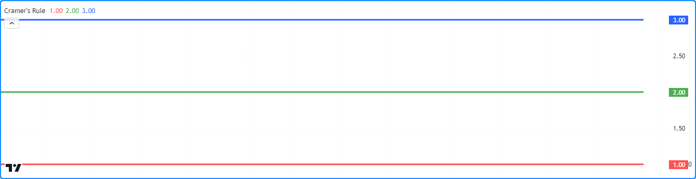

```c
//@version=5
indicator("Determinants example", "Cramer's Rule")

//@function Solves a system of linear equations with a matching number of unknowns using Cramer's rule.
//@param    this An augmented matrix containing the coefficients for each unknown and the results of
//          the equations. For example, a row containing the values 2, -1, and 3 represents the equation
//          `2 * x0 + (-1) * x1 = 3`, where `x0` and `x1` are the unknown values in the system.
//@returns  An array containing solutions for each variable in the system.
solve(matrix<float> this) =>
    //@variable The coefficient matrix for the system of equations.
    matrix<float> coefficients = this.submatrix(from_column = 0, to_column = this.columns() - 1)
    //@variable The array of resulting constants for each equation.
    array<float> constants = this.col(this.columns() - 1)
    //@variable An array containing solutions for each unknown in the system.
    array<float> result = array.new<float>()

    //@variable The determinant value of the coefficient matrix.
    float baseDet = coefficients.det()
    matrix<float> modified = na
    for col = 0 to coefficients.columns() - 1
        modified := coefficients.copy()
        modified.add_col(col, constants)
        modified.remove_col(col + 1)

        // Calculate the solution for the column's unknown by dividing the determinant of `modified` by the `baseDet`.
        result.push(modified.det() / baseDet)

    result

//@variable A 3x4 matrix containing coefficients and results for a system of three equations.
m = matrix.new<float>()

// Add rows for the following equations:
// Equation 1: 3 * x0 + 4 * x1 - 1 * x2 = 8
// Equation 2: 5 * x0 - 2 * x1 + 1 * x2 = 4
// Equation 3: 2 * x0 - 2 * x1 + 1 * x2 = 1
m.add_row(0, array.from(3.0, 4.0, -1.0, 8.0))
m.add_row(1, array.from(5.0, -2.0, 1.0, 4.0))
m.add_row(2, array.from(2.0, -2.0, 1.0, 1.0))

//@variable An array of solutions to the unknowns in the system of equations represented by `m`.
solutions = solve(m)

plot(solutions.get(0), "x0", color.red, 3)   // Plots 1.
plot(solutions.get(1), "x1", color.green, 3) // Plots 2.
plot(solutions.get(2), "x2", color.blue, 3)  // Plots 3.
```

__Note que:__

- Resolver sistemas de equações é particularmente útil para _análise de regressão_, por exemplo, regressão linear e polinomial.
- A regra de Cramer funciona bem para sistemas pequenos de equações. No entanto, é computacionalmente ineficiente em sistemas maiores. Outros métodos, como a [eliminação de Gauss](https://pt.wikipedia.org/wiki/Elimina%C3%A7%C3%A3o_de_Gauss), são frequentemente preferidos para esses casos.

### `matrix.inv()` e `matrix.pinv()`

Para qualquer _matrix_ [quadrada](https://br.tradingview.com/pine-script-reference/v5/#fun_matrix.is_square) não singular, existe uma _matrix_ inversa que produz a _matrix_ [identidade](https://br.tradingview.com/pine-script-reference/v5/#fun_matrix.is_identity) quando [multiplicada](./04_15_matrices.md#matrixmult) pela _matrix_ original. As inversas são úteis em várias transformações de _matrices_ e na solução de sistemas de equações. Scripts podem calcular a inversa de uma _matrix_ __quando ela existe__ por meio da função [matrix.inv()](https://br.tradingview.com/pine-script-reference/v5/#fun_matrix.inv).

Para _matrices_ singulares (não-invertíveis), pode-se calcular uma inversa generalizada ([pseudoinversa](https://pt.wikipedia.org/wiki/Inversa_de_Moore-Penrose)), independentemente de a _matrix_ ser quadrada ou ter um determinante não nulo, por meio da função [matrix.pinv()](https://br.tradingview.com/pine-script-reference/v5/#fun_matrix.pinv). É importante lembrar que, ao contrário de uma verdadeira inversa, o produto de uma pseudoinversa e a _matrix_ original não necessariamente resulta na _matrix_ identidade, a menos que a _matrix_ original _seja invertível_.

O exemplo a seguir forma uma _matrix_ `m` de 2x2 a partir de entradas do usuário, em seguida, utiliza os métodos [m.inv()](https://br.tradingview.com/pine-script-reference/v5/#fun_matrix.inv) e [m.pinv()](https://br.tradingview.com/pine-script-reference/v5/#fun_matrix.pinv) para calcular a inversa ou pseudoinversa de `m`. O script exibe a _matrix_ original, sua inversa ou pseudoinversa, e o produto delas em _labels_ no gráfico:

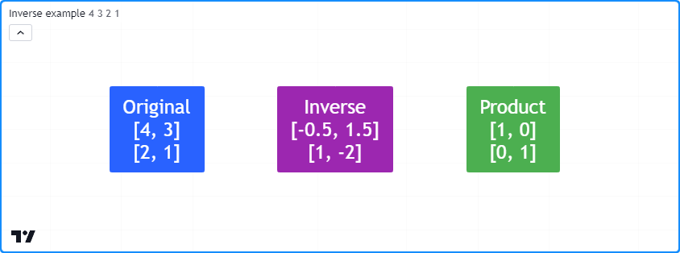

```c
//@version=5
indicator("Inverse example")

// Element inputs for the 2x2 matrix.
float r0c0 = input.float(4.0, "Row 0, Col 0")
float r0c1 = input.float(3.0, "Row 0, Col 1")
float r1c0 = input.float(2.0, "Row 1, Col 0")
float r1c1 = input.float(1.0, "Row 1, Col 1")

//@function Displays the rows of a matrix in a label with a note.
//@param    this The matrix to display.
//@param    barIndex The `bar_index` to display the label at.
//@param    bgColor The background color of the label.
//@param    textColor The color of the label's text.
//@param    note The text to display above the rows.
method debugLabel(
     matrix<float> this, int barIndex = bar_index, color bgColor = color.blue,
     color textColor = color.white, string note = ""
 ) =>
    labelText = note + "\n" + str.tostring(this)
    if barstate.ishistory
        label.new(
             barIndex, 0, labelText, color = bgColor, style = label.style_label_center,
             textcolor = textColor, size = size.huge
         )

//@variable A 2x2 matrix of input values.
m = matrix.new<float>()

// Add input values to `m`.
m.add_row(0, array.from(r0c0, r0c1))
m.add_row(1, array.from(r1c0, r1c1))

//@variable Is `true` if `m` is square with a nonzero determinant, indicating invertibility.
bool isInvertible = m.is_square() and m.det()

//@variable The inverse or pseudoinverse of `m`.
mInverse = isInvertible ? m.inv() : m.pinv()

//@variable The product of `m` and `mInverse`. Returns the identity matrix when `isInvertible` is `true`.
matrix<float> product = m.mult(mInverse)

if bar_index == last_bar_index - 1
    // Display `m`, `mInverse`, and their `product`.
    m.debugLabel(note = "Original")
    mInverse.debugLabel(bar_index + 10, color.purple, note = isInvertible ? "Inverse" : "Pseudoinverse")
    product.debugLabel(bar_index + 20, color.green, note = "Product")
```

__Note que:__

- Este script invoca somente a função [m.inv()](https://br.tradingview.com/pine-script-reference/v5/#fun_matrix.inv) quando `isInvertible` é `true`, ou seja, quando `m` é [quadrada](https://br.tradingview.com/pine-script-reference/v5/#fun_matrix.is_square) e possui um [determinante](https://br.tradingview.com/pine-script-reference/v5/#fun_matrix.det) não nulo. Caso contrário, utiliza [m.pinv()](https://br.tradingview.com/pine-script-reference/v5/#fun_matrix.pinv) para calcular a inversa generalizada.

### `matrix.rank()`

O _posto_ de uma _matrix_ representa o número de vetores linearmente independentes (linhas ou colunas) que ela contém. Em essência, o posto da _matrix_ mede o número de vetores que não podem ser expressos como uma combinação linear de outros, ou, em outras palavras, o número de vetores que contêm informações __únicas__. Scripts podem calcular o posto de uma _matrix_ por meio de [matrix.rank()](https://br.tradingview.com/pine-script-reference/v5/#fun_matrix.rank).

Este script identifica o número de vetores linearmente independentes em duas _matrices_ 3x3 (`m1` e `m2`) e exibe os valores em um painel separado. Como pode ser visto no gráfico, o valor de [m1.rank()](https://br.tradingview.com/pine-script-reference/v5/#fun_matrix.rank) é 3 porque cada vetor é único. Por outro lado, o valor de [m2.rank()](https://br.tradingview.com/pine-script-reference/v5/#fun_matrix.rank) é 1 porque possui apenas um vetor único:

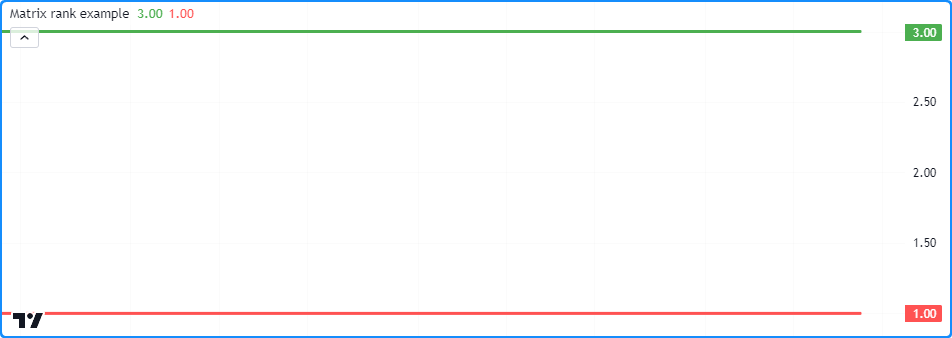

```c
//@version=5
indicator("Matrix rank example")

//@variable A 3x3 full-rank matrix.
m1 = matrix.new<float>()
//@variable A 3x3 rank-deficient matrix.
m2 = matrix.new<float>()

// Add linearly independent vectors to `m1`.
m1.add_row(0, array.from(3, 2, 3))
m1.add_row(1, array.from(4, 6, 6))
m1.add_row(2, array.from(7, 4, 9))

// Add linearly dependent vectors to `m2`.
m2.add_row(0, array.from(1, 2, 3))
m2.add_row(1, array.from(2, 4, 6))
m2.add_row(2, array.from(3, 6, 9))

// Plot `matrix.rank()` values.
plot(m1.rank(), color = color.green, linewidth = 3)
plot(m2.rank(), color = color.red, linewidth = 3)
```

__Note que:__

- O maior valor de posto que uma _matrix_ pode ter é o mínimo entre o número de suas linhas e colunas. Uma _matrix_ com o posto máximo possível é conhecida como uma _matrix_ de posto completo, e qualquer _matrix_ sem posto completo é conhecida como uma _matrix_ com deficiência de posto.
- Os [determinantes](./04_15_matrices.md#matrixdet) de _matrices_ quadradas de posto completo são não-nulos, e tais _matrices_ possuem [inversas](./04_15_matrices.md#matrixinv-e-matrixpinv). Por outro lado, o [determinante](https://br.tradingview.com/pine-script-reference/v5/#fun_matrix.det) de uma _matrix_ com deficiência de posto é sempre 0.
- Para qualquer _matrix_ que contenha apenas o mesmo valor em cada um de seus elementos (por exemplo, uma _matrix_ preenchida com 0), o posto é sempre 0, já que nenhum dos vetores contém informações únicas. Para qualquer outra _matrix_ com valores distintos, o posto mínimo possível é 1.


# Tratamento de Erros

Além dos erros de __compilação__ usuais, na qual ocorrem durante a compilação de um script devido à sintaxe imprópria, scripts que utilizam _matrices_ podem gerar erros específicos de __execução__ durante sua operação. Quando um script gera um erro de execução, ele exibe um ponto de exclamação vermelho ao lado do título do script. Os usuários podem visualizar a mensagem de erro clicando neste ícone.

Nesta seção, são abordados os erros de execução que os usuários podem encontrar ao utilizar _matrices_ em seus scripts.

## O _Index_ da Linha/Coluna (xx) Está Fora dos Limites, o Tamanho da Linha/Coluna é (yy).

Este erro de execução ocorre ao tentar acessar _indices_ fora das dimensões da _matrix_ com funções incluindo [matrix.get()](https://br.tradingview.com/pine-script-reference/v5/#fun_matrix.get), [matrix.set()](https://br.tradingview.com/pine-script-reference/v5/#fun_matrix.set), [matrix.fill()](https://br.tradingview.com/pine-script-reference/v5/#fun_matrix.fill) e [matrix.submatrix()](https://br.tradingview.com/pine-script-reference/v5/#fun_matrix.submatrix), bem como algumas das funções relacionadas às [linhas e colunas](./04_15_matrices.md#linhas-e-colunas) de uma _matrix_.

Por exemplo, este código contém duas linhas que produzirão esse erro de execução. O método [m.set()](https://br.tradingview.com/pine-script-reference/v5/#fun_matrix.set) referencia um _index_ de `row` (_linha_) que não existe (2). O método [m.submatrix()](https://br.tradingview.com/pine-script-reference/v5/#fun_matrix.submatrix) referencia todos os _indices_ de coluna até `to_column - 1`. Um valor de `to_column` igual a 4 resulta em um erro de execução porque o último _index_ de coluna referenciado (3) não existe em `m`:

```c
//@version=5
indicator("Out of bounds demo")

//@variable A 2x3 matrix with a max row index of 1 and max column index of 2.
matrix<float> m = matrix.new<float>(2, 3, 0.0)

m.set(row = 2, column = 0, value = 1.0)     // The `row` index is out of bounds on this line. The max value is 1.
m.submatrix(from_column = 1, to_column = 4) // The `to_column` index is invalid on this line. The max value is 3.

if bar_index == last_bar_index - 1
    label.new(bar_index, 0, str.tostring(m), color = color.navy, textcolor = color.white, size = size.huge)
```

Usuários podem evitar esse erro em seus scripts garantindo que suas chamadas de função não referenciem _indices_ maiores ou iguais ao número de linhas/colunas.

## O Tamanho do Array não Corresponde ao Número de Linhas/Colunas na _Matrix_.

Ao usar as funções [matrix.add_row()](https://br.tradingview.com/pine-script-reference/v5/#fun_matrix.add_row) e [matrix.add_col()](https://br.tradingview.com/pine-script-reference/v5/#fun_matrix.add_col) para [inserir](./04_15_matrices.md#inserindo) linhas e colunas em uma _matrix_ não-vazia, o tamanho do array inserido deve estar alinhado com as dimensões da _matrix_. O tamanho de uma linha inserida deve corresponder ao número de colunas, e o tamanho de uma coluna inserida deve corresponder ao número de linhas. Caso contrário, o script gerará este erro de execução.

Por exemplo:

```c
//@version=5
indicator("Invalid array size demo")

// Declare an empty matrix.
m = matrix.new<float>()

m.add_col(0, array.from(1, 2))    // Add a column. Changes the shape of `m` to 2x1.
m.add_col(1, array.from(1, 2, 3)) // Raises a runtime error because `m` has 2 rows, not 3.

plot(m.col(0).get(1))
```

__Note que:__

- Quando `m` está vazia, pode-se inserir uma linha ou coluna de array de _qualquer_ tamanho, conforme mostrado na primeira linha de `m.add_col()`.

## Não é Possível Chamar Métodos de _Matrix_ quando o ID da _Matrix_ é 'na'.

Quando uma variável de _matrix_ é atribuída a `na`, significa que a variável não referencia um objeto existente. Consequentemente, não se pode usar funções e métodos incorporados `matrix.*()` com ela.

Por exemplo:

```c
//@version=5
indicator("na matrix methods demo")

//@variable A `matrix` variable assigned to `na`.
matrix<float> m = na

mCopy = m.copy() // Raises a runtime error. You can't copy a matrix that doesn't exist.

if bar_index == last_bar_index - 1
    label.new(bar_index, 0, str.tostring(mCopy), color = color.navy, textcolor = color.white, size = size.huge)
```

Para resolver este erro, atribua `m` a uma instância válida de _matrix_ antes de usar funções `matrix.*()`.

## A _Matrix_ é Muito Grande. O Tamanho Máximo da _Matrix_ é de 100.000 Elementos.

O número total de elementos em uma _matrix_ ([matrix.elements_count()](https://br.tradingview.com/pine-script-reference/v5/#fun_matrix.elements_count)) não pode exceder __100.000__, independentemente de sua forma.

Por exemplo, este script gerará um erro porque [insere](./04_15_matrices.md#inserindo) 1000 linhas com 101 elementos na _matrix_ `m`:

```c
//@version=5
indicator("Matrix too large demo")

var matrix<float> m = matrix.new<float>()

if bar_index == 0
    for i = 1 to 1000
        // This raises an error because the script adds 101 elements on each iteration.
        // 1000 rows * 101 elements per row = 101000 total elements. This is too large.
        m.add_row(m.rows(), array.new<float>(101, i))

plot(m.get(0, 0))
```

## O _Index_ de Linha/Coluna Deve Ser 0 <= `from_row/column` < `to_row/column`.

Ao usar funções `matrix.*()` com _indices_ `from_row/column` e `to_row/column`, os valores `from_*` devem ser menores que os valores `to_*`, sendo o valor mínimo possível 0. Caso contrário, o script gerará um erro de execução.

Por exemplo, este script mostra uma tentativa de declarar uma [submatrix](./04_15_matrices.md#submatrizes-submatrices) de uma _matrix_ `m` 4x4 com um valor `from_row` de 2 e um valor `to_row` de 2, o que resultará em um erro:

```c
//@version=5
indicator("Invalid from_row, to_row demo")

//@variable A 4x4 matrix filled with a random value.
matrix<float> m = matrix.new<float>(4, 4, math.random())

matrix<float> mSub = m.submatrix(from_row = 2, to_row = 2) // Raises an error. `from_row` can't equal `to_row`.

plot(mSub.get(0, 0))
```

## Matrizes 'id1' e 'id2' Devem ter um Número Igual de Linhas e Colunas para Serem Adicionadas.

Ao usar as funções [matrix.sum() e matrix.diff()](./04_15_matrices.md#matrixsum-e-matrixdiff), as _matrices_ `id1` e `id2` devem ter o mesmo número de linhas e o mesmo número de colunas. Tentar adicionar ou subtrair duas _matrices_ com dimensões incompatíveis gerará um erro, conforme demonstrado por este código:

```c
//@version=5
indicator("Invalid sum dimensions demo")

//@variable A 2x3 matrix.
matrix<float> m1 = matrix.new<float>(2, 3, 1)
//@variable A 3x4 matrix.
matrix<float> m2 = matrix.new<float>(3, 4, 2)

mSum = matrix.sum(m1, m2) // Raises an error. `m1` and `m2` don't have matching dimensions.

plot(mSum.get(0, 0))
```

## O Número de Colunas na _Matrix_ 'id1' deve ser Igual ao Número de Linhas na _Matrix_ (ou ao Número de Elementos no Array) 'id2'.

Ao usar [matrix.mult()](./04_15_matrices.md#matrixmult) para multiplicar uma _matrix_ `id1` por uma _matrix_ `id2` ou array, [matrix.rows()](https://br.tradingview.com/pine-script-reference/v5/#fun_matrix.rows) ou [array.size()](https://br.tradingview.com/pine-script-reference/v5/#fun_array.size) de `id2` deve ser igual a [matrix.columns()](https://br.tradingview.com/pine-script-reference/v5/#fun_matrix.columns) em `id1`. Se eles não estiverem alinhados, o script gerará este erro.

Por exemplo, este script tenta multiplicar duas _matrices_ 2x3. Embora seja possível _adicionar_ essas _matrices_, _multiplicá-las_ não é possível:

```c
//@version=5
indicator("Invalid mult dimensions demo")

//@variable A 2x3 matrix.
matrix<float> m1 = matrix.new<float>(2, 3, 1)
//@variable A 2x3 matrix.
matrix<float> m2 = matrix.new<float>(2, 3, 2)

mSum = matrix.mult(m1, m2) // Raises an error. The number of columns in `m1` and rows in `m2` aren't equal.

plot(mSum.get(0, 0))
```

## Operação não Disponível para _Matrices_ não Quadradas.

Algumas operações de _matrix_, incluindo [matrix.inv()](https://br.tradingview.com/pine-script-reference/v5/#fun_matrix.inv), [matrix.det()](https://br.tradingview.com/pine-script-reference/v5/#fun_matrix.det), [matrix.eigenvalues()](https://br.tradingview.com/pine-script-reference/v5/#fun_matrix.eigenvalues) e [matrix.eigenvectors()](https://br.tradingview.com/pine-script-reference/v5/#fun_matrix.eigenvectors), funcionam apenas com _matrices_ __quadradas__, ou seja, _matrices_ com o mesmo número de linhas e colunas. Ao tentar executar tais funções em _matrices_ não quadradas, o script gerará um erro indicando que a operação não está disponível ou que não é possível calcular o resultado para o `id` da _matrix_.

Por exemplo:

```c
//@version=5
indicator("Non-square demo")

//@variable A 3x5 matrix.
matrix<float> m = matrix.new<float>(3, 5, 1)

plot(m.det()) // Raises a runtime error. You can't calculate the determinant of a 3x5 matrix.
```
