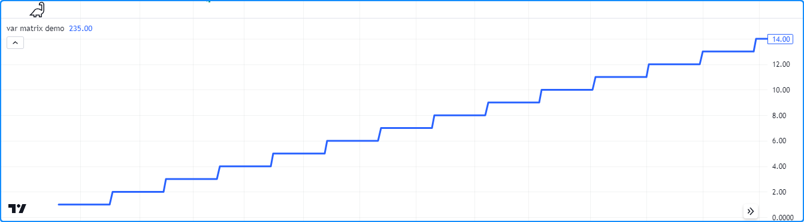
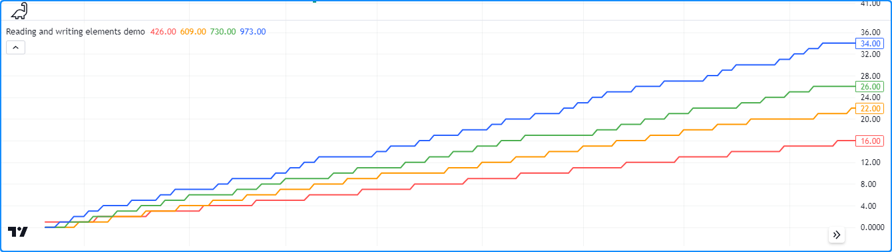
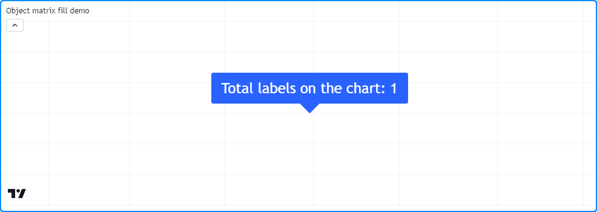

# Matrices (_Matrix_)

> __Observação__\
> Esta seção contém material avançado. Recomenda-se que programadores iniciantes em Pine Script se familiarizem com outras funcionalidades do Pine Script mais acessíveis antes de explorarem este conteúdo.

_Matrices_ no Pine Script são coleções que armazenam referências de valores em um formato retangular. Elas são essencialmente equivalentes a objetos de [array](https://br.tradingview.com/pine-script-reference/v5/#type_array) bidimensionais com funções e métodos para inspeção, modificação e cálculos especializados. Assim como os [arrays](./04_14_arrays.md), todos os elementos de uma _matrix_ devem ser do mesmo [type](./04_09_tipagem_do_sistema.md#tipos) (_tipo_), que pode ser um [tipo integrado](./04_09_tipagem_do_sistema.md#qualificadores) ou [definido pelo usuário](./04_09_tipagem_do_sistema.md#tipos-definidos-pelo-usuário).

_Matrices_ referenciam seus elementos usando dois _indices_: um _index_ para suas linhas e outro para suas colunas. Cada _index_ começa em _0_ e se estende até o _número de linhas/colunas na matrix_ menos um_. _Matrices_ no Pine podem ter números dinâmicos de linhas e colunas que variam ao longo das barras. O [número total de elementos](https://br.tradingview.com/pine-script-reference/v5/#fun_matrix.elements_count) dentro de uma _matrix_ é o produto do número de [rows](https://br.tradingview.com/pine-script-reference/v5/#fun_matrix.rows) (_linhas_) e [columns](https://br.tradingview.com/pine-script-reference/v5/#fun_matrix.columns) (_colunas_) (por exemplo, uma _matrix_ 5x5 tem um total de 25). Como os [arrays](./04_14_arrays.md), o número total de elementos em uma _matrix_ não pode exceder _100.000_.


# Declarando uma Matrix

O Pine Script utiliza a seguinte sintaxe para a declaração de _matrix_:

```c
[var/varip ][matrix<type> ]<identifier> = <expression>
```

Onde `<type>` é um [template de tipo](./04_09_tipagem_do_sistema.md#templates-de-tipo) para a _matrix_ que declara o tipo de valores que ela conterá, e `<expression>` retorna uma instância de _matrix_ desse tipo ou `na`.

Ao declarar uma variável de _matrix_ como `na`, deve-se especificar que o identificador fará referência a _matrices_ de um tipo específico, incluindo a palavra-chave [matrix](https://br.tradingview.com/pine-script-reference/v5/#type_matrix) seguida de um [template de tipo](./04_09_tipagem_do_sistema.md#templates-de-tipo).

Esta linha declara uma nova variável `myMatrix` com um valor de `na`. Ela declara explicitamente a variável como `matrix<float>`, o que indica ao compilador que a variável só pode aceitar objetos de _[matrix](https://br.tradingview.com/pine-script-reference/v5/#type_matrix)_ contendo valores do tipo [float](https://br.tradingview.com/pine-script-reference/v5/#type_float):

```c
matrix<float> myMatrix = na
```

Quando uma variável de _matrix_ não é atribuída a `na`, a palavra-chave [matrix](https://br.tradingview.com/pine-script-reference/v5/#type_matrix) e seu [modelo de tipo](./04_09_tipagem_do_sistema.md#templates-de-tipo) são opcionais, pois o compilador utilizará as informações de tipo do objeto ao qual a variável faz referência.

Aqui, declara-se uma variável `myMatrix` referenciando uma nova instância de `matrix<float>` com duas linhas, duas colunas e um `initial_value` de _0_. A variável obtém suas informações de tipo do novo objeto neste caso, portanto, não requer uma declaração de tipo explícita:

```c
myMatrix = matrix.new<float>(2, 2, 0.0)
```

## Utilizando as Palavras-Chave `var` e `varip`

Assim como com as outras variáveis, pode-se incluir as palavras-chave [var](https://br.tradingview.com/pine-script-reference/v5/#kw_var) ou [varip](https://br.tradingview.com/pine-script-reference/v5/#kw_varip) para instruir um script a declarar uma variável de _matrix_ apenas uma vez, em vez de em cada barra. Uma variável de _matrix_ declarada com essa palavra-chave apontará para a mesma instância ao longo do período do gráfico, a menos que o script atribua explicitamente outra _matrix_ a ela, permitindo que uma _matrix_ e suas referências de elementos persistam entre as iterações do script.

Este script declara uma variável `m` atribuída a uma _matrix_ que contém uma única linha de dois elementos [int](https://br.tradingview.com/pine-script-reference/v5/#type_int) usando a palavra-chave [var](https://br.tradingview.com/pine-script-reference/v5/#kw_var). A cada _20ª_ barra, o script adiciona 1 ao primeiro elemento na primeira linha da _matrix_ `m`. A chamada de [plot()](https://br.tradingview.com/pine-script-reference/v5/#fun_plot) exibe esse elemento no gráfico. Conforme observado a _plotagem_ no gráfico, o valor de [m.get(0, 0)](https://br.tradingview.com/pine-script-reference/v5/#fun_matrix.get) persiste entre as barras, nunca retornando ao valor inicial de _0_:



```c
//@version=5
indicator("var matrix demo")

//@variable A 1x2 rectangular matrix declared only at `bar_index == 0`, i.e., the first bar.
var m = matrix.new<int>(1, 2, 0)

//@variable Is `true` on every 20th bar.
bool update = bar_index % 20 == 0

if update
    int currentValue = m.get(0, 0) // Get the current value of the first row and column.
    m.set(0, 0, currentValue + 1)  // Set the first row and column element value to `currentValue + 1`.

plot(m.get(0, 0), linewidth = 3) // Plot the value from the first row and column.
```

> __Observação__\
> Variáveis de _matrix_ declaradas usando [varip](https://br.tradingview.com/pine-script-reference/v5/#kw_varip) comportam-se como as que utilizam [var](https://br.tradingview.com/pine-script-reference/v5/#kw_var) em dados históricos, mas atualizam seus valores para barras em tempo real (ou seja, as barras desde a última compilação do script) a cada novo tick de preço. _Matrices_ atribuídas a variáveis [varip](https://br.tradingview.com/pine-script-reference/v5/#kw_varip) podem conter apenas tipos [int](https://br.tradingview.com/pine-script-reference/v5/#type_int), [float](https://br.tradingview.com/pine-script-reference/v5/#type_float), [bool](https://br.tradingview.com/pine-script-reference/v5/#type_bool), [color](https://br.tradingview.com/pine-script-reference/v5/#type_color) ou [string](https://br.tradingview.com/pine-script-reference/v5/#type_string) ou [tipos definidos pelo usuário](./04_09_tipagem_do_sistema.md#tipos-definidos-pelo-usuário) que contenham exclusivamente em seus campos esses tipos ou coleções ([arrays](./04_14_arrays.md), [matrices](./04_15_matrices.md), ou [maps](000_maps.md)) (_arrays_, _matrizes_ ou _mapas_) desses tipos.


# Leitura e Escrita de Elementos de _Matrix_

## `matrix.get()` e `matrix.set()`

Para buscar o valor de uma _matrix_ em um _index_ de `row` (_linha_) e `column` (_coluna_) especificados, utiliza-se [matrix.get()](https://br.tradingview.com/pine-script-reference/v5/#fun_matrix.get). Esta função localiza o elemento de _matrix_ especificado e retorna seu valor. Da mesma forma, para sobrescrever o valor de um elemento específico, usa-se [matrix.set()](https://br.tradingview.com/pine-script-reference/v5/#fun_matrix.set) para atribuir o elemento no _index_ de `row` (_linha_) e `column` (_coluna_) especificados a um novo `value` (_valor_).

O exemplo abaixo define uma _matrix_ quadrada `m` com duas linhas e colunas e um `initial_value` de _0_ para todos os elementos na primeira barra. O script adiciona 1 ao valor de cada elemento em barras diferentes usando os métodos [m.get()](https://br.tradingview.com/pine-script-reference/v5/#fun_matrix.get) e [m.set()](https://br.tradingview.com/pine-script-reference/v5/#fun_matrix.set). Atualiza o primeiro valor da primeira linha a cada 11 barras, o segundo valor da primeira linha a cada 7 barras, o primeiro valor da segunda linha a cada 5 barras e o segundo valor da segunda linha a cada 3 barras.

O script _plota_ o valor de cada elemento no gráfico:



```c
//@version=5
indicator("Reading and writing elements demo")

//@variable A 2x2 square matrix of `float` values.
var m = matrix.new<float>(2, 2, 0.0)

switch
    bar_index % 11 == 0 => m.set(0, 0, m.get(0, 0) + 1.0) // Adds 1 to the value at row 0, column 0 every 11th bar.
    bar_index % 7  == 0 => m.set(0, 1, m.get(0, 1) + 1.0) // Adds 1 to the value at row 0, column 1 every 7th bar.
    bar_index % 5  == 0 => m.set(1, 0, m.get(1, 0) + 1.0) // Adds 1 to the value at row 1, column 0 every 5th bar.
    bar_index % 3  == 0 => m.set(1, 1, m.get(1, 1) + 1.0) // Adds 1 to the value at row 1, column 1 every 3rd bar.

plot(m.get(0, 0), "Row 0, Column 0 Value", color.red, 2)
plot(m.get(0, 1), "Row 0, Column 1 Value", color.orange, 2)
plot(m.get(1, 0), "Row 1, Column 0 Value", color.green, 2)
plot(m.get(1, 1), "Row 1, Column 1 Value", color.blue, 2)
```

## `matrix.fill()`

Para sobrescrever todos os elementos da _matrix_ com um valor específico, utiliza-se [matrix.fill()](https://br.tradingview.com/pine-script-reference/v5/#fun_matrix.fill). Essa função direciona todos os itens na _matrix_ inteira ou dentro do intervalo de _indices_ `from_row/column` a `to_row/column` para o `value` especificado na chamada.

Por exemplo, este exemplo declara uma _matrix_ quadrada 4x4 e, em seguida, preenche seus elementos com um valor [random](https://br.tradingview.com/pine-script-reference/v5/#fun_math.random) (_aleatório_):

```c
myMatrix = matrix.new<float>(4, 4)
myMatrix.fill(math.random())
```

Observe que, ao usar [matrix.fill()](https://br.tradingview.com/pine-script-reference/v5/#fun_matrix.fill) com _matrices_ contendo tipos especiais ([line](https://br.tradingview.com/pine-script-reference/v5/#type_line), [linefill](https://br.tradingview.com/pine-script-reference/v5/#type_linefill), [box](https://br.tradingview.com/pine-script-reference/v5/#type_box), [polyline](https://br.tradingview.com/pine-script-reference/v5/#type_polyline), [label](https://br.tradingview.com/pine-script-reference/v5/#type_label), [table](https://br.tradingview.com/pine-script-reference/v5/#type_table) ou [chart.point](https://br.tradingview.com/pine-script-reference/v5/#type_chart.point)) ou [UDTs](./04_09_tipagem_do_sistema.md#tipos-definidos-pelo-usuário), todos os elementos substituídos apontarão para o mesmo objeto passado na chamada da função.

Este script declara uma _matrix_ com quatro linhas e colunas de referências de [_label_](https://br.tradingview.com/pine-script-reference/v5/#type_label), que são preenchidas com um novo objeto de[ _label_](https://br.tradingview.com/pine-script-reference/v5/#type_label) na primeira barra. Em cada barra, o script define o atributo `x` da _label_ referenciada na linha 0, coluna 0 para [bar_index](https://br.tradingview.com/pine-script-reference/v5/#var_bar_index), e o atributo `text` daquela referenciada na linha 3, coluna 3 para o número de _labels_ no gráfico. Embora a _matrix_ possa referenciar 16 (4x4) _labels_, cada elemento aponta para a _mesma_ instância, resultando em apenas uma _label_ no gráfico que atualiza seus atributos `x` e `text` a cada barra:



```c
//@version=5
indicator("Object matrix fill demo")

//@variable A 4x4 label matrix.
var matrix<label> m = matrix.new<label>(4, 4)

// Fill `m` with a new label object on the first bar.
if bar_index == 0
    m.fill(label.new(0, 0, textcolor = color.white, size = size.huge))

//@variable The number of label objects on the chart.
int numLabels = label.all.size()

// Set the `x` of the label from the first row and column to `bar_index`.
m.get(0, 0).set_x(bar_index)
// Set the `text` of the label at the last row and column to the number of labels.
m.get(3, 3).set_text(str.format("Total labels on the chart: {0}", numLabels))
```
