# Maps (_Mapas_)

> __Observação!__\
> Esta seção contém material avançado. Recomenda-se que programadores iniciantes em Pine Script se familiarizem com outras funcionalidades do Pine Script mais acessíveis antes de explorarem este conteúdo.

Os mapas do Pine Script são coleções que armazenam elementos em _key-value pairs_ (_pares de chave-valor_). Eles permitem que os scripts armazenem e associem múltiplos valores referenciados associados a identificadores únicos (chaves).

Ao contrário de [arrays](./04_14_arrays.md) e [_matrices_](./04_15_matrices.md), os mapas são considerados coleções _não ordenadas_. Scripts acessam rapidamente os valores de um mapa referenciando as chaves dos pares chave-valor inseridos neles, em vez de percorrer um _index_ interno.

As chaves de um mapa podem ser de qualquer _tipo fundamental_, e seus valores podem ser de qualquer tipo incorporado ou [definido pelo usuário](./04_09_tipagem_do_sistema.md#tipos-definidos-pelo-usuário). Mapas não podem usar diretamente outras _coleções_ ([mapas](./04_16_mapas.md), [arrays](./04_14_arrays.md) ou [_matrices_](./04_15_matrices.md)) como valores, mas podem conter instâncias de [UDT](./04_09_tipagem_do_sistema.md#tipos-definidos-pelo-usuário) que contêm essas estruturas de dados em seus campos. Veja [esta seção](./04_16_mapas.md#mapas-de-outras-coleções) para mais informações.

Assim como outras coleções, os mapas podem conter até 100.000 elementos no total. Uma vez que cada par chave-valor em um mapa consiste em dois elementos (uma chave _única_ e seu _valor_ associado), o número máximo de pares chave-valor que um mapa pode conter é 50.000.


# Declarando Mapa

Pine Script utiliza a seguinte sintaxe para declarar mapas:

```c
[var/varip ][map<keyType, valueType> ]<identifier> = <expression>
```

Onde `<keyType, valueType>` é o [modelo de tipo](./04_09_tipagem_do_sistema.md#templates-de-tipo) do mapa que declara os tipos de chaves e valores que ele conterá, e a `<expression>` retorna uma instância de mapa ou `na`.

Ao declarar uma variável de mapa atribuída a `na`, os usuários devem incluir a palavra-chave [map](https://br.tradingview.com/pine-script-reference/v5/#type_map) seguida de um [modelo de tipo](./04_09_tipagem_do_sistema.md#templates-de-tipo) para informar ao compilador que a variável pode aceitar mapas com chaves do tipo `keyType` e valores do tipo `valueType`.

Por exemplo, esta linha de código declara uma nova variável `myMap` que pode aceitar instâncias de mapa contendo pares de chaves do tipo [string](https://br.tradingview.com/pine-script-reference/v5/#type_string) e valores do tipo [float](https://br.tradingview.com/pine-script-reference/v5/#type_float):

```c
map<string, float> myMap = na
```

## Utilizando as Palavras-Chave `var` e `varip`

Usuários podem incluir as palavras-chave [var](https://br.tradingview.com/pine-script-reference/v5/#kw_var) ou [varip](https://br.tradingview.com/pine-script-reference/v5/#kw_varip) para instruir seus scripts a declarar variáveis de mapa apenas na primeira barra do gráfico. Variáveis que usam essas palavras-chave apontam para as mesmas instâncias de mapa em cada iteração do script até serem explicitamente reatribuídas.

Por exemplo, este script declara uma variável `colorMap` atribuída a um mapa que contém pares de chaves do tipo [string](https://br.tradingview.com/pine-script-reference/v5/#type_string) e valores do tipo [color](https://br.tradingview.com/pine-script-reference/v5/#type_color) (_cor_) na primeira barra do gráfico. O script exibe um `oscilador` no gráfico e usa os valores [put](https://br.tradingview.com/pine-script-reference/v5/#fun_map.put) (_inseridos_) no `colorMap` na _primeira_ barra para colorir os plots em _todas_ as barras:

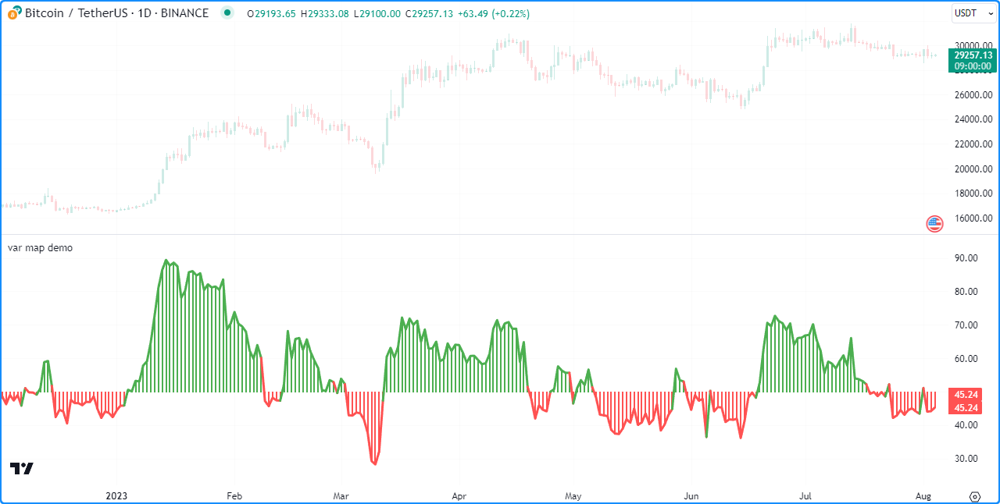

```c
//@version=5
indicator("var map demo")

//@variable A map associating color values with string keys.
var colorMap = map.new<string, color>()

// Put `<string, color>` pairs into `colorMap` on the first bar.
if bar_index == 0
    colorMap.put("Bull", color.green)
    colorMap.put("Bear", color.red)
    colorMap.put("Neutral", color.gray)

//@variable The 14-bar RSI of `close`.
float oscillator = ta.rsi(close, 14)

//@variable The color of the `oscillator`.
color oscColor = switch
    oscillator > 50 => colorMap.get("Bull")
    oscillator < 50 => colorMap.get("Bear")
    =>                 colorMap.get("Neutral")

// Plot the `oscillator` using the `oscColor` from our `colorMap`.
plot(oscillator, "Histogram", oscColor, 2, plot.style_histogram, histbase = 50)
plot(oscillator, "Line", oscColor, 3)
```

> __Observação!__\
> Variáveis de mapa declaradas usando [varip](https://br.tradingview.com/pine-script-reference/v5/#kw_varip) comportam-se como aquelas usando [var](https://br.tradingview.com/pine-script-reference/v5/#kw_var) em dados históricos, mas atualizam seus pares chave-valor para barras em tempo real (ou seja, as barras desde a última compilação do script) a cada novo tick de preço. Mapas atribuídos a variáveis [varip](https://br.tradingview.com/pine-script-reference/v5/#kw_varip) só podem conter valores dos tipos [int](https://br.tradingview.com/pine-script-reference/v5/#type_int), [float](https://br.tradingview.com/pine-script-reference/v5/#type_float), [bool](https://br.tradingview.com/pine-script-reference/v5/#type_bool), [color](https://br.tradingview.com/pine-script-reference/v5/#type_color) ou [string](https://br.tradingview.com/pine-script-reference/v5/#type_string) ou [tipos definidos pelo usuário](./04_09_tipagem_do_sistema.md#tipos-definidos-pelo-usuário) que contenham exclusivamente dentro de seus campos esses tipos ou coleções ([arrays](./04_14_arrays.md), [matrizes](./04_15_matrices.md) ou [mapas](./04_16_mapas.md)) desses tipos.


# Lendo e Escrevendo

## Inserindo e Obtendo Pares Chave-Valor

A função [map.put()](https://br.tradingview.com/pine-script-reference/v5/#fun_map.put) é uma que os usuários de mapas utilizarão frequentemente, pois é o método principal para inserir um novo par chave-valor em um mapa. Ela associa o argumento `key` (_chave_) ao argumento `value` (_valor_) na chamada e adiciona o par ao id do mapa.

Se o argumento `key` (_chave_) na chamada de [map.put()](https://br.tradingview.com/pine-script-reference/v5/#fun_map.put) já existir nas [chaves](https://br.tradingview.com/pine-script-reference/v5/#fun_map.keys) do mapa, o novo par passado para a função __substituirá__ o existente.

Para recuperar o valor de um `id` de mapa associado a uma `key` (_chave_) específica, use [map.get()](https://br.tradingview.com/pine-script-reference/v5/#fun_map.get). Esta função retorna o valor se o mapa `id` [contiver](https://br.tradingview.com/pine-script-reference/v5/#fun_map.contains) a `key` (_chave_). Caso contrário, retorna [na](https://br.tradingview.com/pine-script-reference/v5/#var_na).

O exemplo a seguir calcula a diferença entre os valores de [bar_index](https://br.tradingview.com/pine-script-reference/v5/#var_bar_index) de quando o [fechamento](https://br.tradingview.com/pine-script-reference/v5/#var_close) estava [subindo](https://br.tradingview.com/pine-script-reference/v5/#fun_ta.rising) e [caindo](https://br.tradingview.com/pine-script-reference/v5/#fun_ta.falling) ao longo de um determinado `length`, com a ajuda dos métodos [map.put()](https://br.tradingview.com/pine-script-reference/v5/#fun_map.put) e [map.get()](https://br.tradingview.com/pine-script-reference/v5/#fun_map.get). O script insere um par `("Rising", bar_index)` no mapa de `data` (_dados_) quando o preço está subindo e insere um par `("Falling", bar_index)` no mapa quando o preço está caindo. Em seguida, insere no mapa um par contendo a "Difference" ("_Diferença_") entre os valores "Rising" ("_Subindo_") e "Falling" ("_Caindo_") e plota seu valor no gráfico:

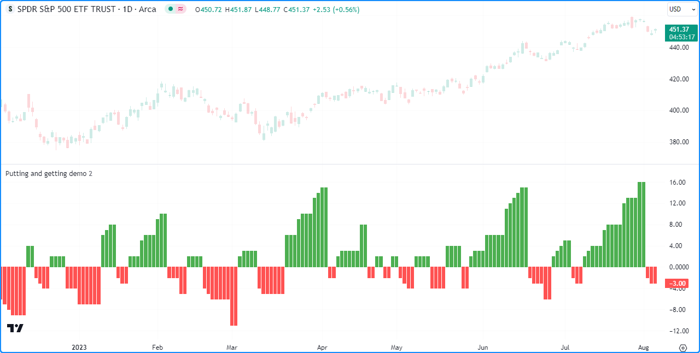

```c
//@version=5
indicator("Putting and getting demo")

//@variable The length of the `ta.rising()` and `ta.falling()` calculation.
int length = input.int(2, "Length")

//@variable A map associating `string` keys with `int` values.
var data = map.new<string, int>()

// Put a new ("Rising", `bar_index`) pair into the `data` map when `close` is rising.
if ta.rising(close, length)
    data.put("Rising", bar_index)
// Put a new ("Falling", `bar_index`) pair into the `data` map when `close` is falling.
if ta.falling(close, length)
    data.put("Falling", bar_index)

// Put the "Difference" between current "Rising" and "Falling" values into the `data` map.
data.put("Difference", data.get("Rising") - data.get("Falling"))

//@variable The difference between the last "Rising" and "Falling" `bar_index`.
int index = data.get("Difference")

//@variable Returns `color.green` when `index` is positive, `color.red` when negative, and `color.gray` otherwise.
color indexColor = index > 0 ? color.green : index < 0 ? color.red : color.gray

plot(index, color = indexColor, style = plot.style_columns)
```

__Note que:__

- Este script substitui os valores associados às chaves "Rising" ("_Subindo_"), "Falling" ("_Caindo_") e "Difference" ("_Diferença_") em chamadas sucessivas de [data.put()](https://br.tradingview.com/pine-script-reference/v5/#fun_map.put), já que cada uma dessas chaves é única e só pode aparecer uma vez no mapa de `data` (_dados_).
- Substituir os pares em um mapa não altera a _ordem_ interna de _inserção_ de suas chaves. Isso é discutido mais detalhadamente na [próxima seção](./04_16_mapas.md#inspecionando-chaves-e-valores).

Semelhante ao trabalho com outras coleções, ao inserir um valor de um tipo especial ([line](https://br.tradingview.com/pine-script-reference/v5/#type_line), [linefill](https://br.tradingview.com/pine-script-reference/v5/#type_linefill), [box](https://br.tradingview.com/pine-script-reference/v5/#type_box), [polyline](https://br.tradingview.com/pine-script-reference/v5/#type_polyline), [label](https://br.tradingview.com/pine-script-reference/v5/#type_label), [table](https://br.tradingview.com/pine-script-reference/v5/#type_table) ou [chart.point](https://br.tradingview.com/pine-script-reference/v5/#type_chart.point)) ou [tipos definidos pelo usuário](./04_09_tipagem_do_sistema.md#tipos-definidos-pelo-usuário) em um mapa, é importante notar que o `value` (_valor_) do par inserido aponta para o mesmo objeto sem copiá-lo. Modificar o valor referenciado por um par chave-valor também afetará o objeto original.

Por exemplo, este script contém um tipo personalizado `ChartData` com os campos `o`, `h`, `l` e `c`. Na primeira barra do gráfico, o script declara uma variável `myMap` e adiciona o par `("A", myData)`, onde `myData` é uma instância de `ChartData` com valores iniciais de campo `na`. Ele adiciona o par `("B", myData)` ao `myMap` e atualiza o objeto deste par em cada barra por meio do método `update()` definido pelo usuário.

A cada alteração no objeto com a chave "B" afeta o objeto referenciado pela chave "A", como mostrado pelo gráfico de velas dos campos do objeto "A":

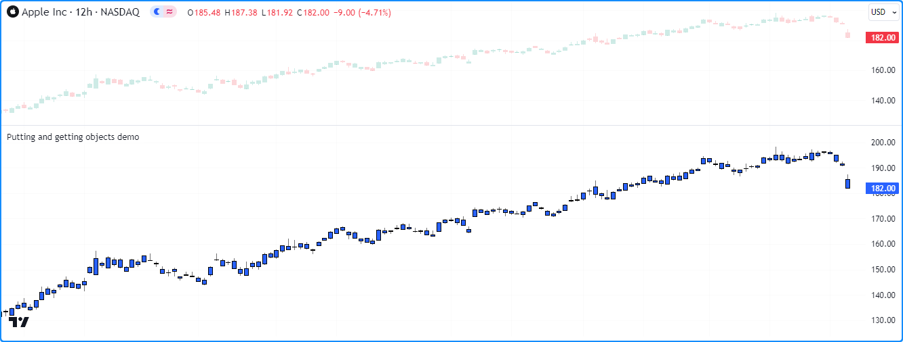

```c
//@version=5
indicator("Putting and getting objects demo")

//@type A custom type to hold OHLC data.
type ChartData
    float o
    float h
    float l
    float c

//@function Updates the fields of a `ChartData` object.
method update(ChartData this) =>
    this.o := open
    this.h := high
    this.l := low
    this.c := close

//@variable A new `ChartData` instance declared on the first bar.
var myData = ChartData.new()
//@variable A map associating `string` keys with `ChartData` instances.
var myMap = map.new<string, ChartData>()

// Put a new pair with the "A" key into `myMap` only on the first bar.
if bar_index == 0
    myMap.put("A", myData)

// Put a pair with the "B" key into `myMap` on every bar.
myMap.put("B", myData)

//@variable The `ChartData` value associated with the "A" key in `myMap`.
ChartData oldest = myMap.get("A")
//@variable The `ChartData` value associated with the "B" key in `myMap`.
ChartData newest = myMap.get("B")

// Update `newest`. Also affects `oldest` and `myData` since they all reference the same `ChartData` object.
newest.update()

// Plot the fields of `oldest` as candles.
plotcandle(oldest.o, oldest.h, oldest.l, oldest.c)
```

__Note que:__

- Este script se comportaria de maneira diferente se passasse uma cópia de `myData` em cada chamada de [myMap.put()](https://br.tradingview.com/pine-script-reference/v5/#fun_map.put). Para mais informações, consulte [esta seção](./04_12_objetos.md#copiando-objetos) sobre [objetos](./04_12_objetos.md).

## Inspecionando Chaves e Valores

### `map.keys()` e `map.values()`

Para recuperar todas as chaves e valores inseridos em um mapa, use [map.keys()](https://br.tradingview.com/pine-script-reference/v5/#fun_map.keys) e [map.values()](https://br.tradingview.com/pine-script-reference/v5/#fun_map.values). Essas funções copiam todas as referências de chave/valor dentro de um `id` de mapa para um novo objeto de [array](https://br.tradingview.com/pine-script-reference/v5/#type_array). Modificar o array retornado por qualquer uma dessas funções não afeta o mapa `id`.

Embora os mapas sejam coleções _não ordenadas_, o Pine Script mantém internamente a _ordem_ de _inserção_ dos pares chave-valor de um mapa. Como resultado, as funções [map.keys()](https://br.tradingview.com/pine-script-reference/v5/#fun_map.keys) e [map.values()](https://br.tradingview.com/pine-script-reference/v5/#fun_map.values) sempre retornam [arrays](./04_14_arrays.md) com seus elementos ordenados com base na ordem de inserção do mapa `id`.

O script abaixo demonstra isso exibindo os arrays de chave e valor de um mapa `m` em [_label_](https://br.tradingview.com/pine-script-reference/v5/#type_label) a cada 50 barras. Conforme mostrado no gráfico, a ordem dos elementos em cada array retornado por `m.keys()` e `m.values()` corresponde à ordem de inserção dos pares chave-valor em `m`:

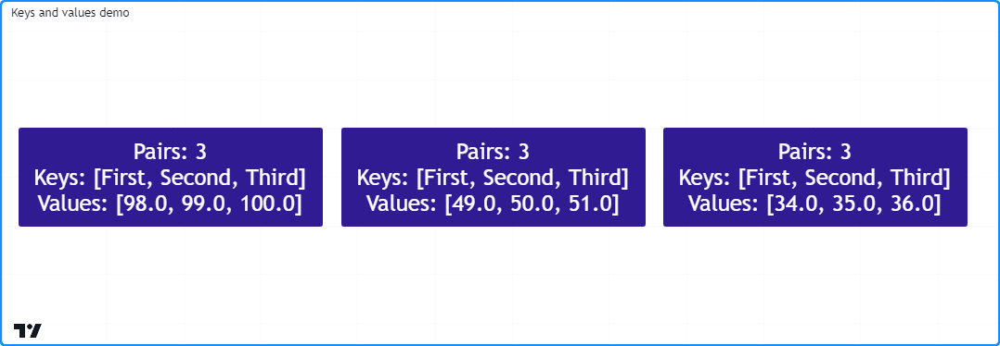

```c
//@version=5
indicator("Keys and values demo")

if bar_index % 50 == 0
    //@variable A map containing pairs of `string` keys and `float` values.
    m = map.new<string, float>()

    // Put pairs into `m`. The map will maintain this insertion order.
    m.put("First", math.round(math.random(0, 100)))
    m.put("Second", m.get("First") + 1)
    m.put("Third", m.get("Second") + 1)

    //@variable An array containing the keys of `m` in their insertion order.
    array<string> keys = m.keys()
    //@variable An array containing the values of `m` in their insertion order.
    array<float> values = m.values()

    //@variable A label displaying the `size` of `m` and the `keys` and `values` arrays.
    label debugLabel = label.new(
         bar_index, 0,
         str.format("Pairs: {0}\nKeys: {1}\nValues: {2}", m.size(), keys, values),
         color = color.navy, style = label.style_label_center,
         textcolor = color.white, size = size.huge
     )
```

__Note que:__

- O valor com a chave "First" é um número inteiro [aleatório](https://br.tradingview.com/pine-script-reference/v5/#fun_math.random) entre 0 e 100. O valor "Second" é um maior que o "First", e o valor "Third" é um maior que o "Second".

É importante notar que a ordem de inserção interna de um mapa __não__ muda ao substituir seus pares chave-valor. As posições dos novos elementos nos arrays [keys()](https://br.tradingview.com/pine-script-reference/v5/#fun_map.keys) e [values()](https://br.tradingview.com/pine-script-reference/v5/#fun_map.values) serão as mesmas dos elementos antigos nesses casos. A única exceção ocorre se o script [remover](./04_16_mapas.md#removendo-pares-chave-valor) completamente a chave anteriormente.

Abaixo, adicionou-se uma linha de código para [inserir](https://br.tradingview.com/pine-script-reference/v5/#fun_map.put) um novo valor com a chave "Second" no mapa `m`, substituindo o valor anterior associado a essa chave. Embora o script insira esse novo par no mapa _após_ o par com a chave "Third", a chave e o valor do par ainda estão em segundo lugar nos arrays de `keys` e `values` (_chaves_ e _valores_), pois a chave já estava presente em `m` _antes_ da mudança:

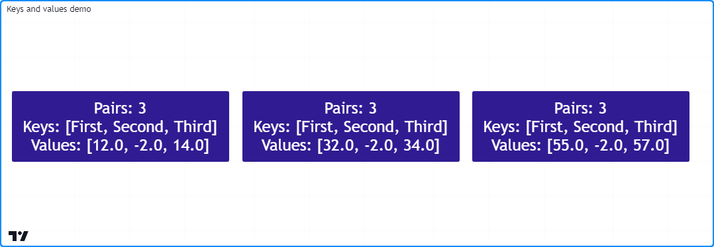

```c
//@version=5
indicator("Keys and values demo")

if bar_index % 50 == 0
    //@variable A map containing pairs of `string` keys and `float` values.
    m = map.new<string, float>()

    // Put pairs into `m`. The map will maintain this insertion order.
    m.put("First", math.round(math.random(0, 100)))
    m.put("Second", m.get("First") + 1)
    m.put("Third", m.get("Second") + 1)

    // Overwrite the "Second" pair in `m`. This will NOT affect the insertion order.
    // The key and value will still appear second in the `keys` and `values` arrays.
    m.put("Second", -2)

    //@variable An array containing the keys of `m` in their insertion order.
    array<string> keys = m.keys()
    //@variable An array containing the values of `m` in their insertion order.
    array<float> values = m.values()

    //@variable A label displaying the `size` of `m` and the `keys` and `values` arrays.
    label debugLabel = label.new(
         bar_index, 0,
         str.format("Pairs: {0}\nKeys: {1}\nValues: {2}", m.size(), keys, values),
         color = color.navy, style = label.style_label_center,
         textcolor = color.white, size = size.huge
     )
```

> __Observação!__\
> Os elementos em um array [map.values()](https://br.tradingview.com/pine-script-reference/v5/#fun_map.values) apontam para os mesmos valores que o `id` do mapa. Consequentemente, quando os valores do mapa são de _tipos de referência_, incluindo [line](https://br.tradingview.com/pine-script-reference/v5/#type_line), [linefill](https://br.tradingview.com/pine-script-reference/v5/#type_linefill), [box](https://br.tradingview.com/pine-script-reference/v5/#type_box), [polyline](https://br.tradingview.com/pine-script-reference/v5/#type_polyline), [label](https://br.tradingview.com/pine-script-reference/v5/#type_label), [table](https://br.tradingview.com/pine-script-reference/v5/#type_table), [chart.point](https://br.tradingview.com/pine-script-reference/v5/#type_chart.point) ou [tipos definidos pelo usuário (UDTs)](./04_09_tipagem_do_sistema.md#tipos-definidos-pelo-usuário), modificar as instâncias referenciadas pelo array [map.values()](https://br.tradingview.com/pine-script-reference/v5/#fun_map.values) também afetará aquelas referenciadas pelo `id` do mapa, já que os conteúdos de ambas as coleções apontam para objetos idênticos.

### `map.contains()`

Para verificar se uma `key` (_chave_) específica existe dentro de um `id` de mapa, use [map.contains()](https://br.tradingview.com/pine-script-reference/v5/#fun_map.contains). Esta função é uma alternativa conveniente para invocar [array.includes()](https://br.tradingview.com/pine-script-reference/v5/#fun_array.includes) no [array](https://br.tradingview.com/pine-script-reference/v5/#type_array) retornado por [map.keys()](https://br.tradingview.com/pine-script-reference/v5/#fun_map.keys).

Por exemplo, este script verifica se várias chaves existem dentro de um mapa `m`, e em seguida exibe os resultados em uma [_label_](https://br.tradingview.com/pine-script-reference/v5/#type_label):

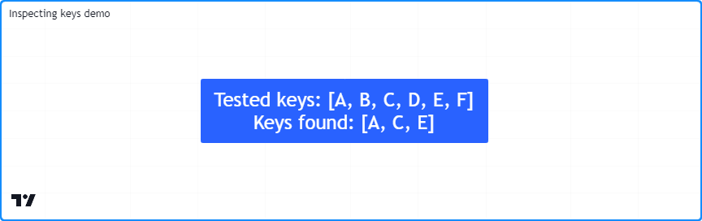

```c
//@version=5
indicator("Inspecting keys demo")

//@variable A map containing `string` keys and `string` values.
m = map.new<string, string>()

// Put key-value pairs into the map.
m.put("A", "B")
m.put("C", "D")
m.put("E", "F")

//@variable An array of keys to check for in `m`.
array<string> testKeys = array.from("A", "B", "C", "D", "E", "F")

//@variable An array containing all elements from `testKeys` found in the keys of `m`.
array<string> mappedKeys = array.new<string>()

for key in testKeys
    // Add the `key` to `mappedKeys` if `m` contains it.
    if m.contains(key)
        mappedKeys.push(key)

//@variable A string representing the `testKeys` array and the elements found within the keys of `m`.
string testText = str.format("Tested keys: {0}\nKeys found: {1}", testKeys, mappedKeys)

if bar_index == last_bar_index - 1
    //@variable Displays the `testText` in a label at the `bar_index` before the last.
    label debugLabel = label.new(
         bar_index, 0, testText, style = label.style_label_center,
         textcolor = color.white, size = size.huge
     )
```

## Removendo Pares Chave-Valor

Para remover um par chave-valor específico de um `id` de mapa, use-se [map.remove()](https://br.tradingview.com/pine-script-reference/v5/#fun_map.remove). Esta função elimina a `key` (_chave_) e seu valor associado do mapa, preservando a ordem de inserção dos outros pares chave-valor. Retorna o valor removido se o mapa [contiver](./04_16_mapas.md#mapcontains) a chave. Caso contrário, retorna [na](https://br.tradingview.com/pine-script-reference/v5/#var_na).

Para remover todos os pares chave-valor de um `id` de mapa de uma só vez, use [map.clear()](https://br.tradingview.com/pine-script-reference/v5/#fun_map.clear).

O script a seguir cria um novo mapa `m`, [insere](./04_16_mapas.md#inserindo-e-obtendo-pares-chave-valor) pares chave-valor no mapa, utiliza [m.remove()](https://br.tradingview.com/pine-script-reference/v5/#fun_map.remove) dentro de um loop para remover cada `key` (_chave_) válida listada no array `removeKeys`, e então chama [m.clear()](https://br.tradingview.com/pine-script-reference/v5/#fun_map.clear) para remover todos os pares chave-valor restantes. Utiliza um método personalizado `debugLabel()` para exibir o [_size_](https://br.tradingview.com/pine-script-reference/v5/#fun_map.size) (_tamanho_), as [_keys_](https://br.tradingview.com/pine-script-reference/v5/#fun_map.keys) (_chaves_) e os [_values_](https://br.tradingview.com/pine-script-reference/v5/#fun_map.values) (_valores_) de `m` após cada mudança:

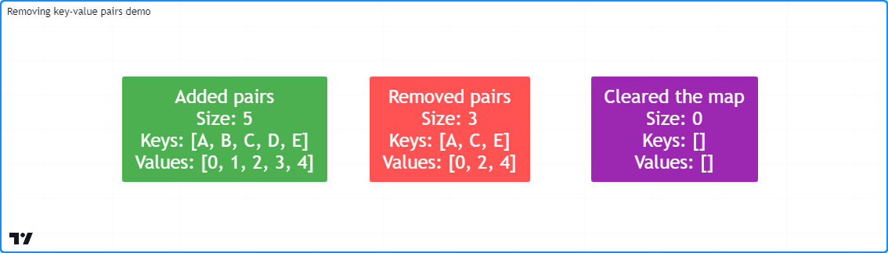

```c
//@version=5
indicator("Removing key-value pairs demo")

//@function Returns a label to display the keys and values from a map.
method debugLabel(
     map<string, int> this, int barIndex = bar_index,
     color bgColor = color.blue, string note = ""
 ) =>
    //@variable A string representing the size, keys, and values in `this` map.
    string repr = str.format(
         "{0}\nSize: {1}\nKeys: {2}\nValues: {3}",
         note, this.size(), str.tostring(this.keys()), str.tostring(this.values())
     )
    label.new(
         barIndex, 0, repr, color = bgColor, style = label.style_label_center,
         textcolor = color.white, size = size.huge
     )

if bar_index == last_bar_index - 1
    //@variable A map containing `string` keys and `int` values.
    m = map.new<string, int>()

    // Put key-value pairs into `m`.
    for [i, key] in array.from("A", "B", "C", "D", "E")
        m.put(key, i)
    m.debugLabel(bar_index, color.green, "Added pairs")

    //@variable An array of keys to remove from `m`.
    array<string> removeKeys = array.from("B", "B", "D", "F", "a")

    // Remove each `key` in `removeKeys` from `m`.
    for key in removeKeys
        m.remove(key)
    m.debugLabel(bar_index + 10, color.red, "Removed pairs")

    // Remove all remaining keys from `m`.
    m.clear()
    m.debugLabel(bar_index + 20, color.purple, "Cleared the map")
```

__Note que:__

- Nem todas as strings no array `removeKeys` estavam presentes nas chaves de `m`. Tentar remover chaves inexistentes ("F", "a" e o segundo "B" neste exemplo) não tem efeito sobre o conteúdo do mapa.

## Combinando Mapas

Scripts podem combinar dois mapas por meio de [map.put_all()](https://br.tradingview.com/pine-script-reference/v5/#fun_map.put_all). Esta função insere _todos_ os pares chave-valor do mapa `id2`, na ordem de inserção, no mapa `id1`. Assim como em [map.put()](https://br.tradingview.com/pine-script-reference/v5/#fun_map.put), se alguma chave em `id2` também estiver presente em `id1`, essa função __substitui__ os pares chave-valor que contêm essas chaves, sem afetar sua ordem de inserção inicial.

Este exemplo contém uma função definida pelo usuário, `hexMap()`, que mapeia chaves [int](https://br.tradingview.com/pine-script-reference/v5/#type_int) decimais para representações em [string](https://br.tradingview.com/pine-script-reference/v5/#type_string) de sua forma [hexadecimal](https://pt.wikipedia.org/wiki/Sistema_de_numera%C3%A7%C3%A3o_hexadecimal). O script utiliza essa função para criar dois mapas, `mapA` e `mapB`, e depois usa [mapA.put_all(mapB)](https://br.tradingview.com/pine-script-reference/v5/#fun_map.put_all) para inserir todos os pares chave-valor de `mapB` em `mapA`.

O script utiliza uma função personalizada, `debugLabel()`, para exibir _labels_ mostrando as [chaves](https://br.tradingview.com/pine-script-reference/v5/#fun_map.keys) e [valores](https://br.tradingview.com/pine-script-reference/v5/#fun_map.values) de `mapA` e `mapB`, e então outra _label_ exibindo o conteúdo de `mapA` após a inserção de todos os pares chave-valor de `mapB` nele:

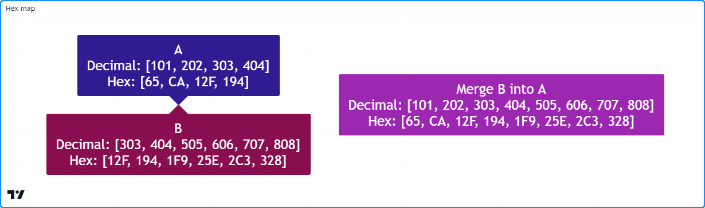

```c
//@version=5
indicator("Combining maps demo", "Hex map")

//@variable An array of string hex digits.
var array<string> hexDigits = str.split("0123456789ABCDEF", "")

//@function Returns a hexadecimal string for the specified `value`.
hex(int value) =>
    //@variable A string representing the hex form of the `value`.
    string result = ""
    //@variable A temporary value for digit calculation.
    int tempValue = value
    while tempValue > 0
        //@variable The next integer digit.
        int digit = tempValue % 16
        // Add the hex form of the `digit` to the `result`.
        result := hexDigits.get(digit) + result
        // Divide the `tempValue` by the base.
        tempValue := int(tempValue / 16)
    result

//@function Returns a map holding the `numbers` as keys and their `hex` strings as values.
hexMap(array<int> numbers) =>
    //@variable A map associating `int` keys with `string` values.
    result = map.new<int, string>()
    for number in numbers
        // Put a pair containing the `number` and its `hex()` representation into the `result`.
        result.put(number, hex(number))
    result

//@function Returns a label to display the keys and values of a hex map.
debugLabel(
     map<int, string> this, int barIndex = bar_index, color bgColor = color.blue,
     string style = label.style_label_center, string note = ""
 ) =>
    string repr = str.format(
         "{0}\nDecimal: {1}\nHex: {2}",
         note, str.tostring(this.keys()), str.tostring(this.values())
     )
    label.new(
         barIndex, 0, repr, color = bgColor, style = style,
         textcolor = color.white, size = size.huge
     )

if bar_index == last_bar_index - 1
    //@variable A map with decimal `int` keys and hexadecimal `string` values.
    map<int, string> mapA = hexMap(array.from(101, 202, 303, 404))
    debugLabel(mapA, bar_index, color.navy, label.style_label_down, "A")

    //@variable A map containing key-value pairs to add to `mapA`.
    map<int, string> mapB = hexMap(array.from(303, 404, 505, 606, 707, 808))
    debugLabel(mapB, bar_index, color.maroon, label.style_label_up, "B")

    // Put all pairs from `mapB` into `mapA`.
    mapA.put_all(mapB)
    debugLabel(mapA, bar_index + 10, color.purple, note = "Merge B into A")
```


# Percorrendo um Mapa

Existem várias maneiras pelas quais os scripts podem acessar iterativamente as chaves e valores em um mapa. Por exemplo, pode-se iterar através do array [keys()](https://br.tradingview.com/pine-script-reference/v5/#fun_map.keys) de um mapa e [get()](https://br.tradingview.com/pine-script-reference/v5/#fun_map.get) o valor para cada chave, assim:

```c
for key in thisMap.keys()
    value = thisMap.get(key)
```

No entanto, recomenda-se usar um _loop_ `for...in` diretamente em um mapa, pois ele itera sobre os pares chave-valor do mapa na ordem de inserção, retornando uma tupla contendo a chave e o valor do próximo par a cada iteração.

Por exemplo, esta linha de código percorre cada `key` (_chave_) e `value` (_valor_) em `thisMap`, começando pelo primeiro par chave-valor inserido nele:

```c
for [key, value] in thisMap
```

Utiliza-se essa estrutura para desenvolver um script que apresente os pares chave-valor de um mapa em uma [tabela](https://br.tradingview.com/pine-script-reference/v5/#type_table). No exemplo a seguir, foi definido um método personalizado `toTable()` que cria uma [tabela](https://br.tradingview.com/pine-script-reference/v5/#type_table), depois emprega um _loop_ `for...in` para percorrer os pares chave-valor do mapa e preencher as células da tabela. O script utiliza esse método para visualizar um mapa contendo as `length`-bar `averages` (_médias_ de barras de _comprimento_) dos dados de preço e volume:

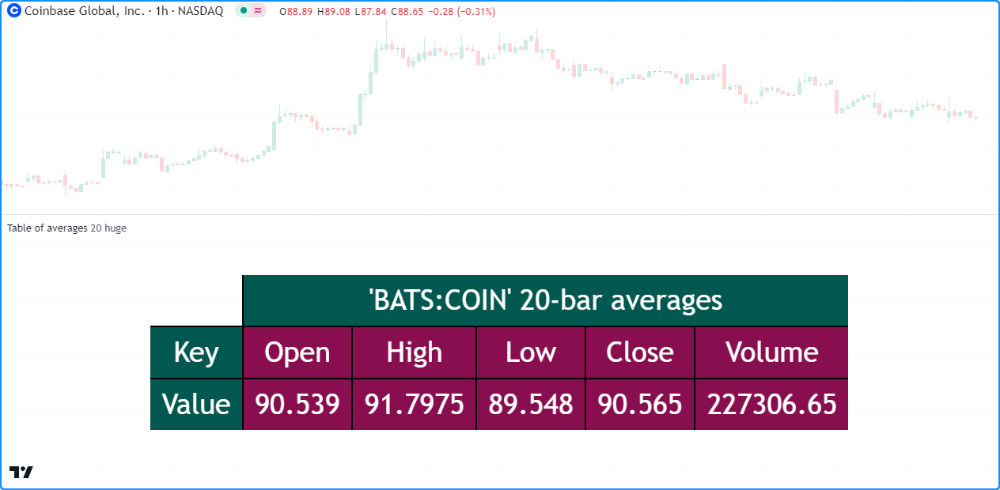

```c
//@version=5
indicator("Looping through a map demo", "Table of averages")

//@variable The length of the moving average.
int length = input.int(20, "Length")
//@variable The size of the table text.
string txtSize = input.string(
     size.huge, "Text size",
     options = [size.auto, size.tiny, size.small, size.normal, size.large, size.huge]
 )

//@function Displays the pairs of `this` map within a table.
//@param    this A map with `string` keys and `float` values.
//@param    position The position of the table on the chart.
//@param    header The string to display on the top row of the table.
//@param    textSize The size of the text in the table.
//@returns  A new `table` object with cells displaying each pair in `this`.
method toTable(
     map<string, float> this, string position = position.middle_center, string header = na,
     string textSize = size.huge
 ) =>
    // Color variables
    borderColor = #000000
    headerColor = color.rgb(1, 88, 80)
    pairColor   = color.maroon
    textColor   = color.white

    //@variable A table that displays the key-value pairs of `this` map.
    table result = table.new(
         position, this.size() + 1, 3, border_width = 2, border_color = borderColor
     )
    // Initialize top and side header cells.
    result.cell(1, 0, header, bgcolor = headerColor, text_color = textColor, text_size = textSize)
    result.merge_cells(1, 0, this.size(), 0)
    result.cell(0, 1, "Key", bgcolor = headerColor, text_color = textColor, text_size = textSize)
    result.cell(0, 2, "Value", bgcolor = headerColor, text_color = textColor, text_size = textSize)

    //@variable The column index of the table. Updates on each loop iteration.
    int col = 1

    // Loop over each `key` and `value` from `this` map in the insertion order.
    for [key, value] in this
        // Initialize a `key` cell in the `result` table on row 1.
        result.cell(
             col, 1, str.tostring(key), bgcolor = color.maroon,
             text_color = color.white, text_size = textSize
         )
        // Initialize a `value` cell in the `result` table on row 2.
        result.cell(
             col, 2, str.tostring(value), bgcolor = color.maroon,
             text_color = color.white, text_size = textSize
         )
        // Move to the next column index.
        col += 1
    result // Return the `result` table.

//@variable A map with `string` keys and `float` values to hold `length`-bar averages.
averages = map.new<string, float>()

// Put key-value pairs into the `averages` map.
averages.put("Open", ta.sma(open, length))
averages.put("High", ta.sma(high, length))
averages.put("Low", ta.sma(low, length))
averages.put("Close", ta.sma(close, length))
averages.put("Volume", ta.sma(volume, length))

//@variable The text to display at the top of the table.
string headerText = str.format("{0} {1}-bar averages", "'" + syminfo.tickerid + "'", length)
// Display the `averages` map in a `table` with the `headerText`.
averages.toTable(header = headerText, textSize = txtSize)
```


# Copiando um Mapa

## Cópias Superficiais (_Shallow Copies_)

Scripts podem criar uma _cópia superficial_ de um `id` de mapa usando a função [map.copy()](https://br.tradingview.com/pine-script-reference/v5/#fun_map.copy). Modificações em uma cópia superficial não afetam o mapa `id` original ou sua ordem de inserção interna.

Por exemplo, este script constrói um mapa `m` com as chaves "A", "B", "C" e "D" atribuídas a quatro valores [aleatórios](https://br.tradingview.com/pine-script-reference/v5/#fun_math.random) entre 0 e 10. Em seguida, cria um mapa `mCopy` como uma cópia superficial de `m` e atualiza os valores associados às suas chaves. O script exibe os pares chave-valor em `m` e `mCopy` no gráfico utilizando um método personalizado `debugLabel()`:

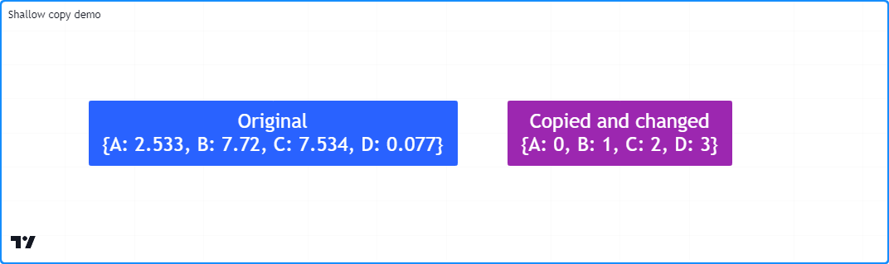

```c
//@version=5
indicator("Shallow copy demo")

//@function Displays the key-value pairs of `this` map in a label.
method debugLabel(
     map<string, float> this, int barIndex = bar_index, color bgColor = color.blue,
     color textColor = color.white, string note = ""
 ) =>
    //@variable The text to display in the label.
    labelText = note + "\n{"
    for [key, value] in this
        labelText += str.format("{0}: {1}, ", key, value)
    labelText := str.replace(labelText, ", ", "}", this.size() - 1)

    if barstate.ishistory
        label result = label.new(
             barIndex, 0, labelText, color = bgColor, style = label.style_label_center,
             textcolor = textColor, size = size.huge
         )

if bar_index == last_bar_index - 1
    //@variable A map of `string` keys and random `float` values.
    m = map.new<string, float>()

    // Assign random values to an array of keys in `m`.
    for key in array.from("A", "B", "C", "D")
        m.put(key, math.random(0, 10))

    //@variable A shallow copy of `m`.
    mCopy = m.copy()

    // Assign the insertion order value `i` to each `key` in `mCopy`.
    for [i, key] in mCopy.keys()
        mCopy.put(key, i)

    // Display the labels.
    m.debugLabel(bar_index, note = "Original")
    mCopy.debugLabel(bar_index + 10, color.purple, note = "Copied and changed")
```

## Cópias Profundas (_Deep Copies_)

Embora uma [cópia superficial](./04_16_mapas.md#cópias-superficiais-shallow-copies) seja suficiente ao copiar mapas que possuem valores de um _tipo fundamental_, é importante lembrar que _cópias superficiais_ de um mapa que contém valores de um _tipo de referência_ ([line](https://br.tradingview.com/pine-script-reference/v5/#type_line), [linefill](https://br.tradingview.com/pine-script-reference/v5/#type_linefill), [box](https://br.tradingview.com/pine-script-reference/v5/#type_box), [polyline](https://br.tradingview.com/pine-script-reference/v5/#type_polyline), [label](https://br.tradingview.com/pine-script-reference/v5/#type_label), [table](https://br.tradingview.com/pine-script-reference/v5/#type_table), [chart.point](https://br.tradingview.com/pine-script-reference/v5/#type_chart.point) ou [tipos definidos pelo usuário (UDTs)](./04_09_tipagem_do_sistema.md#tipos-definidos-pelo-usuário)) apontam para os mesmos objetos que o original. Modificar os objetos referenciados por uma cópia superficial afetará as instâncias referenciadas pelo mapa original e vice-versa.

Para garantir que alterações em objetos referenciados por um mapa copiado não afetem instâncias referenciadas em outros locais, pode-se fazer uma _cópia profunda_ criando um novo mapa com pares de chave-valor contendo cópias de cada valor no mapa original.

Este exemplo cria um mapa `original` com chaves de [string](https://br.tradingview.com/pine-script-reference/v5/#type_string) e valores de [_label_](https://br.tradingview.com/pine-script-reference/v5/#type_label) e [insere](https://br.tradingview.com/pine-script-reference/v5/#fun_map.put) um par de chave-valor nele. O script copia o mapa para uma variável `shallow` através do método incorporado [copy()](https://br.tradingview.com/pine-script-reference/v5/#fun_map.copy), e então para uma variável `deep` usando um método personalizado `deepCopy()`.

Conforme observado no gráfico, mudanças na _label_ obtida da _cópia superficial_ `shallow` também impactam a instância referenciada pelo mapa `original`, porém as alterações naquela vindo da _cópia profunda_ `deep` não afetam:

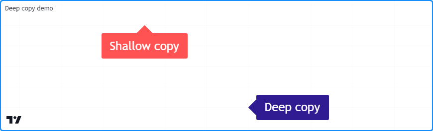

```c
//@version=5
indicator("Deep copy demo")

//@function Returns a deep copy of `this` map.
method deepCopy(map<string, label> this) =>
    //@variable A deep copy of `this` map.
    result = map.new<string, label>()
    // Add key-value pairs with copies of each `value` to the `result`.
    for [key, value] in this
        result.put(key, value.copy())
    result //Return the `result`.

//@variable A map containing `string` keys and `label` values.
var original = map.new<string, label>()

if bar_index == last_bar_index - 1
    // Put a new key-value pair into the `original` map.
    map.put(
         original, "Test",
         label.new(bar_index, 0, "Original", textcolor = color.white, size = size.huge)
     )

    //@variable A shallow copy of the `original` map.
    map<string, label> shallow = original.copy()
    //@variable A deep copy of the `original` map.
    map<string, label> deep = original.deepCopy()

    //@variable The "Test" label from the `shallow` copy.
    label shallowLabel = shallow.get("Test")
    //@variable The "Test" label from the `deep` copy.
    label deepLabel = deep.get("Test")

    // Modify the "Test" label's `y` attribute in the `original` map.
    // This also affects the `shallowLabel`.
    original.get("Test").set_y(label.all.size())

    // Modify the `shallowLabel`. Also modifies the "Test" label in the `original` map.
    shallowLabel.set_text("Shallow copy")
    shallowLabel.set_color(color.red)
    shallowLabel.set_style(label.style_label_up)

    // Modify the `deepLabel`. Does not modify any other label instance.
    deepLabel.set_text("Deep copy")
    deepLabel.set_color(color.navy)
    deepLabel.set_style(label.style_label_left)
    deepLabel.set_x(bar_index + 5)
```

__Note que:__

- O método `deepCopy()` percorre o mapa `original`, copiando cada `value` (_valor_) e [inserindo](./04_16_mapas.md#inserindo-e-obtendo-pares-chave-valor) pares de chave-valor contendo as cópias em uma [nova](https://br.tradingview.com/pine-script-reference/v5/#fun_map.new%3Ctype,type%3E) instância de mapa.


# Escopo e Histórico

Assim como outras coleções em Pine, as variáveis de mapa deixam vestígios históricos em cada barra, permitindo que um script acesse instâncias passadas de mapas atribuídas a uma variável usando o operador de referência histórica [[]](https://br.tradingview.com/pine-script-reference/v5/#op_[]). Scripts também podem atribuir mapas a variáveis globais e interagir com eles a partir dos escopos de [funções](./04_11_funcoes_definidas_pelo_usuario.md), [métodos](./04_13_metodos.md) e [estruturas condicionais](./04_07_estruturas_condicionais.md).

Como exemplo, este script usa um mapa global e seu histórico para calcular um conjunto agregado de [EMAs](https://br.tradingview.com/support/solutions/43000592270/). Declara um mapa `globalData` de chaves [int](https://br.tradingview.com/pine-script-reference/v5/#type_int) e valores [float](https://br.tradingview.com/pine-script-reference/v5/#type_float), onde cada chave no mapa corresponde ao _length_ (_comprimento_) de cada cálculo da EMA. A função definida pelo usuário `update()` calcula cada EMA de _`key`-length_ (_comprimento-chave_) mesclando os valores do mapa `previous` (_anterior_) atribuído a `globalData` com o valor da `source` (_fonte_) atual.

O script plota os valores [máximos](https://br.tradingview.com/pine-script-reference/v5/#fun_array.max) e [mínimos](https://br.tradingview.com/pine-script-reference/v5/#fun_array.min) no array [values()](https://br.tradingview.com/pine-script-reference/v5/#fun_map.values) do mapa global e o valor de `globalData.get(50)` (isto é, o EMA de 50 barras):

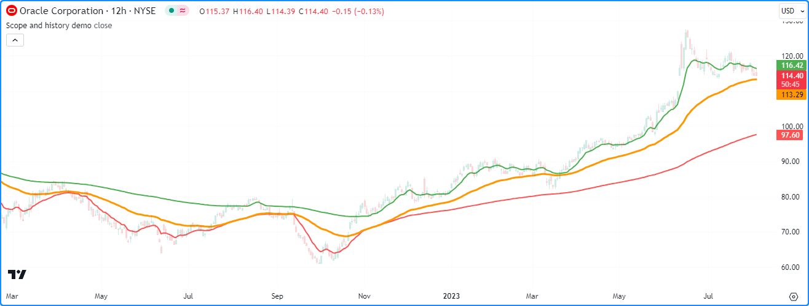

```c
//@version=5
indicator("Scope and history demo", overlay = true)

//@variable The source value for EMA calculation.
float source = input.source(close, "Source")

//@variable A map containing global key-value pairs.
globalData = map.new<int, float>()

//@function Calculates a set of EMAs and updates the key-value pairs in `globalData`.
update() =>
    //@variable The previous map instance assigned to `globalData`.
    map<int, float> previous = globalData[1]

    // Put key-value pairs with keys 10-200 into `globalData` if `previous` is `na`.
    if na(previous)
        for i = 10 to 200
            globalData.put(i, source)
    else
        // Iterate each `key` and `value` in the `previous` map.
        for [key, value] in previous
            //@variable The smoothing parameter for the `key`-length EMA.
            float alpha = 2.0 / (key + 1.0)
            //@variable The `key`-length EMA value.
            float ema = (1.0 - alpha) * value + alpha * source
            // Put the `key`-length `ema` into the `globalData` map.
            globalData.put(key, ema)

// Update the `globalData` map.
update()

//@variable The array of values from `globalData` in their insertion order.
array<float> values = globalData.values()

// Plot the max EMA, min EMA, and 50-bar EMA values.
plot(values.max(), "Max EMA", color.green, 2)
plot(values.min(), "Min EMA", color.red, 2)
plot(globalData.get(50), "50-bar EMA", color.orange, 3)
```


# Mapas de Outras Coleções

Mapas não podem utilizar diretamente outros mapas, [arrays](./04_14_arrays.md) ou [_matrices_](./04_15_matrices.md) como valores, mas podem conter valores de um [tipo definido pelo usuário](./04_09_tipagem_do_sistema.md#tipos-definidos-pelo-usuário) que inclua coleções em seus campos.

Por exemplo, para criar um mapa "2D" que utiliza chaves [string](https://br.tradingview.com/pine-script-reference/v5/#type_string) para acessar _mapas aninhados_ que contêm pares de chaves [string](https://br.tradingview.com/pine-script-reference/v5/#type_string) e valores [float](https://br.tradingview.com/pine-script-reference/v5/#type_float). Como mapas não podem usar outras coleções como valores, é necessário primeiro criar um _tipo encapsulado_ com um campo para conter uma instância de `map<string, float>`, assim:

```c
//@type A wrapper type for maps with `string` keys and `float` values.
type Wrapper
    map<string, float> data
```

Com o tipo `Wrapper` definido, é possível criar mapas com chaves [string](https://br.tradingview.com/pine-script-reference/v5/#type_string) e valores `Wrapper`, onde o campo `data` de cada valor no mapa aponta para uma instância do `map<string, float>`:

```c
mapOfMaps = map.new<string, Wrapper>()
```

O script abaixo utiliza este conceito para construir um mapa que contém mapas com dados OHLCV solicitados de múltiplos tickers. A função definida pelo usuário, `requestData()`, solicita dados de preço e volume de um ticker, cria um mapa `<string, float>`, [insere](https://br.tradingview.com/pine-script-reference/v5/#fun_map.put) os dados nele e então retorna uma instância `Wrapper` contendo o novo mapa.

O script [insere](https://br.tradingview.com/pine-script-reference/v5/#fun_map.put) os resultados de cada chamada à função `requestData()` no `mapOfMaps`, em seguida cria uma representação em [string](https://br.tradingview.com/pine-script-reference/v5/#type_string) dos mapas aninhados com um método definido pelo usuário `toString()`, que é exibido no gráfico em um [_label_](https://br.tradingview.com/pine-script-reference/v5/#type_label):

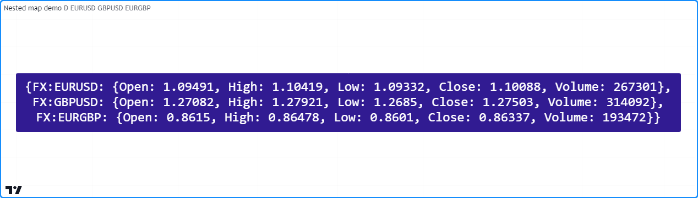

```c
//@version=5
indicator("Nested map demo")

//@variable The timeframe of the requested data.
string tf = input.timeframe("D", "Timeframe")
// Symbol inputs.
string symbol1 = input.symbol("EURUSD", "Symbol 1")
string symbol2 = input.symbol("GBPUSD", "Symbol 2")
string symbol3 = input.symbol("EURGBP", "Symbol 3")

//@type A wrapper type for maps with `string` keys and `float` values.
type Wrapper
    map<string, float> data

//@function Returns a wrapped map containing OHLCV data from the `tickerID` at the `timeframe`.
requestData(string tickerID, string timeframe) =>
    // Request a tuple of OHLCV values from the specified ticker and timeframe.
    [o, h, l, c, v] = request.security(
         tickerID, timeframe,
         [open, high, low, close, volume]
     )
    //@variable A map containing requested OHLCV data.
    result = map.new<string, float>()
    // Put key-value pairs into the `result`.
    result.put("Open", o)
    result.put("High", h)
    result.put("Low", l)
    result.put("Close", c)
    result.put("Volume", v)
    //Return the wrapped `result`.
    Wrapper.new(result)

//@function Returns a string representing `this` map of `string` keys and `Wrapper` values.
method toString(map<string, Wrapper> this) =>
    //@variable A string representation of `this` map.
    string result = "{"

    // Iterate over each `key1` and associated `wrapper` in `this`.
    for [key1, wrapper] in this
        // Add `key1` to the `result`.
        result += key1

        //@variable A string representation of the `wrapper.data` map.
        string innerStr = ": {"
        // Iterate over each `key2` and associated `value` in the wrapped map.
        for [key2, value] in wrapper.data
            // Add the key-value pair's representation to `innerStr`.
            innerStr += str.format("{0}: {1}, ", key2, str.tostring(value))

        // Replace the end of `innerStr` with "}" and add to `result`.
        result += str.replace(innerStr, ", ", "},\n", wrapper.data.size() - 1)

    // Replace the blank line at the end of `result` with "}".
    result := str.replace(result, ",\n", "}", this.size() - 1)
    result

//@variable A map of wrapped maps containing OHLCV data from multiple tickers.
var mapOfMaps = map.new<string, Wrapper>()

//@variable A label showing the contents of the `mapOfMaps`.
var debugLabel = label.new(
     bar_index, 0, color = color.navy, textcolor = color.white, size = size.huge,
     style = label.style_label_center, text_font_family = font.family_monospace
 )

// Put wrapped maps into `mapOfMaps`.
mapOfMaps.put(symbol1, requestData(symbol1, tf))
mapOfMaps.put(symbol2, requestData(symbol2, tf))
mapOfMaps.put(symbol3, requestData(symbol3, tf))

// Update the label.
debugLabel.set_text(mapOfMaps.toString())
debugLabel.set_x(bar_index)
```
