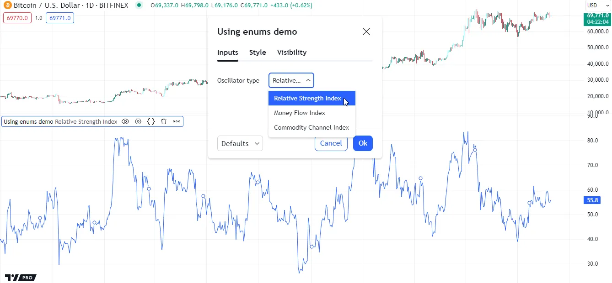
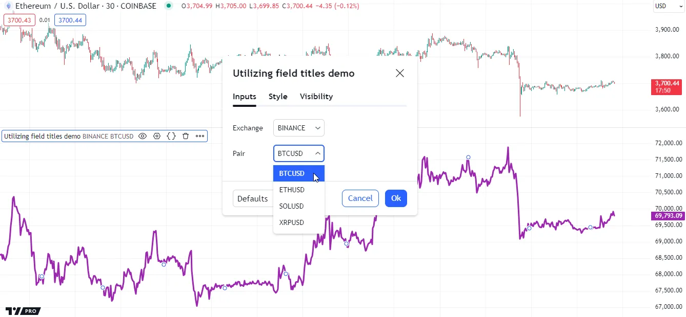
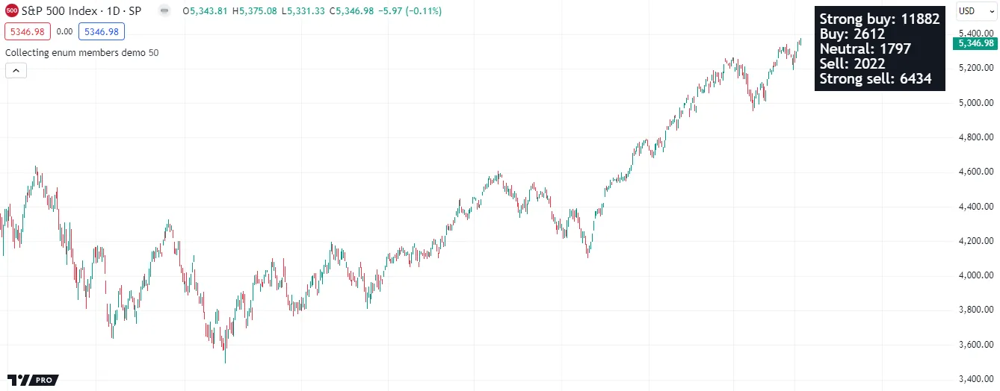

# Enums

> __Observação!__\
> Esta página contém material avançado. Se estiver começando a programar em Pine Script, recomenda-se familiarizar-se com outros recursos mais acessíveis do Pine Script antes de aventurar-se aqui.

Enums do Pine Script, também conhecidos como _enumerações_, _tipos enumerados_, ou [tipos enum](./04_09_tipagem_do_sistema.md#tipos-enum), são tipos de dados exclusivos com todos os valores possíveis (_membros_) explicitamente definidos pelo programador. Eles fornecem uma maneira legível e expressiva de declarar conjuntos distintos de _valores predefinidos_ que variáveis, expressões condicionais e [coleções](./04_09_tipagem_do_sistema.md#coleções) podem aceitar, permitindo um controle mais rigoroso sobre os valores usados na lógica de um script.

## Declarando um Enum

Para declarar um enum, use a palavra-chave [enum](https://br.tradingview.com/pine-script-reference/v5/#kw_enum) com a seguinte sintaxe:

```c
[export ]enum <enumName>
    <field_1>[ = <title_1>]
    <field_2>[ = <title_2>]
    ...
    <field_N>[ = <title_N>]
```

Cada __campo__ no enum representa um membro _nomeado único_ (valor) do [tipo enum](./04_09_tipagem_do_sistema.md#tipos-enum). É possível especificar __títulos__ "const string" opcionais para os campos do enum para adicionar informações extras sobre o que seus valores representam. Se o programador não especificar o título de um campo, seu título será a representação "string" de seu nome. [Entradas enum](./05_09_inputs.md#input-enum) exibem títulos de campos enum dentro de seus menus suspensos (_dropdown_) na aba "Configurações/Entradas" "_Settings/Inputs_" de um script. Scripts também podem recuperar títulos de campos enum usando a função [str.tostring()](https://br.tradingview.com/pine-script-reference/v5/#fun_str.tostring), permitindo seu uso em cálculos adicionais. Veja [esta seção](./04_17_enums.md#utilizando-títulos-de-campos) abaixo para mais informações.

Embora a sintaxe acima possa parecer similar à sintaxe para declarar [tipos definidos pelo usuário (UDTs)](./04_09_tipagem_do_sistema.md#tipos-definidos-pelo-usuário), é crucial entender que [tipos enum](./04_09_tipagem_do_sistema.md#tipos-enum) e [UDTs](./04_09_tipagem_do_sistema.md#tipos-definidos-pelo-usuário) têm propósitos diferentes. Scripts usam [UDTs](./04_09_tipagem_do_sistema.md#tipos-definidos-pelo-usuário) para criar [objetos](./04_12_objetos.md) com campos "series" que podem conter valores de _qualquer_ tipo especificado. Em contraste, enums são grupos distintos de campos "simple" representando os _valores predefinidos_ específicos do mesmo tipo _único_ que variáveis, expressões e [coleções](./04_09_tipagem_do_sistema.md#coleções) podem aceitar.

Por exemplo, este bloco de código declara um enum `Signal` com três campos: `buy`, `sell` e `neutral`. Cada campo representa um membro distinto (valor possível) do tipo enum `Signal` [enum type](./04_09_tipagem_do_sistema.md#tipos-enum):

```c
//@enum           An enumeration of named values representing buy, sell, and neutral signal states.
//@field buy      Represents a "Buy signal" state.
//@field sell     Represents a "Sell signal" state.
//@field neutral  Represents a "neutral" state. 
enum Signal
    buy     = "Buy signal"
    sell    = "Sell signal"
    neutral
```

__Note que:__

- O identificador `Signal` representa o nome do enum, que significa o tipo _único_ ao qual os campos pertencem.
- Foram usadas as anotações `//@enum` e `//@field` [annotations](./04_03_estrutura_do_script.md#anotações-do-compilador) para documentar o significado do enum e seus campos.
- Diferente dos campos `buy` e `sell`, o campo `neutral` não inclui um título especificado. Portanto, seu título é a representação "string" de seu _nome_ ("neutral").

Para recuperar um membro de um enum, referencie seu nome de campo usando a sintaxe de _notação de ponto_, ou seja:

```c
enumName.fieldName
```

Assim como outros tipos, scripts podem atribuir membros enum a variáveis, parâmetros de função e campos de [UDT](./04_09_tipagem_do_sistema.md#tipos-definidos-pelo-usuário), permitindo controle rigoroso sobre seus valores permitidos.

Por exemplo, esta linha de código declara uma variável `mySignal` cujo valor é o membro `neutral` do enum `Signal`. Qualquer valor atribuído a esta variável posteriormente deve ser do mesmo [tipo enum](./04_09_tipagem_do_sistema.md#tipos-enum):

```c
mySignal = Signal.neutral
```

Note que a linha acima não requer a declaração do _tipo_ da variável como `Signal` porque o compilador pode inferir automaticamente essa informação a partir do valor atribuído. Se for usado [na](https://br.tradingview.com/pine-script-reference/v5/#var_na) como o valor inicial, deve-se usar `Signal` como a palavra-chave do tipo para especificar que `mySignal` aceitará um membro `Signal`:

```c
Signal mySignal = na
```

## Usando Enums

Scripts podem comparar membros enum com os operadores [==](https://br.tradingview.com/pine-script-reference/v5/#op_==) e [!=](https://br.tradingview.com/pine-script-reference/v5/#op_!=) e usá-los em [estruturas condicionais](./04_07_estruturas_condicionais.md), permitindo a criação conveniente de padrões lógicos com um risco reduzido de valores ou operações não intencionais.

O exemplo a seguir declara um enum `OscType` com três campos representando diferentes escolhas de osciladores: `rsi`, `mfi` e `cci`. A função `calcOscillator()` usa membros `OscType` dentro de uma estrutura [switch](https://br.tradingview.com/pine-script-reference/v5/#kw_switch) para determinar qual oscilador será calculado. O script chama essa função usando o valor de uma [entrada enum](./05_09_inputs.md#input-enum) como o argumento `selection` e plota o oscilador resultante:



```c
//@version=5
indicator("Using enums demo")

//@enum An enumeration of oscillator choices.
enum OscType
    rsi = "Relative Strength Index"
    mfi = "Money Flow Index"
    cci = "Commodity Channel Index"

//@variable An enumerator (member) of the `OscType` enum.
OscType oscInput = input.enum(OscType.rsi, "Oscillator type")

//@function         Calculates one of three oscillators based on a specified `selection`.
//@param source     The series of values to process.
//@param length     The number of bars in the calculation.
//@param selection  Determines which oscillator to calculate.
calcOscillator(float source, simple int length, OscType selection) =>
    result = switch selection
        OscType.rsi => ta.rsi(source, length)
        OscType.mfi => ta.mfi(source, length)
        OscType.cci => ta.cci(source, length)

// Plot the value of a `calcOscillator()` call with `oscInput` as the `selection`.
plot(calcOscillator(close, 20, oscInput)) 
```

__Note que:__

- O parâmetro `selection` da função `calcOscillator()` só pode assumir um dos _quatro_ valores: `OscType.rsi`, `OscType.mfi`, `OscType.cci` ou [na](https://br.tradingview.com/pine-script-reference/v5/#var_na).
- A entrada "Oscillator type" na aba "Settings/Inputs" do script exibe todos os títulos dos campos `OscType` em seu menu suspenso. Veja [esta seção](./05_09_inputs.md#input-enum) para saber mais sobre entradas enum.

É crucial notar que cada enum declarado representa um tipo _único_. Scripts __não podem__ comparar membros de diferentes enums ou usar esses membros em expressões que requerem um [tipo enum](./04_09_tipagem_do_sistema.md#tipos-enum) específico, mesmo que os campos tenham nomes e títulos idênticos.

Neste exemplo, foi adicionado um enum `OscType2` ao script acima e a variável `oscInput` foi alterada para usar um membro desse enum. O script agora gera um _erro de compilação_ porque não pode usar um membro do enum `OscType2` como o argumento `selection` na chamada `calcOscillator()`:

```c
//@version=5
indicator("Incompatible enums demo")

//@enum An enumeration of oscillator choices.
enum OscType
    rsi = "Relative Strength Index"
    mfi = "Money Flow Index"
    cci = "Commodity Channel Index"

//@enum An enumeration of oscillator choices. Its fields DO NOT represent the same values those in the `OscType` enum.
enum OscType2
    rsi = "Relative Strength Index"
    mfi = "Money Flow Index"
    cci = "Commodity Channel Index"

//@variable An enumerator (member) of the `OscType2` enum.
OscType2 oscInput = input.enum(OscType2.rsi, "Oscillator type")

//@function         Calculates one of three oscillators based on a specified `selection`.
//@param source     The series of values to process.
//@param length     The number of bars in the calculation.
//@param selection  Determines which oscillator to calculate.
calcOscillator(float source, simple int length, OscType selection) =>
    result = switch selection
        OscType.rsi => ta.rsi(source, length)
        OscType.mfi => ta.mfi(source, length)
        OscType.cci => ta.cci(source, length)

// Plot the value of a `calcOscillator()` call with `oscInput` as the `selection`.
// Raises a compilation error because only members of `OscType` are allowed. 
plot(calcOscillator(close, 20, oscInput))
```

### Utilizando Títulos de Campos

Os títulos "string" dos campos de um enum permitem que programadores adicionem informações extras a cada membro. Esses títulos de campos aparecem em um menu suspenso na aba "Settings/Inputs" do script ao chamar a função [input.enum()](https://br.tradingview.com/pine-script-reference/v5/#fun_input.enum).

Scripts também podem utilizar títulos de campos enum em seus cálculos e lógica. Use a função de conversão de string ([str.tostring()](https://br.tradingview.com/pine-script-reference/v5/#fun_str.tostring)) em um campo enum para acessar seu título.

O exemplo a seguir combina diferentes títulos de campos enum para construir um ID de ticker para solicitar dados de [outro contexto](./05_14_outros_timeframes_e_dados.md). O script declara dois enums, `Exchange` e `Pair`, cujos respectivos campos representam nomes de _exchange_ e _pares de moedas_. Ele usa [input.enum()](https://br.tradingview.com/pine-script-reference/v5/#fun_input.enum) para atribuir membros enum especificados pelo usuário às variáveis `exchangeInput` e `pairInput`, depois recupera os títulos "string" dessas variáveis com [str.tostring()](https://br.tradingview.com/pine-script-reference/v5/#fun_str.tostring) e os concatena para formar um par "Exchange:Symbol" para uso em uma chamada [request.security()](https://br.tradingview.com/pine-script-reference/v5/#fun_request.security):



```c
//@version=5
indicator("Utilizing field titles demo")

//@enum An enumeration of cryptocurrency exchanges. All field titles are the same as the field names.
enum Exchange
    BINANCE
    BITSTAMP
    BITFINEX
    COINBASE
    KRAKEN

//@enum An enumeration of cryptocurrency pairs. All the field titles are the same as the field names. 
enum Pair
    BTCUSD
    ETHUSD
    SOLUSD
    XRPUSD

//@variable An enumerator (member) of the `Exchange` enum.
Exchange exchangeInput = input.enum(Exchange.BINANCE, "Exchange")
//@variable An enumerator (member) of the `Pair` enum.
Pair pairInput = input.enum(Pair.BTCUSD, "Pair")

//@variable The exchange-symbol pair for the data request. 
simple string symbol = str.tostring(exchangeInput) + ":" + str.tostring(pairInput)

// Plot the `close` value requested from the `symbol` context.
plot(request.security(symbol, timeframe.period, close), "Requested close", color.purple, 3)
```

__Note que:__

- Nenhum dos membros dos enums `Exchange` ou `Pair` tem títulos especificados. Portanto, o título de cada campo é a representação "string" de seu nome, como mostrado pelas [entradas enum](./05_09_inputs.md#input-enum) do script.
- Chamar a função [str.tostring()](https://br.tradingview.com/pine-script-reference/v5/#fun_str.tostring) em um campo enum é a __única__ maneira de recuperar seu título para cálculos adicionais. As funções [str.format()](https://br.tradingview.com/pine-script-reference/v5/#fun_str.format) e `log.*()` _não podem_ aceitar membros enum. Para usar o título de um campo em uma função de formatação de string, chame [str.tostring()](https://br.tradingview.com/pine-script-reference/v5/#fun_str.tostring) no campo primeiro, depois passe a "string" resultante para a função.

## Coletando Membros Enum

[Collections](./04_09_tipagem_do_sistema.md#coleções) ([arrays](./04_14_arrays.md), [_matrices_](./04_15_matrices.md), e [maps](./04_16_mapas.md)) do Pine Script™ podem armazenar membros enum, permitindo um controle rigoroso sobre os valores que podem conter. Para declarar uma coleção de membros enum, inclua o _nome_ do enum no [template de tipo](./04_09_tipagem_do_sistema.md#templates-de-tipo) da coleção.

Por exemplo, este bloco de código cria um [array](https://br.tradingview.com/pine-script-reference/v5/#type_array) vazio para armazenar membros do enum `FooBar`. Os únicos valores que este array pode permitir como elementos são `FooBar.foo`, `FooBar.bar`, `FooBar.baz` e [na](https://br.tradingview.com/pine-script-reference/v5/#var_na):

```c
//@variable An enumeration of miscellaneous named members.
enum FooBar
    foo
    bar
    baz

//@variable An array that can only contain the following values: `FooBar.foo`, `FooBar.bar`, `FooBar.baz`, `na`.
array<FooBar> fooBarArray = array.new<FooBar>()
```

Enums são particularmente úteis ao trabalhar com [maps](./04_16_mapas.md), pois, ao contrário de outros [tipos](./04_09_tipagem_do_sistema.md#tipos) não fundamentais, scripts podem declarar [maps](./04_16_mapas.md) com _chaves_ de um [tipo enum](./04_09_tipagem_do_sistema.md#tipos-enum), permitindo controle rigoroso sobre todas as chaves possíveis permitidas em seus pares chave-valor.

O exemplo a seguir usa um [map](https://br.tradingview.com/pine-script-reference/v5/#type_map) com chaves enum e valores "int" para rastrear e contar estados de sinal em barras de gráfico. O enum `Signal` do script contém cinco campos representando estados nomeados específicos. O [map](https://br.tradingview.com/pine-script-reference/v5/#type_map) `signalCounters` usa o nome `Signal` como a _primeira palavra-chave_ em seu [template de tipo](./04_09_tipagem_do_sistema.md#templates-de-tipo) para especificar que ele só pode aceitar membros `Signal` como chaves.

O script usa uma estrutura [switch](https://br.tradingview.com/pine-script-reference/v5/#kw_switch) para calcular uma variável `signalState` cujo valor é um membro do enum `Signal`, que ele usa para determinar o valor do contador a ser atualizado no map `signalCounters`. Ele constrói uma "string" para representar os pares chave-valor do [map](https://br.tradingview.com/pine-script-reference/v5/#type_map) e exibe o resultado em uma célula única de uma [table](https://br.tradingview.com/pine-script-reference/v5/#type_table) na última barra do gráfico:



```c
//@version=5
indicator("Collecting enum members demo", overlay = true)

//@enum An enumeration of named signal states. 
enum Signal
    strongBuy  = "Strong buy"
    buy        = "Buy"
    neutral    = "Neutral"
    sell       = "Sell"
    strongSell = "Strong sell"

//@variable The number of bars in the signal calculation.
int lengthInput = input.int(50, "Length", 2)

//@variable A map of `Signal.*` keys and "int" values counting the number of bars with each signal state. 
//          Allowed keys: `Signal.strongBuy`, `Signal.buy`, `Signal.neutral`, `Signal.sell`, `Signal.strongSell`, `na`.
var map<Signal, float> signalCounters = map.new<Signal, float>()

//@variable A single-cell table displaying the key-value pairs of the `signalCounters` map.
var table infoTable = table.new(position.top_right, 1, 1, chart.fg_color)

if barstate.isfirst
    // Put `Signal.*`-"int" pairs into the `signalCounters` map to establish insertion order.
    signalCounters.put(Signal.strongBuy, 0)
    signalCounters.put(Signal.buy, 0)
    signalCounters.put(Signal.neutral, 0)
    signalCounters.put(Signal.sell, 0)
    signalCounters.put(Signal.strongSell, 0)
    // Initialize the `infoTable` cell.
    infoTable.cell(0, 0, text_color = chart.bg_color, text_halign = text.align_left, text_size = size.large)

// Calculate the EMA and Percent rank of `source` data over `length` bars.
float ema  = ta.ema(close, lengthInput)
float rank = ta.percentrank(close, lengthInput)

//@variable A `Signal` member representing the current signal state based on `ema` and `rank` values. 
Signal signalState = switch
    close > ema => rank > 70 ? Signal.strongBuy  : rank > 50 ? Signal.buy  : Signal.neutral
    close < ema => rank < 30 ? Signal.strongSell : rank < 50 ? Signal.sell : Signal.neutral
    => Signal.neutral

// Add 1 to the value in the `signalCounters` map associated with the `signalState` key.
signalCounters.put(signalState, signalCounters.get(signalState) + 1)

// Update the `infoTable` cell's text using the keys and values from the `signalCounters` map on the last bar.
if barstate.islast
    string tableText = ""
    for [state, count] in signalCounters
        tableText += str.tostring(state) + ": " + str.tostring(count) + "\n"
    infoTable.cell_set_text(0, 0, str.trim(tableText))
```

__Note que:__

- O map `signalCounters` pode conter até _seis_ pares chave-valor, pois o enum `Signal` tem _cinco_ valores predefinidos, além de um possível valor de [na](https://br.tradingview.com/pine-script-reference/v5/#var_na), e [maps](./04_16_mapas.md) não podem conter chaves _repetitivas_.
- O script declara a variável `signalCounters` usando a palavra-chave [var](https://br.tradingview.com/pine-script-reference/v5/#kw_var), significando que a instância de [map](https://br.tradingview.com/pine-script-reference/v5/#type_map) atribuída persiste entre as execuções.
- Na primeira barra do gráfico, o script usa cinco chamadas [map.put()](https://br.tradingview.com/pine-script-reference/v5/#fun_map.put) para estabelecer a _ordem de inserção_ das chaves no map `signalCounters`. Veja [esta seção](./04_16_mapas.md#mapkeys-e-mapvalues) da página [Maps](./04_16_mapas.md) para mais informações.
- Para minimizar o _uso de recursos_, o script declara a `infoTable` e inicializa sua célula na _primeira barra_, depois atualiza o texto da célula na _barra mais recente_. Veja [esta seção](./06_03_perfilamento_e_otimizacao.md#reduzindo-atualizações-de-desenho) da página [Perfilamento e Otimização](./06_03_perfilamento_e_otimizacao.md) para saber mais.

## Shadowing

Para evitar possíveis conflitos onde namespaces adicionados ao Pine Script™ no futuro poderiam entrar em conflito com os nomes de enums em scripts existentes, nomes de enums podem _sombrar_ alguns dos namespaces do Pine.

Por exemplo, pode-se declarar um enum como o seguinte, cujo nome sombreia o namespace `syminfo.*`:

```c
//@version=5
indicator("Shadowing demo")

enum syminfo
    abcd

log.info(str.tostring(syminfo.abcd))
```

No entanto, usar tal nome para um enum só é permitido se os campos do enum __não tiverem__ nomes que correspondam a qualquer um dos elementos embutidos do namespace. Caso contrário, o Pine não será capaz de determinar qual valor o script deve usar, resultando em um erro de compilação:

```c
//@version=5
indicator("Name conflict demo")

enum syminfo
    abcd
    tickerid // This matches the built-in `syminfo.tickerid` variable, causing a compilation error.

log.info(str.tostring(syminfo.tickerid))
```

Além disso, não se pode usar nenhum dos nomes de [tipos](./04_09_tipagem_do_sistema.md) incorporados do Pine como nome de um enum.

> __Observação!__\
> Embora seja possível que alguns nomes de enums sombrem namespaces da linguagem, como mostrado acima, recomenda-se escolher nomes __únicos__ para enums sempre que possível para um código mais legível e fácil de manter.
