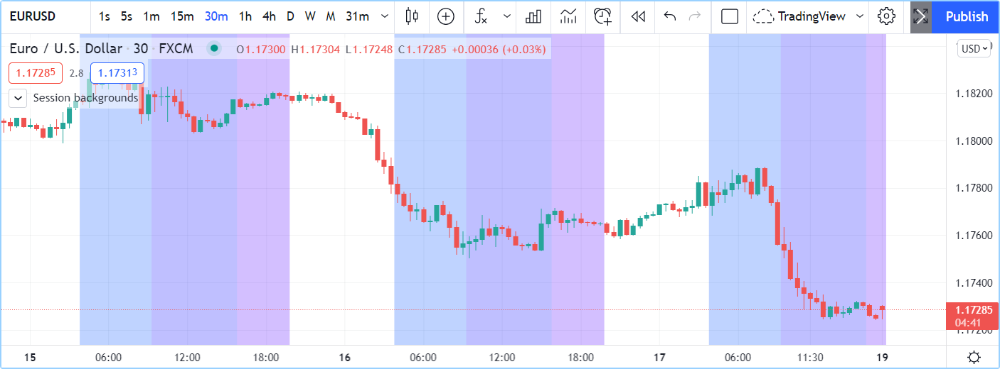
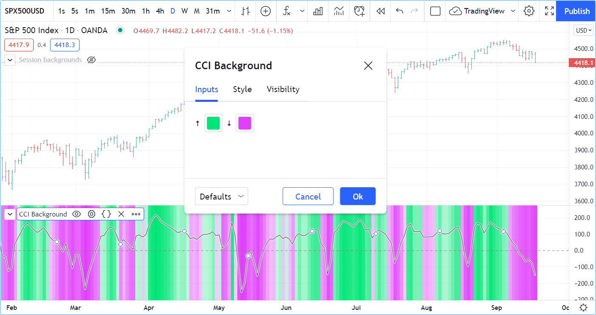

# Backgrounds

A função [bgcolor()](https://br.tradingview.com/pine-script-reference/v5/#fun_bgcolor) altera a cor do fundo do script. Se o script estiver sendo executado no modo `overlay = true`, então ela colorirá o fundo do gráfico.

A assinatura da função é:

```c
bgcolor(color, offset, editable, show_last, title) → void
```

O parâmetro `color` permite o uso de uma "series color" como argumento, o que possibilita que seja calculado dinamicamente em uma expressão.

Se a transparência correta não fizer parte da cor a ser usada, ela pode ser gerada usando a função [color.new()](https://br.tradingview.com/pine-script-reference/v5/#fun_color{dot}new).

Aqui está um script que colore o fundo das sessões de negociação (experimente em EURUSD de 30min, por exemplo):

```c
//@version=5
indicator("Session backgrounds", overlay = true)

// Default color constants using tranparency of 25.
BLUE_COLOR   = #0050FF40
PURPLE_COLOR = #0000FF40
PINK_COLOR   = #5000FF40
NO_COLOR     = color(na)

// Allow user to change the colors.
preMarketColor  = input.color(BLUE_COLOR, "Pre-market")
regSessionColor = input.color(PURPLE_COLOR, "Pre-market")
postMarketColor = input.color(PINK_COLOR, "Pre-market")

// Function returns `true` when the bar's time is
timeInRange(tf, session) =>
    time(tf, session) != 0

// Function prints a message at the bottom-right of the chart.
f_print(_text) =>
    var table _t = table.new(position.bottom_right, 1, 1)
    table.cell(_t, 0, 0, _text, bgcolor = color.yellow)

var chartIs30MinOrLess = timeframe.isseconds or (timeframe.isintraday and timeframe.multiplier <=30)
sessionColor = if chartIs30MinOrLess
    switch
        timeInRange(timeframe.period, "0400-0930") => preMarketColor
        timeInRange(timeframe.period, "0930-1600") => regSessionColor
        timeInRange(timeframe.period, "1600-2000") => postMarketColor
        => NO_COLOR
else
    f_print("No background is displayed.\nChart timeframe must be <= 30min.")
    NO_COLOR

bgcolor(sessionColor)
```



__Note que:__

- O script funciona apenas em _timeframes_ de gráfico de 30 minutos ou menos. Ele exibe uma mensagem de erro quando o _timeframe_ do gráfico é superior a 30 minutos.
- Quando o `else` da estrutura [if](https://br.tradingview.com/pine-script-reference/v5/#kw_if) é usada porque o _timeframe_ do gráfico está incorreto, o bloco local retorna a cor `NO_COLOR`, de modo que nenhum fundo é exibido nesse caso.
- Primeiramente, inicializa-se constantes usando as cores base, que incluem a transparência `40` na notação hexadecimal no fim. O `40` na notação hexadecimal na escala invertida _00-FF_ para transparência corresponde a `75` na escala decimal de __0-100__ do Pine Script para transparência.
- Inputs de cor disponíveis que permitem aos usuários do script alterar as cores padrão proposto.

No próximo exemplo, é gerado um gradiente para o fundo de uma linha CCI:

```c
//@version=5
indicator("CCI Background")

bullColor = input.color(color.lime, "🠅", inline = "1")
bearColor = input.color(color.fuchsia, "🠇", inline = "1")

// Calculate CCI.
myCCI = ta.cci(hlc3, 20)
// Get relative position of CCI in last 100 bars, on a 0-100% scale.
myCCIPosition = ta.percentrank(myCCI, 100)
// Generate a bull gradient when position is 50-100%, bear gradient when position is 0-50%.
backgroundColor = if myCCIPosition >= 50
    color.from_gradient(myCCIPosition, 50, 100, color.new(bullColor, 75), bullColor)
else
    color.from_gradient(myCCIPosition, 0, 50, bearColor, color.new(bearColor, 75))

// Wider white line background.
plot(myCCI, "CCI", color.white, 3)
// Think black line.
plot(myCCI, "CCI", color.black, 1)
// Zero level.
hline(0)
// Gradient background.
bgcolor(backgroundColor)
```



__Note que:__

- A função [ta.cci()](https://br.tradingview.com/pine-script-reference/v5/#fun_ta{dot}cci) é usada para calcular o valor do indicador.
- A função [ta.percentrank()](https://br.tradingview.com/pine-script-reference/v5/#ta.percentrank) é aplicada para calcular `myCCIPosition`, isto é, a percentagem de valores anteriores de `myCCI` nas últimas 100 barras que estão abaixo do valor atual de `myCCI`.
- Para formar o gradiente, são empregadas duas chamadas distintas à função [color.from_gradient()](https://br.tradingview.com/pine-script-reference/v5/#fun_color{dot}from_gradient): uma para o gradiente positivo quando `myCCIPosition` está na faixa de _50-100%_, indicando que mais valores anteriores estão abaixo do seu valor atual, e outra para o gradiente negativo quando `myCCIPosition` está na faixa de _0-49,99%_, indicando que mais valores anteriores estão acima.
- _Inputs_ são fornecidos para que o usuário possa modificar as cores para situações de alta e baixa, posicionando ambos os controles de entrada de cor na mesma linha com o uso de `inline = "1"` em ambas chamadas de [input.color()](https://br.tradingview.com/pine-script-reference/v5/#fun_input{dot}color).
- O sinal do CCI é representado através de duas chamadas de [plot()](https://br.tradingview.com/pine-script-reference/v5/#fun_plot) para maximizar o contraste sobre um fundo detalhado: a primeira plotagem é um fundo branco de 3 pixels de largura, e o segundo [plot()](https://br.tradingview.com/pine-script-reference/v5/#fun_plot) apresenta uma linha preta fina de 1 pixel de largura.

Consulte a página de [Cores](./05_07_cores.md) para mais exemplos.
