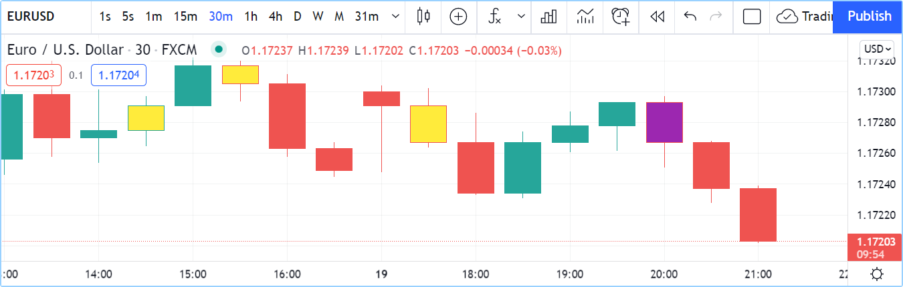

# Coloração de Barras

A função [barcolor()](https://br.tradingview.com/pine-script-reference/v5/#fun_barcolor) permite colorir as barras do gráfico. É a única função do Pine Script que permite a um script em execução em um painel afetar o gráfico.

A assinatura da função é:

```c
barcolor(color, offset, editable, show_last, title) → void
```

A coloração pode ser condicional porque o parâmetro de `color` aceita argumentos de "series color".

O seguinte script renderiza barras _internas_ e _externas_ em cores diferentes:



```c
//@version=5
indicator("barcolor example", overlay = true)
isUp = close > open
isDown = close <= open
isOutsideUp = high > high[1] and low < low[1] and isUp
isOutsideDown = high > high[1] and low < low[1] and isDown
isInside = high < high[1] and low > low[1]
barcolor(isInside ? color.yellow : isOutsideUp ? color.aqua : isOutsideDown ? color.purple : na)
```

__Note que:__

- O valor [na](https://br.tradingview.com/pine-script-reference/v5/#var_na) mantém as barras como estão.
- Na chamada de [barcolor()](https://br.tradingview.com/pine-script-reference/v5/#fun_barcolor), é usado expressões do operador ternário [?:](https://br.tradingview.com/pine-script-reference/v5/#op_{question}{colon}) incorporada para selecionar a cor.
