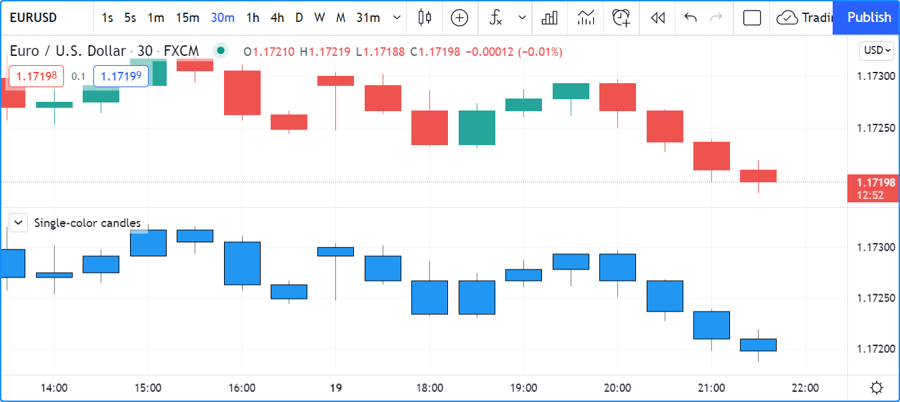
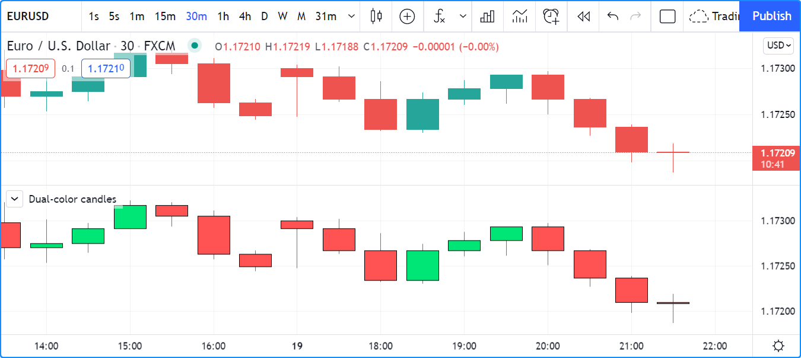
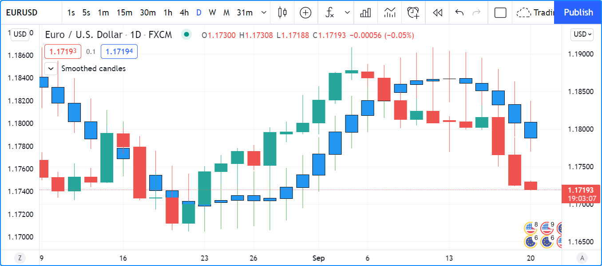
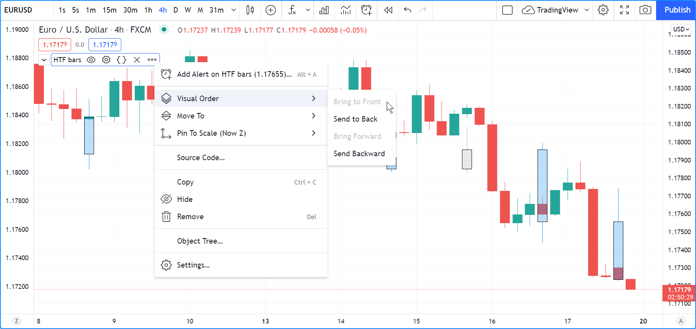

# Plotagem de Barras

As funções incorporadas [plotcandle()](https://br.tradingview.com/pine-script-reference/v5/#fun_plotcandle) e [plotbar()](https://br.tradingview.com/pine-script-reference/v5/#fun_plotbar) são utilizadas para plotar velas e barras convencionais.

Ambas as funções exigem quatro argumentos que serão usados para os preços __OHLC__ ([open](https://br.tradingview.com/pine-script-reference/v5/#var_open), [high](https://br.tradingview.com/pine-script-reference/v5/#var_high), [low](https://br.tradingview.com/pine-script-reference/v5/#var_low), [close](https://br.tradingview.com/pine-script-reference/v5/#var_close)) (_abertura_, _máximo_, _mínimo_, _fechamento_) das barras que elas plotarão. Se algum desses valores for [na](https://br.tradingview.com/pine-script-reference/v5/#var_na), nenhuma barra será plotada.


# Plotando Velas com `plotcandle()`

A assinatura de [plotcandle()](https://br.tradingview.com/pine-script-reference/v5/#fun_plotcandle) é:

```c
plotcandle(open, high, low, close, title, color, wickcolor, editable, show_last, bordercolor, display) → void
```

Este comando plota velas simples, todos em azul, usando os valores habituais de __OHLC__, em um painel separado:

```c
//@version=5
indicator("Single-color candles")
plotcandle(open, high, low, close)
```



Para colorir de verde ou vermelho, pode-se usar o seguinte código:

```c
//@version=5
indicator("Example 2")
paletteColor = close >= open ? color.lime : color.red
plotbar(open, high, low, close, color = paletteColor)
```



Observe que o parâmetro de `color` aceita argumentos de "series color", portanto, valores constantes como `color.red`, `color.lime`, `"#FF9090"`, bem como expressões que calculam cores em tempo de execução, como é feito com a variável `paletteColor`, funcionarão.

É possível construir barras ou _candles_ (_velas_) usando valores diferentes dos valores reais de __OHLC__. Por exemplo, podem ser calculados e plotados velas suavizados usando o código a seguir, que também colore os pavios dependendo da posição do [close](https://br.tradingview.com/pine-script-reference/v5/#var_close) em relação ao fechamento suavizado (`c`) do indicador:

```c
//@version=5
indicator("Smoothed candles", overlay = true)
lenInput = input.int(9)
smooth(source, length) =>
    ta.sma(source, length)
o = smooth(open, lenInput)
h = smooth(high, lenInput)
l = smooth(low, lenInput)
c = smooth(close, lenInput)
ourWickColor = close > c ? color.green : color.red
plotcandle(o, h, l, c, wickcolor = ourWickColor)
```



Pode ser útil plotar valores de __OHLC__ retirados de um timeframe superior. Por exemplo, é possível plotar barras diárias em um gráfico intradiário:

```c
// NOTE: Use this script on an intraday chart.
//@version=5
indicator("Daily bars")

// Use gaps to only return data when the 1D timeframe completes, `na` otherwise.
[o, h, l, c] = request.security(syminfo.tickerid, "D", [open, high, low, close], gaps = barmerge.gaps_on)

var color UP_COLOR = color.silver
var color DN_COLOR = color.blue
color wickColor = c >= o ? UP_COLOR : DN_COLOR
color bodyColor = c >= o ? color.new(UP_COLOR, 70) : color.new(DN_COLOR, 70)
// Only plot candles on intraday timeframes,
// and when non `na` values are returned by `request.security()` because a HTF has completed.
plotcandle(timeframe.isintraday ? o : na, h, l, c, color = bodyColor, wickcolor = wickColor)
```



__Note que:__

- O plot do script é mostrado após usar "_Visual Order_/_Bring to Front_" ("_Ordem Visual_/_Trazer para Frente_") no menu "_More_" ("_Mais_") do script. Isso faz com que as velas do script apareçam sobre as velas do gráfico.
- O script exibirá candles apenas quando duas condições forem atendidas:
    - O gráfico está usando um timeframe intradiário (verifique a condição `timeframe.isintraday` na chamada de [plotcandle()](https://br.tradingview.com/pine-script-reference/v5/#fun_plotcandle)). Isso é feito porque não é útil mostrar um valor diário em timeframes superiores ou iguais a 1D.
    - A função [request.security()](https://br.tradingview.com/pine-script-reference/v5/#fun_request{dot}security) retorna valores que não são [na](https://br.tradingview.com/pine-script-reference/v5/#var_na) (verifique `gaps = barmerge.gaps_on` na chamada da função).
- Usa-se uma tupla (`[open, high, low, close]`) com [request.security()](https://br.tradingview.com/pine-script-reference/v5/#fun_request{dot}security) para obter quatro valores em uma única chamada.
- Usa-se [var](https://br.tradingview.com/pine-script-reference/v5/#kw_var) para declarar as constantes de cor `UP_COLOR` e `DN_COLOR` apenas na barra zero. Constantes são utilizadas porque essas cores são usadas em mais de um lugar no código. Dessa forma, se for necessário alterá-las, basta fazê-lo em um único local.
- Cria-se uma transparência mais clara para o corpo das velas na inicialização da variável `bodyColor`, para que não obstruam as velas do gráfico.
