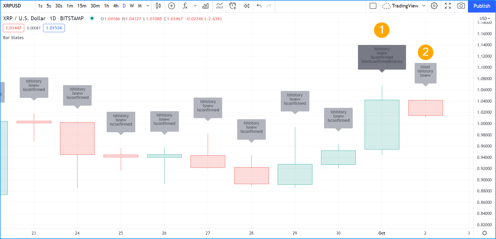
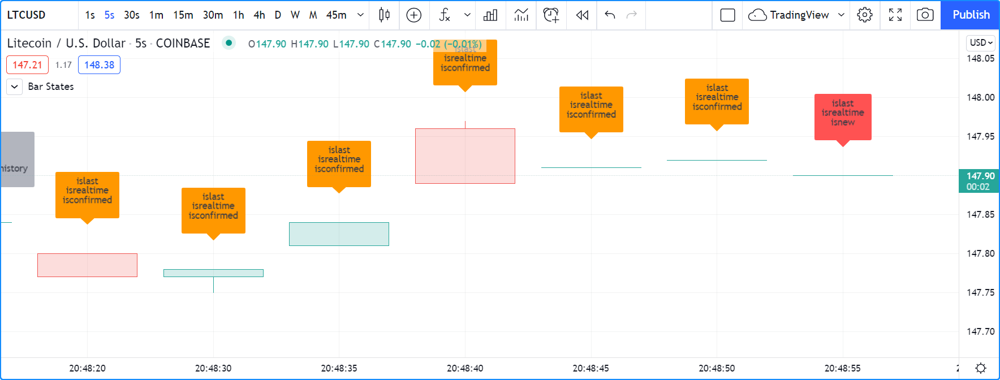
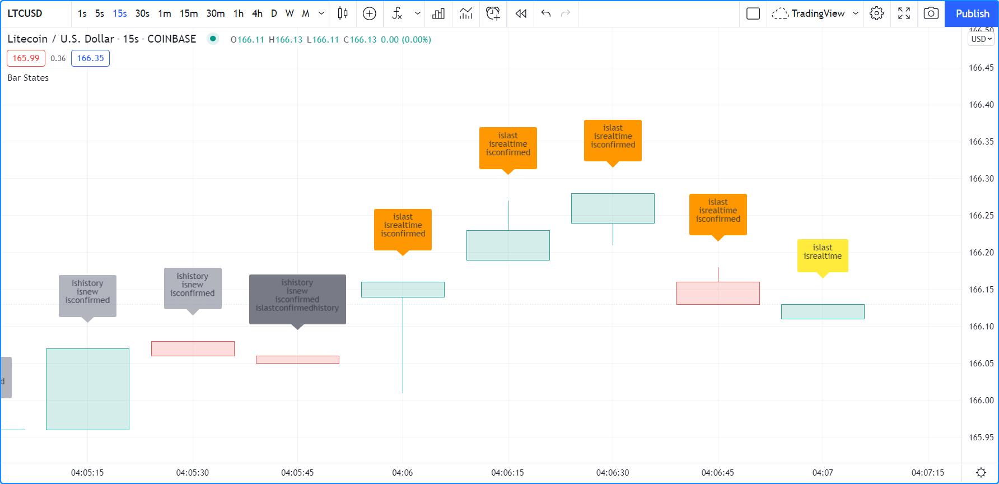

# Estados da Barra

Um conjunto de variáveis incorporadas no _namespace_ `barstate` permite que o script detecte diferentes propriedades da barra na qual o script está sendo executado.

Esses estados podem ser usados para restringir a execução ou a lógica do código a barras específicas.

Alguns recursos incorporados retornam informações sobre a sessão de negociação à qual a barra atual pertence. Eles são explicados na seção de [estados da Sessão](./05_17_sessoes.md#estados-da-sessão).


# Variáveis Embutidas do Estado da Barra

Embora indicadores e bibliotecas sejam executados em todas as atualizações de preço ou volume em tempo real, estratégias que não utilizam `calc_on_every_tick` não serão executadas; elas serão executadas apenas quando a barra em tempo real fechar. Isso afetará a detecção de estados da barra nesse tipo de script. Em mercados abertos, por exemplo, este código não exibirá um plano de fundo até que a barra em tempo real feche, pois é quando a estratégia é executada:

```c
//@version=5
strategy("S")
bgcolor(barstate.islast ? color.silver : na)
```

## `barstate.isfirst`

[barstate.isfirst](https://br.tradingview.com/pine-script-reference/v5/#var_barstate{dot}isfirst) é `true` apenas na primeira barra do conjunto de dados, ou seja, quando [bar_index](https://br.tradingview.com/pine-script-reference/v5/#var_bar_index) é zero.

Pode ser útil inicializar variáveis apenas na primeira barra, por exemplo:

```c
// Declare array and set its values on the first bar only.
FILL_COLOR = color.green
var fillColors = array.new_color(0)
if barstate.isfirst
    // Initialize the array elements with progressively lighter shades of the fill color.
    array.push(fillColors, color.new(FILL_COLOR, 70))
    array.push(fillColors, color.new(FILL_COLOR, 75))
    array.push(fillColors, color.new(FILL_COLOR, 80))
    array.push(fillColors, color.new(FILL_COLOR, 85))
    array.push(fillColors, color.new(FILL_COLOR, 90))
```

## `barstate.islast`

[barstate.islast](https://br.tradingview.com/pine-script-reference/v5/#var_barstate{dot}islast) é `true` se a barra atual for a última no gráfico, independentemente de ser uma barra em tempo real ou não.

Pode ser usado para restringir a execução do código à última barra do gráfico, o que é frequentemente útil ao desenhar linhas, _labels_ ou tabelas. Aqui, é usado para determinar quando atualizar um _label_ que deve aparecer apenas na última barra. O _label_ é criado apenas uma vez e, em seguida, suas propriedades são atualizadas usando as funções `label.set_*()`, por ser mais eficiente:

```c
//@version=5
indicator("", "", true)
// Create label on the first bar only.
var label hiLabel = label.new(na, na, "")
// Update the label's position and text on the last bar,
// including on all realtime bar updates.
if barstate.islast
    label.set_xy(hiLabel, bar_index, high)
    label.set_text(hiLabel, str.tostring(high, format.mintick))
```

## `barstate.ishistory`

[barstate.ishistory](https://br.tradingview.com/pine-script-reference/v5/#var_barstate{dot}ishistory) é `true` em todas as barras históricas. Nunca pode ser `true` em uma barra quando [barstate.isrealtime](https://br.tradingview.com/pine-script-reference/v5/#var_barstate{dot}isrealtime) também é `true`, e não se torna `true` na atualização de fechamento de uma barra em tempo real, quando [barstate.isconfirmed](https://br.tradingview.com/pine-script-reference/v5/#var_barstate{dot}isconfirmed) se torna `true`. Em mercados fechados, pode ser `true` na mesma barra onde [barstate.islast](https://br.tradingview.com/pine-script-reference/v5/#var_barstate{dot}islast) também é `true`.

## `barstate.isrealtime`

[barstate.isrealtime](https://br.tradingview.com/pine-script-reference/v5/#var_barstate{dot}isrealtime) é `true` se a atualização de dados atual for uma atualização de barra em tempo real, falso caso contrário (sendo assim histórica). Observe que [barstate.islast](https://br.tradingview.com/pine-script-reference/v5/#var_barstate{dot}islast) também é `true` em todas as barras em tempo real.

## `barstate.isnew`

[barstate.isnew](https://br.tradingview.com/pine-script-reference/v5/#var_barstate{dot}isnew) é `true` em todas as barras históricas e na primeira atualização (abertura) da barra em tempo real.

Todas as barras históricas são consideradas _novas_ barras porque o tempo de execução do Pine Script executa o script em cada barra sequencialmente, desde a primeira barra do gráfico até a última. Cada barra histórica é, portanto, _descoberta_ pelo script à medida que é executada, barra a barra.

[barstate.isnew](https://br.tradingview.com/pine-script-reference/v5/#var_barstate{dot}isnew) pode ser útil para redefinir variáveis [varip](https://br.tradingview.com/pine-script-reference/v5/#kw_varip) quando uma nova barra em tempo real chega. O código a seguir redefinirá `updateNo` para 1 em todas as barras históricas e no início de cada barra em tempo real. Ele calcula o número de atualizações em tempo real durante cada barra em tempo real:

```c
//@version=5
indicator("")
updateNo() =>
    varip int updateNo = na
    if barstate.isnew
        updateNo := 1
    else
        updateNo += 1
plot(updateNo())
```

## `barstate.isconfirmed`

[barstate.isconfirmed](https://br.tradingview.com/pine-script-reference/v5/#var_barstate{dot}isconfirmed) é `true` em todas as barras históricas e na última atualização (fechamento) de uma barra em tempo real.

Pode ser útil para evitar repainting, exigindo que a barra em tempo real seja fechada antes que uma condição possa se tornar `true`. Aqui, é usado para segurar a plotagem do RSI até que a barra em tempo real feche e se torne uma barra em tempo real concluída. Ele plotará em barras históricas porque [barstate.isconfirmed](https://br.tradingview.com/pine-script-reference/v5/#var_barstate{dot}isconfirmed) é sempre `true` nelas:

[barstate.isconfirmed](https://br.tradingview.com/pine-script-reference/v5/#var_barstate{dot}isconfirmed) não funcionará quando usado em uma chamada de [request.security()](https://br.tradingview.com/pine-script-reference/v5/#fun_request{dot}security).

## `barstate.islastconfirmedhistory`

[barstate.islastconfirmedhistory](https://br.tradingview.com/pine-script-reference/v5/#var_barstate{dot}islastconfirmedhistory) é `true` se o script estiver sendo executado na última barra do conjunto de dados quando o mercado estiver fechado, ou na barra imediatamente anterior à barra em tempo real se o mercado estiver aberto.

Pode ser usado para detectar a primeira barra em tempo real com `barstate.islastconfirmedhistory[1]`, ou para adiar cálculos intensivos em servidor até a última barra histórica, que de outra forma seria indetectável em mercados abertos.


# Exemplo

Exemplo de um script usando variáveis `barstate.*`:

```c
//@version=5
indicator("Bar States", overlay = true, max_labels_count = 500)

stateText() =>
    string txt = ""
    txt += barstate.isfirst     ? "isfirst\n"     : ""
    txt += barstate.islast      ? "islast\n"      : ""
    txt += barstate.ishistory   ? "ishistory\n"   : ""
    txt += barstate.isrealtime  ? "isrealtime\n"  : ""
    txt += barstate.isnew       ? "isnew\n"       : ""
    txt += barstate.isconfirmed ? "isconfirmed\n" : ""
    txt += barstate.islastconfirmedhistory ? "islastconfirmedhistory\n" : ""

labelColor = switch
    barstate.isfirst                => color.fuchsia
    barstate.islastconfirmedhistory => color.gray
    barstate.ishistory              => color.silver
    barstate.isconfirmed            => color.orange
    barstate.isnew                  => color.red
    => color.yellow

label.new(bar_index, na, stateText(), yloc = yloc.abovebar, color = labelColor)
```

__Note que:__

- O nome de cada estado aparecerá no texto do _label_ quando for `true`.
- Existem cinco cores possíveis para o fundo do _label_:
    - Fúcsia na primeira barra.
    - Prata em barras históricas.
    - Cinza na última barra histórica confirmada.
    - Laranja quando uma barra em tempo real é confirmada (quando fecha e se torna uma barra em tempo real concluída).
    - Vermelho na primeira execução da barra em tempo real.
    - Amarelo para outras execuções da barra em tempo real.

Primeiro, adiciona-se o indicador ao gráfico de um mercado aberto, mas antes de qualquer atualização em tempo real ser recebida. Note como a última barra histórica confirmada é identificada em _#1_ e como a última barra é identificada como a última, mas ainda é considerada uma barra histórica porque nenhuma atualização em tempo real foi recebida.



Veja o que acontece quando as atualizações em tempo real começam a chegar:



__Note que:__

- A barra em tempo real está vermelha porque é sua primeira execução, já que `barstate.isnew` é `true` e `barstate.ishistory` __não é__ mais `true`, então a estrutura [switch](https://br.tradingview.com/pine-script-reference/v5/#kw_switch) que determina a cor usa a _ramificação_ `barstate.isnew => color.red`. Isso geralmente não dura muito, pois na próxima atualização `barstate.isnew` __não será__ mais `true`, então a cor do _label_ se tornará amarela.
- O _label_ das barras em tempo real concluídas é laranja porque essas barras não eram barras históricas quando fecharam. Portanto, a ramificação `barstate.ishistory => color.silver` na estrutura [switch](https://br.tradingview.com/pine-script-reference/v5/#kw_switch) não foi executada, mas a próxima, `barstate.isconfirmed => color.orange`, foi.

Este último exemplo mostra como o _label_ da barra em tempo real ficará amarelo após a primeira execução na barra. Esta é a forma como o _label_ geralmente aparecerá em barras em tempo real:


