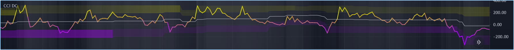
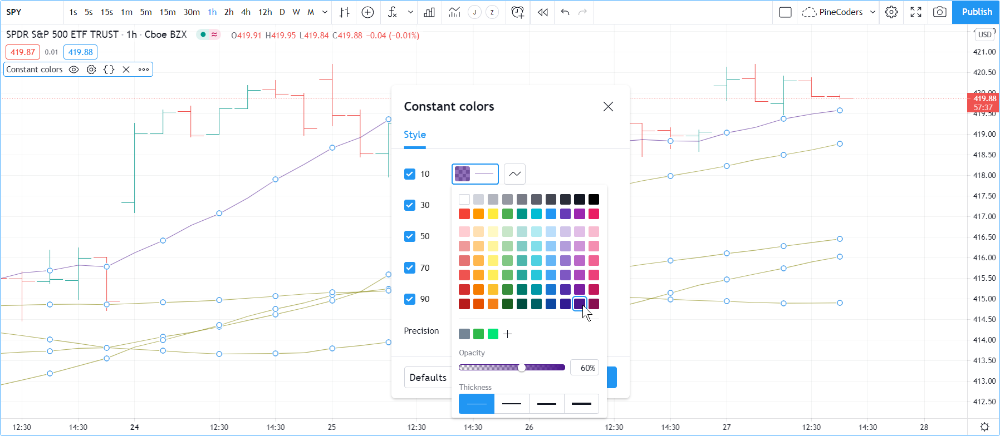
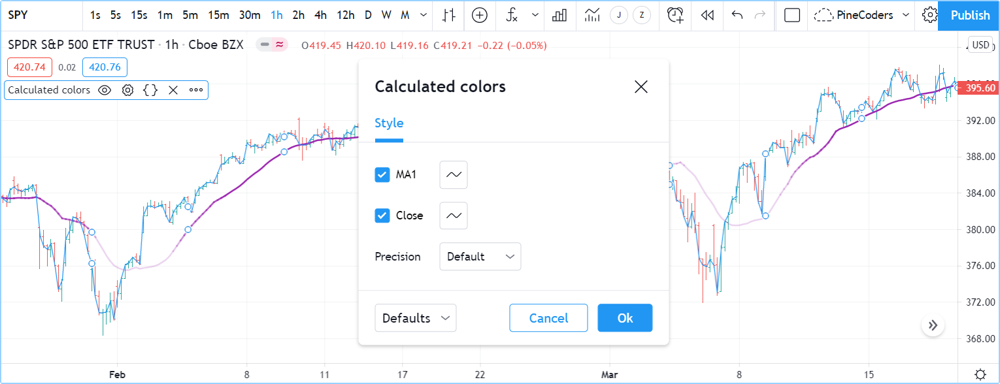
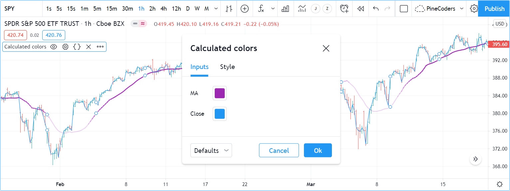

# Cores

Os visuais dos scripts podem desempenhar um papel crítico na usabilidade dos indicadores escritos em Pine Script. Plots e desenhos bem projetados tornam os indicadores mais fáceis de usar e entender. Bons designs visuais estabelecem uma hierarquia visual que permite que as informações mais importantes se destaquem e as menos importantes não atrapalhem.

Usar cores no Pine pode ser tão simples quanto necessário ou tão complexo quanto o conceito exigir. As __4.294.967.296__ combinações possíveis de cor e transparência disponíveis no Pine Script podem ser aplicadas a:

- Qualquer elemento que possa ser plotado ou desenhado no espaço visual de um indicador, sejam linhas, preenchimentos, texto ou velas.
- O fundo do espaço visual de um script, seja o script executado em seu próprio painel ou no modo de sobreposição no gráfico.
- A cor das barras ou do corpo das velas que aparecem em um gráfico.

Um script só pode colorir os elementos que coloca em seu próprio espaço visual. A única exceção a essa regra é que um indicador de painel pode colorir barras ou velas do gráfico.

O Pine Script possui cores incorporadas como [color.green](https://br.tradingview.com/pine-script-reference/v5/#const_color{dot}green), bem como funções como [color.rgb()](https://br.tradingview.com/pine-script-reference/v5/#fun_color{dot}rgb) que permitem gerar dinamicamente qualquer cor no espaço de cores RGBA.

## Transparência

Cada cor no Pine Script é definida por quatro valores:

- Seus componentes vermelho, verde e azul (0-255), seguindo o [modelo de cores RGB](https://en.wikipedia.org/wiki/RGB_color_spaces).
- Sua _transparency_ (_transparência_) (0-100), frequentemente referida como o canal Alpha fora do Pine, conforme definido no [modelo de cores RGBA](https://en.wikipedia.org/wiki/RGB_color_spaces). Mesmo que a transparência seja expressa na faixa de 0-100, seu valor pode ser um "float" quando usado em funções, o que dá acesso aos 256 valores subjacentes do canal alpha.

A transparência de uma cor define quão opaca ela é: zero é totalmente opaca, 100 torna a _cor—qualquer_ que _seja—invisível_. Modular a transparência pode ser crucial em visuais de cores mais complexos ou ao usar fundos, para controlar quais cores dominam as outras e como elas se misturam quando sobrepostas.

## Z-index

Ao colocar elementos no espaço visual de um script, eles têm profundidade relativa no _eixo z_; alguns aparecerão sobre outros. O _z-index_ é um valor que representa a posição dos elementos no _eixo z_. Elementos com o _z-index_ mais alto aparecem no topo.

Elementos desenhados no Pine Script são divididos em grupos. Cada grupo tem sua própria posição no espaço z, e __dentro do mesmo grupo__, elementos criados por último na lógica do script aparecerão sobre outros elementos do mesmo grupo. Um elemento de um grupo não pode ser colocado fora da região do espaço z atribuída ao seu grupo, então um plot nunca pode aparecer sobre uma tabela, por exemplo, porque as tabelas têm o _z-index_ mais alto.

Esta lista contém os grupos de elementos visuais, ordenados por _z-index_ crescente, para que as cores de fundo estejam sempre na parte inferior do espaço z, e as tabelas apareçam sempre no topo de todos os outros elementos:

- [Background Colors (_Cores de fundo_)](https://br.tradingview.com/pine-script-reference/v5/#fun_bgcolor)
- [Fills (_Preenchimentos_)](https://br.tradingview.com/pine-script-reference/v5/#fun_fill)
- [Plots](https://br.tradingview.com/pine-script-reference/v5/#fun_plot)
- [Hlines](https://br.tradingview.com/pine-script-reference/v5/#fun_hline)
- [LineFills](https://br.tradingview.com/pine-script-reference/v5/#fun_linefill)
- [Lines (_Linhas_)](https://br.tradingview.com/pine-script-reference/v5/#fun_line)
- [Boxes (_Caixas_)](https://br.tradingview.com/pine-script-reference/v5/#fun_box)
- [Labels (_Rótulos_)](https://br.tradingview.com/pine-script-reference/v5/#fun_label)
- [Tables (_Tabelas_)](https://br.tradingview.com/pine-script-reference/v5/#fun_table)

Observe que, usando `explicit_plot_zorder = true` em [indicator()](https://br.tradingview.com/pine-script-reference/v5/#fun_indicator) ou [strategy()](https://br.tradingview.com/pine-script-reference/v5/#fun_strategy), é possível controlar o _z-index_ relativo dos visuais de `plot*()`, [hline()](https://br.tradingview.com/pine-script-reference/v5/#fun_hline) e [fill()](https://br.tradingview.com/pine-script-reference/v5/#fun_fill) usando sua ordem sequencial no script.


# Constante de Cores

Existem 17 cores incorporadas no Pine Script. Esta tabela lista seus nomes, equivalentes hexadecimais e valores RGB como argumentos para [color.rgb()](https://br.tradingview.com/pine-script-reference/v5/#fun_color{dot}rgb):

| __Nome__       | __Hex__  | __Valores RGB__           |
| -------------  | -------  | -----------------------:  |
| color.aqua     | #00BCD4  | color.rgb(0, 188, 212)    |
| color.black    | #363A45  | color.rgb(54, 58, 69)     |
| color.blue     | #2196F3  | color.rgb(33, 150, 243)   |
| color.fuchsia  | #E040FB  | color.rgb(224, 64, 251)   |
| color.gray     | #787B86  | color.rgb(120, 123, 134)  |
| color.green    | #4CAF50  | color.rgb(76, 175, 80)    |
| color.lime     | #00E676  | color.rgb(0, 230, 118)    |
| color.maroon   | #880E4F  | color.rgb(136, 14, 79)    |
| color.navy     | #311B92  | color.rgb(49, 27, 146)    |
| color.olive    | #808000  | color.rgb(128, 128, 0)    |
| color.orange   | #FF9800  | color.rgb(255, 152, 0)    |
| color.purple   | #9C27B0  | color.rgb(156, 39, 176)   |
| color.red      | #FF5252  | color.rgb(255, 82, 82)    |
| color.silver   | #B2B5BE  | color.rgb(178, 181, 190)  |
| color.teal     | #00897B  | color.rgb(0, 137, 123)    |
| color.white    | #FFFFFF  | color.rgb(255, 255, 255)  |
| color.yellow   | #FFEB3B  | color.rgb(255, 235, 59)   |

No script a seguir, todos os plots usam a mesma cor [color.olive](https://br.tradingview.com/pine-script-reference/v5/#const_color{dot}olive) com uma transparência de 40, mas expressa de maneiras diferentes. Todos os cinco métodos são funcionalmente equivalentes:


```c
//@version=5
indicator("", "", true)
// ————  Transparency (#99) is included in the hex value.
plot(ta.sma(close, 10), "10", #80800099)
// ————  Transparency is included in the color-generating function's arguments.
plot(ta.sma(close, 30), "30", color.new(color.olive, 40))
plot(ta.sma(close, 50), "50", color.rgb(128, 128, 0, 40))
      // ————  Use `transp` parameter (deprecated and advised against)
plot(ta.sma(close, 70), "70", color.olive, transp = 40)
plot(ta.sma(close, 90), "90", #808000, transp = 40)
```

> __Observação__\
> As duas últimas chamadas de [plot()](https://br.tradingview.com/pine-script-reference/v5/#fun_plot) especificam a transparência usando o parâmetro `transp`. Esse uso deve ser evitado, pois `transp` está obsoleto no Pine Script v5. Usar o parâmetro `transp` para definir transparência não é tão flexível porque requer um argumento do tipo _input integer_ (_inteiro de entrada_), o que significa que deve ser conhecido antes da execução do script e, portanto, não pode ser calculado dinamicamente, à medida que o script é executado barra a barra. Além disso, se for usado um argumento de `color` que já inclui informações de transparência, como é feito nas próximas três chamadas de [plot()](https://br.tradingview.com/pine-script-reference/v5/#fun_plot), qualquer argumento usado para o parâmetro `transp` não terá efeito. Isso também é válido para outras funções com um parâmetro `transp`.

As cores no script anterior não variam à medida que o script é executado barra a barra. Às vezes, no entanto, as cores precisam ser criadas conforme o script é executado em cada barra, pois dependem de condições desconhecidas no momento da compilação ou quando o script começa a execução na barra zero. Para esses casos, os programadores têm duas opções:

1. Usar instruções condicionais para selecionar cores de algumas cores base predeterminadas.
2. Construir novas cores dinamicamente, calculando-as à medida que o script é executado barra a barra, para implementar gradientes de cores, por exemplo.


# Coloração Condicional

Suponha que seja necessário colorir uma média móvel em diferentes cores, dependendo de algumas condições definidas. Para isso, pode-se usar uma instrução condicional que selecionará uma cor diferente para cada um dos estados. Começando por colorir uma média móvel em uma cor de alta quando estiver subindo, e em uma cor de baixa quando não estiver:


```c
//@version=5
indicator("Conditional colors", "", true)
int   lengthInput = input.int(20, "Length", minval = 2)
color maBullColorInput = input.color(color.green, "Bull")
color maBearColorInput = input.color(color.maroon, "Bear")
float ma = ta.sma(close, lengthInput)
// Define our states.
bool maRising  = ta.rising(ma, 1)
// Build our color.
color c_ma = maRising ? maBullColorInput : maBearColorInput
plot(ma, "MA", c_ma, 2)
```

__Note que:__

- São fornecidas aos usuários do script uma seleção de cores para as cores de alta/baixa.
Define-se uma variável booleana `maRising` que será `true` quando a média móvel estiver mais alta na barra atual do que na anterior.
- Define-se uma variável de cor `c_ma` que é atribuída a uma das duas cores, dependendo do valor do booleano `maRising`. Usa-se o [operador ternário ? :](https://br.tradingview.com/pine-script-reference/v5/#op_{question}{colon}) para escrever a instrução condicional.

Também é possível usar cores condicionais para evitar plotagem em determinadas condições. Aqui, plotam-se pivôs de alta e baixa usando uma linha, mas não se deseja plotar nada quando um novo pivô surge, para evitar as junções que apareceriam nas transições de pivô. Para isso, testa-se as mudanças de pivô e usa-se [na](https://br.tradingview.com/pine-script-reference/v5/#var_na) como valor de cor quando uma mudança é detectada, para que nenhuma linha seja plotada nessa barra:


```c
//@version=5
indicator("Conditional colors", "", true)
int legsInput = input.int(5, "Pivot Legs", minval = 1)
color pHiColorInput = input.color(color.olive, "High pivots")
color pLoColorInput = input.color(color.orange, "Low pivots")
// Intialize the pivot level variables.
var float pHi = na
var float pLo = na
// When a new pivot is detected, save its value.
pHi := nz(ta.pivothigh(legsInput, legsInput), pHi)
pLo := nz(ta.pivotlow( legsInput, legsInput), pLo)
// When a new pivot is detected, do not plot a color.
plot(pHi, "High", ta.change(pHi) ? na : pHiColorInput, 2, plot.style_line)
plot(pLo, "Low",  ta.change(pLo) ? na : pLoColorInput, 2, plot.style_line)
```

Para entender como esse código funciona, é preciso saber que [ta.pivothigh()](https://br.tradingview.com/pine-script-reference/v5/#fun_ta{dot}pivothigh) e [ta.pivotlow()](https://br.tradingview.com/pine-script-reference/v5/#fun_ta{dot}pivotlow), usados como estão aqui sem um argumento para o parâmetro `source`, retornarão um valor quando encontrarem um pivô de [_high_](https://br.tradingview.com/pine-script-reference/v5/#var_high)/[_low_](https://br.tradingview.com/pine-script-reference/v5/#var_low) (_alta_/_baixa_), caso contrário, retornam [na](https://br.tradingview.com/pine-script-reference/v5/#var_na).

Ao testar o valor retornado pela função de pivô para [na](https://br.tradingview.com/pine-script-reference/v5/#var_na) usando a função [nz()](https://br.tradingview.com/pine-script-reference/v5/#fun_nz), permite-se que o valor retornado seja atribuído às variáveis `pHi` ou `pLo` apenas quando não for [na](https://br.tradingview.com/pine-script-reference/v5/#var_na), caso contrário, o valor anterior da variável é simplesmente reatribuído a ela, o que não tem impacto em seu valor. Lembre-se de que os valores anteriores de `pHi` e `pLo` são preservados de barra a barra porque se usa a palavra-chave [var](https://br.tradingview.com/pine-script-reference/v5/#kw_var) ao inicializá-los, o que faz com que a inicialização ocorra apenas na primeira barra.

O que resta a fazer é, ao plotar as linhas, inserir uma instrução condicional ternária que resultará em [na](https://br.tradingview.com/pine-script-reference/v5/#var_na) para a cor quando o valor do pivô mudar, ou a cor selecionada nas entradas do script quando o nível do pivô não mudar.


# Cores Calculadas

Usando funções como [color.new()](https://br.tradingview.com/pine-script-reference/v5/#fun_color{dot}new), [color.rgb()](https://br.tradingview.com/pine-script-reference/v5/#fun_color{dot}rgb) e [color.from_gradient()](https://br.tradingview.com/pine-script-reference/v5/#fun_color{dot}from_gradient), é possível construir cores dinamicamente, conforme o script é executado barra a barra.

[color.new()](https://br.tradingview.com/pine-script-reference/v5/#fun_color{dot}new) é mais útil quando é necessário gerar diferentes níveis de transparência a partir de uma cor base.

[color.rgb()](https://br.tradingview.com/pine-script-reference/v5/#fun_color{dot}rgb) é útil quando é necessário construir cores dinamicamente a partir de componentes vermelho, verde, azul ou de transparência. Enquanto [color.rgb()](https://br.tradingview.com/pine-script-reference/v5/#fun_color{dot}rgb) cria uma cor, suas funções irmãs [color.r()](https://br.tradingview.com/pine-script-reference/v5/#fun_color{dot}r), [color.g()](https://br.tradingview.com/pine-script-reference/v5/#fun_color{dot}g), [color.b()](https://br.tradingview.com/pine-script-reference/v5/#fun_color{dot}b) e [color.t()](https://br.tradingview.com/pine-script-reference/v5/#fun_color{dot}t) podem ser usadas para extrair os valores de vermelho, verde, azul ou transparência de uma cor, que podem, por sua vez, ser usados para gerar uma variante.

[color.from_gradient()](https://br.tradingview.com/pine-script-reference/v5/#fun_color{dot}from_gradient) é útil para criar gradientes lineares entre duas cores base. Determina qual cor intermediária usar avaliando um valor de origem em relação aos valores mínimo e máximo.

## `color.new()`

Usa-se [color.new(color, transp)](https://br.tradingview.com/pine-script-reference/v5/#fun_color{dot}new) para criar diferentes transparências para colunas de volume usando uma de duas cores base de alta/baixa:


```c
//@version=5
indicator("Volume")
// We name our color constants to make them more readable.
var color GOLD_COLOR   = #CCCC00ff
var color VIOLET_COLOR = #AA00FFff
color bullColorInput = input.color(GOLD_COLOR,   "Bull")
color bearColorInput = input.color(VIOLET_COLOR, "Bear")
int levelsInput = input.int(10, "Gradient levels", minval = 1)
// We initialize only once on bar zero with `var`, otherwise the count would reset to zero on each bar.
var float riseFallCnt = 0
// Count the rises/falls, clamping the range to: 1 to `i_levels`.
riseFallCnt := math.max(1, math.min(levelsInput, riseFallCnt + math.sign(volume - nz(volume[1]))))
// Rescale the count on a scale of 80, reverse it and cap transparency to <80 so that colors remains visible.
float transparency = 80 - math.abs(80 * riseFallCnt / levelsInput)
// Build the correct transparency of either the bull or bear color.
color volumeColor = color.new(close > open ? bullColorInput : bearColorInput, transparency)
plot(volume, "Volume", volumeColor, 1, plot.style_columns)
```

__Note que:__

- Na penúltima linha do script, a cor da coluna é calculada dinamicamente, variando tanto a cor base usada, dependendo se a barra está subindo ou descendo, __quanto o__ nível de transparência, que é calculado a partir das subidas ou descidas cumulativas do volume.
- O usuário do script tem controle não apenas sobre as cores base de alta/baixa usadas, mas também sobre o número de níveis de brilho. Esse valor é usado para determinar o número máximo de subidas ou descidas que serão acompanhadas. Permitindo que os usuários gerenciem esse valor possibilita adaptar os visuais do indicador ao _timeframe_ ou mercado que utilizam.
- O nível máximo de transparência é controlado para que nunca ultrapasse 80. Isso garante que as cores sempre mantenham alguma visibilidade.
- O valor mínimo para o número de níveis é definido como 1 nos _inputs_. Quando o usuário seleciona 1, as colunas de volume estarão ou na cor de alta ou de baixa de brilho máximo — ou transparência zero.

## `color.rgb()`

No próximo exemplo, [color.rgb(red, green, blue, transp)](https://br.tradingview.com/pine-script-reference/v5/#fun_color{dot}rgb) é usado para construir cores a partir de valores RGBA. O resultado é utilizado como um presente de temporada de festas para os amigos, para que possam levar seus gráficos TradingView para as festas:


```c
//@version=5
indicator("Holiday candles", "", true)
float r = math.random(0, 255)
float g = math.random(0, 255)
float b = math.random(0, 255)
float t = math.random(0, 100)
color holidayColor = color.rgb(r, g, b, t)
plotcandle(open, high, low, close, color = c_holiday, wickcolor = holidayColor, bordercolor = c_holiday)
```

__Note que:__

- Valores são gerados na faixa de zero a 255 para os canais vermelho, verde e azul, e na faixa de zero a 100 para a transparência. Além disso, como [math.random()](https://br.tradingview.com/pine-script-reference/v5/#fun_math{dot}random) retorna valores float, a faixa float 0.0-100.0 fornece acesso aos valores completos de transparência 0-255 do canal alpha.
- A função [math.random(min, max, seed)](https://br.tradingview.com/pine-script-reference/v5/#fun_math{dot}random) é usada para gerar valores pseudoaleatórios. Nenhum argumento é usado para o terceiro parâmetro da função: `seed`. Usar este parâmetro é útil quando se deseja garantir a repetibilidade dos resultados da função. Chamado com a mesma `seed`, ele produzirá a mesma sequência de valores.

## `color.from_gradient()`

Os últimos exemplos de cálculos de cor usarão [color.from_gradient(value, bottom_value, top_value, bottom_color, top_color)](https://br.tradingview.com/pine-script-reference/v5/#fun_color{dot}from_gradient). Primeiro, utiliza-se esta função na sua forma mais simples, para colorir um sinal CCI em uma versão do indicador que, de outra forma, se parece com a da funcionalidade incorporada:


```c
//@version=5
indicator(title="CCI line gradient", precision=2, timeframe="")
var color GOLD_COLOR   = #CCCC00
var color VIOLET_COLOR = #AA00FF
var color BEIGE_COLOR  = #9C6E1B
float srcInput = input.source(close, title="Source")
int   lenInput = input.int(20, "Length", minval = 5)
color bullColorInput = input.color(GOLD_COLOR,   "Bull")
color bearColorInput = input.color(BEIGE_COLOR, "Bear")
float signal = ta.cci(srcInput, lenInput)
color signalColor = color.from_gradient(signal, -200, 200, bearColorInput, bullColorInput)
plot(signal, "CCI", signalColor)
bandTopPlotID = hline(100,  "Upper Band", color.silver, hline.style_dashed)
bandBotPlotID = hline(-100, "Lower Band", color.silver, hline.style_dashed)
fill(bandTopPlotID, bandBotPlotID, color.new(BEIGE_COLOR, 90), "Background")
```

__Note que:__

- Para calcular o gradiente, [color.from_gradient()](https://br.tradingview.com/pine-script-reference/v5/#fun_color{dot}from_gradient) requer valores mínimo e máximo contra os quais o argumento usado para o parâmetro `value` será comparado. O fato de se desejar um gradiente para um sinal sem limites como o CCI (isto é, sem limites fixos como o RSI, que sempre oscila entre 0-100), não significa que [color.from_gradient()](https://br.tradingview.com/pine-script-reference/v5/#fun_color{dot}from_gradient) não possa ser usado. Aqui, a solução é fornecer valores de -200 e 200 como argumentos. Eles não representam os valores mínimo e máximo reais para o CCI, mas estão em níveis a partir dos quais não se importa que as cores não mudem mais, pois sempre que a série estiver fora dos limites `bottom_value` e `top_value`, as cores usadas para `bottom_color` e `top_color` serão aplicadas.
- A progressão de cores calculada por [color.from_gradient()](https://br.tradingview.com/pine-script-reference/v5/#fun_color{dot}from_gradient) é linear. Se o valor da série estiver no meio entre os argumentos `bottom_value` e `top_value`, os componentes RGBA da cor gerada também estarão no meio entre os de `bottom_color` e `top_color`.
- Muitos cálculos de indicadores comuns estão disponíveis no Pine Script como funções embutidas. Aqui, usa-se [ta.cci()](https://br.tradingview.com/pine-script-reference/v5/#fun_ta{dot}cci) em vez de calculá-lo da maneira longa.

O argumento usado para `value` em [color.from_gradient()](https://br.tradingview.com/pine-script-reference/v5/#fun_color{dot}from_gradient) não precisa necessariamente ser o valor da linha que está sendo calculada. Qualquer coisa desejada pode ser usada, desde que argumentos para `bottom_value` e `top_value` possam ser fornecidos. Aqui, o indicador CCI é aprimorado colorindo a faixa usando o número de barras desde que o sinal esteve acima/abaixo da linha central:


```c
//@version=5
indicator(title="CCI line gradient", precision=2, timeframe="")
var color GOLD_COLOR   = #CCCC00
var color VIOLET_COLOR = #AA00FF
var color GREEN_BG_COLOR = color.new(color.green, 70)
var color RED_BG_COLOR   = color.new(color.maroon, 70)
float srcInput      = input.source(close, "Source")
int   lenInput      = input.int(20, "Length", minval = 5)
int   stepsInput    = input.int(50, "Gradient levels", minval = 1)
color bullColorInput   = input.color(GOLD_COLOR, "Line: Bull", inline = "11")
color bearColorInput   = input.color(VIOLET_COLOR, "Bear", inline = "11")
color bullBgColorInput = input.color(GREEN_BG_COLOR, "Background: Bull", inline = "12")
color bearBgColorInput = input.color(RED_BG_COLOR, "Bear", inline = "12")

// Plot colored signal line.
float signal = ta.cci(srcInput, lenInput)
color signalColor = color.from_gradient(signal, -200, 200, color.new(bearColorInput, 0), color.new(bullColorInput, 0))
plot(signal, "CCI", signalColor, 2)

// Detect crosses of the centerline.
bool signalX = ta.cross(signal, 0)
// Count no of bars since cross. Capping it to the no of steps from inputs.
int gradientStep = math.min(stepsInput, nz(ta.barssince(signalX)))
// Choose bull/bear end color for the gradient.
color endColor = signal > 0 ? bullBgColorInput : bearBgColorInput
// Get color from gradient going from no color to `c_endColor`
color bandColor = color.from_gradient(gradientStep, 0, stepsInput, na, endColor)
bandTopPlotID = hline(100,  "Upper Band", color.silver, hline.style_dashed)
bandBotPlotID = hline(-100, "Lower Band", color.silver, hline.style_dashed)
fill(bandTopPlotID, bandBotPlotID, bandColor, title = "Band")
```

__Note que:__

- O plot do sinal usa as mesmas cores base e gradiente do exemplo anterior. No entanto, a largura da linha foi aumentada do padrão 1 para 2. É o componente mais importante dos visuais; aumentar sua largura é uma forma de dar mais destaque e garantir que os usuários não sejam distraídos pela _band_ (_banda_/_faixa_), que se tornou mais movimentada do que em sua cor original, bege.
- O preenchimento deve permanecer discreto por duas razões:
    - Primeiro, é de importância secundária para os visuais, pois fornece informações complementares, ou seja, a duração em que o sinal esteve em território de alta/baixa.
    - Segundo, como os preenchimentos têm um z-index maior do que os plots, o preenchimento cobrirá o plot do sinal. Por essas razões, as cores base do preenchimento são bastante transparentes, em 70, para que não mascarem os plots. O gradiente usado para a _band_ (_banda_/_faixa_) começa sem cor alguma (veja o [na](https://br.tradingview.com/pine-script-reference/v5/#var_na) usado como argumento para `bottom_color` na chamada de [color.from_gradient()](https://br.tradingview.com/pine-script-reference/v5/#fun_color{dot}from_gradient)), e vai para as cores base de alta/baixa dos _inputs_, que a variável de cor condicional `c_endColor` contém.
- São fornecidas aos usuários seleções de cores distintas para alta/baixa para a linha e a _band_ (_banda_/_faixa_).
- Ao calcular a variável `gradientStep`, usa-se [nz()](https://br.tradingview.com/pine-script-reference/v5/#fun_nz) em [ta.barssince()](https://br.tradingview.com/pine-script-reference/v5/#fun_ta{dot}barssince) pois nas barras iniciais do conjunto de dados, quando a condição testada ainda não ocorreu, [ta.barssince()](https://br.tradingview.com/pine-script-reference/v5/#fun_ta{dot}barssince) retornará [na](https://br.tradingview.com/pine-script-reference/v5/#var_na). Porque [nz()](https://br.tradingview.com/pine-script-reference/v5/#fun_nz) é usado, o valor retornado é substituído por zero nesses casos.


# Misturando Transparências

Neste exemplo, o indicador CCI é levado em outra direção. Buffers de zona extremas que ajustam dinamicamente são construídos usando um Canal Donchian (máximos/mínimos históricos) calculado a partir do CCI. As faixas superior e inferior são construídas fazendo com que tenham 1/4 da altura do Canal Donchian. Um _lookback_ que ajusta dinamicamente é usado para calcular o Canal Donchian. Para modular o _lookback_, uma medida simples de volatilidade é calculada mantendo uma proporção de um ATR de curto período para um de longo período. Quando essa proporção é maior do que 50 dos seus últimos 100 valores, a volatilidade é considerada alta. Quando a volatilidade está alta/baixa, o _lookback_ é diminuído/aumentado.

O objetivo é fornecer aos usuários do indicador:

- A linha CCI colorida usando um gradiente de alta/baixa, conforme ilustrado nos exemplos mais recentes.
- As faixas superior e inferior do Canal Donchian, preenchidas de forma que a cor escureça à medida que um máximo/mínimo histórico se torna mais antigo.
- Uma maneira de avaliar o estado da medida de volatilidade, pintando o fundo com uma cor cuja intensidade aumenta quando a volatilidade aumenta.

Isso é como o indicador se parece usando o tema claro:


E usando o tema escuro:



```c
//@version=5
indicator("CCI DC", precision = 6)
color GOLD_COLOR   = #CCCC00ff
color VIOLET_COLOR = #AA00FFff
int lengthInput = input.int(20, "Length", minval = 5)
color bullColorInput = input.color(GOLD_COLOR,   "Bull")
color bearColorInput = input.color(VIOLET_COLOR, "Bear")

// ————— Function clamps `val` between `min` and `max`.
clamp(val, min, max) =>
    math.max(min, math.min(max, val))

// ————— Volatility expressed as 0-100 value.
float v = ta.atr(lengthInput / 5) / ta.atr(lengthInput * 5)
float vPct = ta.percentrank(v, lengthInput * 5)

// ————— Calculate dynamic lookback for DC. It increases/decreases on low/high volatility.
bool highVolatility = vPct > 50
var int lookBackMin = lengthInput * 2
var int lookBackMax = lengthInput * 10
var float lookBack = math.avg(lookBackMin, lookBackMax)
lookBack += highVolatility ? -2 : 2
lookBack := clamp(lookBack, lookBackMin, lookBackMax)

// ————— Dynamic lookback length Donchian channel of signal.
float signal = ta.cci(close, lengthInput)
// `lookBack` is a float; need to cast it to int to be used a length.
float hiTop  = ta.highest(signal, int(lookBack))
float loBot  = ta.lowest( signal, int(lookBack))
// Get margin of 25% of the DC height to build high and low bands.
float margin = (hiTop - loBot) / 4
float hiBot  = hiTop - margin
float loTop  = loBot + margin
// Center of DC.
float center = math.avg(hiTop, loBot)

// ————— Create colors.
color signalColor = color.from_gradient(signal, -200, 200, bearColorInput, bullColorInput)
// Bands: Calculate transparencies so the longer since the hi/lo has changed,
//        the darker the color becomes. Cap highest transparency to 90.
float hiTransp = clamp(100 - (100 * math.max(1, nz(ta.barssince(ta.change(hiTop)) + 1)) / 255), 60, 90)
float loTransp = clamp(100 - (100 * math.max(1, nz(ta.barssince(ta.change(loBot)) + 1)) / 255), 60, 90)
color hiColor = color.new(bullColorInput, hiTransp)
color loColor = color.new(bearColorInput, loTransp)
// Background: Rescale the 0-100 range of `vPct` to 0-25 to create 75-100 transparencies.
color bgColor = color.new(color.gray, 100 - (vPct / 4))

// ————— Plots
// Invisible lines for band fills.
hiTopPlotID = plot(hiTop, color = na)
hiBotPlotID = plot(hiBot, color = na)
loTopPlotID = plot(loTop, color = na)
loBotPlotID = plot(loBot, color = na)
// Plot signal and centerline.
p_signal = plot(signal, "CCI", signalColor, 2)
plot(center, "Centerline", color.silver, 1)

// Fill the bands.
fill(hiTopPlotID, hiBotPlotID, hiColor)
fill(loTopPlotID, loBotPlotID, loColor)

// ————— Background.
bgcolor(bgColor)
```

__Observe que:__

- A transparência do fundo é limitada a uma faixa de 100-75 para que não fique excessivamente destacada. Também é usada uma cor neutra que não distraia muito. Quanto mais escuro o fundo, maior é a medida de volatilidade.
- Os valores de transparência para os preenchimentos das faixas são limitados entre 60 e 90. Usa-se 90 para que, quando um novo máximo/mínimo for encontrado e o gradiente for reiniciado, a transparência inicial torne a cor visível. Não se usa uma transparência inferior a 60 porque não se deseja que essas faixas ocultem a linha do sinal.
- A função [ta.percentrank()](https://br.tradingview.com/pine-script-reference/v5/#fun_ta{dot}percentrank) é usada para gerar um valor de 0-100 a partir da proporção do ATR que mede a volatilidade. É útil para converter valores cuja escala é desconhecida em valores conhecidos que podem ser usados para produzir transparências.
- Como é necessário limitar valores três vezes no script, uma função `f_clamp()` foi escrita, em vez de codificar explicitamente a lógica três vezes.


# Dicas

## Desenhando Esquemas de Cores Utilizáveis

Ao escrever scripts destinados a outros traders, tente evitar cores que não funcionem bem em alguns ambientes, seja para _plots_, _labels_, _tables_ ou _fills_. No mínimo, teste os visuais para garantir que eles funcionem satisfatoriamente tanto com os temas claro quanto escuro do TradingView; eles são os mais comumente usados. Cores como preto e branco, por exemplo, devem ser evitadas.

Construa as entradas apropriadas para fornecer aos usuários do script a flexibilidade de adaptar os visuais do seu script aos seus ambientes particulares.

Cuide para construir uma hierarquia visual das cores usadas que corresponda à importância relativa dos componentes visuais do seu script. Bons designers entendem como alcançar o equilíbrio ideal de cor e peso para que o olho seja naturalmente atraído para os elementos mais importantes do design. Quando tudo se destaca, nada se destaca. Crie espaço para que alguns elementos se destaquem suavizando os visuais ao redor deles.

Fornecer uma seleção de predefinições de cores nas entradas — em vez de uma única cor que pode ser alterada — pode ajudar usuários com dificuldades de percepção de cores. O [_Technical Ratings_](https://br.tradingview.com/script/Jdw7wW2g-Technical-Ratings/) demonstra uma maneira de alcançar isso.

## Plotar Linhas Nítidas

É melhor usar transparência zero para plotar as linhas importantes nos visuais, para mantê-las nítidas. Dessa forma, elas aparecerão através dos preenchimentos de maneira mais precisa. Lembre-se de que os preenchimentos têm um z-index mais alto do que os plots, então eles são colocados acima deles. Um leve aumento na largura de uma linha também pode ajudar bastante a destacá-la.

Se for desejado que um plot especial se destaque, ele pode ganhar mais importância usando múltiplos plots para a mesma linha. Estes são exemplos onde a largura e a transparência sucessivas dos plots são moduladas para alcançar esse objetivo:


```c
//@version=5
indicator("")
plot(high, "", color.new(color.orange, 80), 8)
plot(high, "", color.new(color.orange, 60), 4)
plot(high, "", color.new(color.orange, 00), 1)

plot(hl2, "", color.new(color.orange, 60), 4)
plot(hl2, "", color.new(color.orange, 00), 1)

plot(low, "", color.new(color.orange, 0), 1)
```

## Personalizar Gradientes

Ao construir gradientes, adapte-os aos visuais a que se aplicam. Se um gradiente está sendo usado para colorir velas, por exemplo, geralmente é melhor limitar o número de etapas no gradiente a dez ou menos, pois é mais difícil para o olho perceber variações de intensidade em objetos discretos. Como foi feito nos exemplos, limite os níveis mínimos e máximos de transparência para que os elementos visuais permaneçam visíveis e não se destaquem mais do que o necessário.

## Seleção de Cores através das Configurações do Script

O tipo de cor usada nos scripts impacta a capacidade dos usuários de alterar as cores dos visuais do script. Enquanto não forem usadas cores cujos componentes RGBA precisem ser calculados em tempo de execução, os usuários poderão modificar as cores usadas acessando a aba "_Settings/Style_" ("_Configurações/Estilo_") do script. O primeiro exemplo de script nesta página atende a esse critério, e a captura de tela a seguir mostra como a aba "_Settings/Style_" ("_Configurações/Estilo_") do script foi usada para mudar a cor da primeira média móvel:



Se o script usa uma cor calculada, ou seja, uma cor onde pelo menos um de seus componentes RGBA só pode ser conhecido em tempo de execução, a aba "_Settings/Style_" ("_Configurações/Estilo_") __não__ oferecerá aos usuários os widgets de cores usuais para modificar as cores do plot. Plots do mesmo script que não usam cores calculadas também serão afetados. Neste script, por exemplo, a primeira chamada de [plot()](https://br.tradingview.com/pine-script-reference/v5/#fun_plot) usa uma cor calculada, e a segunda não:

```c
//@version=5
indicator("Calculated colors", "", true)
float ma = ta.sma(close, 20)
float maHeight = ta.percentrank(ma, 100)
float transparency = math.min(80, 100 - maHeight)
// This plot uses a calculated color.
plot(ma, "MA1", color.rgb(156, 39, 176, transparency), 2)
// This plot does not use a calculated color.
plot(close, "Close", color.blue)
```

A cor usada no primeiro plot é uma cor calculada porque sua transparência só pode ser conhecida em tempo de execução. Ela é calculada usando a posição relativa da média móvel em relação aos seus últimos 100 valores. Quanto maior a porcentagem de valores passados abaixo do valor atual, maior será o valor de 0-100 de `maHeight`. Como se deseja que a cor seja mais escura quando `maHeight` é 100, subtrai-se 100 dele para obter transparência zero. Além disso, o valor de `transparency` calculado é limitado a um máximo de 80 para que sempre permaneça visível.

Porque essa cor calculada é usada no script, a aba "_Settings/Style_" ("_Configurações/Estilo_") não mostrará nenhum widget de cor:



A solução para permitir que os usuários controlem as cores usadas é fornecer entradas personalizadas, como feito aqui:



```c
//@version=5
indicator("Calculated colors", "", true)
color maInput = input.color(color.purple, "MA")
color closeInput = input.color(color.blue, "Close")
float ma = ta.sma(close, 20)
float maHeight = ta.percentrank(ma, 100)
float transparency = math.min(80, 100 - maHeight)
// This plot uses a calculated color.
plot(ma, "MA1", color.new(maInput, transparency), 2)
// This plot does not use a calculated color.
plot(close, "Close", closeInput)
```

Observe como as "_Settings_" ("_Configurações_") do script agora mostram uma aba "_Inputs_" ("_Entradas_"), onde foram criadas duas entradas de cores. A primeira usa [color.purple](https://br.tradingview.com/pine-script-reference/v5/#const_color{dot}purple) como valor padrão. Seja o usuário mudando essa cor ou não, ela será usada em uma chamada [color.new()](https://br.tradingview.com/pine-script-reference/v5/#fun_color{dot}new) para gerar uma transparência calculada na chamada de [plot()](https://br.tradingview.com/pine-script-reference/v5/#fun_plot). A segunda entrada usa como padrão a cor incorporada [color.blue](https://br.tradingview.com/pine-script-reference/v5/#const_color{dot}blue) que foi usada anteriormente na chamada de [plot()](https://br.tradingview.com/pine-script-reference/v5/#fun_plot), e simplesmente a utiliza como está na segunda chamada de [plot()](https://br.tradingview.com/pine-script-reference/v5/#fun_plot).
