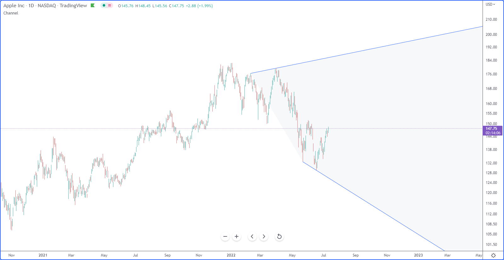
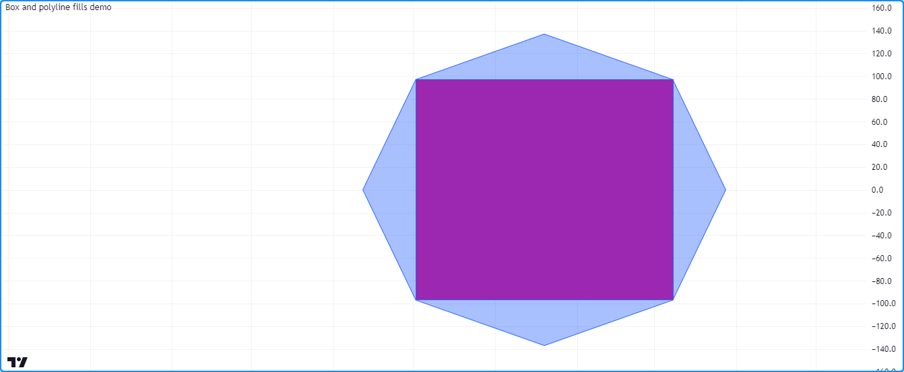

# Fills (_Preenchimentos_)

Algumas das saídas visuais do Pine Script, incluindo [plots](./04_09_tipagem_do_sistema.md#plot-e-hline), [hlines](./04_09_tipagem_do_sistema.md#plot-e-hline), [lines](./05_12_lines_e_boxes.md#lines-linhas), [boxes](./05_12_lines_e_boxes.md#boxes-caixas) e [polylines](./05_12_lines_e_boxes.md#polylines), permitem preencher o espaço do gráfico que ocupam com cores. Três mecanismos diferentes facilitam o preenchimento do espaço entre essas saídas:

- A função [fill()](https://br.tradingview.com/pine-script-reference/v5/#fun_fill) preenche o espaço entre dois plots de chamadas [plot()](https://br.tradingview.com/pine-script-reference/v5/#fun_plot) ou duas linhas horizontais (hlines) de chamadas [hline()](https://br.tradingview.com/pine-script-reference/v5/#fun_hline) com uma cor especificada.
- Objetos do tipo [linefill](https://br.tradingview.com/pine-script-reference/v5/#type_linefill) preenchem o espaço entre instâncias de [line](https://br.tradingview.com/pine-script-reference/v5/#type_line) criadas com [line.new()](https://br.tradingview.com/pine-script-reference/v5/#fun_line.new).
- Outros tipos de desenho, nomeadamente [boxes](./05_12_lines_e_boxes.md#boxes-caixas) e [polylines](./05_12_lines_e_boxes.md#polylines), têm propriedades incorporadas que permitem preencher os espaços visuais que ocupam.


# Preenchimentos de `plot()` e `hline()`

A função [fill()](https://br.tradingview.com/pine-script-reference/v5/#fun_fill) preenche o espaço entre dois plots ou linhas horizontais. Ela possui as seguintes duas assinaturas:

```c
fill(plot1, plot2, color, title, editable, show_last, fillgaps) → void
fill(hline1, hline2, color, title, editable, fillgaps) → void
```

Os parâmetros `plot1`, `plot2`, `hline1` e `hline2` aceitam IDs de [plot](./04_09_tipagem_do_sistema.md#plot-e-hline) ou [hline](./04_09_tipagem_do_sistema.md#plot-e-hline) retornados pelas chamadas das funções [plot()](https://br.tradingview.com/pine-script-reference/v5/#fun_plot) e [hline()](https://br.tradingview.com/pine-script-reference/v5/#fun_hline). A função [fill()](https://br.tradingview.com/pine-script-reference/v5/#fun_fill) é a única embutida que pode usar esses IDs.

Este exemplo simples demonstra como a função [fill()](https://br.tradingview.com/pine-script-reference/v5/#fun_fill) funciona com IDs de [plot e hline](./04_09_tipagem_do_sistema.md#plot-e-hline). Ela chama [plot()](https://br.tradingview.com/pine-script-reference/v5/#fun_plot) e [hline()](https://br.tradingview.com/pine-script-reference/v5/#fun_hline) três vezes para exibir valores arbitrários no gráfico. Cada uma dessas chamadas retorna um ID, que o script atribui a variáveis para uso na função [fill()](https://br.tradingview.com/pine-script-reference/v5/#fun_fill). Os valores de `p1`, `p2` e `p3` são IDs de "plot", enquanto `h1`, `h2` e `h3` referenciam IDs de "hline":


```c
//@version=5
indicator("Example 1")

// Assign "plot" IDs to the `p1`, `p2`, and `p3` variables.
p1 = plot(math.sin(high), "Sine of `high`")
p2 = plot(math.cos(low), "Cosine of `low`")
p3 = plot(math.sin(close), "Sine of `close`")
// Fill the space between `p1` and `p2` with 90% transparent red.
fill(p1, p3, color.new(color.red, 90), "`p1`-`p3` fill")
// Fill the space between `p2` and `p3` with 90% transparent blue.
fill(p2, p3, color.new(color.blue, 90), "`p2`-`p3` fill")

// Assign "hline" IDs to the `h1`, `h2`, and `h3` variables.
h1 = hline(0, "First level")
h2 = hline(1.0, "Second level")
h3 = hline(0.5, "Third level")
h4 = hline(1.5, "Fourth level")
// Fill the space between `h1` and `h2` with 90% transparent yellow.
fill(h1, h2, color.new(color.yellow, 90), "`h1`-`h2` fill")
// Fill the space between `h3` and `h4` with 90% transparent lime.
fill(h3, h4, color.new(color.lime, 90), "`h3`-`h4` fill")
```

É importante notar que a função [fill()](https://br.tradingview.com/pine-script-reference/v5/#fun_fill) requer _quaisqueres_ dois IDs de "plot" ou IDs de "hline". __Não é possível__ misturar esses tipos na chamada da função. Consequentemente, às vezes os programadores precisarão usar [plot()](https://br.tradingview.com/pine-script-reference/v5/#fun_plot) onde normalmente usariam [hline()](https://br.tradingview.com/pine-script-reference/v5/#fun_hline) se quiserem preencher o espaço entre um nível consistente e uma _series_ flutuante.

Por exemplo, este script calcula um `oscillator` ("_oscilador_") com base na distância percentual entre o preço de [close](https://br.tradingview.com/pine-script-reference/v5/#var_close) do gráfico e uma [SMA](https://br.tradingview.com/pine-script-reference/v5/#fun_ta.sma) de 10 barras, e então o plota no painel do gráfico. Neste caso, é desejado preencher a área entre o `oscillator` e zero. Embora o nível zero possa ser exibido com [hline()](https://br.tradingview.com/pine-script-reference/v5/#fun_hline) já que seu valor não muda, não é possível passar um ID de "plot" e um ID de "hline" para a função [fill()](https://br.tradingview.com/pine-script-reference/v5/#fun_fill). Portanto, é necessário usar uma chamada [plot()](https://br.tradingview.com/pine-script-reference/v5/#fun_plot) para o nível ser permitido que o script preencha o espaço:


```c
//@version=5
indicator("Example 2")

//@variable The 10-bar moving average of `close` prices.
float ma = ta.sma(close, 10)
//@variable The distance from the `ma` to the `close` price, as a percentage of the `ma`.
float oscillator = 100 * (ma - close) / ma

//@variable The ID of the `oscillator` plot for use in the `fill()` function.
oscPlotID = plot(oscillator, "Oscillator")
//@variable The ID of the zero level plot for use in the `fill()` function.
//          Requires a "plot" ID since the `fill()` function can't use "plot" and "hline" IDs at the same time.
zeroPlotID = plot(0, "Zero level", color.silver, 1, plot.style_circles)

// Filll the space between the `oscPlotID` and `zeroPlotID` with 90% transparent blue.
fill(oscPlotID, zeroPlotID, color.new(color.blue, 90), "Oscillator fill")
```

O parâmetro `color` da função [fill()](https://br.tradingview.com/pine-script-reference/v5/#fun_fill) aceita um argumento de "series color", o que significa que a cor do preenchimento pode mudar ao longo das barras do gráfico.

Por exemplo, este código preenche o espaço entre dois plots de médias móveis com cores verdes ou vermelhas 90% transparentes, com base em se `ma1` está acima de `ma2`:


```c
//@version=5
indicator("Example 3", overlay = true)

//@variable The 5-bar moving average of `close` prices.
float ma1 = ta.sma(close, 5)
//@variable The 20-bar moving average of `close` prices.
float ma2 = ta.sma(close, 20)

//@variable The 90% transparent color of the space between MA plots. Green if `ma1 > ma2`, red otherwise.
color fillColor = ma1 > ma2 ? color.new(color.green, 90) : color.new(color.red, 90)

//@variable The ID of the `ma1` plot for use in the `fill()` function.
ma1PlotID = plot(ma1, "5-bar SMA")
//@variable The ID of the `ma2` plot for use in the `fill()` function.
ma2PlotID = plot(ma2, "20-bar SMA")

// Fill the space between the `ma1PlotID` and `ma2PlotID` using the `fillColor`.
fill(ma1PlotID, ma2PlotID, fillColor, "SMA plot fill")
```


# Preenchimentos de Linha

Enquanto a função [fill()](https://br.tradingview.com/pine-script-reference/v5/#fun_fill) permite que um script preencha o espaço entre dois [plots ou hlines](./04_09_tipagem_do_sistema.md#plot-e-hline), ela não funciona com objetos de [line](https://br.tradingview.com/pine-script-reference/v5/#type_line). Quando um script precisa preencher o espaço entre [lines](./05_12_lines_e_boxes.md#lines-linhas), é necessário um objeto [linefill](https://br.tradingview.com/pine-script-reference/v5/#type_linefill) criado pela função [linefill.new()](https://br.tradingview.com/pine-script-reference/v5/#fun_linefill.new).

A função possui a seguinte assinatura:

```c
linefill.new(line1, line2, color) → series linefill
```

Os parâmetros `line1` e `line2` aceitam IDs de [line](https://br.tradingview.com/pine-script-reference/v5/#type_line). Esses IDs determinam a região do gráfico que o objeto [linefill](https://br.tradingview.com/pine-script-reference/v5/#type_linefill) preencherá com sua `color` especificada. Um script pode atualizar a propriedade de `color` de um ID de [linefill](https://br.tradingview.com/pine-script-reference/v5/#type_linefill) retornado por essa função chamando [linefill.set_color()](https://br.tradingview.com/pine-script-reference/v5/#fun_linefill.set_color) com o ID como argumento `id`.

O comportamento dos preenchimentos de linha depende das linhas que eles referenciam. Scripts não podem mover preenchimentos de linha diretamente, pois as linhas que um _linefill_ usa determinam o espaço que será preenchido. Para recuperar os IDs das [lines](./05_12_lines_e_boxes.md#lines-linhas) referenciadas por um objeto [linefill](https://br.tradingview.com/pine-script-reference/v5/#type_linefill), use as funções [linefill.get_line1()](https://br.tradingview.com/pine-script-reference/v5/#fun_linefill.get_line1) e [linefill.get_line2()](https://br.tradingview.com/pine-script-reference/v5/#fun_linefill.get_line2).

Qualquer par de instâncias de [line](https://br.tradingview.com/pine-script-reference/v5/#type_line) pode ter apenas um [linefill](https://br.tradingview.com/pine-script-reference/v5/#type_linefill) entre elas. Chamadas sucessivas para [linefill.new()](https://br.tradingview.com/pine-script-reference/v5/#fun_linefill.new) usando os mesmos argumentos `line1` e `line2` criarão um novo ID de [linefill](https://br.tradingview.com/pine-script-reference/v5/#type_linefill) que _substituirá_ o anterior associado a elas.

O exemplo abaixo demonstra um caso de uso simples para preenchimentos de linha. O script calcula uma série `pivotHigh` e `pivotLow` usando as funções embutidas [ta.pivothigh()](https://br.tradingview.com/pine-script-reference/v5/#fun_ta.pivothigh) e [ta.pivotlow()](https://br.tradingview.com/pine-script-reference/v5/#fun_ta.pivotlow) com argumentos constantes `leftbars` e `rightbars`. Na última barra histórica confirmada, o script desenha duas linhas estendidas. A primeira linha conecta os dois valores `pivotHigh` mais recentes, não-_na_, e a segunda conecta os valores `pivotLow` mais recentes, não-_na_.

Para enfatizar o "canal" formado por essas linhas, o script preenche o espaço entre elas usando [linefill.new()](https://br.tradingview.com/pine-script-reference/v5/#fun_linefill.new):



```c
//@version=5
indicator("Linefill demo", "Channel", true)

//@variable The number bars to the left of a detected pivot.
int LEFT_BARS = 15
//@variable The number bars to the right for pivot confirmation.
int RIGHT_BARS = 5

//@variable The price of the pivot high point.
float pivotHigh = ta.pivothigh(LEFT_BARS, RIGHT_BARS)
//@variable The price of the pivot low point.
float pivotLow = ta.pivotlow(LEFT_BARS, RIGHT_BARS)

// Initialize the chart points the lines will use.
var firstHighPoint  = chart.point.new(na, na, na)
var secondHighPoint = chart.point.new(na, na, na)
var firstLowPoint   = chart.point.new(na, na, na)
var secondLowPoint  = chart.point.new(na, na, na)

// Update the `firstHighPoint` and `secondHighPoint` when `pivotHigh` is not `na`.
if not na(pivotHigh)
    firstHighPoint  := secondHighPoint
    secondHighPoint := chart.point.from_index(bar_index - RIGHT_BARS, pivotHigh)
// Update the `firstLowPoint` and `secondLowPoint` when `pivotlow` is not `na`.
if not na(pivotLow)
    firstLowPoint  := secondLowPoint
    secondLowPoint := chart.point.from_index(bar_index - RIGHT_BARS, pivotLow)

if barstate.islastconfirmedhistory
    //@variable An extended line that passes through the `firstHighPoint` and `secondHighPoint`.
    line pivotHighLine = line.new(firstHighPoint, secondHighPoint, extend = extend.right)
    //@variable An extended line that passes through the `firstLowPoint` and `secondLowPoint`.
    line pivotLowLine = line.new(firstLowPoint, secondLowPoint, extend = extend.right)
    //@variable The color of the space between the lines.
    color fillColor = switch
        secondHighPoint.price > firstHighPoint.price and secondLowPoint.price > firstLowPoint.price => color.lime
        secondHighPoint.price < firstHighPoint.price and secondLowPoint.price < firstLowPoint.price => color.red
        =>                                                                                             color.silver
    //@variable A linefill that colors the space between the `pivotHighLine` and `pivotLowLine`.
    linefill channelFill = linefill.new(pivotHighLine, pivotLowLine, color.new(fillColor, 90))
```


# Preenchimentos de Caixas e Polilinhas

Os tipos [box](https://br.tradingview.com/pine-script-reference/v5/#type_box) e [polyline](https://br.tradingview.com/pine-script-reference/v5/#type_polyline) permitem que scripts desenhem formas geométricas e outras formações no gráfico. Scripts criam [boxes](./05_12_lines_e_boxes.md#boxes-caixas) e [polylines](./05_12_lines_e_boxes.md#polylines-polilinhas) com as funções [box.new()](https://br.tradingview.com/pine-script-reference/v5/#fun_box.new) e [polyline.new()](https://br.tradingview.com/pine-script-reference/v5/#fun_polyline.new), que incluem parâmetros que permitem que os desenhos preencham seus espaços visuais.

Para preencher o espaço dentro das bordas de uma [box](https://br.tradingview.com/pine-script-reference/v5/#type_box) com uma cor especificada, inclua um argumento `bgcolor` na função [box.new()](https://br.tradingview.com/pine-script-reference/v5/#fun_box.new). Para preencher o espaço visual de uma polilinha, passe um argumento `fill_color` para a função [polyline.new()](https://br.tradingview.com/pine-script-reference/v5/#fun_polyline.new).

Por exemplo, este script desenha um octógono com uma [polyline](https://br.tradingview.com/pine-script-reference/v5/#type_polyline) e um retângulo inscrito com uma [box](https://br.tradingview.com/pine-script-reference/v5/#type_box) na última barra histórica confirmada. Ele determina o tamanho dos desenhos usando o valor da variável `radius`, que corresponde a aproximadamente um-quarto do número de barras visíveis no gráfico. Incluiu-se `fill_color = color.new(color.blue, 60)` na chamada [polyline.new()](https://br.tradingview.com/pine-script-reference/v5/#fun_polyline.new) para preencher o octógono com uma cor azul translúcida, e usou-se `bgcolor = color.purple` na chamada [box.new()](https://br.tradingview.com/pine-script-reference/v5/#fun_box.new) para preencher o retângulo inscrito com um roxo opaco:



```c
//@version=5
indicator("Box and polyline fills demo")

//@variable The number of visible chart bars, excluding the leftmost and rightmost bars.
var int barCount = 0
if time > chart.left_visible_bar_time and time < chart.right_visible_bar_time
    barCount += 1

//@variable The approximate radius used to calculate the octagon and rectangle coordinates.
int radius = math.ceil(barCount / 4)

if barstate.islastconfirmedhistory
    //@variable An array of chart points. The polyline uses all points in this array, but the box only needs two.
    array<chart.point> points = array.new<chart.point>()
    //@variable The counterclockwise angle of each point, in radians. Updates on each loop iteration.
    float angle = 0.0
    //@variable The radians to add to the `angle` on each loop iteration.
    float increment = 0.25 * math.pi
    // Loop 8 times to calculate octagonal points.
    for i = 0 to 7
        //@variable The point's x-coordinate (bar offset).
        int x = int(math.round(math.cos(angle) * radius))
        //@variable The point's y-coordinate.
        float y = math.round(math.sin(angle) * radius)
        // Push a new chart point into the `points` array and increase the `angle`.
        points.push(chart.point.from_index(bar_index - radius + x, y))
        angle += increment
    // Create a closed polyline to draw the octagon and fill it with translucent blue.
    polyline.new(points, closed = true, fill_color = color.new(color.blue, 60))
    // Create a box for the rectangle using index 3 and 7 for the top-left and bottom-right corners,
    // and fill it with opaque purple.
    box.new(points.get(3), points.get(7), bgcolor = color.purple)
```

Veja a página [Lines e Boxes](./05_12_lines_e_boxes.md) para saber mais sobre como trabalhar com esses tipos.
