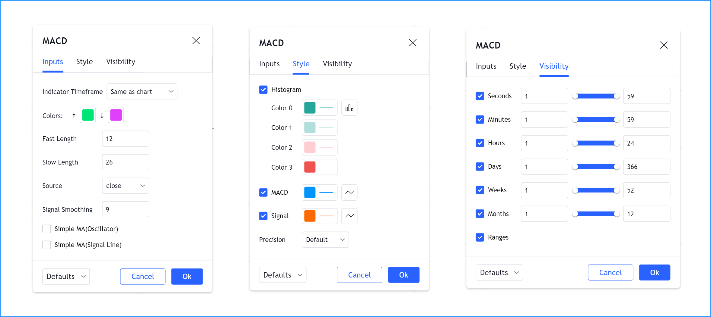

# Inputs (_Entradas_)

Os _Inputs_ ("_Entradas_") permitem que scripts recebam valores que os usuários podem alterar. Usá-las para valores-chave torna os scripts mais adaptáveis às preferências do usuário.

O script a seguir plota uma [média móvel simples (SMA)](https://br.tradingview.com/support/solutions/43000502589) de 20 períodos usando `ta.sma(close, 20)`. Embora seja simples de escrever, não é muito flexível, pois essa MA específica é tudo o que ele sempre plotará:

```c
//@version=5
indicator("MA", "", true)
plot(ta.sma(close, 20))
```

Se, em vez disso, o script for escrito desta maneira, ele se torna muito mais flexível, pois os usuários poderão selecionar a "_source_" ("_fonte_") e a "_length_" ("_comprimento_") que desejam usar para o cálculo da MA:

```c
//@version=5
indicator("MA", "", true)
sourceInput = input(close, "Source")
lengthInput = input(20, "Length")
plot(ta.sma(sourceInput, lengthInput))
```

Entradas só podem ser acessadas quando um script está sendo executado no gráfico. Os usuários do script acessam as entradas através da caixa de diálogo "_Settings_" ("_Configurações_") do script, que pode ser alcançada de uma das seguintes maneiras:

- Com um clique duplo no nome de um indicador no gráfico.
- Clicando com o botão direito do mouse no nome do script e escolhendo o item "_Settings_" ("_Configurações_") no menu suspenso.
- Escolhendo o item "_Settings_" ("_Configurações_") no ícone do menu "_More_" ("_Mais_") (três pontos) que aparece ao passar o cursor sobre o nome do indicador no gráfico.
- Com um clique duplo no nome do indicador na "_Data Window_" ("_Janela de Dados_") (quarto ícone abaixo à direita do gráfico).

A caixa de diálogo "_Settings_" ("_Configurações_") sempre contém as abas "_Style_" ("_Estilo_") e "_Visibility_" ("_Visibilidade_"), que permitem aos usuários especificar suas preferências sobre os visuais do script e os timeframes do gráfico onde ele deve ser visível.

Quando um script contém chamadas para funções `input.*()`, uma aba "_Inputs_" ("_Entradas_") aparece na caixa de diálogo "_Settings_" ("_Configurações_").



No fluxo de execução de um script, as entradas são processadas quando o script já está em um gráfico e um usuário altera valores na aba "_Inputs_" ("_Entradas_"). As mudanças desencadeiam uma reexecução do script em todas as barras do gráfico, então quando um usuário altera um valor de entrada, seu script recalcula usando esse novo valor.


# Funções de Input

As seguintes funções de _input_ (_entrada_) estão disponíveis:

- [input()](https://br.tradingview.com/pine-script-reference/v5/#fun_input)
- [input.int()](https://br.tradingview.com/pine-script-reference/v5/#fun_input{dot}int)
- [input.float()](https://br.tradingview.com/pine-script-reference/v5/#fun_input{dot}float)
- [input.bool()](https://br.tradingview.com/pine-script-reference/v5/#fun_input{dot}bool)
- [input.color()](https://br.tradingview.com/pine-script-reference/v5/#fun_input{dot}color)
- [input.string()](https://br.tradingview.com/pine-script-reference/v5/#fun_input{dot}string)
- [input.timeframe()](https://br.tradingview.com/pine-script-reference/v5/#fun_input{dot}timeframe)
- [input.symbol()](https://br.tradingview.com/pine-script-reference/v5/#fun_input{dot}symbol)
- [input.price()](https://br.tradingview.com/pine-script-reference/v5/#fun_input{dot}price)
- [input.source()](https://br.tradingview.com/pine-script-reference/v5/#fun_input{dot}source)
- [input.session()](https://br.tradingview.com/pine-script-reference/v5/#fun_input{dot}session)
- [input.time()](https://br.tradingview.com/pine-script-reference/v5/#fun_input{dot}time)

Um _widget_ de _entrada_ específico é criado na aba "_Inputs_" ("_Entradas_") para aceitar cada tipo de entrada. A menos que especificado de outra forma na chamada `input.*()`, cada entrada aparece em uma nova linha da aba "_Inputs_" ("_Entradas_"), na ordem em que as chamadas `input.*()` aparecem no script.

É recomendado pelo [Guia de Estilo](./000_style_guide.md) colocar as chamadas `input.*()` no início do script.

As definições das funções de entrada normalmente contêm muitos parâmetros, permitindo controlar o valor padrão das entradas, seus limites e sua organização na aba "_Inputs_" ("_Entradas_").

Uma chamada `input.*()` sendo apenas outra chamada de função no Pine Script, seu resultado pode ser combinado com operadores [aritméticos](./04_05_operadores.md#operadores-aritméticos), [comparação](./04_05_operadores.md#operadores-de-comparação), [lógicos](./04_05_operadores.md#operadores-lógicos) ou [ternários](./04_05_operadores.md#operador-ternário-) para formar uma expressão a ser atribuída à variável. Aqui, o resultado da chamada [input.string()](https://br.tradingview.com/pine-script-reference/v5/#fun_input{dot}string) é comparado à string "`On`". O resultado da expressão é então armazenado na variável `plotDisplayInput`. Como essa variável contém um valor `true` ou `false`, ela é do tipo "input bool":

```c
//@version=5
indicator("Input in an expression`", "", true)
bool plotDisplayInput = input.string("On", "Plot Display", options = ["On", "Off"]) == "On"
plot(plotDisplayInput ? close : na)
```

Todos os valores retornados pelas funções `input.*()`, exceto os de "source", são valores qualificados como "input". Veja a seção sobre [qualificadores de tipo](./04_09_tipagem_do_sistema.md#qualificadores) para mais informações.


# Parâmetros das Funções de Input

Os parâmetros comuns a todas as funções de entrada são: `defval`, `title`, `tooltip`, `inline` e `group`. Alguns parâmetros são usados por outras funções de entrada: `options`, `minval`, `maxval`, `step` e `confirm`.

Todos esses parâmetros esperam argumentos "const" (exceto se for uma entrada usada para uma "source", que retorna um resultado "series float"). Isso significa que devem ser conhecidos no momento da compilação e não podem mudar durante a execução do script. Como o resultado de uma função `input.*()` é sempre qualificado como "input" ou "series", segue-se que o resultado de uma chamada de função `input.*()` não pode ser usado como argumento em uma chamada `input.*()` subsequente porque o qualificador "input" é mais forte que "const".

Revisão de cada parâmetro:

- `defval` é o primeiro parâmetro de todas as funções de entrada. É o valor padrão que aparecerá no widget de entrada. Requer um argumento do tipo de valor de entrada para o qual a função é usada.
- `title` requer um argumento "const string". É o _label_ (_rótulo_) do campo.
- `tooltip` requer um argumento "const string". Quando o parâmetro é usado, um ícone de ponto de interrogação aparecerá à direita do campo. Quando os usuários passarem o cursor sobre ele, o texto do _tooltip_ (_dica de ferramenta_) aparecerá. Note que, se vários campos de entrada forem agrupados em uma linha usando `inline`, o _tooltip_ (_dica de ferramenta_) sempre aparecerá à direita do campo mais à direita e exibirá o texto do último argumento `tooltip` usado na linha. Quebras de linha (`\n`) são suportadas na string do argumento.
- `inline` requer um argumento "const string". Usar o mesmo argumento para o parâmetro em várias chamadas `input.*()` agrupará seus widgets de entrada na mesma linha. Há um limite para a largura que a aba "_Inputs_" pode expandir, então uma quantidade limitada de campos de entrada pode ser ajustada em uma linha. Usar uma chamada `input.*()` com um argumento único para `inline` tem o efeito de trazer o campo de entrada para a esquerda, imediatamente após o _label_, ignorando o alinhamento padrão à esquerda de todos os campos de entrada usado quando nenhum argumento `inline` é usado.
- `group` requer um argumento "const string". É usado para agrupar qualquer número de entradas na mesma seção. A string usada como argumento `group` se torna o título da seção. Todas as chamadas `input.*()` a serem agrupadas devem usar a mesma string para seu argumento de `group`.
- `options` requer uma lista de elementos separados por vírgulas e delimitados por colchetes (por exemplo, `["ON", "OFF"]`). É usado para criar um menu suspenso (_dropdown_) que oferece os elementos da lista na forma de seleções de menu. Apenas um item do menu pode ser selecionado. Quando uma lista de `options` é usada, o valor `defval` deve ser um dos elementos da lista. Quando `options` é usado em funções de entrada que permitem `minval`, `maxval` ou `step`, esses parâmetros não podem ser usados simultaneamente.
- `minval` requer um argumento "const int/float", dependendo do tipo de valor de `defval`. É o valor mínimo válido para o campo de entrada.
- `maxval` requer um argumento "const int/float", dependendo do tipo de valor de `defval`. É o valor máximo válido para o campo de entrada.
- `step` é o incremento pelo qual o valor do campo se moverá quando as setas para cima/baixo do widget forem usadas.
- `confirm` requer um argumento "const bool" (`true` ou `false`). Esse parâmetro afeta o comportamento do script quando ele é adicionado a um gráfico. Chamadas `input.*()` usando `confirm = true` farão com que a aba "_Settings/Inputs_" ("_Configurações/Entradas_") apareça quando o script for adicionado ao gráfico. `confirm` é útil para garantir que os usuários configurem um campo específico.

Os parâmetros `minval`, `maxval` e `step` são somente presentes nas assinaturas das fonções [input.int()](https://br.tradingview.com/pine-script-reference/v5/#fun_input{dot}int) e [input.float()](https://br.tradingview.com/pine-script-reference/v5/#fun_input{dot}float)


# Tipos de Input

As próximas seções explicam o que cada função de entrada faz. No decorrer, serão exploradas as diferentes maneiras de usar as funções de entrada e organizar sua exibição.

## Input Simples

[input()](https://br.tradingview.com/pine-script-reference/v5/#fun_input) é uma função simples e genérica que suporta os tipos fundamentais do Pine Script: "int", "float", "bool", "color" e "string". Ela também suporta entradas "source", que são valores relacionados ao preço, como [close](https://br.tradingview.com/pine-script-reference/v5/#var_close), [hl2](https://br.tradingview.com/pine-script-reference/v5/#hl2), [hlc3](https://br.tradingview.com/pine-script-reference/v5/#var_hlc3) e [hlcc4](https://br.tradingview.com/pine-script-reference/v5/#var_hlcc4), ou que podem ser usadas para receber o valor de saída de outro script.

Sua assinatura é:

```c
input(defval, title, tooltip, inline, group) → input int/float/bool/color/string | series float
```

A função detecta automaticamente o tipo de entrada analisando o tipo do argumento `defval` usado na chamada da função. Este script mostra todos os tipos suportados e o tipo qualificado retornado pela função quando usada com argumentos `defval` de diferentes tipos:

```c
//@version=5
indicator("`input()`", "", true)
a = input(1, "input int")
b = input(1.0, "input float")
c = input(true, "input bool")
d = input(color.orange, "input color")
e = input("1", "input string")
f = input(close, "series float")
plot(na)
```


# Input da Fonte
