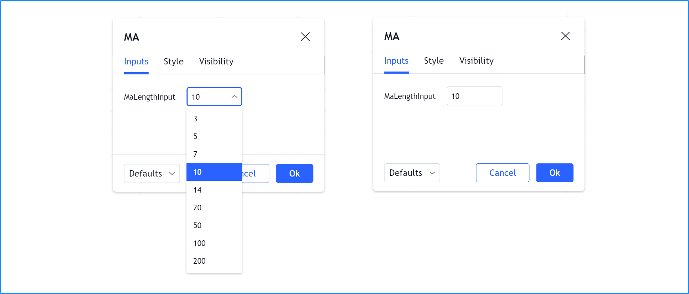
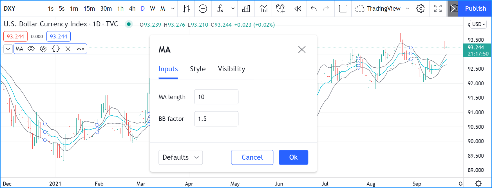
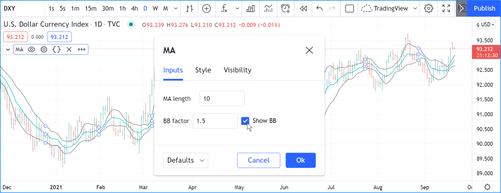
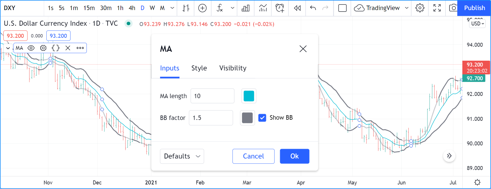
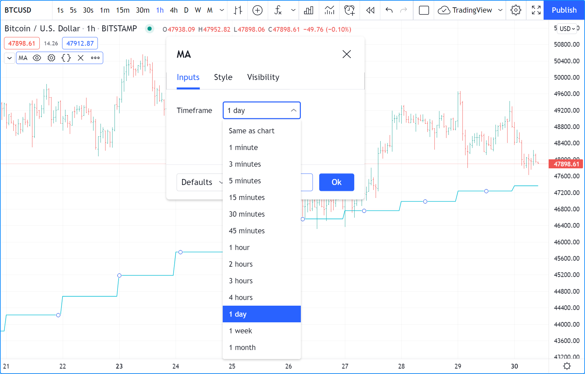
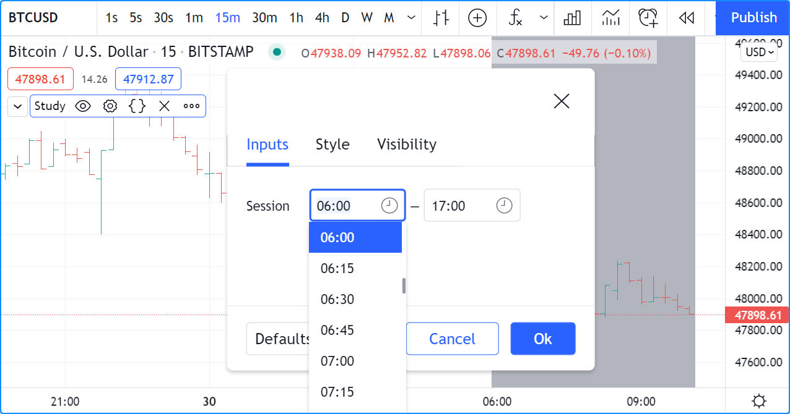
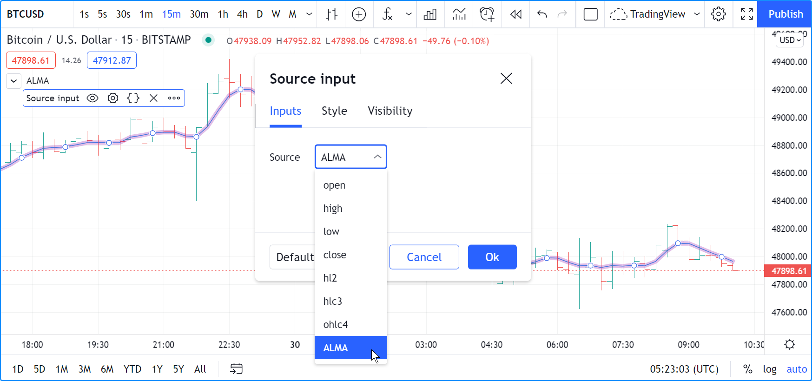

# Inputs (_Entradas_)

Os _Inputs_ ("_Entradas_") permitem que scripts recebam valores que os usuários podem alterar. Usá-las para valores-chave torna os scripts mais adaptáveis às preferências do usuário.

O script a seguir plota uma [média móvel simples (SMA)](https://br.tradingview.com/support/solutions/43000502589) de 20 períodos usando `ta.sma(close, 20)`. Embora seja simples de escrever, não é muito flexível, pois essa MA específica é tudo o que ele sempre plotará:

```c
//@version=5
indicator("MA", "", true)
plot(ta.sma(close, 20))
```

Se, em vez disso, o script for escrito desta maneira, ele se torna muito mais flexível, pois os usuários poderão selecionar a "_source_" ("_fonte_") e a "_length_" ("_comprimento_") que desejam usar para o cálculo da MA:

```c
//@version=5
indicator("MA", "", true)
sourceInput = input(close, "Source")
lengthInput = input(20, "Length")
plot(ta.sma(sourceInput, lengthInput))
```

Entradas só podem ser acessadas quando um script está sendo executado no gráfico. Os usuários do script acessam as entradas através da caixa de diálogo "_Settings_" ("_Configurações_") do script, que pode ser alcançada de uma das seguintes maneiras:

- Com um clique duplo no nome de um indicador no gráfico.
- Clicando com o botão direito do mouse no nome do script e escolhendo o item "_Settings_" ("_Configurações_") no menu suspenso.
- Escolhendo o item "_Settings_" ("_Configurações_") no ícone do menu "_More_" ("_Mais_") (três pontos) que aparece ao passar o cursor sobre o nome do indicador no gráfico.
- Com um clique duplo no nome do indicador na "_Data Window_" ("_Janela de Dados_") (quarto ícone abaixo à direita do gráfico).

A caixa de diálogo "_Settings_" ("_Configurações_") sempre contém as abas "_Style_" ("_Estilo_") e "_Visibility_" ("_Visibilidade_"), que permitem aos usuários especificar suas preferências sobre os visuais do script e os timeframes do gráfico onde ele deve ser visível.

Quando um script contém chamadas para funções `input.*()`, uma aba "_Inputs_" ("_Entradas_") aparece na caixa de diálogo "_Settings_" ("_Configurações_").


No fluxo de execução de um script, as entradas são processadas quando o script já está em um gráfico e um usuário altera valores na aba "_Inputs_" ("_Entradas_"). As mudanças desencadeiam uma reexecução do script em todas as barras do gráfico, então quando um usuário altera um valor de entrada, seu script recalcula usando esse novo valor.


# Funções de Input

As seguintes funções de _input_ (_entrada_) estão disponíveis:

- [input()](https://br.tradingview.com/pine-script-reference/v5/#fun_input)
- [input.int()](https://br.tradingview.com/pine-script-reference/v5/#fun_input{dot}int)
- [input.float()](https://br.tradingview.com/pine-script-reference/v5/#fun_input{dot}float)
- [input.bool()](https://br.tradingview.com/pine-script-reference/v5/#fun_input{dot}bool)
- [input.color()](https://br.tradingview.com/pine-script-reference/v5/#fun_input{dot}color)
- [input.string()](https://br.tradingview.com/pine-script-reference/v5/#fun_input{dot}string)
- [input.timeframe()](https://br.tradingview.com/pine-script-reference/v5/#fun_input{dot}timeframe)
- [input.symbol()](https://br.tradingview.com/pine-script-reference/v5/#fun_input{dot}symbol)
- [input.price()](https://br.tradingview.com/pine-script-reference/v5/#fun_input{dot}price)
- [input.source()](https://br.tradingview.com/pine-script-reference/v5/#fun_input{dot}source)
- [input.session()](https://br.tradingview.com/pine-script-reference/v5/#fun_input{dot}session)
- [input.time()](https://br.tradingview.com/pine-script-reference/v5/#fun_input{dot}time)

Um _widget_ de _entrada_ específico é criado na aba "_Inputs_" ("_Entradas_") para aceitar cada tipo de entrada. A menos que especificado de outra forma na chamada `input.*()`, cada entrada aparece em uma nova linha da aba "_Inputs_" ("_Entradas_"), na ordem em que as chamadas `input.*()` aparecem no script.

É recomendado pelo [Guia de Estilo](./000_style_guide.md) colocar as chamadas `input.*()` no início do script.

As definições das funções de entrada normalmente contêm muitos parâmetros, permitindo controlar o valor padrão das entradas, seus limites e sua organização na aba "_Inputs_" ("_Entradas_").

Uma chamada `input.*()` sendo apenas outra chamada de função no Pine Script, seu resultado pode ser combinado com operadores [aritméticos](./04_05_operadores.md#operadores-aritméticos), [comparação](./04_05_operadores.md#operadores-de-comparação), [lógicos](./04_05_operadores.md#operadores-lógicos) ou [ternários](./04_05_operadores.md#operador-ternário-) para formar uma expressão a ser atribuída à variável. Aqui, o resultado da chamada [input.string()](https://br.tradingview.com/pine-script-reference/v5/#fun_input{dot}string) é comparado à string "`On`". O resultado da expressão é então armazenado na variável `plotDisplayInput`. Como essa variável contém um valor `true` ou `false`, ela é do tipo "input bool":

```c
//@version=5
indicator("Input in an expression`", "", true)
bool plotDisplayInput = input.string("On", "Plot Display", options = ["On", "Off"]) == "On"
plot(plotDisplayInput ? close : na)
```

Todos os valores retornados pelas funções `input.*()`, exceto os de "source", são valores qualificados como "input". Veja a seção sobre [qualificadores de tipo](./04_09_tipagem_do_sistema.md#qualificadores) para mais informações.


# Parâmetros das Funções de Input

Os parâmetros comuns a todas as funções de entrada são: `defval`, `title`, `tooltip`, `inline` e `group`. Alguns parâmetros são usados por outras funções de entrada: `options`, `minval`, `maxval`, `step` e `confirm`.

Todos esses parâmetros esperam argumentos "const" (exceto se for uma entrada usada para uma "source", que retorna um resultado "series float"). Isso significa que devem ser conhecidos no momento da compilação e não podem mudar durante a execução do script. Como o resultado de uma função `input.*()` é sempre qualificado como "input" ou "series", segue-se que o resultado de uma chamada de função `input.*()` não pode ser usado como argumento em uma chamada `input.*()` subsequente porque o qualificador "input" é mais forte que "const".

Revisão de cada parâmetro:

- `defval` é o primeiro parâmetro de todas as funções de entrada. É o valor padrão que aparecerá no widget de entrada. Requer um argumento do tipo de valor de entrada para o qual a função é usada.
- `title` requer um argumento "const string". É o _label_ (_rótulo_) do campo.
- `tooltip` requer um argumento "const string". Quando o parâmetro é usado, um ícone de ponto de interrogação aparecerá à direita do campo. Quando os usuários passarem o cursor sobre ele, o texto do _tooltip_ (_dica de ferramenta_) aparecerá. Note que, se vários campos de entrada forem agrupados em uma linha usando `inline`, o _tooltip_ (_dica de ferramenta_) sempre aparecerá à direita do campo mais à direita e exibirá o texto do último argumento `tooltip` usado na linha. Quebras de linha (`\n`) são suportadas na string do argumento.
- `inline` requer um argumento "const string". Usar o mesmo argumento para o parâmetro em várias chamadas `input.*()` agrupará seus widgets de entrada na mesma linha. Há um limite para a largura que a aba "_Inputs_" pode expandir, então uma quantidade limitada de campos de entrada pode ser ajustada em uma linha. Usar uma chamada `input.*()` com um argumento único para `inline` tem o efeito de trazer o campo de entrada para a esquerda, imediatamente após o _label_, ignorando o alinhamento padrão à esquerda de todos os campos de entrada usado quando nenhum argumento `inline` é usado.
- `group` requer um argumento "const string". É usado para agrupar qualquer número de entradas na mesma seção. A string usada como argumento `group` se torna o título da seção. Todas as chamadas `input.*()` a serem agrupadas devem usar a mesma string para seu argumento de `group`.
- `options` requer uma lista de elementos separados por vírgulas e delimitados por colchetes (por exemplo, `["ON", "OFF"]`). É usado para criar um menu suspenso (_dropdown_) que oferece os elementos da lista na forma de seleções de menu. Apenas um item do menu pode ser selecionado. Quando uma lista de `options` é usada, o valor `defval` deve ser um dos elementos da lista. Quando `options` é usado em funções de entrada que permitem `minval`, `maxval` ou `step`, esses parâmetros não podem ser usados simultaneamente.
- `minval` requer um argumento "const int/float", dependendo do tipo de valor de `defval`. É o valor mínimo válido para o campo de entrada.
- `maxval` requer um argumento "const int/float", dependendo do tipo de valor de `defval`. É o valor máximo válido para o campo de entrada.
- `step` é o incremento pelo qual o valor do campo se moverá quando as setas para cima/baixo do widget forem usadas.
- `confirm` requer um argumento "const bool" (`true` ou `false`). Esse parâmetro afeta o comportamento do script quando ele é adicionado a um gráfico. Chamadas `input.*()` usando `confirm = true` farão com que a aba "_Settings/Inputs_" ("_Configurações/Entradas_") apareça quando o script for adicionado ao gráfico. `confirm` é útil para garantir que os usuários configurem um campo específico.

Os parâmetros `minval`, `maxval` e `step` são somente presentes nas assinaturas das fonções [input.int()](https://br.tradingview.com/pine-script-reference/v5/#fun_input{dot}int) e [input.float()](https://br.tradingview.com/pine-script-reference/v5/#fun_input{dot}float)


# Tipos de Input

As próximas seções explicam o que cada função de entrada faz. No decorrer, serão exploradas as diferentes maneiras de usar as funções de entrada e organizar sua exibição.

## Input Simples

[input()](https://br.tradingview.com/pine-script-reference/v5/#fun_input) é uma função simples e genérica que suporta os tipos fundamentais do Pine Script: "int", "float", "bool", "color" e "string". Ela também suporta entradas "source", que são valores relacionados ao preço, como [close](https://br.tradingview.com/pine-script-reference/v5/#var_close), [hl2](https://br.tradingview.com/pine-script-reference/v5/#hl2), [hlc3](https://br.tradingview.com/pine-script-reference/v5/#var_hlc3) e [hlcc4](https://br.tradingview.com/pine-script-reference/v5/#var_hlcc4), ou que podem ser usadas para receber o valor de saída de outro script.

Sua assinatura é:

```c
input(defval, title, tooltip, inline, group) → input int/float/bool/color/string | series float
```

A função detecta automaticamente o tipo de entrada analisando o tipo do argumento `defval` usado na chamada da função. Este script mostra todos os tipos suportados e o tipo qualificado retornado pela função quando usada com argumentos `defval` de diferentes tipos:

```c
//@version=5
indicator("`input()`", "", true)
a = input(1, "input int")
b = input(1.0, "input float")
c = input(true, "input bool")
d = input(color.orange, "input color")
e = input("1", "input string")
f = input(close, "series float")
plot(na)
```

## Input Integer

Existem duas assinaturas para a função [input.int()](https://br.tradingview.com/pine-script-reference/v5/#fun_input{dot}int); uma quando `options` não é usada e outra quando é usada:

```c
input.int(defval, title, minval, maxval, step, tooltip, inline, group, confirm) → input int
input.int(defval, title, options, tooltip, inline, group, confirm) → input int
```

Esta chamada usa o parâmetro `options` para propor uma lista predefinida de comprimentos para a MA:

```c
//@version=5
indicator("MA", "", true)
maLengthInput = input.int(10, options = [3, 5, 7, 10, 14, 20, 50, 100, 200])
ma = ta.sma(close, maLengthInput)
plot(ma)
```

Esta usa o parâmetro `minval` para limitar o _length_ (_comprimento_):

```c
//@version=5
indicator("MA", "", true)
maLengthInput = input.int(10, minval = 2)
ma = ta.sma(close, maLengthInput)
plot(ma)
```

A versão com a lista `options` usa um menu suspenso para seu widget. Quando o parâmetro `options` não é usado, um widget de entrada simples é usado para inserir o valor.



## Input Float

Existem duas assinaturas para a função [input.float()](https://br.tradingview.com/pine-script-reference/v5/#fun_input{dot}float); uma quando `options` não é usada e outra quando é usada:

```c
input.float(defval, title, minval, maxval, step, tooltip, inline, group, confirm) → input int
input.float(defval, title, options, tooltip, inline, group, confirm) → input int
```

Aqui, uma entrada "float" é usada para o fator multiplicador do desvio padrão, para calcular as Bandas de Bollinger:

```c
//@version=5
indicator("MA", "", true)
maLengthInput = input.int(10, minval = 1)
bbFactorInput = input.float(1.5, minval = 0, step = 0.5)
ma      = ta.sma(close, maLengthInput)
bbWidth = ta.stdev(ma, maLengthInput) * bbFactorInput
bbHi    = ma + bbWidth
bbLo    = ma - bbWidth
plot(ma)
plot(bbHi, "BB Hi", color.gray)
plot(bbLo, "BB Lo", color.gray)
```

Os widgets de entrada para floats são semelhantes aos usados para entradas inteiras.



## Input Boolean

Continuando a desenvolver o script, desta vez adicionando uma entrada booleana para permitir que os usuários alternem a exibição das BBs:

```c
//@version=5
indicator("MA", "", true)
maLengthInput = input.int(10,    "MA length", minval = 1)
bbFactorInput = input.float(1.5, "BB factor", inline = "01", minval = 0, step = 0.5)
showBBInput   = input.bool(true, "Show BB",   inline = "01")
ma      = ta.sma(close, maLengthInput)
bbWidth = ta.stdev(ma, maLengthInput) * bbFactorInput
bbHi    = ma + bbWidth
bbLo    = ma - bbWidth
plot(ma, "MA", color.aqua)
plot(showBBInput ? bbHi : na, "BB Hi", color.gray)
plot(showBBInput ? bbLo : na, "BB Lo", color.gray)
```

Observe que:

- Foi adicionada uma entrada usando [input.bool()](https://br.tradingview.com/pine-script-reference/v5/#fun_input{dot}bool) para definir o valor de `showBBInput`.
- O parâmetro `inline` foi usado nessa entrada e na de `bbFactorInput` para colocá-las na mesma linha. O argumento `"01"` foi usado em ambos os casos. É assim que o compilador do Pine Script reconhece que elas pertencem à mesma linha. A string específica usada como argumento não é importante e não aparece em nenhum lugar na aba "_Inputs_" ("_Entradas_"); é usada apenas para identificar quais entradas vão na mesma linha.
- Os argumentos `title` das chamadas `input.*()` foram alinhados verticalmente para facilitar a leitura.
- A variável `showBBInput` é usada nas duas chamadas [plot()](https://br.tradingview.com/pine-script-reference/v5/#fun_plot) para plotar condicionalmente. Quando o usuário desmarca a caixa de seleção da entrada `showBBInput`, o valor da variável se torna `false`. Quando isso acontece, as chamadas [plot()](https://br.tradingview.com/pine-script-reference/v5/#fun_plot) plotam o valor [na](https://br.tradingview.com/pine-script-reference/v5/#var_na), que não exibe nada. O valor padrão da entrada é `true`, então as BBs são plotadas por padrão.
- Como o parâmetro `inline` é usado para a variável `bbFactorInput`, seu campo de entrada na aba "_Inputs_" ("_Entradas_") não se alinha verticalmente com o de `maLengthInput`, em que não usa `inline`.



## Input Color

Como explicado na seção seleção de cores através das configurações do script da página "[Cores](./05_07_cores.md)", as seleções de cores que geralmente aparecem na aba "_Settings_/_Style_" ("_Configurações_/_Estilo_") nem sempre estão disponíveis. Quando isso ocorre, os usuários do script não terão meios de alterar as cores usadas pelo seu script. Para esses casos, é essencial fornecer entradas de cor se for desejado que as cores do script sejam modificáveis através das "Configurações" do script. Em vez de usar a aba "_Settings_/_Style_" ("_Configurações_/_Estilo_") para alterar cores, os usuários do script poderão alterar as cores usando chamadas para [input.color()](https://br.tradingview.com/pine-script-reference/v5/#fun_input{dot}color).

Suponha que seja necessário plotar as BBs em um tom mais claro quando os valores [high](https://br.tradingview.com/pine-script-reference/v5/#var_high) e [low](https://br.tradingview.com/pine-script-reference/v5/#var_low) forem maiores/menores do que as BBs.

Poderia-se usar um código como este para criar as cores:

```c
bbHiColor = color.new(color.gray, high > bbHi ? 60 : 0)
bbLoColor = color.new(color.gray, low  < bbLo ? 60 : 0)
```

Quando componentes de cor dinâmicos (ou "series"), como a transparência aqui, são usados, os widgets de cor na aba "Configurações/Estilo" não aparecerão mais. Criando-se os próprios widgets, eles aparecerão na aba "Entradas":

```c
//@version=5
indicator("MA", "", true)
maLengthInput = input.int(10,           "MA length", inline = "01", minval = 1)
maColorInput  = input.color(color.aqua, "",          inline = "01")
bbFactorInput = input.float(1.5,        "BB factor", inline = "02", minval = 0, step = 0.5)
bbColorInput  = input.color(color.gray, "",          inline = "02")
showBBInput   = input.bool(true,        "Show BB",   inline = "02")
ma      = ta.sma(close, maLengthInput)
bbWidth = ta.stdev(ma, maLengthInput) * bbFactorInput
bbHi    = ma + bbWidth
bbLo    = ma - bbWidth
bbHiColor = color.new(bbColorInput, high > bbHi ? 60 : 0)
bbLoColor = color.new(bbColorInput, low  < bbLo ? 60 : 0)
plot(ma, "MA", maColorInput)
plot(showBBInput ? bbHi : na, "BB Hi", bbHiColor, 2)
plot(showBBInput ? bbLo : na, "BB Lo", bbLoColor, 2)
```

Observe que:

- Foram adicionadas duas chamadas para input.color() para obter os valores das variáveis maColorInput e bbColorInput. maColorInput é usado diretamente na chamada plot(ma, "MA", maColorInput), e bbColorInput é usado para construir as variáveis bbHiColor e bbLoColor, que modulam a transparência usando a posição do preço em relação às BBs. Um valor condicional é usado para o valor de transp na chamada color.new(), para gerar diferentes transparências da mesma cor base.
- Não é usado um argumento title para as novas entradas de cor porque elas estão na mesma linha que outras entradas, permitindo que os usuários entendam a quais plots se aplicam.
- Os argumentos inline foram reorganizados para refletir o fato de que as entradas estão agrupadas em duas linhas distintas.



## Input Timeframe

Entradas de timeframe podem ser úteis quando se deseja em poder alterar o timeframe usado para calcular valores em seus scripts.

Eliminando as BBs das seções anteriores e adicionando uma entrada de timeframe a um script simples de MA:

```c
//@version=5
indicator("MA", "", true)
tfInput = input.timeframe("D", "Timeframe")
ma = ta.sma(close, 20)
securityNoRepaint(sym, tf, src) =>
    request.security(sym, tf, src[barstate.isrealtime ? 1 : 0])[barstate.isrealtime ? 0 : 1]
maHTF = securityNoRepaint(syminfo.tickerid, tfInput, ma)
plot(maHTF, "MA", color.aqua)
```

Observe que:

- A função [input.timeframe()](https://br.tradingview.com/pine-script-reference/v5/#fun_input{dot}timeframe) é usada para receber a entrada de timeframe.
- A função cria um widget do menu suspenso onde alguns timeframes padrão são propostos. A lista de timeframes também inclui qualquer timeframe que tenha sido favoritado na interface do usuário do gráfico.
- `tfInput` é usado na chamada [request.security()](https://br.tradingview.com/pine-script-reference/v5/#fun_request{dot}security). Também é usado `gaps = barmerge.gaps_on` na chamada, para que a função só retorne dados quando o timeframe superior for completado.



## Input Symbol

A função [input.symbol()](https://br.tradingview.com/pine-script-reference/v5/#fun_input{dot}symbol) cria um widget que permite aos usuários pesquisar e selecionar símbolos, assim como fariam na interface do usuário do gráfico.

Adicionando uma entrada de símbolo ao script:

```c
//@version=5
indicator("MA", "", true)
tfInput = input.timeframe("D", "Timeframe")
symbolInput = input.symbol("", "Symbol")
ma = ta.sma(close, 20)
securityNoRepaint(sym, tf, src) =>
    request.security(sym, tf, src[barstate.isrealtime ? 1 : 0])[barstate.isrealtime ? 0 : 1]
maHTF = securityNoRepaint(symbolInput, tfInput, ma)
plot(maHTF, "MA", color.aqua)
```

Observe que:

- O argumento `defval` usado é uma string vazia. Isso faz com que [request.security()](https://br.tradingview.com/pine-script-reference/v5/#fun_request{dot}security), onde a variável `symbolInput` contendo essa entrada é usada, para utilizar o símbolo do gráfico por padrão. Se o usuário selecionar outro símbolo e quiser retornar ao valor padrão usando o símbolo do gráfico, ele precisará usar a seleção "_Reset Settings_" ("_Redefinir Configurações_") do menu "_Defaults_" ("_Padrões_") da aba "_Inputs_" ("_Entradas_").
- A função definida pelo usuário `securityNoRepaint()` é usada para [request.security()](https://br.tradingview.com/pine-script-reference/v5/#fun_request{dot}security) de maneira que não cause repaint; ela só retorna valores quando o timeframe superior é completado.

## Input Session

Entradas de sessão são úteis para coletar valores de início e término para períodos de tempo. A função incorporada [input.session()](https://br.tradingview.com/pine-script-reference/v5/#fun_input{dot}session) cria um widget de entrada permitindo que os usuários especifiquem o início e o fim de uma sessão. As seleções podem ser feitas usando um menu suspenso ou inserindo valores de tempo no formato "hh:mm".

O valor retornado por [input.session()](https://br.tradingview.com/pine-script-reference/v5/#fun_input{dot}session) é uma string válida no formato de sessão. Veja a página do manual sobre [sessões](./05_17_sessoes.md) para maiores informações.

As informações de sessão também podem conter informações sobre os dias em que a sessão é válida. Aqui, a chamada da função [input.string()](https://br.tradingview.com/pine-script-reference/v5/#fun_input{dot}string) é usada para inserir essas informações de dias:

```c
//@version=5
indicator("Session input", "", true)
string sessionInput = input.session("0600-1700", "Session")
string daysInput = input.string("1234567", tooltip = "1 = Sunday, 7 = Saturday")
sessionString = sessionInput + ":" + daysInput
inSession = not na(time(timeframe.period, sessionString))
bgcolor(inSession ? color.silver : na)
```

Observe que:

- Este script propõe uma sessão padrão de "0600-1700".
- A chamada [input.string()](https://br.tradingview.com/pine-script-reference/v5/#fun_input{dot}string) usa uma dica de ferramenta para fornecer aos usuários ajuda sobre o formato a ser usado para inserir informações de dias.
- Uma string de sessão completa é construída concatenando as duas strings que o script recebe como entradas.
- O tipo das duas entradas é explicitamente declarado com a palavra-chave [string](https://br.tradingview.com/pine-script-reference/v5/#type_string) para deixar claro que essas variáveis conterão uma string.
- É detectado se a barra do gráfico está na sessão definida pelo usuário chamando [time()](https://br.tradingview.com/pine-script-reference/v5/#fun_time) com a string da sessão. Se o valor de [time](https://br.tradingview.com/pine-script-reference/v5/#var_time) da barra atual (o tempo no [open](https://br.tradingview.com/pine-script-reference/v5/#var_open) da barra) não estiver na sessão, [time()](https://br.tradingview.com/pine-script-reference/v5/#fun_time) retorna [na](https://br.tradingview.com/pine-script-reference/v5/#var_na), então `inSession` será verdadeiro sempre que [time()](https://br.tradingview.com/pine-script-reference/v5/#fun_time) retornar um valor que não seja [na](https://br.tradingview.com/pine-script-reference/v5/#var_na).



## Input Source

Entradas da fonte, [input.source()](https://br.tradingview.com/pine-script-reference/v5/#fun_input.source), são úteis para fornecer uma seleção de dois tipos de fontes:

- Valores de preço, a saber: [open](https://br.tradingview.com/pine-script-reference/v5/#var_open), [high](https://br.tradingview.com/pine-script-reference/v5/#var_high), [low](https://br.tradingview.com/pine-script-reference/v5/#var_low), [close](https://br.tradingview.com/pine-script-reference/v5/#var_close), [hl2](https://br.tradingview.com/pine-script-reference/v5/#var_hl2), [hlc3](https://br.tradingview.com/pine-script-reference/v5/#var_hlc3) e [ohlc4](https://br.tradingview.com/pine-script-reference/v5/#var_ohlc4).
- Os valores plotados por outros scripts no gráfico. Isso pode ser útil para "_link_" ("_vincular_") dois ou mais scripts juntos, enviando a saída de um como entrada para outro script.

Este script simplesmente plota a seleção da fonte do usuário. Propõe-se o valor [high](https://br.tradingview.com/pine-script-reference/v5/#var_high) como padrão:

```c
//@version=5
indicator("Source input", "", true)
srcInput = input.source(high, "Source")
plot(srcInput, "Src", color.new(color.purple, 70), 6)
```

Isso mostra um gráfico onde, além do script, foi carregado um indicador "Arnaud Legoux Moving Average". Veja aqui como o widget de entrada da fonte do script é usado para selecionar a saída do script ALMA como entrada no script. Como script plota essa fonte em uma linha grossa de cor roxo claro, é possível ver os plots dos dois scripts sobrepostos porque eles plotam o mesmo valor:



## Input Time

Entradas de tempo usam a função [input.time()](https://br.tradingview.com/pine-script-reference/v5/#fun_input{dot}time). A função retorna um horário Unix em milissegundos (veja a página [Tempo](./05_21_time.md) para mais informações). Esse tipo de dado também contém informações de data, então a função [input.time()](https://br.tradingview.com/pine-script-reference/v5/#fun_input{dot}time) _retorna um horário __e__ uma data_. Por isso, seu widget permite a seleção de ambos.

Aqui, o tempo da barra é testado contra um valor de entrada, e uma seta é plotada quando o tempo é maior:

```c
//@version=5
indicator("Time input", "T", true)
timeAndDateInput = input.time(timestamp("1 Aug 2021 00:00 +0300"), "Date and time")
barIsLater = time > timeAndDateInput
plotchar(barIsLater, "barIsLater", "🠆", location.top, size = size.tiny)
```

Observe que o valor `defval` usado é uma chamada para a função [timestamp()](https://br.tradingview.com/pine-script-reference/v5/#fun_timestamp).
