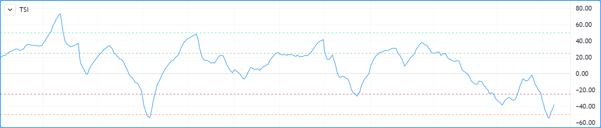
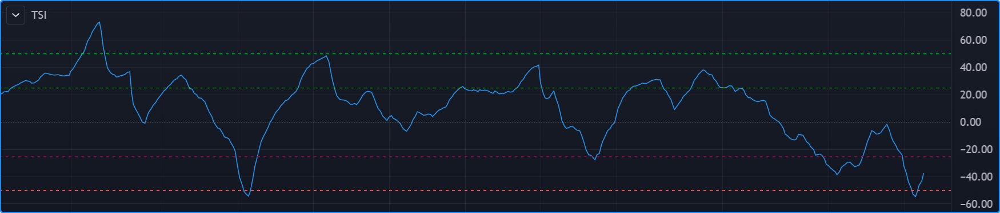

# Levels (_Níveis_)

# Níveis `hline()`

Níveis são linhas plotadas usando a função [hline()](https://br.tradingview.com/pine-script-reference/v5/#fun_hline). Ela é projetada para plotar níveis __horizontais__ usando uma __única cor__, ou seja, a cor não muda em diferentes barras. Veja a seção [Níveis](./05_15_plots.md#levels-níveis) da página sobre [plot()](https://br.tradingview.com/pine-script-reference/v5/#plot) para maneiras alternativas de plotar níveis quando [hline()](https://br.tradingview.com/pine-script-reference/v5/#fun_hline) não faz o que é necessário.

A função tem a seguinte assinatura:

```c
hline(price, title, color, linestyle, linewidth, editable) → hline
```

[hline()](https://br.tradingview.com/pine-script-reference/v5/#fun_hline) tem algumas restrições quando comparada a [plot()](https://br.tradingview.com/pine-script-reference/v5/#fun_plot):

- Como o objetivo da função é plotar linhas horizontais, seu parâmetro de `price` requer um argumento "input int/float", o que significa que valores "series float", como [close](https://br.tradingview.com/pine-script-reference/v5/#var_close) ou valores calculados dinamicamente, não podem ser usados.
- Seu parâmetro de `color` requer um argumento "input int", o que impede o uso de cores dinâmicas, ou seja, cores calculadas em cada barra — ou valores "series color".
- Três estilos de linha diferentes são suportados através do parâmetro `linestyle`: `hline.style_solid`, `hline.style_dotted` e `hline.style_dashed`.

Veja [hline()](https://br.tradingview.com/pine-script-reference/v5/#fun_hline) em ação no indicador "True Strength Index":

```c
//@version=5
indicator("TSI")
myTSI = 100 * ta.tsi(close, 25, 13)

hline( 50, "+50",  color.lime)
hline( 25, "+25",  color.green)
hline(  0, "Zero", color.gray, linestyle = hline.style_dotted)
hline(-25, "-25",  color.maroon)
hline(-50, "-50",  color.red)

plot(myTSI)
```





Observe que:

- Cinco níveis são exibidos, cada um de uma cor diferente.
- Um estilo de linha diferente é usado para a linha central zero.
- Cores são escolhidas para funcionar bem tanto em temas claros quanto escuros.
- O intervalo usual para os valores do indicador é de __+100__ a __-100__. Como a função embutida [ta.tsi()](https://br.tradingview.com/pine-script-reference/v5/#fun_ta{dot}tsi) retorna valores na faixa de __+1__ a __-1__, o ajuste é feito no código.
