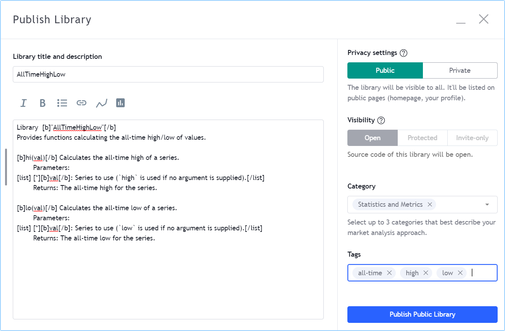

# Libraries (_Bibliotecas_)

As bibliotecas Pine Script são publicações que contêm funções que podem ser reutilizadas em indicadores, estratégias ou em outras bibliotecas. Elas são úteis para definir funções frequentemente usadas, de modo que seu "_open source_" ("_código fonte_") não precise ser incluído em todos os scripts onde são necessárias.

Uma biblioteca deve ser publicada (privadamente ou publicamente) antes de poder ser usada em outro script. Todas as bibliotecas são publicadas como código aberto. Scripts públicos só podem usar bibliotecas públicas e devem ser de código aberto. Scripts privados ou scripts pessoais salvos no Editor Pine Script podem usar bibliotecas públicas ou privadas. Uma biblioteca pode usar outras bibliotecas, ou até mesmo versões anteriores de si mesma.

Programadores de bibliotecas devem estar familiarizados com a nomenclatura de tipagem do Pine Script, escopos e funções definidas pelo usuário. Se for necessário revisar os tipos qualificados, veja a página sobre o [sistema de tipos](./04_09_tipagem_do_sistema.md). Para mais informações sobre funções definidas pelo usuário e escopos, veja a página [Funções Definidas pelo Usuário](./04_11_funcoes_definidas_pelo_usuario.md).

Você pode navegar pelos scripts de biblioteca publicados publicamente por membros na seção [Scripts da Comunidade](https://br.tradingview.com/scripts/?script_type=libraries) do TradingView.


# Criando uma Biblioteca

Uma biblioteca é um tipo especial de script que começa com a declaração [library()](https://br.tradingview.com/pine-script-reference/v5/#fun_library), em vez de [indicator()](https://br.tradingview.com/pine-script-reference/v5/#fun_indicator) ou [strategy()](https://br.tradingview.com/pine-script-reference/v5/#fun_strategy). Uma biblioteca contém definições de funções exportáveis, que constituem a única parte visível da biblioteca quando é usada por outro script. Bibliotecas também podem usar outro código Pine Script em seu escopo global, como um indicador normal. Esse código geralmente serve para demonstrar como usar as funções da biblioteca.

Um script de biblioteca tem a seguinte estrutura, onde uma ou mais funções exportáveis devem ser definidas:

```c
//@version=5

// @description <library_description>
library(title, overlay)

<script_code>

// @function <function_description>
// @param <parameter> <parameter_description>
// @returns <return_value_description>
export <function_name>([simple/series] <parameter_type> <parameter_name> [= <default_value>] [, ...]) =>
    <function_code>

<script_code>
```

__Note que:__

- As [anotações do compilador](./04_03_estrutura_do_script.md#anotações-do-compilador) `// @description`, `// @function`, `// @param` e `// @returns` são opcionais, mas é altamente recomendável usá-las. Elas têm um duplo propósito: documentar o código da biblioteca e preencher a descrição padrão da biblioteca que os autores podem usar ao publicar a biblioteca.
- A palavra-chave [`export`](https://br.tradingview.com/pine-script-reference/v5/#kw_export) é obrigatória.
- `<parameter_type>` é obrigatório, ao contrário das definições de parâmetros de funções definidas pelo usuário em indicadores ou estratégias, que são sem tipo.
- `<script_code>` pode ser qualquer código que normalmente seria usado em um indicador, incluindo entradas ou plots.

Este é um exemplo de biblioteca:

```c
//@version=5

// @description Provides functions calculating the all-time high/low of values.
library("AllTimeHighLow", true)

// @function Calculates the all-time high of a series.
// @param val Series to use (`high` is used if no argument is supplied).
// @returns The all-time high for the series.
export hi(float val = high) =>
    var float ath = val
    ath := math.max(ath, val)

// @function Calculates the all-time low of a series.
// @param val Series to use (`low` is used if no argument is supplied).
// @returns The all-time low for the series.
export lo(float val = low) =>
    var float atl = val
    atl := math.min(atl, val)

plot(hi())
plot(lo())
```

## Funções de Biblioteca

As definições de funções em bibliotecas são um pouco diferentes das funções definidas pelo usuário em indicadores e estratégias. Existem restrições quanto ao que pode ser incluído no corpo das funções de biblioteca.

Nas assinaturas de funções de biblioteca (sua primeira linha):

- A palavra-chave [export](https://br.tradingview.com/pine-script-reference/v5/#kw_export) é obrigatória.
- O tipo de argumento esperado para cada parâmetro deve ser explicitamente mencionado.
- Uma palavra-chave [simple](https://br.tradingview.com/pine-script-reference/v5/#type_simple) ou [series](https://br.tradingview.com/pine-script-reference/v5/#type_series) pode restringir os tipos qualificados permitidos para os argumentos (a próxima seção explica seu uso).

Estas são as restrições impostas às funções de biblioteca:

- Elas não podem usar variáveis do escopo global da biblioteca, a menos que sejam qualificadas como "const". Isso significa que não se pode usar variáveis globais inicializadas a partir de entradas de script, por exemplo, ou arrays declarados globalmente.
- Chamadas `request.*()` não são permitidas.
- Chamadas `input.*()` não são permitidas.
- Chamadas `plot*()`, `fill()` e `bgcolor()` não são permitidas.

As funções de biblioteca sempre retornam um resultado qualificado como "simple" ou "series". Elas não podem ser usadas onde são necessários valores qualificados como "const" ou "input", como é o caso de algumas funções embutidas. Por exemplo, uma função de biblioteca não pode ser usada para calcular um argumento para o parâmetro `show_last` em uma chamada [plot()](https://br.tradingview.com/pine-script-reference/v5/#fun_plot) porque ele requer um valor "input int".

## Controle de Tipo Qualificado

Os tipos qualificados de argumentos fornecidos em chamadas para funções de biblioteca são autodetectados com base em como cada argumento é usado dentro da função. Se o argumento pode ser usado como "series", então é qualificado como tal. Se não puder, uma tentativa é feita com o qualificador de tipo "simple". Isso explica por que este código:

```c
export myEma(int x) =>
    ta.ema(close, x)
```

Funcionará quando chamado usando `myCustomLibrary.myEma(20)`, mesmo que o parâmetro `length` de [ta.ema()](https://br.tradingview.com/pine-script-reference/v5/#fun_ta{dot}ema) exija um argumento "simple int". Quando o compilador Pine Script detecta que um comprimento "series" não pode ser usado com [ta.ema()](https://br.tradingview.com/pine-script-reference/v5/#fun_ta{dot}ema), ele tenta o qualificador "simple", que neste caso é permitido.

Embora funções de biblioteca não possam retornar valores "const" ou "input", elas podem ser escritas para produzir resultados "simple". Isso as torna úteis em mais contextos do que funções que retornam resultados "series", já que algumas funções embutidas não permitem argumentos "series". Por exemplo, [request.security()](https://br.tradingview.com/pine-script-reference/v5/#fun_request{dot}security) requer uma "simple string" para seu parâmetro `symbol`. Se uma função de biblioteca fosse escrita para montar o argumento para `symbol` da seguinte maneira, o resultado da função não funcionaria porque é do tipo qualificado "series string":

```c
export makeTickerid(string prefix, string ticker) =>
    prefix + ":" + ticker
```

No entanto, restringindo os qualificadores de parâmetro para "simple", é possível forçar a função a produzir um resultado "simple". Isso pode ser alcançado prefixando o tipo dos parâmetros com a palavra-chave [simple](https://br.tradingview.com/pine-script-reference/v5/#type_simple):

```c
export makeTickerid(simple string prefix, simple string ticker) =>
    prefix + ":" + ticker
```

Observe que para a função retornar um valor "simple", nenhum valor "series" pode ser usado em seu cálculo; caso contrário, o resultado será um valor "series".

Também é possível usar a palavra-chave [series](https://br.tradingview.com/pine-script-reference/v5/#type_series) para prefixar o tipo de um parâmetro de função de biblioteca. No entanto, como os argumentos são qualificados como "series" por padrão, usar o modificador [series](https://br.tradingview.com/pine-script-reference/v5/#type_series) é redundante.

## Tipos e Objetos Definidos pelo Usuário

É possível exportar [tipos definidos pelo usuário (UDTs)](./04_09_tipagem_do_sistema.md#tipos-definidos-pelo-usuário) de bibliotecas, e as funções de biblioteca podem retornar [objetos](./04_12_objetos.md).

Para exportar um _UDT_, prefixe sua definição com a palavra-chave [export](https://br.tradingview.com/pine-script-reference/v5/#kw_export), da mesma forma que exportaria uma função:

```c
//@version=5
library("Point")

export type point
    int x
    float y
    bool isHi
    bool wasBreached = false
```

Um script importando essa biblioteca e criando um objeto a partir do seu _UDT_ `point` seria algo assim:

```c
//@version=5
indicator("")
import userName/Point/1 as pt
newPoint = pt.point.new()
```

__Note que:__

- Este código não será compilado porque nenhuma biblioteca "Point" foi publicada, e o script nada exibe.
- `userName` precisaria ser substituído pelo nome de usuário do TradingView do publicador da biblioteca.
- O método embutido `new()` é usado para criar um objeto a partir do _UDT_ `point`.
- A referência ao _UDT_ `point` da biblioteca é prefixada com o alias `pt` definido na declaração [import](https://br.tradingview.com/pine-script-reference/v5/#kw_import), assim como seria feito ao usar uma função de uma biblioteca importada.

_UDTs_ usados em uma biblioteca __devem__ ser exportados se alguma de suas funções exportadas usar um parâmetro ou retornar um resultado desse tipo definido pelo usuário.

Quando uma biblioteca usa um _UDT_ apenas internamente, não é necessário exportá-lo. A biblioteca a seguir usa o _UDT_ `point` internamente, mas apenas sua função `drawPivots()` é exportada, que não usa um parâmetro nem retorna um resultado do tipo `point`:

```c
//@version=5
library("PivotLabels", true)

// We use this `point` UDT in the library, but it does NOT require exporting because:
//   1. The exported function's parameters do not use the UDT.
//   2. The exported function does not return a UDT result.
type point
    int x
    float y
    bool isHi
    bool wasBreached = false


fillPivotsArray(qtyLabels, leftLegs, rightLegs) =>
    // Create an array of the specified qty of pivots to maintain.
    var pivotsArray = array.new<point>(math.max(qtyLabels, 0))

    // Detect pivots.
    float pivotHi = ta.pivothigh(leftLegs, rightLegs)
    float pivotLo = ta.pivotlow(leftLegs, rightLegs)

    // Create a new `point` object when a pivot is found.
    point foundPoint = switch
        pivotHi => point.new(time[rightLegs], pivotHi, true)
        pivotLo => point.new(time[rightLegs], pivotLo, false)
        => na

    // Add new pivot info to the array and remove the oldest pivot.
    if not na(foundPoint)
        array.push(pivotsArray, foundPoint)
        array.shift(pivotsArray)

    array<point> result = pivotsArray


detectBreaches(pivotsArray) =>
    // Detect breaches.
    for [i, eachPoint] in pivotsArray
        if not na(eachPoint)
            if not eachPoint.wasBreached
                bool hiWasBreached =     eachPoint.isHi and high[1] <= eachPoint.y and high > eachPoint.y
                bool loWasBreached = not eachPoint.isHi and low[1]  >= eachPoint.y and low  < eachPoint.y
                if hiWasBreached or loWasBreached
                    // This pivot was breached; change its `wasBreached` field.
                    point p = array.get(pivotsArray, i)
                    p.wasBreached := true
                    array.set(pivotsArray, i, p)


drawLabels(pivotsArray) =>
    for eachPoint in pivotsArray
        if not na(eachPoint)
            label.new(
              eachPoint.x,
              eachPoint.y,
              str.tostring(eachPoint.y, format.mintick),
              xloc.bar_time,
              color = eachPoint.wasBreached ? color.gray : eachPoint.isHi ? color.teal : color.red,
              style = eachPoint.isHi ? label.style_label_down: label.style_label_up,
              textcolor = eachPoint.wasBreached ? color.silver : color.white)


// @function        Displays a label for each of the last `qtyLabels` pivots.
//                  Colors high pivots in green, low pivots in red, and breached pivots in gray.
// @param qtyLabels (simple int) Quantity of last labels to display.
// @param leftLegs  (simple int) Left pivot legs.
// @param rightLegs (simple int) Right pivot legs.
// @returns         Nothing.
export drawPivots(int qtyLabels, int leftLegs, int rightLegs) =>
    // Gather pivots as they occur.
    pointsArray = fillPivotsArray(qtyLabels, leftLegs, rightLegs)

    // Mark breached pivots.
    detectBreaches(pointsArray)

    // Draw labels once.
    if barstate.islastconfirmedhistory
        drawLabels(pointsArray)


// Example use of the function.
drawPivots(20, 10, 5)
```

Se o usuário do TradingView publicasse a biblioteca acima, ela poderia ser usada assim:

```c
//@version=5
indicator("")
import TradingView/PivotLabels/1 as dpl
dpl.drawPivots(20, 10, 10)
```

## Tipos Enum

Bibliotecas também podem exportar [tipos enum](./04_09_tipagem_do_sistema.md#tipos-enum), permitindo que outros scripts importem conjuntos de valores nomeados predefinidos que ajudam a controlar os valores aceitos por variáveis, expressões condicionais e [coleções](./04_09_tipagem_do_sistema.md#coleções).

Por exemplo, esta biblioteca exporta um enum `State` com três campos representando estados de sinal distintos: `long`, `short` e `neutral`. Esses campos representam os _valores possíveis_ que uma variável, expressão ou coleção do [tipo enum](./04_09_tipagem_do_sistema.md#tipos-enum) pode assumir:

```c
//@version=5
library("Signal")

//@enum           An enumeration of named signal states.
//@field long     Represents a "Long" signal.
//@field short    Represents a "Short" signal.
//@field neutral  Represents a "Neutral" signal. 
export enum State
    long    = "Long"
    short   = "Short"
    neutral = "Neutral"  
```

Um script que importa esta biblioteca pode usar os membros (valores) do enum `State` como estados nomeados em sua lógica. Aqui, mostramos um script simples e hipotético que importa a biblioteca "Signal" publicada pelo usuário `userName` e usa o enum `Signal.State` para atribuir um dos três valores possíveis a uma variável `mySignal`:

```c
//@version=5
indicator("")

import userName/Signal/1 as Signal

// Calculate the median and quarter range values. 
float medianValue = ta.median(close, 100)
float rangeValue  = ta.range(close, 100) * 0.25
// Calculate upper and lower channel values.
float upper = medianValue + rangeValue
float lower = medianValue - rangeValue

//@variable Returns `Signal.State.long`, `Signal.State.short`, or `Signal.State.neutral` based on the price action.
Signal.State mySignal = switch
    close > upper => Signal.State.long
    close < lower => Signal.State.short
    =>               Signal.State.neutral

plot(close, color = mySignal == Signal.State.long ? color.green : mySignal == Signal.State.short ? color.red : na)
```

Similar à exportação de [UDTs](./05_11_libraries.md#tipos-e-objetos-definidos-pelo-usuário), uma biblioteca __deve__ exportar um enum quando suas funções ou métodos exportados aceitam ou retornam os membros do [enum](./04_17_enums.md), ou quando os campos de um [UDT](./04_09_tipagem_do_sistema.md#tipos-definidos-pelo-usuário) exportado aceitam valores desse [tipo enum](./04_09_tipagem_do_sistema.md#tipos-enum).


# Publicando uma Biblioteca

Antes que você ou outros programadores de Pine Script possam reutilizar qualquer biblioteca, ela deve ser publicada. Se desejar compartilhar sua biblioteca com todos os usuários do TradingView, publique-a publicamente. Para usá-la de forma privada, use uma publicação privada. Assim como em indicadores ou estratégias, o gráfico ativo quando você publica uma biblioteca aparecerá tanto em seu widget (o pequeno marcador que denota bibliotecas no fluxo de scripts do TradingView) quanto na página do script (a página que os usuários veem quando clicam no widget).

Bibliotecas privadas podem ser usadas em scripts públicos protegidos ("_Protected_") ou somente com convite ("_Invite-only_").

Após adicionar a biblioteca de exemplo ao gráfico e configurar um gráfico limpo mostrando os plots da biblioteca da maneira desejada, use o botão "_Publish Script_" ("_Publicar Script_") do Pine Editor. A janela "_Publish Library_" ("_Publicar Biblioteca_") aparecerá:



__Note que:__

- O título da biblioteca é deixado como está (o argumento `title` na declaração [library()](https://br.tradingview.com/pine-script-reference/v5/#fun_library) é usado como padrão). Embora seja possível alterar o título da publicação, é preferível manter seu valor padrão porque o argumento `title` é usado para referenciar bibliotecas importadas na declaração [import](https://br.tradingview.com/pine-script-reference/v5/#kw_import). Isso facilita a vida dos usuários da biblioteca quando o título da publicação corresponde ao nome real da biblioteca.
- Uma descrição padrão é construída a partir das [anotações do compilador](./04_03_estrutura_do_script.md#anotações-do-compilador) usadas na biblioteca. A biblioteca será publicada sem retocá-la.
- Foi escolhida a publicação da biblioteca de forma pública, para que seja visível para todos os usuários do TradingView.
- Não é possível selecionar um tipo de visibilidade diferente de "_Open_" ("_Aberto_") porque bibliotecas são sempre de código aberto.
- A lista de categorias para bibliotecas é diferente das categorias para indicadores e estratégias. Foi selecionada a categoria "_Statistics and Metrics_" ("_Estatísticas e Métricas_").
- Foram adicionadas algumas tags personalizadas: "all-time", "high" e "low".

Como os usuários pretendidos de bibliotecas públicas são outros programadores de Pine, quanto melhor você explicar e documentar as funções da biblioteca, maiores serão as chances de outros usá-las. Fornecer exemplos demonstrando como usar as funções da biblioteca no código da publicação também ajudará.

## Regras da Casa

As bibliotecas Pine são consideradas código de "_public domain_" ("_domínio público_") nas nossas [Regras da Casa sobre Publicação de Scripts](https://br.tradingview.com/support/solutions/43000590599), o que significa que não é necessário permissão do autor se chamar suas funções ou reutilizar seu código em seus scripts de código aberto. No entanto, se for pretendido reutilizar o código das funções de uma biblioteca Pine Script em uma publicação pública protegida ou somente com convite, é necessária permissão explícita do autor para reutilização dessa forma.

Quer esteja usando funções de uma biblioteca ou reutilizando seu código, é necessário creditar o autor na descrição da sua publicação. Também é uma boa prática creditar em comentários de código aberto.


# Usando uma Biblioteca

Usar uma biblioteca de outro script (que pode ser um indicador, uma estratégia ou outra biblioteca) é feito através da declaração [import](https://br.tradingview.com/pine-script-reference/v5/#kw_import):

```c
import <username>/<libraryName>/<libraryVersion> [as <alias>]
```

Onde:

- O caminho `<username>/<libraryName>/<libraryVersion>` identificará exclusivamente a biblioteca.
- O `<libraryVersion>` deve ser especificado explicitamente. Para garantir a confiabilidade dos scripts que utilizam bibliotecas, não há como usar automaticamente a versão mais recente de uma biblioteca. Toda vez que uma atualização de biblioteca é publicada por seu autor, o número da versão da biblioteca aumenta. Se for pretendido usar a versão mais recente da biblioteca, o valor `<libraryVersion>` precisará ser atualizado na declaração [import](https://br.tradingview.com/pine-script-reference/v5/#kw_import).
- A parte `as <alias>` é opcional. Quando usada, define o namespace que se referirá às funções da biblioteca. Por exemplo, se uma biblioteca for importada usando o alias `allTime`, como no exemplo abaixo, será necessário referir-se às funções da biblioteca como `allTime.<function_name>()`. Quando nenhum alias é definido, o nome da biblioteca se torna seu namespace.

Para usar a biblioteca publicada na seção anterior, nosso próximo script exigirá uma declaração [import](https://br.tradingview.com/pine-script-reference/v5/#kw_import):

```c
import PineCoders/AllTimeHighLow/1 as allTime
```

Ao digitar o nome de usuário do autor da biblioteca, é possível usar o comando "_Auto-complete_" ("_Auto-completar_") do Editor (__ctrl__ + __espaço__ / __cmd__ + __espaço__) para exibir um popup com seleções que correspondem às bibliotecas disponíveis:


Este é um indicador que reutiliza a nossa biblioteca:

```c
//@version=5
indicator("Using AllTimeHighLow library", "", true)
import PineCoders/AllTimeHighLow/1 as allTime

plot(allTime.hi())
plot(allTime.lo())
plot(allTime.hi(close))
```

__Note que:__

- Foi escolhido usar o alias "allTime" para a instância da biblioteca no script. Ao digitar esse alias no Editor, um popup aparecerá para ajudar a selecionar a função específica que deseja usar da biblioteca.
- As funções `hi()` e `lo()` da biblioteca são usadas sem um argumento, então as variáveis embutidas [high](https://br.tradingview.com/pine-script-reference/v5/#var_high) e [low](https://br.tradingview.com/pine-script-reference/v5/#var_low) serão usadas para suas séries, respectivamente.
- Uma segunda chamada para `allTime.hi()` é usada, mas desta vez usando [close](https://br.tradingview.com/pine-script-reference/v5/#var_close) como argumento, para plotar o fechamento mais alto na história do gráfico.
