# Lines e Boxes (_Linhas e Caixas_)

O Pine Script facilita a criação de linhas, caixas e outras formações geométricas a partir do código usando os tipos [line](https://br.tradingview.com/pine-script-reference/v5/#type_line), [box](https://br.tradingview.com/pine-script-reference/v5/#type_box) e [polyline](https://br.tradingview.com/pine-script-reference/v5/#type_polyline). Esses tipos fornecem utilidade para desenhar programaticamente níveis de suporte e resistência, linhas de tendência, faixas de preço e outras formações personalizadas em um gráfico.

Ao contrário dos [plots](./05_15_plots.md), a flexibilidade desses tipos os torna particularmente adequados para visualizar dados calculados atuais em praticamente qualquer ponto disponível no gráfico, independentemente da barra do gráfico em que o script é executado.

[Lines](./05_12_lines_e_boxes.md#lines-linhas), [Boxes](./05_12_lines_e_boxes.md#boxes-caixas) e [Polylines](./05_12_lines_e_boxes.md#polylines-polilinhas) são objetos, assim como [labels](./05_20_text_e_shapes.md#labels), [tables](./05_19_tables.md) e outros _tipos especiais_. Scripts referenciam objetos desses tipos usando IDs, que agem como _ponteiros_. Assim como outros objetos, IDs de [line](https://br.tradingview.com/pine-script-reference/v5/#type_line), [box](https://br.tradingview.com/pine-script-reference/v5/#type_box) e [polyline](https://br.tradingview.com/pine-script-reference/v5/#type_polyline) são qualificados como valores "series", e todas as funções que gerenciam esses objetos aceitam argumentos "series".

> __Observação__\
> Usar os tipos discutidos nesta página frequentemente envolve [arrays](./04_14_arrays.md), especialmente ao trabalhar com [polylines](./05_12_lines_e_boxes.md#polylines-polilinhas), que _requerem_ um [array](https://br.tradingview.com/pine-script-reference/v5/#type_array) de instâncias de [chart.point](https://br.tradingview.com/pine-script-reference/v5/#type_chart.point). Portanto, recomenda-se familiarizar-se com [arrays](./04_14_arrays.md) para aproveitar ao máximo esses tipos de desenho em seus scripts.

_Linhas_ desenhadas por um script podem ser verticais, horizontais ou anguladas. _Caixas_ são sempre retangulares. _Polilinhas_ conectam sequencialmente vários segmentos de linha verticais, horizontais, angulados ou curvos. Embora todos esses tipos de desenho tenham características diferentes, eles têm algumas coisas em comum:

- As [linhas](./05_12_lines_e_boxes.md#lines-linhas), [caixas](./05_12_lines_e_boxes.md#boxes-caixas) e [polilinhas](./05_12_lines_e_boxes.md#polylines-polilinhas) podem ter coordenadas em qualquer localização disponível no gráfico, incluindo aquelas em tempos futuros além da última barra do gráfico.
- Objetos desses tipos podem usar instâncias de [chart.point](https://br.tradingview.com/pine-script-reference/v5/#type_chart.point) para definir suas coordenadas.
- As _coordenadas-x_ de cada objeto podem ser valores de índice da barra ou valores de tempo (_time_), dependendo da propriedade `xloc` especificada.
- Cada objeto pode ter um dos vários estilos de linha predefinidos.
- Scripts podem chamar as funções que gerenciam esses objetos dentro dos escopos de [loops](./04_08_loops.md) e [estruturas condicionais](./04_07_estruturas_condicionais.md), permitindo controle iterativo e condicional de seus desenhos.
- Há limites no número de objetos que um script pode referenciar e exibir no gráfico. Uma única instância de script pode exibir até 500 _linhas_, 500 _caixas_ e 100 _polilinhas_. Usuários podem especificar o número máximo permitido para cada tipo por meio dos parâmetros `max_lines_count`, `max_boxes_count` e `max_polylines_count` da declaração [indicator()](https://br.tradingview.com/pine-script-reference/v5/#fun_indicator) ou [strategy()](https://br.tradingview.com/pine-script-reference/v5/#fun_strategy) do script. Se não especificado, o padrão é _50_. Assim como os tipos [label](https://br.tradingview.com/pine-script-reference/v5/#type_label) e [table](https://br.tradingview.com/pine-script-reference/v5/#type_table), _linhas_, _caixas_ e _polilinhas_ utilizam um mecanismo de "_garbage collection_" ("_coleta de lixo_") que exclui os objetos mais antigos no gráfico quando o número total de desenhos excede o limite do script.

> __Observação__\
> Nos gráficos do TradingView, um conjunto completo de _Ferramentas de Desenho_ permite aos usuários criar e modificar desenhos usando ações do mouse. Embora às vezes possam se assemelhar a objetos de desenho criados com código Pine Script, são entidades __não relacionadas__. Scripts Pine não podem interagir com as _ferramentas de desenho_ da interface do usuário do gráfico, e ações do mouse não afetam diretamente os objetos de desenho Pine.


# Lines (_Linhas_)

As funções incorporadas no _namespace_ `line.*` controlam a criação e gerenciamento de objetos de [line](https://br.tradingview.com/pine-script-reference/v5/#type_line):

- A função [line.new()](https://br.tradingview.com/pine-script-reference/v5/#fun_line.new) cria uma nova _linha_.
- As funções `line.set_*()` modificam as propriedades da _linha_.
- As funções `line.get_*()` recuperam valores de uma instância de _linha_.
- A função [line.copy()](https://br.tradingview.com/pine-script-reference/v5/#fun_line.copy) clona uma instância de _linha_.
- A função [line.delete()](https://br.tradingview.com/pine-script-reference/v5/#fun_line.delete) exclui uma instância de _linha_ existente.
- A variável [line.all](https://br.tradingview.com/pine-script-reference/v5/#var_line.all) referencia um [array](https://br.tradingview.com/pine-script-reference/v5/#type_array) somente leitura contendo os IDs de todas as linhas exibidas pelo script. O [tamanho](https://br.tradingview.com/pine-script-reference/v5/#fun_array.size) do array depende do `max_lines_count` da declaração [indicator()](https://br.tradingview.com/pine-script-reference/v5/#fun_indicator) ou [strategy()](https://br.tradingview.com/pine-script-reference/v5/#fun_strategy) e do número de linhas que o script desenhou.

Scripts podem chamar as funções incorporadas `line.set_*()`, `line.get_*()`, [line.copy()](https://br.tradingview.com/pine-script-reference/v5/#fun_line.copy) e [line.delete()](https://br.tradingview.com/pine-script-reference/v5/#fun_line.delete) como funções ou [métodos](./04_13_metodos.md).

## Criando _Linhas_

A função [line.new()](https://br.tradingview.com/pine-script-reference/v5/#fun_line.new) cria uma nova instância de [line](https://br.tradingview.com/pine-script-reference/v5/#type_line) para exibir no gráfico. Ela possui as seguintes assinaturas:

```c
line.new(first_point, second_point, xloc, extend, color, style, width) → series line

line.new(x1, y1, x2, y2, xloc, extend, color, style, width) → series line
```

A primeira sobrecarga desta função contém os parâmetros `first_point` e `second_point`. O `first_point` é um [chart.point](https://br.tradingview.com/pine-script-reference/v5/#type_chart.point) representando o início da _linha_, e o `second_point` é um [chart.point](https://br.tradingview.com/pine-script-reference/v5/#type_chart.point) representando o fim da _linha_. A função copia as informações desses [pontos do gráfico](./04_09_tipagem_do_sistema.md#chart-points-pontos-do-gráfico) para determinar as coordenadas da _linha_. Se usa os campos de índice ou de tempo dos pontos `first_point` e `second_point` como _coordenadas-x_ depende do valor de `xloc` da função.

A segunda sobrecarga especifica valores `x1`, `y1`, `x2` e `y2` independentemente, onde `x1` e `x2` são valores [int](https://br.tradingview.com/pine-script-reference/v5/#type_int) representando as _coordenadas-x_ de início e fim da _linha_, e `y1` e `y2` são valores [float](https://br.tradingview.com/pine-script-reference/v5/#type_float) representando as _coordenadas-y_. Se a _linha_ considera os valores `x` como índices de barra ou carimbos de tempo depende do valor `xloc` na chamada da função.

Ambas as sobrecargas compartilham os mesmos parâmetros adicionais:

`xloc`

- Controla se as _coordenadas-x_ da nova _linha_ usam valores de índice de barra ou de tempo. Seu valor padrão é [xloc.bar_index](https://br.tradingview.com/pine-script-reference/v5/#var_xloc.bar_index).

- Ao chamar a primeira sobrecarga, usar um valor `xloc` de [xloc.bar_index](https://br.tradingview.com/pine-script-reference/v5/#var_xloc.bar_index) indica à função que use os campos de índice dos pontos`first_point` e `second_point`, e um valor de [xloc.bar_time](https://br.tradingview.com/pine-script-reference/v5/#var_xloc.bar_time) indica que use os campos de tempo dos pontos.

- Ao chamar a segunda sobrecarga, um valor `xloc` de [xloc.bar_index](https://br.tradingview.com/pine-script-reference/v5/#var_xloc.bar_index) faz com que a função trate os argumentos `x1` e `x2` como valores deíndice de barra. Ao usar [xloc.bar_time](https://br.tradingview.com/pine-script-reference/v5/#var_xloc.bar_time), a função tratará `x1` e `x2` como valores de tempo.

- Quando as _coordenadas-x_ especificadas representam valores de índice de barra, é importante notar que a _coordenada-x_ mínima permitida é `bar_index - 9999`. Para deslocamentos maiores, pode-se usar [xloc.bar_time](https://br.tradingview.com/pine-script-reference/v5/#var_xloc.bar_time).

`extend`

- Determina se a _linha_ desenhada se estenderá infinitamente além de suas coordenadas de início e fim definidas. Aceita um dos seguintes valores: [extend.left](https://br.tradingview.com/pine-script-reference/v5/#var_extend.left), [extend.right](https://br.tradingview.com/pine-script-reference/v5/#var_extend.right), [extend.both](https://br.tradingview.com/pine-script-reference/v5/#var_extend.both) ou [extend.none](https://br.tradingview.com/pine-script-reference/v5/#var_extend.none) (padrão).

`color`

- Especifica a cor da _linha_ desenhada. O padrão é [color.blue](https://br.tradingview.com/pine-script-reference/v5/#var_color.blue).

`style`

- Especifica o estilo da _linha_, que pode ser qualquer uma das opções listadas na seção [Estilos de Linha](./05_12_lines_e_boxes.md#line-styles-estilos-de-linha) desta página. O valor padrão é [line.style_solid](https://br.tradingview.com/pine-script-reference/v5/#var_line.style_solid).

`width`

- Controla a largura da _linha_, em pixels. O valor padrão é 1.

Este exemplo demonstra como se pode desenhar _linhas_ em sua forma mais simples. Este script desenha uma nova _linha_ vertical conectando os preços de [abertura](https://br.tradingview.com/pine-script-reference/v5/#var_open) e [fechamento](https://br.tradingview.com/pine-script-reference/v5/#var_close) no centro horizontal de cada barra do gráfico:

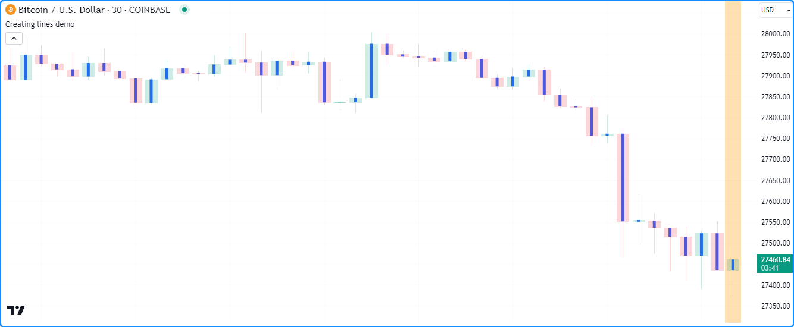

```c
//@version=5
indicator("Creating lines demo", overlay = true)

//@variable The `chart.point` for the start of the line. Contains `index` and `time` information.
firstPoint = chart.point.now(open)
//@variable The `chart.point` for the end of the line. Contains `index` and `time` information.
secondPoint = chart.point.now(close)

// Draw a basic line with a `width` of 5 connecting the `firstPoint` to the `secondPoint`.
// This line uses the `index` field from each point for its x-coordinates.
line.new(firstPoint, secondPoint, width = 5)

// Color the background on the unconfirmed bar.
bgcolor(barstate.isconfirmed ? na : color.new(color.orange, 70), title = "Unconfirmed bar highlight")
```

__Note que:__

- Se `firstPoint` e `secondPoint` referenciam coordenadas idênticas, o script __não__ exibirá uma linha, pois não há distância entre elas para desenhar. No entanto, o ID da linha ainda existirá.
- O script exibirá aproximadamente as últimas 50 _linhas_ no gráfico, pois não possui um `max_lines_count` especificado na chamada da função [indicator()](https://br.tradingview.com/pine-script-reference/v5/#fun_indicator). Desenhos de _linhas_ persistem no gráfico até serem excluídos usando [line.delete()](https://br.tradingview.com/pine-script-reference/v5/#fun_line.delete) ou removidos pelo coletor de lixo.
- O script _redesenha_ a linha na barra aberta do gráfico (ou seja, a barra com destaque de fundo laranja) até que ela feche. Após a barra fechar, ela não atualizará mais o desenho.

Veja este exemplo mais complexo. Este script usa o preço [hl2](https://br.tradingview.com/pine-script-reference/v5/#var_hl2) da barra anterior e os preços [alto](https://br.tradingview.com/pine-script-reference/v5/#var_high) e [baixo](https://br.tradingview.com/pine-script-reference/v5/#var_low) da barra atual para desenhar um leque com um número especificado pelo usuário de _linhas_ projetando uma faixa de valores hipotéticos para a barra seguinte do gráfico. Ele chama [line.new()](https://br.tradingview.com/pine-script-reference/v5/#fun_line.new) dentro de um loop [for](./04_08_loops.md#for) para criar `linesPerBar` _linhas_ em cada barra:

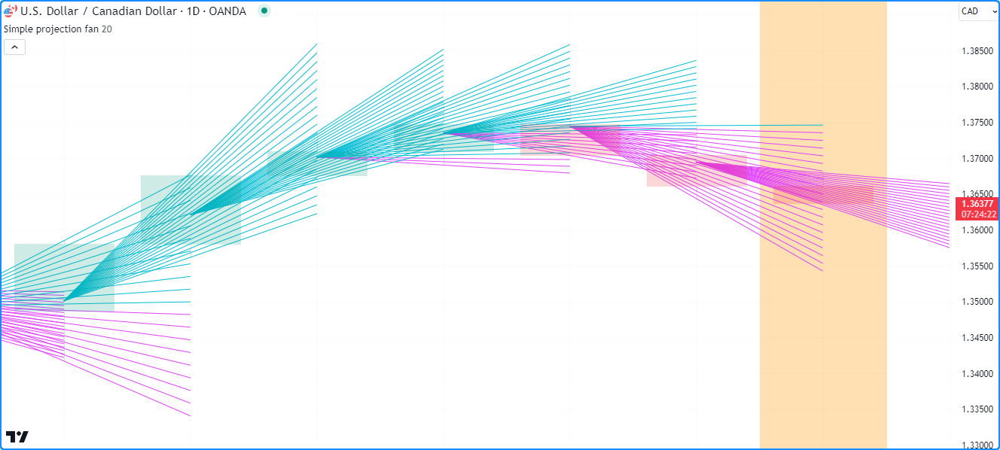

```c
//@version=5
indicator("Creating lines demo", "Simple projection fan", true, max_lines_count = 500)

//@variable The number of fan lines drawn on each chart bar.
int linesPerBar = input.int(20, "Line drawings per bar", 2, 100)

//@variable The distance between each y point on the current bar.
float step = (high - low) / (linesPerBar - 1)

//@variable The `chart.point` for the start of each line. Does not contain `time` information.
firstPoint = chart.point.from_index(bar_index - 1, hl2[1])
//@variable The `chart.point` for the end of each line. Does not contain `time` information.
secondPoint = chart.point.from_index(bar_index + 1, float(na))

//@variable The stepped y value on the current bar for `secondPoint.price` calculation, starting from the `low`.
float barValue = low
// Loop to draw the fan.
for i = 1 to linesPerBar
    // Update the `price` of the `secondPoint` using the difference between the `barValue` and `firstPoint.price`.
    secondPoint.price := 2.0 * barValue - firstPoint.price
    //@variable Is `color.aqua` when the line's slope is positive, `color.fuchsia` otherwise.
    color lineColor = secondPoint.price > firstPoint.price ? color.aqua : color.fuchsia
    // Draw a new `lineColor` line connecting the `firstPoint` and `secondPoint` coordinates.
    // This line uses the `index` field from each point for its x-coordinates.
    line.new(firstPoint, secondPoint, color = lineColor)
    // Add the `step` to the `barValue`.
    barValue += step

// Color the background on the unconfirmed bar.
bgcolor(barstate.isconfirmed ? na : color.new(color.orange, 70), title = "Unconfirmed bar highlight")
```

__Note que:__

- Foi incluído `max_lines_count = 500` na chamada da função [indicator()](https://br.tradingview.com/pine-script-reference/v5/#fun_indicator), o que significa que o script preserva até 500 _linhas_ no gráfico.
- Cada chamada [line.new()](https://br.tradingview.com/pine-script-reference/v5/#fun_line.new) copia a informação do [chart.point](https://br.tradingview.com/pine-script-reference/v5/#type_chart.point) referenciado pelas variáveis `firstPoint` e `secondPoint`. Como tal, o script pode alterar o campo de `price` do `secondPoint` em cada iteração do [loop](./04_08_loops.md) sem afetar as _coordenadas-y_ em outras _linhas_.

## Modificando _Linhas_

O _namespace_ `line.*` contém várias funções _setter_ que modificam as propriedades das instâncias de [linha](https://br.tradingview.com/pine-script-reference/v5/#type_line):

- [line.set_first_point()](https://br.tradingview.com/pine-script-reference/v5/#fun_line.set_first_point) e [line.set_second_point()](https://br.tradingview.com/pine-script-reference/v5/#fun_line.set_second_point) atualizam, respectivamente, os pontos de início e fim da linha `id` usando informações do `point` especificado.
- [line.set_x1()](https://br.tradingview.com/pine-script-reference/v5/#fun_line.set_x1) e [line.set_x2()](https://br.tradingview.com/pine-script-reference/v5/#fun_line.set_x2) definem uma das _coordenadas-x_ da linha `id` para um novo valor `x`, que pode representar um índice de barra ou valor de tempo, dependendo da propriedade `xloc` da linha.
- [line.set_y1()](https://br.tradingview.com/pine-script-reference/v5/#fun_line.set_y1) e [line.set_y2()](https://br.tradingview.com/pine-script-reference/v5/#fun_line.set_y2) definem uma das _coordenadas-y_ da linha `id` para um novo valor `y`.
- [line.set_xy1()](https://br.tradingview.com/pine-script-reference/v5/#fun_line.set_xy1) e [line.set_xy2()](https://br.tradingview.com/pine-script-reference/v5/#fun_line.set_xy2) atualizam um dos pontos da linha `id` com novos valores `x` e `y`.
- [line.set_xloc()](https://br.tradingview.com/pine-script-reference/v5/#fun_line.set_xloc) define o `xloc` da linha `id` e atualiza ambas as _coordenadas-x_ com novos valores `x1` e `x2`.
- [line.set_extend()](https://br.tradingview.com/pine-script-reference/v5/#fun_line.set_extend) define a propriedade `extend` da linha `id`.
- [line.set_color()](https://br.tradingview.com/pine-script-reference/v5/#fun_line.set_color) atualiza o valor `color` da linha `id`.
- [line.set_style()](https://br.tradingview.com/pine-script-reference/v5/#fun_line.set_style) altera o `style` da linha `id`.
- [line.set_width()](https://br.tradingview.com/pine-script-reference/v5/#fun_line.set_width) define `width` da linha `id`.

Todas as funções _setter_ modificam diretamente a linha `id` passada na chamada e não retornam valor algum. Cada função _setter_ aceita argumentos "series", pois um script pode alterar as propriedades de uma linha durante sua execução.

O exemplo a seguir desenha linhas conectando o preço de abertura do `timeframe` ao seu preço de fechamento. O script usa a palavra-chave [var](https://br.tradingview.com/pine-script-reference/v5/#kw_var) para declarar `periodLine` e as variáveis que referenciam valores [chart.point](https://br.tradingview.com/pine-script-reference/v5/#type_chart.point) (`openPoint` e `closePoint`) apenas na _primeira_ barra do gráfico, e atribui novos valores a essas variáveis durante sua execução. Após detectar uma [mudança](https://br.tradingview.com/pine-script-reference/v5/#fun_timeframe.change) no `timeframe`, define `color` da `periodLine` existente usando [line.set_color()](https://br.tradingview.com/pine-script-reference/v5/#fun_line.set_color), cria novos valores para `openPoint` e `closePoint` usando [chart.point.now()](https://br.tradingview.com/pine-script-reference/v5/#fun_chart.point.now), e em seguida, atribui uma [nova linha](https://br.tradingview.com/pine-script-reference/v5/#fun_line.new) usando esses pontos para `periodLine`.

Em outras barras onde o valor de `periodLine` não é [na](https://br.tradingview.com/pine-script-reference/v5/#var_na), o script atribui um novo [chart.point](https://br.tradingview.com/pine-script-reference/v5/#type_chart.point) ao `closePoint`, e então usa [line.set_second_point()](https://br.tradingview.com/pine-script-reference/v5/#fun_line.set_second_point) e [line.set_color()](https://br.tradingview.com/pine-script-reference/v5/#fun_line.set_color) como [métodos](./04_13_metodos.md) para atualizar as propriedades da linha:

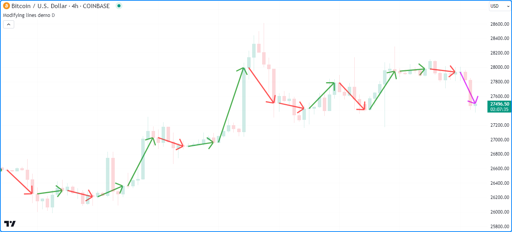

```c
//@version=5
indicator("Modifying lines demo", overlay = true)

//@variable The size of each period.
string timeframe = input.timeframe("D", "Timeframe")

//@variable A line connecting the period's opening and closing prices.
var line periodLine = na

//@variable The first point of the line. Contains `time` and `index` information.
var chart.point openPoint = chart.point.now(open)
//@variable The closing point of the line. Contains `time` and `index` information.
var chart.point closePoint = chart.point.now(close)

if timeframe.change(timeframe)
    //@variable The final color of the `periodLine`.
    color finalColor = switch
        closePoint.price > openPoint.price => color.green
        closePoint.price < openPoint.price => color.red
        =>                                    color.gray

    // Update the color of the current `periodLine` to the `finalColor`.
    line.set_color(periodLine, finalColor)

    // Assign new points to the `openPoint` and `closePoint`.
    openPoint  := chart.point.now(open)
    closePoint := chart.point.now(close)
    // Assign a new line to the `periodLine`. Uses `time` fields from the `openPoint` and `closePoint` as x-coordinates.
    periodLine := line.new(openPoint, closePoint, xloc.bar_time, style = line.style_arrow_right, width = 3)

else if not na(periodLine)
    // Assign a new point to the `closePoint`.
    closePoint := chart.point.now(close)

    //@variable The color of the developing `periodLine`.
    color developingColor = switch
        closePoint.price > openPoint.price => color.aqua
        closePoint.price < openPoint.price => color.fuchsia
        =>                                    color.gray

    // Update the coordinates of the line's second point using the new `closePoint`.
    // It uses the `time` field from the point for its new x-coordinate.
    periodLine.set_second_point(closePoint)
    // Update the color of the line using the `developingColor`.
    periodLine.set_color(developingColor)
```

__Note que:__

- Cada desenho de linha neste exemplo usa o estilo [line.style_arrow_right](https://br.tradingview.com/pine-script-reference/v5/#var_line.style_arrow_right). Veja a seção [Estilos de Linha](./05_12_lines_e_boxes.md#line-styles-estilos-de-linha) abaixo para uma visão geral de todas as configurações de estilo disponíveis.

## Line Styles (_Estilos de Linha_)

Os usuários podem controlar o estilo dos desenhos de linha de seus scripts passando uma das seguintes variáveis como argumento `style` nas chamadas das funções [line.new()](https://br.tradingview.com/pine-script-reference/v5/#fun_line.new) ou [line.set_style()](https://br.tradingview.com/pine-script-reference/v5/#fun_line.set_style):

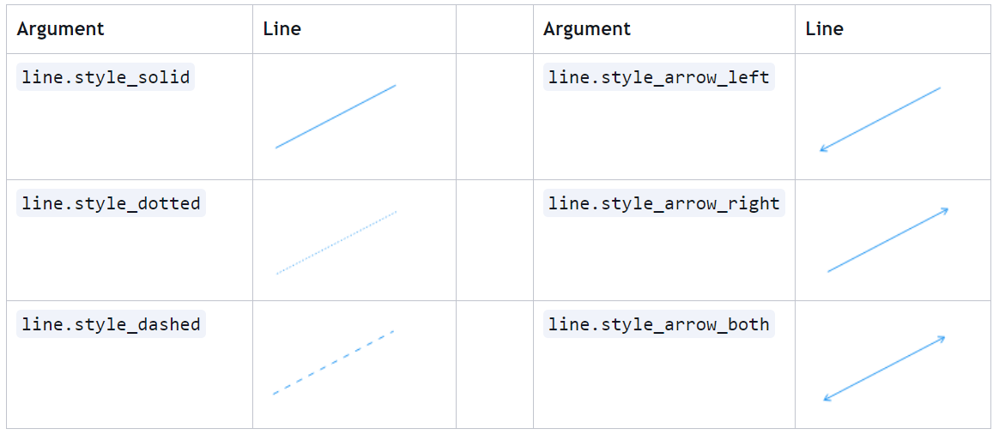

__Note que:__

- _Polilinhas_ também podem usar qualquer uma dessas variáveis como seu valor `line_style`. Veja a seção [Criando _polilinhas_](./05_12_lines_e_boxes.md#criando-polilinhas) desta página.

## Lendo Valores de _Linha_

O _namespace_ `line.*` inclui funções _getter_, que permitem a um script recuperar valores de um objeto [linha](https://br.tradingview.com/pine-script-reference/v5/#type_line) para uso posterior:

- [line.get_x1()](https://br.tradingview.com/pine-script-reference/v5/#fun_line.get_x1) e [line.get_x2()](https://br.tradingview.com/pine-script-reference/v5/#fun_line.get_x2) obtêm, respectivamente, a primeira e a segunda _coordenada-x_ da linha `id`. Se o valor retornado representa um índice de barra ou um valor de tempo depende da propriedade `xloc` da linha.
- [line.get_y1()](https://br.tradingview.com/pine-script-reference/v5/#fun_line.get_y1) e [line.get_y2()](https://br.tradingview.com/pine-script-reference/v5/#fun_line.get_y2) obtêm, respectivamente, a primeira e a segunda _coordenada-y_ da linha `id`.
- [line.get_price()](https://br.tradingview.com/pine-script-reference/v5/#fun_line.get_price) recupera o preço (_coordenada-y_) de uma linha `id` em um valor `x` especificado, incluindo índices de barra fora dos pontos de início e fim da linha. Esta função é compatível apenas com linhas que usam [xloc.bar_index](https://br.tradingview.com/pine-script-reference/v5/#var_xloc.bar_index) como valor `xloc`.

O script abaixo desenha uma nova linha no início de um padrão de preço [ascendente](https://br.tradingview.com/pine-script-reference/v5/#fun_ta.rising) ou [descendente](https://br.tradingview.com/pine-script-reference/v5/#fun_ta.falling) formado ao longo de `length` barras. Ele usa a palavra-chave [var](https://br.tradingview.com/pine-script-reference/v5/#kw_var) para declarar a variável `directionLine` na primeira barra do gráfico. O ID atribuído a `directionLine` persiste nas barras subsequentes até que a condição `newDirection` ocorra, caso em que o script atribui uma nova linha à variável.

Em cada barra, o script chama os _getters_ [line.get_y2()](https://br.tradingview.com/pine-script-reference/v5/#fun_line.get_y2), [line.get_y1()](https://br.tradingview.com/pine-script-reference/v5/#fun_line.get_y1), [line.get_x2()](https://br.tradingview.com/pine-script-reference/v5/#fun_line.get_x2) e [line.get_x1()](https://br.tradingview.com/pine-script-reference/v5/#fun_line.get_x1) como [métodos](./04_13_metodos.md) para recuperar valores da `directionLine` atual e calcular seu `slope`, que é usada para determinar a cor de cada desenho e plot. Ele recupera valores estendidos da `directionLine` _além_ de seu segundo ponto usando [line.get_price()](https://br.tradingview.com/pine-script-reference/v5/#fun_line.get_price) e os [plota](./05_15_plots.md) no gráfico:

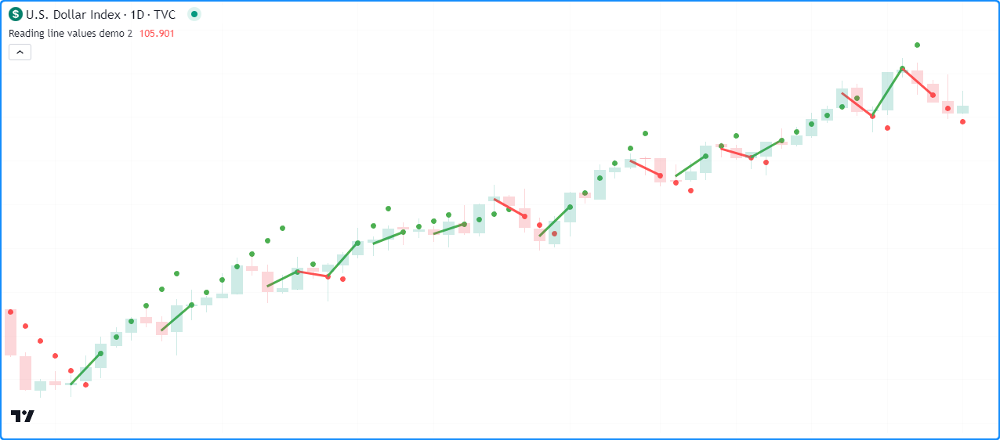

__Note que:__

- Este exemplo chama a segunda sobrecarga da função [line.new()](https://br.tradingview.com/pine-script-reference/v5/#fun_line.new), que usa os parâmetros `x1`, `y1`, `x2` e `y2` para definir os pontos de início e fim da linha. O valor `x1` está `length` barras atrás do [bar_index](https://br.tradingview.com/pine-script-reference/v5/#var_bar_index) atual, e o valor `y1` é o valor [hlc3](https://br.tradingview.com/pine-script-reference/v5/#var_hlc3) nesse índice. Os `x2` e `y2` na chamada da função usam o [bar_index](https://br.tradingview.com/pine-script-reference/v5/#var_bar_index) e os valores [hlc3](https://br.tradingview.com/pine-script-reference/v5/#var_hlc3) da barra atual.
- A chamada da função [line.get_price()](https://br.tradingview.com/pine-script-reference/v5/#fun_line.get_price) trata a `directionLine` como se ela se estendesse infinitamente, independentemente de sua propriedade `extend`.
- O script exibe aproximadamente as últimas 50 linhas no gráfico, mas o [plot](https://br.tradingview.com/pine-script-reference/v5/#fun_plot) dos valores extrapolados se estende por toda a história do gráfico.

## Clonando _Linhas_

Scripts podem clonar uma linha `id` e todas as suas propriedades com a função [line.copy()](https://br.tradingview.com/pine-script-reference/v5/#fun_line.copy). Quaisquer alterações na instância da linha copiada não afetam a original.

Por exemplo, este script cria uma linha horizontal no preço de [abertura](https://br.tradingview.com/pine-script-reference/v5/#var_open) da barra a cada `length` barras, que é atribuída a uma variável `mainLine`. Em todas as outras barras, ele cria uma `copiedLine` usando [line.copy()](https://br.tradingview.com/pine-script-reference/v5/#fun_line.copy) e chama funções `line.set_*()` para modificar suas propriedades. Como podemos ver abaixo, alterar a `copiedLine` não afeta a `mainLine` de forma alguma:

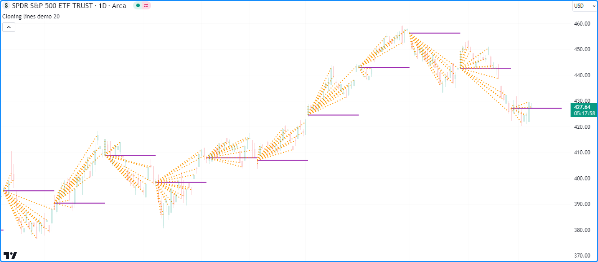

```c
//@version=5
indicator("Cloning lines demo", overlay = true, max_lines_count = 500)

//@variable The number of bars between each new mainLine assignment.
int length = input.int(20, "Length", 2, 500)

//@variable The first `chart.point` used by the `mainLine`. Contains `index` and `time` information.
firstPoint = chart.point.now(open)
//@variable The second `chart.point` used by the `mainLine`. Does not contain `time` information.
secondPoint = chart.point.from_index(bar_index + length, open)

//@variable A horizontal line drawn at the `open` price once every `length` bars.
var line mainLine = na

if bar_index % length == 0
    // Assign a new line to the `mainLine` that connects the `firstPoint` to the `secondPoint`.
    // This line uses the `index` fields from both points as x-coordinates.
    mainLine := line.new(firstPoint, secondPoint, color = color.purple, width = 2)

//@variable A copy of the `mainLine`. Changes to this line do not affect the original.
line copiedLine = line.copy(mainLine)

// Update the color, style, and second point of the `copiedLine`.
line.set_color(copiedLine, color.orange)
line.set_style(copiedLine, line.style_dotted)
line.set_second_point(copiedLine, chart.point.now(close))
```

__Note que:__

- O campo `index` do `secondPoint` está `length` barras além do [bar_index](https://br.tradingview.com/pine-script-reference/v5/#var_bar_index) atual. Como a _coordenada-x_ máxima permitida com [xloc.bar_index](https://br.tradingview.com/pine-script-reference/v5/#var_xloc.bar_index) é `bar_index + 500`, o _valor máximo_ `maxval` da entrada `length` foi definido para 500.

## Excluindo _Linhas_

Para excluir um `id` de linha desenhado por um script, use a função [line.delete()](https://br.tradingview.com/pine-script-reference/v5/#fun_line.delete). Esta função remove a instância da linha do script e seu desenho no gráfico.

Excluir instâncias de linha é útil quando se deseja manter apenas um número específico de linhas no gráfico a qualquer momento ou remover condicionalmente desenhos à medida que o gráfico avança.

Por exemplo, este script desenha uma linha horizontal com a propriedade [extend.right](https://br.tradingview.com/pine-script-reference/v5/#var_extend.right) sempre que o [RSI](https://br.tradingview.com/pine-script-reference/v5/#fun_ta.rsi) cruza sua [EMA](https://br.tradingview.com/pine-script-reference/v5/#fun_ta.ema).

O script armazena todos os IDs de linha em um array `lines` que ele [usa como uma fila](./04_14_arrays.md#utilizando-um-array-como-uma-fila) para exibir apenas o último número de linhas `numberOfLines` no gráfico. Quando o [tamanho](https://br.tradingview.com/pine-script-reference/v5/#fun_array.size) do [array](https://br.tradingview.com/pine-script-reference/v5/#type_array) excede o número especificado de `numberOfLines`, o script remove o ID da linha mais antiga do array usando [array.shift()](https://br.tradingview.com/pine-script-reference/v5/#fun_array.shift) e o exclui com [line.delete()](https://br.tradingview.com/pine-script-reference/v5/#fun_line.delete):

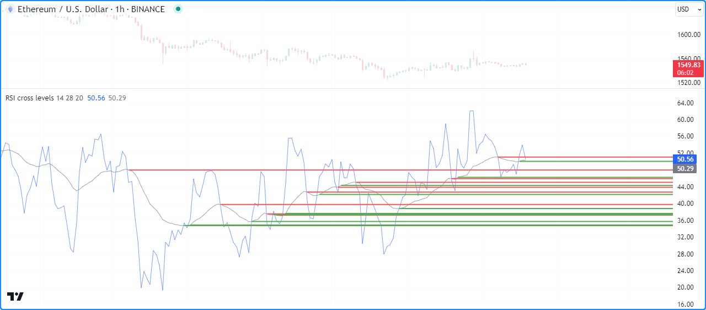

```c
//@version=5

//@variable The maximum number of lines allowed on the chart.
const int MAX_LINES_COUNT = 500

indicator("Deleting lines demo", "RSI cross levels", max_lines_count = MAX_LINES_COUNT)

//@variable The length of the RSI.
int rsiLength = input.int(14, "RSI length", 2)
//@variable The length of the RSI's EMA.
int emaLength = input.int(28, "RSI average length", 2)
//@variable The maximum number of lines to keep on the chart.
int numberOfLines = input.int(20, "Lines on the chart", 0, MAX_LINES_COUNT)

//@variable An array containing the IDs of lines on the chart.
var array<line> lines = array.new<line>()

//@variable An `rsiLength` RSI of `close`.
float rsi = ta.rsi(close, rsiLength)
//@variable A `maLength` EMA of the `rsi`.
float rsiMA = ta.ema(rsi, emaLength)

if ta.cross(rsi, rsiMA)
    //@variable The color of the horizontal line.
    color lineColor = rsi > rsiMA ? color.green : color.red
    // Draw a new horizontal line. Uses the default `xloc.bar_index`.
    newLine = line.new(bar_index, rsiMA, bar_index + 1, rsiMA, extend = extend.right, color = lineColor, width = 2)
    // Push the `newLine` into the `lines` array.
    lines.push(newLine)
    // Delete the oldest line when the size of the array exceeds the specified `numberOfLines`.
    if array.size(lines) > numberOfLines
        line.delete(lines.shift())

// Plot the `rsi` and `rsiMA`.
plot(rsi, "RSI", color.new(color.blue, 40))
plot(rsiMA, "EMA of RSI", color.new(color.gray, 30))
```

__Note que:__

- Foi declarada uma variável `MAX_LINES_COUNT` com o _tipo qualificado_ "const int", que o script usa como `max_lines_count` na função [indicator()](https://br.tradingview.com/pine-script-reference/v5/#fun_indicator) e como `maxval` da [input.int()](https://br.tradingview.com/pine-script-reference/v5/#fun_input.int) atribuída à variável `numberOfLines`.
- Este exemplo usa a segunda sobrecarga da função [line.new()](https://br.tradingview.com/pine-script-reference/v5/#fun_line.new), que especifica as coordenadas `x1`, `y1`, `x2` e `y2` independentemente.

## Preenchendo o Espaço entre _Linhas_

Scripts podem _preencher_ o espaço entre dois desenhos de [linha](https://br.tradingview.com/pine-script-reference/v5/#type_line) criando um objeto [linefill](https://br.tradingview.com/pine-script-reference/v5/#type_linefill) que os referencia com a função [linefill.new()](https://br.tradingview.com/pine-script-reference/v5/#fun_linefill.new). _Linefills_ determinam automaticamente seus limites de preenchimento usando as propriedades dos IDs `line1` e `line2` que referenciam.

Por exemplo, este script calcula um canal de regressão linear simples. Na primeira barra do gráfico, o script declara as variáveis `basisLine`, `upperLine` e `lowerLine` para referenciar os IDs da [linha](https://br.tradingview.com/pine-script-reference/v5/#type_line) do canal, e então faz duas chamadas [linefill.new()](https://br.tradingview.com/pine-script-reference/v5/#fun_linefill.new) para criar objetos [linefill](https://br.tradingview.com/pine-script-reference/v5/#type_linefill) que preenchem as porções superior e inferior do canal. O primeiro [linefill](https://br.tradingview.com/pine-script-reference/v5/#type_linefill) preenche o espaço entre a `basisLine` e a `upperLine`, e o segundo preenche o espaço entre a `basisLine` e a `lowerLine`.

O script atualiza as coordenadas das linhas nas barras subsequentes. No entanto, observe que o script nunca precisa atualizar os _linefills_ declarados na primeira barra. Eles atualizam automaticamente suas regiões de preenchimento com base nas coordenadas das linhas atribuídas:

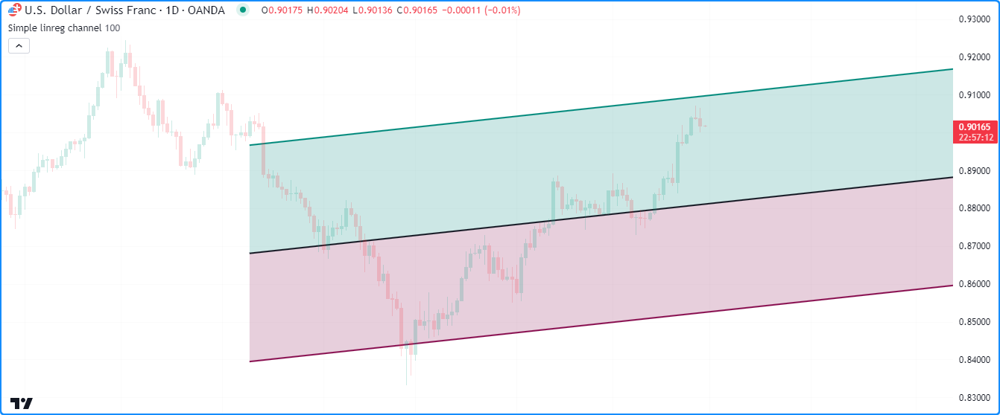

```c
//@version=5
indicator("Filling the space between lines demo", "Simple linreg channel", true)

//@variable The number of bars in the linear regression calculation.
int lengthInput = input.int(100)

//@variable The basis line of the regression channel.
var line basisLine = line.new(na, na, na, na, extend = extend.right, color = chart.fg_color, width = 2)
//@variable The channel's upper line.
var line upperLine = line.new(na, na, na, na, extend = extend.right, color = color.teal, width = 2)
//@variable The channel's lower line.
var line lowerLine = line.new(na, na, na, na, extend = extend.right, color = color.maroon, width = 2)

//@variable A linefill instance that fills the space between the `basisLine` and `upperLine`.
var linefill upperFill = linefill.new(basisLine, upperLine, color.new(color.teal, 80))
//@variable A linefill instance that fills the space between the `basisLine` and `lowerLine`.
var linefill lowerFill = linefill.new(basisLine, lowerLine, color.new(color.maroon, 80))

// Update the `basisLine` coordinates with current linear regression values.
basisLine.set_xy1(bar_index + 1 - lengthInput, ta.linreg(close, lengthInput, lengthInput - 1))
basisLine.set_xy2(bar_index, ta.linreg(close, lengthInput, 0))

//@variable The channel's standard deviation.
float stDev = 0.0
for i = 0 to lengthInput - 1
    stDev += math.pow(close[i] - line.get_price(basisLine, bar_index - i), 2)
stDev := math.sqrt(stDev / lengthInput) * 2.0

// Update the `upperLine` and `lowerLine` using the values from the `basisLine` and the `stDev`.
upperLine.set_xy1(basisLine.get_x1(), basisLine.get_y1() + stDev)
upperLine.set_xy2(basisLine.get_x2(), basisLine.get_y2() + stDev)
lowerLine.set_xy1(basisLine.get_x1(), basisLine.get_y1() - stDev)
lowerLine.set_xy2(basisLine.get_x2(), basisLine.get_y2() - stDev)
```

Para saber mais sobre o tipo [linefill](https://br.tradingview.com/pine-script-reference/v5/#type_linefill), consulte [esta](./05_08_fills.md#preenchimentos-de-linha) seção da página [Preenchimentos](./05_08_fills.md).


# Boxes (_Caixas_)

Funções incorporadas no _namespace_ `box.*` criam e gerenciam objetos de [caixa](https://br.tradingview.com/pine-script-reference/v5/#type_box):

- A função [box.new()](https://br.tradingview.com/pine-script-reference/v5/#fun_box.new) cria uma nova caixa.
- As funções `box.set_*()` modificam as propriedades da caixa.
- As funções `box.get_*()` recuperam valores de uma instância de caixa.
- A função [box.copy()](https://br.tradingview.com/pine-script-reference/v5/#fun_box.copy) clona uma instância de caixa.
- A função [box.delete()](https://br.tradingview.com/pine-script-reference/v5/#fun_box.delete) exclui uma instância de caixa.
- A variável [box.all](https://br.tradingview.com/pine-script-reference/v5/#var_box.all) referencia um [array](https://br.tradingview.com/pine-script-reference/v5/#type_array) somente leitura contendo os IDs de todas as caixas exibidas pelo script. O [tamanho](https://br.tradingview.com/pine-script-reference/v5/#fun_array.size) do array depende do `max_boxes_count` da declaração [indicator()](https://br.tradingview.com/pine-script-reference/v5/#fun_indicator) ou [strategy()](https://br.tradingview.com/pine-script-reference/v5/#fun_strategy) e do número de caixas que o script desenhou.

Assim como nas [linhas](./05_12_lines_e_boxes.md#lines-linhas), os usuários podem chamar `box.set_*()`, `box.get_*()`, [box.copy()](https://br.tradingview.com/pine-script-reference/v5/#fun_box.copy) e [box.delete()](https://br.tradingview.com/pine-script-reference/v5/#fun_box.delete) como funções ou [métodos](./04_13_metodos.md).

## Criando _Caixas_

A função [box.new()](https://br.tradingview.com/pine-script-reference/v5/#fun_box.new) cria um novo objeto de [caixa](https://br.tradingview.com/pine-script-reference/v5/#type_box) para exibir no gráfico. Ela possui as seguintes assinaturas:

```c
box.new(top_left, bottom_right, border_color, border_width, border_style, extend, xloc, bgcolor, text, text_size, text_color, text_halign, text_valign, text_wrap, text_font_family) → series box

box.new(left, top, right, bottom, border_color, border_width, border_style, extend, xloc, bgcolor, text, text_size, text_color, text_halign, text_valign, text_wrap, text_font_family) → series box
```

A primeira sobrecarga desta função inclui os parâmetros `top_left` e `bottom_right`, que aceitam objetos [chart.point](https://br.tradingview.com/pine-script-reference/v5/#type_chart.point) representando os cantos superior esquerdo e inferior direito da caixa, respectivamente. A função copia as informações desses [pontos do gráfico](./04_09_tipagem_do_sistema.md#chart-points-pontos-do-gráfico) para definir as coordenadas dos cantos da caixa. Se usa os campos `index` ou `time` dos pontos `top_left` e `bottom_right` como _coordenadas-x_ depende do valor `xloc` da função.

A segunda sobrecarga especifica as bordas `left`, `top`, `right` e `bottom` da caixa. Os parâmetros `left` e `right` aceitam valores [int](https://br.tradingview.com/pine-script-reference/v5/#type_int) especificando as _coordenadas-x_ esquerda e direita da caixa, que podem ser valores do índice da barra ou de tempo, dependendo do valor `xloc` na chamada da função. Os parâmetros `top` e `bottom` aceitam valores [float](https://br.tradingview.com/pine-script-reference/v5/#type_float) representando as _coordenadas-y_ superior e inferior da caixa.

Os parâmetros adicionais da função são idênticos em ambas as sobrecargas:

`border_color`

- Especifica a cor de todas as quatro bordas da caixa. O padrão é [color.blue](https://br.tradingview.com/pine-script-reference/v5/#var_color.blue).

`border_width`

- Especifica a largura das bordas, em pixels. O valor padrão é 1.

`border_style`

- Especifica o estilo das bordas, que pode ser qualquer uma das opções na seção [Estilos de Caixa](./05_12_lines_e_boxes.md#box-styles-estilos-de-caixa) desta página.

`extend`

- Determina se as bordas da caixa se estendem infinitamente além das _coordenadas-x_ esquerda ou direita. Aceita um dos seguintes valores: [extend.left](https://br.tradingview.com/pine-script-reference/v5/#var_extend.left), [extend.right](https://br.tradingview.com/pine-script-reference/v5/#var_extend.right), [extend.both](https://br.tradingview.com/pine-script-reference/v5/#var_extend.both) ou [extend.none](https://br.tradingview.com/pine-script-reference/v5/#var_extend.none) (padrão).

`xloc`

- Determina se as bordas esquerda e direita da caixa usam valores de índice de barra ou de tempo como _coordenadas-x_. O padrão é [xloc.bar_index](https://br.tradingview.com/pine-script-reference/v5/#var_xloc.bar_index).

- Na primeira sobrecarga, um valor `xloc` de [xloc.bar_index](https://br.tradingview.com/pine-script-reference/v5/#var_xloc.bar_index) significa que a função usará os campos de `index` dos pontos gráfico `top_left` e `bottom_right`, e um valor [xloc.bar_time](https://br.tradingview.com/pine-script-reference/v5/#var_xloc.bar_time) significa que usará seus campos de `time`.

- Na segunda sobrecarga, usar um valor `xloc` de [xloc.bar_index](https://br.tradingview.com/pine-script-reference/v5/#var_xloc.bar_index) significa que a função trata os valores `left` e `right` como índices de barra, e [xloc.bar_time](https://br.tradingview.com/pine-script-reference/v5/#var_xloc.bar_time) significa que tratará esses valores como carimbos de tempo (_timestamps_).

- Quando as _coordenadas-x_ especificadas representam valores de _índice de barra_, é importante notar que a _coordenada-x_ mínima permitida é `bar_index - 9999`. Para deslocamentos maiores, pode-se usar [xloc.bar_time](https://br.tradingview.com/pine-script-reference/v5/#var_xloc.bar_time).

`bgcolor`

- Especifica a cor de fundo do espaço dentro da caixa. O valor padrão é [color.blue](https://br.tradingview.com/pine-script-reference/v5/#var_color.blue).

`text`

- O texto a ser exibido dentro da caixa. Por padrão, seu valor é uma string vazia.

`text_size`

- Especifica o tamanho do texto dentro da caixa. Aceita um dos seguintes valores: [size.tiny](https://br.tradingview.com/pine-script-reference/v5/#var_size.tiny), [size.small](https://br.tradingview.com/pine-script-reference/v5/#var_size.small), [size.normal](https://br.tradingview.com/pine-script-reference/v5/#var_size.normal), [size.large](https://br.tradingview.com/pine-script-reference/v5/#var_size.large), [size.huge](https://br.tradingview.com/pine-script-reference/v5/#var_size.huge) ou [size.auto](https://br.tradingview.com/pine-script-reference/v5/#var_size.auto) (padrão).

`text_color`

- Controla a cor do texto. O padrão é [color.black](https://br.tradingview.com/pine-script-reference/v5/#const_color.black).

`text_halign`

- Especifica o alinhamento horizontal do texto dentro dos limites da caixa. Aceita um dos seguintes: [text.align_left](https://br.tradingview.com/pine-script-reference/v5/#var_text.align_left), [text.align_right](https://br.tradingview.com/pine-script-reference/v5/#var_text.align_right) ou [text.align_center](https://br.tradingview.com/pine-script-reference/v5/#var_text.align_center) (padrão).

`text_valign`

- Especifica o alinhamento vertical do texto dentro dos limites da caixa. Aceita um dos seguintes: [text.align_top](https://br.tradingview.com/pine-script-reference/v5/#var_text.align_top), [text.align_bottom](https://br.tradingview.com/pine-script-reference/v5/#var_text.align_bottom) ou [text.align_center](https://br.tradingview.com/pine-script-reference/v5/#var_text.align_center) (padrão).

`text_wrap`

- Determina se a caixa irá quebrar o texto dentro dela. Se o valor for [text.wrap_auto](https://br.tradingview.com/pine-script-reference/v5/#var_text.wrap_auto), a caixa quebra o texto para garantir que ele não ultrapasse suas bordas verticais. Também corta o texto quebrado quando se estende além da parte inferior. Se o valor for [text.wrap_none](https://br.tradingview.com/pine-script-reference/v5/#var_text.wrap_none), a caixa exibe o texto em uma única linha que pode se estender além de suas bordas. O padrão é [text.wrap_none](https://br.tradingview.com/pine-script-reference/v5/#var_text.wrap_none).

`text_font_family`

- Define a família de fontes do texto da caixa. Usar [font.family_default](https://br.tradingview.com/pine-script-reference/v5/#var_font.family_default) exibe o texto da caixa com a fonte padrão do sistema. [font.family_monospace](https://br.tradingview.com/pine-script-reference/v5/#var_font.family_monospace) exibe o texto em um formato monoespaçado. O valor padrão é [font.family_default](https://br.tradingview.com/pine-script-reference/v5/#var_font.family_default).

Escrever um script simples para exibir caixas em um gráfico. O exemplo abaixo desenha uma caixa projetando os valores [altos](https://br.tradingview.com/pine-script-reference/v5/#var_high) e [baixos](https://br.tradingview.com/pine-script-reference/v5/#var_low) de cada barra, do centro horizontal da barra atual até o centro da próxima barra disponível.

Em cada barra, o script cria os pontos `topLeft` e `bottomRight` via [chart.point.now()](https://br.tradingview.com/pine-script-reference/v5/#fun_chart.point.now) e [chart.point_from_index()](https://br.tradingview.com/pine-script-reference/v5/#fun_chart.point.from_index), e então chama [box.new()](https://br.tradingview.com/pine-script-reference/v5/#fun_box.new) para construir uma nova caixa e exibi-la no gráfico. Também destaca o fundo na barra não confirmada do gráfico usando [bgcolor()](https://br.tradingview.com/pine-script-reference/v5/#fun_bgcolor) para indicar que redesenha essa caixa até a última atualização da barra:

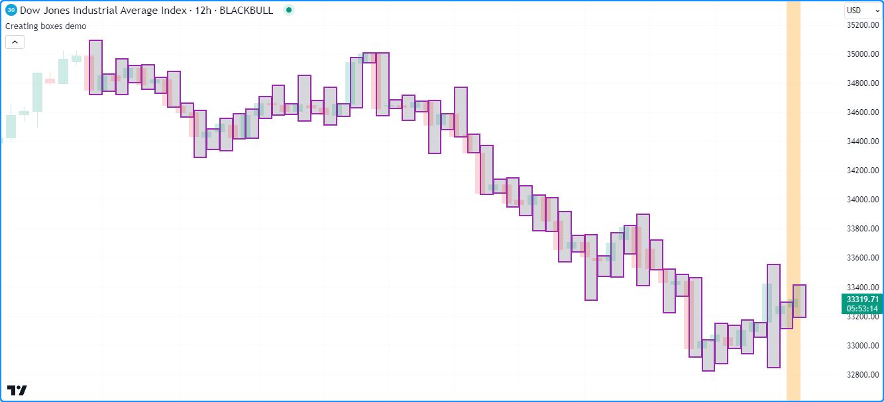

```c
//@version=5
indicator("Creating boxes demo", overlay = true)

//@variable The `chart.point` for the top-left corner of the box. Contains `index` and `time` information.
topLeft = chart.point.now(high)
//@variable The `chart.point` for the bottom-right corner of the box. Does not contain `time` information.
bottomRight = chart.point.from_index(bar_index + 1, low)

// Draw a box using the `topLeft` and `bottomRight` corner points. Uses the `index` fields as x-coordinates.
box.new(topLeft, bottomRight, color.purple, 2, bgcolor = color.new(color.gray, 70))

// Color the background on the unconfirmed bar.
bgcolor(barstate.isconfirmed ? na : color.new(color.orange, 70), title = "Unconfirmed bar highlight")
```

__Note que:__

- O campo `index` do ponto `bottomRight` é uma barra maior que o `index` no `topLeft`. Se as _coordenadas-x_ dos cantos fossem iguais, o script desenharia uma linha vertical no centro horizontal de cada barra, semelhante ao exemplo na seção [Criando linhas](./05_12_lines_e_boxes.md#criando-linhas) desta página.
- Semelhante às linhas, se `topLeft` e `bottomRight` contivessem coordenadas idênticas, a caixa não seria exibida no gráfico, pois não haveria espaço entre elas para desenhar. No entanto, seu ID ainda existiria.
- Este script exibe aproximadamente as últimas 50 caixas no gráfico, pois não foi especificado um `max_boxes_count` na chamada da função [indicator()](https://br.tradingview.com/pine-script-reference/v5/#fun_indicator).

## Modificando _Caixas_

Existem várias funções _setter_ no _namespace_ `box.*`, permitindo que scripts modifiquem as propriedades dos objetos [caixa](https://br.tradingview.com/pine-script-reference/v5/#type_box):

- [box.set_top_left_point()](https://br.tradingview.com/pine-script-reference/v5/#fun_box.set_top_left_point) e [box.set_bottom_right_point()](https://br.tradingview.com/pine-script-reference/v5/#fun_box.set_bottom_right_point) atualizam, respectivamente, as coordenadas superior esquerda e inferior direita da caixa `id` usando informações do `point` especificado.
- [box.set_left()](https://br.tradingview.com/pine-script-reference/v5/#fun_box.set_left) e [box.set_right()](https://br.tradingview.com/pine-script-reference/v5/#fun_box.set_right) definem a _coordenada-x_ esquerda ou direita da caixa `id` para um novo valor `left/right` (_esquerdo/direito_), que pode ser um índice de barra ou um valor de tempo, dependendo da propriedade `xloc` da caixa.
- [box.set_top()](https://br.tradingview.com/pine-script-reference/v5/#fun_box.set_top) e [box.set_bottom()](https://br.tradingview.com/pine-script-reference/v5/#fun_box.set_bottom) definem a _coordenada-y_ superior ou inferior da caixa `id` para um novo valor `top/bottom` (_superior/inferior_).
- [box.set_lefttop()](https://br.tradingview.com/pine-script-reference/v5/#fun_box.set_lefttop) define as coordenadas `left` e `top` da caixa `id`, e [box.set_rightbottom()](https://br.tradingview.com/pine-script-reference/v5/#fun_box.set_rightbottom) define suas coordenadas `right` e `bottom`.
- [box.set_border_color()](https://br.tradingview.com/pine-script-reference/v5/#fun_box.set_border_color), [box.set_border_width()](https://br.tradingview.com/pine-script-reference/v5/#fun_box.set_border_width) e [box.set_border_style()](https://br.tradingview.com/pine-script-reference/v5/#fun_box.set_border_style) atualizam, respectivamente, a `color`, `width` e `style` da borda da caixa `id`.
- [box.set_extend()](https://br.tradingview.com/pine-script-reference/v5/#fun_box.set_extend) define a propriedade `extend` horizontal da caixa `id`.
- `box.set_bgcolor()` define a cor do espaço dentro da caixa `id` para uma nova `color`.
- [box.set_text()](https://br.tradingview.com/pine-script-reference/v5/#fun_box.set_text), [box.set_text_size()](https://br.tradingview.com/pine-script-reference/v5/#fun_box.set_text_size), [box.set_text_color()](https://br.tradingview.com/pine-script-reference/v5/#fun_box.set_text_color), [box.set_text_halign()](https://br.tradingview.com/pine-script-reference/v5/#fun_box.set_text_halign), [box.set_text_valign()](https://br.tradingview.com/pine-script-reference/v5/#fun_box.set_text_valign), [box.set_text_wrap()](https://br.tradingview.com/pine-script-reference/v5/#fun_box.set_text_wrap) e [box.set_text_font_family()](https://br.tradingview.com/pine-script-reference/v5/#fun_box.set_text_font_family) atualizam as propriedades relacionadas ao texto da caixa `id`.

Assim como as funções _setter_ em `line.*`, todos os _setters_ de caixa modificam diretamente a caixa `id` sem retornar um valor, e cada função _setter_ aceita argumentos "series".

Observe que, ao contrário das [linhas](./05_12_lines_e_boxes.md#lines-linhas), o _namespace_ `box.*` não contém uma função _setter_ para modificar o `xloc` de uma caixa. É necessário [criar](./05_12_lines_e_boxes.md#criando-caixas) uma nova caixa com a configuração `xloc` desejada para esses casos.

Este exemplo usa caixas para visualizar os intervalos de barras ascendentes e descendentes com o maior [volume](https://br.tradingview.com/pine-script-reference/v5/#var_volume) durante um `timeframe` definido pelo usuário. Quando o script detecta uma [mudança](https://br.tradingview.com/pine-script-reference/v5/#fun_timeframe.change) no `timeframe`, ele atribui [novas caixas](https://br.tradingview.com/pine-script-reference/v5/#fun_box.new) às variáveis `upBox` e `downBox`, redefine seus valores `upVolume` e `downVolume` e destaca o fundo do gráfico.

Quando o [volume](https://br.tradingview.com/pine-script-reference/v5/#var_volume) de uma barra ascendente ou descendente excede o `upVolume` ou `downVolume`, o script atualiza as variáveis de rastreamento de volume e chama [box.set_top_left_point()](https://br.tradingview.com/pine-script-reference/v5/#fun_box.set_top_left_point) e [box.set_bottom_right_point()](https://br.tradingview.com/pine-script-reference/v5/#fun_box.set_bottom_right_point) para atualizar as coordenadas da `upBox` ou `downBox`. Os _setters_ usam as informações dos [pontos do gráfico](./04_09_tipagem_do_sistema.md#chart-points-pontos-do-gráfico) criados com [chart.point.now()](https://br.tradingview.com/pine-script-reference/v5/#fun_chart.point.now) e [chart.point.from_time()](https://br.tradingview.com/pine-script-reference/v5/#fun_chart.point.from_time) para projetar os valores [alto](https://br.tradingview.com/pine-script-reference/v5/#var_high) e [baixo](https://br.tradingview.com/pine-script-reference/v5/#var_low) dessa barra desde o tempo atual até o [horário de fechamento](https://br.tradingview.com/pine-script-reference/v5/#fun_time_close) do `timeframe`:

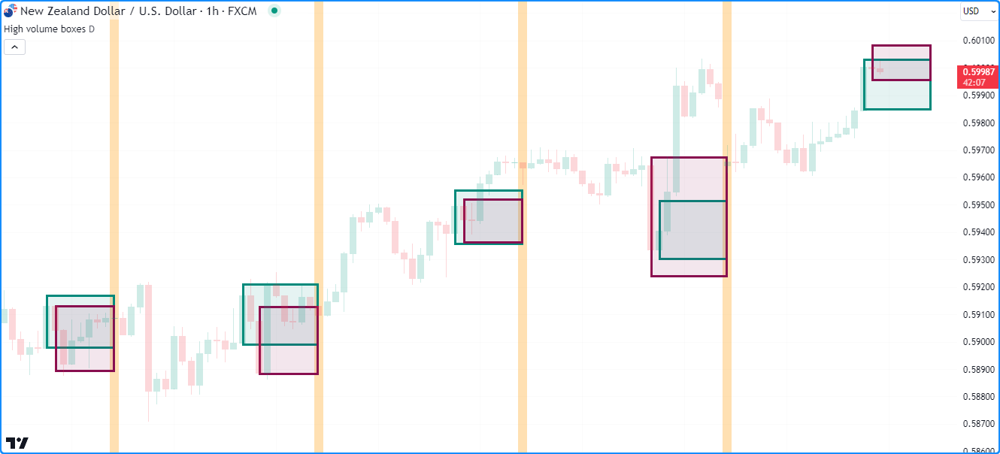

```c
//@version=5
indicator("Modifying boxes demo", "High volume boxes", true, max_boxes_count = 100)

//@variable The timeframe of the calculation.
string timeframe = input.timeframe("D", "Timeframe")

//@variable A box projecting the range of the upward bar with the highest `volume` over the `timeframe`.
var box upBox = na
//@variable A box projecting the range of the downward bar with the lowest `volume` over the `timeframe`.
var box downBox = na
//@variable The highest volume of upward bars over the `timeframe`.
var float upVolume = na
//@variable The highest volume of downward bars over the `timeframe`.
var float downVolume = na

// Color variables.
var color upBorder   = color.teal
var color upFill     = color.new(color.teal, 90)
var color downBorder = color.maroon
var color downFill   = color.new(color.maroon, 90)

//@variable The closing time of the `timeframe`.
int closeTime = time_close(timeframe)
//@variable Is `true` when a new bar starts on the `timeframe`.
bool changeTF = timeframe.change(timeframe)

//@variable The `chart.point` for the top-left corner of the boxes. Contains `index` and `time` information.
topLeft = chart.point.now(high)
//@variable The `chart.point` for the bottom-right corner of the boxes. Does not contain `index` information.
bottomRight = chart.point.from_time(closeTime, low)

if changeTF and not na(volume)
    if close > open
        // Update `upVolume` and `downVolume` values.
        upVolume   := volume
        downVolume := 0.0
        // Draw a new `upBox` using `time` and `price` info from the `topLeft` and `bottomRight` points.
        upBox := box.new(topLeft, bottomRight, upBorder, 3, xloc = xloc.bar_time, bgcolor = upFill)
        // Draw a new `downBox` with `na` coordinates.
        downBox := box.new(na, na, na, na, downBorder, 3, xloc = xloc.bar_time, bgcolor = downFill)
    else
        // Update `upVolume` and `downVolume` values.
        upVolume   := 0.0
        downVolume := volume
        // Draw a new `upBox` with `na` coordinates.
        upBox := box.new(na, na, na, na, upBorder, 3, xloc = xloc.bar_time, bgcolor = upFill)
        // Draw a new `downBox` using `time` and `price` info from the `topLeft` and `bottomRight` points.
        downBox := box.new(topLeft, bottomRight, downBorder, 3, xloc = xloc.bar_time, bgcolor = downFill)
// Update the ``upVolume`` and change the ``upBox`` coordinates when volume increases on an upward bar.
else if close > open and volume > upVolume
    upVolume := volume
    box.set_top_left_point(upBox, topLeft)
    box.set_bottom_right_point(upBox, bottomRight)
// Update the ``downVolume`` and change the ``downBox`` coordinates when volume increases on a downward bar.
else if close <= open and volume > downVolume
    downVolume := volume
    box.set_top_left_point(downBox, topLeft)
    box.set_bottom_right_point(downBox, bottomRight)

// Highlight the background when a new `timeframe` bar starts.
bgcolor(changeTF ? color.new(color.orange, 70) : na, title = "Timeframe change highlight")
```

__Note que:__

- A chamada da função [indicator()](https://br.tradingview.com/pine-script-reference/v5/#fun_indicator) contém `max_boxes_count = 100`, o que significa que o script preservará as últimas 100 caixas no gráfico.
- Utiliza-se _ambas as sobrecargas_ de [box.new()](https://br.tradingview.com/pine-script-reference/v5/#fun_box.new) neste exemplo. Na primeira barra do `timeframe`, o script chama a primeira sobrecarga para a `upBox` quando a barra está subindo, e chama essa sobrecarga para a `downBox` quando a barra está caindo. Ele usa a segunda sobrecarga para atribuir uma nova caixa com valores [na](https://br.tradingview.com/pine-script-reference/v5/#var_na) para a outra variável de caixa nessa barra.

## Box Styles (_Estilos de Caixa_)

Usuários podem incluir uma das seguintes variáveis `line.style_*` em suas chamadas de função [box.new()](https://br.tradingview.com/pine-script-reference/v5/#fun_box.new) ou [box.set_border_style()](https://br.tradingview.com/pine-script-reference/v5/#fun_box.set_border_style) para definir os estilos de borda das caixas desenhadas por seus scripts:

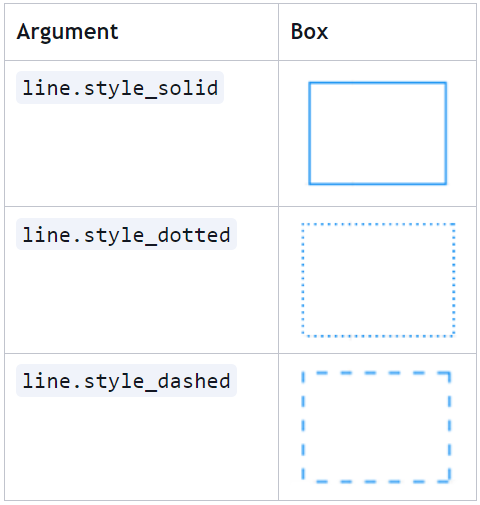

## Lendo Valores de _Caixa_

O namespace `box.*` possui funções _getter_ que permitem que scripts recuperem valores de coordenadas de uma instância de caixa:

- [box.get_left()](https://br.tradingview.com/pine-script-reference/v5/#fun_box.get_left) e [box.get_right()](https://br.tradingview.com/pine-script-reference/v5/#fun_box.get_right) obtêm, respectivamente, as _coordenadas-x_ das bordas esquerda e direita da caixa `id`. Se o valor retornado representa um índice de barra ou um valor de tempo depende da propriedade `xloc` da caixa.
- [box.get_top()](https://br.tradingview.com/pine-script-reference/v5/#fun_box.get_top) e [box.get_bottom()](https://br.tradingview.com/pine-script-reference/v5/#fun_box.get_bottom) obtêm, respectivamente, as _coordenadas-y_ superior e inferior da caixa `id`.

O exemplo abaixo desenha caixas para visualizar hipoteticamente intervalos de preços ao longo de um período de `length` barras. No início de cada novo período, usa a média do intervalo de velas multiplicada pelo input `scaleFactor` para calcular os pontos dos cantos de uma caixa centrada no preço [hl2](https://br.tradingview.com/pine-script-reference/v5/#var_hl2) com uma altura de `initialRange`. Após desenhar a primeira caixa, cria `numberOfBoxes - 1` novas caixas dentro de um loop [for](https://br.tradingview.com/pine-script-reference/v5/#kw_for).

Dentro de cada iteração do loop, o script obtém a `lastBoxDrawn` recuperando o [último](https://br.tradingview.com/pine-script-reference/v5/#fun_array.last) elemento do array somente leitura [box.all](https://br.tradingview.com/pine-script-reference/v5/#var_box.all), então chama [box.get_top()](https://br.tradingview.com/pine-script-reference/v5/#fun_box.get_top) e [box.get_bottom()](https://br.tradingview.com/pine-script-reference/v5/#fun_box.get_bottom) para obter suas _coordenadas-y_. Usa esses valores para calcular as coordenadas de uma nova caixa que é `scaleFactor` vezes mais alta que a anterior:

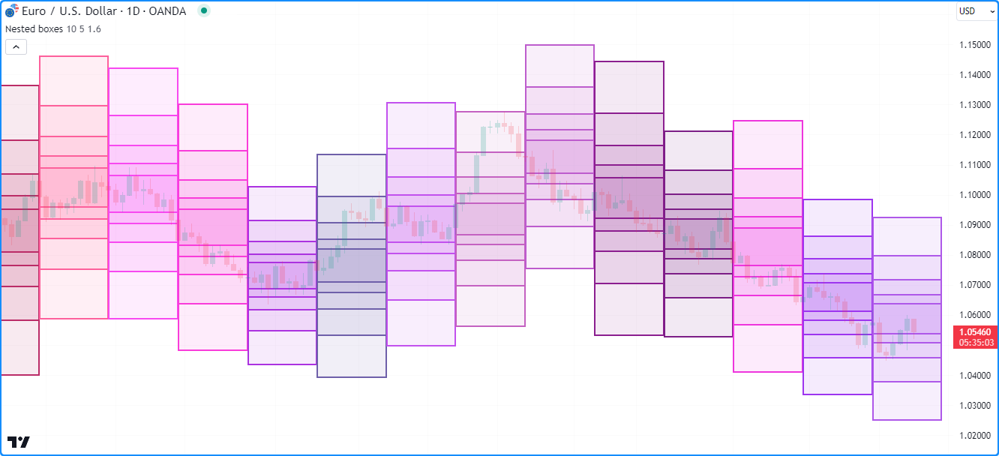

```c
//@version=5
indicator("Reading box values demo", "Nested boxes", overlay = true, max_boxes_count = 500)

//@variable The number of bars in the range calculation.
int length = input.int(10, "Length", 2, 500)
//@variable The number of nested boxes drawn on each period.
int numberOfBoxes = input.int(5, "Nested box count", 1)
//@variable The scale factor applied to each box.
float scaleFactor = input.float(1.6, "Scale factor", 1)

//@variable The initial box range.
float initialRange = scaleFactor * ta.sma(high - low, length)

if bar_index % length == 0
    //@variable The top-left `chart.point` for the initial box. Does not contain `time` information.
    topLeft = chart.point.from_index(bar_index, hl2 + initialRange / 2)
    //@variable The bottom-right `chart.point` for the initial box. Does not contain `time` information.
    bottomRight = chart.point.from_index(bar_index + length, hl2 - initialRange / 2)

    // Calculate border and fill colors of the boxes.
    borderColor = color.rgb(math.random(100, 255), math.random(0, 100), math.random(100, 255))
    bgColor = color.new(borderColor, math.max(100 * (1 - 1/numberOfBoxes), 90))

    // Draw a new box using the `topLeft` and `bottomRight` points. Uses their `index` fields as x-coordinates.
    box.new(topLeft, bottomRight, borderColor, 2, bgcolor = bgColor)

    if numberOfBoxes > 1
        // Loop to create additional boxes.
        for i = 1 to numberOfBoxes - 1
            //@variable The last box drawn by the script.
            box lastBoxDrawn = box.all.last()

            //@variable The top price of the last box.
            float top = box.get_top(lastBoxDrawn)
            //@variable The bottom price of the last box.
            float bottom = box.get_bottom(lastBoxDrawn)

            //@variable The scaled range of the new box.
            float newRange = scaleFactor * (top - bottom) * 0.5

            // Update the `price` fields of the `topLeft` and `bottomRight` points.
            // This does not affect the coordinates of previous boxes.
            topLeft.price     := hl2 + newRange
            bottomRight.price := hl2 - newRange

            // Draw a new box using the updated `topLeft` and `bottomRight` points.
            box.new(topLeft, bottomRight, borderColor, 2, bgcolor = bgColor)
```

__Note que:__

- A chamada da função [indicator()](https://br.tradingview.com/pine-script-reference/v5/#fun_indicator) usa `max_boxes_count = 500`, o que significa que o script pode exibir até 500 caixas no gráfico.
- Cada desenho possui um `length` do índice `right` das barras além do índice `left`. Como as _coordenadas-x_ desses desenhos podem estar até 500 barras no futuro, o valor máximo (`maxval`) da entrada `length` foi definido como 500.
- Em cada novo período, o script usa valores aleatórios de [color.rgb()](https://br.tradingview.com/pine-script-reference/v5/#fun_color.rgb) para `border_color` e `bgcolor` das caixas.
- Cada chamada [box.new()](https://br.tradingview.com/pine-script-reference/v5/#fun_box.new) copia as coordenadas dos objetos [chart.point](https://br.tradingview.com/pine-script-reference/v5/#type_chart.point) atribuídos às variáveis `topLeft` e `bottomRight`, por isso o script pode modificar seus campos de `price` em cada iteração do loop sem afetar as outras caixas.

## Clonando _Caixas_

Para clonar um `id` de caixa específico, use [box.copy()](https://br.tradingview.com/pine-script-reference/v5/#fun_box.copy). Esta função copia a caixa e suas propriedades. Quaisquer alterações na caixa copiada não afetam a original.

Por exemplo, este script declara uma variável `originalBox` na primeira barra e atribui uma [nova caixa](https://br.tradingview.com/pine-script-reference/v5/#fun_box.new) a ela a cada `length` barras. Nas outras barras, usa [box.copy()](https://br.tradingview.com/pine-script-reference/v5/#fun_box.copy) para criar uma `copiedBox` e chama funções `box.set_*()` para [modificar](./05_12_lines_e_boxes.md#modificando-caixas) suas propriedades. Conforme mostrado no gráfico abaixo, essas mudanças não modificam a `originalBox`:

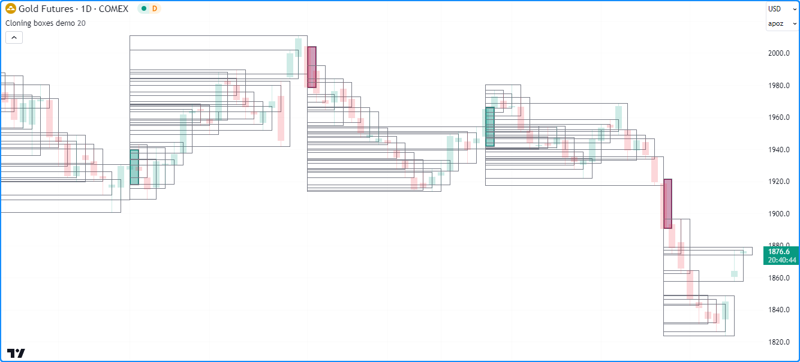

```c
//@version=5
indicator("Cloning boxes demo", overlay = true, max_boxes_count = 500)

//@variable The number of bars between each new mainLine assignment.
int length = input.int(20, "Length", 2)

//@variable The `chart.point` for the top-left of the `originalBox`. Contains `time` and `index` information.
topLeft = chart.point.now(high)
//@variable The `chart.point` for the bottom-right of the `originalBox`. Does not contain `time` information.
bottomRight = chart.point.from_index(bar_index + 1, low)

//@variable A new box with `topLeft` and `bottomRight` corners on every `length` bars.
var box originalBox = na

//@variable Is teal when the bar is rising, maroon when it's falling.
color originalColor = close > open ? color.teal : color.maroon

if bar_index % length == 0
    // Assign a new box using the `topLeft` and `bottomRight` info to the `originalBox`.
    // This box uses the `index` fields from the points as x-coordinates.
    originalBox := box.new(topLeft, bottomRight, originalColor, 2, bgcolor = color.new(originalColor, 60))
else
    //@variable A clone of the `originalBox`.
    box copiedBox = box.copy(originalBox)
    // Modify the `copiedBox`. These changes do not affect the `originalBox`.
    box.set_top(copiedBox, high)
    box.set_bottom_right_point(copiedBox, bottomRight)
    box.set_border_color(copiedBox, color.gray)
    box.set_border_width(copiedBox, 1)
    box.set_bgcolor(copiedBox, na)
```

## Excluindo _Caixas_

Para excluir caixas desenhadas por um script, use [box.delete()](https://br.tradingview.com/pine-script-reference/v5/#fun_box.delete). Assim como as funções `*.delete()` em outros namespaces de desenho, essa função é útil para remover condicionalmente caixas ou manter um número específico de caixas no gráfico.

Este exemplo exibe caixas representando valores periódicos de volume acumulado. O script [cria](./05_12_lines_e_boxes.md#criando-caixas) um novo `id` de caixa e o armazena em um array `boxes` a cada `length` barras. Se o [tamanho do array](https://br.tradingview.com/pine-script-reference/v5/#fun_array.size) exceder o número especificado de `numberOfBoxes`, o script remove a caixa mais antiga do array usando [array.shift()](https://br.tradingview.com/pine-script-reference/v5/#fun_array.shift) e a exclui usando [box.delete()](https://br.tradingview.com/pine-script-reference/v5/#fun_box.delete).

Nas outras barras, acumula [volume](https://br.tradingview.com/pine-script-reference/v5/#var_volume) ao longo de cada período [modificando](./05_12_lines_e_boxes.md#modificando-caixas) o topo da [última](https://br.tradingview.com/pine-script-reference/v5/#fun_array.last) caixa no array `boxes`. O script então usa [for loops](./04_08_loops.md#for) para encontrar o `highestTop` de todas as caixas do array e definir o `bgcolor` de cada caixa com uma [cor gradiente](https://br.tradingview.com/pine-script-reference/v5/#fun_color.from_gradient) baseada no valor [box.get_top()](https://br.tradingview.com/pine-script-reference/v5/#fun_box.get_top) relativo ao `highestTop`:

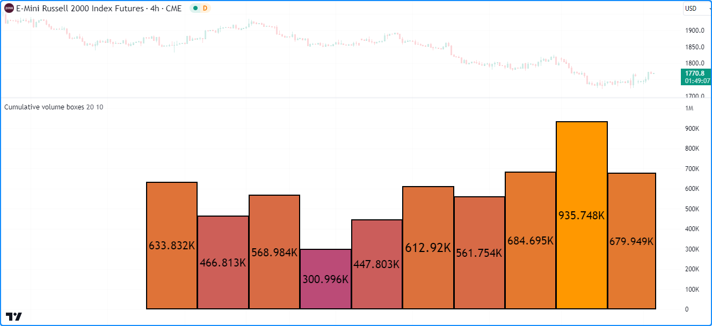

```c
//@version=5

//@variable The maximum number of boxes to show on the chart.
const int MAX_BOXES_COUNT = 500

indicator("Deleting boxes demo", "Cumulative volume boxes", format = format.volume, max_boxes_count = MAX_BOXES_COUNT)

//@variable The number of bars in each period.
int length = input.int(20, "Length", 1)
//@variable The maximum number of volume boxes in the calculation.
int numberOfBoxes = input.int(10, "Number of boxes", 1, MAX_BOXES_COUNT)

//@variable An array containing the ID of each box displayed by the script.
var boxes = array.new<box>()

if bar_index % length == 0
    // Push a new box into the `boxes` array. The box has the default `xloc.bar_index` property.
    boxes.push(box.new(bar_index, 0, bar_index + 1, 0, #000000, 2, text_color = #000000))
    // Shift the oldest box out of the array and delete it when the array's size exceeds the `numberOfBoxes`.
    if boxes.size() > numberOfBoxes
        box.delete(boxes.shift())

//@variable The last box drawn by the script as of the current chart bar.
box lastBox = boxes.last()
// Add the current bar's volume to the top of the `lastBox` and update the `right` index.
lastBox.set_top(lastBox.get_top() + volume)
lastBox.set_right(bar_index + 1)
// Display the top of the `lastBox` as volume-formatted text.
lastBox.set_text(str.tostring(lastBox.get_top(), format.volume))

//@variable The highest `top` of all boxes in the `boxes` array.
float highestTop = 0.0
for id in boxes
    highestTop := math.max(id.get_top(), highestTop)

// Set the `bgcolor` of each `id` in `boxes` with a gradient based on the ratio of its `top` to the `highestTop`.
for id in boxes
    id.set_bgcolor(color.from_gradient(id.get_top() / highestTop, 0, 1, color.purple, color.orange))
```

__Note que:__

- No início do código, foi declarada uma variável `MAX_BOXES_COUNT` com o _tipo qualificado_ "const int". Esse valor é usado como `max_boxes_count` na função [indicator()](https://br.tradingview.com/pine-script-reference/v5/#fun_indicator) e como o valor máximo possível da entrada `numberOfBoxes`.
- Este script usa a segunda sobrecarga da função [box.new()](https://br.tradingview.com/pine-script-reference/v5/#fun_box.new), que especifica as coordenadas `left`, `top`, `right`, e `bottom` da caixa separadamente.
- Foi incluído [format.volume](https://br.tradingview.com/pine-script-reference/v5/#var_format.volume) como argumento `format` na chamada da função [indicator()](https://br.tradingview.com/pine-script-reference/v5/#fun_indicator), o que informa ao script que o _eixo-y_ do painel do gráfico representa valores de _volume_. Cada caixa também exibe seu valor [superior](https://br.tradingview.com/pine-script-reference/v5/#fun_box.get_top) como texto [formatado em volume](https://br.tradingview.com/pine-script-reference/v5/#var_format.volume).


# Polylines (_Polilinhas_)

Pine Script polilinhas são desenhos __avançados__ que conectam sequencialmente as coordenadas de um [array](https://br.tradingview.com/pine-script-reference/v5/#type_array) de instâncias [chart.point](https://br.tradingview.com/pine-script-reference/v5/#type_chart.point) usando segmentos de linha reta ou curva.

Esses desenhos poderosos podem conectar até 10.000 pontos em qualquer local disponível no gráfico, permitindo que scripts desenhem séries personalizadas, polígonos e outras formações geométricas complexas que são difíceis ou impossíveis de desenhar usando objetos de [linha](https://br.tradingview.com/pine-script-reference/v5/#type_line) ou [caixa](https://br.tradingview.com/pine-script-reference/v5/#type_box).

O _namespace_ `polyline.*` possui as seguintes funções embutidas para criar e gerenciar objetos de [polilinha](https://br.tradingview.com/pine-script-reference/v5/#type_polyline):

- A função [polyline.new()](https://br.tradingview.com/pine-script-reference/v5/#fun_polyline.new) cria uma nova instância de polilinha.
- A função [polyline.delete()](https://br.tradingview.com/pine-script-reference/v5/#fun_polyline.delete) exclui uma instância de polilinha existente.
- A variável [polyline.all](https://br.tradingview.com/pine-script-reference/v5/#var_polyline.all) referencia um [array](https://br.tradingview.com/pine-script-reference/v5/#type_array) somente leitura contendo os IDs de todas as polilinhas exibidas pelo script. O [tamanho](https://br.tradingview.com/pine-script-reference/v5/#fun_array.size) do array depende do `max_polylines_count` da declaração [indicator()](https://br.tradingview.com/pine-script-reference/v5/#fun_indicator) ou [strategy()](https://br.tradingview.com/pine-script-reference/v5/#fun_strategy) e do número de polilinhas desenhadas pelo script.

Ao contrário das [linhas](./05_12_lines_e_boxes.md#lines-linhas) ou [caixas](./05_12_lines_e_boxes.md#boxes-caixas), polilinhas não possuem funções para modificação ou leitura de suas propriedades. Para redesenhar uma polilinha no gráfico, é possível _excluir_ a instância existente e _criar_ uma nova polilinha com as alterações desejadas.

## Criando _Polilinhas_

A função [polyline.new()](https://br.tradingview.com/pine-script-reference/v5/#fun_polyline.new) cria uma nova instância de [polilinha](https://br.tradingview.com/pine-script-reference/v5/#type_polyline) para exibir no gráfico. Ela tem a seguinte assinatura:

```c
polyline.new(points, curved, closed, xloc, line_color, fill_color, line_style, line_width) → series polyline
```

Os seguintes oito parâmetros afetam o comportamento de um desenho de polilinha:

`points`

- Aceita um [array](https://br.tradingview.com/pine-script-reference/v5/#type_array) de objetos [chart.point](https://br.tradingview.com/pine-script-reference/v5/#type_chart.point) que determinam as coordenadas de cada ponto na polilinha. O desenho conecta as coordenadas de cada elemento no [array](https://br.tradingview.com/pine-script-reference/v5/#type_array) sequencialmente, começando pelo _primeiro_. Se a polilinha usa o campo `index` ou `time` de cada [ponto do gráfico](./04_09_tipagem_do_sistema.md#chart-points-pontos-do-gráfico) para suas _coordenadas-x_ depende do valor de `xloc` na chamada da função.

`curved`

- Especifica se o desenho usa segmentos de linha curva para conectar cada [chart.point](https://br.tradingview.com/pine-script-reference/v5/#type_chart.point) no array `points`. O valor padrão é `false`, ou seja, usa segmentos de linha reta.

`closed`

- Controla se a polilinha conectará o último [chart.point](https://br.tradingview.com/pine-script-reference/v5/#type_chart.point) no array `points` ao primeiro, formando uma _polilinha fechada_. O valor padrão é `false`.

`xloc`

- Especifica qual campo de cada [chart.point](https://br.tradingview.com/pine-script-reference/v5/#type_chart.point) no array `points` a polilinha usará para suas _coordenadas-x_. Quando seu valor é [xloc.bar_index](https://br.tradingview.com/pine-script-reference/v5/#var_xloc.bar_index), a função usa os campos índice para criar a polilinha. Quando seu valor é [xloc.bar_time](https://br.tradingview.com/pine-script-reference/v5/#var_xloc.bar_time), a função usa os campos de tempo. O valor padrão é [xloc.bar_index](https://br.tradingview.com/pine-script-reference/v5/#var_xloc.bar_index).

`line_color`

- Especifica a cor de todos os segmentos de linha no desenho da polilinha. O padrão é `color.blue`.

`fill_color`

- Controla a cor do espaço fechado preenchido pelo desenho da polilinha. Seu valor padrão é [na](https://br.tradingview.com/pine-script-reference/v5/#var_na).

`line_style`

- Especifica o estilo da polilinha, que pode ser qualquer uma das opções disponíveis na seção Estilos de Linha desta página. O padrão é [line.style_solid](https://br.tradingview.com/pine-script-reference/v5/#var_line.style_solid).

`line_width`

- Especifica a largura da polilinha, em pixels. O valor padrão é 1.

Este script demonstra um exemplo simples de como desenhar uma polyline no gráfico. Ele [adiciona](https://br.tradingview.com/pine-script-reference/v5/#fun_array.push) um novo [chart.point](https://br.tradingview.com/pine-script-reference/v5/#type_chart.point) com um valor de `price` alternado em um array `points` e colore o fundo com [bgcolor()](https://br.tradingview.com/pine-script-reference/v5/#fun_bgcolor) a cada `length` barras.

Na [última barra histórica confirmada](https://br.tradingview.com/pine-script-reference/v5/#var_barstate.islastconfirmedhistory), o script desenha uma nova polyline no gráfico, conectando as coordenadas de cada [ponto do gráfico](./04_09_tipagem_do_sistema.md#chart-points-pontos-do-gráfico) no [array](https://br.tradingview.com/pine-script-reference/v5/#type_array), começando pelo primeiro:

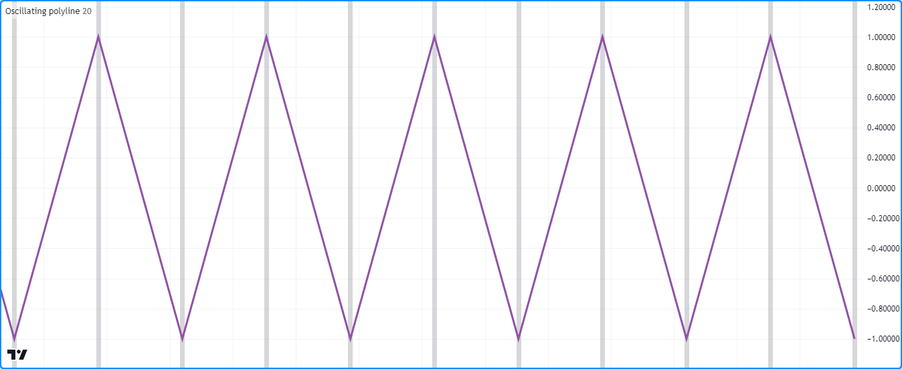

```c
//@version=5
indicator("Creating polylines demo", "Oscillating polyline")

//@variable The number of bars between each point in the drawing.
int length = input.int(20, "Length between points", 2)

//@variable An array of `chart.point` objects to sequentially connect with a polyline.
var points = array.new<chart.point>()

//@variable The y-coordinate of each point in the `points`. Alternates between 1 and -1 on each `newPoint`.
var int yValue = 1

//@variable Is `true` once every `length` bars, `false` otherwise.
bool newPoint = bar_index % length == 0

if newPoint
    // Push a new `chart.point` into the `points`. The new point contains `time` and `index` info.
    points.push(chart.point.now(yValue))
    // Change the sign of the `yValue`.
    yValue *= -1

// Draw a new `polyline` on the last confirmed historical chart bar.
// The polyline uses the `time` field from each `chart.point` in the `points` array as x-coordinates.
if barstate.islastconfirmedhistory
    polyline.new(points, xloc = xloc.bar_time, line_color = #9151A6, line_width = 3)

// Highlight the chart background on every `newPoint` condition.
bgcolor(newPoint ? color.new(color.gray, 70) : na, title = "New point highlight")
```

__Note que:__

- Este script usa apenas _uma_ polilinha para conectar cada [ponto do gráfico](./04_09_tipagem_do_sistema.md#chart-points-pontos-do-gráfico) no [array](https://br.tradingview.com/pine-script-reference/v5/#type_array) com segmentos de linha reta, e este desenho se estende por todos os dados disponíveis no gráfico, começando pela primeira barra.
- Embora seja possível alcançar um efeito semelhante usando [linhas](./05_12_lines_e_boxes.md#lines-linhas), isso exigiria uma nova instância de [linha](https://br.tradingview.com/pine-script-reference/v5/#type_line) em cada ocorrência da condição `newPoint`, e tal desenho estaria limitado a um máximo de 500 segmentos de linha. Este desenho de polilinha único e não fechado, por outro lado, pode conter até 9.999 segmentos de linha.

## Desenhos Curvados

Polilinhas podem desenhar _curvas_ que são impossíveis de produzir com [linhas](./05_12_lines_e_boxes.md#lines-linhas) ou [caixas](./05_12_lines_e_boxes.md#boxes-caixas). Ao ativar o parâmetro `curved` da função [polyline.new()](https://br.tradingview.com/pine-script-reference/v5/#fun_polyline.new), a polyline resultante interpola valores _não lineares_ entre as coordenadas de cada [chart.point](https://br.tradingview.com/pine-script-reference/v5/#type_chart.point) em seu [array](https://br.tradingview.com/pine-script-reference/v5/#type_array) de `points` para gerar um efeito curvilíneo.

Por exemplo, o script "Oscillating polyline" no exemplo anterior usa segmentos de linha reta para produzir um desenho que se assemelha a uma onda triangular, ou seja, uma forma de onda que zigzagueia entre seus picos e vales. Se definir o parâmetro `curved` na chamada [polyline.new()](https://br.tradingview.com/pine-script-reference/v5/#fun_polyline.new) desse exemplo para `true`, o desenho resultante conectaria os pontos usando _segmentos curvos_, produzindo uma forma suave e não linear semelhante a uma onda senoidal:

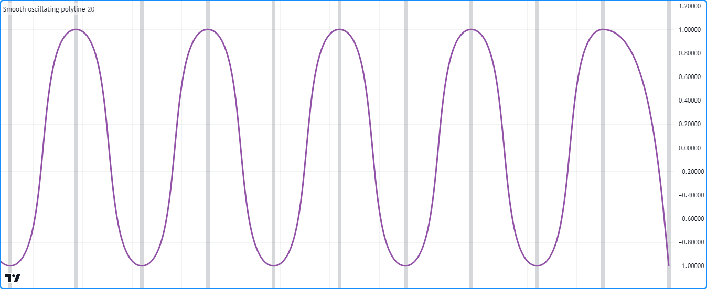

```c
//@version=5
indicator("Curved drawings demo", "Smooth oscillating polyline")

//@variable The number of bars between each point in the drawing.
int length = input.int(20, "Length between points", 2)

//@variable An array of `chart.point` objects to sequentially connect with a polyline.
var points = array.new<chart.point>()

//@variable The y-coordinate of each point in the `points`. Alternates between 1 and -1 on each `newPoint`.
var int yValue = 1

//@variable Is `true` once every `length` bars, `false` otherwise.
bool newPoint = bar_index % length == 0

if newPoint
    // Push a new `chart.point` into the `points`. The new point contains `time` and `index` info.
    points.push(chart.point.now(yValue))
    // Change the sign of the `yValue`.
    yValue *= -1

// Draw a new curved `polyline` on the last confirmed historical chart bar.
// The polyline uses the `time` field from each `chart.point` in the `points` array as x-coordinates.
if barstate.islastconfirmedhistory
    polyline.new(points, curved = true, xloc = xloc.bar_time, line_color = #9151A6, line_width = 3)

// Highlight the chart background on every `newPoint` condition.
bgcolor(newPoint ? color.new(color.gray, 70) : na, title = "New point highlight")
```

Observe que, neste exemplo, as curvas suaves apresentam um comportamento relativamente consistente, e nenhuma parte do desenho se estende além de suas coordenadas definidas, o que nem sempre é o caso ao desenhar polilinhas curvadas. Os dados usados para construir uma polilinha impactam fortemente a função suave e segmentada que interpola entre seus pontos. Em alguns casos, a curva interpolada _pode_ ultrapassar suas coordenadas reais.

Adicionando alguma variação aos [pontos do gráfico](./04_09_tipagem_do_sistema.md#chart-points-pontos-do-gráfico) no array `points` do exemplo para demonstrar esse comportamento. Na versão abaixo, o script multiplica o `yValue` por um valor [aleatório](https://br.tradingview.com/pine-script-reference/v5/#fun_math.random) nas chamadas [chart.point.now()](https://br.tradingview.com/pine-script-reference/v5/#fun_chart.point.now).

Para visualizar o comportamento, este script também cria uma [linha](https://br.tradingview.com/pine-script-reference/v5/#type_line) horizontal no valor de `price` de cada [chart.point](https://br.tradingview.com/pine-script-reference/v5/#type_chart.point) no array `points`, e exibe outra polilinha conectando os mesmos pontos com segmentos de linha reta. Como se vê no gráfico, ambas as polilinhas passam por todas as coordenadas do array `points`. No entanto, a polilinha curvada ocasionalmente ultrapassa os _limites_ verticais indicados pelas [linhas](./05_12_lines_e_boxes.md#lines-linhas) horizontais, enquanto a polilinha desenhada usando segmentos retos não:

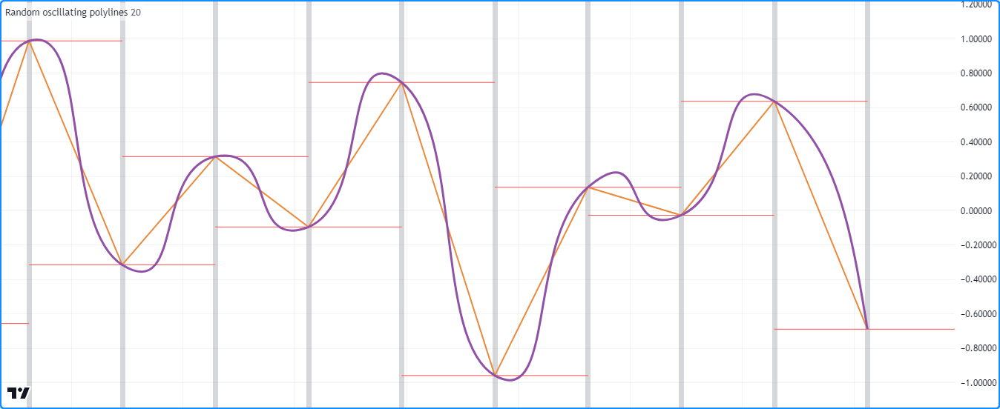

```c
//@version=5
indicator("Curved drawings demo", "Random oscillating polylines")

//@variable The number of bars between each point in the drawing.
int length = input.int(20, "Length between points", 2)

//@variable An array of `chart.point` objects to sequentially connect with a polyline.
var points = array.new<chart.point>()

//@variable The sign of each `price` in the `points`. Alternates between 1 and -1 on each `newPoint`.
var int yValue = 1

//@variable Is `true` once every `length` bars.
bool newPoint = bar_index % length == 0

if newPoint
    // Push a new `chart.point` with a randomized `price` into the `points`.
    // The new point contains `time` and `index` info.
    points.push(chart.point.now(yValue * math.random()))
    // Change the sign of the `yValue`.
    yValue *= -1

    //@variable The newest `chart.point`.
    lastPoint = points.last()
    // Draw a horizontal line at the `lastPoint.price`. This line uses the default `xloc.bar_index`.
    line.new(lastPoint.index - length, lastPoint.price, lastPoint.index + length, lastPoint.price, color = color.red)

// Draw two `polyline` instances on the last confirmed chart bar.
// Both polylines use the `time` field from each `chart.point` in the `points` array as x-coordinates.
if barstate.islastconfirmedhistory
    polyline.new(points, curved = false, xloc = xloc.bar_time, line_color = #EB8A3B, line_width = 2)
    polyline.new(points, curved = true, xloc = xloc.bar_time, line_color = #9151A6, line_width = 3)

// Highlight the chart background on every `newPoint` condition.
bgcolor(newPoint ? color.new(color.gray, 70) : na, title = "New point highlight")
```

## Formas Fechadas

Uma única polilinha pode conter vários segmentos de linha reta ou curva, e o parâmetro `closed` permite que o desenho conecte as coordenadas do primeiro e do último [chart.point](https://br.tradingview.com/pine-script-reference/v5/#type_chart.point) em seu [array](https://br.tradingview.com/pine-script-reference/v5/#type_array) de `points`. É possível usar polilinhas para desenhar muitos tipos diferentes de formas poligonais fechadas.

Este script desenha periodicamente polígonos aleatórios centrados nos valores de preço [hl2](https://br.tradingview.com/pine-script-reference/v5/#var_hl2).

Em cada ocorrência da condição `newPolygon`, ele [limpa](https://br.tradingview.com/pine-script-reference/v5/#fun_array.clear) o array `points`, calcula o `numberOfSides` e o `rotationOffset` do novo desenho do polígono com base em valores [math.random()](https://br.tradingview.com/pine-script-reference/v5/#fun_math.random), e então usa um [for loop](./04_08_loops.md#for) para adicionar `numberOfSides` novos [pontos de gráfico](./04_09_tipagem_do_sistema.md#chart-points-pontos-do-gráfico) no [array](https://br.tradingview.com/pine-script-reference/v5/#type_array) que contêm coordenadas escalonadas de um caminho elíptico com semi-eixos `xScale` e `yScale`. O script desenha o polígono conectando cada [chart.point](https://br.tradingview.com/pine-script-reference/v5/#type_chart.point) do array `points` usando uma _polilinha fechada_ com segmentos de linha reta:

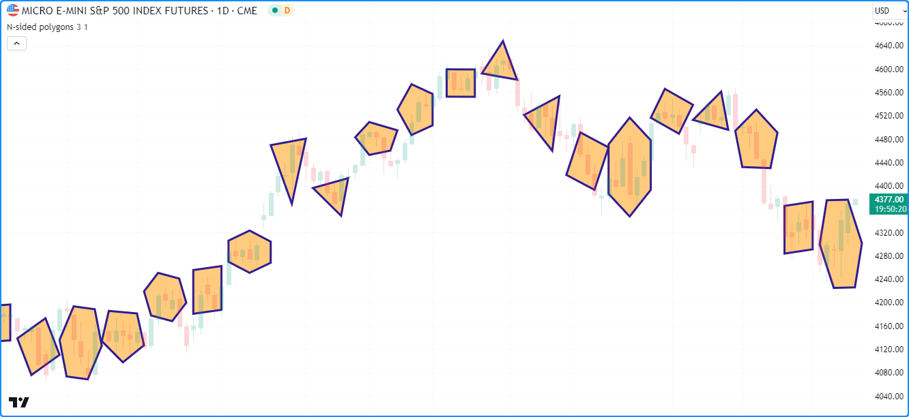

```c
//@version=5
indicator("Closed shapes demo", "N-sided polygons", true)

//@variable The size of the horizontal semi-axis.
float xScale = input.float(3.0, "X scale", 1.0)
//@variable The size of the vertical semi-axis.
float yScale = input.float(1.0, "Y scale") * ta.atr(2)

//@variable An array of `chart.point` objects containing vertex coordinates.
var points = array.new<chart.point>()

//@variable The condition that triggers a new polygon drawing. Based on the horizontal axis to prevent overlaps.
bool newPolygon = bar_index % int(math.round(2 * xScale)) == 0 and barstate.isconfirmed

if newPolygon
    // Clear the `points` array.
    points.clear()

    //@variable The number of sides and vertices in the new polygon.
    int numberOfSides = int(math.random(3, 7))
    //@variable A random rotation offset applied to the new polygon, in radians.
    float rotationOffset = math.random(0.0, 2.0) * math.pi
    //@variable The size of the angle between each vertex, in radians.
    float step = 2 * math.pi / numberOfSides

    //@variable The counter-clockwise rotation angle of each vertex.
    float angle = rotationOffset

    for i = 1 to numberOfSides
        //@variable The approximate x-coordinate from an ellipse at the `angle`, rounded to the nearest integer.
        int xValue = int(math.round(xScale * math.cos(angle))) + bar_index
        //@variable The y-coordinate from an ellipse at the `angle`.
        float yValue = yScale * math.sin(angle) + hl2

        // Push a new `chart.point` containing the `xValue` and `yValue` into the `points` array.
        // The new point does not contain `time` information.
        points.push(chart.point.from_index(xValue, yValue))
        // Add the `step` to the `angle`.
        angle += step

    // Draw a closed polyline connecting the `points`.
    // The polyline uses the `index` field from each `chart.point` in the `points` array.
    polyline.new(
         points, closed = true, line_color = color.navy, fill_color = color.new(color.orange, 50), line_width = 3
     )
```

__Note que:__

- Este exemplo mostra as últimas 50 polilinhas no gráfico, já que não foi especificado um valor `max_polylines_count` na chamada da função [indicator()](https://br.tradingview.com/pine-script-reference/v5/#fun_indicator).
- O cálculo de `yScale` multiplica um [input.float()](https://br.tradingview.com/pine-script-reference/v5/#fun_input.float) por [ta.atr(2)](https://br.tradingview.com/pine-script-reference/v5/#fun_ta.atr) para adaptar a escala vertical dos desenhos às recentes faixas de preço.
- Os polígonos resultantes têm uma largura máxima de duas vezes o semi-eixo horizontal (`2 * xScale`), arredondada para o inteiro mais próximo. A condição `newPolygon` usa esse valor para evitar que os desenhos dos polígonos se sobreponham.
- O script arredonda o cálculo de `xValue` para o inteiro mais próximo porque o campo `index` de um [chart.point](https://br.tradingview.com/pine-script-reference/v5/#type_chart.point) aceita apenas um valor [inteiro](https://br.tradingview.com/pine-script-reference/v5/#type_int), já que o _eixo-x_ do gráfico não inclui índices de barra fracionários.

## Excluindo _Polilinhas_

Para deletar um `id` polilinha específica, use [polyline.delete()](https://br.tradingview.com/pine-script-reference/v5/#fun_polyline.delete). Esta função remove o objeto [polilinha](https://br.tradingview.com/pine-script-reference/v5/#type_polyline) do script e seu desenho do gráfico.

Assim como outros objetos de desenho, [polyline.delete()](https://br.tradingview.com/pine-script-reference/v5/#fun_polyline.delete) pode ser usado para manter um número específico de desenhos de polilinha ou remover condicionalmente desenhos de um gráfico.

Por exemplo, o script abaixo desenha periodicamente espirais aritméticas aproximadas e armazena seus IDs de polilinha em um [array](https://br.tradingview.com/pine-script-reference/v5/#type_array), que é [usado como uma fila](./04_14_arrays.md#utilizando-um-array-como-uma-fila) para gerenciar o número de desenhos exibidos.

Quando a condição `newSpiral` ocorre, o script cria um array `points` e adiciona [pontos de gráfico](./04_09_tipagem_do_sistema.md#chart-points-pontos-do-gráfico) dentro de um [for loop](./04_08_loops.md#for). Em cada iteração do loop, ele chama a [função definida pelo usuário](./04_11_funcoes_definida_pelo_usuario.md) `spiralPoint()` para criar um novo [chart.point](https://br.tradingview.com/pine-script-reference/v5/#type_chart.point) contendo valores escalonados de um caminho elíptico que cresce em relação ao `angle`. O script então cria uma polilinha _curva colorida_ aleatoriamente conectando as coordenadas dos `points` e [adiciona](https://br.tradingview.com/pine-script-reference/v5/#fun_array.push) seu ID ao array `polylines`.

Quando o [tamanho](https://br.tradingview.com/pine-script-reference/v5/#fun_array.size) do array excede o número especificado de espirais (`numberOfSpirals`), o script remove a polilinha mais antiga usando [array.shift()](https://br.tradingview.com/pine-script-reference/v5/#fun_array.shift) e deleta o objeto usando [polyline.delete()](https://br.tradingview.com/pine-script-reference/v5/#fun_polyline.delete):

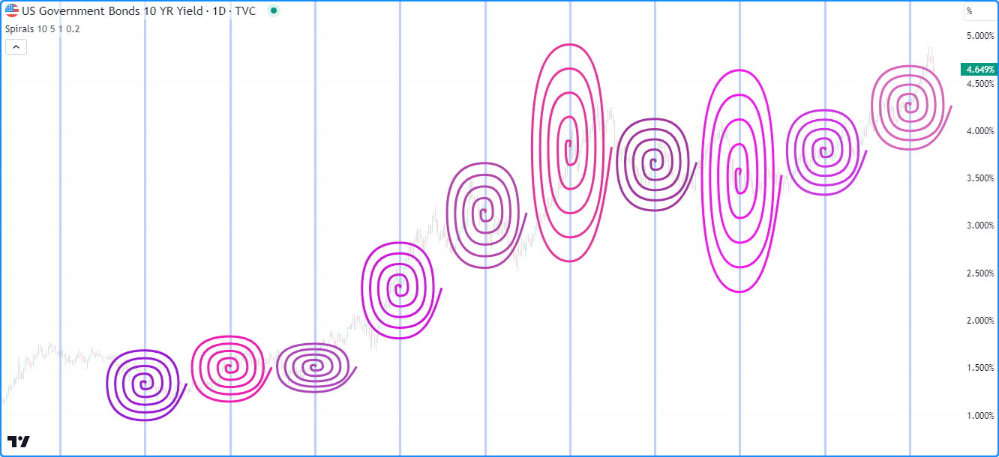

```c
//@version=5

//@variable The maximum number of polylines allowed on the chart.
const int MAX_POLYLINES_COUNT = 100

indicator("Deleting polylines example", "Spirals", true, max_polylines_count = MAX_POLYLINES_COUNT)

//@variable The number of spiral drawings on the chart.
int numberOfSpirals = input.int(10, "Spirals shown", 1, MAX_POLYLINES_COUNT)
//@variable The number of full spiral rotations to draw.
int rotations = input.int(5, "Rotations", 1)
//@variable The scale of the horizontal semi-axis.
float xScale = input.float(1.0, "X scale")
//@variable The scale of the vertical semi-axis.
float yScale = input.float(0.2, "Y scale") * ta.atr(2)

//@function Calculates an approximate point from an elliptically-scaled arithmetic spiral.
//@returns  A `chart.point` with `index` and `price` information.
spiralPoint(float angle, int xOffset, float yOffset) =>
    result = chart.point.from_index(
         int(math.round(angle * xScale * math.cos(angle))) + xOffset,
         angle * yScale * math.sin(angle) + yOffset
     )

//@variable An array of polylines.
var polylines = array.new<polyline>()

//@variable The condition to create a new spiral.
bool newSpiral = bar_index % int(math.round(4 * math.pi * rotations * xScale)) == 0

if newSpiral
    //@variable An array of `chart.point` objects for the `spiral` drawing.
    points = array.new<chart.point>()
    //@variable The counter-clockwise angle between calculated points, in radians.
    float step = math.pi / 2
    //@variable The rotation angle of each calculated point on the spiral, in radians.
    float theta = 0.0
    // Loop to create the spiral's points. Creates 4 points per full rotation.
    for i = 0 to rotations * 4
        //@variable A new point on the calculated spiral.
        chart.point newPoint = spiralPoint(theta, bar_index, ohlc4)
        // Add the `newPoint` to the `points` array.
        points.push(newPoint)
        // Add the `step` to the `theta` angle.
        theta += step

    //@variable A random color for the new `spiral` drawing.
    color spiralColor = color.rgb(math.random(150, 255), math.random(0, 100), math.random(150, 255))
    //@variable A new polyline connecting the spiral points. Uses the `index` field from each point as x-coordinates.
    polyline spiral = polyline.new(points, true, line_color = spiralColor, line_width = 3)

    // Push the new `spiral` into the `polylines` array.
    polylines.push(spiral)
    // Shift the first polyline out of the array and delete it when the array's size exceeds the `numberOfSpirals`.
    if polylines.size() > numberOfSpirals
        polyline.delete(polylines.shift())

// Highlight the background when `newSpiral` is `true`.
bgcolor(newSpiral ? color.new(color.blue, 70) : na, title = "New drawing highlight")
```

__Note que:__

- Foi declarada uma variável global `MAX_POLYLINES_COUNT` com um valor constante de 100. O script usa essa constante como o valor de `max_polylines_count` na função [indicator()](https://br.tradingview.com/pine-script-reference/v5/#fun_indicator) e o valor máximo (`maxval`) do input `numberOfSpirals`.
- Assim como no exemplo "N-sided polygons" na [seção anterior](./05_12_lines_e_boxes.md#formas-fechadas), o cálculo das _coordenadas-x_ é arredondado para o inteiro mais próximo, pois o campo `index` de um [chart.point](https://br.tradingview.com/pine-script-reference/v5/#type_chart.point) só pode aceitar um valor [int](https://br.tradingview.com/pine-script-reference/v5/#type_int).
- Apesar da aparência suave dos desenhos, o array de pontos de cada polilinha contém apenas _quatro_ objetos [chart.point](https://br.tradingview.com/pine-script-reference/v5/#type_chart.point) por rotação da espiral. Como a chamada [polyline.new()](https://br.tradingview.com/pine-script-reference/v5/#fun_polyline.new) inclui `curved = true`, cada polilinha usa _curvas suaves_ para conectar seus `points`, produzindo uma aproximação visual da curvatura real da espiral.
- A largura de cada espiral é aproximadamente `4 * math.pi * rotations * xScale`, arredondada para o inteiro mais próximo. Esse valor é usado na condição `newSpiral` para espaçar cada desenho e evitar sobreposições.

## Redesenhando _Polilinhas_

Pode ser desejável, em alguns casos, mudar um desenho de polilinha durante a execução de um script. Embora o namespace `polyline.*` não contenha funções setter incorporadas, é possível _redesenhar_ polilinhas referenciadas por variáveis ou [coleções](./04_09_tipagem_do_sistema.md#coleções) _deletando_ as polilinhas existentes e atribuindo _novas instâncias_ com as mudanças desejadas.

O exemplo a seguir usa chamadas [polyline.delete()](https://br.tradingview.com/pine-script-reference/v5/#fun_polyline.delete) e [polyline.new()](https://br.tradingview.com/pine-script-reference/v5/#fun_polyline.new) para atualizar o valor de uma variável de polilinha.

Este script desenha polilinhas fechadas que conectam os pontos de abertura, máxima, mínima e fechamento de períodos contendo `length` barras. Ele cria uma variável `currentDrawing` na primeira barra e atribui um ID de polilinha a ela em cada barra do gráfico. Ele usa as variáveis `openPoint`, `highPoint`, `lowPoint` e `closePoint` para referenciar [pontos do gráfico](./04_09_tipagem_do_sistema.md#chart-points-pontos-do-gráfico) que acompanham os valores OHLC em desenvolvimento do período. À medida que novos valores surgem, o script atribui novos objetos [chart.point](https://br.tradingview.com/pine-script-reference/v5/#type_chart.point) às variáveis, coleta-os em um [array](https://br.tradingview.com/pine-script-reference/v5/#type_array) usando [array.from](https://br.tradingview.com/pine-script-reference/v5/#fun_array.from), e então cria uma [nova polilinha](https://br.tradingview.com/pine-script-reference/v5/#fun_polyline.new) conectando as coordenadas dos pontos do array e a atribui a `currentDrawing`.

Quando a condição `newPeriod` é `false` (ou seja, o período atual não está completo), o script [deleta](./05_12_lines_e_boxes.md#excluindo-polilinhas) a polilinha referenciada por `currentDrawing` antes de [criar](./05_12_lines_e_boxes.md#criando-polilinhas) uma nova, resultando em um desenho dinâmico que muda durante o período em desenvolvimento:

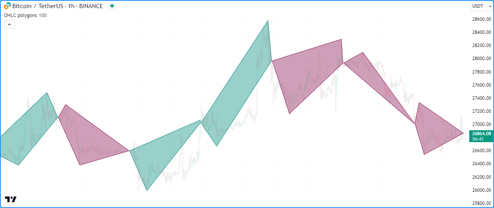

```c
//@version=5
indicator("Redrawing polylines demo", "OHLC polygons", true, max_polylines_count = 100)

//@variable The length of the period.
int length = input.int(100, "Length", 1)

//@variable A `chart.point` representing the start of each period.
var chart.point openPoint = na
//@variable A `chart.point` representing the highest point of each period.
var chart.point highPoint = na
//@variable A `chart.point` representing the lowest point of each period.
var chart.point lowPoint = na
//@variable A `chart.point` representing the current bar's closing point.
closePoint = chart.point.now(close)

//@variable The current period's polyline drawing.
var polyline currentDrawing = na

//@variable Is `true` once every `length` bars.
bool newPeriod = bar_index % length == 0

if newPeriod
    // Assign new chart points to the `openPoint`, `highPoint`, and `closePoint`.
    openPoint := chart.point.now(open)
    highPoint := chart.point.now(high)
    lowPoint  := chart.point.now(low)
else
    // Assign a new `chart.point` to the `highPoint` when the `high` is greater than its `price`.
    if high > highPoint.price
        highPoint := chart.point.now(high)
    // Assign a new `chart.point` to the `lowPoint` when the `low` is less than its `price`.
    if low < lowPoint.price
        lowPoint := chart.point.now(low)

//@variable Is teal when the `closePoint.price` is greater than the `openPoint.price`, maroon otherwise.
color drawingColor = closePoint.price > openPoint.price ? color.teal : color.maroon

// Delete the polyline assigned to the `currentDrawing` if it's not a `newPeriod`.
if not newPeriod
    polyline.delete(currentDrawing)
// Assign a new polyline to the `currentDrawing`.
// Uses the `index` field from each `chart.point` in its array as x-coordinates.
currentDrawing := polyline.new(
     array.from(openPoint, highPoint, closePoint, lowPoint), closed = true,
     line_color = drawingColor, fill_color = color.new(drawingColor, 60)
 )
```
