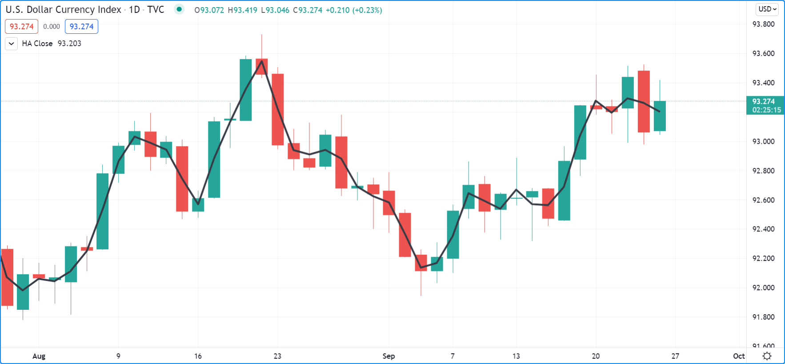
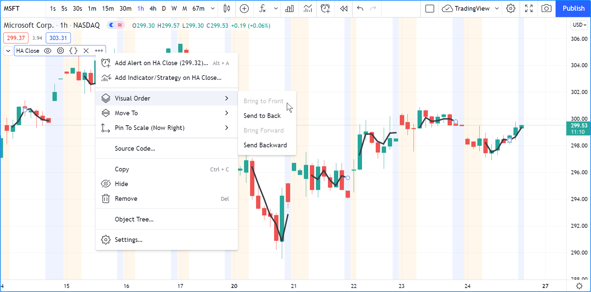
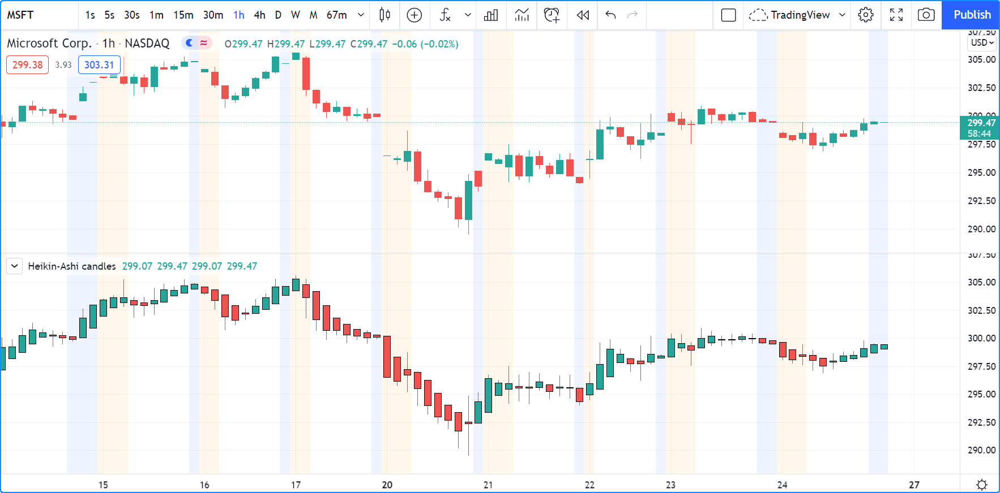

# Dados de Gráficos Não-Padronizados

Essas funções permitem que scripts busquem informações de barras ou tipos de gráficos não padronizados, independentemente do tipo de gráfico no qual o script está sendo executado.

Elas são:
[ticker.heikinashi()](https://br.tradingview.com/pine-script-reference/v5/#fun_ticker{dot}heikinashi),
[ticker.renko()](https://br.tradingview.com/pine-script-reference/v5/#fun_ticker{dot}renko),
[ticker.linebreak()](https://br.tradingview.com/pine-script-reference/v5/#fun_ticker{dot}linebreak),
[ticker.kagi()](https://br.tradingview.com/pine-script-reference/v5/#fun_ticker{dot}kagi) e
[ticker.pointfigure()](https://br.tradingview.com/pine-script-reference/v5/#fun_ticker{dot}pointfigure).

Todas elas funcionam da mesma maneira; criam um identificador de ticker especial para ser usado como o primeiro argumento em uma chamada de função [request.security()](https://br.tradingview.com/pine-script-reference/v5/#fun_request{dot}security).

## `ticker.heikinashi()`

_Heikin-Ashi_ significa _barra média_ em japonês.
Os valores de abertura/máxima/mínima/fechamento dos candlesticks Heikin-Ashi são sintéticos; eles não são preços reais de mercado.
Eles são calculados pela média de combinações dos valores reais de OHLC da barra atual e da barra anterior.
Os cálculos utilizados fazem com que as barras Heikin-Ashi sejam menos ruidosas do que os candlesticks normais.
Elas podem ser úteis para fazer avaliações visuais, mas não são adequadas para backtesting ou trading automatizado,
já que as ordens são executadas nos preços de mercado — não nos preços Heikin-Ashi.

A função [ticker.heikinashi()](https://br.tradingview.com/pine-script-reference/v5/#fun_ticker{dot}heikinashi)
cria um identificador de ticker especial para
solicitar dados Heikin-Ashi com a função [request.security()](https://br.tradingview.com/pine-script-reference/v5/#fun_request{dot}security).

Este script solicita o valor de fechamento das barras Heikin-Ashi e os plota sobre os candlesticks normais:



```c
//@version=5
indicator("HA Close", "", true)
haTicker = ticker.heikinashi(syminfo.tickerid)
haClose = request.security(haTicker, timeframe.period, close)
plot(haClose, "HA Close", color.black, 3)
```

__Note que:__

- Os valores de fechamento das barras Heikin-Ashi plotados como a linha preta são muito diferentes dos das velas reais usando preços de mercado. Eles agem mais como uma média móvel.
- A linha preta aparece sobre as barras do gráfico porque selecionamos "_Visual Order/Bring to Front_" ("_Ordem Visual/Trazer para Frente_") no menu "_More_" ("_Mais_") do script.

Para omitir valores para horas estendidas no último exemplo, um ticker intermediário sem informações de sessão estendida precisa ser criado primeiro:



```c
//@version=5
indicator("HA Close", "", true)
regularSessionTicker = ticker.new(syminfo.prefix, syminfo.ticker, session.regular)
haTicker = ticker.heikinashi(regularSessionTicker)
haClose = request.security(haTicker, timeframe.period, close, gaps = barmerge.gaps_on)
plot(haClose, "HA Close", color.black, 3, plot.style_linebr)
```

__Note que:__

- Usa-se a função [ticker.new()](https://br.tradingview.com/pine-script-reference/v5/#fun_ticker{dot}new) primeiro,
para criar um ticker sem informações de sessão estendida.
- Usa-se esse ticker em vez de [syminfo.tickerid](https://br.tradingview.com/pine-script-reference/v5/#var_syminfo{dot}tickerid) na chamada de [ticker.heikinashi()](https://br.tradingview.com/pine-script-reference/v5/#fun_ticker{dot}heikinashi).
- Na chamada de [request.security()](https://br.tradingview.com/pine-script-reference/v5/#fun_request{dot}security),
é definido o valor do parâmetro `gaps` para `barmerge.gaps_on`.
Isso instrui a função a não usar valores anteriores para preencher slots onde os dados estão ausentes.
Isso permite que ela retorne valores [na](https://br.tradingview.com/pine-script-reference/v5/#var_na) fora das sessões regulares.
- Para poder ver isso no gráfico, também é necessário usar um estilo especial `plot.style_linebr`, que quebra os plots em valores [na](https://br.tradingview.com/pine-script-reference/v5/#var_na).

Este script plota velas Heikin-Ashi sob o gráfico:



```c
//@version=5
indicator("Heikin-Ashi candles")
CANDLE_GREEN = #26A69A
CANDLE_RED   = #EF5350

haTicker = ticker.heikinashi(syminfo.tickerid)
[haO, haH, haL, haC] = request.security(haTicker, timeframe.period, [open, high, low, close])
candleColor = haC >= haO ? CANDLE_GREEN : CANDLE_RED
plotcandle(haO, haH, haL, haC, color = candleColor)
```

__Note que:__

- Usa-se uma [tupla](./04_06_declaracoes_de_variavel.md) com [request.security()](https://br.tradingview.com/pine-script-reference/v5/#fun_request{dot}security) para buscar quatro valores com a mesma chamada.
- Usa-se [plotcandle()](https://br.tradingview.com/pine-script-reference/v5/#fun_plotcandle) para plotar as velas. Veja a página de [Plotagem de Barras](./05_04_plotagem_de_barras.md) para mais informações.

## `ticker.renko()`

Barras _Renko_ apenas representam movimentos de preços, sem levar em consideração o tempo ou volume. Elas se parecem com tijolos empilhados em colunas adjacentes [[1]](./05_13_dados_de_graficos_nao_padronizados.md#1). Um novo tijolo é desenhado apenas após o preço ultrapassar o topo ou o fundo por uma quantidade predeterminada. A função [ticker.renko()](https://br.tradingview.com/pine-script-reference/v5/#fun_ticker{dot}renko) cria um ID de ticker que pode ser usado com [request.security()](https://br.tradingview.com/pine-script-reference/v5/#fun_request{dot}security) para obter valores de Renko, mas não há uma função do Pine Script para desenhar barras de Renko no gráfico:

```c
//@version=5
indicator("", "", true)
renkoTicker = ticker.renko(syminfo.tickerid, "ATR", 10)
renkoLow = request.security(renkoTicker, timeframe.period, low)
plot(renkoLow)
```

## `ticker.linebreak()`

O gráfico _Line Break_ exibe uma série de caixas verticais baseadas em mudanças de preço [[1]](./05_13_dados_de_graficos_nao_padronizados.md#1). A função [ticker.linebreak()](https://br.tradingview.com/pine-script-reference/v5/#fun_ticker{dot}linebreak) cria um ID de ticker que pode ser usado com [request.security()](https://br.tradingview.com/pine-script-reference/v5/#fun_request{dot}security) para obter valores de "Line Break", mas não há uma função do Pine Script para desenhar essas barras no gráfico:

```c
//@version=5
indicator("", "", true)
lineBreakTicker = ticker.linebreak(syminfo.tickerid, 3)
lineBreakClose = request.security(lineBreakTicker, timeframe.period, close)
plot(lineBreakClose)
```

## `ticker.kagi()`

Gráficos _Kagi_ são compostos por uma linha contínua que muda de direção. A direção muda quando o preço varia [[1]](./05_13_dados_de_graficos_nao_padronizados.md#1) além de um valor predeterminado. A função [`ticker.kagi()`](https://br.tradingview.com/pine-script-reference/v5/#fun_ticker{dot}kagi) cria um ID de ticker que pode ser usado com [`request.security()`](https://br.tradingview.com/pine-script-reference/v5/#fun_request{dot}security) para obter valores de "Kagi", mas não há uma função do Pine Script para desenhar essas barras no gráfico:

```c
//@version=5
indicator("", "", true)
kagiBreakTicker = ticker.linebreak(syminfo.tickerid, 3)
kagiBreakClose = request.security(kagiBreakTicker, timeframe.period, close)
plot(kagiBreakClose)
```

<!-- ## `ticker.pointfigure()`

Gráficos "_Point and Figure (PnF)_" ("_Figura e Ponto_") apenas representam movimentos de preços [[1]](./05_13_dados_de_graficos_nao_padronizados.md#1), sem levar em consideração o tempo. Uma coluna de X's é plotada à medida que o preço sobe, e O's são plotados quando o preço cai. A função [`ticker.pointfigure()`](https://br.tradingview.com/pine-script-reference/v5/#fun_ticker{dot}pointfigure) cria um ID de ticker que pode ser usado com [`request.security()`](https://br.tradingview.com/pine-script-reference/v5/#fun_request{dot}security) para obter valores de "PnF", mas não há uma função do Pine Script para desenhar essas barras no gráfico. Cada coluna de X's ou O's é representada com quatro números. Pode-se pensar neles como valores sintéticos de OHLC PnF:

```c
//@version=5
indicator("", "", true)
pnfTicker = ticker.pointfigure(syminfo.tickerid, "hl", "ATR", 14, 3)
[pnfO, pnfC] = request.security(pnfTicker, timeframe.period, [open, close], barmerge.gaps_on)
plot(pnfO, "PnF Open", color.green, 4, plot.style_linebr)
plot(pnfC, "PnF Close", color.red, 4, plot.style_linebr)
``` -->

### __Notas de Rodapé__

> ###### [1]
> _(1, 2, 3, 4)_: No TradingView, os tipos de gráficos Renko, Line Break, Kagi e PnF são gerados a partir dos valores OHLC de um intervalo de tempo inferior. Esses tipos de gráficos representam apenas uma aproximação de como seriam se fossem gerados a partir de dados do tick.