# Outros Timeframes e Dados

Pine Script permite solicitar dados de fontes e contextos diferentes daqueles usados em seus gráficos. As funções apresentadas nesta página podem buscar dados de várias fontes alternativas:

- [request.security()](https://br.tradingview.com/pine-script-reference/v5/#fun_request{dot}security) recupera dados de outro símbolo, timeframe ou outro contexto.
- [request.security_lower_tf()](https://br.tradingview.com/pine-script-reference/v5/#fun_request{dot}security_lower_tf) recupera dados _intrabar_, ou seja, dados de um timeframe inferior ao do gráfico.
- [request.currency_rate()](https://br.tradingview.com/pine-script-reference/v5/#fun_request{dot}currency_rate) solicita uma _taxa diária_ para converter um valor expressado em uma moeda para outra.
- [request.dividends(), request.splits(), e request.earnings()](https://br.tradingview.com/pine-script-reference/v5/#fun_request{dot}dividends-request{dot}splits-request{dot}earnings) recuperam, respectivamente, informações sobre dividendos, desdobramentos e lucros de uma empresa emissora.
- [request.quandl()](https://br.tradingview.com/pine-script-reference/v5/#fun_request{dot}quandl) recupera informações do [NASDAQ Data Link](https://data.nasdaq.com).
- [request.financial()](https://br.tradingview.com/pine-script-reference/v5/#fun_request{dot}financial) recupera dados financeiros do [FactSet](https://www.factset.com/).
- [request.economic()](https://br.tradingview.com/pine-script-reference/v5/#fun_request{dot}economic) recupera dados econômicos e industriais.
- [request.seed()](https://br.tradingview.com/pine-script-reference/v5/#fun_request{dot}seed) recupera dados de um repositório GitHub _mantido pelo usuário_.

> __Observação!__\
> Ao longo desta página, e em outras partes da documentação que discutem as funções `request.*()`, é comum o uso do termo "_context_" para descrever o ID do ticker, timeframe e quaisquer modificações (ajustes de preço, configurações de sessão, tipos de gráficos não padronizados, etc.) que se aplicam a um gráfico ou aos dados recuperados por um script.

Estas são as assinaturas das funções no namespace `request.*`:

```c
request.security(symbol, timeframe, expression, gaps, lookahead, ignore_invalid_symbol, currency, calc_bars_count) → series <type>

request.security_lower_tf(symbol, timeframe, expression, ignore_invalid_symbol, currency, ignore_invalid_timeframe, calc_bars_count) → array<type>

request.currency_rate(from, to, ignore_invalid_currency) → series float

request.dividends(ticker, field, gaps, lookahead, ignore_invalid_symbol, currency) → series float

request.splits(ticker, field, gaps, lookahead, ignore_invalid_symbol) → series float

request.earnings(ticker, field, gaps, lookahead, ignore_invalid_symbol, currency) → series float

request.quandl(ticker, gaps, index, ignore_invalid_symbol) → series float

request.financial(symbol, financial_id, period, gaps, ignore_invalid_symbol, currency) → series float

request.economic(country_code, field, gaps, ignore_invalid_symbol) → series float

request.seed(source, symbol, expression, ignore_invalid_symbol, calc_bars_count) → series <type>
```

A família de funções `request.*()` possui diversas aplicações potenciais. Ao longo desta página, serão discutidas em detalhes essas funções e alguns de seus casos de uso típicos.

> __Observação!__\
> Também é possível permitir que scripts compatíveis avaliem seus escopos em outros contextos sem exigir funções `request.*()` usando o parâmetro `timeframe` da declaração [indicator()](https://br.tradingview.com/pine-script-reference/v5/#fun_indicator).


# Características Comuns

Muitas funções no namespace `request.*()` compartilham algumas propriedades e parâmetros comuns. Antes de explorar cada função em profundidade, é importante familiarizar-se com essas características.

## Uso

Todas as funções `request.*()` retornam resultados "series", o que significa que podem produzir valores diferentes em cada barra. No entanto, a maioria dos parâmetros das funções `request.*()` requer argumentos "const", "input" ou "simple".

Em essência, Pine Script deve determinar os valores da maioria dos argumentos passados para uma função `request.*()` na compilação do script ou na primeira barra do gráfico, dependendo do [tipo qualificado](./04_09_tipagem_do_sistema.md#qualificadores) que cada parâmetro aceita, e esses valores não podem mudar durante a execução do script. A única exceção é o parâmetro `expression` em [request.security()](https://br.tradingview.com/pine-script-reference/v5/#fun_request.security), [request.security_lower_tf()](https://br.tradingview.com/pine-script-reference/v5/#fun_request.security_lower_tf), e [request.seed()](https://br.tradingview.com/pine-script-reference/v5/#fun_request.seed), que aceita argumentos "series".

Chamadas para funções `request.*()` são executadas em cada barra do gráfico, e scripts não podem desativá-las seletivamente durante sua execução. Scripts não podem chamar funções `request.*()` dentro dos escopos locais de [estruturas condicionais](./04_07_estruturas_condicionais.md), ou funções e métodos exportados por [bibliotecas](./05_11_libraries.md), mas podem usar essas chamadas de função dentro dos corpos de [funções definidas pelo usuário](./04_11_funcoes_definidas_pelo_usuario.md) e [métodos](./04_13_metodos.md#métodos-definidos-pelo-usuário) não exportados.

Ao usar qualquer função `request.*()` dentro de um script, a performance de execução é uma consideração importante. Essas funções podem ter um impacto significativo na performance do script. Enquanto scripts podem conter um máximo de 40 chamadas para o namespace `request.*()`, é recomendável minimizar o número de chamadas nos scripts para manter o consumo de recursos o mais baixo possível. Para mais informações sobre as limitações dessas funções, veja [esta seção](./06_05_limitacoes.md#chamadas-request) da página do Manual do Usuário sobre as [limitações](./06_05_limitacoes.md) do Pine.

## `gaps`

Ao usar uma função `request.*()` para recuperar dados de outro contexto, os dados podem não ser recebidos em cada nova barra como seriam no gráfico atual. O parâmetro `gaps` de uma função `request.*()` permite controlar como a função responde a valores inexistentes na série solicitada.

> __Observação!__\
> Ao usar a função [indicator()](https://br.tradingview.com/pine-script-reference/v5/#fun_indicator) para avaliar um script em outro contexto, o parâmetro `timeframe_gaps` especifica como ele lida com valores inexistentes. O parâmetro é similar ao parâmetro `gaps` para funções `request.*()`.

Suponha que há um script que solicita dados por hora para o símbolo do gráfico com [request.security()](https://br.tradingview.com/pine-script-reference/v5/#fun_request.security) executando em um gráfico de 1 minuto. Nesse caso, a chamada da função retornará novos valores apenas nas barras de 1 minuto que cobrem os horários de abertura/fechamento das barras horárias do símbolo. Nas outras barras do gráfico, pode-se decidir se a função retornará valores [na](https://br.tradingview.com/pine-script-reference/v5/#var_na) ou os últimos valores disponíveis via o parâmetro `gaps`.

Quando o parâmetro `gaps` usa [barmerge.gaps_on](https://br.tradingview.com/pine-script-reference/v5/#var_barmerge.gaps_on), a função retornará resultados [na](https://br.tradingview.com/pine-script-reference/v5/#var_na) em todas as barras do gráfico onde novos dados ainda não foram confirmados do contexto solicitado. Caso contrário, quando o parâmetro usa [barmerge.gaps_off](https://br.tradingview.com/pine-script-reference/v5/#var_barmerge.gaps_off), a função preencherá as lacunas nos dados solicitados com os últimos valores confirmados em barras históricas e os valores em desenvolvimento mais recentes em barras em tempo real.

O script abaixo demonstra a diferença no comportamento ao [plotar](./05_15_plots.md) os resultados de duas chamadas para [request.security()](https://br.tradingview.com/pine-script-reference/v5/#fun_request.security) que buscam o preço de [fechamento](https://br.tradingview.com/pine-script-reference/v5/#var_close) do símbolo atual no timeframe por hora em um gráfico de 1 minuto. A primeira chamada usa `gaps = barmerge.gaps_off` e a segunda usa `gaps = barmerge.gaps_on`:

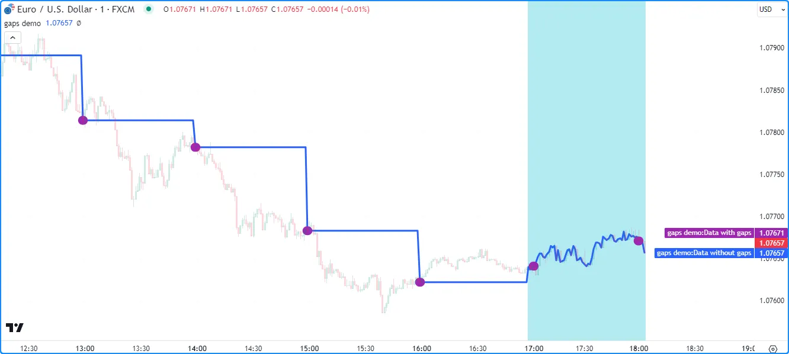

```c
//@version=5
indicator("gaps demo", overlay = true)

//@variable The `close` requested from the hourly timeframe without gaps.
float dataWithoutGaps = request.security(syminfo.tickerid, "60", close, gaps = barmerge.gaps_off)
//@variable The `close` requested from the hourly timeframe with gaps.
float dataWithGaps = request.security(syminfo.tickerid, "60", close, gaps = barmerge.gaps_on)

// Plot the requested data.
plot(dataWithoutGaps, "Data without gaps", color.blue, 3, plot.style_linebr)
plot(dataWithGaps, "Data with gaps", color.purple, 15, plot.style_linebr)

// Highlight the background for realtime bars.
bgcolor(barstate.isrealtime ? color.new(color.aqua, 70) : na, title = "Realtime bar highlight")
```

__Note que:__

- [barmerge.gaps_off](https://br.tradingview.com/pine-script-reference/v5/#var_barmerge.gaps_off) é o valor padrão para o parâmetro `gaps` em todas as funções `request.*()` aplicáveis.
- O script plota a série solicitada como linhas com quebras ([plot.style_linebr](https://br.tradingview.com/pine-script-reference/v5/#var_plot.style_linebr)), que não se conectam sobre valores [na](https://br.tradingview.com/pine-script-reference/v5/#var_na) como o estilo padrão ([plot.style_line](https://br.tradingview.com/pine-script-reference/v5/#var_plot.style_line)) faz.
- Ao usar [barmerge.gaps_off](https://br.tradingview.com/pine-script-reference/v5/#var_barmerge.gaps_off), a função [request.security()](https://br.tradingview.com/pine-script-reference/v5/#fun_request.security) retorna o último fechamento confirmado ([fechamento](https://br.tradingview.com/pine-script-reference/v5/#var_close)) do timeframe horário em todas as barras históricas. Ao rodar em barras em tempo real (as barras com o fundo [color.aqua](https://br.tradingview.com/pine-script-reference/v5/#var_color.aqua) neste exemplo), ela retorna o valor de fechamento atual do símbolo, independentemente da confirmação. Para mais informações, veja a seção [Comportamento histórico e em tempo real](./05_14_outros_timeframes_e_dados.md#comportamento-histórico-e-tempo-real) desta página.

## `ignore_invalid_symbol`

O parâmetro `ignore_invalid_symbol` das funções `request.*()` determina como uma função lidará com solicitações de dados inválidos, por exemplo:

- Usando uma função `request.*()` com um ID de ticker inexistente como o parâmetro `symbol/ticker`.
- Usando [request.financial()](https://br.tradingview.com/pine-script-reference/v5/#fun_request.financial) para recuperar informações que não existem para o `symbol` ou `period` especificado.
- Usando [request.economic()](https://br.tradingview.com/pine-script-reference/v5/#fun_request.economic) para solicitar um `field` que não existe para um `country_code`.

Uma chamada de função `request.*()` produzirá um _erro de tempo de execução_ e interromperá a execução do script ao fazer uma solicitação errônea se o parâmetro `ignore_invalid_symbol` for `false`. Quando o valor deste parâmetro é `true`, a função retornará valores [na](https://br.tradingview.com/pine-script-reference/v5/#var_na) nesse caso, em vez de gerar um erro.

Este exemplo usa chamadas `request.*()` dentro de uma [função definida pelo usuário](./04_11_funcoes_definidas_pelo_usuario.md) para recuperar dados para estimar a capitalização de mercado (market cap) de um instrumento. A função definida pelo usuário `calcMarketCap()` chama [request.financial()](https://br.tradingview.com/pine-script-reference/v5/#fun_request.financial) para recuperar o total de ações em circulação para um símbolo e [request.security()](https://br.tradingview.com/pine-script-reference/v5/#fun_request.security) para recuperar uma tupla contendo o preço de [fechamento](https://br.tradingview.com/pine-script-reference/v5/#var_close) do símbolo e o [currency](https://br.tradingview.com/pine-script-reference/v5/#var_syminfo.currency) (_moeda_). Foi incluído `ignore_invalid_symbol = true` em ambas as chamadas `request.*()` para evitar erros de tempo de execução para solicitações inválidas.

O script exibe uma [string formatada](https://br.tradingview.com/pine-script-reference/v5/#fun_str.format) representando o valor estimado da capitalização de mercado do símbolo e a moeda em uma [tabela](https://br.tradingview.com/pine-script-reference/v5/#type_table) no gráfico e usa um [plot](https://br.tradingview.com/pine-script-reference/v5/#fun_plot) para visualizar o histórico de `marketCap`:

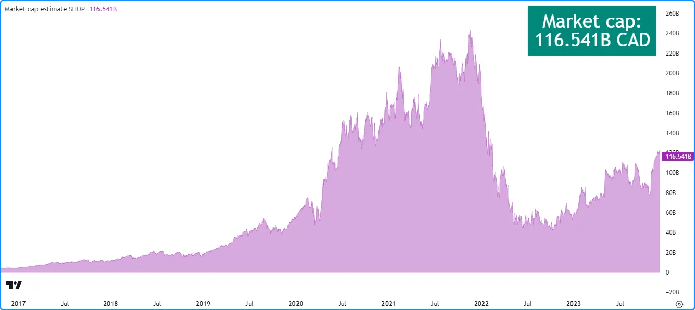

```c
//@version=5
indicator("ignore_invalid_symbol demo", "Market cap estimate", format = format.volume)

//@variable The symbol to request data from.
string symbol = input.symbol("TSX:SHOP", "Symbol")

//@function Estimates the market capitalization of the specified `tickerID` if the data exists.
calcMarketCap(simple string tickerID) =>
    //@variable The quarterly total shares outstanding for the `tickerID`. Returns `na` when the data isn't available.
    float tso = request.financial(tickerID, "TOTAL_SHARES_OUTSTANDING", "FQ", ignore_invalid_symbol = true)
    //@variable The `close` price and currency for the `tickerID`. Returns `[na, na]` when the `tickerID` is invalid.
    [price, currency] = request.security(
         tickerID, timeframe.period, [close, syminfo.currency], ignore_invalid_symbol = true
     )
    // Return a tuple containing the market cap estimate and the quote currency.
    [tso * price, currency]

//@variable A `table` object with a single cell that displays the `marketCap` and `quoteCurrency`.
var table infoTable = table.new(position.top_right, 1, 1)
// Initialize the table's cell on the first bar.
if barstate.isfirst
    table.cell(infoTable, 0, 0, "", text_color = color.white, text_size = size.huge, bgcolor = color.teal)

// Get the market cap estimate and quote currency for the `symbol`.
[marketCap, quoteCurrency] = calcMarketCap(symbol)

//@variable The formatted text displayed inside the `infoTable`.
string tableText = str.format("Market cap:\n{0} {1}", str.tostring(marketCap, format.volume), quoteCurrency)
// Update the `infoTable`.
table.cell_set_text(infoTable, 0, 0, tableText)

// Plot the `marketCap` value.
plot(marketCap, "Market cap", color.new(color.purple, 60), style = plot.style_area)
```

__Note que:__

- A função `calcMarketCap()` retornará valores apenas para instrumentos válidos com dados de ações em circulação, como o selecionado para este exemplo. Ela retornará um valor de capitalização de mercado de [na](https://br.tradingview.com/pine-script-reference/v5/#var_na) em outros que não possuem dados financeiros, incluindo forex, cripto e derivativos.
- Nem todas as empresas emissoras publicam relatórios financeiros trimestrais. Se a empresa emissora do `symbol` não relatar trimestralmente, altere o valor "FQ" neste script para o timeframe mínimo de relatório da empresa. Veja a seção [request.financial()](https://br.tradingview.com/pine-script-reference/v5/#fun_request{dot}financial) para mais informações.
- Foi utilizado [format.volume](https://br.tradingview.com/pine-script-reference/v5/#var_format.volume) nas chamadas [indicator()](https://br.tradingview.com/pine-script-reference/v5/#fun_indicator) e [str.tostring()](https://br.tradingview.com/pine-script-reference/v5/#fun_str.tostring), que especificam que o eixo y do painel do gráfico representa valores formatados como volume e a representação "string" do valor de `marketCap` aparece como texto formatado como volume.
- Este script cria uma [tabela](https://br.tradingview.com/pine-script-reference/v5/#type_table) e inicializa sua célula na [primeira barra do gráfico](https://br.tradingview.com/pine-script-reference/v5/#var_barstate.isfirst), depois [atualiza o texto da célula](https://br.tradingview.com/pine-script-reference/v5/#fun_table.cell_set_text) nas barras subsequentes. Para saber mais sobre como trabalhar com tabelas, veja a página [Tabelas](./05_19_tables.md) do Manual do Usuário.

## `currency`

O parâmetro `currency` de uma função `request.*()` permite especificar a moeda dos dados solicitados. Quando o valor deste parâmetro difere do [syminfo.currency](https://br.tradingview.com/pine-script-reference/v5/#var_syminfo.currency) do contexto solicitado, a função converterá os valores solicitados para expressá-los na moeda especificada. Este parâmetro pode aceitar uma variável embutida do namespace `currency.*`, como [currency.JPY](https://br.tradingview.com/pine-script-reference/v5/#var_currency.JPY), ou uma "string" representando o [código de moeda ISO 4217](https://pt.wikipedia.org/wiki/ISO_4217) (por exemplo, "JPY").

A taxa de conversão entre o [syminfo.currency](https://br.tradingview.com/pine-script-reference/v5/#var_syminfo.currency) dos dados solicitados e a `currency` especificada depende da correspondente taxa diária "*FX_IDC*" do dia anterior. Se nenhum instrumento disponível fornecer a taxa de conversão diretamente, a função usará o valor de um [símbolo spread](https://br.tradingview.com/support/solutions/43000502298) para derivar a taxa.

> __Observação!__\
> Nem todas as chamadas de função `request.*()` retornam valores expressos como uma quantia em moeda. Portanto, a conversão de moeda não é sempre necessária. Por exemplo, algumas séries retornadas por [request.financial()](https://br.tradingview.com/pine-script-reference/v5/#fun_request.financial) são expressas em unidades diferentes de moeda, como as métricas "PIOTROSKI_F_SCORE" e "NUMBER_OF_EMPLOYEES". Cabe aos programadores determinar quando a conversão de moeda é apropriada em suas solicitações de dados.

## `lookahead`

O parâmetro `lookahead` em [request.security()](https://br.tradingview.com/pine-script-reference/v5/#fun_request.security), [request.dividends()](https://br.tradingview.com/pine-script-reference/v5/#fun_request.dividends), [request.splits()](https://br.tradingview.com/pine-script-reference/v5/#fun_request.splits), e [request.earnings()](https://br.tradingview.com/pine-script-reference/v5/#fun_request.earnings) especifica o comportamento do lookahead da chamada da função. Seu valor padrão é [barmerge.lookahead_off](https://br.tradingview.com/pine-script-reference/v5/#var_barmerge.lookahead_off).

Ao solicitar dados de um contexto do timeframe superior _higher-timeframe (HTF)_, o valor `lookahead` determina se a função pode solicitar valores de tempos _além_ daqueles das barras históricas em que é executada. Em outras palavras, o valor `lookahead` determina se os dados solicitados podem conter _viés de lookahead_ em barras históricas.

Ao solicitar dados de um contexto de timeframe inferior _lower-timeframe (LTF)_, o parâmetro `lookahead` determina se a função solicita valores da primeira ou última barra _intrabar_ (LTF) em cada barra do gráfico.

__Os programadores devem ter extrema cautela ao usar lookahead em seus scripts, especialmente ao solicitar dados de timeframes superiores.__ Ao usar [barmerge.lookahead_on](https://br.tradingview.com/pine-script-reference/v5/#var_barmerge.lookahead_on) como valor `lookahead`, é necessário garantir que isso não comprometa a integridade da lógica do script, vazando dados _futuros_ em barras históricas do gráfico.

Os seguintes cenários são casos em que habilitar lookahead é aceitável em uma chamada `request.*()`:

- A `expression` em [request.security()](https://br.tradingview.com/pine-script-reference/v5/#fun_request.security) referencia uma série com um "_deslocamento histórico_" ("_historical offset_") (por exemplo, `close[1]`), o que impede a função de solicitar valores futuros que não teria acesso em tempo real.
- O `timeframe` especificado na chamada é o mesmo do gráfico em que o script é executado, ou seja, [timeframe.period](https://br.tradingview.com/pine-script-reference/v5/#var_timeframe.period).
- A chamada da função solicita dados de um timeframe intrabar, ou seja, um timeframe menor que o [timeframe.period](https://br.tradingview.com/pine-script-reference/v5/#var_timeframe.period). Veja [esta seção](./05_14_outros_timeframes_e_dados.md#dados-lower-timeframe-ltf-timeframe-inferior) para mais informações.

> __Observação!__\
> Usar [request.security()](https://br.tradingview.com/pine-script-reference/v5/#fun_request.security) para vazar dados futuros para o passado é __enganoso__ e __não permitido__ em publicações de scripts. Embora os resultados do seu script em barras históricas possam parecer ótimos devido à sua aquisição aparentemente "mágico" de presciência (que não será capaz de reproduzir em barras em tempo real), isso enganará você e os usuários do seu script. Se [publicar seu script](./06_04_publicando_scripts.md) para compartilhá-lo com outros, certifique-se de __não enganar os usuários__ acessando informações futuras em barras históricas.

Este exemplo demonstra como o parâmetro `lookahead` afeta o comportamento das solicitações de dados de timeframes superiores e por que habilitar lookahead em [request.security()](https://br.tradingview.com/pine-script-reference/v5/#fun_request.security) sem deslocar a `expression` é enganoso. O script chama [request.security()](https://br.tradingview.com/pine-script-reference/v5/#fun_request.security) para obter o preço [máximo](https://br.tradingview.com/pine-script-reference/v5/#var_high) (HTF) do símbolo do gráfico atual de três maneiras diferentes e [plota](./05_15_plots.md) as séries resultantes no gráfico para comparação.

A primeira chamada usa [barmerge.lookahead_off](https://br.tradingview.com/pine-script-reference/v5/#var_barmerge.lookahead_off) (padrão), e as outras usam [barmerge.lookahead_on](https://br.tradingview.com/pine-script-reference/v5/#var_barmerge.lookahead_on). No entanto, a terceira chamada de [request.security()](https://br.tradingview.com/pine-script-reference/v5/#fun_request.security) também _desloca_ sua `expression` usando o operador de referência histórica [[]](https://br.tradingview.com/pine-script-reference/v5/#op_%5B%5D) para evitar vazamento de dados futuros no passado.

Como visto no gráfico, o [plot](https://br.tradingview.com/pine-script-reference/v5/#fun_plot) da série solicitada usando [barmerge.lookahead_on](https://br.tradingview.com/pine-script-reference/v5/#var_barmerge.lookahead_on) sem deslocamento ([fuchsia](https://br.tradingview.com/pine-script-reference/v5/#var_color.fuchsia)) mostra os preços [máximos](https://br.tradingview.com/pine-script-reference/v5/#var_high) (HTF) finais _antes_ de estarem realmente disponíveis em barras históricas, enquanto as outras duas chamadas não:

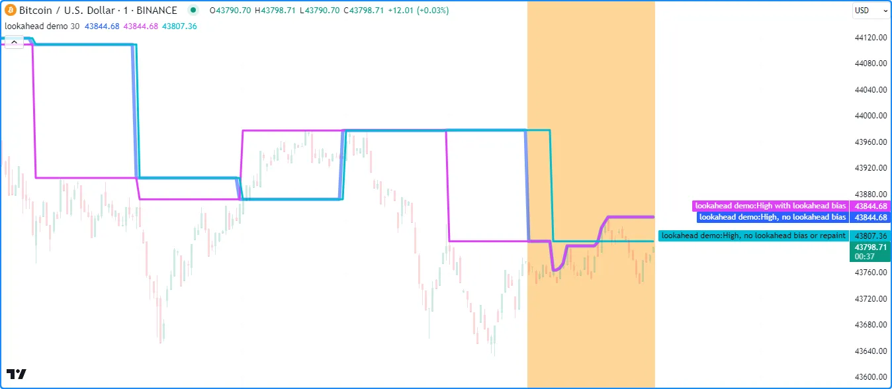

```c
//@version=5
indicator("lookahead demo", overlay = true)

//@variable The timeframe to request the data from.
string timeframe = input.timeframe("30", "Timeframe")

//@variable The requested `high` price from the current symbol on the `timeframe` without lookahead bias.
//          On realtime bars, it returns the current `high` of the `timeframe`.
float lookaheadOff = request.security(syminfo.tickerid, timeframe, high, lookahead = barmerge.lookahead_off)

//@variable The requested `high` price from the current symbol on the `timeframe` with lookahead bias.
//          Returns values that should NOT be accessible yet on historical bars.
float lookaheadOn = request.security(syminfo.tickerid, timeframe, high, lookahead = barmerge.lookahead_on)

//@variable The requested `high` price from the current symbol on the `timeframe` without lookahead bias or repainting.
//          Behaves the same on historical and realtime bars.
float lookaheadOnOffset = request.security(syminfo.tickerid, timeframe, high[1], lookahead = barmerge.lookahead_on)

// Plot the values.
plot(lookaheadOff, "High, no lookahead bias", color.new(color.blue, 40), 5)
plot(lookaheadOn, "High with lookahead bias", color.fuchsia, 3)
plot(lookaheadOnOffset, "High, no lookahead bias or repaint", color.aqua, 3)
// Highlight the background on realtime bars.
bgcolor(barstate.isrealtime ? color.new(color.orange, 60) : na, title = "Realtime bar highlight")
```

__Note que:__

- A série solicitada usando [barmerge.lookahead_off](https://br.tradingview.com/pine-script-reference/v5/#var_barmerge.lookahead_off) tem um novo valor histórico no _final_ de cada timeframe HTF, e ambas as séries solicitadas usando [barmerge.lookahead_on](https://br.tradingview.com/pine-script-reference/v5/#var_barmerge.lookahead_on) têm novos dados históricos no _início_ de cada timeframe.
- Em barras em tempo real, o plot da série sem lookahead ([blue](https://br.tradingview.com/pine-script-reference/v5/#var_color.blue)) e a série com lookahead e sem deslocamento histórico ([fuchsia](https://br.tradingview.com/pine-script-reference/v5/#var_color.fuchsia)) mostram o _mesmo valor_ (ou seja, o preço máximo não confirmado do timeframe HTF), pois não existem dados além desses pontos para vazar para o passado. Ambos esses plots __*repintarão*__ seus resultados após reiniciar a execução do script, pois as barras em [tempo real](https://br.tradingview.com/pine-script-reference/v5/#var_barstate.isrealtime) se tornarão barras [históricas](https://br.tradingview.com/pine-script-reference/v5/#var_barstate.ishistory).
- A série que usa lookahead e um deslocamento histórico ([aqua](https://br.tradingview.com/pine-script-reference/v5/#var_color.aqua)) não repinta seus valores, pois sempre referencia o último valor _confirmado_ do timeframe superior. Veja a seção [Evitando Repintura](./05_14_outros_timeframes_e_dados.md#evitando-repintura) desta página para mais informações.

> __Observação!__\
> No Pine Script v1 e v2, a função `security()` não incluía um parâmetro `lookahead`, mas se comportava como nas versões posteriores do Pine com `lookahead = barmerge.lookahead_on`, o que significa que sistematicamente usava dados do contexto HTF futuro em barras históricas. Portanto, deve-se _ter cautela_ com scripts do Pine v1 ou v2 que usam chamadas `security()` HTF, a menos que as chamadas da função contenham deslocamentos históricos.


# Feeds de Dados

Os provedores de dados do TradingView fornecem diferentes feeds de dados que scripts podem acessar para recuperar informações sobre um instrumento, incluindo:

- Dados históricos intradiários (para timeframe < 1D).
- Dados históricos de fim de dia _End-of-day (EOD)_ (para timeframe >= 1D).
- Dados em tempo real (que podem estar atrasados, dependendo do tipo de conta e dos serviços de dados adicionais).
- Dados de horas estendidas.

Nem todos esses tipos de feeds de dados existem para todos os instrumentos. Por exemplo, o símbolo "BNC:BLX" possui apenas dados EOD disponíveis.

Para alguns instrumentos com feeds históricos intradiários e EOD, os dados de volume podem não ser os mesmos, pois algumas negociações (negociações em bloco, negociações OTC, etc.) podem estar disponíveis apenas no _fim_ do dia de negociação. Consequentemente, o feed EOD incluirá esses dados de volume, mas o feed intradiário não. As diferenças entre os feeds de volume EOD e intradiário são quase inexistentes para instrumentos como criptomoedas, mas são comuns em ações.

Pequenas discrepâncias de preço também podem ocorrer entre os feeds EOD e intradiário. Por exemplo, o valor máximo em uma barra EOD pode não corresponder a nenhum valor máximo intradiário fornecido pelo provedor de dados para aquele dia.

Outra distinção entre os feeds de dados EOD e intradiário é que os feeds EOD não contêm informações de __*horas estendidas*__.

Ao recuperar informações em barras em tempo real com funções `request.*()`, é importante notar que os dados históricos e em tempo real relatados para um instrumento frequentemente dependem de feeds de dados _diferentes_. Um corretor/bolsa pode modificar retroativamente os valores relatados em barras em tempo real, o que os dados refletirão apenas após atualizar o gráfico ou reiniciar a execução do script.

Outra consideração importante é que os feeds de dados do gráfico e os feeds solicitados de provedores pelo script são gerenciados por processos independentes e concorrentes. Consequentemente, em alguns casos _raros_, é possível que ocorram disputas onde os resultados solicitados temporariamente fiquem fora de sincronia com o gráfico em uma barra em tempo real, o que um script ajusta retroativamente após reiniciar sua execução.

Esses pontos podem explicar variações nos valores recuperados pelas funções `request.*()` ao solicitar dados de outros contextos. Também podem resultar em discrepâncias entre os dados recebidos em barras em tempo real e barras históricas. Não há regras rígidas sobre as variações que podem ser encontradas em seus feeds de dados solicitados.

> __Observação!__\
> Como regra, o TradingView _não_ gera dados; ele depende de seus provedores de dados para as informações exibidas nos gráficos e acessadas por scripts.

Ao usar feeds de dados solicitados de outros contextos, também é crucial considerar as diferenças de _eixo de tempo_ entre o gráfico em que o script é executado e os feeds solicitados, pois as funções `request.*()` adaptam a série retornada ao eixo de tempo do gráfico. Por exemplo, solicitar dados "BTCUSD" no gráfico "SPY" com [request.security()](https://br.tradingview.com/pine-script-reference/v5/#fun_request.security) mostrará novos valores apenas quando o gráfico "SPY" tiver novos dados também. Como "SPY" não é um símbolo 24 horas, os dados "BTCUSD" retornados conterão lacunas que não estão presentes ao visualizar seu gráfico diretamente.

## `request.security()`

A função [request.security()](https://br.tradingview.com/pine-script-reference/v5/#fun_request.security) permite que scripts solicitem dados de outros contextos além do gráfico no qual o script está sendo executado, como:

- Outros símbolos, incluindo [símbolos de spread](https://br.tradingview.com/support/solutions/43000502298).
- Outros timeframes (veja a página sobre [Timeframes](./05_22_timeframes.md) para aprender sobre especificações de timeframes no Pine Script).
- [Contextos Personalizados](./05_14_outros_timeframes_e_dados.md#contextos-personalizados), incluindo sessões alternativas, ajustes de preço, tipos de gráficos, etc..., usando funções `ticker.*()`.

Esta é a assinatura da função:

```c
request.security(symbol, timeframe, expression, gaps, lookahead, ignore_invalid_symbol, currency, calc_bars_count) → series <type>
```

O valor `symbol` é o identificador do ticker que representa o símbolo de onde buscar os dados. Este parâmetro aceita valores em qualquer um dos seguintes formatos:

- Uma "string" representando um símbolo (por exemplo, "IBM" ou "EURUSD") ou um _par "Exchange:Symbol"_ (por exemplo, "NYSE:IBM" ou "OANDA:EURUSD"). Quando o valor não contém um prefixo de bolsa, a função seleciona a bolsa automaticamente. Recomenda-se especificar o prefixo da bolsa sempre que possível para resultados consistentes. Pode-se também passar uma string vazia para este parâmetro, o que faz com que a função use o símbolo do gráfico atual.
- Uma "string" representando um [símbolo spread](https://br.tradingview.com/support/solutions/43000502298) (por exemplo, "AMD/INTC"). Note que o modo "Bar Replay" não funciona com esses símbolos.
- As variáveis embutidas [syminfo.ticker](https://br.tradingview.com/pine-script-reference/v5/#var_syminfo.ticker) ou [syminfo.tickerid](https://br.tradingview.com/pine-script-reference/v5/#var_syminfo.tickerid), que retornam o símbolo ou o _par "Exchange:Symbol"_ que o gráfico atual referencia. Recomenda-se usar [syminfo.tickerid](https://br.tradingview.com/pine-script-reference/v5/#var_syminfo.tickerid) para evitar ambiguidades, a menos que a informação da bolsa não importe na solicitação de dados. Para mais informações sobre variáveis `syminfo.*`, veja [esta seção](./05_06_informacoes_do_grafico.md#informações-do-símbolo) da página de [Informações do Gráfico](./05_06_informacoes_do_grafico.md).
- Um identificador de ticker personalizado criado usando funções `ticker.*()`. IDs de ticker construídos a partir dessas funções podem conter configurações adicionais para solicitar dados usando cálculos de [gráficos não padronizados](./05_13_dados_de_graficos_nao_padronizados.md), sessões alternativas e outros contextos. Veja a seção de [Contextos Personalizados](./05_14_outros_timeframes_e_dados.md#contextos-personalizados) para mais informações.

O valor `timeframe` especifica o timeframe dos dados solicitados. Este parâmetro aceita valores "string" no formato de [especificação de timeframe](./05_22_timeframes.md#especificações-de-string-do-timeframe) (por exemplo, um valor de "1D" representa o timeframe diário). Para solicitar dados do mesmo timeframe do gráfico em que o script é executado, use a variável [timeframe.period](https://br.tradingview.com/pine-script-reference/v5/#var_timeframe.period) ou uma string vazia.

O parâmetro `expression` da função [request.security()](https://br.tradingview.com/pine-script-reference/v5/#fun_request.security) determina os dados que ela recupera do contexto especificado. Este parâmetro versátil aceita valores "series" dos tipos [int](./04_09_tipagem_do_sistema.md#int), [float](./04_09_tipagem_do_sistema.md#float), [bool](./04_09_tipagem_do_sistema.md#bool), [color](./04_09_tipagem_do_sistema.md#color), [string](./04_09_tipagem_do_sistema.md#string), e [chart.point](./04_09_tipagem_do_sistema.md#chart-points-pontos-do-gráfico). Também pode aceitar [tuplas](./04_09_tipagem_do_sistema.md#tuples-tuplas), [coleções](./04_09_tipagem_do_sistema.md#coleções), [tipos definidos pelo usuário](./04_09_tipagem_do_sistema.md#tipos-definidos-pelo-usuário), e as saídas de chamadas de funções e [métodos](./04_13_metodos.md). Para mais detalhes sobre os dados que podem ser recuperados, veja a seção de [Dados Solicitáveis](./05_14_outros_timeframes_e_dados.md#dados-solicitáveis) abaixo.

> __Observação!__\
> Ao usar o valor de uma chamada [input.source()](https://br.tradingview.com/pine-script-reference/v5/#fun_input.source) no argumento `expression` e a entrada referenciar uma série de outro indicador, as funções `request.*()` calculam os resultados desse valor usando o __símbolo do gráfico__, independentemente do argumento `symbol` fornecido, pois não podem avaliar os escopos exigidos por uma série externa. Portanto, não se recomenda tentar solicitar dados de entrada de fonte externa de outros contextos.


# Timeframes

A função [request.security()](https://br.tradingview.com/pine-script-reference/v5/#fun_request.security) pode solicitar dados de qualquer timeframe disponível, independentemente do gráfico em que o script está sendo executado. O timeframe dos dados recuperados depende do argumento `timeframe` na chamada da função, que pode representar um timeframe superior (por exemplo, usando "1D" como valor de `timeframe` enquanto o script é executado em um gráfico intradiário) ou o timeframe do gráfico (ou seja, usando [timeframe.period](https://br.tradingview.com/pine-script-reference/v5/#var_timeframe.period) ou uma string vazia como argumento `timeframe`).

Scripts também podem solicitar dados _limitados_ de timeframes inferiores com [request.security()](https://br.tradingview.com/pine-script-reference/v5/#fun_request.security) (por exemplo, usando "1" como argumento `timeframe` enquanto o script é executado em um gráfico de 60 minutos). No entanto, não é recomendado usar esta função para solicitações de dados LTF. A função [request.security_lower_tf()](https://br.tradingview.com/pine-script-reference/v5/#fun_request.security_lower_tf) é mais adequada para esses casos.

## Timeframes Superiores

A maioria dos casos de uso de [request.security()](https://br.tradingview.com/pine-script-reference/v5/#fun_request.security) envolve solicitar dados de um timeframe superior ou igual ao timeframe do gráfico. Por exemplo, este script recupera o preço [hl2](https://br.tradingview.com/pine-script-reference/v5/#var_hl2) de um `higherTimeframe` solicitado. Ele [plota](./05_15_plots.md) a série resultante no gráfico ao lado do [hl2](https://br.tradingview.com/pine-script-reference/v5/#var_hl2) do gráfico atual para comparação:

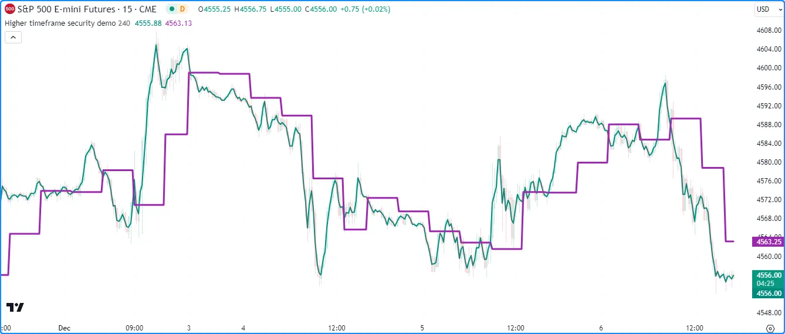

```c
//@version=5
indicator("Higher timeframe security demo", overlay = true)

//@variable The higher timeframe to request data from.
string higherTimeframe = input.timeframe("240", "Higher timeframe")

//@variable The `hl2` value from the `higherTimeframe`. Combines lookahead with an offset to avoid repainting.
float htfPrice = request.security(syminfo.tickerid, higherTimeframe, hl2[1], lookahead = barmerge.lookahead_on)

// Plot the `hl2` from the chart timeframe and the `higherTimeframe`.
plot(hl2, "Current timeframe HL2", color.teal, 2)
plot(htfPrice, "Higher timeframe HL2", color.purple, 3)
```

__Note que:__

- Foi incluído um "_deslocamento_" ("_offset_") no argumento `expression` e usado [barmerge.lookahead_on](https://br.tradingview.com/pine-script-reference/v5/#var_barmerge.lookahead_on) em [request.security()](https://br.tradingview.com/pine-script-reference/v5/#fun_request.security) para garantir que a série retornada se comporte da mesma forma em barras históricas e em tempo real. Veja a seção [Evitando Repintura](./05_14_outros_timeframes_e_dados.md#evitando-repintura) para mais informações.

Note que no exemplo acima, é possível selecionar um valor de `higherTimeframe` que na verdade representa um _timeframe inferior_ ao usado pelo gráfico, pois o código não impede isso. Ao projetar um script para funcionar especificamente com timeframes superiores, recomenda-se incluir condições para evitar o acesso a timeframes inferiores, especialmente se houver intenção de [publicar](./06_04_publicando_scripts.md) o script.

Abaixo, foi adicionada uma estrutura [if](https://br.tradingview.com/pine-script-reference/v5/#kw_if) ao exemplo anterior que gera um [runtime error](https://br.tradingview.com/pine-script-reference/v5/#fun_runtime.error) ("_erro de tempo de execução_") quando a entrada `higherTimeframe` representa um timeframe menor que o timeframe do gráfico, evitando efetivamente que o script solicite dados LTF:

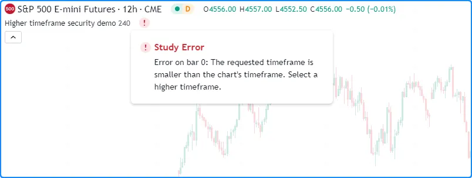

```c
//@version=5
indicator("Higher timeframe security demo", overlay = true)

//@variable The higher timeframe to request data from.
string higherTimeframe = input.timeframe("240", "Higher timeframe")

// Raise a runtime error when the `higherTimeframe` is smaller than the chart's timeframe.
if timeframe.in_seconds() > timeframe.in_seconds(higherTimeframe)
    runtime.error("The requested timeframe is smaller than the chart's timeframe. Select a higher timeframe.")

//@variable The `hl2` value from the `higherTimeframe`. Combines lookahead with an offset to avoid repainting.
float htfPrice = request.security(syminfo.tickerid, higherTimeframe, hl2[1], lookahead = barmerge.lookahead_on)

// Plot the `hl2` from the chart timeframe and the `higherTimeframe`.
plot(hl2, "Current timeframe HL2", color.teal, 2)
plot(htfPrice, "Higher timeframe HL2", color.purple, 3)
```

## Timeframes Inferiores

Embora a função [request.security()](https://br.tradingview.com/pine-script-reference/v5/#fun_request.security) seja destinada a operar em timeframes maiores ou iguais ao timeframe do gráfico, ela _pode_ solicitar dados de timeframes inferiores também, com limitações. Ao chamar essa função para acessar um timeframe inferior, ela avaliará a `expression` a partir do contexto LTF. No entanto, ela só pode retornar os resultados de uma única intrabar (barra LTF) em cada barra do gráfico.

A intrabar da qual a função retorna dados em cada barra histórica do gráfico depende do valor `lookahead` na chamada da função. Ao usar [barmerge.lookahead_on](https://br.tradingview.com/pine-script-reference/v5/#var_barmerge.lookahead_on), ela retornará a _primeira_ intrabar disponível do timeframe gráfico. Ao usar [barmerge.lookahead_off](https://br.tradingview.com/pine-script-reference/v5/#var_barmerge.lookahead_off), ela retornará a _última_ intrabar do timeframe gráfico. Em barras em tempo real, ela retorna o último valor disponível da `expression` do timeframe, independentemente do valor `lookahead`, pois as informações da intrabar em tempo real recuperadas pela função ainda não estão ordenadas.

Este script recupera dados de [fechamento](https://br.tradingview.com/pine-script-reference/v5/#var_close) do timeframe válido mais próximo a um quarto do tamanho do timeframe do gráfico. Ele faz duas chamadas para [request.security()](https://br.tradingview.com/pine-script-reference/v5/#fun_request.security) com valores `lookahead` diferentes. A primeira chamada usa [barmerge.lookahead_on](https://br.tradingview.com/pine-script-reference/v5/#var_barmerge.lookahead_on) para acessar o primeiro valor intrabar em cada barra do gráfico. A segunda usa o valor padrão `lookahead` ([barmerge.lookahead_off](https://br.tradingview.com/pine-script-reference/v5/#var_barmerge.lookahead_off)), que solicita o último valor intrabar atribuído a cada barra do gráfico. O script [plota](./05_15_plots.md) as saídas de ambas as chamadas no gráfico para comparar a diferença:

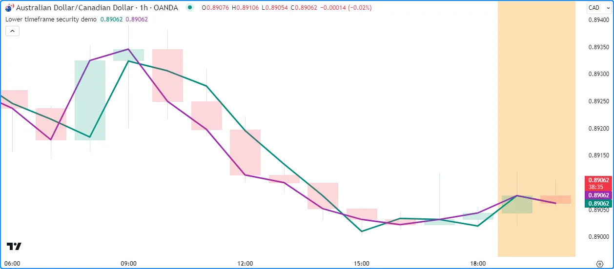

```c
//@version=5
indicator("Lower timeframe security demo", overlay = true)

//@variable The valid timeframe closest to 1/4 the size of the chart timeframe.
string lowerTimeframe = timeframe.from_seconds(int(timeframe.in_seconds() / 4))

//@variable The `close` value on the `lowerTimeframe`. Represents the first intrabar value on each chart bar.
float firstLTFClose = request.security(syminfo.tickerid, lowerTimeframe, close, lookahead = barmerge.lookahead_on)
//@variable The `close` value on the `lowerTimeframe`. Represents the last intrabar value on each chart bar.
float lastLTFClose = request.security(syminfo.tickerid, lowerTimeframe, close)

// Plot the values.
plot(firstLTFClose, "First intrabar close", color.teal, 3)
plot(lastLTFClose, "Last intrabar close", color.purple, 3)
// Highlight the background on realtime bars.
bgcolor(barstate.isrealtime ? color.new(color.orange, 70) : na, title = "Realtime background highlight")
```

__Note que:__

- O script determina o valor de `lowerTimeframe` calculando o número de segundos no timeframe do gráfico com [timeframe.in_seconds()](https://br.tradingview.com/pine-script-reference/v5/#fun_timeframe.in_seconds), depois dividindo por quatro e convertendo o resultado para uma [string de timeframe válida](./05_22_timeframes.md#especificações-de-string-do-timeframe) via [timeframe.from_seconds()](https://br.tradingview.com/pine-script-reference/v5/#fun_timeframe.from_seconds).
- O plot da série sem lookahead ([purple](https://br.tradingview.com/pine-script-reference/v5/#var_color.purple)) alinha-se com o valor de [fechamento](https://br.tradingview.com/pine-script-reference/v5/#var_close) no timeframe do gráfico, pois este é o último valor intrabar na barra do gráfico.
- Ambas as chamadas de [request.security()](https://br.tradingview.com/pine-script-reference/v5/#fun_request.security) retornam o _mesmo_ valor (o [fechamento](https://br.tradingview.com/pine-script-reference/v5/#var_close) atual) em cada barra [realtime](https://br.tradingview.com/pine-script-reference/v5/#var_barstate.isrealtime), como mostrado nas barras com o fundo [orange](https://br.tradingview.com/pine-script-reference/v5/#var_color.orange).
- Scripts podem recuperar até 100.000 intrabars de um contexto de timeframe inferior. Veja [esta](./06_05_limitacoes.md#intrabars) seção da página de [Limitações](./06_05_limitacoes.md).

> __Observação!__\
> Embora scripts possam usar [request.security()](https://br.tradingview.com/pine-script-reference/v5/#fun_request.security) para recuperar os valores de uma única intrabar em cada barra do gráfico, o que pode ser útil em alguns casos únicos, recomenda-se usar a função [request.security_lower_tf()](https://br.tradingview.com/pine-script-reference/v5/#fun_request.security_lower_tf) para análise intrabar sempre que possível, pois ela retorna um [array](https://br.tradingview.com/pine-script-reference/v5/#type_array) contendo dados de _todas_ as intrabars disponíveis dentro de uma barra do gráfico. Veja [esta seção](./05_14_outros_timeframes_e_dados.md#requestsecurity_lower_tf) para mais informações.


# Dados Solicitáveis

A função [request.security()](https://br.tradingview.com/pine-script-reference/v5/#fun_request.security) é bastante versátil, pois pode recuperar valores de qualquer tipo fundamental ([int](./04_09_tipagem_do_sistema.md#int), [float](./04_09_tipagem_do_sistema.md#float), [bool](./04_09_tipagem_do_sistema.md#bool), [color](./04_09_tipagem_do_sistema.md#color), ou [string](./04_09_tipagem_do_sistema.md#string)). Ela também pode solicitar IDs de estruturas de dados e tipos embutidos ou [definidos pelo usuário](./04_09_tipagem_do_sistema.md#tipos-definidos-pelo-usuário) que referenciam tipos fundamentais. Os dados que essa função solicita dependem do parâmetro `expression`, que aceita qualquer um dos seguintes argumentos:

- [Variáveis incorporadas e chamadas de função.](./05_14_outros_timeframes_e_dados.md#variáveis-e-funções-embutidas)
- [Variáveis calculadas pelo script.](./05_14_outros_timeframes_e_dados.md#variáveis-calculadas)
- [Tuplas.](./05_14_outros_timeframes_e_dados.md#tuples-tuplas)
- [Chamadas de funções definidas pelo usuário.](./05_14_outros_timeframes_e_dados.md#funções-definidas-pelo-usuário)
- [Pontos do gráfico.](./05_14_outros_timeframes_e_dados.md#pontos-do-gráfico)
- [Coleções.](./05_14_outros_timeframes_e_dados.md#coleções)
- [Tipos definidos pelo usuário.](./05_14_outros_timeframes_e_dados.md#tipos-definidos-pelo-usuário)

> __Observação!__\
> A função [request.security()](https://br.tradingview.com/pine-script-reference/v5/#fun_request.security) duplica os escopos e operações necessários para a `expression` calcular os valores solicitados em outro contexto, o que aumenta o consumo de memória em tempo de execução. Além disso, os escopos adicionais produzidos por cada chamada de [request.security()](https://br.tradingview.com/pine-script-reference/v5/#fun_request.security) contam para os _limites de compilação_ do script. Consulte a seção [Contagem de escopos](./06_05_limitacoes.md#contagem-de-escopos) da página de [Limitações](./06_05_limitacoes.md) para mais informações.

## Variáveis e Funções Embutidas

Um caso de uso frequente de [request.security()](https://br.tradingview.com/pine-script-reference/v5/#fun_request.security) é solicitar a saída de uma variável incorporada ou chamada de função/[método](./04_13_metodos.md) de outro símbolo ou timeframe.

Por exemplo, para calcular a [SMA](https://br.tradingview.com/pine-script-reference/v5/#fun_ta.sma) de 20 barras do preço [ohlc4](https://br.tradingview.com/pine-script-reference/v5/#var_ohlc4) de um símbolo do timeframe diário enquanto se está em um gráfico intradiário, pode-se realizar isso com uma única linha de código:

```c
float ma = request.security(syminfo.tickerid, "1D", ta.sma(ohlc4, 20))
```

A linha acima calcula o valor de [ta.sma(ohlc4, 20)](https://br.tradingview.com/pine-script-reference/v5/#fun_ta.sma) no símbolo atual a partir do timeframe diário.

É importante notar que iniciantes no Pine podem confundir a linha de código acima como equivalente à seguinte:

```c
float ma = ta.sma(request.security(syminfo.tickerid, "1D", ohlc4), 20)
```

No entanto, essa linha retornará um resultado completamente _diferente_. Em vez de solicitar uma SMA de 20 barras do timeframe diário, ela solicita o preço [ohlc4](https://br.tradingview.com/pine-script-reference/v5/#var_ohlc4) do timeframe diário e calcula a [ta.sma()](https://br.tradingview.com/pine-script-reference/v5/#fun_ta.sma) dos resultados ao longo de 20 __barras do gráfico__.

Em essência, quando a intenção é solicitar os resultados de uma expressão de outros contextos, passe a expressão _diretamente_ para o parâmetro `expression` na chamada [request.security()](https://br.tradingview.com/pine-script-reference/v5/#fun_request.security), conforme demonstrado no exemplo inicial.

Explicando esse conceito: o script abaixo calcula uma faixa de médias móveis em múltiplos timeframes (_multi-timeframe (MTF)_), onde cada média móvel na faixa é calculada sobre o mesmo número de barras em seu respectivo timeframe. Cada chamada [request.security()](https://br.tradingview.com/pine-script-reference/v5/#fun_request.security) usa [ta.sma(close, length)](https://br.tradingview.com/pine-script-reference/v5/#fun_ta.sma) como seu argumento `expression` para retornar uma SMA de `length` barras do timeframe especificado:

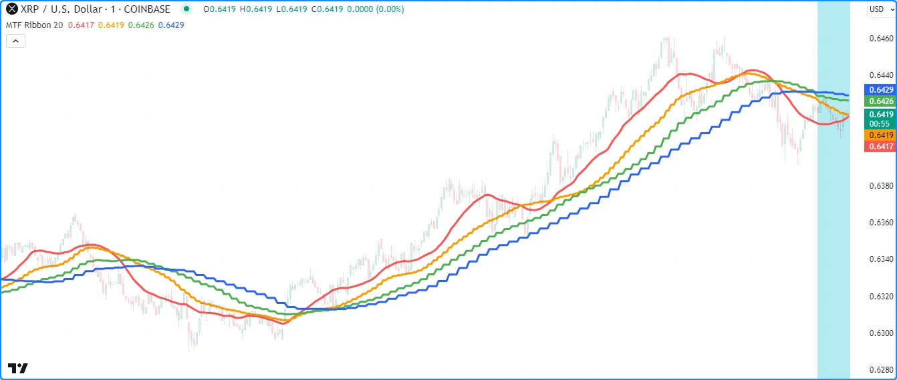

```c
//@version=5
indicator("Requesting built-ins demo", "MTF Ribbon", true)

//@variable The length of each moving average.
int length = input.int(20, "Length", 1)

//@variable The number of seconds in the chart timeframe.
int chartSeconds = timeframe.in_seconds()

// Calculate the higher timeframes closest to 2, 3, and 4 times the size of the chart timeframe.
string htf1 = timeframe.from_seconds(chartSeconds * 2)
string htf2 = timeframe.from_seconds(chartSeconds * 3)
string htf3 = timeframe.from_seconds(chartSeconds * 4)

// Calculate the `length`-bar moving averages from each timeframe.
float chartAvg = ta.sma(ohlc4, length)
float htfAvg1  = request.security(syminfo.tickerid, htf1, ta.sma(ohlc4, length))
float htfAvg2  = request.security(syminfo.tickerid, htf2, ta.sma(ohlc4, length))
float htfAvg3  = request.security(syminfo.tickerid, htf3, ta.sma(ohlc4, length))

// Plot the results.
plot(chartAvg, "Chart timeframe SMA", color.red, 3)
plot(htfAvg1, "Double timeframe SMA", color.orange, 3)
plot(htfAvg2, "Triple timeframe SMA", color.green, 3)
plot(htfAvg3, "Quadruple timeframe SMA", color.blue, 3)

// Highlight the background on realtime bars.
bgcolor(barstate.isrealtime ? color.new(color.aqua, 70) : na, title = "Realtime highlight")
```

__Note que:__

- O script calcula os timeframes mais altos da faixa multiplicando o valor de [timeframe.in_seconds()](https://br.tradingview.com/pine-script-reference/v5/#fun_timeframe.in_seconds) do gráfico por 2, 3 e 4, convertendo cada resultado em uma [string de timeframe válida](./05_22_timeframes.md#especificações-de-string-do-timeframe) usando [timeframe.from_seconds()](https://br.tradingview.com/pine-script-reference/v5/#fun_timeframe.from_seconds).
- Em vez de chamar [ta.sma()](https://br.tradingview.com/pine-script-reference/v5/#fun_ta.sma) dentro de cada chamada [request.security()](https://br.tradingview.com/pine-script-reference/v5/#fun_request.security), poderia-se usar a variável `chartAvg` como `expression` em cada chamada para obter o mesmo resultado. Veja a [próxima seção](./05_14_outros_timeframes_e_dados.md#variáveis-calculadas) para mais informações.
- Em barras em tempo real, este script também rastreia valores de SMA _não confirmados_ de cada timeframe mais alto. Veja a seção [Comportamento histórico e em tempo real](./05_14_outros_timeframes_e_dados.md#comportamento-histórico-e-tempo-real) para saber mais.

## Variáveis Calculadas

O parâmetro `expression` de [request.security()](https://br.tradingview.com/pine-script-reference/v5/#fun_request.security) aceita variáveis declaradas no escopo global, permitindo que scripts avaliem os cálculos de suas variáveis em outros contextos sem listar as operações de forma redundante em cada chamada de função.

Por exemplo, pode-se declarar a seguinte variável:

```c
priceReturn = (close - close[1]) / close[1]
```

E executar o cálculo da variável a partir de outro contexto com [request.security()](https://br.tradingview.com/pine-script-reference/v5/#fun_request.security):

```c
requestedReturn = request.security(symbol, timeframe.period, priceReturn)
```

A chamada da função na linha acima retornará o resultado do cálculo de `priceReturn` nos dados de outro `symbol` como uma série adaptada ao gráfico atual, que o script pode exibir diretamente no gráfico ou utilizar em operações adicionais.

O exemplo a seguir compara os retornos de preço do símbolo do gráfico atual e de outro `symbol` especificado. O script declara a variável `priceReturn` no contexto do gráfico, depois usa essa variável em [request.security()](https://br.tradingview.com/pine-script-reference/v5/#fun_request.security) para avaliar seu cálculo em outro `symbol`. Em seguida, calcula a [correlação](https://br.tradingview.com/pine-script-reference/v5/#fun_ta.correlation) entre `priceReturn` e `requestedReturn` e [plota](./05_15_plots.md) o resultado no gráfico:

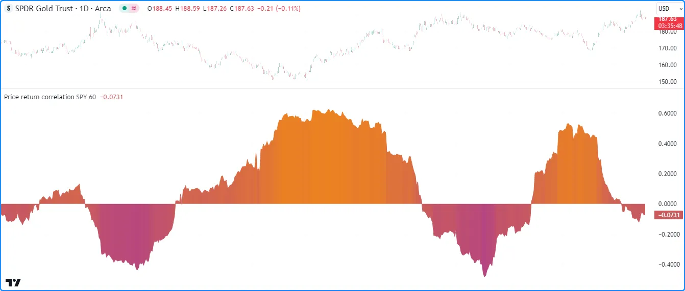

```c
//@version=5
indicator("Requesting calculated variables demo", "Price return correlation")

//@variable The symbol to compare to the chart symbol.
string symbol = input.symbol("SPY", "Symbol to compare")
//@variable The number of bars in the calculation window.
int length = input.int(60, "Length", 1)

//@variable The close-to-close price return.
float priceReturn = (close - close[1]) / close[1]
//@variable The close-to-close price return calculated on another `symbol`.
float requestedReturn = request.security(symbol, timeframe.period, priceReturn)

//@variable The correlation between the `priceReturn` and `requestedReturn` over `length` bars.
float correlation = ta.correlation(priceReturn, requestedReturn, length)
//@variable The color of the correlation plot.
color plotColor = color.from_gradient(correlation, -1, 1, color.purple, color.orange)

// Plot the correlation value.
plot(correlation, "Correlation", plotColor, style = plot.style_area)
```

__Note que:__

- A chamada [request.security()](https://br.tradingview.com/pine-script-reference/v5/#fun_request.security) executa o mesmo cálculo usado na declaração de `priceReturn`, exceto que utiliza os valores de [fechamento](https://br.tradingview.com/pine-script-reference/v5/#var_close) obtidos do `symbol` de entrada.
- O script colore o gráfico com um [gradiente](https://br.tradingview.com/pine-script-reference/v5/#fun_color.from_gradient) baseado no valor de `correlation`. Para saber mais sobre gradientes de cores no Pine, consulte [esta](./05_07_cores.md#colorfrom_gradient) seção da página do Manual do Usuário sobre [cores](./05_07_cores.md).

## Tuples (_Tuplas_)

[Tuplas](./04_09_tipagem_do_sistema.md#tuples-tuplas) no Pine Script são conjuntos de expressões separados por vírgula, delimitados por colchetes, que podem conter múltiplos valores de qualquer tipo disponível. Usam-se tuplas ao criar funções ou outros blocos locais que retornam mais de um valor.

A função [request.security()](https://br.tradingview.com/pine-script-reference/v5/#fun_request.security) pode aceitar uma tupla como seu argumento `expression`, permitindo que scripts solicitem múltiplas séries de diferentes tipos em uma única chamada de função. As expressões dentro das tuplas solicitadas podem ser de qualquer tipo descrito na seção [Dados Solicitáveis](./05_14_outros_timeframes_e_dados.md#dados-solicitáveis) desta página, excluindo outras tuplas.

> __Observação!__\
> O tamanho combinado de todas as tuplas retornadas pelas chamadas `request.*()` em um script não pode exceder 127 elementos. Veja [esta seção](./06_05_limitacoes.md#limite-de-elementos-da-tupla) da página de [Limitações](./06_05_limitacoes.md) para mais informações.

As tuplas são especialmente úteis quando um script precisa recuperar mais de um valor de um contexto específico.

Por exemplo, este script calcula o [percentual de ranking](https://br.tradingview.com/pine-script-reference/v5/#fun_ta.percentrank) do preço de [fechamento](https://br.tradingview.com/pine-script-reference/v5/#var_close) ao longo de `length` barras e atribui a expressão à variável `rank`. Em seguida, chama [request.security()](https://br.tradingview.com/pine-script-reference/v5/#fun_request.security) para solicitar uma tupla contendo os valores de `rank`, [ta.crossover(rank, 50)](https://br.tradingview.com/pine-script-reference/v5/#fun_ta.crossover) e [ta.crossunder(rank, 50)](https://br.tradingview.com/pine-script-reference/v5/#fun_ta.crossunder) do `timeframe` especificado. O script [plota](./05_15_plots.md) o `requestedRank` e usa os valores "bool" `crossOver` e `crossUnder` dentro de [bgcolor()](https://br.tradingview.com/pine-script-reference/v5/#fun_bgcolor) para destacar condicionalmente o fundo do painel do gráfico:

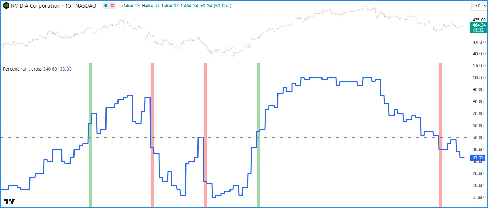

```c
//@version=5
indicator("Requesting tuples demo", "Percent rank cross")

//@variable The timeframe of the request.
string timeframe = input.timeframe("240", "Timeframe")
//@variable The number of bars in the calculation.
int length = input.int(20, "Length")

//@variable The previous bar's percent rank of the `close` price over `length` bars.
float rank = ta.percentrank(close, length)[1]

// Request the `rank` value from another `timeframe`, and two "bool" values indicating the `rank` from the `timeframe`
// crossed over or under 50.
[requestedRank, crossOver, crossUnder] = request.security(
     syminfo.tickerid, timeframe, [rank, ta.crossover(rank, 50), ta.crossunder(rank, 50)],
     lookahead = barmerge.lookahead_on
 )

// Plot the `requestedRank` and create a horizontal line at 50.
plot(requestedRank, "Percent Rank", linewidth = 3)
hline(50, "Cross line", linewidth = 2)
// Highlight the background of all bars where the `timeframe`'s `crossOver` or `crossUnder` value is `true`.
bgcolor(crossOver ? color.new(color.green, 50) : crossUnder ? color.new(color.red, 50) : na)
```

__Note que:__

- A expressão da variável `rank` foi deslocada por uma barra usando o operador de referência de histórico [[]](https://br.tradingview.com/pine-script-reference/v5/#op_%5B%5D) e incluído [barmerge.lookahead_on](https://br.tradingview.com/pine-script-reference/v5/#var_barmerge.lookahead_on) na chamada [request.security()](https://br.tradingview.com/pine-script-reference/v5/#fun_request.security) para garantir que os valores nas barras em tempo real não sejam repintados após se tornarem barras históricas. Veja a seção [Evitando Repintura](./05_14_outros_timeframes_e_dados.md#evitando-repintura) para mais informações.
- A chamada [request.security()](https://br.tradingview.com/pine-script-reference/v5/#fun_request.security) retorna uma tupla, portanto, é usada uma _declaração de tupla_ para declarar as variáveis `requestedRank`, `crossOver` e `crossUnder`. Para saber mais sobre o uso de tuplas, veja [esta seção](./04_09_tipagem_do_sistema.md#tuples-tuplas) sobre o [sistema de tipos](./04_09_tipagem_do_sistema.md).

## Funções Definidas pelo Usuário

[Funções Definidas pelo Usuário](./04_11_funcoes_definidas_pelo_usuario.md) e [métodos](./04_13_metodos.md#métodos-definidos-pelo-usuário) são funções personalizadas escritas por usuários. Elas permitem definir sequências de operações associadas a um identificador que os scripts podem chamar convenientemente durante sua execução (por exemplo, `myUDF()`).

A função [request.security()](https://br.tradingview.com/pine-script-reference/v5/#fun_request.security) pode solicitar os resultados de [Funções Definidas pelo Usuário](./04_11_funcoes_definidas_pelo_usuario.md) e [métodos](./04_13_metodos.md#métodos-definidos-pelo-usuário) cujos escopos consistem em qualquer tipo descrito na seção [Dados Solicitáveis](./05_14_outros_timeframes_e_dados.md#dados-solicitáveis) desta página.

Por exemplo, este script contém uma função definida pelo usuário `weightedBB()` que calcula Bandas de Bollinger com a base média ponderada por uma série `weight` especificada. A função retorna uma [tupla](./04_09_tipagem_do_sistema.md#tuples-tuplas) de valores personalizados das bandas. O script chama `weightedBB()` como o argumento `expression` em [request.security()](https://br.tradingview.com/pine-script-reference/v5/#fun_request.security) para recuperar uma [tupla](./05_14_outros_timeframes_e_dados.md#tuples-tuplas) de valores das bandas calculados no `timeframe` especificado e [plota](./05_15_plots.md) os resultados no gráfico:

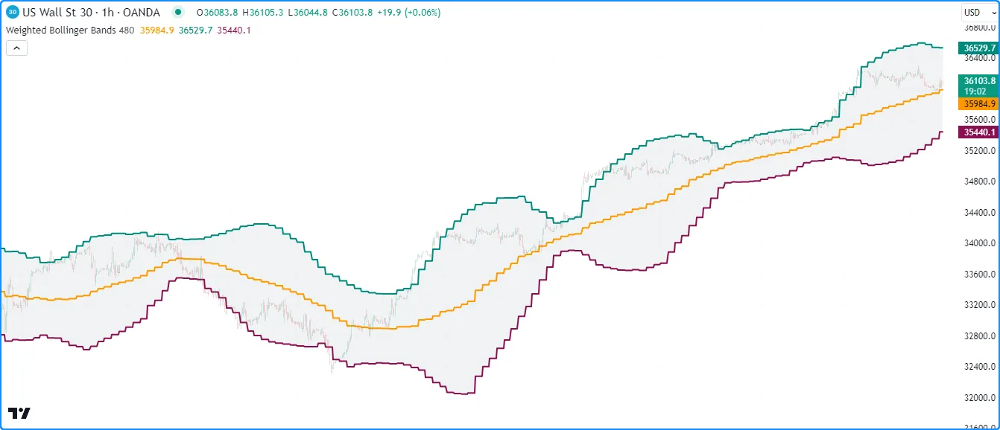

```c
//@version=5
indicator("Requesting user-defined functions demo", "Weighted Bollinger Bands", true)

//@variable The timeframe of the request.
string timeframe = input.timeframe("480", "Timeframe")

//@function     Calculates Bollinger Bands with a custom weighted basis.
//@param source The series of values to process.
//@param length The number of bars in the calculation.
//@param mult   The standard deviation multiplier.
//@param weight The series of weights corresponding to each `source` value.
//@returns      A tuple containing the basis, upper band, and lower band respectively.
weightedBB(float source, int length, float mult = 2.0, float weight = 1.0) =>
    //@variable The basis of the bands.
    float ma = math.sum(source * weight, length) / math.sum(weight, length)
    //@variable The standard deviation from the `ma`.
    float dev = 0.0
    // Loop to accumulate squared error.
    for i = 0 to length - 1
        difference = source[i] - ma
        dev += difference * difference
    // Divide `dev` by the `length`, take the square root, and multiply by the `mult`.
    dev := math.sqrt(dev / length) * mult
    // Return the bands.
    [ma, ma + dev, ma - dev]

// Request weighted bands calculated on the chart symbol's prices over 20 bars from the
// last confirmed bar on the `timeframe`.
[basis, highBand, lowBand] = request.security(
     syminfo.tickerid, timeframe, weightedBB(close[1], 20, 2.0, (high - low)[1]), lookahead = barmerge.lookahead_on
 )

// Plot the values.
basisPlot = plot(basis, "Basis", color.orange, 2)
upperPlot = plot(highBand, "Upper", color.teal, 2)
lowerPlot = plot(lowBand, "Lower", color.maroon, 2)
fill(upperPlot, lowerPlot, color.new(color.gray, 90), "Background")
```

__Note que:__

- Os argumentos `source` e `weight` na chamada `weightedBB()` usada como `expression` em [request.security()](https://br.tradingview.com/pine-script-reference/v5/#fun_request.security) são deslocados, e é utilizado [barmerge.lookahead_on](https://br.tradingview.com/pine-script-reference/v5/#var_barmerge.lookahead_on) para garantir que os resultados solicitados reflitam os últimos valores confirmados do `timeframe` nas barras em tempo real. Consulte [esta seção](./05_14_outros_timeframes_e_dados.md#evitando-repintura) para saber mais.

## Pontos do Gráfico

[Pontos do gráfico](./04_09_tipagem_do_sistema.md#chart-points-pontos-do-gráfico) são tipos de referência que representam coordenadas no gráfico. As [linhas](./05_12_lines_e_boxes.md#lines-linhas), [caixas](./05_12_lines_e_boxes.md#boxes-caixas), [polilinhas](./05_12_lines_e_boxes.md#polylines-polilinhas) e [labels](./05_20_text_e_shapes.md#labels) usam objetos [chart.point](https://br.tradingview.com/pine-script-reference/v5/#type_chart.point) para definir suas localizações de exibição.

A função [request.security()](https://br.tradingview.com/pine-script-reference/v5/#fun_request.security) pode usar o ID de uma instância de [chart.point](https://br.tradingview.com/pine-script-reference/v5/#type_chart.point) em seu argumento `expression`, permitindo que scripts recuperem coordenadas do gráfico de outros contextos.

O exemplo abaixo solicita uma tupla de [pontos do gráfico](./04_09_tipagem_do_sistema.md#chart-points-pontos-do-gráfico) históricos de um timeframe maior e os usa para desenhar [caixas](./05_12_lines_e_boxes.md#boxes-caixas) no gráfico. O script declara as variáveis `topLeft` e `bottomRight` que referenciam os IDs de [chart.point](https://br.tradingview.com/pine-script-reference/v5/#type_chart.point) da última barra confirmada. Em seguida, usa [request.security()](https://br.tradingview.com/pine-script-reference/v5/#fun_request.security) para solicitar uma [tupla](https://br.tradingview.com/pine-script-docs/concepts/other-timeframes-and-data#tuples) contendo os IDs dos [pontos do gráfico](./04_09_tipagem_do_sistema.md#chart-points-pontos-do-gráfico) representando `topLeft` e `bottomRight` de um `higherTimeframe`.

Quando uma nova barra começa no `higherTimeframe`, o script desenha uma [nova caixa](https://br.tradingview.com/pine-script-reference/v5/#fun_box.new) usando as coordenadas de `time` e `price` dos pontos do gráfico `requestedTopLeft` e `requestedBottomRight`:

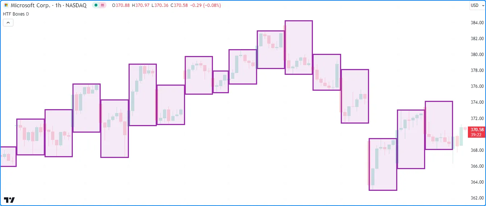

```c
//@version=5
indicator("Requesting chart points demo", "HTF Boxes", true, max_boxes_count = 500)

//@variable The timeframe to request data from.
string higherTimeframe = input.timeframe("1D", "Timeframe")

// Raise a runtime error if the `higherTimeframe` is smaller than the chart's timeframe.
if timeframe.in_seconds(higherTimeframe) < timeframe.in_seconds(timeframe.period)
    runtime.error("The selected timeframe is too small. Choose a higher timeframe.")

//@variable A `chart.point` containing top-left coordinates from the last confirmed bar.
topLeft = chart.point.now(high)[1]
//@variable A `chart.point` containing bottom-right coordinates from the last confirmed bar.
bottomRight = chart.point.from_time(time_close, low)[1]

// Request the last confirmed `topLeft` and `bottomRight` chart points from the `higherTimeframe`.
[requestedTopLeft, requestedBottomRight] = request.security(
     syminfo.tickerid, higherTimeframe, [topLeft, bottomRight], lookahead = barmerge.lookahead_on
 )

// Draw a new box when a new `higherTimeframe` bar starts.
// The box uses the `time` fields from the `requestedTopLeft` and `requestedBottomRight` as x-coordinates.
if timeframe.change(higherTimeframe)
    box.new(
         requestedTopLeft, requestedBottomRight, color.purple, 3, 
         xloc = xloc.bar_time, bgcolor = color.new(color.purple, 90)
     )
```

__Note que:__

- Este exemplo é projetado especificamente para timeframes maiores, é incluso um [erro de execução](https://br.tradingview.com/pine-script-reference/v5/#fun_runtime.error) personalizado que o script gera quando o [timeframe.in_seconds()](https://br.tradingview.com/pine-script-reference/v5/#fun_timeframe.in_seconds) do `higherTimeframe` é menor que o [timeframe do gráfico](https://br.tradingview.com/pine-script-reference/v5/#var_timeframe.period).

## Coleções

As _coleções_ do Pine Script ([arrays](./04_14_arrays.md) e [mapas](./04_16_mapas.md)) são estruturas de dados que contêm um número arbitrário de elementos com tipos especificados. A função [request.security()](https://br.tradingview.com/pine-script-reference/v5/#fun_request.security) pode recuperar os IDs de [coleções](./04_09_tipagem_do_sistema.md#coleções) cujos elementos consistem em:

- [Tipos fundamentais](./04_09_tipagem_do_sistema.md#tipos).
- [Pontos do gráfico](./04_09_tipagem_do_sistema.md#chart-points-pontos-do-gráfico).
- [Tipos definidos pelo usuário](./04_09_tipagem_do_sistema.md#tipos-definidos-pelo-usuário) que atendem aos critérios listados na [seção abaixo](./05_14_outros_timeframes_e_dados.md#tipos-definidos-pelo-usuário).

Este exemplo calcula o _ratio_ da variação alta-baixa de uma barra confirmada em relação à variação entre os valores [mais altos](https://br.tradingview.com/pine-script-reference/v5/#fun_ta.highest) e [mais baixos](https://br.tradingview.com/pine-script-reference/v5/#fun_ta.lowest) em 10 barras de um `symbol` e `timeframe` especificados. Ele usa [mapas](./04_16_mapas.md) para armazenar os valores usados nos cálculos.

O script cria um mapa `data` com chaves "string" e valores "float" para armazenar valores de preço de [high](https://br.tradingview.com/pine-script-reference/v5/#var_high), [low](https://br.tradingview.com/pine-script-reference/v5/#var_low), [highest](https://br.tradingview.com/pine-script-reference/v5/#fun_ta.highest) e [lowest](https://br.tradingview.com/pine-script-reference/v5/#fun_ta.lowest) em cada barra, que é usado como `expression` em [request.security()](https://br.tradingview.com/pine-script-reference/v5/#fun_request.security) para calcular um mapa `otherData` representando os `data` do contexto especificado. Ele usa os valores associados às chaves "high", "low", "highest" e "lowest" do mapa `otherData` para calcular o [_ratio_ que ele plota](./05_15_plots.md) no painel do gráfico:

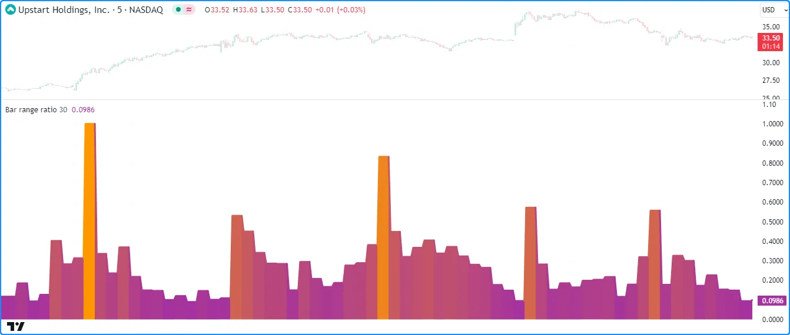

```c
//@version=5
indicator("Requesting collections demo", "Bar range ratio")

//@variable The ticker ID to request data from.
string symbol = input.symbol("", "Symbol")
//@variable The timeframe of the request.
string timeframe = input.timeframe("30", "Timeframe")

//@variable A map with "string" keys and "float" values.
var map<string, float> data = map.new<string, float>()

// Put key-value pairs into the `data` map.
map.put(data, "High", high)
map.put(data, "Low", low)
map.put(data, "Highest", ta.highest(10))
map.put(data, "Lowest", ta.lowest(10))

//@variable A new `map` whose data is calculated from the last confirmed bar of the requested context.
map<string, float> otherData = request.security(symbol, timeframe, data[1], lookahead = barmerge.lookahead_on)

//@variable The ratio of the context's bar range to the max range over 10 bars. Returns `na` if no data is available.
float ratio = na
if not na(otherData)
    ratio := (otherData.get("High") - otherData.get("Low")) / (otherData.get("Highest") - otherData.get("Lowest"))

//@variable A gradient color for the plot of the `ratio`.
color ratioColor = color.from_gradient(ratio, 0, 1, color.purple, color.orange)

// Plot the `ratio`.
plot(ratio, "Range Ratio", ratioColor, 3, plot.style_area)
```

__Note que:__

- A chamada [request.security()](https://br.tradingview.com/pine-script-reference/v5/#fun_request.security) neste script pode retornar [na](https://br.tradingview.com/pine-script-reference/v5/#var_na) se não houver dados disponíveis do contexto especificado. Como não é possível chamar [métodos](./04_13_metodos.md) em uma variável [map](https://br.tradingview.com/pine-script-reference/v5/#type_map) quando seu valor é [na](https://br.tradingview.com/pine-script-reference/v5/#var_na), foi adicionada uma estrutura [if](https://br.tradingview.com/pine-script-reference/v5/#kw_if) para calcular um novo valor de `ratio` apenas quando `otherData` referencia um ID [map](https://br.tradingview.com/pine-script-reference/v5/#type_map) válido.

## Tipos Definidos pelo Usuário

[Tipos Definidos pelo Usuário (UDTs)](./04_09_tipagem_do_sistema.md#tipos-definidos-pelo-usuário) são _tipos compostos_ que contêm um número arbitrário de _campos_, que podem ser de qualquer tipo disponível, incluindo outros [tipos definidos pelo usuário](./04_09_tipagem_do_sistema.md#tipos-definidos-pelo-usuário).

A função [request.security()](https://br.tradingview.com/pine-script-reference/v5/#fun_request.security) pode recuperar os IDs de [objetos](./04_12_objetos.md) produzidos por [UDTs](./04_09_tipagem_do_sistema.md#tipos-definidos-pelo-usuário) de outros contextos se seus campos consistirem em:

- [Tipos fundamentais](./04_09_tipagem_do_sistema.md#tipos).
- [Pontos do gráfico](./04_09_tipagem_do_sistema.md#chart-points-pontos-do-gráfico).
- [Coleções](./04_09_tipagem_do_sistema.md#coleções) que atendem aos critérios listados na [seção acima](./05_14_outros_timeframes_e_dados.md#coleções).
- Outros [UDTs](./04_09_tipagem_do_sistema.md#tipos-definidos-pelo-usuário) cujos campos consistem em qualquer um desses tipos.

O exemplo a seguir solicita um ID de [objeto](./04_12_objetos.md) usando um `symbol` especificado e exibe seus valores de campo em um painel do gráfico.

O script contém um UDT `TickerInfo` com campos "string" para valores `syminfo.*`, um campo [array](https://br.tradingview.com/pine-script-reference/v5/#type_array) para armazenar dados de preço recentes "float", e um campo "int" para manter o valor de [bar_index](https://br.tradingview.com/pine-script-reference/v5/#var_bar_index) do ticker solicitado. Ele atribui um novo ID `TickerInfo` a uma variável `info` em cada barra e usa essa variável como `expression` em [request.security()](https://br.tradingview.com/pine-script-reference/v5/#fun_request.security) para recuperar o ID de um [objeto](./04_12_objetos.md) representando o `info` calculado do `symbol` especificado.

O script exibe os valores `description`, `tickerType`, `currency` e `barIndex` do objeto `requestedInfo` em um [label](https://br.tradingview.com/pine-script-reference/v5/#type_label) e usa [plotcandle()](https://br.tradingview.com/pine-script-reference/v5/#fun_plotcandle) para exibir os valores de seu array `prices`:

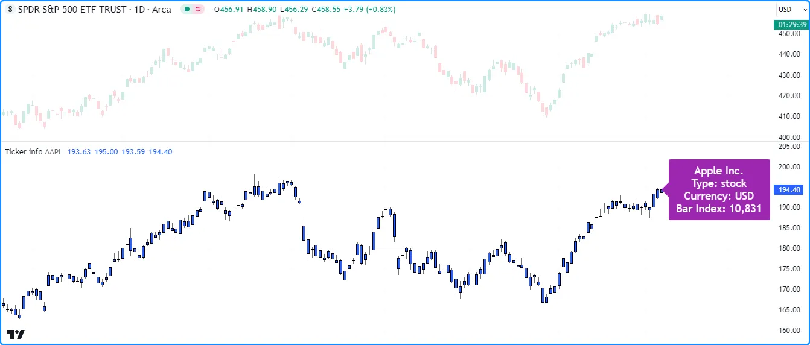

```c
//@version=5
indicator("Requesting user-defined types demo", "Ticker info")

//@variable The symbol to request information from.
string symbol = input.symbol("NASDAQ:AAPL", "Symbol")

//@type               A custom type containing information about a ticker.
//@field description  The symbol's description.
//@field tickerType   The type of ticker.
//@field currency     The symbol's currency.
//@field prices       An array of the symbol's current prices.
//@field barIndex     The ticker's `bar_index`.
type TickerInfo
    string       description
    string       tickerType
    string       currency
    array<float> prices
    int          barIndex

//@variable A `TickerInfo` object containing current data.
info = TickerInfo.new(
     syminfo.description, syminfo.type, syminfo.currency, array.from(open, high, low, close), bar_index
 )
//@variable The `info` requested from the specified `symbol`.
TickerInfo requestedInfo = request.security(symbol, timeframe.period, info)
// Assign a new `TickerInfo` instance to `requestedInfo` if one wasn't retrieved.
if na(requestedInfo)
    requestedInfo := TickerInfo.new(prices = array.new<float>(4))

//@variable A label displaying information from the `requestedInfo` object.
var infoLabel = label.new(
     na, na, "", color = color.purple, style = label.style_label_left, textcolor = color.white, size = size.large
 )
//@variable The text to display inside the `infoLabel`.
string infoText = na(requestedInfo) ? "" : str.format(
     "{0}\nType: {1}\nCurrency: {2}\nBar Index: {3}",
     requestedInfo.description, requestedInfo.tickerType, requestedInfo.currency, requestedInfo.barIndex
 )

// Set the `point` and `text` of the `infoLabel`.
label.set_point(infoLabel, chart.point.now(array.last(requestedInfo.prices)))
label.set_text(infoLabel, infoText)
// Plot candles using the values from the `prices` array of the `requestedInfo`.
plotcandle(
     requestedInfo.prices.get(0), requestedInfo.prices.get(1), requestedInfo.prices.get(2), requestedInfo.prices.get(3),
     "Requested Prices"
 )
```

__Note que:__

- As variáveis `syminfo.*` usadas neste script retornam tipos qualificados como "simple string". Contudo, os [objetos](./04_12_objetos.md) no Pine são _sempre_ qualificados como "series". Consequentemente, todos os valores atribuídos aos campos do objeto `info` automaticamente adotam o [qualificativo](./04_09_tipagem_do_sistema.md#qualificadores) "series".
- A chamada [request.security()](https://br.tradingview.com/pine-script-reference/v5/#fun_request.security) pode retornar [na](https://br.tradingview.com/pine-script-reference/v5/#var_na) devido a diferenças entre os dados solicitados do `symbol` e o gráfico principal. Este script atribui um novo objeto `TickerInfo` ao `requestedInfo` nesse caso para evitar erros de execução.

## `request.security_lower_tf()`

A função [request.security_lower_tf()](https://br.tradingview.com/pine-script-reference/v5/#fun_request.security_lower_tf) é uma alternativa à [request.security()](https://br.tradingview.com/pine-script-reference/v5/#fun_request.security) projetada para solicitar informações de contextos de menor timeframe (LTF) de forma confiável.

Enquanto [request.security()](https://br.tradingview.com/pine-script-reference/v5/#fun_request.security) pode recuperar dados de uma _única_ barra intradiária em cada barra do gráfico, [request.security_lower_tf()](https://br.tradingview.com/pine-script-reference/v5/#fun_request.security_lower_tf) recupera dados de _todas_ as barras intradiárias disponíveis em cada barra do gráfico, que o script pode acessar e usar em cálculos adicionais. Cada chamada pode recuperar até 100.000 intrabarras de um timeframe menor. Consulte [esta seção](./06_05_limitacoes.md#chamadas-request) da página de [Limitações](./06_05_limitacoes.md) para mais informações.

> __Observação!__\
> Trabalhar com [request.security_lower_tf()](https://br.tradingview.com/pine-script-reference/v5/#fun_request.security_lower_tf) envolve o uso frequente de [arrays](./04_14_arrays.md), pois sempre retorna resultados como [arrays](https://br.tradingview.com/pine-script-reference/v5/#type_array). Portanto, recomenda-se se familiarizar com [arrays](./04_14_arrays.md) para aproveitar ao máximo essa função em seus scripts.

Abaixo está a assinatura da função, semelhante à [request.security()](https://br.tradingview.com/pine-script-reference/v5/#fun_request.security):

```c
request.security_lower_tf(symbol, timeframe, expression, ignore_invalid_symbol, currency, ignore_invalid_timeframe, calc_bars_count) → array<type>
```

Essa função __somente__ solicita dados de timeframes menores ou iguais ao timeframe gráfico. Se o `timeframe` da solicitação representar um timeframe maior que o [timeframe gráfico](https://br.tradingview.com/pine-script-reference/v5/#var_timeframe.period), a função gerará um erro de execução ou retornará valores [na](https://br.tradingview.com/pine-script-reference/v5/#var_na) dependendo do argumento `ignore_invalid_timeframe` na chamada. O valor padrão para este parâmetro é `false`, o que significa que ele gerará um erro e interromperá a execução do script ao tentar solicitar dados de um timeframe maior.

### Solicitando Dados Intrabar

Os dados intrabar podem fornecer informações adicionais que podem não ser óbvias ou acessíveis apenas analisando os dados amostrados no timeframe gráfico. A função [request.security_lower_tf()](https://br.tradingview.com/pine-script-reference/v5/#fun_request.security_lower_tf) pode recuperar muitos tipos de dados de um contexto intrabar.

Antes de prosseguir nesta seção, recomenda-se explorar a seção [Dados Solicitáveis](./05_14_outros_timeframes_e_dados.md#dados-solicitáveis) da seção [request.security()](./05_14_outros_timeframes_e_dados.md#requestsecurity) acima, que fornece informações básicas sobre os tipos de dados que podem ser solicitados. O parâmetro `expression` em [request.security_lower_tf()](https://br.tradingview.com/pine-script-reference/v5/#fun_request.security_lower_tf) aceita a maioria dos mesmos argumentos discutidos nessa seção, excluindo referências diretas a [coleções](./04_09_tipagem_do_sistema.md#coleções) e variáveis mutáveis declaradas no escopo principal do script. Embora aceite muitos dos mesmos tipos de argumentos, essa função retorna resultados como [arrays](https://br.tradingview.com/pine-script-reference/v5/#type_array), o que traz algumas diferenças na interpretação e manipulação, conforme explicado abaixo.

> __Observação!__\
> Assim como a [request.security()](https://br.tradingview.com/pine-script-reference/v5/#fun_request.security), a [request.security_lower_tf()](https://br.tradingview.com/pine-script-reference/v5/#fun_request.security_lower_tf) duplica os escopos e operações necessárias para calcular a `expression` de outro contexto. Os escopos de [request.security_lower_tf()](https://br.tradingview.com/pine-script-reference/v5/#fun_request.security_lower_tf) aumentam o consumo de memória em tempo de execução e contam para os limites de compilação do script. Consulte a seção [Contagem de Escopos](./06_05_limitacoes.md#contagem-de-escopos) da página de [Limitações](./06_05_limitacoes.md) para saber mais.

### Arrays de Dados Intrabar

Timeframes menores contêm mais pontos de dados que timeframes maiores, à medida que novos valores entram em uma _frequência maior_. Por exemplo, ao comparar um gráfico de 1 minuto com um gráfico de horas, o gráfico de 1 minuto terá até 60 vezes o número de barras por hora, dependendo dos dados disponíveis.

Para lidar com o fato de que múltiplas intrabarras existem dentro de uma barra do gráfico, a [request.security_lower_tf()](https://br.tradingview.com/pine-script-reference/v5/#fun_request.security_lower_tf) sempre retorna seus resultados como [arrays](./04_14_arrays.md). Os elementos nos [arrays](./04_14_arrays.md) retornados representam os valores da `expression` recuperados do timeframe menor, classificados em ordem ascendente com base no timestamp de cada intrabarra.

O [template de tipo](./04_09_tipagem_do_sistema.md#templates-de-tipo) atribuído aos [arrays](./04_14_arrays.md) retornados corresponde aos tipos de valores passados na chamada [request.security_lower_tf()](https://br.tradingview.com/pine-script-reference/v5/#fun_request.security_lower_tf). Por exemplo, usar um "int" como `expression` produzirá uma instância de `array<int>`, um "bool" como `expression` produzirá uma instância de `array<bool>`, etc.

O script a seguir usa informações intrabar para decompor as mudanças de preço de fechamento a fechamento do gráfico em partes positivas e negativas. Ele chama [request.security_lower_tf()](https://br.tradingview.com/pine-script-reference/v5/#fun_request.security_lower_tf) para buscar um [array](https://br.tradingview.com/pine-script-reference/v5/#type_array) de "float" de valores de [ta.change(close)](https://br.tradingview.com/pine-script-reference/v5/#fun_ta.change) do `lowerTimeframe` em cada barra do gráfico, em seguida, acessa todos os elementos do array usando um loop [for…in](https://br.tradingview.com/pine-script-reference/v5/#kw_for...in) para acumular as somas de `positiveChange` e `negativeChange`. O script adiciona os valores acumulados para calcular o `netChange`, depois [plota](./05_15_plots.md) os resultados no gráfico ao lado do `priceChange` para comparação:

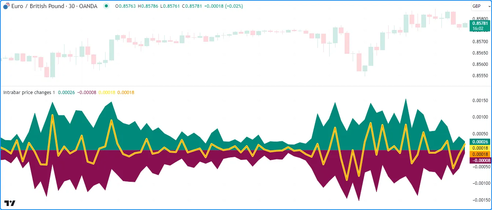

```c
//@version=5
indicator("Intrabar arrays demo", "Intrabar price changes")

//@variable The lower timeframe of the requested data.
string lowerTimeframe = input.timeframe("1", "Timeframe")

//@variable The close-to-close price change.
float priceChange = ta.change(close)

//@variable An array of `close` values from available intrabars on the `lowerTimeframe`.
array<float> intrabarChanges = request.security_lower_tf(syminfo.tickerid, lowerTimeframe, priceChange)

//@variable The total positive intrabar `close` movement on the chart bar.
float positiveChange = 0.0
//@variable The total negative intrabar `close` movement on the chart bar.
float negativeChange = 0.0

// Loop to calculate totals, starting from the chart bar's first available intrabar.
for change in intrabarChanges
    // Add the `change` to `positiveChange` if its sign is 1, and add to `negativeChange` if its sign is -1.
    switch math.sign(change)
        1  => positiveChange += change
        -1 => negativeChange += change

//@variable The sum of `positiveChange` and `negativeChange`. Equals the `priceChange` on bars with available intrabars.
float netChange = positiveChange + negativeChange

// Plot the `positiveChange`, `negativeChange`, and `netChange`.
plot(positiveChange, "Positive intrabar change", color.teal, style = plot.style_area)
plot(negativeChange, "Negative intrabar change", color.maroon, style = plot.style_area)
plot(netChange, "Net intrabar change", color.yellow, 5)
// Plot the `priceChange` to compare.
plot(priceChange, "Chart price change", color.orange, 2)
```

__Note que:__

- Os [plots](./05_15_plots.md) baseados em dados intrabar podem não aparecer em todas as barras de gráfico disponíveis, pois [request.security_lower_tf()](https://br.tradingview.com/pine-script-reference/v5/#fun_request.security_lower_tf) pode acessar até 100.000 intrabarras mais recentes disponíveis a partir do contexto solicitado. Quando esta função é executada em uma barra de gráfico que não possui dados intrabar acessíveis, ela retornará um _array vazio_.
- O número de intrabarras por barra de gráfico pode variar dependendo dos dados disponíveis no contexto e no gráfico em que o script é executado. Por exemplo, o feed de dados de 1 minuto de um provedor pode não incluir dados para cada minuto dentro do timeframe de 60 minutos devido à falta de atividade de negociação em alguns intervalos de 1 minuto. Para verificar o número de intrabarras recuperadas para uma barra de gráfico, pode-se usar [array.size()](https://br.tradingview.com/pine-script-reference/v5/#fun_array.size) no [array](https://br.tradingview.com/pine-script-reference/v5/#type_array) resultante.
- Se o valor de `lowerTimeframe` for maior que o timeframe do gráfico, o script gerará um _erro de execução_, pois não foi fornecido um argumento `ignore_invalid_timeframe` na chamada [request.security_lower_tf()](https://br.tradingview.com/pine-script-reference/v5/#fun_request.security_lower_tf).

### Tuplas de dados Intrabar

Ao passar uma tupla ou uma chamada de função que retorna uma tupla como argumento `expression` em [request.security_lower_tf()](https://br.tradingview.com/pine-script-reference/v5/#fun_request.security_lower_tf), o resultado é uma tupla de [arrays](./04_14_arrays.md) com [templates de tipo](./04_09_tipagem_do_sistema.md#templates-de-tipo) correspondentes aos tipos dentro do argumento. Por exemplo, usar uma tupla `[float, string, color]` como `expression` resultará em dados `[array<float>, array<string>, array<color>]` retornados pela função. Usar uma tupla `expression` permite que um script busque vários [arrays](./04_14_arrays.md) de dados intrabar com uma única chamada de função [request.security_lower_tf()](https://br.tradingview.com/pine-script-reference/v5/#fun_request.security_lower_tf).

> __Observação!__\
> O tamanho combinado de todas as tuplas retornadas pelas chamadas `request.*()` em um script é limitado a 127 elementos. Consulte [esta seção](./06_05_limitacoes.md#limite-de-elementos-da-tupla) da página de [Limitações](./06_05_limitacoes.md) para mais informações.

O exemplo a seguir solicita dados OHLC de um timeframe menor e visualiza as intrabarras da barra atual no gráfico usando [linhas e caixas](./05_12_lines_e_boxes.md). O script chama [request.security_lower_tf()](https://br.tradingview.com/pine-script-reference/v5/#fun_request.security_lower_tf) com a tupla `[open, high, low, close]` como `expression` para recuperar uma tupla de [arrays](./04_14_arrays.md) representando informações OHLC de um `lowerTimeframe` calculado. Em seguida, usa um loop [for](https://br.tradingview.com/pine-script-reference/v5/#kw_for) para definir as coordenadas das linhas com os dados recuperados e índices de barras atuais para exibir os resultados ao lado da barra de gráfico atual, fornecendo uma "visão ampliada" do movimento de preço dentro do candle mais recente. Também desenha uma [caixa](./05_12_lines_e_boxes.md#boxes-caixas) ao redor das [linhas](./05_12_lines_e_boxes.md#lines-linhas) para indicar a região do gráfico ocupada pelos desenhos intrabar:

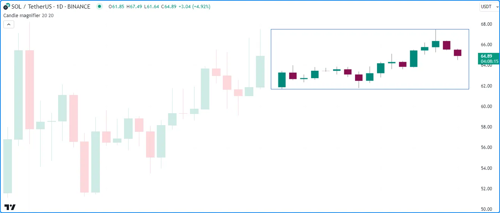

```c
//@version=5
indicator("Tuples of intrabar data demo", "Candle magnifier", max_lines_count = 500)

//@variable The maximum number of intrabars to display.
int maxIntrabars = input.int(20, "Max intrabars", 1, 250)
//@variable The width of the drawn candle bodies.
int candleWidth = input.int(20, "Candle width", 2)

//@variable The largest valid timeframe closest to `maxIntrabars` times smaller than the chart timeframe.
string lowerTimeframe = timeframe.from_seconds(math.ceil(timeframe.in_seconds() / maxIntrabars))

//@variable An array of lines to represent intrabar wicks.
var array<line> wicks  = array.new<line>()
//@variable An array of lines to represent intrabar bodies.
var array<line> bodies = array.new<line>()
//@variable A box that surrounds the displayed intrabars.
var box magnifierBox = box.new(na, na, na, na, bgcolor = na)

// Fill the `wicks` and `bodies` arrays with blank lines on the first bar.
if barstate.isfirst
    for i = 1 to maxIntrabars
        array.push(wicks, line.new(na, na, na, na, color = color.gray))
        array.push(bodies, line.new(na, na, na, na, width = candleWidth))

//@variable A tuple of "float" arrays containing `open`, `high`, `low`, and `close` prices from the `lowerTimeframe`.
[oData, hData, lData, cData] = request.security_lower_tf(syminfo.tickerid, lowerTimeframe, [open, high, low, close])
//@variable The number of intrabars retrieved from the `lowerTimeframe` on the chart bar.
int numIntrabars = array.size(oData)

if numIntrabars > 0
    // Define the start and end bar index values for intrabar display.
    int startIndex = bar_index + 2
    int endIndex = startIndex + numIntrabars
    // Loop to update lines.
    for i = 0 to maxIntrabars - 1
        line wickLine = array.get(wicks, i)
        line bodyLine = array.get(bodies, i)
        if i < numIntrabars
            //@variable The `bar_index` of the drawing.
            int candleIndex = startIndex + i
            // Update the properties of the `wickLine` and `bodyLine`.
            line.set_xy1(wickLine, startIndex + i, array.get(hData, i))
            line.set_xy2(wickLine, startIndex + i, array.get(lData, i))
            line.set_xy1(bodyLine, startIndex + i, array.get(oData, i))
            line.set_xy2(bodyLine, startIndex + i, array.get(cData, i))
            line.set_color(bodyLine, bodyLine.get_y2() > bodyLine.get_y1() ? color.teal : color.maroon)
            continue
        // Set the coordinates of the `wickLine` and `bodyLine` to `na` if no intrabar data is available at the index.
        line.set_xy1(wickLine, na, na)
        line.set_xy2(wickLine, na, na)
        line.set_xy1(bodyLine, na, na)
        line.set_xy2(bodyLine, na, na)
    // Set the coordinates of the `magnifierBox`.
    box.set_lefttop(magnifierBox, startIndex - 1, array.max(hData))
    box.set_rightbottom(magnifierBox, endIndex, array.min(lData))
```

__Note que:__

- O script desenha cada candle usando duas [linhas](./05_12_lines_e_boxes.md#lines-linhas): uma para representar as sombras e outra para representar o corpo. Como o script pode exibir até 500 linhas no gráfico, o valor de entrada `maxIntrabars` foi limitado a 250.
- O valor de `lowerTimeframe` é o resultado do cálculo de [math.ceil()](https://br.tradingview.com/pine-script-reference/v5/#fun_math.ceil) de [timeframe.in_seconds()](https://br.tradingview.com/pine-script-reference/v5/#fun_timeframe.in_seconds) dividido por `maxIntrabars` e convertido para uma [string de timeframe válida](./05_22_timeframes.md#especificações-de-string-do-timeframe) com [timeframe.from_seconds()](https://br.tradingview.com/pine-script-reference/v5/#fun_timeframe.from_seconds).
- O script define o topo do desenho da caixa usando o [array.max()](https://br.tradingview.com/pine-script-reference/v5/#fun_array.max) do array `hData` solicitado, e define a parte inferior da caixa usando o [array.min()](https://br.tradingview.com/pine-script-reference/v5/#fun_array.min) do array `lData` solicitado. Como visto no gráfico, esses valores correspondem ao [high](https://br.tradingview.com/pine-script-reference/v5/#var_high) e [low](https://br.tradingview.com/pine-script-reference/v5/#var_low) da barra do gráfico.

### Solicitando Coleções

Em alguns casos, um script pode precisar solicitar os IDs de [coleções](./04_09_tipagem_do_sistema.md#coleções) de um contexto intrabar. No entanto, ao contrário de [request.security()](https://br.tradingview.com/pine-script-reference/v5/#fun_request.security), não se pode passar [coleções](./04_09_tipagem_do_sistema.md#coleções) ou chamadas de funções que as retornem como argumento `expression` em uma chamada [request.security_lower_tf()](https://br.tradingview.com/pine-script-reference/v5/#fun_request.security_lower_tf), pois [arrays](./04_14_arrays.md) não podem referenciar diretamente outras [coleções](./04_09_tipagem_do_sistema.md#coleções).

Apesar dessas limitações, é possível solicitar [coleções](./04_09_tipagem_do_sistema.md#coleções) de timeframes menores, se necessário, com a ajuda de tipos _wrapper_.

> __Observação!__\
> O caso de uso descrito abaixo é __avançado__ e __não__ é recomendado para iniciantes. Antes de explorar essa abordagem, recomenda-se entender como [tipos definidos pelo usuário](./04_09_tipagem_do_sistema.md#tipos-definidos-pelo-usuário) e [coleções](./04_09_tipagem_do_sistema.md#coleções) funcionam no Pine Script. Quando possível, recomenda-se usar métodos _mais simples_ para gerenciar solicitações de LTF, e usar essa abordagem apenas quando _nada mais_ for suficiente.

Para tornar [coleções](./04_09_tipagem_do_sistema.md#coleções) solicitáveis com [request.security_lower_tf()](https://br.tradingview.com/pine-script-reference/v5/#fun_request.security_lower_tf), é necessário criar um [UDT](./04_09_tipagem_do_sistema.md#tipos-definidos-pelo-usuário) com um campo para referenciar um ID de coleção. Esse passo é necessário, pois [arrays](./04_14_arrays.md) não podem referenciar diretamente outras [coleções](./04_09_tipagem_do_sistema.md#coleções), mas _podem_ referenciar UDTs com campos de coleção:

```c
//@type A "wrapper" type to hold an `array<float>` instance.
type Wrapper
    array<float> collection
```

Com o UDT `Wrapper` definido, agora é possível passar os IDs de [objetos](./04_12_objetos.md) do UDT para o parâmetro `expression` em [request.security_lower_tf()](https://br.tradingview.com/pine-script-reference/v5/#fun_request.security_lower_tf).

Uma abordagem direta é chamar a função embutida `*.new()` como `expression`. Por exemplo, esta linha de código chama `Wrapper.new()` com [array.from(close)](https://br.tradingview.com/pine-script-reference/v5/#fun_array.from) como sua `collection` dentro de [request.security_lower_tf()](https://br.tradingview.com/pine-script-reference/v5/#fun_request.security_lower_tf):

```c
//@variable An array of `Wrapper` IDs requested from the 1-minute timeframe.
array<Wrapper> wrappers = request.security_lower_tf(syminfo.tickerid, "1", Wrapper.new(array.from(close)))
```

Alternativamente, pode-se criar uma [função definida pelo usuário](./04_11_funcoes_definidas_pelo_usuario.md) ou [método](./04_13_metodos.md#métodos-definidos-pelo-usuário) que retorna um [objeto](./04_12_objetos.md) do [UDT](./04_09_tipagem_do_sistema.md#tipos-definidos-pelo-usuário) e chamar essa função dentro de [request.security_lower_tf()](https://br.tradingview.com/pine-script-reference/v5/#fun_request.security_lower_tf). Por exemplo, este código chama uma função personalizada `newWrapper()` que retorna um ID `Wrapper` como argumento `expression`:

```c
//@function Creates a new `Wrapper` instance to wrap the specified `collection`.
newWrapper(array<float> collection) =>
    Wrapper.new(collection)

//@variable An array of `Wrapper` IDs requested from the 1-minute timeframe.
array<Wrapper> wrappers = request.security_lower_tf(syminfo.tickerid, "1", newWrapper(array.from(close)))
```

O resultado com qualquer um dos métodos acima é um [array](https://br.tradingview.com/pine-script-reference/v5/#type_array) contendo IDs `Wrapper` de todas as intrabarras disponíveis na barra do gráfico, que o script pode usar para referenciar instâncias `Wrapper` de intrabarras específicas e usar seus campos `collection` em operações adicionais.

O script abaixo utiliza essa abordagem para coletar [arrays](./04_14_arrays.md) de dados intrabar de um `lowerTimeframe` e usá-los para exibir dados de uma intrabar específica. Seu tipo personalizado `Prices` contém um único campo `data` para referenciar instâncias de `array<float>` que mantêm dados de preço, e a função definida pelo usuário `newPrices()` retorna o ID de um objeto `Prices`.

O script chama [request.security_lower_tf()](https://br.tradingview.com/pine-script-reference/v5/#fun_request.security_lower_tf) com uma chamada `newPrices()` como argumento `expression` para recuperar um [array](https://br.tradingview.com/pine-script-reference/v5/#type_array) de IDs `Prices` de cada intrabar na barra do gráfico, em seguida, usa [array.get()](https://br.tradingview.com/pine-script-reference/v5/#fun_array.get) para obter o ID de uma intrabar específica disponível, se existir. Por fim, usa [array.get()](https://br.tradingview.com/pine-script-reference/v5/#fun_array.get) no array `data` atribuído a essa instância e chama [plotcandle()](https://br.tradingview.com/pine-script-reference/v5/#fun_plotcandle) para exibir seus valores no gráfico:

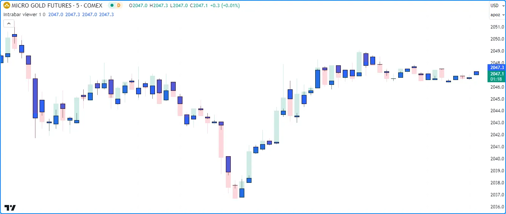

```c
//@version=5
indicator("Requesting LTF collections demo", "Intrabar viewer", true)

//@variable The timeframe of the LTF data request.
string lowerTimeframe = input.timeframe("1", "Timeframe")
//@variable The index of the intrabar to show on each chart bar. 0 is the first available intrabar.
int intrabarIndex = input.int(0, "Intrabar to show", 0)

//@variable A custom type to hold an array of price `data`.
type Prices
    array<float> data

//@function Returns a new `Prices` instance containing current `open`, `high`, `low`, and `close` prices.
newPrices() =>
    Prices.new(array.from(open, high, low, close))

//@variable An array of `Prices` requested from the `lowerTimeframe`.
array<Prices> requestedPrices = request.security_lower_tf(syminfo.tickerid, lowerTimeframe, newPrices())

//@variable The `Prices` ID from the `requestedPrices` array at the `intrabarIndex`, or `na` if not available.
Prices intrabarPrices = array.size(requestedPrices) > intrabarIndex ? array.get(requestedPrices, intrabarIndex) : na
//@variable The `data` array from the `intrabarPrices`, or an array of `na` values if `intrabarPrices` is `na`.
array<float> intrabarData = na(intrabarPrices) ? array.new<float>(4, na) : intrabarPrices.data

// Plot the `intrabarData` values as candles.
plotcandle(intrabarData.get(0), intrabarData.get(1), intrabarData.get(2), intrabarData.get(3))
```

__Note que:__

- A variável `intrabarPrices` apenas referencia um ID `Prices` se o [tamanho](https://br.tradingview.com/pine-script-reference/v5/#fun_array.size) do array `requestedPrices` for maior que o `intrabarIndex`, pois tentar usar [array.get()](https://br.tradingview.com/pine-script-reference/v5/#fun_array.get) para obter um elemento que não existe resultará em um [erro de limite](./04_14_arrays.md#index-xx-está-fora-dos-limites-tamanho-do-array-é-yy) (_out of bounds error_).
- A variável `intrabarData` apenas referencia o campo `data` de `intrabarPrices` se um ID `Prices` válido existir, pois um script não pode referenciar campos de um valor [na](https://br.tradingview.com/pine-script-reference/v5/#var_na).
- O processo usado neste exemplo _não_ é necessário para alcançar o resultado pretendido. Pode-se, em vez disso, evitar usar [UDTs](./04_09_tipagem_do_sistema.md#tipos-definidos-pelo-usuário) e passar uma tupla `[open, high, low, close]` para o parâmetro `expression` para recuperar uma tupla de [arrays](./04_14_arrays.md) para operações adicionais, conforme explicado na [seção anterior](./05_14_outros_timeframes_e_dados.md#tuplas-de-dados-intrabar).

## Contextos Personalizados

Pine Script inclui várias funções `ticker.*()` que permitem aos scripts construir IDs de ticker _personalizados_ que especificam configurações adicionais para solicitações de dados quando usados como argumento `symbol` em [request.security()](https://br.tradingview.com/pine-script-reference/v5/#fun_request.security) e [request.security_lower_tf()](https://br.tradingview.com/pine-script-reference/v5/#fun_request.security_lower_tf):

- [ticker.new()](https://br.tradingview.com/pine-script-reference/v5/#fun_ticker.new) constrói um ID de ticker personalizado a partir de um `prefix` e `ticker` especificados com configurações adicionais de `session` e `adjustment`.
- [ticker.modify()](https://br.tradingview.com/pine-script-reference/v5/#fun_ticker.modify) constrói uma forma modificada de um `tickerid` especificado com configurações adicionais de `session` e `adjustment`.
- [ticker.heikinashi()](https://br.tradingview.com/pine-script-reference/v5/#fun_ticker.heikinashi), [ticker.renko()](https://br.tradingview.com/pine-script-reference/v5/#fun_ticker.renko), [ticker.pointfigure()](https://br.tradingview.com/pine-script-reference/v5/#fun_ticker.pointfigure), [ticker.kagi()](https://br.tradingview.com/pine-script-reference/v5/#fun_ticker.kagi), e [ticker.linebreak()](https://br.tradingview.com/pine-script-reference/v5/#fun_ticker.linebreak) constroem uma forma modificada de um `symbol` com configurações de [gráfico não padrão](./05_13_dados_de_graficos_nao_padronizados.md).
- [ticker.inherit()](https://br.tradingview.com/pine-script-reference/v5/#fun_ticker.inherit) constrói um novo ID de ticker para um `symbol` com parâmetros adicionais herdados do `from_tickerid` especificado na chamada da função, permitindo que scripts solicitem dados do `symbol` com os mesmos modificadores do `from_tickerid`, incluindo sessão, ajuste de dividendos, conversão de moeda, tipo de gráfico não padrão, ajuste retroativo, liquidação como fechamento, etc.
- [ticker.standard()](https://br.tradingview.com/pine-script-reference/v5/#fun_ticker.standard) constrói um ID de ticker padrão representando o `symbol` _sem_ modificadores adicionais.

Veja alguns exemplos práticos de aplicação das funções `ticker.*()` para solicitar dados de contextos personalizados.

Suponha que seja necessário incluir o ajuste de dividendos nos preços de um símbolo de ação sem habilitar a opção "Ajustar dados para dividendos" (_Adjust data for dividends_) na seção "Símbolo" (_Symbol_) das configurações do gráfico. Isso pode ser alcançado em um script construindo um ID de ticker personalizado para o instrumento usando [ticker.new()](https://br.tradingview.com/pine-script-reference/v5/#fun_ticker.new) ou [ticker.modify()](https://br.tradingview.com/pine-script-reference/v5/#fun_ticker.modify) com um valor `adjustment` de [adjustment.dividends](https://br.tradingview.com/pine-script-reference/v5/#var_adjustment.dividends).

Este script cria um `adjustedTickerID` usando [ticker.modify()](https://br.tradingview.com/pine-script-reference/v5/#fun_ticker.modify), usa esse ID de ticker como `symbol` em [request.security()](https://br.tradingview.com/pine-script-reference/v5/#fun_request.security) para recuperar uma [tupla](./05_14_outros_timeframes_e_dados.md#tuples-tuplas) de valores de preços ajustados, e então plota o resultado como [candles](https://br.tradingview.com/pine-script-reference/v5/#fun_plotcandle) no gráfico. Ele também destaca o fundo quando os preços solicitados diferem dos preços sem ajuste de dividendos.

Como pode ser visto no gráfico "NYSE:XOM", habilitar o ajuste de dividendos resulta em valores históricos diferentes antes da data do último dividendo:

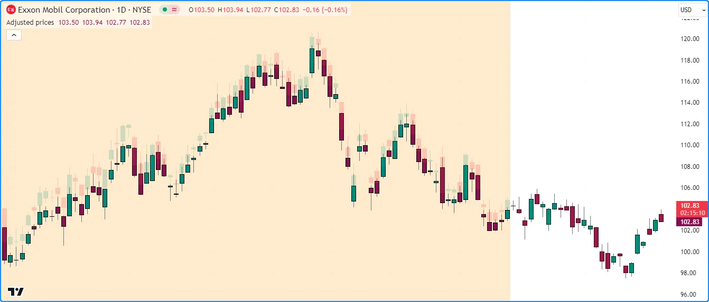

```c
//@version=5
indicator("Custom contexts demo 1", "Adjusted prices", true)

//@variable A custom ticker ID representing the chart's symbol with the dividend adjustment modifier.
string adjustedTickerID = ticker.modify(syminfo.tickerid, adjustment = adjustment.dividends)

// Request the adjusted prices for the chart's symbol.
[o, h, l, c] = request.security(adjustedTickerID, timeframe.period, [open, high, low, close])

//@variable The color of the candles on the chart.
color candleColor = c > o ? color.teal : color.maroon

// Plot the adjusted prices.
plotcandle(o, h, l, c, "Adjusted Prices", candleColor)
// Highlight the background when `c` is different from `close`.
bgcolor(c != close ? color.new(color.orange, 80) : na)
```

__Note que:__

- Se um modificador incluído em um ID de ticker construído não se aplicar ao símbolo, o script irá _ignorar_ esse modificador ao solicitar dados. Por exemplo, este script exibirá os mesmos valores do gráfico principal em símbolos de forex, como "EURUSD".

Embora o exemplo acima demonstre uma maneira simples de modificar o símbolo do gráfico, um caso de uso mais frequente para as funções `ticker.*()` é aplicar modificadores personalizados a outro símbolo ao solicitar dados. Se um ID de ticker referenciado em um script já possuir os modificadores que se deseja aplicar (por exemplo, configurações de ajuste, tipo de sessão, etc.), pode-se usar [ticker.inherit()](https://br.tradingview.com/pine-script-reference/v5/#fun_ticker.inherit) para adicionar rapidamente e eficientemente esses modificadores a outro símbolo.

No exemplo abaixo, o script foi editado para solicitar dados para um `symbolInput` usando modificadores herdados do `adjustedTickerID`. Este script chama [ticker.inherit()](https://br.tradingview.com/pine-script-reference/v5/#fun_ticker.inherit) para construir um `inheritedTickerID` e usa esse ID de ticker em uma chamada [request.security()](https://br.tradingview.com/pine-script-reference/v5/#fun_request.security). Ele também solicita dados para o `symbolInput` sem modificadores adicionais e plota [candles](https://br.tradingview.com/pine-script-reference/v5/#fun_plotcandle) para ambos os IDs de ticker em um painel de gráfico separado para comparar a diferença.

Como mostrado no gráfico, os dados solicitados usando o `inheritedTickerID` incluem ajuste de dividendos, enquanto os dados solicitados usando o `symbolInput` diretamente não incluem:

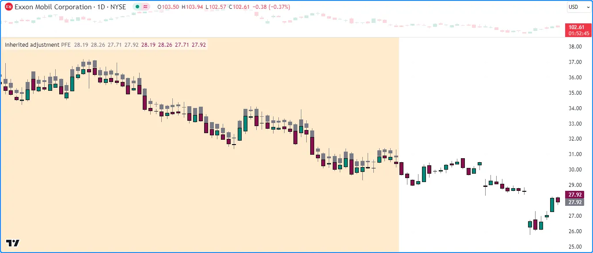

```c
//@version=5
indicator("Custom contexts demo 2", "Inherited adjustment")

//@variable The symbol to request data from.
string symbolInput = input.symbol("NYSE:PFE", "Symbol")

//@variable A custom ticker ID representing the chart's symbol with the dividend adjustment modifier.
string adjustedTickerID = ticker.modify(syminfo.tickerid, adjustment = adjustment.dividends)
//@variable A custom ticker ID representing the `symbolInput` with modifiers inherited from the `adjustedTickerID`.
string inheritedTickerID = ticker.inherit(adjustedTickerID, symbolInput)

// Request prices using the `symbolInput`.
[o1, h1, l1, c1] = request.security(symbolInput, timeframe.period, [open, high, low, close])
// Request prices using the `inheritedTickerID`.
[o2, h2, l2, c2] = request.security(inheritedTickerID, timeframe.period, [open, high, low, close])

//@variable The color of the candles that use the `inheritedTickerID` prices.
color candleColor = c2 > o2 ? color.teal : color.maroon

// Plot the `symbol` prices.
plotcandle(o1, h1, l1, c1, "Symbol", color.gray, color.gray, bordercolor = color.gray)
// Plot the `inheritedTickerID` prices.
plotcandle(o2, h2, l2, c2, "Symbol With Modifiers", candleColor)
// Highlight the background when `c1` is different from `c2`.
bgcolor(c1 != c2 ? color.new(color.orange, 80) : na)
```

__Note que:__

- Como o `adjustedTickerID` representa uma forma modificada do [syminfo.tickerid](https://br.tradingview.com/pine-script-reference/v5/#var_syminfo.tickerid), se o contexto do gráfico for modificado de outras maneiras, como alterar o tipo de gráfico ou habilitar horas de negociação estendidas nas configurações do gráfico, esses modificadores também se aplicarão ao `adjustedTickerID` e `inheritedTickerID`. No entanto, eles _não_ se aplicarão ao `symbolInput` já que ele representa um ID de ticker _padrão_.

Outro caso de uso frequente para solicitar contextos personalizados é recuperar dados que utilizam cálculos de [gráficos não padrão](./05_13_dados_de_graficos_nao_padronizados.md). Por exemplo, suponha que seja necessário usar valores de preço [Renko](https://br.tradingview.com/support/solutions/43000502284/) para calcular sinais de trade em um script de [strategy()](https://br.tradingview.com/pine-script-reference/v5/#fun_strategy). Se simplesmente for alterado o tipo de gráfico para "Renko" para obter os preços, a [estratégia](./05_18_estrategias.md) também simulará seus trades com base nesses preços sintéticos, produzindo [resultados enganosos](https://br.tradingview.com/support/solutions/43000481029):

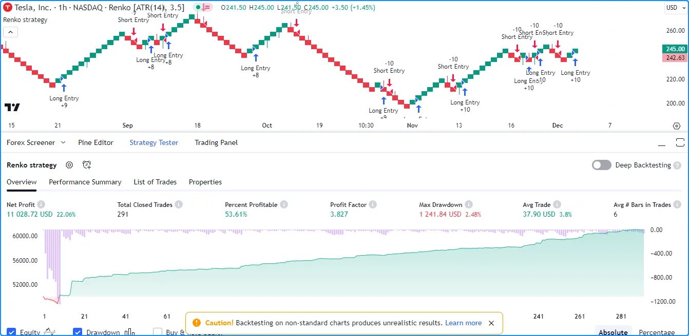

```c
//@version=5
strategy(
     "Custom contexts demo 3", "Renko strategy", true, default_qty_type = strategy.percent_of_equity,
     default_qty_value = 2, initial_capital = 50000, slippage = 2,
     commission_type = strategy.commission.cash_per_contract, commission_value = 1, margin_long = 100,
     margin_short = 100
 )

//@variable When `true`, the strategy places a long market order.
bool longEntry = ta.crossover(close, open)
//@variable When `true`, the strategy places a short market order.
bool shortEntry = ta.crossunder(close, open)

if longEntry
    strategy.entry("Long Entry", strategy.long)
if shortEntry
    strategy.entry("Short Entry", strategy.short)
```

Para garantir que a estratégia mostre resultados baseados em preços _reais_, pode-se criar um ID de ticker Renko usando [ticker.renko()](https://br.tradingview.com/pine-script-reference/v5/#fun_ticker.renko) enquanto mantém o gráfico em um _tipo padrão_, permitindo que o script solicite e use preços [Renko](https://br.tradingview.com/support/solutions/43000502284) para calcular seus sinais sem calcular os resultados da estratégia sobre eles:

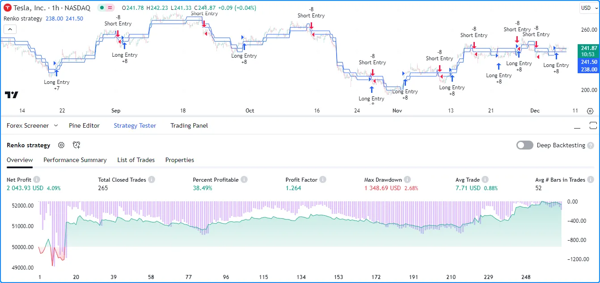

```c
//@version=5
strategy(
     "Custom contexts demo 3", "Renko strategy", true, default_qty_type = strategy.percent_of_equity,
     default_qty_value = 2, initial_capital = 50000, slippage = 1,
     commission_type = strategy.commission.cash_per_contract, commission_value = 1, margin_long = 100,
     margin_short = 100
 )

//@variable A Renko ticker ID.
string renkoTickerID = ticker.renko(syminfo.tickerid, "ATR", 14)
// Request the `open` and `close` prices using the `renkoTickerID`.
[renkoOpen, renkoClose] = request.security(renkoTickerID, timeframe.period, [open, close])

//@variable When `true`, the strategy places a long market order.
bool longEntry = ta.crossover(renkoClose, renkoOpen)
//@variable When `true`, the strategy places a short market order.
bool shortEntry = ta.crossunder(renkoClose, renkoOpen)

if longEntry
    strategy.entry("Long Entry", strategy.long)
if shortEntry
    strategy.entry("Short Entry", strategy.short)

plot(renkoOpen)
plot(renkoClose)
```

## Comportamento Histórico e Tempo Real

As funções no namespace `request.*()` podem se comportar de maneira diferente em barras históricas e em tempo real. Esse comportamento está intimamente relacionado ao [modelo de execução](./04_01_modelo_de_execucao.md) do Pine.

Considere como um script se comporta dentro do contexto principal. Ao longo da história do gráfico, o script calcula os valores necessários uma vez e _comete_ esses valores para aquela barra, de modo que seus estados estejam acessíveis posteriormente na execução. Em uma barra não confirmada, no entanto, o script recalcula seus valores em _cada atualização_ dos dados da barra para alinhar com as mudanças em tempo real. Antes de recalcular os valores nessa barra, ele reverte os valores calculados para seus últimos estados confirmados, o que é conhecido como _rollback_, e só comete valores para aquela barra quando ela fecha.

Agora, considere o comportamento das solicitações de dados de outros contextos com [request.security()](https://br.tradingview.com/pine-script-reference/v5/#fun_request.security). Assim como ao avaliar barras históricas no contexto principal, [request.security()](https://br.tradingview.com/pine-script-reference/v5/#fun_request.security) só retorna novos valores históricos quando confirma uma barra em seu contexto especificado. Ao executar em barras em tempo real, ela retorna valores recalculados em cada barra do gráfico, semelhante a como um script recalcula valores no contexto principal na barra aberta do gráfico.

No entanto, a função só _confirma_ os valores solicitados quando uma barra do seu contexto fecha. Quando o script reinicia sua execução, o que anteriormente eram barras _em tempo real_ tornam-se barras _históricas_. Portanto, [request.security()](https://br.tradingview.com/pine-script-reference/v5/#fun_request.security) retornará apenas os valores que confirmou nessas barras. Essencialmente, esse comportamento significa que os dados solicitados podem _repintar_ (_repaint_) quando seus valores flutuam em barras em tempo real sem confirmação do contexto.

> __Observação!__\
> É frequentemente útil distinguir barras históricas de barras em tempo real ao trabalhar com funções `request.*()`. Scripts podem determinar se as barras têm estados históricos ou em tempo real através das variáveis [barstate.ishistory](https://br.tradingview.com/pine-script-reference/v5/#var_barstate.ishistory) e [barstate.isrealtime](https://br.tradingview.com/pine-script-reference/v5/#var_barstate.isrealtime).

Na maioria das circunstâncias em que um script solicita dados de um contexto mais amplo, normalmente são necessários valores confirmados e estáveis que _não_ flutuam em barras em tempo real. A [seção abaixo](./05_14_outros_timeframes_e_dados.md#evitando-repintura) explica como alcançar esse resultado e evitar _repintura_ nas solicitações de dados.

### Evitando Repintura

#### Dados Higher-Timeframe (HTF) _Timeframe Superior_

Ao solicitar valores de um timeframe superior, eles estão sujeitos a _repintura_, pois barras em tempo real podem conter informações _não confirmadas_ de barras em desenvolvimento no timeframe superior, e o script pode ajustar os horários em que novos valores chegam em barras históricas. Para evitar _repintura_ de dados de timeframe superior, é necessário garantir que a função retorne apenas valores confirmados com tempo consistente em todas as barras, independentemente do estado da barra.

A abordagem mais confiável para obter resultados sem _repintura_ é usar um argumento `expression` que referencia apenas barras passadas (por exemplo, `close[1]`) enquanto usa [barmerge.lookahead_on](https://br.tradingview.com/pine-script-reference/v5/#var_barmerge.lookahead_on) como valor de `lookahead`.

Usar [barmerge.lookahead_on](https://br.tradingview.com/pine-script-reference/v5/#var_barmerge.lookahead_on) com solicitações de dados de timeframe superior não deslocados é desencorajado, pois isso faz com que [request.security()](https://br.tradingview.com/pine-script-reference/v5/#fun_request.security) "olhe adiante _look ahead_" para os valores finais de uma barra de timeframe superior, recuperando valores confirmados _antes_ de estarem realmente disponíveis no histórico do script. No entanto, se os valores usados na `expression` forem deslocados por pelo menos uma barra, os dados "futuros" que a função recupera não são mais do futuro. Em vez disso, os dados representam valores confirmados de barras de timeframe superior estabelecidas e _disponíveis_. Em outras palavras, aplicar um deslocamento à `expression` efetivamente impede que os dados solicitados façam _repintura_ quando o script reinicia sua execução e elimina o viés de lookahead na série histórica.

O exemplo a seguir demonstra uma solicitação de dados de timeframe superior que faz repaint. O script usa [request.security()](https://br.tradingview.com/pine-script-reference/v5/#fun_request.security) sem modificações de deslocamento ou argumentos adicionais para recuperar os resultados de uma chamada [ta.wma()](https://br.tradingview.com/pine-script-reference/v5/#fun_ta.wma) de um timeframe superior. Ele também destaca o fundo para indicar quais barras estavam em um estado de tempo real durante seus cálculos.

Como mostrado no gráfico abaixo, o [plot](https://br.tradingview.com/pine-script-reference/v5/#fun_plot) da WMA solicitada só muda em barras históricas quando barras de timeframe superior fecham, enquanto flutua em todas as barras em tempo real, pois os dados incluem valores não confirmados do timeframe superior:

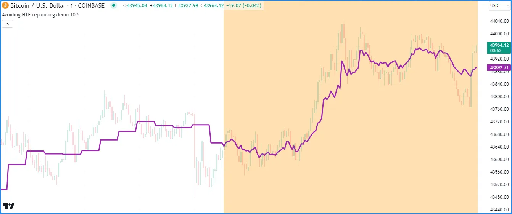

```c
//@version=5
indicator("Avoiding HTF repainting demo", overlay = true)

//@variable The multiplier applied to the chart's timeframe.
int tfMultiplier = input.int(10, "Timeframe multiplier", 1)
//@variable The number of bars in the moving average.
int length = input.int(5, "WMA smoothing length")

//@variable The valid timeframe string closest to `tfMultiplier` times larger than the chart timeframe.
string timeframe = timeframe.from_seconds(timeframe.in_seconds() * tfMultiplier)

//@variable The weighted MA of `close` prices over `length` bars on the `timeframe`.
//          This request repaints because it includes unconfirmed HTF data on realtime bars and it may offset the
//          times of its historical results.
float requestedWMA = request.security(syminfo.tickerid, timeframe, ta.wma(close, length))

// Plot the requested series.
plot(requestedWMA, "HTF WMA", color.purple, 3)
// Highlight the background on realtime bars.
bgcolor(barstate.isrealtime ? color.new(color.orange, 70) : na, title = "Realtime bar highlight")
```

Para evitar _repintura_ neste script, pode-se adicionar `lookahead = barmerge.lookahead_on` à chamada [request.security()](https://br.tradingview.com/pine-script-reference/v5/#fun_request.security) e deslocar o histórico da chamada [ta.wma()](https://br.tradingview.com/pine-script-reference/v5/#fun_ta.wma) em uma barra com o operador de referência de histórico [[]](https://br.tradingview.com/pine-script-reference/v5/#op_%5B%5D), garantindo que a solicitação sempre recupere o WMA da última barra confirmada do timeframe superior no início de cada novo `timeframe`. Diferente do script anterior, esta versão tem comportamento consistente em estados de barras históricas e em tempo real, como vemos abaixo:

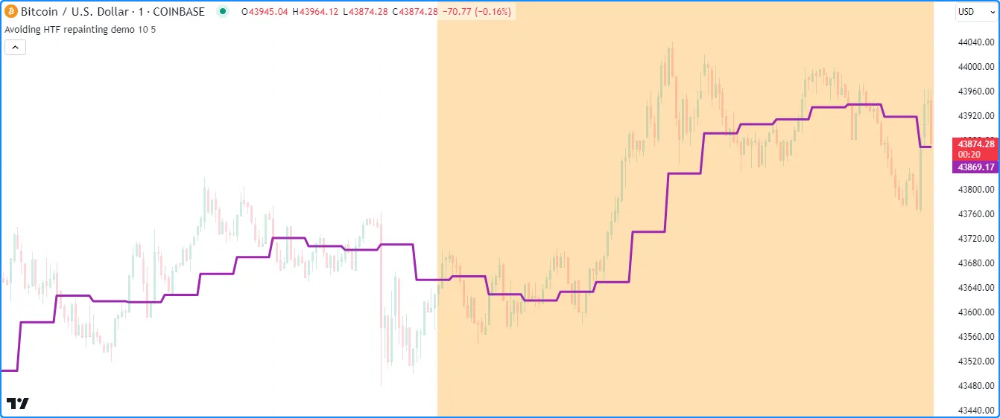

```c
//@version=5
indicator("Avoiding HTF repainting demo", overlay = true)

//@variable The multiplier applied to the chart's timeframe.
int tfMultiplier = input.int(10, "Timeframe multiplier", 1)
//@variable The number of bars in the moving average.
int length = input.int(5, "WMA smoothing length")

//@variable The valid timeframe string closest to `tfMultiplier` times larger than the chart timeframe.
string timeframe = timeframe.from_seconds(timeframe.in_seconds() * tfMultiplier)

//@variable The weighted MA of `close` prices over `length` bars on the `timeframe`.
//          This request does not repaint, as it always references the last confirmed WMA value on all bars.
float requestedWMA = request.security(
     syminfo.tickerid, timeframe, ta.wma(close, length)[1], lookahead = barmerge.lookahead_on
 )

// Plot the requested value.
plot(requestedWMA, "HTF WMA", color.purple, 3)
// Highlight the background on realtime bars.
bgcolor(barstate.isrealtime ? color.new(color.orange, 70) : na, title = "Realtime bar highlight")
```

#### Dados Lower-Timeframe (LTF) _Timeframe Inferior_

As funções [request.security()](https://br.tradingview.com/pine-script-reference/v5/#fun_request.security) e [request.security_lower_tf()](https://br.tradingview.com/pine-script-reference/v5/#fun_request.security_lower_tf) podem recuperar dados de contextos de timeframe inferior. A função [request.security()](https://br.tradingview.com/pine-script-reference/v5/#fun_request.security) pode recuperar dados de uma _única_ intrabar em cada barra do gráfico, enquanto [request.security_lower_tf()](https://br.tradingview.com/pine-script-reference/v5/#fun_request.security_lower_tf) recupera dados de _todas_ as intrabarras disponíveis.

Ao usar essas funções para recuperar dados intrabar, é importante notar que tais solicitações __não__ são imunes ao comportamento de _repintar_. Séries históricas e em tempo real frequentemente dependem de feeds de dados _separados_. Os provedores de dados podem modificar retroativamente os dados em tempo real, e é possível que ocorram corridas nos feeds de dados em tempo real, conforme explicado na seção [Feeds de Dados](./05_14_outros_timeframes_e_dados.md#feeds-de-dados) desta página. Qualquer um desses casos pode resultar em dados intrabar recuperados em barras em tempo real fazendo _repintar_ após o script reiniciar sua execução.

Além disso, um caso particular que _causará_ solicitações de LTF fazendo _repintar_ é usar [request.security()](https://br.tradingview.com/pine-script-reference/v5/#fun_request.security) com [barmerge.lookahead_on](https://br.tradingview.com/pine-script-reference/v5/#var_barmerge.lookahead_on) para recuperar dados da primeira intrabar em cada barra do gráfico. Embora geralmente funcione como esperado em barras históricas, ele rastreará apenas a intrabar mais recente em barras em tempo real, pois [request.security()](https://br.tradingview.com/pine-script-reference/v5/#fun_request.security) não retém todas as informações intrabar, e as intrabarras recuperadas pela função em barras em tempo real não são ordenadas até reiniciar a execução do script:

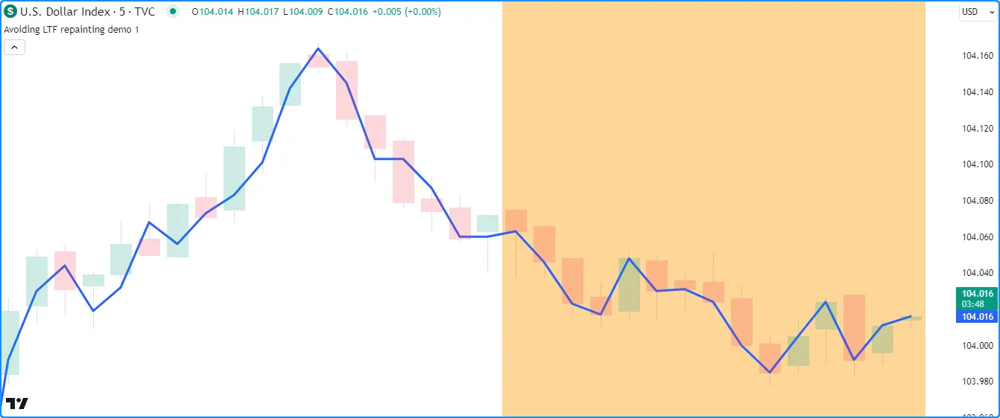

```c
//@version=5
indicator("Avoiding LTF repainting demo", overlay = true)

//@variable The lower timeframe of the requested data.
string lowerTimeframe = input.timeframe("1", "Timeframe")

//@variable The first intrabar `close` requested from the `lowerTimeframe` on each bar.
//          Only works as intended on historical bars.
float requestedClose = request.security(syminfo.tickerid, lowerTimeframe, close, lookahead = barmerge.lookahead_on)

// Plot the `requestedClose`.
plot(requestedClose, "First intrabar close", linewidth = 3)
// Highlight the background on realtime bars.
bgcolor(barstate.isrealtime ? color.new(color.orange, 60) : na, title = "Realtime bar Highlight")
```

Pode-se mitigar esse comportamento e rastrear os valores da primeira intrabar, ou de qualquer intrabar disponível na barra do gráfico, usando [request.security_lower_tf()](https://br.tradingview.com/pine-script-reference/v5/#fun_request.security_lower_tf) já que ele mantém um [array](https://br.tradingview.com/pine-script-reference/v5/#type_array) de valores intrabar ordenados pelos tempos em que chegam. Aqui é invocado [array.first()](https://br.tradingview.com/pine-script-reference/v5/#fun_array.first) em um [array](https://br.tradingview.com/pine-script-reference/v5/#type_array) de dados intrabar solicitados para recuperar o preço de [close](https://br.tradingview.com/pine-script-reference/v5/#var_close) da primeira intrabar disponível em cada barra do gráfico:

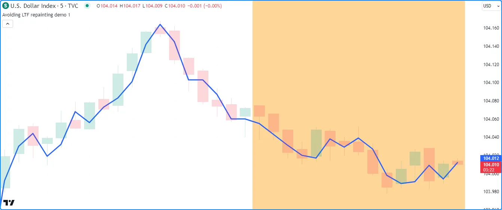

```c
//@version=5
indicator("Avoiding LTF repainting demo", overlay = true)

//@variable The lower timeframe of the requested data.
string lowerTimeframe = input.timeframe("1", "Timeframe")

//@variable An array of intrabar `close` values requested from the `lowerTimeframe` on each bar.
array<float> requestedCloses = request.security_lower_tf(syminfo.tickerid, lowerTimeframe, close)

//@variable The first intrabar `close` on each bar with available data.
float firstClose = requestedCloses.size() > 0 ? requestedCloses.first() : na

// Plot the `firstClose`.
plot(firstClose, "First intrabar close", linewidth = 3)
// Highlight the background on realtime bars.
bgcolor(barstate.isrealtime ? color.new(color.orange, 60) : na, title = "Realtime bar Highlight")
```

__Note que:__

- Embora [request.security_lower_tf()](https://br.tradingview.com/pine-script-reference/v5/#fun_request.security_lower_tf) seja mais otimizado para lidar com intrabarras históricas e em tempo real, ainda é possível em alguns casos que ocorra uma _repintura_ menor devido a diferenças de dados do provedor, conforme descrito acima.
- Este código pode não mostrar dados intrabar em todas as barras do gráfico disponíveis, dependendo de quantas intrabarras cada barra do gráfico contém, pois as funções `request.*()` podem recuperar até 100.000 intrabarras de um contexto LTF. Consulte [esta seção](./06_05_limitacoes.md#chamadas-request) da página de [Limitações](./06_05_limitacoes.md) para mais informações.

## `request.currency_rate()`

Quando um script precisa converter valores expressos em uma moeda para outra, pode-se usar [request.currency_rate()](https://br.tradingview.com/pine-script-reference/v5/#fun_request.currency_rate). Esta função solicita uma _taxa diária_ (_daily rate_) para cálculos de conversão de moeda com base nos dados "FX_IDC", fornecendo uma alternativa mais simples para buscar pares específicos ou [spreads](https://br.tradingview.com/support/solutions/43000502298) com [request.security()](https://br.tradingview.com/pine-script-reference/v5/#fun_request.security).

Embora seja possível usar [request.security()](https://br.tradingview.com/pine-script-reference/v5/#fun_request.security) para recuperar taxas diárias de câmbio, seu caso de uso é mais complexo do que [request.currency_rate()](https://br.tradingview.com/pine-script-reference/v5/#fun_request.currency_rate), pois é necessário fornecer um _ticker ID_ válido para um par de moedas ou spread para solicitar a taxa. Além disso, um deslocamento histórico e [barmerge.lookahead_on](https://br.tradingview.com/pine-script-reference/v5/#var_barmerge.lookahead_on) são necessários para evitar que os resultados façam repaint, conforme explicado [nesta seção](./05_14_outros_timeframes_e_dados.md#evitando-repintura).

A função [request.currency_rate()](https://br.tradingview.com/pine-script-reference/v5/#fun_request.currency_rate), por outro lado, requer apenas _códigos de moeda_ (_currency codes_). Não é necessário um ticker ID ao solicitar taxas com essa função, e ela garante resultados sem _repintar_ sem exigir especificações adicionais.

A assinatura da função é a seguinte:

```c
request.currency_rate(from, to, ignore_invalid_currency) → series float
```

O parâmetro `from` especifica a moeda a ser convertida, e o parâmetro `to` especifica a moeda de destino. Ambos os parâmetros aceitam valores "string" no formato [ISO 4217](https://pt.wikipedia.org/wiki/ISO_4217) (por exemplo, "USD") ou qualquer variável embutida `currency.*` (por exemplo, [currency.USD](https://br.tradingview.com/pine-script-reference/v5/#var_currency.USD)).

Quando a função não consegue calcular uma taxa de conversão válida entre as moedas `from` e `to` fornecidas na chamada, pode-se decidir se ela gerará um erro de execução ou retornará [na](https://br.tradingview.com/pine-script-reference/v5/#var_na) através do parâmetro `ignore_invalid_currency`. O valor padrão é `false`, o que significa que a função gerará um erro de execução e interromperá a execução do script.

O exemplo a seguir demonstra um caso de uso simples para [request.currency_rate()](https://br.tradingview.com/pine-script-reference/v5/#fun_request.currency_rate). Suponha que se deseje converter valores expressos em lira turca ([currency.TRY](https://br.tradingview.com/pine-script-reference/v5/#var_currency.TRY)) para won sul-coreano ([currency.KRW](https://br.tradingview.com/pine-script-reference/v5/#var_currency.KRW)) usando uma taxa de conversão diária. Se usarmos [request.security()](https://br.tradingview.com/pine-script-reference/v5/#fun_request.security) para recuperar a taxa, é necessário fornecer um ticker ID válido e solicitar o último [close](https://br.tradingview.com/pine-script-reference/v5/#var_close) confirmado do dia anterior.

Neste caso, não existe um símbolo "FX_IDC" que permita recuperar diretamente uma taxa de conversão com [request.security()](https://br.tradingview.com/pine-script-reference/v5/#fun_request.security). Portanto, primeiro é necessário um ticker ID para um [spread](https://br.tradingview.com/support/solutions/43000502298) que converta TRY para uma moeda intermediária, como USD, e depois converta a moeda intermediária para KRW. Em seguida, pode-se usar esse ticker ID dentro de [request.security()](https://br.tradingview.com/pine-script-reference/v5/#fun_request.security) com `close[1]` como `expression` e [barmerge.lookahead_on](https://br.tradingview.com/pine-script-reference/v5/#var_barmerge.lookahead_on) como valor de `lookahead` para solicitar uma _taxa diária sem repintar_ (_non-repainting daily rate_).

Alternativamente, pode-se alcançar o mesmo resultado de forma mais simples chamando [request.currency_rate()](https://br.tradingview.com/pine-script-reference/v5/#fun_request.currency_rate). Esta função faz todo o trabalho pesado para nós, exigindo apenas argumentos `from` e `to` de moeda para realizar seu cálculo.

Como pode ser visto abaixo, ambas as abordagens retornam a mesma taxa diária:

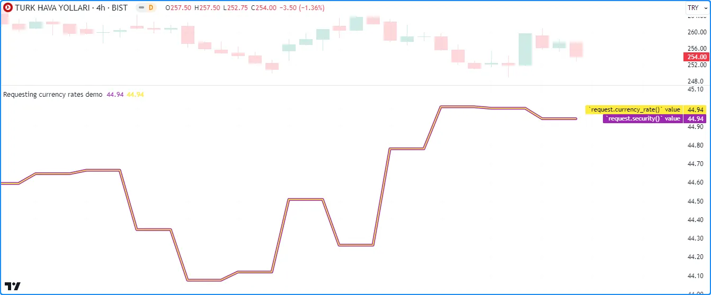

```c
//@version=5
indicator("Requesting currency rates demo")

//@variable The currency to convert.
simple string fromCurrency = currency.TRY
//@variable The resulting currency.
simple string toCurrency = currency.KRW

//@variable The spread symbol to request. Required in `request.security()` since no direct "FX_IDC" rate exists.
simple string spreadSymbol = str.format("FX_IDC:{0}{2} * FX_IDC:{2}{1}", fromCurrency, toCurrency, currency.USD)

//@variable The non-repainting conversion rate from `request.security()` using the `spreadSymbol`.
float securityRequestedRate = request.security(spreadSymbol, "1D", close[1], lookahead = barmerge.lookahead_on)
//@variable The non-repainting conversion rate from `request.currency_rate()`.
float nonSecurityRequestedRate = request.currency_rate(fromCurrency, toCurrency)

// Plot the requested rates. We can multiply TRY values by these rates to convert them to KRW.
plot(securityRequestedRate, "`request.security()` value", color.purple, 5)
plot(nonSecurityRequestedRate, "`request.currency_rate()` value", color.yellow, 2)
```

## `request.dividends()`, `request.splits()` e `request.earnings()`

Analisar os dados de lucros e ações corporativas de uma ação fornece informações valiosas sobre sua força financeira subjacente. Pine Script oferece a capacidade de recuperar informações essenciais sobre ações aplicáveis por meio de [request.dividends()](https://br.tradingview.com/pine-script-reference/v5/#fun_request.dividends), [request.splits()](https://br.tradingview.com/pine-script-reference/v5/#fun_request.splits) e [request.earnings()](https://br.tradingview.com/pine-script-reference/v5/#fun_request.earnings).

Estas são as assinaturas das funções:

```c
request.dividends(ticker, field, gaps, lookahead, ignore_invalid_symbol, currency) → series float

request.splits(ticker, field, gaps, lookahead, ignore_invalid_symbol) → series float

request.earnings(ticker, field, gaps, lookahead, ignore_invalid_symbol, currency) → series float
```

Cada função tem os mesmos parâmetros em sua assinatura, com exceção de [request.splits()](https://br.tradingview.com/pine-script-reference/v5/#fun_request.splits), que não possui um parâmetro `currency`.

Note que, ao contrário do parâmetro `symbol` em outras funções `request.*()`, o parâmetro `ticker` nessas funções aceita apenas um _par "Exchange:Symbol"_, como "NASDAQ:AAPL". A variável incorporada [syminfo.ticker](https://br.tradingview.com/pine-script-reference/v5/#var_syminfo.ticker) não funciona com essas funções, pois não contém informações sobre a bolsa. Em vez disso, deve-se usar [syminfo.tickerid](https://br.tradingview.com/pine-script-reference/v5/#var_syminfo.tickerid) nesses casos.

O parâmetro `field` determina os dados que a função irá recuperar. Cada uma dessas funções aceita diferentes variáveis embutidas como argumento `field`, pois cada uma solicita informações diferentes sobre uma ação (_stock_):

- A função [request.dividends()](https://br.tradingview.com/pine-script-reference/v5/#fun_request.dividends) recupera informações atuais de dividendos para uma ação, ou seja, o valor por ação que a empresa emissora pagou aos investidores que compraram ações antes da data ex-dividendo. Passar as variáveis embutidas [dividends.gross](https://br.tradingview.com/pine-script-reference/v5/#var_dividends.gross) ou [dividends.net](https://br.tradingview.com/pine-script-reference/v5/#var_dividends.net) para o parâmetro `field` especifica se o valor retornado representa dividendos antes ou depois de considerar as despesas que a empresa deduz de seus pagamentos.
- A função [request.splits()](https://br.tradingview.com/pine-script-reference/v5/#fun_request.splits) recupera informações atuais de desdobramento e desdobramento reverso para uma ação. Um desdobramento ocorre quando uma empresa aumenta suas ações em circulação para promover liquidez. Um desdobramento reverso ocorre quando uma empresa consolida suas ações e as oferece a um preço mais alto para atrair investidores específicos ou manter sua listagem em um mercado que tem um preço mínimo por ação. As empresas expressam suas informações de desdobramento como _ratios_. Por exemplo, um desdobramento de 5:1 significa que a empresa emitiu ações adicionais aos seus acionistas para que eles tenham cinco vezes o número de ações que tinham antes do desdobramento, e o preço bruto de cada ação torna-se um quinto do preço anterior. Passar [splits.numerator](https://br.tradingview.com/pine-script-reference/v5/#var_splits.numerator) ou [splits.denominator](https://br.tradingview.com/pine-script-reference/v5/#var_splits.denominator) para o parâmetro `field` de [request.splits()](https://br.tradingview.com/pine-script-reference/v5/#fun_request.splits) determina se ele retorna o numerador ou o denominador do _ratio_ de desdobramento.
- A função [request.earnings()](https://br.tradingview.com/pine-script-reference/v5/#fun_request.earnings) recupera informações de lucro por ação (EPS) para a empresa emissora do `ticker` da ação. O valor do EPS é o _ratio_ entre o lucro líquido de uma empresa e o número de ações em circulação, que os investidores consideram um indicador da lucratividade da empresa. Passar [earnings.actual](https://br.tradingview.com/pine-script-reference/v5/#var_earnings.actual), [earnings.estimate](https://br.tradingview.com/pine-script-reference/v5/#var_earnings.estimate) ou [earnings.standardized](https://br.tradingview.com/pine-script-reference/v5/#var_earnings.standardized) como argumento `field` em [request.earnings()](https://br.tradingview.com/pine-script-reference/v5/#fun_request.earnings) determina respectivamente se a função solicita o valor real, estimado ou padronizado do EPS.

Para uma explicação detalhada dos parâmetros `gaps`, `lookahead` e `ignore_invalid_symbol` dessas funções, consulte a seção [Características Comuns](./05_14_outros_timeframes_e_dados.md#características-comuns) no topo desta página.

É importante notar que os valores retornados por essas funções refletem os dados disponíveis à medida que chegam. Esse comportamento difere dos dados financeiros originados de uma chamada [request.financial()](https://br.tradingview.com/pine-script-reference/v5/#fun_request.financial) em que os dados subjacentes se tornam disponíveis de acordo com o período de relatório fiscal da empresa.

> __Observação!__\
> Scripts também podem recuperar informações sobre lucros e dividendos futuros para um instrumento por meio das variáveis embutidas `earnings.future_*` e `dividends.future_*`.

Aqui, foi adicionado um exemplo que exibe uma prática [tabela](https://br.tradingview.com/pine-script-reference/v5/#type_table) contendo os dados mais recentes de dividendos, desdobramentos e EPS. O script chama as funções `request.*()` discutidas nesta seção para recuperar os dados, depois converte os valores em "strings" com funções `str.*()` e exibe os resultados na `infoTable` com [table.cell()](https://br.tradingview.com/pine-script-reference/v5/#fun_table.cell):

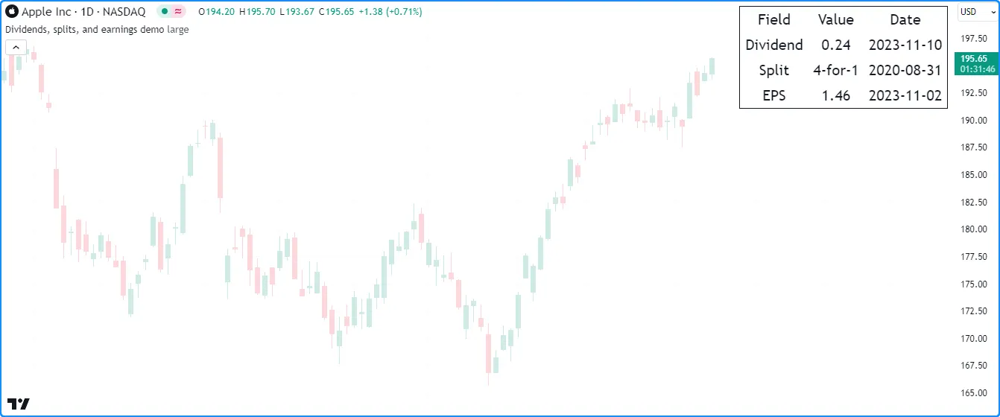

```c
//@version=5
indicator("Dividends, splits, and earnings demo", overlay = true)

//@variable The size of the table's text.
string tableSize = input.string(
     size.large, "Table size", [size.auto, size.tiny, size.small, size.normal, size.large, size.huge]
 )

//@variable The color of the table's text and frame.
var color tableColor = chart.fg_color
//@variable A `table` displaying the latest dividend, split, and EPS information.
var table infoTable = table.new(position.top_right, 3, 4, frame_color = tableColor, frame_width = 1)

// Add header cells on the first bar.
if barstate.isfirst
    table.cell(infoTable, 0, 0, "Field", text_color = tableColor, text_size = tableSize)
    table.cell(infoTable, 1, 0, "Value", text_color = tableColor, text_size = tableSize)
    table.cell(infoTable, 2, 0, "Date", text_color = tableColor, text_size = tableSize)
    table.cell(infoTable, 0, 1, "Dividend", text_color = tableColor, text_size = tableSize)
    table.cell(infoTable, 0, 2, "Split", text_color = tableColor, text_size = tableSize)
    table.cell(infoTable, 0, 3, "EPS", text_color = tableColor, text_size = tableSize)

//@variable The amount of the last reported dividend as of the current bar.
float latestDividend = request.dividends(syminfo.tickerid, dividends.gross, barmerge.gaps_on)
//@variable The numerator of that last reported split ratio as of the current bar.
float latestSplitNum = request.splits(syminfo.tickerid, splits.numerator, barmerge.gaps_on)
//@variable The denominator of the last reported split ratio as of the current bar.
float latestSplitDen = request.splits(syminfo.tickerid, splits.denominator, barmerge.gaps_on)
//@variable The last reported earnings per share as of the current bar.
float latestEPS = request.earnings(syminfo.tickerid, earnings.actual, barmerge.gaps_on)

// Update the "Value" and "Date" columns when new values come in.
if not na(latestDividend)
    table.cell(
         infoTable, 1, 1, str.tostring(math.round(latestDividend, 3)), text_color = tableColor, text_size = tableSize
     )
    table.cell(infoTable, 2, 1, str.format_time(time, "yyyy-MM-dd"), text_color = tableColor, text_size = tableSize)
if not na(latestSplitNum)
    table.cell(
         infoTable, 1, 2, str.format("{0}-for-{1}", latestSplitNum, latestSplitDen), text_color = tableColor,
         text_size = tableSize
     )
    table.cell(infoTable, 2, 2, str.format_time(time, "yyyy-MM-dd"), text_color = tableColor, text_size = tableSize)
if not na(latestEPS)
    table.cell(infoTable, 1, 3, str.tostring(latestEPS), text_color = tableColor, text_size = tableSize)
    table.cell(infoTable, 2, 3, str.format_time(time, "yyyy-MM-dd"), text_color = tableColor, text_size = tableSize)
```

__Note que:__

- Incluso [barmerge.gaps_on](https://br.tradingview.com/pine-script-reference/v5/#var_barmerge.gaps_on) nas chamadas `request.*()`, para que só retornem valores quando novos dados estiverem disponíveis. Caso contrário, retornam [na](https://br.tradingview.com/pine-script-reference/v5/#var_na).
- O script atribui um ID de [tabela](https://br.tradingview.com/pine-script-reference/v5/#type_table) à variável `infoTable` na primeira barra do gráfico. Nas barras subsequentes, atualiza as células necessárias com novas informações sempre que os dados estiverem disponíveis.
- Se não houver informações disponíveis de nenhuma das chamadas `request.*()` ao longo da história do gráfico (por exemplo, se o `ticker` não tiver informações de dividendos), o script não inicializa as células correspondentes, pois não é necessário.

## `request.quandl()`

O TradingView forma parcerias com muitas empresas fintech para fornecer aos usuários acesso a informações extensas sobre instrumentos financeiros, dados econômicos e mais. Um dos nossos muitos parceiros é o [Nasdaq Data Link](https://data.nasdaq.com/) (anteriormente Quandl), que fornece múltiplos feeds de dados _externos_ que os scripts podem acessar via a função [request.quandl()](https://br.tradingview.com/pine-script-reference/v5/#fun_request.quandl).

Aqui está a assinatura da função:

```c
request.quandl(ticker, gaps, index, ignore_invalid_symbol) → series float
```

O parâmetro `ticker` aceita uma "simple string" representando o ID do banco de dados publicado no Nasdaq Data Link e seu código de _time series_, separado pelo delimitador "/". Por exemplo, o código "FRED/DFF" representa a _time series_ "Effective Federal Funds Rate" do banco de dados "Federal Reserve Economic Data".

O parâmetro `index` aceita um "simple int" representando o _índice da coluna_ dos dados solicitados, onde 0 é a primeira coluna disponível. Consulte a documentação do banco de dados no site do Nasdaq Data Link para ver as colunas disponíveis.

Para detalhes sobre os parâmetros `gaps` e `ignore_invalid_symbol`, veja a seção [Características Comuns](./05_14_outros_timeframes_e_dados.md#características-comuns) desta página.

> __Observação!__\
> A função [request.quandl()](https://br.tradingview.com/pine-script-reference/v5/#fun_request.quandl) só pode solicitar dados __gratuitos__ do Nasdaq Data Link. Nenhum dado que exija uma assinatura paga dos serviços deles é acessível com esta função. O Nasdaq Data Link pode alterar os dados que fornece ao longo do tempo e pode não atualizar os conjuntos de dados disponíveis regularmente. Portanto, cabe aos programadores pesquisar os dados suportados disponíveis para solicitação e revisar a documentação fornecida para cada conjunto de dados. Você pode procurar dados gratuitos [aqui](https://data.nasdaq.com/search?filters=%5B%22Free%22%5D).

Este script solicita informações sobre a taxa de hash do Bitcoin ("HRATE") do banco de dados "Bitcoin Data Insights" ("BCHAIN") e [plota](./05_15_plots.md) a série temporal recuperada no gráfico. Ele usa [color.from_gradient()](https://br.tradingview.com/pine-script-reference/v5/#fun_color.from_gradient) para colorir o gráfico de [área](https://br.tradingview.com/pine-script-reference/v5/#var_plot.style_area) com base na distância da taxa de hash atual até sua [máxima histórica](https://br.tradingview.com/pine-script-reference/v5/#fun_ta.max):

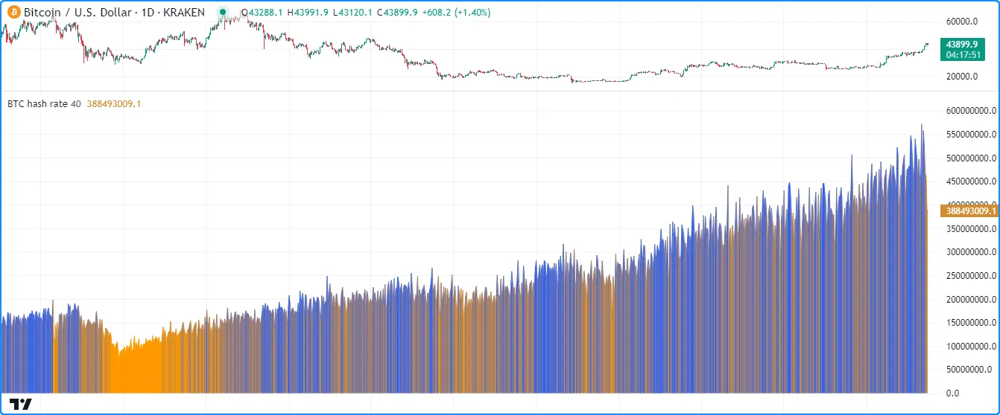

```c
//@version=5
indicator("Quandl demo", "BTC hash rate")

//@variable The estimated hash rate for the Bitcoin network.
float hashRate = request.quandl("BCHAIN/HRATE", barmerge.gaps_off, 0)
//@variable The percentage threshold from the all-time highest `hashRate`.
float dropThreshold = input.int(40, "Drop threshold", 0, 100)

//@variable The all-time highest `hashRate`.
float maxHashRate = ta.max(hashRate)
//@variable The value `dropThreshold` percent below the `maxHashRate`.
float minHashRate = maxHashRate * (100 - dropThreshold) / 100
//@variable The color of the plot based on the `minHashRate` and `maxHashRate`.
color plotColor = color.from_gradient(hashRate, minHashRate, maxHashRate, color.orange, color.blue)

// Plot the `hashRate`.
plot(hashRate, "Hash Rate Estimate", plotColor, style = plot.style_area)
```

## `request.financial()`

Métricas financeiras fornecem aos investidores insights sobre a saúde econômica e financeira de uma empresa que não são tangíveis apenas analisando seus preços de ações. O TradingView oferece uma ampla variedade de métricas financeiras da [FactSet](https://www.factset.com/) que os traders podem acessar via a aba "Financeiros" (_Financials_) no menu "Indicadores" (_Indicators_) do gráfico. Os scripts podem acessar as métricas disponíveis para um instrumento diretamente através da função [request.financial()](https://br.tradingview.com/pine-script-reference/v5/#fun_request.financial).

Esta é a assinatura da função:

```c
request.financial(symbol, financial_id, period, gaps, ignore_invalid_symbol, currency) → series float
```

Assim como o primeiro parâmetro em [request.dividends()](https://br.tradingview.com/pine-script-reference/v5/#fun_request.dividends), [request.splits()](https://br.tradingview.com/pine-script-reference/v5/#fun_request.splits) e [request.earnings()](https://br.tradingview.com/pine-script-reference/v5/#fun_request.earnings), o parâmetro `symbol` em [request.financial()](https://br.tradingview.com/pine-script-reference/v5/#fun_request.financial) requer um _par "Exchange:Symbol"_. Para solicitar informações financeiras para o ID do ticker do gráfico, use [syminfo.tickerid](https://br.tradingview.com/pine-script-reference/v5/#var_syminfo.tickerid), pois [syminfo.ticker](https://br.tradingview.com/pine-script-reference/v5/#var_syminfo.ticker) não funcionará.

O parâmetro `financial_id` aceita uma "simple string" representando o ID da métrica financeira solicitada. O TradingView possui várias métricas financeiras para escolher. Consulte a seção [IDs Financeiros](./05_14_outros_timeframes_e_dados.md#ids-financeiros) abaixo para uma visão geral de todas as métricas acessíveis e seus identificadores de "string".

O parâmetro `period` especifica o período fiscal para o qual novos dados solicitados são obtidos. Aceita um dos seguintes argumentos: __"FQ" (trimestral), "FH" (semestral), "FY" (anual) ou "TTM" (últimos doze meses)__. Nem todos os períodos fiscais estão disponíveis para todas as métricas ou instrumentos. Para confirmar quais períodos estão disponíveis para métricas específicas, consulte a segunda coluna das tabelas na seção [IDs Financeiros](./05_14_outros_timeframes_e_dados.md#ids-financeiros).

Veja a seção [Características Comuns](./05_14_outros_timeframes_e_dados.md#características-comuns) desta página para uma explicação detalhada dos parâmetros `gaps`, `ignore_invalid_symbol` e `currency` desta função.

É importante notar que os dados recuperados por esta função chegam em uma _frequência fixa_, independentemente da data precisa em que os dados são disponibilizados dentro de um período fiscal. Para informações sobre dividendos, desdobramentos e lucro por ação (EPS) de uma empresa, pode-se solicitar dados relatados em datas exatas via [request.dividends()](https://br.tradingview.com/pine-script-reference/v5/#fun_request.dividends), [request.splits()](https://br.tradingview.com/pine-script-reference/v5/#fun_request.splits) e [request.earnings()](https://br.tradingview.com/pine-script-reference/v5/#fun_request.earnings).

Este script usa [request.financial()](https://br.tradingview.com/pine-script-reference/v5/#fun_request.financial) para recuperar informações sobre a receita e despesas da empresa emissora de uma ação e visualizar a lucratividade de suas operações comerciais típicas. Solicita os "OPER_INCOME", "TOTAL_REVENUE" e "TOTAL_OPER_EXPENSE" [IDs Financeiros](./05_14_outros_timeframes_e_dados.md#ids-financeiros) para o [syminfo.tickerid](https://br.tradingview.com/pine-script-reference/v5/#var_syminfo.tickerid) durante o último `fiscalPeriod`, e então [plota](./05_15_plots.md) os resultados no gráfico:

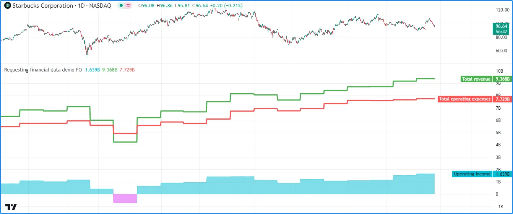

```c
//@version=5
indicator("Requesting financial data demo", format = format.volume)

//@variable The size of the fiscal reporting period. Some options may not be available, depending on the instrument.
string fiscalPeriod = input.string("FQ", "Period", ["FQ", "FH", "FY", "TTM"])

//@variable The operating income after expenses reported for the stock's issuing company.
float operatingIncome = request.financial(syminfo.tickerid, "OPER_INCOME", fiscalPeriod)
//@variable The total revenue reported for the stock's issuing company.
float totalRevenue = request.financial(syminfo.tickerid, "TOTAL_REVENUE", fiscalPeriod)
//@variable The total operating expenses reported for the stock's issuing company.
float totalExpenses = request.financial(syminfo.tickerid, "TOTAL_OPER_EXPENSE", fiscalPeriod)

//@variable Is aqua when the `totalRevenue` exceeds the `totalExpenses`, fuchsia otherwise.
color incomeColor = operatingIncome > 0 ? color.new(color.aqua, 50) : color.new(color.fuchsia, 50)

// Display the requested data.
plot(operatingIncome, "Operating income", incomeColor, 1, plot.style_area)
plot(totalRevenue, "Total revenue", color.green, 3)
plot(totalExpenses, "Total operating expenses", color.red, 3)
```

__Note que:__

- Nem todas as opções de `fiscalPeriod` estão disponíveis para cada ID de ticker. Por exemplo, empresas nos EUA normalmente publicam relatórios _trimestrais_, enquanto muitas empresas europeias publicam relatórios _semestrais_. Consulte [esta página](https://br.tradingview.com/support/solutions/43000540147) no nosso Centro de Ajuda para mais informações.

## Calculando Métricas Financeiras

A função [request.financial()](https://br.tradingview.com/pine-script-reference/v5/#fun_request.financial) pode fornecer scripts com inúmeras métricas financeiras úteis que não requerem cálculos adicionais. No entanto, algumas estimativas financeiras comumente usadas exigem a combinação do preço de mercado atual de um instrumento com os dados financeiros solicitados. Este é o caso de:

- Capitalização de mercado (preço de mercado * total de ações em circulação)
- Rendimento de lucros (EPS de 12 meses / preço de mercado)
- Índice Preço/Valor Patrimonial (preço de mercado / BVPS)
- Índice Preço/Lucro (preço de mercado / EPS)
- Índice Preço/Vendas (capitalização de mercado / receita total de 12 meses)

O script a seguir contém [funções definidas pelo usuário](./04_11_funcoes_definidas_pelo_usuario.md) que calculam as métricas financeiras acima para o [syminfo.tickerid](https://br.tradingview.com/pine-script-reference/v5/#var_syminfo.tickerid). Criamos essas funções para que os usuários possam copiá-las facilmente para seus scripts. Este exemplo as utiliza dentro de uma chamada [str.format()](https://br.tradingview.com/pine-script-reference/v5/#fun_str.format) para construir um `tooltipText`, que é exibido em tooltips no gráfico usando [labels](./05_20_text_e_shapes.md#labels). Ao passar o mouse sobre qualquer barra do [label](https://br.tradingview.com/pine-script-reference/v5/#type_label), o tooltip contendo as métricas calculadas naquela barra será exibido:

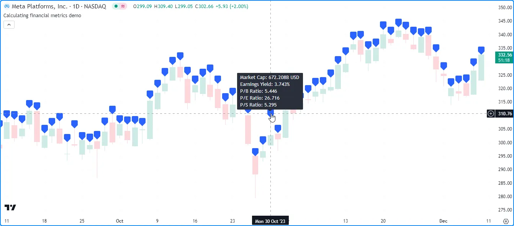


```c
//@version=5
indicator("Calculating financial metrics demo", overlay = true, max_labels_count = 500)

//@function Calculates the market capitalization (market cap) for the chart's symbol.
marketCap() =>
    //@variable The most recent number of outstanding shares reported for the symbol.
    float totalSharesOutstanding = request.financial(syminfo.tickerid, "TOTAL_SHARES_OUTSTANDING", "FQ")
    // Return the market cap value.
    totalSharesOutstanding * close

//@function Calculates the Earnings Yield for the chart's symbol.
earningsYield() =>
    //@variable The most recent 12-month earnings per share reported for the symbol.
    float eps = request.financial(syminfo.tickerid, "EARNINGS_PER_SHARE", "TTM")
    //Return the Earnings Yield percentage.
    100.0 * eps / close

//@function Calculates the Price-to-Book (P/B) ratio for the chart's symbol.
priceBookRatio() =>
    //@variable The most recent Book Value Per Share (BVPS) reported for the symbol.
    float bookValuePerShare = request.financial(syminfo.tickerid, "BOOK_VALUE_PER_SHARE", "FQ")
    // Return the P/B ratio.
    close / bookValuePerShare

//@function Calculates the Price-to-Earnings (P/E) ratio for the chart's symbol.
priceEarningsRatio() =>
    //@variable The most recent 12-month earnings per share reported for the symbol.
    float eps = request.financial(syminfo.tickerid, "EARNINGS_PER_SHARE", "TTM")
    // Return the P/E ratio.
    close / eps

//@function Calculates the Price-to-Sales (P/S) ratio for the chart's symbol.
priceSalesRatio() =>
    //@variable The most recent number of outstanding shares reported for the symbol.
    float totalSharesOutstanding = request.financial(syminfo.tickerid, "TOTAL_SHARES_OUTSTANDING", "FQ")
    //@variable The most recent 12-month total revenue reported for the symbol.
    float totalRevenue = request.financial(syminfo.tickerid, "TOTAL_REVENUE", "TTM")
    // Return the P/S ratio.
    totalSharesOutstanding * close / totalRevenue

//@variable The text to display in label tooltips.
string tooltipText = str.format(
     "Market Cap: {0} {1}\nEarnings Yield: {2}%\nP/B Ratio: {3}\nP/E Ratio: {4}\nP/S Ratio: {5}",
     str.tostring(marketCap(), format.volume), syminfo.currency, earningsYield(), priceBookRatio(),
     priceEarningsRatio(), priceSalesRatio()
 )

//@variable Displays a blank label with a tooltip containing the `tooltipText`.
label info = label.new(chart.point.now(high), tooltip = tooltipText)
```

__Note que:__

- Como nem todas as empresas publicam relatórios financeiros trimestrais, pode ser necessário alterar o "FQ" nessas funções para corresponder ao período mínimo de relatório para uma empresa específica, pois as chamadas [request.financial()](https://br.tradingview.com/pine-script-reference/v5/#fun_request.financial) retornarão [na](https://br.tradingview.com/pine-script-reference/v5/#var_na) quando os dados "FQ" não estiverem disponíveis.

## IDs Financeiros

Abaixo está uma visão geral de todas as métricas financeiras que podem ser solicitadas via [request.financial()](https://br.tradingview.com/pine-script-reference/v5/#fun_request.financial), juntamente com os períodos em que os relatórios podem estar disponíveis. Dividimos essas informações em quatro tabelas correspondentes às categorias exibidas na seção "Financeiros" ("_Financials_") do menu "Indicadores" ("_Indicators_"):

- [Demonstrações de resultados](./05_14_outros_timeframes_e_dados.md#demonstrações-de-resultados)
- [Balanço patrimonial](./05_14_outros_timeframes_e_dados.md#balanço-patrimonial)
- [Fluxo de caixa](./05_14_outros_timeframes_e_dados.md#fluxo-de-caixa)
- [Estatísticas](./05_14_outros_timeframes_e_dados.md#estatísticas)

Cada tabela possui as seguintes três colunas:

- A primeira coluna contém descrições de cada métrica com links para páginas do Centro de Ajuda para informações adicionais.
- A segunda coluna lista os possíveis argumentos `period` permitidos para a métrica. Observe que todos os valores disponíveis podem não ser compatíveis com IDs de ticker específicos, por exemplo, enquanto "FQ" pode ser um argumento possível, não funcionará se a empresa emissora não publicar dados trimestrais.
- A terceira coluna lista os IDs "string" para o argumento `financial_id` em [request.financial()](https://br.tradingview.com/pine-script-reference/v5/#fun_request.financial).

> __Observação!__\
> As tabelas nestas seções são bastante extensas, pois existem muitos argumentos `financial_id` disponíveis.

### Demonstrações de Resultados

Esta tabela lista as métricas disponíveis que fornecem informações sobre a renda, custos, lucros e perdas de uma empresa.

| Métrica Financeira                                                                                         | Período              | ID Financeiro               |
| ---------------------------------------------------------------------------------------------------------- | -------------------- | --------------------------- |
| [Renda/despesa de outras operações após impostos](https://br.tradingview.com/support/solutions/43000563497) | FQ, FH, FY, TTM      | AFTER_TAX_OTHER_INCOME      |
| [Média de ações básicas em circulação](https://br.tradingview.com/support/solutions/43000670320)           | FQ, FH, FY           | BASIC_SHARES_OUTSTANDING    |
| [Lucro básico por ação (EPS básico)](https://br.tradingview.com/support/solutions/43000563520)             | FQ, FH, FY, TTM      | EARNINGS_PER_SHARE_BASIC    |
| [Custo dos produtos vendidos](https://br.tradingview.com/support/solutions/43000553618)                    | FQ, FH, FY, TTM      | COST_OF_GOODS               |
| [Depreciação e amortização](https://br.tradingview.com/support/solutions/43000563477)                      | FQ, FH, FY, TTM      | DEP_AMORT_EXP_INCOME_S      |
| [Lucro diluído por ação (EPS diluído)](https://br.tradingview.com/support/solutions/43000553616)           | FQ, FH, FY, TTM      | EARNINGS_PER_SHARE_DILUTED  |
| [Lucro líquido diluído disponível para acionistas comuns](https://br.tradingview.com/support/solutions/43000563516) | FQ, FH, FY, TTM      | DILUTED_NET_INCOME          |
| [Ações diluídas em circulação](https://br.tradingview.com/support/solutions/43000670322)                   | FQ, FH, FY           | DILUTED_SHARES_OUTSTANDING  |
| [Ajuste de diluição](https://br.tradingview.com/support/solutions/43000563504)                             | FQ, FH, FY, TTM      | DILUTION_ADJUSTMENT         |
| [Operações descontinuadas](https://br.tradingview.com/support/solutions/43000563502)                       | FQ, FH, FY, TTM      | DISCONTINUED_OPERATIONS     |
| [EBIT](https://br.tradingview.com/support/solutions/43000670329)                                           | FQ, FH, FY, TTM      | EBIT                        |
| [EBITDA](https://br.tradingview.com/support/solutions/43000553610)                                         | FQ, FH, FY, TTM      | EBITDA                      |
| [Equity em lucros](https://br.tradingview.com/support/solutions/43000563487)                               | FQ, FH, FY, TTM      | EQUITY_IN_EARNINGS          |
| [Lucro bruto](https://br.tradingview.com/support/solutions/43000553611)                                    | FQ, FH, FY, TTM      | GROSS_PROFIT                |
| [Juros capitalizados](https://br.tradingview.com/support/solutions/43000563468)                            | FQ, FH, FY, TTM      | INTEREST_CAPITALIZED        |
| [Despesa de juros sobre dívida](https://br.tradingview.com/support/solutions/43000563467)                  | FQ, FH, FY, TTM      | INTEREST_EXPENSE_ON_DEBT    |
| [Despesa de juros, líquida de juros capitalizados](https://br.tradingview.com/support/solutions/43000563466) | FQ, FH, FY, TTM      | NON_OPER_INTEREST_EXP       |
| [Despesa não operacional diversa](https://br.tradingview.com/support/solutions/43000563479)                | FQ, FH, FY, TTM      | OTHER_INCOME                |
| [Lucro líquido](https://br.tradingview.com/support/solutions/43000553617)                                  | FQ, FH, FY, TTM      | NET_INCOME                  |
| [Lucro líquido antes de operações descontinuadas](https://br.tradingview.com/support/solutions/43000563500) | FQ, FH, FY, TTM      | NET_INCOME_BEF_DISC_OPER    |
| [Interesse minoritário/não controlador](https://br.tradingview.com/support/solutions/43000563495)          | FQ, FH, FY, TTM      | MINORITY_INTEREST_EXP       |
| [Renda não operacional, excl. despesas de juros](https://br.tradingview.com/support/solutions/43000563471) | FQ, FH, FY, TTM      | NON_OPER_INCOME             |
| [Renda não operacional, total](https://br.tradingview.com/support/solutions/43000563465)                   | FQ, FH, FY, TTM      | TOTAL_NON_OPER_INCOME       |
| [Renda de juros não operacionais](https://br.tradingview.com/support/solutions/43000563473)                | FQ, FH, FY, TTM      | NON_OPER_INTEREST_INCOME    |
| [Despesas operacionais (excl. COGS)](https://br.tradingview.com/support/solutions/43000563463)             | FQ, FH, FY, TTM      | OPERATING_EXPENSES          |
| [Lucro operacional](https://br.tradingview.com/support/solutions/43000563464)                              | FQ, FH, FY, TTM      | OPER_INCOME                 |
| [Outros custos de bens vendidos](https://br.tradingview.com/support/solutions/43000563478)                 | FQ, FH, FY, TTM      | COST_OF_GOODS_EXCL_DEP_AMORT |
| [Outras despesas operacionais, total](https://br.tradingview.com/support/solutions/43000563483)            | FQ, FH, FY, TTM      | OTHER_OPER_EXPENSE_TOTAL    |
| [Dividendos preferenciais](https://br.tradingview.com/support/solutions/43000563506)                       | FQ, FH, FY, TTM      | PREFERRED_DIVIDENDS         |
| [Equity em lucros antes dos impostos](https://br.tradingview.com/support/solutions/43000563474)            | FQ, FH, FY, TTM      | PRETAX_EQUITY_IN_EARNINGS   |
| [Lucro antes dos impostos](https://br.tradingview.com/support/solutions/43000563462)                       | FQ, FH, FY, TTM      | PRETAX_INCOME               |
| [Pesquisa e desenvolvimento](https://br.tradingview.com/support/solutions/43000553612)                     | FQ, FH, FY, TTM      | RESEARCH_AND_DEV            |
| [Despesas administrativas/comerciais gerais, outras](https://br.tradingview.com/support/solutions/43000553614) | FQ, FH, FY, TTM      | SELL_GEN_ADMIN_EXP_OTHER    |
| [Despesas administrativas/comerciais gerais, total](https://br.tradingview.com/support/solutions/43000553613) | FQ, FH, FY, TTM      | SELL_GEN_ADMIN_EXP_TOTAL    |
| [Impostos](https://br.tradingview.com/support/solutions/43000563492)                                        | FQ, FH, FY, TTM      | INCOME_TAX                  |
| [Despesas operacionais totais](https://br.tradingview.com/support/solutions/43000553615)                   | FQ, FH, FY, TTM      | TOTAL_OPER_EXPENSE          |
| [Receita total](https://br.tradingview.com/support/solutions/43000553619)                                  | FQ, FH, FY, TTM      | TOTAL_REVENUE               |
| [Renda/despesa incomum](https://br.tradingview.com/support/solutions/43000563476)                          | FQ, FH, FY, TTM      | UNUSUAL_EXPENSE_INC         |

### Balanço Patrimonial

Esta tabela lista as métricas que fornecem informações sobre a estrutura de capital de uma empresa.

| Métrica Financeira | Período | ID Financeiro |
| --- | --- | --- |
| [Contas a pagar](https://br.tradingview.com/support/solutions/43000563619) | FQ, FH, FY | ACCOUNTS_PAYABLE |
| [Contas a receber - comércio, líquido](https://br.tradingview.com/support/solutions/43000563740) | FQ, FH, FY | ACCOUNTS_RECEIVABLES_NET |
| [Folha de pagamento acumulada](https://br.tradingview.com/support/solutions/43000563628) | FQ, FH, FY | ACCRUED_PAYROLL |
| [Depreciação acumulada, total](https://br.tradingview.com/support/solutions/43000563673) | FQ, FH, FY | ACCUM_DEPREC_TOTAL |
| [Capital adicional integralizado/Excedente de capital](https://br.tradingview.com/support/solutions/43000563874) | FQ, FH, FY | ADDITIONAL_PAID_IN_CAPITAL |
| [Valor contábil por ação](https://br.tradingview.com/support/solutions/43000670330) | FQ, FH, FY | BOOK_VALUE_PER_SHARE |
| [Obrigações de arrendamento capital e operacional](https://br.tradingview.com/support/solutions/43000563522) | FQ, FH, FY | CAPITAL_OPERATING_LEASE_OBLIGATIONS |
| [Obrigações de arrendamento capitalizado](https://br.tradingview.com/support/solutions/43000563527) | FQ, FH, FY | CAPITAL_LEASE_OBLIGATIONS |
| [Caixa e equivalentes](https://br.tradingview.com/support/solutions/43000563709) | FQ, FH, FY | CASH_N_EQUIVALENTS |
| [Caixa e investimentos de curto prazo](https://br.tradingview.com/support/solutions/43000563702) | FQ, FH, FY | CASH_N_SHORT_TERM_INVEST |
| [Capital comum, total](https://br.tradingview.com/support/solutions/43000563866) | FQ, FH, FY | COMMON_EQUITY_TOTAL |
| [Valor nominal/Contábil das ações ordinárias](https://br.tradingview.com/support/solutions/43000563873) | FQ, FH, FY | COMMON_STOCK_PAR |
| [Porção atual da dívida de longo prazo e arrendamentos de capital](https://br.tradingview.com/support/solutions/43000563557) | FQ, FH, FY | CURRENT_PORT_DEBT_CAPITAL_LEASES |
| [Renda diferida, atual](https://br.tradingview.com/support/solutions/43000563631) | FQ, FH, FY | DEFERRED_INCOME_CURRENT |
| [Renda diferida, não atual](https://br.tradingview.com/support/solutions/43000563540) | FQ, FH, FY | DEFERRED_INCOME_NON_CURRENT |
| [Ativos fiscais diferidos](https://br.tradingview.com/support/solutions/43000563683) | FQ, FH, FY | DEFERRED_TAX_ASSESTS |
| [Passivos fiscais diferidos](https://br.tradingview.com/support/solutions/43000563536) | FQ, FH, FY | DEFERRED_TAX_LIABILITIES |
| [Dividendos a pagar](https://br.tradingview.com/support/solutions/43000563624) | FY | DIVIDENDS_PAYABLE |
| [Goodwill, líquido](https://br.tradingview.com/support/solutions/43000563688) | FQ, FH, FY | GOODWILL |
| [Propriedade/planta/equipamento bruto](https://br.tradingview.com/support/solutions/43000563667) | FQ, FH, FY | PPE_TOTAL_GROSS |
| [Imposto de renda a pagar](https://br.tradingview.com/support/solutions/43000563621) | FQ, FH, FY | INCOME_TAX_PAYABLE |
| [Estoques - produtos acabados](https://br.tradingview.com/support/solutions/43000563749) | FQ, FH, FY | INVENTORY_FINISHED_GOODS |
| [Estoques - pagamentos em progresso e outros](https://br.tradingview.com/support/solutions/43000563748) | FQ, FH, FY | INVENTORY_PROGRESS_PAYMENTS |
| [Estoques - matérias-primas](https://br.tradingview.com/support/solutions/43000563753) | FQ, FH, FY | INVENTORY_RAW_MATERIALS |
| [Estoques - trabalho em progresso](https://br.tradingview.com/support/solutions/43000563746) | FQ, FH, FY | INVENTORY_WORK_IN_PROGRESS |
| [Investimentos em subsidiárias não consolidadas](https://br.tradingview.com/support/solutions/43000563645) | FQ, FH, FY | INVESTMENTS_IN_UNCONCSOLIDATE |
| [Dívida de longo prazo](https://br.tradingview.com/support/solutions/43000553621) | FQ, FH, FY | LONG_TERM_DEBT |
| [Dívida de longo prazo exceto passivos de arrendamento](https://br.tradingview.com/support/solutions/43000563521) | FQ, FH, FY | LONG_TERM_DEBT_EXCL_CAPITAL_LEASE |
| [Investimentos de longo prazo](https://br.tradingview.com/support/solutions/43000563639) | FQ, FH, FY | LONG_TERM_INVESTMENTS |
| [Interesse minoritário](https://br.tradingview.com/support/solutions/43000563884) | FQ, FH, FY | MINORITY_INTEREST |
| [Dívida líquida](https://br.tradingview.com/support/solutions/43000665310) | FQ, FH, FY | NET_DEBT |
| [Ativos intangíveis líquidos](https://br.tradingview.com/support/solutions/43000563686) | FQ, FH, FY | INTANGIBLES_NET |
| [Propriedade/planta/equipamento líquido](https://br.tradingview.com/support/solutions/43000563657) | FQ, FH, FY | PPE_TOTAL_NET |
| [Nota a receber - longo prazo](https://br.tradingview.com/support/solutions/43000563641) | FQ, FH, FY | LONG_TERM_NOTE_RECEIVABLE |
| [Notas a pagar](https://br.tradingview.com/support/solutions/43000563600) | FY | NOTES_PAYABLE_SHORT_TERM_DEBT |
| [Passivos de arrendamento operacional](https://br.tradingview.com/support/solutions/43000563532) | FQ, FH, FY | OPERATING_LEASE_LIABILITIES |
| [Outros capitais comuns](https://br.tradingview.com/support/solutions/43000563877) | FQ, FH, FY | OTHER_COMMON_EQUITY |
| [Outros ativos correntes, total](https://br.tradingview.com/support/solutions/43000563761) | FQ, FH, FY | OTHER_CURRENT_ASSETS_TOTAL |
| [Outros passivos correntes](https://br.tradingview.com/support/solutions/43000563635) | FQ, FH, FY | OTHER_CURRENT_LIABILITIES |
| [Outros intangíveis, líquidos](https://br.tradingview.com/support/solutions/43000563689) | FQ, FH, FY | OTHER_INTANGIBLES_NET |
| [Outros investimentos](https://br.tradingview.com/support/solutions/43000563649) | FQ, FH, FY | OTHER_INVESTMENTS |
| [Outros ativos de longo prazo, total](https://br.tradingview.com/support/solutions/43000563693) | FQ, FH, FY | LONG_TERM_OTHER_ASSETS_TOTAL |
| [Outros passivos não correntes, total](https://br.tradingview.com/support/solutions/43000563545) | FQ, FH, FY | OTHER_LIABILITIES_TOTAL |
| [Outros recebíveis](https://br.tradingview.com/support/solutions/43000563741) | FQ, FH, FY | OTHER_RECEIVABLES |
| [Outras dívidas de curto prazo](https://br.tradingview.com/support/solutions/43000563614) | FY | OTHER_SHORT_TERM_DEBT |
| [Capital integralizado](https://br.tradingview.com/support/solutions/43000563871) | FQ, FH, FY | PAID_IN_CAPITAL |
| [Ações preferenciais, valor contábil](https://br.tradingview.com/support/solutions/43000563879) | FQ, FH, FY | PREFERRED_STOCK_CARRYING_VALUE |
| [Despesas pré-pagas](https://br.tradingview.com/support/solutions/43000563757) | FQ, FH, FY | PREPAID_EXPENSES |
| [Provisão para riscos e encargos](https://br.tradingview.com/support/solutions/43000563535) | FQ, FH, FY | PROVISION_F_RISKS |
| [Lucros acumulados](https://br.tradingview.com/support/solutions/43000563867) | FQ, FH, FY | RETAINED_EARNINGS |
| [Patrimônio dos acionistas](https://br.tradingview.com/support/solutions/43000557442) | FQ, FH, FY | SHRHLDRS_EQUITY |
| [Dívida de curto prazo](https://br.tradingview.com/support/solutions/43000563554) | FQ, FH, FY | SHORT_TERM_DEBT |
| [Dívida de curto prazo exceto porção atual da dívida de longo prazo](https://br.tradingview.com/support/solutions/43000563563) | FQ, FH, FY | SHORT_TERM_DEBT_EXCL_CURRENT_PORT |
| [Investimentos de curto prazo](https://br.tradingview.com/support/solutions/43000563716) | FQ, FH, FY | SHORT_TERM_INVEST |
| [Valor contábil tangível por ação](https://br.tradingview.com/support/solutions/43000597072) | FQ, FH, FY | BOOK_TANGIBLE_PER_SHARE |
| [Ativos totais](https://br.tradingview.com/support/solutions/43000553623) | FQ, FH, FY | TOTAL_ASSETS |
| [Ativos correntes totais](https://br.tradingview.com/support/solutions/43000557441) | FQ, FH, FY | TOTAL_CURRENT_ASSETS |
| [Passivos correntes totais](https://br.tradingview.com/support/solutions/43000557437) | FQ, FH, FY | TOTAL_CURRENT_LIABILITIES |
| [Dívida total](https://br.tradingview.com/support/solutions/43000553622) | FQ, FH, FY | TOTAL_DEBT |
| [Patrimônio total](https://br.tradingview.com/support/solutions/43000553625) | FQ, FH, FY | TOTAL_EQUITY |
| [Inventário total](https://br.tradingview.com/support/solutions/43000563745) | FQ, FH, FY | TOTAL_INVENTORY |
| [Passivos totais](https://br.tradingview.com/support/solutions/43000553624) | FQ, FH, FY | TOTAL_LIABILITIES |
| [Passivos totais & patrimônio dos acionistas](https://br.tradingview.com/support/solutions/43000553626) | FQ, FH, FY | TOTAL_LIABILITIES_SHRHLDRS_EQUITY |
| [Ativos não correntes totais](https://br.tradingview.com/support/solutions/43000557440) | FQ, FH, FY | TOTAL_NON_CURRENT_ASSETS |
| [Passivos não correntes totais](https://br.tradingview.com/support/solutions/43000557436) | FQ, FH, FY | TOTAL_NON_CURRENT_LIABILITIES |
| [Recebíveis totais, líquido](https://br.tradingview.com/support/solutions/43000563738) | FQ, FH, FY | TOTAL_RECEIVABLES_NET |
| [Ações em tesouraria - comum](https://br.tradingview.com/support/solutions/43000563875) | FQ, FH, FY | TREASURY_STOCK_COMMON |

### Fluxo de Caixa

Esta tabela lista as métricas disponíveis que fornecem informações sobre como o caixa flui através de uma empresa.

| Métrica Financeira | Período | ID Financeiro |
| --- | --- | --- |
| [Amortização](https://br.tradingview.com/support/solutions/43000564143) | FQ, FH, FY, TTM | AMORTIZATION |
| [Despesas de capital](https://br.tradingview.com/support/solutions/43000564166) | FQ, FH, FY, TTM | CAPITAL_EXPENDITURES |
| [Despesas de capital - ativos fixos](https://br.tradingview.com/support/solutions/43000564167) | FQ, FH, FY, TTM | CAPITAL_EXPENDITURES_FIXED_ASSETS |
| [Despesas de capital - outros ativos](https://br.tradingview.com/support/solutions/43000564168) | FQ, FH, FY, TTM | CAPITAL_EXPENDITURES_OTHER_ASSETS |
| [Caixa das atividades de financiamento](https://br.tradingview.com/support/solutions/43000553629) | FQ, FH, FY, TTM | CASH_F_FINANCING_ACTIVITIES |
| [Caixa das atividades de investimento](https://br.tradingview.com/support/solutions/43000553628) | FQ, FH, FY, TTM | CASH_F_INVESTING_ACTIVITIES |
| [Caixa das atividades operacionais](https://br.tradingview.com/support/solutions/43000553627) | FQ, FH, FY, TTM | CASH_F_OPERATING_ACTIVITIES |
| [Alteração em contas a pagar](https://br.tradingview.com/support/solutions/43000564150) | FQ, FH, FY, TTM | CHANGE_IN_ACCOUNTS_PAYABLE |
| [Alteração em contas a receber](https://br.tradingview.com/support/solutions/43000564148) | FQ, FH, FY, TTM | CHANGE_IN_ACCOUNTS_RECEIVABLE |
| [Alteração em despesas acumuladas](https://br.tradingview.com/support/solutions/43000564151) | FQ, FH, FY, TTM | CHANGE_IN_ACCRUED_EXPENSES |
| [Alteração em inventários](https://br.tradingview.com/support/solutions/43000564153) | FQ, FH, FY, TTM | CHANGE_IN_INVENTORIES |
| [Alteração em outros ativos/passivos](https://br.tradingview.com/support/solutions/43000564154) | FQ, FH, FY, TTM | CHANGE_IN_OTHER_ASSETS |
| [Alteração em impostos a pagar](https://br.tradingview.com/support/solutions/43000564149) | FQ, FH, FY, TTM | CHANGE_IN_TAXES_PAYABLE |
| [Alterações no capital de giro](https://br.tradingview.com/support/solutions/43000564147) | FQ, FH, FY, TTM | CHANGES_IN_WORKING_CAPITAL |
| [Dividendos comuns pagos](https://br.tradingview.com/support/solutions/43000564185) | FQ, FH, FY, TTM | COMMON_DIVIDENDS_CASH_FLOW |
| [Impostos diferidos (fluxo de caixa)](https://br.tradingview.com/support/solutions/43000564144) | FQ, FH, FY, TTM | CASH_FLOW_DEFERRED_TAXES |
| [Depreciação e amortização (fluxo de caixa)](https://br.tradingview.com/support/solutions/43000563892) | FQ, FH, FY, TTM | CASH_FLOW_DEPRECATION_N_AMORTIZATION |
| [Depreciação/exaustão](https://br.tradingview.com/support/solutions/43000564142) | FQ, FH, FY, TTM | DEPRECIATION_DEPLETION |
| [Atividades de financiamento - outras fontes](https://br.tradingview.com/support/solutions/43000564181) | FQ, FH, FY, TTM | OTHER_FINANCING_CASH_FLOW_SOURCES |
| [Atividades de financiamento - outros usos](https://br.tradingview.com/support/solutions/43000564182) | FQ, FH, FY, TTM | OTHER_FINANCING_CASH_FLOW_USES |
| [Fluxo de caixa livre](https://br.tradingview.com/support/solutions/43000553630) | FQ, FH, FY, TTM | FREE_CASH_FLOW |
| [Fundos das operações](https://br.tradingview.com/support/solutions/43000563886) | FQ, FH, FY, TTM | FUNDS_F_OPERATIONS |
| [Atividades de investimento - outras fontes](https://br.tradingview.com/support/solutions/43000564164) | FQ, FH, FY, TTM | OTHER_INVESTING_CASH_FLOW_SOURCES |
| [Atividades de investimento - outros usos](https://br.tradingview.com/support/solutions/43000564165) | FQ, FH, FY | OTHER_INVESTING_CASH_FLOW_USES |
| [Emissão de dívida de longo prazo](https://br.tradingview.com/support/solutions/43000564176) | FQ, FH, FY, TTM | SUPPLYING_OF_LONG_TERM_DEBT |
| [Emissão/redução de dívida, líquido](https://br.tradingview.com/support/solutions/43000564172) | FQ, FH, FY, TTM | ISSUANCE_OF_DEBT_NET |
| [Emissão/redução de dívida de longo prazo](https://br.tradingview.com/support/solutions/43000564175) | FQ, FH, FY, TTM | ISSUANCE_OF_LONG_TERM_DEBT |
| [Emissão/redução de outras dívidas](https://br.tradingview.com/support/solutions/43000564178) | FQ, FH, FY, TTM | ISSUANCE_OF_OTHER_DEBT |
| [Emissão/redução de dívida de curto prazo](https://br.tradingview.com/support/solutions/43000564173) | FQ, FH, FY, TTM | ISSUANCE_OF_SHORT_TERM_DEBT |
| [Emissão/redução de ações, líquido](https://br.tradingview.com/support/solutions/43000564169) | FQ, FH, FY, TTM | ISSUANCE_OF_STOCK_NET |
| [Lucro líquido (fluxo de caixa)](https://br.tradingview.com/support/solutions/43000563888) | FQ, FH, FY, TTM | NET_INCOME_STARTING_LINE |
| [Itens não monetários](https://br.tradingview.com/support/solutions/43000564146) | FQ, FH, FY, TTM | NON_CASH_ITEMS |
| [Outros itens de fluxo de caixa de financiamento, total](https://br.tradingview.com/support/solutions/43000564179) | FQ, FH, FY, TTM | OTHER_FINANCING_CASH_FLOW_ITEMS_TOTAL |
| [Outros itens de fluxo de caixa de investimento, total](https://br.tradingview.com/support/solutions/43000564163) | FQ, FH, FY | OTHER_INVESTING_CASH_FLOW_ITEMS_TOTAL |
| [Dividendos preferenciais pagos](https://br.tradingview.com/support/solutions/43000564186) | FQ, FH, FY | PREFERRED_DIVIDENDS_CASH_FLOW |
| [Compra de investimentos](https://br.tradingview.com/support/solutions/43000564162) | FQ, FH, FY, TTM | PURCHASE_OF_INVESTMENTS |
| [Compra/aquisição de negócios](https://br.tradingview.com/support/solutions/43000564159) | FQ, FH, FY, TTM | PURCHASE_OF_BUSINESS |
| [Compra/venda de negócios, líquido](https://br.tradingview.com/support/solutions/43000564156) | FQ, FH, FY | PURCHASE_SALE_BUSINESS |
| [Compra/venda de investimentos, líquido](https://br.tradingview.com/support/solutions/43000564160) | FQ, FH, FY, TTM | PURCHASE_SALE_INVESTMENTS |
| [Redução da dívida de longo prazo](https://br.tradingview.com/support/solutions/43000564177) | FQ, FH, FY, TTM | REDUCTION_OF_LONG_TERM_DEBT |
| [Recompra de ações comuns e preferenciais](https://br.tradingview.com/support/solutions/43000564171) | FQ, FH, FY, TTM | PURCHASE_OF_STOCK |
| [Venda de ações comuns e preferenciais](https://br.tradingview.com/support/solutions/43000564170) | FQ, FH, FY, TTM | SALE_OF_STOCK |
| [Venda de ativos fixos e negócios](https://br.tradingview.com/support/solutions/43000564158) | FQ, FH, FY, TTM | SALES_OF_BUSINESS |
| [Venda/vencimento de investimentos](https://br.tradingview.com/support/solutions/43000564161) | FQ, FH, FY | SALES_OF_INVESTMENTS |
| [Total de dividendos em dinheiro pagos](https://br.tradingview.com/support/solutions/43000564183) | FQ, FH, FY, TTM | TOTAL_CASH_DIVIDENDS_PAID |

### Estatísticas

Esta tabela contém uma variedade de métricas estatísticas, incluindo índices financeiros comumente usados.

| Métrica Financeira | Período | ID Financeiro |
| --- | --- | --- |
| [Acréscimos](https://br.tradingview.com/support/solutions/43000597073) | FQ, FH, FY | ACCRUALS_RATIO |
| [Altman Z-score](https://br.tradingview.com/support/solutions/43000597092) | FQ, FH, FY | ALTMAN_Z_SCORE |
| [Giro de ativos](https://br.tradingview.com/support/solutions/43000597022) | FQ, FH, FY | ASSET_TURNOVER |
| [Beneish M-score](https://br.tradingview.com/support/solutions/43000597835) | FQ, FH, FY | BENEISH_M_SCORE |
| [Rendimento de recompra %](https://br.tradingview.com/support/solutions/43000597088) | FQ, FH, FY | BUYBACK_YIELD |
| [Índice COGS para receita](https://br.tradingview.com/support/solutions/43000597026) | FQ, FH, FY | COGS_TO_REVENUE |
| [Ciclo de conversão de caixa](https://br.tradingview.com/support/solutions/43000597089) | FQ, FY | CASH_CONVERSION_CYCLE |
| [Rácio de caixa para dívida](https://br.tradingview.com/support/solutions/43000597023) | FQ, FH, FY | CASH_TO_DEBT |
| [Índice de liquidez corrente](https://br.tradingview.com/support/solutions/43000597051) | FQ, FH, FY | CURRENT_RATIO |
| [Dias de inventário](https://br.tradingview.com/support/solutions/43000597028) | FQ, FY | DAYS_INVENT |
| [Dias a pagar](https://br.tradingview.com/support/solutions/43000597029) | FQ, FY | DAYS_PAY |
| [Dias de vendas pendentes](https://br.tradingview.com/support/solutions/43000597030) | FQ, FY | DAY_SALES_OUT |
| [Dívida para EBITDA](https://br.tradingview.com/support/solutions/43000597032) | FQ, FH, FY | DEBT_TO_EBITDA |
| [Rácio de dívida para ativos](https://br.tradingview.com/support/solutions/43000597031) | FQ, FH, FY | DEBT_TO_ASSET |
| [Rácio de dívida para patrimônio](https://br.tradingview.com/support/solutions/43000597078) | FQ, FH, FY | DEBT_TO_EQUITY |
| [Rácio de dívida para receita](https://br.tradingview.com/support/solutions/43000597033) | FQ, FH, FY | DEBT_TO_REVENUE |
| [Índice de pagamento de dividendos %](https://br.tradingview.com/support/solutions/43000597738) | FQ, FH, FY, TTM | DIVIDEND_PAYOUT_RATIO |
| [Rendimento de dividendos %](https://br.tradingview.com/support/solutions/43000597817) | FQ, FH, FY | DIVIDENDS_YIELD |
| [Dividendos por ação - emissão primária de ações ordinárias](https://br.tradingview.com/support/solutions/43000670334) | FQ, FH, FY, TTM | DPS_COMMON_STOCK_PRIM_ISSUE |
| [Margem EBITDA %](https://br.tradingview.com/support/solutions/43000597075) | FQ, FH, FY, TTM | EBITDA_MARGIN |
| [Crescimento básico do EPS em um ano](https://br.tradingview.com/support/solutions/43000597069) | FQ, FH, FY, TTM | EARNINGS_PER_SHARE_BASIC_ONE_YEAR_GROWTH |
| [Crescimento diluído do EPS em um ano](https://br.tradingview.com/support/solutions/43000597071) | FQ, FH, FY | EARNINGS_PER_SHARE_DILUTED_ONE_YEAR_GROWTH |
| [Estimativas de EPS](https://br.tradingview.com/support/solutions/43000597066) | FQ, FH, FY | EARNINGS_ESTIMATE |
| [Taxa de juros efetiva sobre dívida %](https://br.tradingview.com/support/solutions/43000597034) | FQ, FH, FY | EFFECTIVE_INTEREST_RATE_ON_DEBT |
| [Valor empresarial](https://br.tradingview.com/support/solutions/43000597077) | FQ, FH, FY | ENTERPRISE_VALUE |
| [Rácio de valor empresarial para EBIT](https://br.tradingview.com/support/solutions/43000597063) | FQ, FH, FY | EV_EBIT |
| [Rácio de valor empresarial para EBITDA](https://br.tradingview.com/support/solutions/43000597064) | FQ, FH, FY | ENTERPRISE_VALUE_EBITDA |
| [Rácio de valor empresarial para receita](https://br.tradingview.com/support/solutions/43000597065) | FQ, FH, FY | EV_REVENUE |
| [Rácio de patrimônio para ativos](https://br.tradingview.com/support/solutions/43000597035) | FQ, FH, FY | EQUITY_TO_ASSET |
| [Ações flutuantes em circulação](https://br.tradingview.com/support/solutions/43000670341) | FY | FLOAT_SHARES_OUTSTANDING |
| [Margem de fluxo de caixa livre %](https://br.tradingview.com/support/solutions/43000597813) | FQ, FH, FY | FREE_CASH_FLOW_MARGIN |
| [Fator Fulmer H](https://br.tradingview.com/support/solutions/43000597847) | FQ, FY | FULMER_H_FACTOR |
| [Rácio de goodwill para ativos](https://br.tradingview.com/support/solutions/43000597036) | FQ, FH, FY | GOODWILL_TO_ASSET |
| [Número de Graham](https://br.tradingview.com/support/solutions/43000597084) | FQ, FY | GRAHAM_NUMBERS |
| [Margem bruta %](https://br.tradingview.com/support/solutions/43000597811) | FQ, FH, FY, TTM | GROSS_MARGIN |
| [Rácio de lucro bruto para ativos](https://br.tradingview.com/support/solutions/43000597087) | FQ, FY | GROSS_PROFIT_TO_ASSET |
| [Cobertura de juros](https://br.tradingview.com/support/solutions/43000597037) | FQ, FH, FY | INTERST_COVER |
| [Rácio de inventário para receita](https://br.tradingview.com/support/solutions/43000597047) | FQ, FH, FY | INVENT_TO_REVENUE |
| [Rotatividade de inventário](https://br.tradingview.com/support/solutions/43000597046) | FQ, FH, FY | INVENT_TURNOVER |
| [Índice KZ](https://br.tradingview.com/support/solutions/43000597844) | FY | KZ_INDEX |
| [Rácio de dívida de longo prazo para ativos totais](https://br.tradingview.com/support/solutions/43000597048) | FQ, FH, FY | LONG_TERM_DEBT_TO_ASSETS |
| [Valor atual líquido por ação](https://br.tradingview.com/support/solutions/43000597085) | FQ, FY | NCAVPS_RATIO |
| [Lucro líquido por empregado](https://br.tradingview.com/support/solutions/43000597082) | FY | NET_INCOME_PER_EMPLOYEE |
| [Margem líquida %](https://br.tradingview.com/support/solutions/43000597074) | FQ, FH, FY, TTM | NET_MARGIN |
| [Número de empregados](https://br.tradingview.com/support/solutions/43000597080) | FY | NUMBER_OF_EMPLOYEES |
| [Rendimento operacional %](https://br.tradingview.com/support/solutions/43000684072) | FQ, FH, FY | OPERATING_EARNINGS_YIELD |
| [Margem operacional %](https://br.tradingview.com/support/solutions/43000597076) | FQ, FH, FY | OPERATING_MARGIN |
| [Índice PEG](https://br.tradingview.com/support/solutions/43000597090) | FQ, FY | PEG_RATIO |
| [Piotroski F-score](https://br.tradingview.com/support/solutions/43000597734) | FQ, FH, FY | PIOTROSKI_F_SCORE |
| [Rácio preço/lucro futuro](https://br.tradingview.com/support/solutions/43000597831) | FQ, FY | PRICE_EARNINGS_FORWARD |
| [Rácio preço/vendas futuro](https://br.tradingview.com/support/solutions/43000597832) | FQ, FY | PRICE_SALES_FORWARD |
| [Índice de qualidade](https://br.tradingview.com/support/solutions/43000597086) | FQ, FH, FY | QUALITY_RATIO |
| [Índice rápido](https://br.tradingview.com/support/solutions/43000597050) | FQ, FH, FY | QUICK_RATIO |
| [Rácio de P&D para receita](https://br.tradingview.com/support/solutions/43000597739) | FQ, FH, FY | RESEARCH_AND_DEVELOP_TO_REVENUE |
| [Retorno sobre ativos %](https://br.tradingview.com/support/solutions/43000597054) | FQ, FH, FY | RETURN_ON_ASSETS |
| [Retorno sobre patrimônio comum %](https://br.tradingview.com/support/solutions/43000656797) | FQ, FH, FY | RETURN_ON_COMMON_EQUITY |
| [Retorno sobre patrimônio %](https://br.tradingview.com/support/solutions/43000597021) | FQ, FH, FY | RETURN_ON_EQUITY |
| [Retorno sobre patrimônio ajustado ao valor contábil %](https://br.tradingview.com/support/solutions/43000597055) | FQ, FH, FY | RETURN_ON_EQUITY_ADJUST_TO_BOOK |
| [Retorno sobre capital investido %](https://br.tradingview.com/support/solutions/43000597056) | FQ, FH, FY | RETURN_ON_INVESTED_CAPITAL |
| [Retorno sobre ativos tangíveis %](https://br.tradingview.com/support/solutions/43000597052) | FQ, FH, FY | RETURN_ON_TANG_ASSETS |
| [Retorno sobre patrimônio tangível %](https://br.tradingview.com/support/solutions/43000597053) | FQ, FH, FY | RETURN_ON_TANG_EQUITY |
| [Estimativas de receita](https://br.tradingview.com/support/solutions/43000597067) | FQ, FH, FY | SALES_ESTIMATES |
| [Crescimento de receita em um ano](https://br.tradingview.com/support/solutions/43000597068) | FQ, FH, FY, TTM | REVENUE_ONE_YEAR_GROWTH |
| [Receita por empregado](https://br.tradingview.com/support/solutions/43000597081) | FY | REVENUE_PER_EMPLOYEE |
| [Rácio de recompra de ações %](https://br.tradingview.com/support/solutions/43000597057) | FQ, FH, FY | SHARE_BUYBACK_RATIO |
| [Índice Sloan %](https://br.tradingview.com/support/solutions/43000597058) | FQ, FH, FY | SLOAN_RATIO |
| [Índice Springate](https://br.tradingview.com/support/solutions/43000597848) | FQ, FY | SPRINGATE_SCORE |
| [Taxa de crescimento sustentável](https://br.tradingview.com/support/solutions/43000597736) | FQ, FY | SUSTAINABLE_GROWTH_RATE |
| [Rácio de patrimônio comum tangível](https://br.tradingview.com/support/solutions/43000597079) | FQ, FH, FY | TANGIBLE_COMMON_EQUITY_RATIO |
| [Q de Tobin (aproximado)](https://br.tradingview.com/support/solutions/43000597834) | FQ, FH, FY | TOBIN_Q_RATIO |
| [Total de ações ordinárias em circulação](https://br.tradingview.com/support/solutions/43000670331) | FQ, FH, FY | TOTAL_SHARES_OUTSTANDING |
| [Índice Zmijewski](https://br.tradingview.com/support/solutions/43000597850) | FQ, FY | ZMIJEWSKI_SCORE |

## `request.economic()`

A função [request.economic()](https://br.tradingview.com/pine-script-reference/v5/#fun_request.economic) fornece aos scripts a capacidade de recuperar dados econômicos para um país ou região especificado, incluindo informações sobre o estado da economia (PIB, taxa de inflação, etc.) ou de uma indústria específica (produção de aço, leitos de UTI, etc.).

Abaixo está a assinatura desta função:

```c
request.economic(country_code, field, gaps, ignore_invalid_symbol) → series float
```

O parâmetro `country_code` aceita uma "string simples" representando o identificador do país ou região para o qual solicitar dados econômicos (por exemplo, "US", "EU", etc.). Consulte a seção [Códigos de País/Região](./05_14_outros_timeframes_e_dados.md#códigos-de-paísregião) para uma lista completa de códigos que esta função suporta. Note que as métricas econômicas disponíveis dependem do país ou região especificado na chamada da função.

O parâmetro `field` especifica a métrica que a função irá solicitar. A seção [Códigos de Campos](./05_14_outros_timeframes_e_dados.md#códigos-de-campo) cobre todas as métricas acessíveis e os países/regiões para os quais estão disponíveis.

Para uma explicação detalhada dos dois últimos parâmetros desta função, consulte a seção [Características Comuns](./05_14_outros_timeframes_e_dados.md#características-comuns) no topo desta página.

Este exemplo simples solicita a taxa de crescimento do Produto Interno Bruto ("GDPQQ") para os Estados Unidos ("US") usando [request.economic()](https://br.tradingview.com/pine-script-reference/v5/#fun_request.economic), e então [plota](./05_15_plots.md) seu valor no gráfico com uma [cor gradiente](https://br.tradingview.com/pine-script-reference/v5/#fun_color.from_gradient):

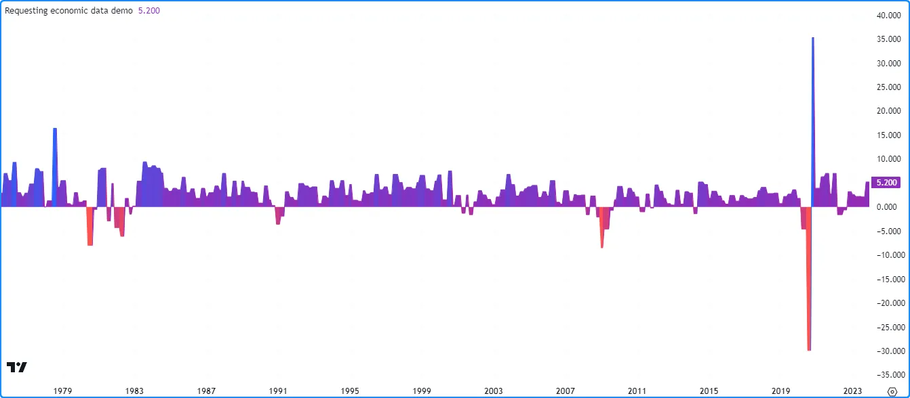

```c
//@version=5
indicator("Requesting economic data demo")

//@variable The GDP growth rate for the US economy.
float gdpqq = request.economic("US", "GDPQQ")

//@variable The all-time maximum growth rate.
float maxRate = ta.max(gdpqq)
//@variable The all-time minimum growth rate.
float minRate = ta.min(gdpqq)

//@variable The color of the `gdpqq` plot.
color rateColor = switch
    gdpqq >= 0 => color.from_gradient(gdpqq, 0, maxRate, color.purple, color.blue)
    =>            color.from_gradient(gdpqq, minRate, 0, color.red, color.purple)

// Plot the results.
plot(gdpqq, "US GDP Growth Rate", rateColor, style = plot.style_area)
```

__Note que:__

- Este exemplo não inclui um argumento `gaps` na chamada [request.economic()](https://br.tradingview.com/pine-script-reference/v5/#fun_request.economic), então a função usa o padrão [barmerge.gaps_off](https://br.tradingview.com/pine-script-reference/v5/#var_barmerge.gaps_off). Em outras palavras, ela retorna o último valor recuperado quando novos dados ainda não estão disponíveis.

> __Observação!__\
> As tabelas nas seções abaixo são bastante grandes, pois existem muitos argumentos `country_code` e `field` disponíveis.

## Códigos de País/Região

A tabela nesta seção lista todos os códigos de país/região disponíveis para uso com [request.economic()](https://br.tradingview.com/pine-script-reference/v5/#fun_request.economic). A primeira coluna da tabela contém os valores "string" que representam o código do país ou região, e a segunda coluna contém os nomes correspondentes dos países/regiões.

É importante notar que o valor usado como argumento `country_code` determina quais [códigos de campo](./05_14_outros_timeframes_e_dados.md#códigos-de-campo) são acessíveis para a função.

| `country_code` | Nome do país/região |
| --- | --- |
| AF | Afeganistão |
| AL | Albânia |
| DZ | Argélia |
| AD | Andorra |
| AO | Angola |
| AG | Antígua e Barbuda |
| AR | Argentina |
| AM | Armênia |
| AW | Aruba |
| AU | Austrália |
| AT | Áustria |
| AZ | Azerbaijão |
| BS | Bahamas |
| BH | Bahrein |
| BD | Bangladesh |
| BB | Barbados |
| BY | Bielorrússia |
| BE | Bélgica |
| BZ | Belize |
| BJ | Benin |
| BM | Bermudas |
| BT | Butão |
| BO | Bolívia |
| BA | Bósnia e Herzegovina |
| BW | Botsuana |
| BR | Brasil |
| BN | Brunei |
| BG | Bulgária |
| BF | Burkina Faso |
| BI | Burundi |
| KH | Camboja |
| CM | Camarões |
| CA | Canadá |
| CV | Cabo Verde |
| KY | Ilhas Cayman |
| CF | República Centro-Africana |
| TD | Chade |
| CL | Chile |
| CN | China |
| CO | Colômbia |
| KM | Comores |
| CG | Congo |
| CR | Costa Rica |
| HR | Croácia |
| CU | Cuba |
| CY | Chipre |
| CZ | República Tcheca |
| DK | Dinamarca |
| DJ | Djibuti |
| DM | Dominica |
| DO | República Dominicana |
| TL | Timor-Leste |
| EC | Equador |
| EG | Egito |
| SV | El Salvador |
| GQ | Guiné Equatorial |
| ER | Eritreia |
| EE | Estônia |
| ET | Etiópia |
| EU | Zona do Euro |
| FO | Ilhas Faroé |
| FJ | Fiji |
| FI | Finlândia |
| FR | França |
| GA | Gabão |
| GM | Gâmbia |
| GE | Geórgia |
| DE | Alemanha |
| GH | Gana |
| GR | Grécia |
| GL | Groenlândia |
| GD | Granada |
| GT | Guatemala |
| GN | Guiné |
| GW | Guiné-Bissau |
| GY | Guiana |
| HT | Haiti |
| HN | Honduras |
| HK | Hong Kong |
| HU | Hungria |
| IS | Islândia |
| IN | Índia |
| ID | Indonésia |
| IR | Irã |
| IQ | Iraque |
| IE | Irlanda |
| IM | Ilha de Man |
| IL | Israel |
| IT | Itália |
| CI | Costa do Marfim |
| JM | Jamaica |
| JP | Japão |
| JO | Jordânia |
| KZ | Cazaquistão |
| KE | Quênia |
| KI | Kiribati |
| XK | Kosovo |
| KW | Kuwait |
| KG | Quirguistão |
| LA | Laos |
| LV | Letônia |
| LB | Líbano |
| LS | Lesoto |
| LR | Libéria |
| LY | Líbia |
| LI | Liechtenstein |
| LT | Lituânia |
| LU | Luxemburgo |
| MO | Macau |
| MK | Macedônia |
| MG | Madagascar |
| MW | Malaui |
| MY | Malásia |
| MV | Maldivas |
| ML | Mali |
| MT | Malta |
| MR | Mauritânia |
| MU | Maurício |
| MX | México |
| MD | Moldávia |
| MC | Mônaco |
| MN | Mongólia |
| ME | Montenegro |
| MA | Marrocos |
| MZ | Moçambique |
| MM | Mianmar |
| NA | Namíbia |
| NP | Nepal |
| NL | Países Baixos |
| NC | Nova Caledônia |
| NZ | Nova Zelândia |
| NI | Nicarágua |
| NE | Níger |
| NG | Nigéria |
| KP | Coreia do Norte |
| NO | Noruega |
| OM | Omã |
| PK | Paquistão |
| PS | Palestina |
| PA | Panamá |
| PG | Papua Nova Guiné |
| PY | Paraguai |
| PE | Peru |
| PH | Filipinas |
| PL | Polônia |
| PT | Portugal |
| PR | Porto Rico |
| QA | Catar |
| CD | República Democrática do Congo |
| RO | Romênia |
| RU | Rússia |
| RW | Ruanda |
| WS | Samoa |
| SM | San Marino |
| ST | São Tomé e Príncipe |
| SA | Arábia Saudita |
| SN | Senegal |
| RS | Sérvia |
| SC | Seicheles |
| SL | Serra Leoa |
| SG | Singapura |
| SK | Eslováquia |
| SI | Eslovênia |
| SB | Ilhas Salomão |
| SO | Somália |
| ZA | África do Sul |
| KR | Coreia do Sul |
| SS | Sudão do Sul |
| ES | Espanha |
| LK | Sri Lanka |
| LC | Santa Lúcia |
| VC | São Vicente e Granadinas |
| SD | Sudão |
| SR | Suriname |
| SZ | Suazilândia |
| SE | Suécia |
| CH | Suíça |
| SY | Síria |
| TW | Taiwan |
| TJ | Tajiquistão |
| TZ | Tanzânia |
| TH | Tailândia |
| TG | Togo |
| TO | Tonga |
| TT | Trinidad e Tobago |
| TN | Tunísia |
| TR | Turquia |
| TM | Turcomenistão |
| UG | Uganda |
| UA | Ucrânia |
| AE | Emirados Árabes Unidos |
| GB | Reino Unido |
| US | Estados Unidos |
| UY | Uruguai |
| UZ | Uzbequistão |
| VU | Vanuatu |
| VE | Venezuela |
| VN | Vietnã |
| YE | Iêmen |
| ZM | Zâmbia |
| ZW | Zimbábue |

## Códigos de Campo

A tabela nesta seção lista os códigos de campo disponíveis para uso com [request.economic()](https://br.tradingview.com/pine-script-reference/v5/#fun_request.economic). A primeira coluna contém os valores "string" usados como argumento `field`, e a segunda coluna contém os nomes de cada métrica e links para o nosso Centro de Ajuda com informações adicionais, incluindo os países/regiões para os quais estão disponíveis.

| `field` | Nome da métrica |
| --- | --- |
| AA | [Pedidos de Asilo](https://br.tradingview.com/support/solutions/43000650926) |
| ACR | [API Crude Runs](https://br.tradingview.com/support/solutions/43000650920) |
| AE | [Exportações de Automóveis](https://br.tradingview.com/support/solutions/43000650927) |
| AHE | [Ganho Médio por Hora](https://br.tradingview.com/support/solutions/43000650928) |
| AHO | [API Heating Oil](https://br.tradingview.com/support/solutions/43000650924) |
| AWH | [Horas Semanais Médias](https://br.tradingview.com/support/solutions/43000650929) |
| BBS | [Balanço Patrimonial dos Bancos](https://br.tradingview.com/support/solutions/43000650932) |
| BCLI | [Indicador de Clima de Negócios](https://br.tradingview.com/support/solutions/43000650935) |
| BCOI | [Índice de Confiança Empresarial](https://br.tradingview.com/support/solutions/43000650936) |
| BI | [Inventários de Negócios](https://br.tradingview.com/support/solutions/43000650937) |
| BLR | [Taxa de Empréstimo Bancário](https://br.tradingview.com/support/solutions/43000650933) |
| BOI | [Índice de Otimismo Empresarial NFIB](https://br.tradingview.com/support/solutions/43000651133) |
| BOT | [Balança Comercial](https://br.tradingview.com/support/solutions/43000650930) |
| BP | [Licenças de Construção](https://br.tradingview.com/support/solutions/43000650934) |
| BR | [Falências](https://br.tradingview.com/support/solutions/43000650931) |
| CA | [Conta Corrente](https://br.tradingview.com/support/solutions/43000650988) |
| CAG | [Conta Corrente para PIB](https://br.tradingview.com/support/solutions/43000650987) |
| CAP | [Produção de Carros](https://br.tradingview.com/support/solutions/43000650945) |
| CAR | [Registros de Carros](https://br.tradingview.com/support/solutions/43000650946) |
| CBBS | [Balanço do Banco Central](https://br.tradingview.com/support/solutions/43000650952) |
| CCC | [Mudança na Contagem de Requerentes](https://br.tradingview.com/support/solutions/43000650959) |
| CCI | [Índice de Confiança do Consumidor](https://br.tradingview.com/support/solutions/43000650966) |
| CCOS | [Estoques de Petróleo Bruto de Cushing](https://br.tradingview.com/support/solutions/43000650989) |
| CCP | [Preços ao Consumidor Núcleo](https://br.tradingview.com/support/solutions/43000650974) |
| CCPI | [CPI Núcleo](https://br.tradingview.com/support/solutions/43000650973) |
| CCPT | [Tendências de Preços de Confiança do Consumidor](https://br.tradingview.com/support/solutions/43000650967) |
| CCR | [Crédito ao Consumidor](https://br.tradingview.com/support/solutions/43000650968) |
| CCS | [Gastos com Cartão de Crédito](https://br.tradingview.com/support/solutions/43000650982) |
| CEP | [Produção de Cimento](https://br.tradingview.com/support/solutions/43000650951) |
| CF | [Fluxos de Capital](https://br.tradingview.com/support/solutions/43000650944) |
| CFNAI | [Índice de Atividade Nacional do Fed de Chicago](https://br.tradingview.com/support/solutions/43000650957) |
| CI | [Importações de Petróleo Bruto API](https://br.tradingview.com/support/solutions/43000650918) |
| CIND | [Índice Coincidente](https://br.tradingview.com/support/solutions/43000650960) |
| CIR | [Taxa de Inflação Núcleo, YoY](https://br.tradingview.com/support/solutions/43000650975) |
| CJC | [Reivindicações Continuadas de Desemprego](https://br.tradingview.com/support/solutions/43000650971) |
| CN | [Número de Cushing API](https://br.tradingview.com/support/solutions/43000650921) |
| COI | [Importações de Petróleo Bruto](https://br.tradingview.com/support/solutions/43000650983) |
| COIR | [Importações de Petróleo Bruto da Rússia](https://br.tradingview.com/support/solutions/43000679670) |
| CONSTS | [Gastos com Construção](https://br.tradingview.com/support/solutions/43000650965) |
| COP | [Produção de Petróleo Bruto](https://br.tradingview.com/support/solutions/43000650984) |
| COR | [Plataformas de Petróleo Bruto](https://br.tradingview.com/support/solutions/43000650985) |
| CORD | [Pedidos de Construção, YoY](https://br.tradingview.com/support/solutions/43000650963) |
| CORPI | [Índice de Corrupção](https://br.tradingview.com/support/solutions/43000650980) |
| CORR | [Ranking de Corrupção](https://br.tradingview.com/support/solutions/43000650981) |
| COSC | [Mudança nos Estoques de Petróleo Bruto](https://br.tradingview.com/support/solutions/43000650986) |
| COUT | [Produção da Construção, YoY](https://br.tradingview.com/support/solutions/43000650964) |
| CP | [Produção de Cobre](https://br.tradingview.com/support/solutions/43000650972) |
| CPCEPI | [Índice de Preços PCE Núcleo](https://br.tradingview.com/support/solutions/43000650976) |
| CPI | [Índice de Preços ao Consumidor](https://br.tradingview.com/support/solutions/43000650969) |
| CPIHU | [CPI Habitação Utilidades](https://br.tradingview.com/support/solutions/43000650939) |
| CPIM | [CPI Mediano](https://br.tradingview.com/support/solutions/43000650940) |
| CPIT | [CPI Transporte](https://br.tradingview.com/support/solutions/43000650941) |
| CPITM | [CPI Média Aparada](https://br.tradingview.com/support/solutions/43000650942) |
| CPMI | [PMI de Chicago](https://br.tradingview.com/support/solutions/43000650958) |
| CPPI | [Índice de Preços ao Produtor Núcleo](https://br.tradingview.com/support/solutions/43000650977) |
| CPR | [Lucros Corporativos](https://br.tradingview.com/support/solutions/43000650978) |
| CRLPI | [Índice de Preços de Cereais](https://br.tradingview.com/support/solutions/43000679669) |
| CRR | [Razão de Reserva em Dinheiro](https://br.tradingview.com/support/solutions/43000650950) |
| CS | [Gastos do Consumidor](https://br.tradingview.com/support/solutions/43000650970) |
| CSC | [Mudança nos Estoques de Petróleo Bruto API](https://br.tradingview.com/support/solutions/43000650919) |
| CSHPI | [Índice de Preços de Casas Case Shiller](https://br.tradingview.com/support/solutions/43000650947) |
| CSHPIMM | [Índice de Preços de Casas Case Shiller, MoM](https://br.tradingview.com/support/solutions/43000650948) |
| CSHPIYY | [Índice de Preços de Casas Case Shiller, YoY](https://br.tradingview.com/support/solutions/43000650949) |
| CSS | [Vendas em Cadeias de Lojas](https://br.tradingview.com/support/solutions/43000650954) |
| CTR | [Taxa de Imposto Corporativo](https://br.tradingview.com/support/solutions/43000650979) |
| CU | [Utilização da Capacidade](https://br.tradingview.com/support/solutions/43000650943) |
| DFMI | [Índice de Manufatura do Fed de Dallas](https://br.tradingview.com/support/solutions/43000650990) |
| DFP | [Produção de Combustível Destilado](https://br.tradingview.com/support/solutions/43000650996) |
| DFS | [Estoques de Destilados](https://br.tradingview.com/support/solutions/43000650997) |
| DFSI | [Índice de Serviços do Fed de Dallas](https://br.tradingview.com/support/solutions/43000650991) |
| DFSRI | [Índice de Receitas de Serviços do Fed de Dallas](https://br.tradingview.com/support/solutions/43000650992) |
| DG | [Crescimento de Depósitos](https://br.tradingview.com/support/solutions/43000650993) |
| DGO | [Pedidos de Bens Duráveis](https://br.tradingview.com/support/solutions/43000651000) |
| DGOED | [Pedidos de Bens Duráveis Excluindo Defesa](https://br.tradingview.com/support/solutions/43000650998) |
| DGOET | [Pedidos de Bens Duráveis Excluindo Transporte](https://br.tradingview.com/support/solutions/43000650999) |
| DIR | [Taxa de Juros de Depósitos](https://br.tradingview.com/support/solutions/43000650994) |
| DPI | [Renda Pessoal Disponível](https://br.tradingview.com/support/solutions/43000650995) |
| DRPI | [Índice de Preços de Laticínios](https://br.tradingview.com/support/solutions/43000679668) |
| DS | [Estoques de Destilados API](https://br.tradingview.com/support/solutions/43000650922) |
| DT | [Comércio de Distribuição CBI](https://br.tradingview.com/support/solutions/43000650938) |
| EC | [Mudança no Emprego ADP](https://br.tradingview.com/support/solutions/43000650917) |
| ED | [Dívida Externa](https://br.tradingview.com/support/solutions/43000651012) |
| EDBR | [Ranking de Facilidade para Fazer Negócios](https://br.tradingview.com/support/solutions/43000651001) |
| EHS | [Vendas de Casas Existentes](https://br.tradingview.com/support/solutions/43000651009) |
| ELP | [Produção de Eletricidade](https://br.tradingview.com/support/solutions/43000651004) |
| EMC | [Mudança no Emprego](https://br.tradingview.com/support/solutions/43000651006) |
| EMCI | [Índice de Custo do Emprego](https://br.tradingview.com/support/solutions/43000651007) |
| EMP | [Pessoas Empregadas](https://br.tradingview.com/support/solutions/43000651005) |
| EMR | [Taxa de Emprego](https://br.tradingview.com/support/solutions/43000651008) |
| EOI | [Índice de Otimismo Econômico](https://br.tradingview.com/support/solutions/43000651002) |
| EP | [Preços de Exportação](https://br.tradingview.com/support/solutions/43000651011) |
| ESI | [Índice de Sentimento Econômico ZEW](https://br.tradingview.com/support/solutions/43000651213) |
| EWS | [Pesquisa dos Observadores da Economia](https://br.tradingview.com/support/solutions/43000651003) |
| EXP | [Exportações](https://br.tradingview.com/support/solutions/43000651010) |
| EXPYY | [Exportações, YoY](https://br.tradingview.com/support/solutions/43000679671) |
| FAI | [Investimento em Ativos Fixos](https://br.tradingview.com/support/solutions/43000651016) |
| FBI | [Investimento Estrangeiro em Títulos](https://br.tradingview.com/support/solutions/43000651018) |
| FDI | [Investimento Direto Estrangeiro](https://br.tradingview.com/support/solutions/43000651019) |
| FE | [Despesa Fiscal](https://br.tradingview.com/support/solutions/43000651015) |
| FER | [Reservas de Câmbio Estrangeiro](https://br.tradingview.com/support/solutions/43000651020) |
| FI | [Inflação de Alimentos, YoY](https://br.tradingview.com/support/solutions/43000651017) |
| FO | [Pedidos de Fábrica](https://br.tradingview.com/support/solutions/43000651014) |
| FOET | [Pedidos de Fábrica Excluindo Transporte](https://br.tradingview.com/support/solutions/43000651013) |
| FPI | [Índice de Preços de Alimentos](https://br.tradingview.com/support/solutions/43000679667) |
| FSI | [Investimento Estrangeiro em Ações](https://br.tradingview.com/support/solutions/43000651021) |
| FTE | [Emprego em Tempo Integral](https://br.tradingview.com/support/solutions/43000651022) |
| FYGDPG | [Crescimento do PIB Anual Completo](https://br.tradingview.com/support/solutions/43000679672) |
| GASP | [Preços da Gasolina](https://br.tradingview.com/support/solutions/43000651040) |
| GBP | [Orçamento do Governo](https://br.tradingview.com/support/solutions/43000651050) |
| GBV | [Valor do Orçamento do Governo](https://br.tradingview.com/support/solutions/43000651049) |
| GCI | [Índice de Competitividade](https://br.tradingview.com/support/solutions/43000650961) |
| GCR | [Classificação de Competitividade](https://br.tradingview.com/support/solutions/43000650962) |
| GD | [Dívida do Governo](https://br.tradingview.com/support/solutions/43000651052) |
| GDG | [Dívida do Governo em Relação ao PIB](https://br.tradingview.com/support/solutions/43000651051) |
| GDP | [Produto Interno Bruto](https://br.tradingview.com/support/solutions/43000651038) |
| GDPA | [PIB da Agricultura](https://br.tradingview.com/support/solutions/43000651025) |
| GDPC | [PIB da Construção](https://br.tradingview.com/support/solutions/43000651026) |
| GDPCP | [PIB a Preços Constantes](https://br.tradingview.com/support/solutions/43000651023) |
| GDPD | [Deflator do PIB](https://br.tradingview.com/support/solutions/43000651024) |
| GDPGA | [Crescimento Anualizado do PIB](https://br.tradingview.com/support/solutions/43000651033) |
| GDPMAN | [PIB da Manufatura](https://br.tradingview.com/support/solutions/43000651027) |
| GDPMIN | [PIB da Mineração](https://br.tradingview.com/support/solutions/43000651028) |
| GDPPA | [PIB da Administração Pública](https://br.tradingview.com/support/solutions/43000651029) |
| GDPPC | [PIB Per Capita](https://br.tradingview.com/support/solutions/43000651035) |
| GDPPCP | [PIB Per Capita, PPP](https://br.tradingview.com/support/solutions/43000651036) |
| GDPQQ | [Taxa de Crescimento do PIB](https://br.tradingview.com/support/solutions/43000651034) |
| GDPS | [PIB dos Serviços](https://br.tradingview.com/support/solutions/43000651030) |
| GDPSA | [Vendas do PIB](https://br.tradingview.com/support/solutions/43000651037) |
| GDPT | [PIB dos Transportes](https://br.tradingview.com/support/solutions/43000651031) |
| GDPU | [PIB das Utilidades](https://br.tradingview.com/support/solutions/43000651032) |
| GDPYY | [PIB, YoY](https://br.tradingview.com/support/solutions/43000651039) |
| GDTPI | [Índice de Preços do Comércio Global de Laticínios](https://br.tradingview.com/support/solutions/43000651043) |
| GFCF | [Formação Bruta de Capital Fixo](https://br.tradingview.com/support/solutions/43000651060) |
| GNP | [Produto Nacional Bruto](https://br.tradingview.com/support/solutions/43000651061) |
| GP | [Produção de Ouro](https://br.tradingview.com/support/solutions/43000651044) |
| GPA | [Folhas de Pagamento do Governo](https://br.tradingview.com/support/solutions/43000651053) |
| GPRO | [Produção de Gasolina](https://br.tradingview.com/support/solutions/43000651041) |
| GR | [Receitas do Governo](https://br.tradingview.com/support/solutions/43000651054) |
| GRES | [Reservas de Ouro](https://br.tradingview.com/support/solutions/43000651045) |
| GS | [Estoques de Gasolina API](https://br.tradingview.com/support/solutions/43000650923) |
| GSC | [Estoque de Grãos Milho](https://br.tradingview.com/support/solutions/43000651057) |
| GSCH | [Mudança nos Estoques de Gasolina](https://br.tradingview.com/support/solutions/43000651042) |
| GSG | [Gastos do Governo para o PIB](https://br.tradingview.com/support/solutions/43000651055) |
| GSP | [Gastos do Governo](https://br.tradingview.com/support/solutions/43000651056) |
| GSS | [Estoque de Grãos Soja](https://br.tradingview.com/support/solutions/43000651058) |
| GSW | [Estoque de Grãos Trigo](https://br.tradingview.com/support/solutions/43000651059) |
| GTB | [Balança Comercial de Bens](https://br.tradingview.com/support/solutions/43000651046) |
| HB | [Leitos Hospitalares](https://br.tradingview.com/support/solutions/43000651067) |
| HDG | [Dívida das Famílias para o PIB](https://br.tradingview.com/support/solutions/43000651068) |
| HDI | [Dívida das Famílias para Renda](https://br.tradingview.com/support/solutions/43000651069) |
| HICP | [Índice Harmonizado de Preços ao Consumidor](https://br.tradingview.com/support/solutions/43000651062) |
| HIRMM | [Taxa de Inflação Harmonizada, MoM](https://br.tradingview.com/support/solutions/43000679673) |
| HIRYY | [Taxa de Inflação Harmonizada, YoY](https://br.tradingview.com/support/solutions/43000679674) |
| HMI | [Índice de Mercado Imobiliário NAHB](https://br.tradingview.com/support/solutions/43000651132) |
| HOR | [Taxa de Propriedade de Casas](https://br.tradingview.com/support/solutions/43000651065) |
| HOS | [Estoques de Óleo de Aquecimento](https://br.tradingview.com/support/solutions/43000651063) |
| HOSP | [Hospitais](https://br.tradingview.com/support/solutions/43000651066) |
| HPI | [Índice de Preços de Casas](https://br.tradingview.com/support/solutions/43000651071) |
| HPIMM | [Índice de Preços de Casas, MoM](https://br.tradingview.com/support/solutions/43000679678) |
| HPIYY | [Índice de Preços de Casas, YoY](https://br.tradingview.com/support/solutions/43000679679) |
| HS | [Empréstimos Habitacionais](https://br.tradingview.com/support/solutions/43000651064) |
| HSP | [Gastos das Famílias](https://br.tradingview.com/support/solutions/43000651070) |
| HST | [Inícios de Construção de Casas](https://br.tradingview.com/support/solutions/43000651072) |
| IC | [Mudanças nos Inventários](https://br.tradingview.com/support/solutions/43000650956) |
| ICUB | [Leitos de UTI](https://br.tradingview.com/support/solutions/43000651073) |
| IE | [Expectativas de Inflação](https://br.tradingview.com/support/solutions/43000651081) |
| IFOCC | [IFO Avaliação da Situação Empresarial](https://br.tradingview.com/support/solutions/43000651074) |
| IFOE | [IFO Expectativas de Desenvolvimento Empresarial](https://br.tradingview.com/support/solutions/43000651075) |
| IJC | [Reivindicações Iniciais de Desemprego](https://br.tradingview.com/support/solutions/43000651084) |
| IMP | [Importações](https://br.tradingview.com/support/solutions/43000651076) |
| IMPYY | [Importações, YoY](https://br.tradingview.com/support/solutions/43000679681) |
| INBR | [Taxa Interbancária](https://br.tradingview.com/support/solutions/43000651085) |
| INTR | [Taxa de Juros](https://br.tradingview.com/support/solutions/43000651086) |
| IPA | [Endereços IP](https://br.tradingview.com/support/solutions/43000651088) |
| IPMM | [Produção Industrial, MoM](https://br.tradingview.com/support/solutions/43000651078) |
| IPRI | [Preços de Importação](https://br.tradingview.com/support/solutions/43000651077) |
| IPYY | [Produção Industrial, YoY](https://br.tradingview.com/support/solutions/43000651079) |
| IRMM | [Taxa de Inflação, MoM](https://br.tradingview.com/support/solutions/43000651082) |
| IRYY | [Taxa de Inflação, YoY](https://br.tradingview.com/support/solutions/43000651083) |
| IS | [Sentimento Industrial](https://br.tradingview.com/support/solutions/43000651080) |
| ISP | [Velocidade da Internet](https://br.tradingview.com/support/solutions/43000651087) |
| JA | [Anúncios de Emprego](https://br.tradingview.com/support/solutions/43000651091) |
| JAR | [Relação de Empregos para Candidaturas](https://br.tradingview.com/support/solutions/43000651090) |
| JC | [Cortes de Empregos Challenger](https://br.tradingview.com/support/solutions/43000650955) |
| JC4W | [Média de 4 Semanas de Reivindicações de Desemprego](https://br.tradingview.com/support/solutions/43000651089) |
| JO | [Ofertas de Emprego](https://br.tradingview.com/support/solutions/43000651092) |
| JV | [Vagas de Emprego](https://br.tradingview.com/support/solutions/43000651093) |
| KFMI | [Índice de Manufatura do Fed de Kansas](https://br.tradingview.com/support/solutions/43000651094) |
| LB | [Empréstimos para Bancos](https://br.tradingview.com/support/solutions/43000651104) |
| LC | [Custos Laborais](https://br.tradingview.com/support/solutions/43000651101) |
| LEI | [Índice Econômico Líder](https://br.tradingview.com/support/solutions/43000651102) |
| LFPR | [Taxa de Participação na Força de Trabalho](https://br.tradingview.com/support/solutions/43000651100) |
| LG | [Crescimento de Empréstimos, YoY](https://br.tradingview.com/support/solutions/43000651106) |
| LIVRR | [Injeções de Liquidez via Repo Reverso](https://br.tradingview.com/support/solutions/43000651103) |
| LMIC | [Índice de Gestores de Logística - Atual](https://br.tradingview.com/support/solutions/43000651096) |
| LMICI | [Custos de Inventário do Índice de Gestores de Logística](https://br.tradingview.com/support/solutions/43000651095) |
| LMIF | [Índice de Gestores de Logística - Futuro](https://br.tradingview.com/support/solutions/43000651097) |
| LMITP | [Preços de Transporte do Índice de Gestores de Logística](https://br.tradingview.com/support/solutions/43000651098) |
| LMIWP | [Preços de Armazém do Índice de Gestores de Logística](https://br.tradingview.com/support/solutions/43000651099) |
| LPS | [Empréstimos para o Setor Privado](https://br.tradingview.com/support/solutions/43000651105) |
| LR | [Taxa de Empréstimo do Banco Central](https://br.tradingview.com/support/solutions/43000650953) |
| LTUR | [Taxa de Desemprego de Longo Prazo](https://br.tradingview.com/support/solutions/43000651107) |
| LWF | [Salário Mínimo Familiar](https://br.tradingview.com/support/solutions/43000679691) |
| LWI | [Salário Mínimo Individual](https://br.tradingview.com/support/solutions/43000679702) |
| M0 | [Oferta Monetária M0](https://br.tradingview.com/support/solutions/43000651125) |
| M1 | [Oferta Monetária M1](https://br.tradingview.com/support/solutions/43000651126) |
| M2 | [Oferta Monetária M2](https://br.tradingview.com/support/solutions/43000651127) |
| M3 | [Oferta Monetária M3](https://br.tradingview.com/support/solutions/43000651128) |
| MA | [Aprovações de Hipotecas](https://br.tradingview.com/support/solutions/43000651130) |
| MAPL | [Aplicações de Hipotecas](https://br.tradingview.com/support/solutions/43000651129) |
| MCE | [Expectativas do Consumidor de Michigan](https://br.tradingview.com/support/solutions/43000651119) |
| MCEC | [Condições Econômicas Atuais de Michigan](https://br.tradingview.com/support/solutions/43000651120) |
| MD | [Médicos](https://br.tradingview.com/support/solutions/43000651117) |
| ME | [Despesa Militar](https://br.tradingview.com/support/solutions/43000651122) |
| MGDPYY | [PIB Mensal, YoY](https://br.tradingview.com/support/solutions/43000679714) |
| MIE1Y | [Expectativas de Inflação de Michigan](https://br.tradingview.com/support/solutions/43000651121) |
| MIE5Y | [Expectativas de Inflação de Michigan a 5 Anos](https://br.tradingview.com/support/solutions/43000651118) |
| MIP | [Produção de Mineração, YoY](https://br.tradingview.com/support/solutions/43000651124) |
| MMI | [Índice de Mercado de Hipotecas MBA](https://br.tradingview.com/support/solutions/43000651108) |
| MO | [Pedidos de Máquinas](https://br.tradingview.com/support/solutions/43000651111) |
| MP | [Folhas de Pagamento de Manufatura](https://br.tradingview.com/support/solutions/43000651113) |
| MPI | [Índice de Preços de Carnes](https://br.tradingview.com/support/solutions/43000679666) |
| MPRMM | [Produção de Manufatura, MoM](https://br.tradingview.com/support/solutions/43000651114) |
| MPRYY | [Produção de Manufatura, YoY](https://br.tradingview.com/support/solutions/43000651115) |
| MR | [Taxa de Hipoteca](https://br.tradingview.com/support/solutions/43000651131) |
| MRI | [Índice de Refinanceamento de Hipotecas MBA](https://br.tradingview.com/support/solutions/43000651109) |
| MS | [Vendas de Manufatura](https://br.tradingview.com/support/solutions/43000651116) |
| MTO | [Pedidos de Ferramentas de Máquinas](https://br.tradingview.com/support/solutions/43000651112) |
| MW | [Salários Mínimos](https://br.tradingview.com/support/solutions/43000651123) |
| NDCGOEA | [Pedidos de Bens de Capital Não-Defensivos Excluindo Aeronaves](https://br.tradingview.com/support/solutions/43000651148) |
| NEGTB | [Déficit Comercial de Bens com Países Fora da UE](https://br.tradingview.com/support/solutions/43000651047) |
| NFP | [Folhas de Pagamento Não-Agrícolas](https://br.tradingview.com/support/solutions/43000651141) |
| NGI | [Importações de Gás Natural](https://br.tradingview.com/support/solutions/43000679719) |
| NGIR | [Importações de Gás Natural da Rússia](https://br.tradingview.com/support/solutions/43000679721) |
| NGSC | [Mudança nos Estoques de Gás Natural](https://br.tradingview.com/support/solutions/43000651136) |
| NHPI | [Índice de Preços de Casas Nacionais](https://br.tradingview.com/support/solutions/43000651135) |
| NHS | [Vendas de Casas Novas](https://br.tradingview.com/support/solutions/43000651137) |
| NHSMM | [Vendas de Casas Novas, MoM](https://br.tradingview.com/support/solutions/43000651138) |
| NMPMI | [PMI Não-Manufatureiro](https://br.tradingview.com/support/solutions/43000651143) |
| NO | [Novos Pedidos](https://br.tradingview.com/support/solutions/43000651139) |
| NODXMM | [Exportações Domésticas Não-Petrolíferas, MoM](https://br.tradingview.com/support/solutions/43000651144) |
| NODXYY | [Exportações Domésticas Não-Petrolíferas, YoY](https://br.tradingview.com/support/solutions/43000651145) |
| NOE | [Exportações Não-Petrolíferas](https://br.tradingview.com/support/solutions/43000651142) |
| NPP | [Folhas de Pagamento Não-Agrícolas Privadas](https://br.tradingview.com/support/solutions/43000651140) |
| NURS | [Enfermeiros](https://br.tradingview.com/support/solutions/43000651146) |
| NYESMI | [Índice de Manufatura do Empire State de Nova York](https://br.tradingview.com/support/solutions/43000651134) |
| OE | [Exportações de Petróleo](https://br.tradingview.com/support/solutions/43000651147) |
| OPI | [Índice de Preços de Óleos](https://br.tradingview.com/support/solutions/43000679665) |
| PCEPI | [Índice de Preços PCE](https://br.tradingview.com/support/solutions/43000651149) |
| PDG | [Dívida Privada em Relação ao PIB](https://br.tradingview.com/support/solutions/43000651160) |
| PFMI | [Índice de Manufatura do Fed da Filadélfia](https://br.tradingview.com/support/solutions/43000651158) |
| PHSIMM | [Índice de Vendas de Casas Pendentes, MoM](https://br.tradingview.com/support/solutions/43000651152) |
| PHSIYY | [Índice de Vendas de Casas Pendentes, YoY](https://br.tradingview.com/support/solutions/43000651153) |
| PI | [Renda Pessoal](https://br.tradingview.com/support/solutions/43000651155) |
| PIN | [Investimento Privado](https://br.tradingview.com/support/solutions/43000651161) |
| PIND | [Índice de Compras MBA](https://br.tradingview.com/support/solutions/43000651110) |
| PITR | [Taxa de Imposto de Renda Pessoal](https://br.tradingview.com/support/solutions/43000651154) |
| POP | [População](https://br.tradingview.com/support/solutions/43000651159) |
| PPI | [Índice de Preços ao Produtor](https://br.tradingview.com/support/solutions/43000651165) |
| PPII | [Índice de Preços ao Produtor de Insumos](https://br.tradingview.com/support/solutions/43000651164) |
| PPIMM | [Inflação de Preços ao Produtor, MoM](https://br.tradingview.com/support/solutions/43000679724) |
| PPIYY | [Índice de Preços ao Produtor, YoY](https://br.tradingview.com/support/solutions/43000651163) |
| PRI | [Importações de Produtos API](https://br.tradingview.com/support/solutions/43000650925) |
| PROD | [Produtividade](https://br.tradingview.com/support/solutions/43000651166) |
| PS | [Poupança Pessoal](https://br.tradingview.com/support/solutions/43000651156) |
| PSC | [Crédito ao Setor Privado](https://br.tradingview.com/support/solutions/43000651162) |
| PSP | [Gastos Pessoais](https://br.tradingview.com/support/solutions/43000651157) |
| PTE | [Emprego em Tempo Parcial](https://br.tradingview.com/support/solutions/43000651151) |
| PUAC | [Reivindicações de Assistência ao Desemprego Pandêmico](https://br.tradingview.com/support/solutions/43000651150) |
| RAM | [Idade de Aposentadoria dos Homens](https://br.tradingview.com/support/solutions/43000651177) |
| RAW | [Idade de Aposentadoria das Mulheres](https://br.tradingview.com/support/solutions/43000651178) |
| RCR | [Execuções de Refino de Petróleo Bruto](https://br.tradingview.com/support/solutions/43000651168) |
| REM | [Remessas](https://br.tradingview.com/support/solutions/43000651169) |
| RFMI | [Índice de Manufatura do Fed de Richmond](https://br.tradingview.com/support/solutions/43000651181) |
| RFMSI | [Índice de Remessas de Manufatura do Fed de Richmond](https://br.tradingview.com/support/solutions/43000651182) |
| RFSI | [Índice de Serviços do Fed de Richmond](https://br.tradingview.com/support/solutions/43000651183) |
| RI | [Índice Redbook](https://br.tradingview.com/support/solutions/43000651167) |
| RIEA | [Inventários de Varejo Excluindo Automóveis](https://br.tradingview.com/support/solutions/43000651171) |
| RPI | [Índice de Preços de Varejo](https://br.tradingview.com/support/solutions/43000651172) |
| RR | [Taxa de Recompra](https://br.tradingview.com/support/solutions/43000651170) |
| RRR | [Taxa de Recompra Reversa](https://br.tradingview.com/support/solutions/43000651180) |
| RSEA | [Vendas no Varejo Excluindo Automóveis](https://br.tradingview.com/support/solutions/43000651173) |
| RSEF | [Vendas no Varejo Excluindo Combustível](https://br.tradingview.com/support/solutions/43000651174) |
| RSMM | [Vendas no Varejo, MoM](https://br.tradingview.com/support/solutions/43000651175) |
| RSYY | [Vendas no Varejo, YoY](https://br.tradingview.com/support/solutions/43000651176) |
| RTI | [Índice Tankan da Reuters](https://br.tradingview.com/support/solutions/43000651179) |
| SBSI | [Índice de Sentimento de Pequenas Empresas](https://br.tradingview.com/support/solutions/43000651187) |
| SFHP | [Preços de Casas Unifamiliares](https://br.tradingview.com/support/solutions/43000651186) |
| SP | [Produção de Aço](https://br.tradingview.com/support/solutions/43000651191) |
| SPI | [Índice de Preços do Açúcar](https://br.tradingview.com/support/solutions/43000679563) |
| SS | [Sentimento de Serviços](https://br.tradingview.com/support/solutions/43000651185) |
| SSR | [Taxa de Seguridade Social](https://br.tradingview.com/support/solutions/43000651190) |
| SSRC | [Taxa de Seguridade Social para Empresas](https://br.tradingview.com/support/solutions/43000651188) |
| SSRE | [Taxa de Seguridade Social para Empregados](https://br.tradingview.com/support/solutions/43000651189) |
| STR | [Taxa de Imposto sobre Vendas](https://br.tradingview.com/support/solutions/43000651184) |
| TA | [Chegadas de Turistas](https://br.tradingview.com/support/solutions/43000651199) |
| TAXR | [Receita Fiscal](https://br.tradingview.com/support/solutions/43000651192) |
| TCB | [Saldo de Caixa do Tesouro](https://br.tradingview.com/support/solutions/43000651200) |
| TCPI | [CPI de Tóquio](https://br.tradingview.com/support/solutions/43000651196) |
| TI | [Índice de Terrorismo](https://br.tradingview.com/support/solutions/43000651194) |
| TII | [Índice de Indústria Terciária](https://br.tradingview.com/support/solutions/43000651195) |
| TOT | [Termos de Troca](https://br.tradingview.com/support/solutions/43000651193) |
| TR | [Receitas do Turismo](https://br.tradingview.com/support/solutions/43000651198) |
| TVS | [Vendas Totais de Veículos](https://br.tradingview.com/support/solutions/43000651197) |
| UC | [Mudança no Desemprego](https://br.tradingview.com/support/solutions/43000651202) |
| UP | [Pessoas Desempregadas](https://br.tradingview.com/support/solutions/43000651201) |
| UR | [Taxa de Desemprego](https://br.tradingview.com/support/solutions/43000651203) |
| WAG | [Salários](https://br.tradingview.com/support/solutions/43000651205) |
| WES | [Vendas de Armas](https://br.tradingview.com/support/solutions/43000651207) |
| WG | [Crescimento dos Salários, YoY](https://br.tradingview.com/support/solutions/43000651206) |
| WHS | [Salários de Alta Qualificação](https://br.tradingview.com/support/solutions/43000679725) |
| WI | [Inventários no Atacado](https://br.tradingview.com/support/solutions/43000651208) |
| WLS | [Salários de Baixa Qualificação](https://br.tradingview.com/support/solutions/43000679727) |
| WM | [Salários na Manufatura](https://br.tradingview.com/support/solutions/43000651204) |
| WPI | [Índice de Preços no Atacado](https://br.tradingview.com/support/solutions/43000651209) |
| WS | [Vendas no Atacado](https://br.tradingview.com/support/solutions/43000651210) |
| YUR | [Taxa de Desemprego Juvenil](https://br.tradingview.com/support/solutions/43000651211) |
| ZCC | [Condições Atuais ZEW](https://br.tradingview.com/support/solutions/43000651212) |
