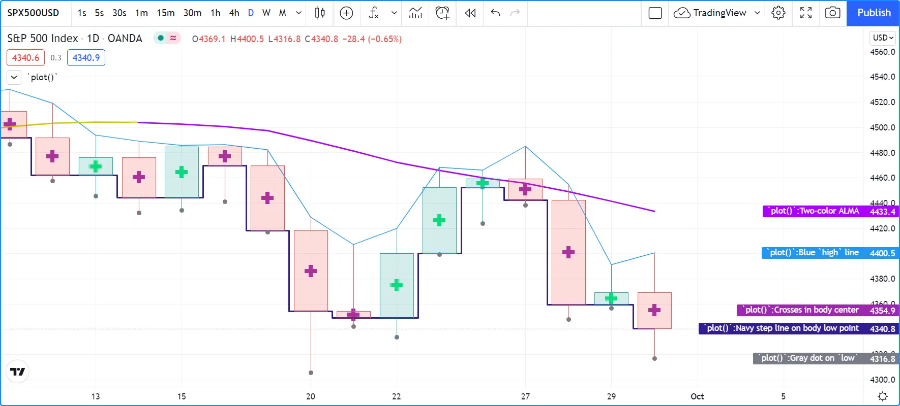
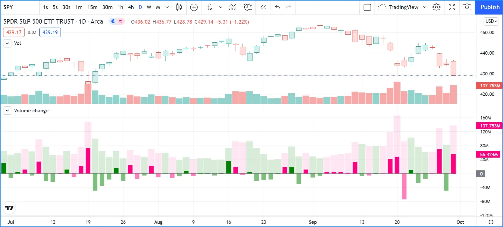
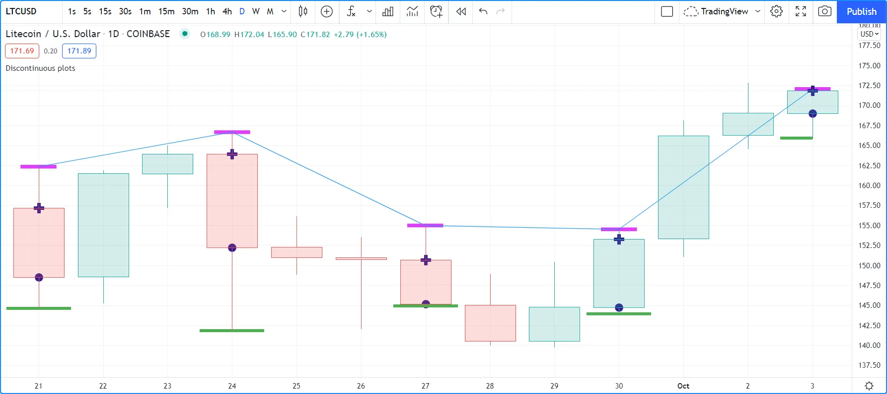
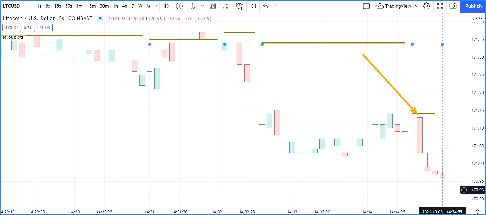
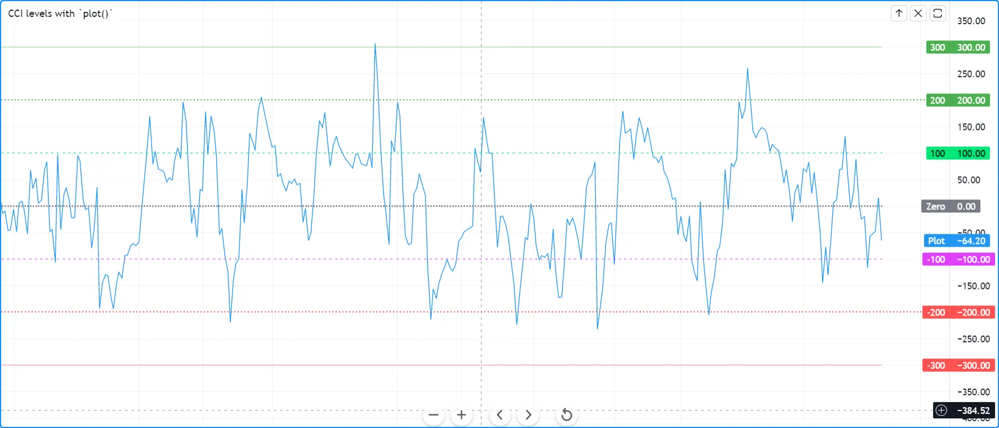
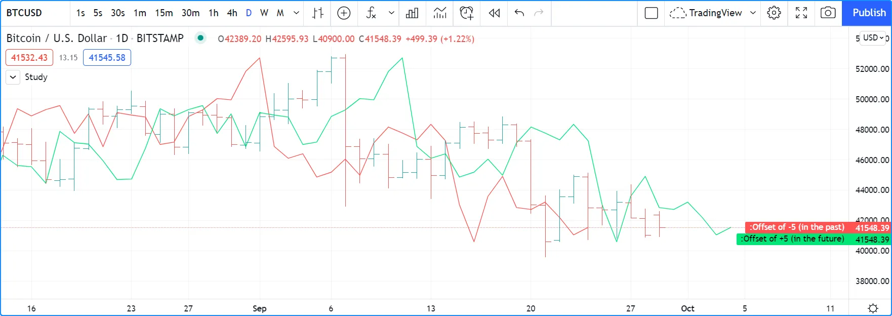
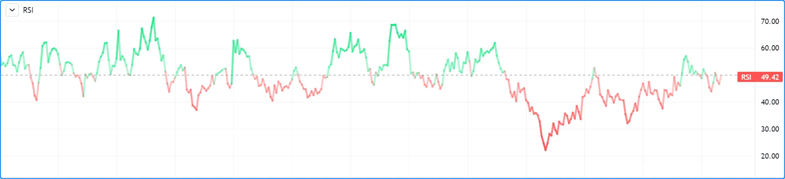
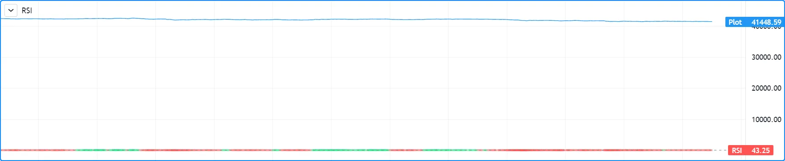
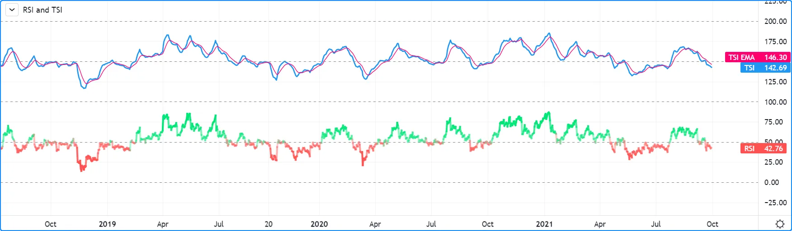

# Plots (_Plotagem_)

A função [plot()](https://br.tradingview.com/pine-script-reference/v5/#fun_plot) é a mais frequentemente usada para exibir informações calculadas usando scripts Pine. Ela é versátil e pode plotar diferentes estilos de linhas, histogramas, áreas, colunas (como colunas de volume), preenchimentos, círculos ou cruzes.

O uso de [plot()](https://br.tradingview.com/pine-script-reference/v5/#fun_plot) para criar preenchimentos é explicado na página sobre [Fills](./05_08_fills.md).

Este script demonstra alguns usos diferentes de [plot()](https://br.tradingview.com/pine-script-reference/v5/#fun_plot) em um script de sobreposição:



```c
//@version=5
indicator("`plot()`", "", true)
plot(high, "Blue `high` line")
plot(math.avg(close, open), "Crosses in body center", close > open ? color.lime : color.purple, 6, plot.style_cross)
plot(math.min(open, close), "Navy step line on body low point", color.navy, 3, plot.style_stepline)
plot(low, "Gray dot on `low`", color.gray, 3, plot.style_circles)

color VIOLET = #AA00FF
color GOLD   = #CCCC00
ma = ta.alma(hl2, 40, 0.85, 6)
var almaColor = color.silver
almaColor := ma > ma[2] ? GOLD : ma < ma[2]  ? VIOLET : almaColor
plot(ma, "Two-color ALMA", almaColor, 2)
```

__Note que:__

- A primeira chamada de [plot()](https://br.tradingview.com/pine-script-reference/v5/#fun_plot) plota uma linha azul de 1 pixel ao longo das máximas das barras.
- A segunda plota cruzes no ponto médio dos corpos. As cruzes são coloridas de verde-limão quando a barra está em alta e roxas quando está em baixa. O argumento usado para `linewidth` é `6`, mas não é um valor de pixel; apenas um tamanho relativo.
- A terceira chamada plota uma linha escalonada de 3 pixels de largura seguindo o ponto baixo dos corpos.
- A quarta chamada plota um círculo cinza na [mínima](https://br.tradingview.com/pine-script-reference/v5/#var_low) das barras.
- A última plotagem requer alguma preparação. Primeiro, define as cores de alta/baixa, calcula uma [Média Móvel Arnaud Legoux](https://br.tradingview.com/support/solutions/43000594683), depois realiza cálculos de cor. Inicializa a variável de cor na barra zero apenas, usando [var](https://br.tradingview.com/pine-script-reference/v5/#kw_var). Inicializando com [color.silver](https://br.tradingview.com/pine-script-reference/v5/#const_color%7Bdot%7Dsilver), então, nas primeiras barras do conjunto de dados, até que uma das condições cause a mudança de cor, a linha será prata. As condições que mudam a cor da linha exigem que ela esteja mais alta/baixa do que seu valor de duas barras atrás. Isso faz com que as transições de cor sejam menos ruidosas do que se olhásse apenas para um valor mais alto/baixo do que o anterior.

Este script mostra outros usos de [plot()](https://br.tradingview.com/pine-script-reference/v5/#fun_plot) em um painel:



```c
//@version=5
indicator("Volume change", format = format.volume)

color GREEN         = #008000
color GREEN_LIGHT   = color.new(GREEN, 50)
color GREEN_LIGHTER = color.new(GREEN, 85)
color PINK          = #FF0080
color PINK_LIGHT    = color.new(PINK, 50)
color PINK_LIGHTER  = color.new(PINK, 90)

bool  barUp = ta.rising(close, 1)
bool  barDn = ta.falling(close, 1)
float volumeChange = ta.change(volume)

volumeColor = barUp ? GREEN_LIGHTER : barDn ? PINK_LIGHTER : color.gray
plot(volume, "Volume columns", volumeColor, style = plot.style_columns)

volumeChangeColor = barUp ? volumeChange > 0 ? GREEN : GREEN_LIGHT : volumeChange > 0 ? PINK : PINK_LIGHT
plot(volumeChange, "Volume change columns", volumeChangeColor, 12, plot.style_histogram)

plot(0, "Zero line", color.gray)
```

__Note que:__

- É plotado valores normais de [volume](https://br.tradingview.com/pine-script-reference/v5/#var_volume) como colunas largas acima da linha zero (veja o `style = plot.style_columns` na nossa chamada de [plot()](https://br.tradingview.com/pine-script-reference/v5/#fun_plot)).
- Antes de plotar as colunas, calcula o `volumeColor` usando os valores das variáveis booleanas `barUp` e `barDn`. Elas se tornam respectivamente `true` quando o [fechamento](https://br.tradingview.com/pine-script-reference/v5/#var_close) da barra atual é maior/menor que o anterior. Note que o "Volume" não usa a mesma condição; ele identifica uma barra de alta com `close > open`. As cores `GREEN_LIGHTER` e `PINK_LIGHTER` são usadas para as colunas de volume.
- Porque a primeira plotagem plota colunas, não utiliza o parâmetro `linewidth`, pois ele não tem efeito sobre colunas.
- A segunda plotagem do script é a __mudança__ no volume, que foi calculado anteriormente usando `ta.change(volume)`. Este valor é plotado como um histograma, onde o parâmetro `linewidth` controla a largura da coluna. Foi definido essa largura como `12` para que os elementos do histograma sejam mais finos que as colunas da primeira plotagem. Valores positivos/negativos de `volumeChange` são plotados acima/abaixo da linha zero; nenhuma manipulação é necessária para obter este efeito.
- Antes de plotar o histograma de valores de `volumeChange`, calcula seu valor de cor, que pode ser uma de quatro cores diferentes. Usa-se as cores brilhantes `GREEN` ou `PINK` quando a barra está em alta/baixa E o volume aumentou desde a última barra (`volumeChange > 0`). Como `volumeChange` é positivo nesse caso, o elemento do histograma será plotado acima da linha zero. É usado as cores `GREEN_LIGHT` ou `PINK_LIGHT` quando a barra está em alta/baixa E o volume NÃO aumentou desde a última barra. Como `volumeChange` é negativo nesse caso, o elemento do histograma será plotado abaixo da linha zero.
- Finalmente, plotado uma linha zero. Poderia ter usado `hline(0)` ali.
- Usa `format = format.volume` na chamada de [indicator()](https://br.tradingview.com/pine-script-reference/v5/#fun_indicator) para que grandes valores exibidos por este script sejam abreviados como os do indicador incorporado "Volume".

Chamadas de [plot()](https://br.tradingview.com/pine-script-reference/v5/#fun_plot) devem sempre ser colocadas na primeira posição de uma linha, o que implica que estão sempre no escopo global do script. Elas não podem ser colocadas em funções definidas pelo usuário ou estruturas como [if](https://br.tradingview.com/pine-script-reference/v5/#kw_if), [for](https://br.tradingview.com/pine-script-reference/v5/#kw_for), etc. No entanto, chamadas para [plot()](https://br.tradingview.com/pine-script-reference/v5/#fun_plot) __podem__ ser projetadas para plotar condicionalmente de duas maneiras, abordado na seção [plots condicionais](./05_15_plots.md#plotagem-condicional) desta página.

Um script só pode plotar no seu próprio espaço visual, seja em um painel ou no gráfico como uma sobreposição. Scripts que rodam em um painel podem apenas [colorir barras](./05_03_coloracao_de_barras.md) na área do gráfico.

## Parâmetros de `plot()`

A função [plot()](https://br.tradingview.com/pine-script-reference/v5/#fun_plot) tem a seguinte assinatura:

```c
plot(series, title, color, linewidth, style, trackprice, histbase, offset, join, editable, show_last, display, force_overlay) → plot
```

Os parâmetros de [plot()](https://br.tradingview.com/pine-script-reference/v5/#fun_plot) são:

`series`

É o único parâmetro obrigatório. Seu argumento deve ser do tipo "series int/float". Note que, devido às regras de auto-conversão no Pine Script converterem na direção int 🠆 float 🠆 bool, uma variável do tipo "bool" não pode ser usada como está; deve ser convertida para "int" ou "float" para ser usada como argumento. Por exemplo, se `newDay` é do tipo "bool", então `newDay ? 1 : 0` pode ser usado para plotar 1 quando a variável é `true`, e zero quando é `false`.

`title`

Requer um argumento do tipo "const string", então deve ser conhecido no tempo de compilação. A string aparece:

- Na escala do script quando o campo "Configurações do gráfico/Escalas/Rótulo do Nome do Indicador" ("_Chart settings/Scales/Indicator Name Label_") está marcado.
- Na Janela de Dados ("_Data Window_").
- Na aba "Configurações/Estilo" ("_Settings/Style_").
- No dropdown de campos [input.source()](https://br.tradingview.com/pine-script-reference/v5/#fun_input%7Bdot%7Dsource).
- No campo "Condição" ("_Condition_") da caixa de diálogo "Criar Alerta" ("_Create Alert_"), quando o script está selecionado.
- Como cabeçalho de coluna ao exportar dados do gráfico para um arquivo CSV.

`color`

Aceita "series color", então pode ser calculado dinamicamente, barra a barra. Plotar com [na](https://br.tradingview.com/pine-script-reference/v5/#var_na) como a cor, ou qualquer cor com uma transparência de 100, é uma maneira de esconder plotagens quando não são necessárias.

`linewidth`

Refere-se ao tamanho do elemento plotado, mas não se aplica a todos os estilos. Quando uma linha é plotada, a unidade é pixels. Não tem impacto quando [plot.style_columns](https://br.tradingview.com/pine-script-reference/v5/#const_plot%7Bdot%7Dstyle_columns) é utilizado.

`style`

Os argumentos disponíveis são:

- [plot.style_line](https://br.tradingview.com/pine-script-reference/v5/#const_plot%7Bdot%7Dstyle_line) (padrão): Plota uma linha contínua usando o argumento `linewidth` em pixels para sua largura. Valores [na](https://br.tradingview.com/pine-script-reference/v5/#var_na) não serão plotados como linha, mas serão conectados quando um valor que não é [na](https://br.tradingview.com/pine-script-reference/v5/#var_na) aparecer. Valores não-[na](https://br.tradingview.com/pine-script-reference/v5/#var_na) são conectados apenas se estiverem visíveis no gráfico.
- [plot.style_linebr](https://br.tradingview.com/pine-script-reference/v5/#const_plot%7Bdot%7Dstyle_linebr): Permite a plotagem de linhas descontínuas, não plotando em valores [na](https://br.tradingview.com/pine-script-reference/v5/#var_na) e não conectando lacunas, ou seja, não criando pontes sobre valores [na](https://br.tradingview.com/pine-script-reference/v5/#var_na).
- [plot.style_stepline](https://br.tradingview.com/pine-script-reference/v5/#const_plot%7Bdot%7Dstyle_stepline): Plota usando um efeito de escada. As transições entre mudanças de valores são feitas usando uma linha vertical desenhada no meio das barras, em vez de uma linha diagonal ponto a ponto conectando os pontos médios das barras. Também pode ser usado para alcançar um efeito semelhante ao de [plot.style_linebr](https://br.tradingview.com/pine-script-reference/v5/#const_plot%7Bdot%7Dstyle_linebr), mas apenas se o cuidado for tomado para não plotar cor em valores [na](https://br.tradingview.com/pine-script-reference/v5/#var_na).
- [plot.style_area](https://br.tradingview.com/pine-script-reference/v5/#const_plot%7Bdot%7Dstyle_area): Plota uma linha de largura `linewidth`, preenchendo a área entre a linha e o `histbase`. O argumento `color` é usado tanto para a linha quanto para o preenchimento. Pode-se fazer a linha de uma cor diferente usando outra chamada de [plot()](https://br.tradingview.com/pine-script-reference/v5/#fun_plot). Valores positivos são plotados acima do `histbase`, valores negativos abaixo dele.
- [plot.style_areabr](https://br.tradingview.com/pine-script-reference/v5/#const_plot%7Bdot%7Dstyle_areabr): Semelhante a [plot.style_area](https://br.tradingview.com/pine-script-reference/v5/#const_plot%7Bdot%7Dstyle_area), mas não cria pontes sobre valores [na](https://br.tradingview.com/pine-script-reference/v5/#var_na). Outra diferença é como a escala do indicador é calculada. Apenas os valores plotados são usados no cálculo da escala _y_ do espaço visual do script. Se apenas valores altos situados longe do `histbase` forem plotados, por exemplo, esses valores serão usados para calcular a escala _y_ do espaço visual do script. Valores positivos são plotados acima do `histbase`, valores negativos abaixo dele.
- [plot.style_columns](https://br.tradingview.com/pine-script-reference/v5/#const_plot%7Bdot%7Dstyle_columns): Plota colunas semelhantes às do indicador incorporado "Volume". O valor de `linewidth` __não__ afeta a largura das colunas. Valores positivos são plotados acima do `histbase`, valores negativos abaixo dele. Sempre inclui o valor de `histbase` na escala _y_ do espaço visual do script.
- [plot.style_histogram](https://br.tradingview.com/pine-script-reference/v5/#const_plot%7Bdot%7Dstyle_histogram): Plota colunas semelhantes às do indicador incorporado "Volume", exceto que o valor de `linewidth` é usado para determinar a largura das barras do histograma em pixels. Note que, como `linewidth` requer um valor "input int", a largura das barras do histograma não pode variar de barra para barra. Valores positivos são plotados acima do `histbase`, valores negativos abaixo dele. Sempre inclui o valor de `histbase` na escala _y_ do espaço visual do script.
- [plot.style_circles](https://br.tradingview.com/pine-script-reference/v5/#const_plot%7Bdot%7Dstyle_circles) e [plot.style_cross](https://br.tradingview.com/pine-script-reference/v5/#const_plot%7Bdot%7Dstyle_cross): Plotam uma forma que não é conectada entre as barras, a menos que `join = true` também seja usado. Para esses estilos, o argumento `linewidth` torna-se uma medida de tamanho relativa — suas unidades não são pixels.

`trackprice`

O valor padrão é `false`. Quando `true`, uma linha pontilhada composta de pequenos quadrados será plotada em toda a largura do espaço visual do script. Frequentemente usado em conjunto com `show_last = 1, offset = -99999` para ocultar a plotagem real e deixar apenas a linha pontilhada residual.

`histbase`

É o ponto de referência usado com [plot.style_area](https://br.tradingview.com/pine-script-reference/v5/#const_plot%7Bdot%7Dstyle_area), [plot.style_columns](https://br.tradingview.com/pine-script-reference/v5/#const_plot%7Bdot%7Dstyle_columns) e [plot.style_histogram](https://br.tradingview.com/pine-script-reference/v5/#const_plot%7Bdot%7Dstyle_histogram). Determina o nível que separa valores positivos e negativos do argumento `series`. Não pode ser calculado dinamicamente, pois requer um valor "input int/float".

`offset`

Permite deslocar a plotagem no passado/futuro usando um deslocamento negativo/positivo em barras. O valor não pode mudar durante a execução do script.

`join`

Afeta apenas os estilos [plot.style_circles](https://br.tradingview.com/pine-script-reference/v5/#const_plot%7Bdot%7Dstyle_circles) ou [plot.style_cross](https://br.tradingview.com/pine-script-reference/v5/#const_plot%7Bdot%7Dstyle_cross). Quando `true`, as formas são conectadas por uma linha de um pixel.

`editable`

Este parâmetro booleano controla se as propriedades da plotagem podem ser editadas na aba "Configurações/Estilo" ("_Settings/Style_"). O valor padrão é `true`.

`show_last`

Permite controlar quantas das últimas barras os valores plotados são visíveis. Um argumento "input int" é necessário, então não pode ser calculado dinamicamente.

`display`

O padrão é [display.all](https://br.tradingview.com/pine-script-reference/v5/#const_display%7Bdot%7Dall). Quando configurado para [display.none](https://br.tradingview.com/pine-script-reference/v5/#const_display%7Bdot%7Dnone), os valores plotados não afetarão a escala do espaço visual do script. A plotagem será invisível e não aparecerá nos valores do indicador ou na Janela de Dados. Pode ser útil em plotagens destinadas a serem usadas como entradas externas para outros scripts, ou para plotagens usadas com o espaço reservado `{{plot("[plot_title]")}}` em chamadas de [alertcondition()](https://br.tradingview.com/pine-script-reference/v5/#fun_alertcondition), por exemplo:

```c
//@version=5
indicator("")
r = ta.rsi(close, 14)
xUp = ta.crossover(r, 50)
plot(r, "RSI", display = display.none)
alertcondition(xUp, "xUp alert", message = 'RSI is bullish at: {{plot("RSI")}}')
```

`force_overlay`

Se `true`, os resultados plotados serão exibidos no painel principal do gráfico, mesmo quando o script ocupar um painel separado. Opcional. O valor padrão é `false`.

## Plotagem Condicional

Chamadas de [plot()](https://br.tradingview.com/pine-script-reference/v5/#fun_plot) não podem ser usadas em estruturas condicionais como [if](https://br.tradingview.com/pine-script-reference/v5/#kw_if), mas podem ser controladas variando seus valores plotados ou suas cores. Quando nenhuma plotagem é necessária, é possível plotar valores [na](https://br.tradingview.com/pine-script-reference/v5/#var_na) ou usar a cor [na](https://br.tradingview.com/pine-script-reference/v5/#var_na) ou qualquer cor com 100 de transparência (o que também a torna invisível).

### Controle de Valor

Uma maneira de controlar a exibição das plotagens é plotar valores [na](https://br.tradingview.com/pine-script-reference/v5/#var_na) quando nenhuma plotagem é necessária. Às vezes, valores retornados por funções como [request.security()](https://br.tradingview.com/pine-script-reference/v5/#fun_request%7Bdot%7Dsecurity) retornarão valores [na](https://br.tradingview.com/pine-script-reference/v5/#var_na), quando `gaps = barmerge.gaps_on` é usado, por exemplo. Em ambos os casos, às vezes é útil plotar linhas descontínuas. Este script mostra algumas maneiras de fazer isso:



```c
//@version=5
indicator("Discontinuous plots", "", true)
bool plotValues = bar_index % 3 == 0
plot(plotValues ? high : na, color = color.fuchsia, linewidth = 6, style = plot.style_linebr)
plot(plotValues ? high : na)
plot(plotValues ? math.max(open, close) : na, color = color.navy, linewidth = 6, style = plot.style_cross)
plot(plotValues ? math.min(open, close) : na, color = color.navy, linewidth = 6, style = plot.style_circles)
plot(plotValues ? low : na, color = plotValues ? color.green : na, linewidth = 6, style = plot.style_stepline)
```

__Note que:__

- A condição que determina quando plotar é definida usando `bar_index % 3 == 0`, que se torna `true` quando o restante da divisão do índice da barra por 3 é zero. Isso acontecerá a cada três barras.
- Na primeira plotagem, é usado [plot.style_linebr](https://br.tradingview.com/pine-script-reference/v5/#const_plot%7Bdot%7Dstyle_linebr), que plota a linha fúcsia nos máximos. Está centrado no ponto médio horizontal da barra.
- A segunda plotagem mostra o resultado de plotar os mesmos valores, mas sem usar cuidado especial para quebrar a linha. O que acontece aqui é que a linha azul fina da chamada simples de [plot()](https://br.tradingview.com/pine-script-reference/v5/#fun_plot) é automaticamente conectada sobre valores [na](https://br.tradingview.com/pine-script-reference/v5/#var_na) (ou _gaps_), então a plotagem não é interrompida.
- Em seguida, são plotados cruzes e círculos azul-marinho nos topos e fundos dos corpos. Os estilos [plot.style_circles](https://br.tradingview.com/pine-script-reference/v5/#const_plot%7Bdot%7Dstyle_circles) e [plot.style_cross](https://br.tradingview.com/pine-script-reference/v5/#const_plot%7Bdot%7Dstyle_cross) são uma maneira simples de plotar valores descontínuos, por exemplo, para níveis de stop ou take profit, ou níveis de suporte e resistência.
- A última plotagem em verde nos mínimos das barras é feita usando [plot.style_stepline](https://br.tradingview.com/pine-script-reference/v5/#const_plot%7Bdot%7Dstyle_stepline). Note como seus segmentos são mais largos que os segmentos da linha fúcsia plotados com [plot.style_linebr](https://br.tradingview.com/pine-script-reference/v5/#const_plot%7Bdot%7Dstyle_linebr). Também observe como na última barra, ele plota apenas até a metade, até que a próxima barra entre.
- A ordem de plotagem de cada plotagem é controlada por sua ordem de aparição no script.

Este script mostra como restringir a plotagem para barras após uma data definida pelo usuário. A função [input.time()](https://br.tradingview.com/pine-script-reference/v5/#fun_input%7Bdot%7Dtime) é usada para criar um widget de entrada permitindo que os usuários do script selecionem uma data e hora, usando 1º de janeiro de 2021 como seu valor padrão:

```c
//@version=5
indicator("", "", true)
startInput = input.time(timestamp("2021-01-01"))
plot(time > startInput ? close : na)
```

### Controle de Cor

A seção [Coloração Condicional](./05_07_cores.md#coloração-condicional) da página sobre cores discute o controle de cor para plotagens. Veja alguns exemplos.

O valor do parâmetro `color` na [plot()](https://br.tradingview.com/pine-script-reference/v5/#fun_plot) pode ser uma constante, como uma das [cores constantes](./05_07_cores.md#constante-de-cores) incorporadas ou um [literal de cor](./04_09_tipagem_do_sistema.md#color). No Pine Script, o tipo qualificado de tais cores é chamado de __"const color"__ (veja a página do [Sistema de Tipos](./04_09_tipagem_do_sistema.md)). Elas são conhecidas em tempo de compilação:

```c
//@version=5
indicator("", "", true)
plot(close, color = color.gray)
```

A cor de uma plotagem também pode ser determinada usando informações que são conhecidas apenas quando o script começa a execução na primeira barra histórica de um gráfico (barra zero, ou seja, `bar_index == 0` ou `barstate.isfirst == true`), como será o caso quando as informações necessárias para determinar uma cor dependem do gráfico em que o script está sendo executado. Aqui, calcula-se uma cor de plotagem usando a variável incorporada [syminfo.type](https://br.tradingview.com/pine-script-reference/v5/#var_syminfo%7Bdot%7Dtype), que retorna o tipo do símbolo do gráfico. O tipo qualificado de `plotColor` neste caso será __"simple color"__:

```c
//@version=5
indicator("", "", true)
plotColor = switch syminfo.type
    "stock"     => color.purple
    "futures"   => color.red
    "index"     => color.gray
    "forex"     => color.fuchsia
    "crypto"    => color.lime
    "fund"      => color.orange
    "dr"        => color.aqua
    "cfd"       => color.blue
plot(close, color = plotColor)
printTable(txt) => var table t = table.new(position.middle_right, 1, 1), table.cell(t, 0, 0, txt, bgcolor = color.yellow)
printTable(syminfo.type)
```

As cores das plotagens também podem ser escolhidas através das entradas de um script. Neste caso, a variável `lineColorInput` é do tipo __"input color"__:

```c
//@version=5
indicator("", "", true)
color lineColorInput = input(#1848CC, "Line color")
plot(close, color = lineColorInput)
```

Finalmente, as cores das plotagens também podem ser valores _dinâmicos_, ou seja, valores calculados que podem mudar a cada barra. Esses valores são do tipo __"series color"__:

```c
//@version=5
indicator("", "", true)
plotColor = close >= open ? color.lime : color.red
plot(close, color = plotColor)
```

Ao plotar níveis de pivô, um requisito comum é evitar a plotagem de transições de níveis. Usar [linhas](./05_12_lines_e_boxes.md) é uma alternativa, mas você também pode usar [plot()](https://br.tradingview.com/pine-script-reference/v5/#fun_plot) desta maneira:



```c
//@version=5
indicator("Pivot plots", "", true)
pivotHigh = fixnan(ta.pivothigh(3,3))
plot(pivotHigh, "High pivot", ta.change(pivotHigh) ? na : color.olive, 3)
plotchar(ta.change(pivotHigh), "ta.change(pivotHigh)", "•", location.top, size = size.small)
```

__Note que:__

- É usado `pivotHigh = fixnan(ta.pivothigh(3,3))` para manter os valores de pivô. Como [ta.pivothigh()](https://br.tradingview.com/pine-script-reference/v5/#fun_ta%7Bdot%7Dpivothigh) só retorna um valor quando um novo pivô é encontrado, utiliza [fixnan()](https://br.tradingview.com/pine-script-reference/v5/#fun_fixnan) para preencher as lacunas com o último valor de pivô retornado. As lacunas aqui se referem aos valores [na](https://br.tradingview.com/pine-script-reference/v5/#var_na) que [ta.pivothigh()](https://br.tradingview.com/pine-script-reference/v5/#fun_ta%7Bdot%7Dpivothigh) retorna quando nenhum novo pivô é encontrado.
- Os pivôs são detectados três barras após ocorrerem pois usam o argumento `3` para ambos os parâmetros `leftbars` e `rightbars` na chamada [ta.pivothigh()](https://br.tradingview.com/pine-script-reference/v5/#fun_ta%7Bdot%7Dpivothigh).
- A última plotagem está plotando um valor contínuo, mas está definindo a cor da plotagem para [na](https://br.tradingview.com/pine-script-reference/v5/#var_na) quando o valor do pivô muda, então a plotagem não é visível então. Por causa disso, uma plotagem visível só aparecerá na barra seguinte àquela em que plotou usando a cor [na](https://br.tradingview.com/pine-script-reference/v5/#var_na).
- O ponto azul indica quando um novo pivô alto é detectado e nenhuma plotagem é desenhada entre a barra anterior e aquela. Note como o pivô na barra indicada pela seta acabou de ser detectado na barra em tempo real, três barras depois, e como nenhuma plotagem é desenhada. A plotagem só aparecerá na próxima barra, tornando a plotagem visível __quatro barras__ após o pivô real.

## Levels (_Níveis_)

O Pine Script tem uma função [hline()](https://br.tradingview.com/pine-script-reference/v5/#fun_hline) para plotar linhas horizontais (veja a página sobre [Níveis](./05_10_levels.md)). A [hline()](https://br.tradingview.com/pine-script-reference/v5/#fun_hline) é útil porque tem alguns estilos de linha indisponíveis com [plot()](https://br.tradingview.com/pine-script-reference/v5/#fun_plot), mas também tem algumas limitações, nomeadamente que não aceita "series color" e que seu parâmetro `price` requer um "input int/float", então não pode variar durante a execução do script.

Consegue-se plotar níveis com [plot()](https://br.tradingview.com/pine-script-reference/v5/#fun_plot) de algumas maneiras diferentes. Este mostra um indicador [CCI](https://br.tradingview.com/support/solutions/43000502001) com níveis plotados usando [plot()](https://br.tradingview.com/pine-script-reference/v5/#fun_plot):



```c
//@version=5
indicator("CCI levels with `plot()`")
plot(ta.cci(close, 20))
plot(0,  "Zero", color.gray, 1, plot.style_circles)
plot(bar_index % 2 == 0 ?  100 : na,  "100", color.lime, 1, plot.style_linebr)
plot(bar_index % 2 == 0 ? -100 : na, "-100", color.fuchsia, 1, plot.style_linebr)
plot( 200,  "200", color.green, 2, trackprice = true, show_last = 1, offset = -99999)
plot(-200, "-200", color.red,   2, trackprice = true, show_last = 1, offset = -99999)
plot( 300,  "300", color.new(color.green, 50), 1)
plot(-300, "-300", color.new(color.red, 50),   1)
```

__Note que:__

- O nível zero é plotado usando [plot.style_circles](https://br.tradingview.com/pine-script-reference/v5/#const_plot%7Bdot%7Dstyle_circles).
- Os níveis 100 são plotados usando um valor condicional que só plota a cada segunda barra. Para evitar que os valores [na](https://br.tradingview.com/pine-script-reference/v5/#var_na) sejam conectados, o estilo de linha [plot.style_linebr](https://br.tradingview.com/pine-script-reference/v5/#const_plot%7Bdot%7Dstyle_linebr) é usado.
- Os níveis 200 são plotados usando `trackprice = true` para plotar um padrão distinto de pequenos quadrados que se estendem por toda a largura do espaço visual do script. O `show_last = 1` exibe apenas o último valor plotado, que apareceria como uma linha reta de uma barra se o próximo truque não fosse usado: o `offset = -99999` empurra esse segmento de uma barra para muito longe no passado, de modo que nunca é visível.
- Os níveis 300 são plotados usando uma linha contínua, mas uma transparência mais leve é usada para torná-los menos proeminentes.

### Offsets

O parâmetro `offset` especifica o deslocamento usado quando a linha é plotada (valores negativos deslocam para o passado, valores positivos deslocam para o futuro). Por exemplo:

```c
//@version=5
indicator("", "", true)
plot(close, color = color.red, offset = -5)
plot(close, color = color.lime, offset = 5)
```



Como pode ser visto na captura de tela, a série _vermelha_ foi deslocada para a esquerda (já que o valor do argumento é negativo), enquanto a série _verde_ foi deslocada para a direita (seu valor é positivo).

## Limite de Contagem de Plotagem

Cada script é limitado a um máximo de 64 plotagens. Todas as chamadas de `plot*()` e [alertcondition()](https://br.tradingview.com/pine-script-reference/v5/#fun_alertcondition) contam na contagem de plotagens de um script. Alguns tipos de chamadas contam mais de uma vez no total de plotagens.

Chamadas de [plot()](https://br.tradingview.com/pine-script-reference/v5/#fun_plot) contam como uma na contagem total de plotagens se usarem um argumento "const color" para o parâmetro `color`, o que significa que é conhecido em tempo de compilação, por exemplo:

```c
plot(close, color = color.green)
```

Quando usam outro tipo qualificado, como qualquer um destes, contam como duas na contagem total de plotagens:

```c
plot(close, color = syminfo.mintick > 0.0001 ? color.green : color.red) //🠆 "simple color"
plot(close, color = input.color(color.purple)) //🠆 "input color"
plot(close, color = close > open ? color.green : color.red) //🠆 "series color"
plot(close, color = color.new(color.silver, close > open ? 40 : 0)) //🠆 "series color"
```

## Escala

Nem todos os valores podem ser plotados em qualquer lugar. O espaço visual do seu script é sempre limitado por limites superiores e inferiores que são ajustados dinamicamente com os valores plotados. Um indicador [RSI](https://br.tradingview.com/support/solutions/43000502338) plotará valores entre 0 e 100, por isso geralmente é exibido em um _painel_ distinto — ou área — acima ou abaixo do gráfico. Se os valores do RSI fossem plotados como uma sobreposição no gráfico, o efeito seria distorcer a escala de preço normal do símbolo, a menos que estivesse próximo do intervalo de 0 a 100 do RSI. Este exemplo mostra uma linha de sinal RSI e uma linha central no nível 50, com o script rodando em um painel separado:



```c
//@version=5
indicator("RSI")
myRSI = ta.rsi(close, 20)
bullColor = color.from_gradient(myRSI, 50, 80, color.new(color.lime, 70), color.new(color.lime, 0))
bearColor = color.from_gradient(myRSI, 20, 50, color.new(color.red,   0), color.new(color.red, 70))
myRSIColor = myRSI > 50 ? bullColor : bearColor
plot(myRSI, "RSI", myRSIColor, 3)
hline(50)
```

Note que o eixo _y_ do espaço visual do script é dimensionado automaticamente usando a faixa de valores plotados, ou seja, os valores do RSI. Veja a página sobre [Cores](./05_07_cores.md) para mais informações sobre a função [color.from_gradient()](https://br.tradingview.com/pine-script-reference/v5/#fun_color%7Bdot%7Dfrom_gradient) usada no script.

Ao tentar plotar os valores de [fechamento](https://br.tradingview.com/pine-script-reference/v5/#var_close) do símbolo no mesmo espaço adicionando a seguinte linha ao nosso script:

```c
plot(close)
```

Isto é o que acontece:



O gráfico está no símbolo BTCUSD, cujos preços de [fechamento](https://br.tradingview.com/pine-script-reference/v5/#var_close) estão em torno de 40000 durante este período. Plotar valores na faixa de 40000 torna as plotagens de RSI na faixa de 0 a 100 indiscerníveis. As mesmas plotagens distorcidas ocorreriam se colocasse o indicador [RSI](https://br.tradingview.com/support/solutions/43000502338) no gráfico como uma sobreposição.

### Mesclando Dois Indicadores

Se planeja mesclar dois sinais em um script, primeiro considere a escala de cada um. É impossível, por exemplo, plotar corretamente um [RSI](https://br.tradingview.com/support/solutions/43000502338) e um [MACD](https://br.tradingview.com/support/solutions/43000502344) no mesmo espaço visual do script, pois o RSI tem uma faixa fixa (0 a 100), enquanto o MACD não tem, pois plota médias móveis calculadas sobre o preço.

Se ambos os indicadores usarem faixas fixas, pode-se deslocar os valores de um deles para que não se sobreponham. Poderia, por exemplo, plotar tanto o [RSI](https://br.tradingview.com/support/solutions/43000502338) (0 a 100) quanto o [Indicador de Força Verdadeira (TSI)](https://br.tradingview.com/support/solutions/43000592290) _True Strength Index_ (-100 a +100) deslocando um deles. A estratégia aqui será comprimir e deslocar os valores do [TSI](https://br.tradingview.com/support/solutions/43000592290) para que plotem sobre o [RSI](https://br.tradingview.com/support/solutions/43000502338):



```c
//@version=5
indicator("RSI and TSI")
myRSI = ta.rsi(close, 20)
bullColor = color.from_gradient(myRSI, 50, 80, color.new(color.lime, 70), color.new(color.lime, 0))
bearColor = color.from_gradient(myRSI, 20, 50, color.new(color.red,   0), color.new(color.red, 70))
myRSIColor = myRSI > 50 ? bullColor : bearColor
plot(myRSI, "RSI", myRSIColor, 3)
hline(100)
hline(50)
hline(0)

// 1. Compress TSI's range from -100/100 to -50/50.
// 2. Shift it higher by 150, so its -50 min value becomes 100.
myTSI = 150 + (100 * ta.tsi(close, 13, 25) / 2)
plot(myTSI, "TSI", color.blue, 2)
plot(ta.ema(myTSI, 13), "TSI EMA", #FF006E)
hline(200)
hline(150)
```

__Note que:__

- Foram adicionados níveis usando [hline](https://br.tradingview.com/pine-script-reference/v5/#fun_hline) para situar ambos os sinais.
- Para que ambas as linhas de sinal oscilem na mesma faixa de 100, divide-se o valor do [TSI](https://br.tradingview.com/pine-script-reference/v5/#fun_ta.tsi) por 2, pois tem uma faixa de 200 (-100 a +100). Em seguida, desloca-se esse valor para cima em 150 para que oscile entre 100 e 200, fazendo de 150 sua linha central.
- As manipulações feitas aqui são típicas dos compromissos necessários para trazer dois indicadores com escalas diferentes no mesmo espaço visual, mesmo quando seus valores, ao contrário do [MACD](https://br.tradingview.com/pine-script-reference/v5/#fun_ta.macd), estão limitados a uma faixa fixa.
