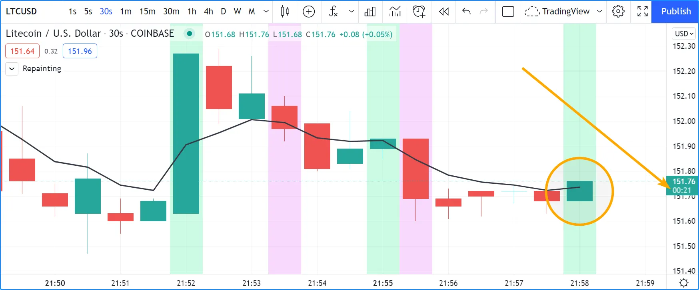
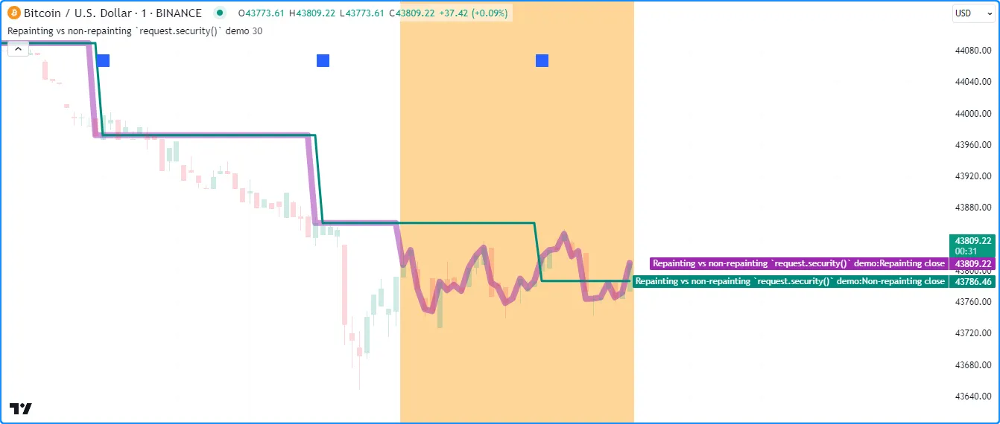
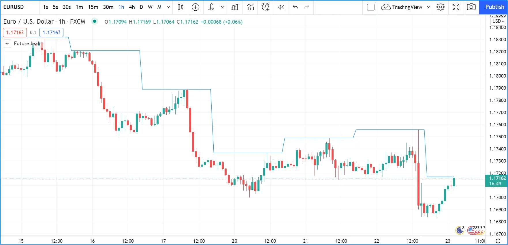

# Repintando (_Repainting_)

__*Repintura*__ ou __*Repainting*__ é definido como: __comportamento do script que faz com que cálculos ou plotagens históricas e em tempo real se comportem de maneira diferente__.

O comportamento de repintura é generalizado e muitos fatores podem causá-lo. Estima-se que mais de 95% dos indicadores existentes exibem algum tipo de comportamento de repintura. Indicadores comumente usados, como MACD e RSI, por exemplo, mostram valores confirmados em barras históricas, mas flutuam em uma barra de gráfico em tempo real, não confirmada, até que ela se feche. Portanto, eles se comportam _diferentemente_ em estados históricos e em tempo real.

__Nem todo comportamento de _repainting_ é inerentemente inútil ou enganoso__, nem impede que traders experientes usem indicadores com esse comportamento. Por exemplo, quem pensaria em desacreditar um indicador de perfil de volume apenas porque ele atualiza seus valores em barras de tempo real?

Pode-se encontrar qualquer uma das seguintes formas de _repainting_ nos scripts que usam, dependendo do que os cálculos de um script envolvem:

- __Generalizado, mas frequentemente aceitável__: Um script pode usar valores que são atualizados com as mudanças de preço em tempo real na barra não confirmada. Por exemplo, se alguém usar a variável [close](https://br.tradingview.com/pine-script-reference/v5/#var_close) em cálculos realizados em uma barra de gráfico aberta, seus valores refletirão o preço mais recente na barra. No entanto, o script só confirmará um novo ponto de dados em sua série histórica quando a barra se fechar. Outro caso comum é usar [request.security](https://br.tradingview.com/pine-script-reference/v5/#fun_request.security) para buscar dados de um intervalo de tempo maior em barras de tempo real, conforme explicado na seção [Comportamento histórico e tempo real](./05_14_outros_timeframes_e_dados.md#comportamento-histórico-e-tempo-real) da página [Outros períodos e dados](./05_14_outros_timeframes_e_dados.md). Assim como a barra não confirmada no intervalo de tempo do gráfico, [request.security](https://br.tradingview.com/pine-script-reference/v5/#fun_request.security) pode rastrear valores não confirmados de um contexto de intervalo de tempo maior em barras de tempo real, o que pode levar a repintura após o script reiniciar sua execução. Muitas vezes, não há nada de errado em usar esses scripts, desde que entenda como eles funcionam. No entanto, ao optar por usar esses scripts para emitir alertas ou ordens de negociação, é importante entender a diferença entre seu comportamento em tempo real e histórico e decidir por si mesmo se ele oferece utilidade para suas necessidades.
- __Potencialmente enganoso__: Scripts que plotam valores no passado, calculam resultados em barras de tempo real que não podem ser replicados em barras históricas ou realocam eventos passados são potencialmente enganosos. Por exemplo, Ichimoku, a maioria dos scripts baseados em pivôs, a maioria das estratégias que usam `calc_on_every_tick = true`, scripts que usam [request.security](https://br.tradingview.com/pine-script-reference/v5/#fun_request.security) quando ele se comporta de maneira diferente em barras de tempo real, muitos scripts que usam [varip](https://br.tradingview.com/pine-script-reference/v5/#kw_varip), muitos scripts que usam [timenow](https://br.tradingview.com/pine-script-reference/v5/#var_timenow), e alguns scripts que usam variáveis `barstate.*` podem exibir comportamento de _repainting_ enganoso.
- __Inaceitável__: Scripts que vazam informações futuras para o passado, estratégias que executam em [gráficos não padrão](./05_13_dados_de_graficos_nao_padronizados.md), e scripts que usam barras intradiárias em tempo real para gerar alertas ou ordens são exemplos que podem produzir um comportamento de repintura fortemente enganoso.
- __Inevitável__: Revisões do feed de dados de um provedor e variações na barra inicial do histórico do gráfico podem causar um comportamento de repintura que pode ser inevitável em um script.

Os dois primeiros tipos de _repainting_ podem ser perfeitamente aceitáveis se:

1. Você está ciente do comportamento.
2. Você pode conviver com isso, ou
3. Você pode contorná-lo.

Deve estar claro agora que nem __todo__ comportamento de repintura é errado e deve ser evitado a todo custo. Em muitas situações, algumas formas de repintura podem ser exatamente o que um script precisa. O importante é saber quando o comportamento de _repainting_ __não__ é aceitável para suas necessidades. Para evitar repintura que não seja aceitável, é importante entender como uma ferramenta funciona ou como deve projetar as ferramentas que constrói. Ao [publicar](./06_04_publicando_scripts.md) scripts, certifique-se de mencionar qualquer comportamento potencialmente enganoso junto com as outras limitações de seu script na descrição da publicação.

> __Observação!__\
> Não é discutido os perigos de usar estratégias em gráficos não padrão, pois esse problema não está relacionado ao _repainting_. Veja o script [Backtesting on Non-Standard Charts: Caution!](https://br.tradingview.com/script/q9laJNG9-Backtesting-on-Non-Standard-Charts-Caution-PineCoders-FAQ/) para uma discussão sobre o assunto.

## Para Usuários de Scripts

Pode-se decidir usar indicadores que fazem _repainting_ se entender o comportamento e se esse comportamento atende aos seus requisitos de análise. Não seja um dos novatos que colocam "repaint" em scripts publicados na tentativa de desacreditá-los, pois isso revela uma falta de conhecimento básico sobre o assunto.

Perguntar simplesmente se um script faz repintura é relativamente insignificante, dado que existem formas de comportamento de repintura que são perfeitamente aceitáveis em um script. Portanto, tal pergunta não gerará uma resposta significativa. Deve-se, em vez disso, fazer perguntas _específicas_ sobre o comportamento de _repainting_ potencial de um script, como:

- O script calcula/exibe da mesma maneira em barras históricas e em tempo real?
- Os alertas do script aguardam o final de uma barra em tempo real antes de serem acionados?
- Os marcadores de sinal mostrados pelo script aguardam o final de uma barra em tempo real antes de serem exibidos?
- O script plotagem/desenha valores no passado?
- A estratégia usa `calc_on_every_tick = true`?
- As chamadas [request.security](https://br.tradingview.com/pine-script-reference/v5/#fun_request.security) do script vazam informações futuras para o passado em barras históricas?

O importante é que entenda como as ferramentas funcionam e se o comportamento delas é compatível com seus objetivos, independentemente de fazerem repintura ou não. Como aprenderá ao ler esta página, _repainting_ é um assunto complexo. Ele tem muitas faces e muitas causas. Mesmo se você não programar em Pine Script, esta página o ajudará a entender a gama de causas que podem levar ao repintura e, possibilitará discussões mais significativas com os autores de scripts.

## Para Programadores de Pine Script

Conforme discutido acima, nem todas as formas de comportamento de _repainting_ devem ser evitadas a todo custo, nem todo comportamento potencial de repintura é necessariamente evitável. Esta página o ajude a entender melhor as dinâmicas em jogo para que possa projetar suas ferramentas de negociação com esses comportamentos em mente. O conteúdo desta página deve ajudar a conscientizá-lo sobre erros de codificação comuns que produzem resultados de repintura enganosos.

Quaisquer que sejam suas decisões de design, se você [publicar](./06_04_publicando_scripts.md) seu script, explique o script aos traders para que eles possam entender como ele se comporta.

Esta página cobre três amplas categorias de causas de _repainting_:

- [Cálculos históricos vs em tempo real](./05_16_repintura.md#cálculos-históricos-vs-em-tempo-real)
- [Plotagem no passado](./05_16_repintura.md#plotagem-no-passado)
- [Variações no conjunto de dados](./05_16_repintura.md#variações-no-conjunto-de-dados)

## Cálculos Históricos vs em Tempo Real

### Valores de Dados Fluidos

Dados históricos não incluem registros de movimentos de preço intermediários em barras; apenas valores de [abertura](https://br.tradingview.com/pine-script-reference/v5/#var_open), [máxima](https://br.tradingview.com/pine-script-reference/v5/#var_high), [mínima](https://br.tradingview.com/pine-script-reference/v5/#var_low) e [fechamento](https://br.tradingview.com/pine-script-reference/v5/#var_close) (OHLC).

Em barras de tempo real (barras em execução quando o mercado do instrumento está aberto), no entanto, os valores de [máxima](https://br.tradingview.com/pine-script-reference/v5/#var_high), [mínima](https://br.tradingview.com/pine-script-reference/v5/#var_low) e [fechamento](https://br.tradingview.com/pine-script-reference/v5/#var_close) não são fixos; eles podem mudar muitas vezes antes que a barra em tempo real se feche e seus valores HLC sejam fixados. Eles são _fluidos_. Isso leva a um script às vezes funcionando de maneira diferente em dados históricos e em tempo real, onde apenas o preço de [abertura](https://br.tradingview.com/pine-script-reference/v5/#var_open) não mudará durante a barra.

Qualquer script que use valores como [máxima](https://br.tradingview.com/pine-script-reference/v5/#var_high), [mínima](https://br.tradingview.com/pine-script-reference/v5/#var_low) e [fechamento](https://br.tradingview.com/pine-script-reference/v5/#var_close) em tempo real está sujeito a produzir cálculos que podem não ser repetíveis em barras históricas — portanto, repinta.

Veja este script simples. Ele detecta cruzamentos do valor de [fechamento](https://br.tradingview.com/pine-script-reference/v5/#var_close) (na barra em tempo real, isso corresponde ao preço atual do instrumento) sobre e sob uma [EMA](https://br.tradingview.com/support/solutions/43000592270):



```c
//@version=5
indicator("Repainting", "", true)
ma = ta.ema(close, 5)
xUp = ta.crossover(close, ma)
xDn = ta.crossunder(close, ma)
plot(ma, "MA", color.black, 2)
bgcolor(xUp ? color.new(color.lime, 80) : xDn ? color.new(color.fuchsia, 80) : na)
```

__Note que:__

- O script usa [bgcolor()](https://br.tradingview.com/pine-script-reference/v5/#fun_bgcolor) para colorir o fundo de verde quando [fechamento](https://br.tradingview.com/pine-script-reference/v5/#var_close) cruza acima da EMA, e vermelho em cruzamentos abaixo da EMA.
- A captura de tela mostra o script em tempo real em um gráfico de 30 segundos. Um cruzamento acima da EMA foi detectado, portanto, o fundo da barra em tempo real está verde.
- O problema aqui é que nada garante que essa condição se manterá até o final da barra em tempo real. A seta aponta para o temporizador que mostra que faltam 21 segundos para a barra em tempo real, e qualquer coisa pode acontecer até lá.
- Testemunha-se um script com repintura.

Para evitar esse _repainting_, é necessário reescrever o script para que ele não use valores que flutuam durante a barra em tempo real. Isso exigirá o uso de valores de uma barra que já passou (tipicamente a barra anterior) ou o preço de [abertura](https://br.tradingview.com/pine-script-reference/v5/#var_open), que não varia em tempo real.

Isso pode ser alcançado de várias maneiras. Este método adiciona uma condição `and barstate.isconfirmed` às detecções de cruzamento, que exige que o script esteja executando na última iteração da barra, quando ela se fecha e os preços são confirmados. É uma maneira simples de evitar o repintura:

```c
//@version=5
indicator("Repainting", "", true)
ma = ta.ema(close, 5)
xUp = ta.crossover(close, ma) and barstate.isconfirmed
xDn = ta.crossunder(close, ma) and barstate.isconfirmed
plot(ma, "MA", color.black, 2)
bgcolor(xUp ? color.new(color.lime, 80) : xDn ? color.new(color.fuchsia, 80) : na)
```

Isso usa os cruzamentos detectados na barra anterior:

```c
//@version=5
indicator("Repainting", "", true)
ma = ta.ema(close, 5)
xUp = ta.crossover(close, ma)[1]
xDn = ta.crossunder(close, ma)[1]
plot(ma, "MA", color.black, 2)
bgcolor(xUp ? color.new(color.lime, 80) : xDn ? color.new(color.fuchsia, 80) : na)
```

Isso usa apenas valores de [fechamento](https://br.tradingview.com/pine-script-reference/v5/#var_close) e EMA confirmados para seus cálculos:

```c
//@version=5
indicator("Repainting", "", true)
ma = ta.ema(close[1], 5)
xUp = ta.crossover(close[1], ma)
xDn = ta.crossunder(close[1], ma)
plot(ma, "MA", color.black, 2)
bgcolor(xUp ? color.new(color.lime, 80) : xDn ? color.new(color.fuchsia, 80) : na)
```

Isso detecta cruzamentos entre a [abertura](https://br.tradingview.com/pine-script-reference/v5/#var_open) da barra em tempo real e o valor da EMA das barras anteriores. Note que a EMA é calculada usando [fechamento](https://br.tradingview.com/pine-script-reference/v5/#var_close), então ela faz repintura. É necessário garantir o uso de um valor confirmado para detectar cruzamentos, portanto, `ma[1]` na lógica de detecção de cruzamento:

```c
//@version=5
indicator("Repainting", "", true)
ma = ta.ema(close, 5)
xUp = ta.crossover(open, ma[1])
xDn = ta.crossunder(open, ma[1])
plot(ma, "MA", color.black, 2)
bgcolor(xUp ? color.new(color.lime, 80) : xDn ? color.new(color.fuchsia, 80) : na)
```

__Todos esses métodos têm uma coisa em comum: enquanto evitam o _repainting_, eles também acionarão sinais mais tarde do que scripts que fazem repintura. Este é um compromisso inevitável se se deseja evitar o _repainting_. Você não pode ter o melhor dos dois mundos.__

### Repintura em Chamadas `request.security()`

A função [request.security()](https://br.tradingview.com/pine-script-reference/v5/#fun_request.security) se comporta de maneira diferente em barras históricas e em tempo real. Em barras históricas, ela retorna apenas valores _confirmados_ de seu contexto solicitado, enquanto em barras de tempo real pode retornar valores _não confirmados_. Quando o script reinicia sua execução, as barras que estavam em estado de tempo real se tornam barras históricas e conterão apenas os valores confirmados nessas barras. Se os valores retornados por [request.security()](https://br.tradingview.com/pine-script-reference/v5/#fun_request.security) flutuarem em barras de tempo real sem confirmação do contexto, o script os repintará quando reiniciar sua execução. Veja a seção [Comportamento histórico e tempo real](./05_14_outros_timeframes_e_dados.md#comportamento-histórico-e-tempo-real) da página [Outros períodos e dados](./05_14_outros_timeframes_e_dados.md) para uma explicação detalhada.

Pode-se garantir que as solicitações de dados de timeframes de tempo maiores retornem apenas valores confirmados em todas as barras, independentemente do estado da barra, deslocando o argumento `expression` em pelo menos uma barra com o operador de referência histórica [[]](https://br.tradingview.com/pine-script-reference/v5/#op_%5B%5D) e usando [barmerge.lookahead_on](https://br.tradingview.com/pine-script-reference/v5/#var_barmerge.lookahead_on) para o argumento `lookahead` na chamada [request.security()](https://br.tradingview.com/pine-script-reference/v5/#fun_request.security), conforme explicado [aqui](./05_14_outros_timeframes_e_dados.md#dados-higher-timeframe-htf-timeframe-superior).

O script abaixo demonstra a diferença entre solicitações de dados HTF que repintam e que não repintam. Ele contém duas chamadas [request.security()](https://br.tradingview.com/pine-script-reference/v5/#fun_request.security). A primeira chamada da função solicita dados de [fechamento](https://br.tradingview.com/pine-script-reference/v5/#var_close) do `higherTimeframe` sem especificação adicional, e a segunda chamada solicita a mesma série com um deslocamento e [barmerge.lookahead_on](https://br.tradingview.com/pine-script-reference/v5/#var_barmerge.lookahead_on).

Como se vê em todas as barras [realtime](https://br.tradingview.com/pine-script-reference/v5/#var_barstate.isrealtime) (aquelas com fundo laranja), o `repaintingClose` contém valores que flutuam sem confirmação do `higherTimeframe`, o que significa que ele _repintará_ quando o script reiniciar sua execução. O `nonRepaintingClose`, por outro lado, se comporta da mesma forma em barras em tempo real e históricas, ou seja, só muda seu valor quando novos dados confirmados estão disponíveis:



```c
//@version=5
indicator("Repainting vs non-repainting `request.security()` demo", overlay = true)

//@variable The timeframe to request data from.
string higherTimeframe = input.timeframe("30", "Timeframe")

if timeframe.in_seconds() > timeframe.in_seconds(higherTimeframe)
    runtime.error("The 'Timeframe' input is smaller than the chart's timeframe. Choose a higher timeframe.")

//@variable The current `close` requested from the `higherTimeframe`. Fluctuates without confirmation on realtime bars.
float repaintingClose = request.security(syminfo.tickerid, higherTimeframe, close)
//@variable The last confirmed `close` requested from the `higherTimeframe`. 
// Behaves the same on historical and realtime bars.
float nonRepaintingClose = request.security(
     syminfo.tickerid, higherTimeframe, close[1], lookahead = barmerge.lookahead_on
 )

// Plot the values.
plot(repaintingClose, "Repainting close", color.new(color.purple, 50), 8)
plot(nonRepaintingClose, "Non-repainting close", color.teal, 3)
// Plot a shape when a new `higherTimeframe` starts.
plotshape(timeframe.change(higherTimeframe), "Timeframe change marker", shape.square, location.top, size = size.small)
// Color the background on realtime bars.
bgcolor(barstate.isrealtime ? color.new(color.orange, 60) : na, title = "Realtime bar highlight")
```

__Note que:__

- Foi usada a função [plotshape()](https://br.tradingview.com/pine-script-reference/v5/#fun_plotshape) para marcar o gráfico quando há uma [mudança](https://br.tradingview.com/pine-script-reference/v5/#fun_timeframe.change) no `higherTimeframe`.
- Este script produz um [erro de execução](https://br.tradingview.com/pine-script-reference/v5/#fun_runtime.error) se o `higherTimeframe` for menor que o período de tempo do gráfico.
- Em barras históricas, o `repaintingClose` tem um novo valor no _final_ de cada período de tempo, e o `nonRepaintingClose` tem um novo valor no _início_ de cada período de tempo.

Para facilitar a reutilização, abaixo está uma função `noRepaintSecurity()` simples que pode ser aplicada em seus scripts para solicitar valores de períodos maiores que não repintam:

```c
//@function Requests non-repainting `expression` values from the context of the `symbol` and `timeframe`.
noRepaintSecurity(symbol, timeframe, expression) =>
    request.security(symbol, timeframe, expression[1], lookahead = barmerge.lookahead_on)
```

__Note que:__

- O deslocamento `[1]` na série e o uso de `lookahead = barmerge.lookahead_on` são interdependentes. Um __não__ pode ser removido sem comprometer a integridade da função.
- Ao contrário de uma chamada simples de [request.security()](https://br.tradingview.com/pine-script-reference/v5/#fun_request.security), essa função wrapper não pode aceitar argumentos de expressão de tupla. Para casos de uso com múltiplos elementos, pode-se passar um [tipo definido pelo usuário](./04_09_tipagem_do_sistema.md#tipos-definidos-pelo-usuário) cujos campos contenham os elementos desejados para solicitação.

### Usando `request.security()` em Períodos Menores

Alguns scripts usam [request.security()](https://br.tradingview.com/pine-script-reference/v5/#fun_request%7Bdot%7Dsecurity) para solicitar dados de um período __menor__ que o período do gráfico. Isso pode ser útil quando funções especificamente projetadas para lidar com intrabarras em períodos menores são enviadas para baixo no período de tempo. Quando esse tipo de função definida pelo usuário requer a detecção da primeira barra das intrabarras, como a maioria faz, a técnica só funcionará em barras históricas. Isso se deve ao fato de que as intrabarras em tempo real ainda não estão ordenadas. O impacto disso é que esses scripts não podem reproduzir em tempo real seu comportamento em barras históricas. Qualquer lógica que gere alertas, por exemplo, será falha, e uma atualização constante será necessária para recalcular as barras de tempo real passadas como barras históricas.

Quando usados em períodos menores que o gráfico sem funções especializadas capazes de distinguir entre intrabarras, [request.security()](https://br.tradingview.com/pine-script-reference/v5/#fun_request%7Bdot%7Dsecurity) retornará apenas o valor da __última__ intrabar na dilatação da barra do gráfico, o que geralmente não é útil e também não se reproduzirá em tempo real, levando ao repintura.

Por todas essas razões, a menos que entenda as sutilezas de usar [request.security()](https://br.tradingview.com/pine-script-reference/v5/#fun_request%7Bdot%7Dsecurity) em períodos menores que o do gráfico, é melhor evitar usar a função nesses períodos. Scripts de maior qualidade terão lógica para detectar tais anomalias e impedir a exibição de resultados que seriam inválidos quando um período menor é usado.

Para solicitações de dados de períodos menores mais confiáveis, use [request.security_lower_tf()](https://br.tradingview.com/pine-script-reference/v5/#fun_request.security_lower_tf), conforme explicado [nesta](./05_14_outros_timeframes_e_dados.md#dados-lower-timeframe-ltf-timeframe-inferior) seção da página [Outros períodos e dados](./05_14_outros_timeframes_e_dados.md).

### Vazamento Futuro com `request.security()`

Quando [request.security()](https://br.tradingview.com/pine-script-reference/v5/#fun_request%7Bdot%7Dsecurity) é usado com `lookahead = barmerge.lookahead_on` para buscar preços sem deslocar a série por `[1]`, ele retornará dados do futuro em barras históricas, o que é perigosamente enganoso.

Embora as barras históricas exibam magicamente preços futuros antes que eles sejam conhecidos, nenhum lookahead é possível em tempo real porque o futuro lá é desconhecido, como deve ser, então não existem barras futuras.

Este é um exemplo:



```c
// FUTURE LEAK! DO NOT USE!
//@version=5
indicator("Future leak", "", true)
futureHigh = request.security(syminfo.tickerid, "1D", high, lookahead = barmerge.lookahead_on)
plot(futureHigh)
```

Note como a linha de timeframe maior está mostrando o valor da [máxima](https://br.tradingview.com/pine-script-reference/v5/#var_high) do timeframe antes que ocorra. A solução para evitar esse efeito é usar a função conforme demonstrado [nesta seção](./05_16_repintura.md#repintura-em-chamadas-requestsecurity).

Usar lookahead para produzir resultados enganosos não é permitido em publicações de scripts, conforme explicado na seção [lookahead](./05_14_outros_timeframes_e_dados.md#lookahead) da página [Outros timeframes e dados](./05_14_outros_timeframes_e_dados.md). Publicações de scripts que usam essa técnica enganosa __serão moderadas__.

### `varip`

Scripts usando o modo de declaração [varip](https://br.tradingview.com/pine-script-reference/v5/#kw_varip) para variáveis (veja a seção sobre [varip](./04_06_declaracoes_de_variavel.md#varip-varip) para mais informações) salvam informações através de atualizações em tempo real, que não podem ser reproduzidas em barras históricas onde apenas informações OHLC estão disponíveis. Esses scripts podem ser úteis em tempo real, inclusive para gerar alertas, mas sua lógica não pode ser backtestada, nem suas plotagens em barras históricas refletirão cálculos que serão feitos em tempo real.

### Variáveis de Estado da Barra

Scripts usando [estados da barra](./05_05_estados_da_barra.md) podem ou não repintar. Como visto na seção anterior, usar [barstate.isconfirmed](https://br.tradingview.com/pine-script-reference/v5/#var_barstate%7Bdot%7Disconfirmed) é na verdade uma maneira de __evitar__ repintura que __será__ reproduzida em barras históricas, que são sempre "confirmadas". O uso de outros estados da barra, como [barstate.isnew](https://br.tradingview.com/pine-script-reference/v5/#var_barstate%7Bdot%7Disnew), no entanto, levará à repintura. A razão é que em barras históricas, [barstate.isnew](https://br.tradingview.com/pine-script-reference/v5/#var_barstate%7Bdot%7Disnew) é `true` no [fechamento](https://br.tradingview.com/pine-script-reference/v5/#var_close) da barra, enquanto em tempo real, é `true` na [abertura](https://br.tradingview.com/pine-script-reference/v5/#var_open) da barra. Usar outras variáveis de estado da barra geralmente causará algum tipo de discrepância comportamental entre barras históricas e em tempo real.

### `timenow`

A variável incorporada [timenow](https://br.tradingview.com/pine-script-reference/v5/#var_timenow) retorna a hora atual. Scripts usando essa variável não podem mostrar comportamento consistente entre histórico e tempo real, então necessariamente repintam.

<!-- ### Estratégias

Estratégias que usam `calc_on_every_tick = true` executam em cada atualização em tempo real, enquanto estratégias são executadas no [fechamento](https://br.tradingview.com/pine-script-reference/v5/#var_close) de barras históricas. Elas provavelmente não gerarão as mesmas execuções de ordens e, portanto, repintam. Note que quando isso acontece, também invalida os resultados de backtesting, pois não representam o comportamento da estratégia em tempo real. -->


# Plotagem no Passado


# Variações no Conjunto de Dados
