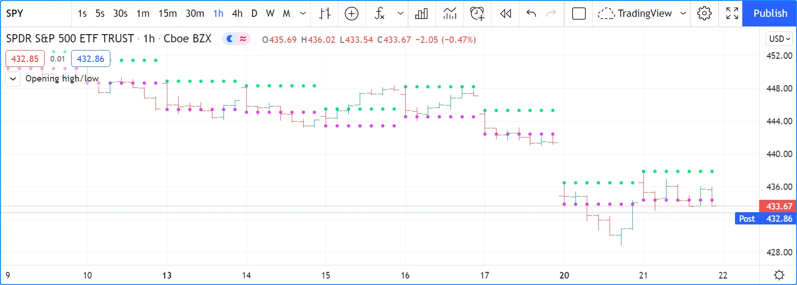
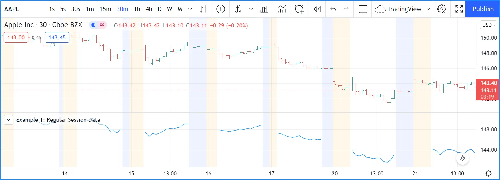
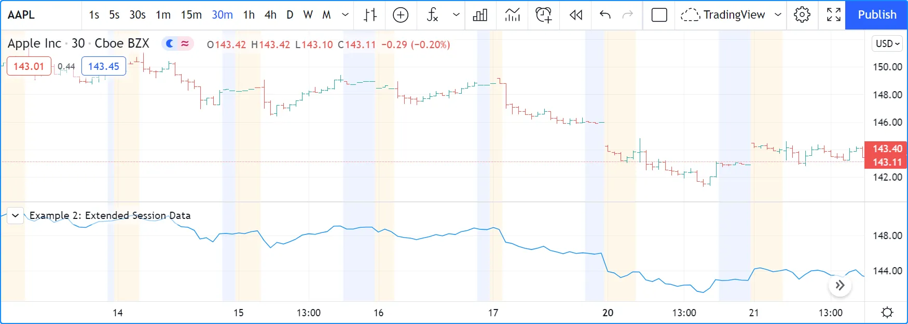

# Sessões

As informações de sessão podem ser usadas de três maneiras diferentes no Pine Script:

1. __Strings de sessão__ contendo horários de início e término e informações sobre os dias, que podem ser usadas em funções como [time()](https://br.tradingview.com/pine-script-reference/v5/#fun_time) e [time_close()](https://br.tradingview.com/pine-script-reference/v5/#fun_time_close) para detectar quando barras estão em um determinado período, com a opção de limitar sessões válidas a dias específicos. A função [input.session()](https://br.tradingview.com/pine-script-reference/v5/#fun_input%7Bdot%7Dsession) permite que os usuários do script definam valores de sessão através da aba "Inputs" do script (veja a seção [Entrada de Sessão](./05_09_inputs.md#input-session) para mais informações).
2. __Estados de sessão__, variáveis incorporadas como [session.ismarket](https://br.tradingview.com/pine-script-reference/v5/#var_session%7Bdot%7Dismarket) podem identificar a qual sessão uma barra pertence.
3. Ao buscar dados com [request.security()](https://br.tradingview.com/pine-script-reference/v5/#fun_request%7Bdot%7Dsecurity), você pode optar por retornar dados apenas de sessões _regulares_ ou _estendidas_. Nesse caso, a definição de __sessões regulares e estendidas__ é a da bolsa. Faz parte das propriedades do instrumento — não é definida pelo usuário, como no primeiro ponto. Esta noção de _sessões regulares_ e _estendidas_ é a mesma usada na interface do gráfico, no campo "Configurações do Gráfico/Símbolo/Sessão" ("_Chart Settings/Symbol/Session_"), por exemplo.

As seções seguintes cobrem ambos os métodos de uso de informações de sessão no Pine Script.

__Note que:__

- Nem todas as contas de usuário no TradingView têm acesso a informações de sessões estendidas.
- Não existe um tipo especial "sessão" "_session_" no Pine Script. Em vez disso, strings de sessão são do tipo "string", mas devem conformar-se à sintaxe da string de sessão.

## Strings de Sessão

### Especificações de String de Sessão

Strings de sessão usadas com [time()](https://br.tradingview.com/pine-script-reference/v5/#fun_time) e [time_close()](https://br.tradingview.com/pine-script-reference/v5/#fun_time_close) devem ter um formato específico. Sua sintaxe é:

```c
<time_period>:<days>
```

__Onde:__

- `<time_period>` usa horários no formato "hhmm", com "hh" no formato de 24 horas, então `1700` para 17h.

Os períodos de tempo estão no formato "hhmm-hhmm", e uma vírgula pode separar múltiplos períodos de tempo para especificar combinações de períodos distintos.

Por exemplo, - `<days>` é um conjunto de dígitos de 1 a 7 que especifica em quais dias a sessão é válida.

1 é Domingo, 7 é Sábado.

> __Observação!__\
> Os dias padrão são `1234567`, o que é diferente no Pine Script v5 em relação a versões anteriores, onde `23456` (dias de semana) era usado. Para que o código v5 reproduza o comportamento das versões anteriores, deve-se mencionar explicitamente os dias da semana, como em `"0930-1700:23456"`.

Estes são exemplos de strings de sessão:

`"24x7"`

Uma sessão de 7 dias, 24 horas, começando à meia-noite.

`"0000-0000:1234567"`

Equivalente ao exemplo anterior.

`"0000-0000"`

Equivalente aos dois exemplos anteriores porque os dias padrão são `1234567`.

`"0000-0000:23456"`

O mesmo que o exemplo anterior, mas apenas de segunda a sexta-feira.

`"2000-1630:1234567"`

Uma sessão noturna que começa às 20:00 e termina às 16:30 do dia seguinte. É válida todos os dias da semana.

`"0930-1700:146"`

Uma sessão que começa às 9:30 e termina às 17:00 aos domingos (1), quartas-feiras (4) e sextas-feiras (6).

`"1700-1700:23456"`

Uma _sessão noturna_. A sessão de segunda-feira começa no domingo às 17:00 e termina na segunda-feira às 17:00. É válida de segunda a sexta-feira.

`"1000-1001:26"`

Uma sessão estranha que dura apenas um minuto nas segundas-feiras (2) e sextas-feiras (6).

`"0900-1600,1700-2000"`

Uma sessão que começa às 9:00, faz uma pausa das 16:00 às 17:00 e continua até as 20:00. Aplica-se a todos os dias da semana.

<!-- ### Usando Strings de Sessão

Propriedades de sessão definidas com strings de sessão são independentes das sessões definidas pela bolsa que determinam quando um instrumento pode ser negociado. Programadores têm total liberdade para criar quaisquer definições de sessão que se adequem ao seu propósito, que geralmente é detectar quando barras pertencem a períodos específicos. Isso é realizado no Pine Script usando uma das duas assinaturas da função [time()](https://br.tradingview.com/pine-script-reference/v5/#fun_time):

```c
time(timeframe, session, timezone) → series int
time(timeframe, session) → series int
```

Aqui, é usado [time()](https://br.tradingview.com/pine-script-reference/v5/#fun_time) com um argumento `session` para exibir os valores de [alta](https://br.tradingview.com/pine-script-reference/v5/#var_high) e [baixa](https://br.tradingview.com/pine-script-reference/v5/#var_low) de abertura do mercado em um gráfico intradiário:



```c
//@version=5
indicator("Opening high/low", overlay = true)

sessionInput = input.session("0930-0935")

sessionBegins(sess) =>
    t = time("", sess)
    timeframe.isintraday and (not barstate.isfirst) and na(t[1]) and not na(t)

var float hi = na
var float lo = na
if sessionBegins(sessionInput)
    hi := high
    lo := low

plot(lo, "lo", color.fuchsia, 2, plot.style_circles)
plot(hi, "hi", color.lime,    2, plot.style_circles)
```

__Note que:__

- Uma entrada de sessão é utilizada para permitir que os usuários especifiquem o horário que desejam detectar. Aqui apenas procura-se o horário de início da sessão nas barras, então é usado um intervalo de cinco minutos entre o horário de início e término do nosso valor padrão `"0930-0935"`.
- A função `sessionBegins()` detecta o início de uma sessão. Sua chamada `time("", sess)` usa uma string vazia para o parâmetro `timeframe` da função, o que significa que usa o timeframe do gráfico, qualquer que seja. A função retorna `true` quando:
    - O gráfico usa um timeframe intradiário (segundos ou minutos).
    - O script não está na primeira barra do gráfico, o que é garantido com `(not barstate.isfirst)`. Esta verificação impede que o código sempre detecte um início de sessão na primeira barra porque `na(t[1]) and not na(t)` é sempre `true` lá.
    - A chamada [time()](https://br.tradingview.com/pine-script-reference/v5/#fun_time) retornou [na](https://br.tradingview.com/pine-script-reference/v5/#var_na) na barra anterior porque não estava no período da sessão e retornou um valor que não é [na](https://br.tradingview.com/pine-script-reference/v5/#var_na) na barra atual, o que significa que a barra está __no__ período da sessão.

## Estados da Sessão

Três variáveis incorporadas permitem distinguir o tipo de sessão à qual a barra atual pertence. Elas são úteis apenas em timeframes intradiários:

- [session.ismarket](https://br.tradingview.com/pine-script-reference/v5/#var_session%7Bdot%7Dismarket) retorna `true` quando a barra pertence ao horário de negociação regular.
- [session.ispremarket](https://br.tradingview.com/pine-script-reference/v5/#var_session%7Bdot%7Dispremarket) retorna `true` quando a barra pertence à sessão estendida que precede o horário de negociação regular.
- [session.ispostmarket](https://br.tradingview.com/pine-script-reference/v5/#var_session%7Bdot%7Dispostmarket) retorna `true` quando a barra pertence à sessão estendida que segue o horário de negociação regular.

## Usando Sessões com `request.security()`

Quando sua conta no TradingView fornece acesso a sessões estendidas, você pode optar por ver suas barras com o campo "Configurações/Símbolo/Sessão" "_Settings/Symbol/Session_". Existem dois tipos de sessões:

- __regular__ (que não inclui dados de pré e pós-mercado), e
- __estendida__ (que inclui dados de pré e pós-mercado).

Scripts que usam a função [request.security()](https://br.tradingview.com/pine-script-reference/v5/#fun_request%7Bdot%7Dsecurity) para acessar dados podem retornar dados de sessão estendida ou não. Este é um exemplo onde apenas dados de sessão regular são buscados:



```c
//@version=5
indicator("Example 1: Regular Session Data")
regularSessionData = request.security("NASDAQ:AAPL", timeframe.period, close, barmerge.gaps_on)
plot(regularSessionData, style = plot.style_linebr)
```

Se quiser que a chamada [request.security()](https://br.tradingview.com/pine-script-reference/v5/#fun_request%7Bdot%7Dsecurity) retorne dados de sessão estendida, primeiro deve usar a função [ticker.new()](https://br.tradingview.com/pine-script-reference/v5/#fun_ticker%7Bdot%7Dnew) para construir o primeiro argumento da chamada [request.security()](https://br.tradingview.com/pine-script-reference/v5/#fun_request%7Bdot%7Dsecurity):



```c
//@version=5
indicator("Example 2: Extended Session Data")
t = ticker.new("NASDAQ", "AAPL", session.extended)
extendedSessionData = request.security(t, timeframe.period, close, barmerge.gaps_on)
plot(extendedSessionData, style = plot.style_linebr)
```

Repare que as lacunas no gráfico anterior na plotagem do script agora estão preenchidas. Além disso, tenha em mente que os scripts de exemplo não produzem a coloração de fundo no gráfico; isso se deve às configurações do gráfico mostrando horas estendidas.

A função [ticker.new()](https://br.tradingview.com/pine-script-reference/v5/#fun_ticker%7Bdot%7Dnew) tem a seguinte assinatura:

```c
ticker.new(prefix, ticker, session, adjustment) → simple string
```

Onde:

- `prefix` é o prefixo da bolsa, por exemplo, `"NASDAQ"`.
- `ticker` é o nome do símbolo, por exemplo, `"AAPL"`.
- `session` pode ser `session.extended` ou `session.regular`. Note que isto __não__ é uma string de sessão.
- `adjustment` ajusta os preços usando diferentes critérios: `adjustment.none`, `adjustment.splits`, `adjustment.dividends`.

O primeiro exemplo poderia ser reescrito como:

```c
//@version=5
indicator("Example 1: Regular Session Data")
t = ticker.new("NASDAQ", "AAPL", session.regular)
regularSessionData = request.security(t, timeframe.period, close, barmerge.gaps_on)
plot(regularSessionData, style = plot.style_linebr)
```

Se quiser usar as mesmas especificações de sessão usadas para o símbolo principal do gráfico, omita o terceiro argumento em [ticker.new()](https://br.tradingview.com/pine-script-reference/v5/#fun_ticker%7Bdot%7Dnew); ele é opcional. Se queira que o código declare sua intenção explicitamente, use a variável incorporada [syminfo.session](https://br.tradingview.com/pine-script-reference/v5/#var_syminfo%7Bdot%7Dsession). Ela contém o tipo de sessão do símbolo principal do gráfico:

```c
//@version=5
indicator("Example 1: Regular Session Data")
t = ticker.new("NASDAQ", "AAPL", syminfo.session)
regularSessionData = request.security(t, timeframe.period, close, barmerge.gaps_on)
plot(regularSessionData, style = plot.style_linebr)
``` -->
