# Estratégias

As estratégias do Pine Script simulam a execução de negociações em dados históricos e em tempo real para facilitar o backtesting e o forward testing de sistemas de negociação. Elas incluem muitas das mesmas capacidades dos indicadores do Pine Script, além de fornecer a capacidade de colocar, modificar e cancelar ordens hipotéticas e analisar os resultados.

Quando um script usa a função [strategy()](https://br.tradingview.com/pine-script-reference/v5/#fun_strategy) para sua declaração, ele ganha acesso ao namespace `strategy.*`, onde pode chamar funções e variáveis para simular ordens e acessar informações essenciais da estratégia. Além disso, o script exibirá informações e resultados simulados externamente na aba "Strategy Tester".

## Um Exemplo Simples de Estratégia

O script a seguir é uma estratégia simples que simula a entrada de posições _longs_ ou _short_ com base no cruzamento de duas médias móveis:

```c
//@version=5
strategy("test", overlay = true)

// Calculate two moving averages with different lengths.
float fastMA = ta.sma(close, 14)
float slowMA = ta.sma(close, 28)

// Enter a long position when `fastMA` crosses over `slowMA`.
if ta.crossover(fastMA, slowMA)
    strategy.entry("buy", strategy.long)

// Enter a short position when `fastMA` crosses under `slowMA`.
if ta.crossunder(fastMA, slowMA)
    strategy.entry("sell", strategy.short)

// Plot the moving averages.
plot(fastMA, "Fast MA", color.aqua)
plot(slowMA, "Slow MA", color.orange)
```

__Note que:__

- A linha `strategy("test", overlay = true)` declara que o script é uma estratégia chamada "test" com saídas visuais sobrepostas no painel principal do gráfico.
- [strategy.entry()](https://br.tradingview.com/pine-script-reference/v5/#fun_strategy%7Bdot%7Dentry) é o comando que o script usa para simular ordens de "compra" e "venda". Quando o script coloca uma ordem, ele também plota o `id` da ordem no gráfico e uma seta para indicar a direção.
- Duas funções [plot()](https://br.tradingview.com/pine-script-reference/v5/#fun_plot) plotam as médias móveis com duas cores diferentes para referência visual.

## Aplicando uma Estratégia a um Gráfico

Para testar uma estratégia, aplique-a ao gráfico. Você pode usar uma estratégia integrada a partir da caixa de diálogo "Indicadores e Estratégias" ou escrever a sua própria no Pine Editor. Clique em "Adicionar ao gráfico" "_Add to chart_" na aba "Pine Editor" para aplicar um script ao gráfico:

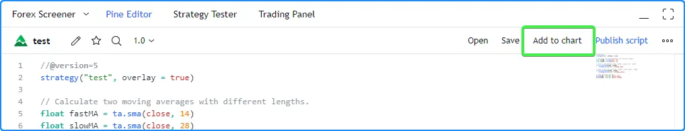

Depois que um script de estratégia é compilado e aplicado a um gráfico, ele plotará marcas de ordem no painel principal do gráfico e exibirá resultados de desempenho simulados na aba "Teste de Estratégia" "_Strategy Tester_" abaixo:

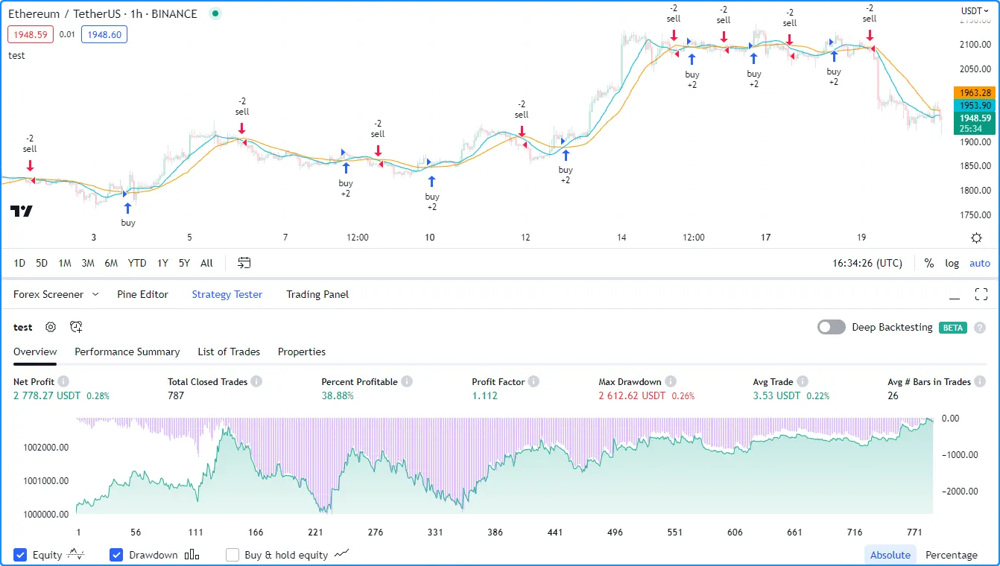

> __Observação!__\
> Os resultados de uma estratégia aplicada a gráficos não padronizados ([Heikin Ashi](https://br.tradingview.com/support/solutions/43000619436), [Renko](https://br.tradingview.com/support/solutions/43000502284), [Line Break](https://br.tradingview.com/support/solutions/43000502273), [Kagi](https://br.tradingview.com/support/solutions/43000502272), [Point & Figure](https://br.tradingview.com/support/solutions/43000502276) e [Range](https://br.tradingview.com/support/solutions/43000474007)) não refletem as condições reais do mercado por padrão. Scripts de estratégia usarão os valores de preços sintéticos desses gráficos durante a simulação, que muitas vezes não se alinham com os preços reais do mercado e, portanto, produzirão resultados de backtest irreais. Recomenda-se fortemente o uso de tipos de gráficos padrão para backtesting de estratégias. Alternativamente, em gráficos Heikin Ashi, os usuários podem simular ordens usando preços reais habilitando a opção "Preencher ordens usando OHLC padrão" "_Fill orders using standard OHLC_" nas [Propriedades das estratégias](https://br.tradingview.com/support/solutions/43000628599).

## Testador de Estratégia

O módulo Strategy Tester está disponível para todos os scripts declarados com a função [strategy()](https://br.tradingview.com/pine-script-reference/v5/#fun_strategy). Os usuários podem acessar esse módulo na aba "Testador de Estratégia" "_Strategy Tester_" abaixo de seus gráficos, onde podem visualizar convenientemente suas estratégias e analisar os resultados hipotéticos de desempenho.

### Visão Geral

A aba [Overview](https://br.tradingview.com/support/solutions/43000681733-overview-tab) do Testador de Estratégia apresenta métricas de desempenho essenciais e curvas de patrimônio e drawdown ao longo de uma sequência simulada de negociações, proporcionando uma visão rápida do desempenho da estratégia sem mergulhar em detalhes granulares. O gráfico nesta seção mostra a [curva de patrimônio](https://br.tradingview.com/support/solutions/43000681735) da estratégia como um gráfico de linha, a [curva de patrimônio de compra e manutenção](https://br.tradingview.com/support/solutions/43000681736) como uma linha contínua e a [curva de drawdown](https://br.tradingview.com/support/solutions/43000681734) como um histograma. Os usuários podem alternar essas plotagens e escalá-las como valores absolutos ou percentuais usando as opções abaixo do gráfico.

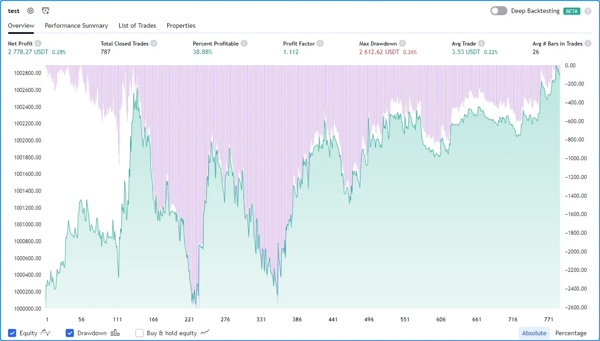

__Note que:__

- O gráfico de visão geral usa duas escalas; a da esquerda é para as curvas de patrimônio e a da direita é para a curva de drawdown.
- Quando um usuário clica em um ponto dessas plotagens, isso direcionará a visualização do gráfico principal para o ponto onde a negociação foi fechada.

### Resumo de Desempenho

A aba [Performance Summary](https://br.tradingview.com/support/solutions/43000681683) do módulo apresenta uma visão abrangente das métricas de desempenho de uma estratégia. Ela exibe três colunas: uma para todas as negociações, uma para todas as _longs_ e outra para todas as _short_, proporcionando aos traders insights mais detalhados sobre o desempenho simulado de negociações _longs_, _short_ e gerais de uma estratégia.

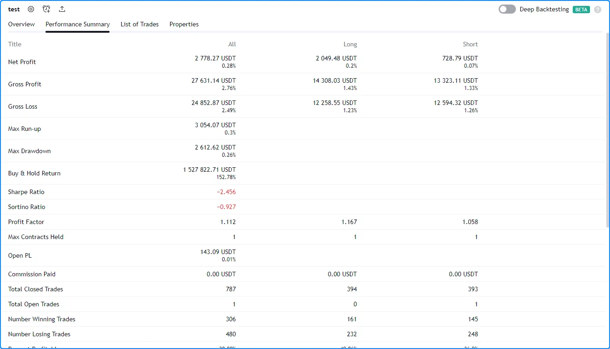

### Lista de Negociações

A aba [List of Trades](https://br.tradingview.com/support/solutions/43000681737) fornece uma visão granular das negociações simuladas por uma estratégia com informações essenciais, incluindo a data e hora de execução, o tipo de ordem usada (entrada ou saída), o número de contratos/ações/lotes/unidades negociados e o preço, bem como algumas métricas de desempenho da negociação.

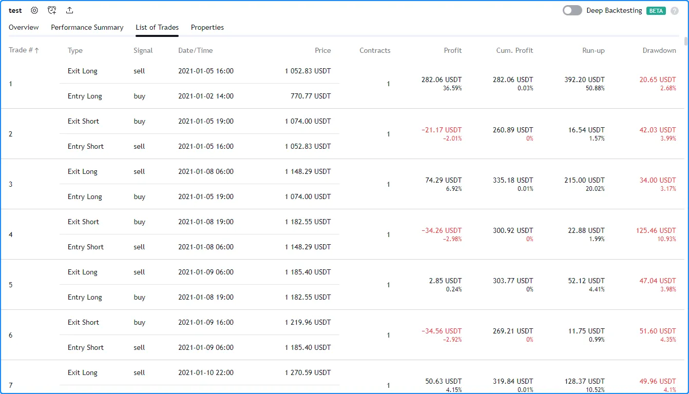

__Note que:__

- Os usuários podem navegar pelos horários de negociações específicas em seus gráficos clicando nelas nesta lista.
- Clicando no campo "Trade #" acima da lista, os usuários podem organizar as negociações em ordem crescente a partir da primeira ou em ordem decrescente a partir da última.

### Propriedades

A aba "Propriedades" "_Properties_" fornece informações detalhadas sobre a configuração de uma estratégia e o conjunto de dados ao qual ela é aplicada. Inclui o intervalo de datas da estratégia, informações do símbolo, configurações do script e propriedades da estratégia.

- __Intervalo de Datas__ - Inclui o intervalo de datas com negociações simuladas e o intervalo total disponível para backtesting.
- __Informações do Símbolo__ - Contém o nome do símbolo e corretora/bolsa, o timeframe e tipo do gráfico, o tamanho do tick, o valor do ponto para o gráfico e a moeda base.
- __Entradas da Estratégia__ - Descreve os vários parâmetros e variáveis usadas no script da estratégia disponíveis na aba "Entradas" "_Inputs_" das configurações do script.
- __Propriedades da Estratégia__ - Fornece uma visão geral da configuração da estratégia de negociação. Inclui detalhes essenciais como o capital inicial, moeda base, tamanho da ordem, margem, pirâmide, comissão e deslizamento. Além disso, esta seção destaca quaisquer modificações feitas no comportamento de cálculo da estratégia.

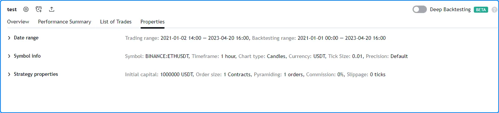

## Emulador do Broker

TradingView utiliza um "_broker emulator_" para simular o desempenho das estratégias de negociação. Diferente da negociação na vida real, o emulador usa estritamente os preços disponíveis no gráfico para a simulação de ordens. Consequentemente, a simulação só pode realizar negociações históricas após o fechamento de uma barra e só pode realizar negociações em tempo real em um novo tick de preço. Para mais informações sobre esse comportamento, consulte o [Modelo de Execução](./04_01_modelo_de_execucao.md) do Pine Script.

Como o emulador só pode usar dados do gráfico, ele faz suposições sobre o movimento dos preços intrabar. Ele usa os preços de abertura, máxima e mínima de uma barra para inferir a atividade intrabar enquanto calcula preenchimentos de ordens com a seguinte lógica:

- Se o preço máximo estiver mais próximo do preço de abertura do que o preço mínimo, assume-se que o preço se moveu nesta ordem na barra: abertura → máxima → mínima → fechamento.
- Se o preço mínimo estiver mais próximo do preço de abertura do que o preço máximo, assume-se que o preço se moveu nesta ordem na barra: abertura → mínima → máxima → fechamento.
- O emulador do broker assume que não existem lacunas entre os preços dentro das barras, significando que toda a gama de preços intrabar está disponível para execução de ordens. No entanto, as lacunas entre o fechamento da barra anterior e a abertura da barra atual são levadas em consideração ao preencher ordens de preço fixo (todas as ordens, exceto ordens de mercado). Se o preço da ordem for cruzado durante a lacuna entre duas barras, a ordem é executada na abertura da próxima barra e não no preço especificado.

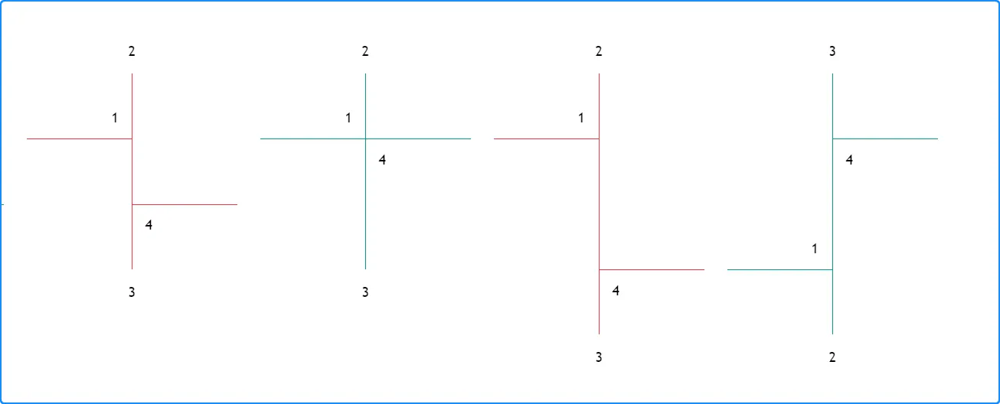

### Ampliador da Barra

Os assinantes da conta Premium podem substituir as suposições intrabar do emulador do broker através do parâmetro `use_bar_magnifier` da função [strategy()](https://br.tradingview.com/pine-script-reference/v5/#fun_strategy) ou da entrada "Usar amplificador de barras" "_Use bar magnifier_" na aba "Propriedades" "_Properties_" das configurações do script. A [Lupa de Barras/Ampliador](https://br.tradingview.com/support/solutions/43000669285) inspeciona dados em timeframes menores do que os do gráfico para obter informações mais granulares sobre a ação do preço dentro de uma barra, permitindo preenchimentos de ordens mais precisos durante a simulação.

Para demonstrar, o script a seguir coloca uma ordem limite de "Compra" "_Buy_" no `entryPrice` e uma ordem limite de "Saída" "_Exit_" no `exitPrice` quando o valor do [tempo](https://br.tradingview.com/pine-script-reference/v5/#var_time) cruza o `orderTime`, e desenha duas linhas horizontais para visualizar os preços das ordens. O script também destaca o fundo usando o `orderColor` para indicar quando a estratégia colocou as ordens:

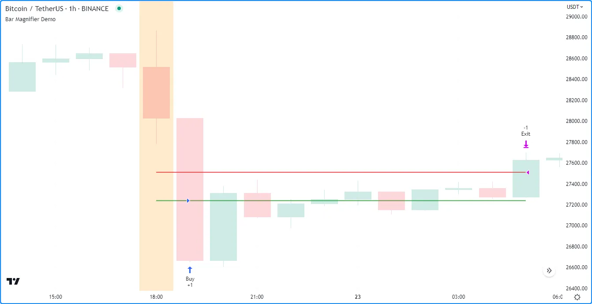

```c
//@version=5
strategy("Bar Magnifier Demo", overlay = true, use_bar_magnifier = false)

//@variable The UNIX timestamp to place the order at.
int orderTime = timestamp("UTC", 2023, 3, 22, 18)

//@variable Returns `color.orange` when `time` crosses the `orderTime`, false otherwise.
color orderColor = na

// Entry and exit prices.
float entryPrice = hl2 - (high - low)
float exitPrice  = entryPrice + (high - low) * 0.25

// Entry and exit lines.
var line entryLine = na
var line exitLine  = na

if ta.cross(time, orderTime)
    // Draw new entry and exit lines.
    entryLine := line.new(bar_index, entryPrice, bar_index + 1, entryPrice, color = color.green, width = 2)
    exitLine  := line.new(bar_index, exitPrice, bar_index + 1, exitPrice, color = color.red, width = 2)

    // Update order highlight color.
    orderColor := color.new(color.orange, 80)

    // Place limit orders at the `entryPrice` and `exitPrice`.
    strategy.entry("Buy", strategy.long, limit = entryPrice)
    strategy.exit("Exit", "Buy", limit = exitPrice)

// Update lines while the position is open.
else if strategy.position_size > 0.0
    entryLine.set_x2(bar_index + 1)
    exitLine.set_x2(bar_index + 1)

bgcolor(orderColor)
```

Como visto no gráfico acima, o emulador do broker assumiu que os preços intrabar se moveram de abertura para máxima, depois máxima para mínima, depois mínima para fechamento na barra em que a ordem "Buy" foi preenchida, significando que o emulador assumiu que a ordem "Exit" não poderia ser preenchida na mesma barra. No entanto, após incluir `use_bar_magnifier = true` na declaração, se vê uma história diferente:

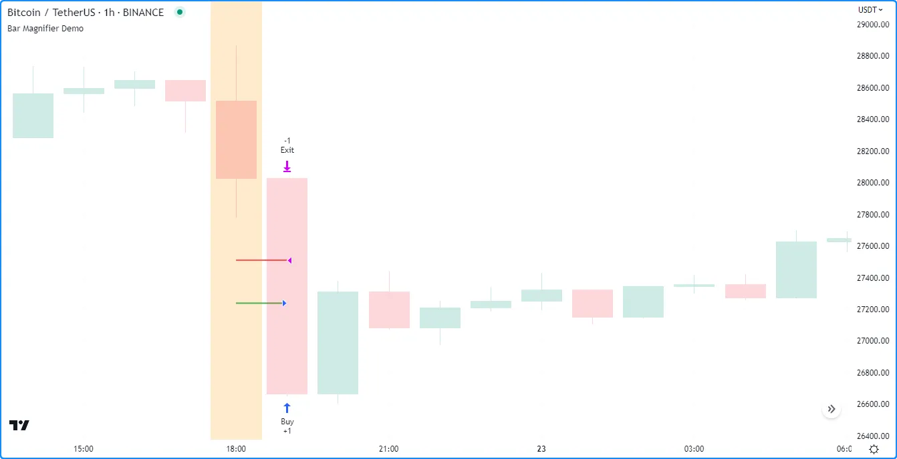

> __Observação!__\
> O número máximo de intrabarras que um script pode solicitar é 200.000. Alguns símbolos com histórico mais longo podem não ter cobertura completa de intrabarras para suas barras iniciais do gráfico com essa limitação, significando que negociações simuladas nessas barras não serão afetadas pelo amplificador de barras.

## Ordens e Entradas

Assim como na negociação real, as estratégias do Pine usam ordens para gerenciar posições. Nesse contexto, uma _ordem_ é um comando para simular uma ação de mercado, e uma _negociação_ é o resultado após a ordem ser preenchida. Portanto, para entrar ou sair de posições usando Pine, os usuários devem criar ordens com parâmetros que especificam como elas se comportarão.

Para examinar mais de perto como as ordens funcionam e como elas se tornam negociações, aqui um script de estratégia simples:

```c
//@version=5
strategy("My strategy", overlay = true, margin_long = 100, margin_short = 100)

//@function Displays text passed to `txt` when called. 
debugLabel(txt) => 
    label.new(
         bar_index, high, text = txt, color=color.lime, style = label.style_label_lower_right, 
         textcolor = color.black, size = size.large
     )

longCondition = bar_index % 20 == 0 // true on every 20th bar
if (longCondition)
    debugLabel("Long entry order created")
    strategy.entry("My Long Entry Id", strategy.long)
strategy.close_all()
```

Neste script, é definido uma `longCondition` que é verdadeira sempre que o `bar_index` é divisível por 20, ou seja, a cada 20ª barra. A estratégia usa essa condição dentro de uma estrutura [if](https://br.tradingview.com/pine-script-reference/v5/#kw_if) para simular uma ordem de entrada com [strategy.entry()](https://br.tradingview.com/pine-script-reference/v5/#fun_strategy%7Bdot%7Dentry) e desenha um _label_ no preço de entrada com a função `debugLabel()` definida pelo usuário. O script chama [strategy.close_all()](https://br.tradingview.com/pine-script-reference/v5/#fun_strategy%7Bdot%7Dclose_all) do escopo global para simular uma ordem de mercado que fecha qualquer posição aberta. Veja o que acontece quando é adicionado o script ao gráfico:

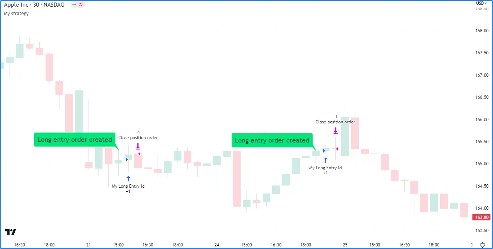

As setas azuis no gráfico indicam os locais de entrada, e as roxas marcam os pontos onde a estratégia fechou posições. Observe que os _labels_ precedem o ponto de entrada real, em vez de ocorrer na mesma barra - isso são as ordens em ação. Por padrão, as estratégias do Pine aguardam o próximo tick de preço disponível antes de preencher ordens, pois preencher uma ordem no mesmo tick não é realista. Além disso, elas recalculam no fechamento de cada barra histórica, significando que o próximo tick disponível para preencher uma ordem é a abertura da próxima barra neste caso. Como resultado, por padrão, todas as ordens são atrasadas por uma barra do gráfico.

É importante notar que, embora o script chame [strategy.close_all()](https://br.tradingview.com/pine-script-reference/v5/#fun_strategy%7Bdot%7Dclose_all) do escopo global, forçando a execução em cada barra, a chamada da função não faz nada se a estratégia não estiver simulando uma posição aberta. Se houver uma posição aberta, o comando emite uma ordem de mercado para fechá-la, que é executada no próximo tick disponível. Por exemplo, quando a `longCondition` é verdadeira na barra 20, a estratégia coloca uma ordem de entrada para preencher no próximo tick, que é na abertura da barra 21. Uma vez que o script recalcula seus valores no fechamento dessa barra, a função coloca uma ordem para fechar a posição, que é preenchida na abertura da barra 22.

### Tipos de Ordens

As estratégias do Pine Script permitem aos usuários simular diferentes tipos de ordens para suas necessidades específicas. Os principais tipos notáveis são _market/mercado_, _limit/limite_, _stop_ e _stop-limit_.

#### Ordens de Market/Mercado 

Ordens de mercado são o tipo mais básico de ordens. Elas comandam uma estratégia para comprar ou vender um ativo o mais rápido possível, independentemente do preço. Consequentemente, elas sempre executam no próximo tick de preço disponível. Por padrão, todas as funções `strategy.*()` que geram ordens produzem especificamente ordens de mercado.

O script a seguir simula uma ordem de mercado _long_ quando o `bar_index` é divisível por `2 * cycleLength`. Caso contrário, simula uma ordem de mercado _short_ quando o `bar_index` é divisível por `cycleLength`, resultando em uma estratégia com negociações _longs_ e _short_ alternadas a cada `cycleLength` barras:

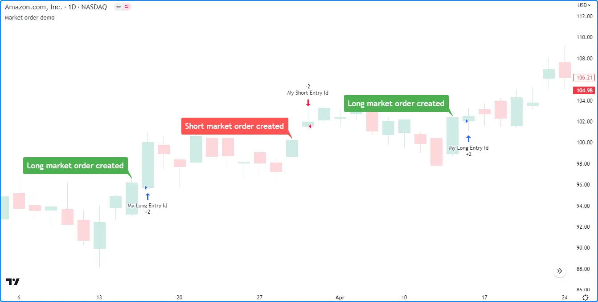

```c
//@version=5
strategy("Market order demo", overlay = true, margin_long = 100, margin_short = 100)

//@variable Number of bars between long and short entries.
cycleLength = input.int(10, "Cycle length")

//@function Displays text passed to `txt` when called.
debugLabel(txt, lblColor) => label.new(
    bar_index, high, text = txt, color = lblColor, textcolor = color.white, 
    style = label.style_label_lower_right, size = size.large
)

//@variable Returns `true` every `2 * cycleLength` bars.
longCondition = bar_index % (2 * cycleLength) == 0
//@variable Returns `true` every `cycleLength` bars.
shortCondition = bar_index % cycleLength == 0

// Generate a long market order with a `color.green` label on `longCondition`.
if longCondition
    debugLabel("Long market order created", color.green)
    strategy.entry("My Long Entry Id", strategy.long)
// Otherwise, generate a short market order with a `color.red` label on `shortCondition`.
else if shortCondition
    debugLabel("Short market order created", color.red)
    strategy.entry("My Short Entry Id", strategy.short)
```

#### Ordens de Limit/Limite

Ordens de limite comandam uma estratégia para entrar em uma posição a um preço específico ou melhor (inferior ao especificado para ordens _longs_ e superior para ordens _short_). Quando o preço de mercado atual é melhor do que o parâmetro `limit` da ordem, a ordem será preenchida sem esperar que o preço de mercado atinja o nível limite.

Para simular ordens de limite em um script, passe um valor de preço para um comando de colocação de ordem com um parâmetro `limit`. O exemplo a seguir coloca uma ordem de limite 800 ticks abaixo do fechamento da barra 100 barras antes do `last_bar_index`:

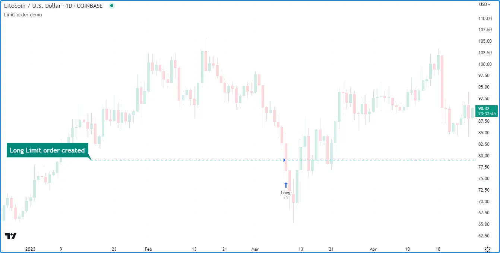

```c
//@version=5
strategy("Limit order demo", overlay = true, margin_long = 100, margin_short = 100)

//@function Displays text passed to `txt` and a horizontal line at `price` when called.
debugLabel(price, txt) =>
    label.new(
         bar_index, price, text = txt, color = color.teal, textcolor = color.white, 
         style = label.style_label_lower_right, size = size.large
     )
    line.new(
         bar_index, price, bar_index + 1, price, color = color.teal, extend = extend.right, 
         style = line.style_dashed
     )

// Generate a long limit order with a label and line 100 bars before the `last_bar_index`.
if last_bar_index - bar_index == 100
    limitPrice = close - syminfo.mintick * 800
    debugLabel(limitPrice, "Long Limit order created")
    strategy.entry("Long", strategy.long, limit = limitPrice)
```

Observe como o script colocou o _label_ e começou a linha várias barras antes da negociação. Enquanto o preço permanecesse acima do valor `limitPrice`, a ordem não poderia ser preenchida. Uma vez que o preço de mercado atingiu o limite, a estratégia executou a negociação no meio da barra. Se tivesse definido o `limitPrice` para 800 ticks _acima_ do fechamento da barra em vez de _abaixo_, a ordem seria preenchida imediatamente, pois o preço já estaria em um valor melhor:

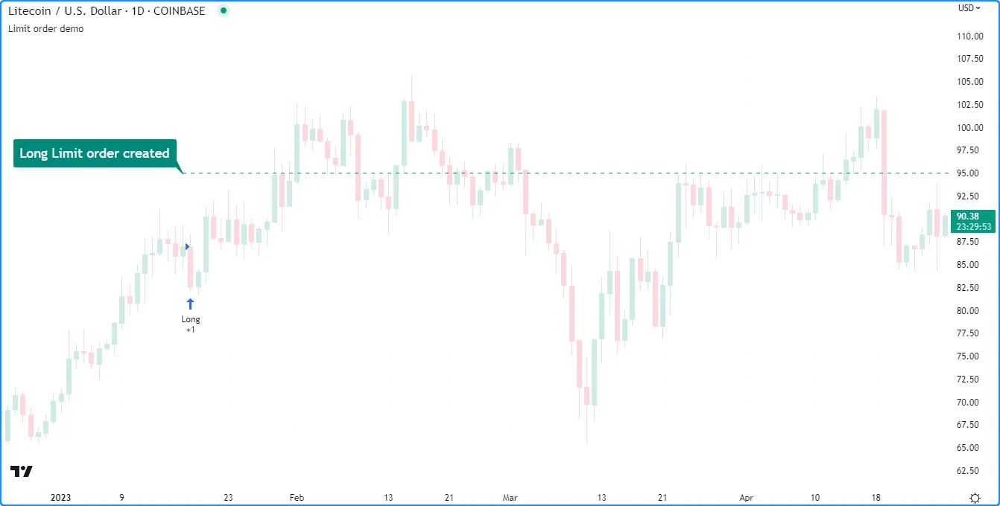

```c
//@version=5
strategy("Limit order demo", overlay = true, margin_long = 100, margin_short = 100)

//@function Displays text passed to `txt` and a horizontal line at `price` when called.
debugLabel(price, txt) =>
    label.new(
        bar_index, price, text = txt, color = color.teal, textcolor = color.white, 
        style = label.style_label_lower_right, size = size.large
    )
    line.new(
        bar_index, price, bar_index + 1, price, color = color.teal, extend = extend.right, 
        style = line.style_dashed
    )

// Generate a long limit order with a label and line 100 bars before the `last_bar_index`.
if last_bar_index - bar_index == 100
    limitPrice = close + syminfo.mintick * 800
    debugLabel(limitPrice, "Long Limit order created")
    strategy.entry("Long", strategy.long, limit = limitPrice)
```

#### Ordens Stop e Stop-Limit

Ordens stop comandam uma estratégia para simular outra ordem após o preço atingir o preço `stop` especificado ou um valor pior (maior que o especificado para ordens _longs_ e menor para _short_). Elas são essencialmente o oposto das ordens limite. Quando o preço de mercado atual é pior do que o parâmetro `stop`, a estratégia acionará a ordem subsequente sem esperar que o preço atual atinja o nível stop. Se o comando de colocação de ordem incluir um argumento `limit`, a ordem subsequente será uma ordem limite no valor especificado. Caso contrário, será uma ordem de mercado.

O script abaixo coloca uma ordem stop 800 ticks acima do `close` de 100 barras atrás. Neste exemplo, a estratégia entrou em uma posição _long_ quando o preço de mercado cruzou o preço `stop` algumas barras depois de colocada a ordem. Observe que o preço inicial no momento da ordem era melhor do que o passado para `stop`. Uma ordem limite equivalente teria sido preenchida na barra do gráfico seguinte:

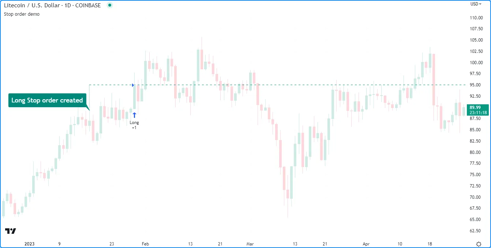

```c
//@version=5
strategy("Stop order demo", overlay = true, margin_long = 100, margin_short = 100)

//@function Displays text passed to `txt` when called and shows the `price` level on the chart.
debugLabel(price, txt) =>
    label.new(
         bar_index, high, text = txt, color = color.teal, textcolor = color.white, 
         style = label.style_label_lower_right, size = size.large
     )
    line.new(bar_index, high, bar_index, price, style = line.style_dotted, color = color.teal)
    line.new(
         bar_index, price, bar_index + 1, price, color = color.teal, extend = extend.right, 
         style = line.style_dashed
     )

// Generate a long stop order with a label and lines 100 bars before the last bar.
if last_bar_index - bar_index == 100
    stopPrice = close + syminfo.mintick * 800
    debugLabel(stopPrice, "Long Stop order created")
    strategy.entry("Long", strategy.long, stop = stopPrice)
```

Comandos de colocação de ordens que usam ambos os argumentos `limit` e `stop` produzem ordens stop-limit. Esse tipo de ordem espera que o preço cruze o nível stop e, em seguida, coloca uma ordem limite no preço `limit` especificado.

Modificando o script anterior para simular e visualizar uma ordem stop-limit. Neste exemplo, utiliza-se o valor `low` de 100 barras atrás como o preço `limit` no comando de entrada. Este script também exibe um _label_ e nível de preço para indicar quando a estratégia cruza o `stopPrice`, ou seja, quando a estratégia ativa a ordem limite. Observe como o preço de mercado inicialmente atinge o nível limite, mas a estratégia não simula uma negociação porque o preço deve cruzar o `stopPrice` para colocar a ordem limite pendente no `limitPrice`:

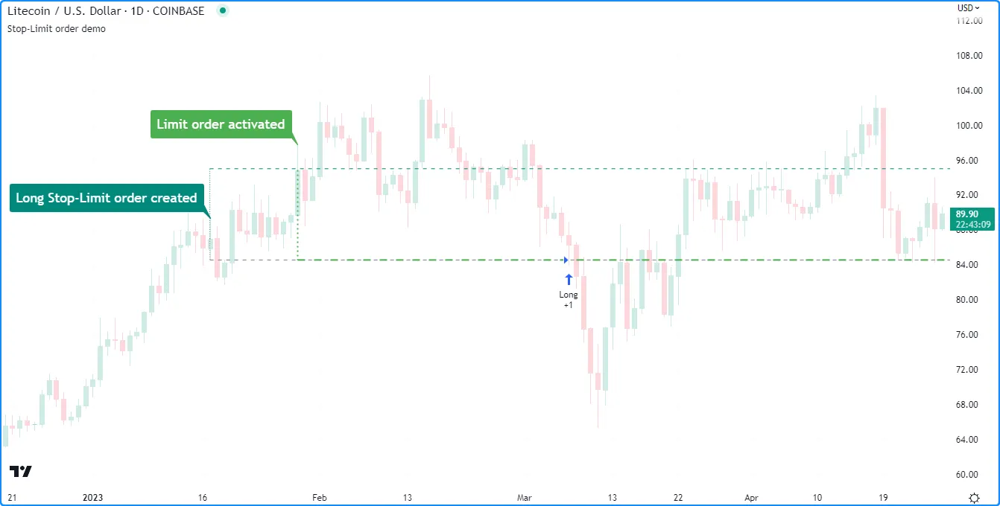

```c
//@version=5
strategy("Stop-Limit order demo", overlay = true, margin_long = 100, margin_short = 100)

//@function Displays text passed to `txt` when called and shows the `price` level on the chart.
debugLabel(price, txt, lblColor, lineWidth = 1) =>
    label.new(
         bar_index, high, text = txt, color = lblColor, textcolor = color.white, 
         style = label.style_label_lower_right, size = size.large
     )
    line.new(bar_index, close, bar_index, price, style = line.style_dotted, color = lblColor, width = lineWidth)
    line.new(
         bar_index, price, bar_index + 1, price, color = lblColor, extend = extend.right, 
         style = line.style_dashed, width = lineWidth
     )

var float stopPrice  = na
var float limitPrice = na

// Generate a long stop-limit order with a label and lines 100 bars before the last bar.
if last_bar_index - bar_index == 100
    stopPrice  := close + syminfo.mintick * 800
    limitPrice := low
    debugLabel(limitPrice, "", color.gray)
    debugLabel(stopPrice, "Long Stop-Limit order created", color.teal)
    strategy.entry("Long", strategy.long, stop = stopPrice, limit = limitPrice)

// Draw a line and label once the strategy activates the limit order.
if high >= stopPrice
    debugLabel(limitPrice, "Limit order activated", color.green, 2)
    stopPrice := na
```

### Comandos de Colocação de Ordens

As estratégias do Pine Script possuem várias funções para simular a colocação de ordens, conhecidas como _comandos de colocação de ordens_. Cada comando serve a um propósito único e se comporta de maneira diferente dos outros.

#### `strategy.entry()`

Este comando simula ordens de entrada. Por padrão, as estratégias colocam ordens de mercado ao chamar esta função, mas também podem criar ordens stop, limite e stop-limit ao utilizar os parâmetros `stop` e `limit`.

Para simplificar a abertura de posições, [strategy.entry()](https://br.tradingview.com/pine-script-reference/v5/#fun_strategy%7Bdot%7Dentry) apresenta vários comportamentos únicos. Um desses comportamentos é que este comando pode reverter uma posição de mercado aberta sem chamadas de função adicionais. Quando uma ordem colocada usando [strategy.entry()](https://br.tradingview.com/pine-script-reference/v5/#fun_strategy%7Bdot%7Dentry) é preenchida, a função calculará automaticamente a quantidade que a estratégia precisa para fechar a posição de mercado aberta e negociar contratos/ações/lotes/unidades na direção oposta por padrão. Por exemplo, se uma estratégia tem uma posição aberta de 15 ações na direção [strategy.long](https://br.tradingview.com/pine-script-reference/v5/#var_strategy%7Bdot%7Dlong) e chama [strategy.entry()](https://br.tradingview.com/pine-script-reference/v5/#fun_strategy%7Bdot%7Dentry) para colocar uma ordem de mercado na direção [strategy.short](https://br.tradingview.com/pine-script-reference/v5/#var_strategy%7Bdot%7Dshort), a quantidade que a estratégia negociará para colocar a ordem é de 15 ações mais a `qty` da nova ordem _short_.

O exemplo abaixo demonstra uma estratégia que usa apenas chamadas [strategy.entry()](https://br.tradingview.com/pine-script-reference/v5/#fun_strategy%7Bdot%7Dentry) para colocar ordens de entrada. Ele cria uma ordem de mercado _long_ com um valor `qty` de 15 ações a cada 100 barras e uma ordem de mercado _short_ com um `qty` de 5 a cada 25 barras. O script destaca o fundo em azul e vermelho para ocorrências das respectivas `buyCondition` e `sellCondition`:

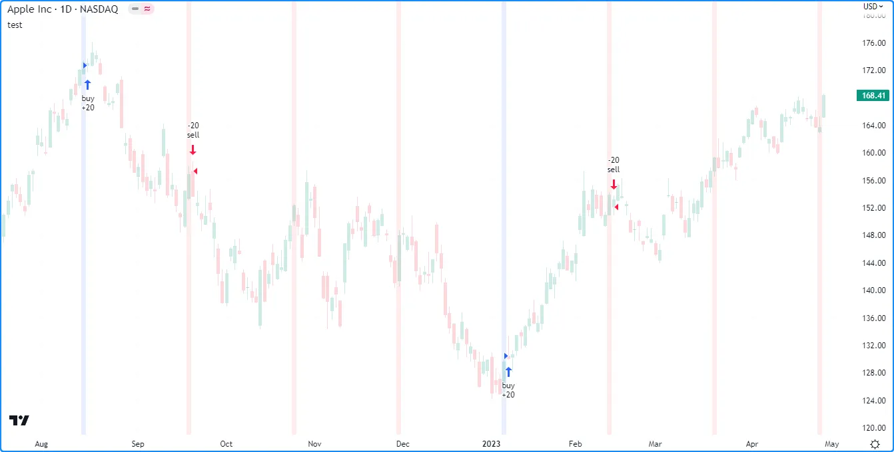

```c
//@version=5
strategy("Entry demo", "test", overlay = true)

//@variable Is `true` on every 100th bar.
buyCondition = bar_index % 100 == 0
//@variable Is `true` on every 25th bar except for those that are divisible by 100.
sellCondition = bar_index % 25 == 0 and not buyCondition

if buyCondition
    strategy.entry("buy", strategy.long, qty = 15)
if sellCondition
    strategy.entry("sell", strategy.short, qty = 5)

bgcolor(buyCondition  ? color.new(color.blue, 90) : na)
bgcolor(sellCondition ? color.new(color.red, 90) : na)
```

Como se vê no gráfico acima, as marcas de ordem mostram que a estratégia negociou 20 ações em cada preenchimento de ordem em vez de 15 e 5. Como [strategy.entry()](https://br.tradingview.com/pine-script-reference/v5/#fun_strategy%7Bdot%7Dentry) reverte automaticamente as posições, a menos que especificado de outra forma através da função [strategy.risk.allow_entry_in()](https://br.tradingview.com/pine-script-reference/v5/#fun_strategy%7Bdot%7Drisk%7Bdot%7Dallow_entry_in), ela adiciona o tamanho da posição aberta (15 para entradas _longs_) ao tamanho da nova ordem (5 para entradas _short_) ao mudar a direção, resultando em uma quantidade negociada de 20 ações.

Observe que no exemplo acima, embora a `sellCondition` ocorra três vezes antes de outra `buyCondition`, a estratégia coloca uma ordem de "venda" apenas na primeira ocorrência. Outro comportamento único do comando [strategy.entry()](https://br.tradingview.com/pine-script-reference/v5/#fun_strategy%7Bdot%7Dentry) é que ele é afetado pela configuração de _pyramiding_ do script. Pyramiding especifica o número de ordens consecutivas que a estratégia pode preencher na mesma direção. Seu valor é 1 por padrão, o que significa que a estratégia permite apenas uma ordem consecutiva para preencher em qualquer direção. Os usuários podem definir os valores de pyramiding da estratégia através do parâmetro `pyramiding` da chamada da função [strategy()](https://br.tradingview.com/pine-script-reference/v5/#fun_strategy) ou da entrada "Pyramiding" na aba "Propriedades" "_Properties_" das configurações do script.

Se for adicionado `pyramiding = 3` à declaração do script anterior, a estratégia permitirá até três negociações consecutivas na mesma direção, significando que pode simular novas ordens de mercado em cada ocorrência de `sellCondition`:

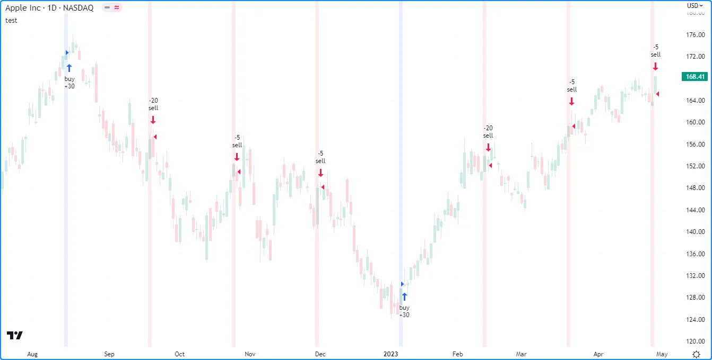

#### `strategy.order()`

Este comando simula uma ordem básica. Ao contrário da maioria dos comandos de colocação de ordens, que contêm lógica interna para simplificar a interface com as estratégias, [strategy.order()](https://br.tradingview.com/pine-script-reference/v5/#fun_strategy%7Bdot%7Dorder) usa os parâmetros especificados sem levar em conta a maioria das configurações adicionais da estratégia. As ordens colocadas por [strategy.order()](https://br.tradingview.com/pine-script-reference/v5/#fun_strategy%7Bdot%7Dorder) podem abrir novas posições e modificar ou fechar as existentes.

O script a seguir usa apenas chamadas [strategy.order()](https://br.tradingview.com/pine-script-reference/v5/#fun_strategy%7Bdot%7Dorder) para criar e modificar entradas. A estratégia simula uma ordem de mercado _long_ para 15 unidades a cada 100 barras, e depois três ordens curtas para cinco unidades a cada 25 barras. O script destaca o fundo em azul e vermelho para indicar quando a estratégia simula ordens de "compra" e "venda":

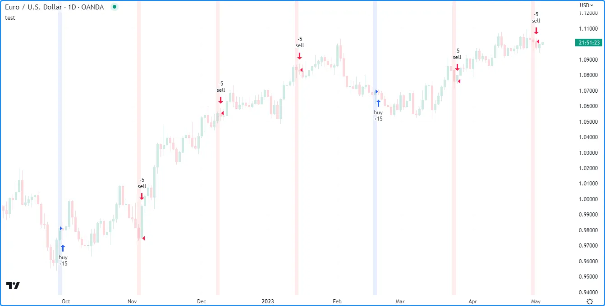

```c
//@version=5
strategy("Order demo", "test", overlay = true)

//@variable Is `true` on every 100th bar.
buyCond = bar_index % 100 == 0
//@variable Is `true` on every 25th bar except for those that are divisible by 100.
sellCond = bar_index % 25 == 0 and not buyCond

if buyCond
    strategy.order("buy", strategy.long, qty = 15) // Enter a long position of 15 units.
if sellCond
    strategy.order("sell", strategy.short, qty = 5) // Exit 5 units from the long position.

bgcolor(buyCond ? color.new(color.blue, 90) : na)
bgcolor(sellCond ? color.new(color.red, 90) : na)
```

Essa estratégia em particular nunca simulará uma posição _short_, pois, ao contrário de [strategy.entry()](https://br.tradingview.com/pine-script-reference/v5/#fun_strategy%7Bdot%7Dentry), [strategy.order()](https://br.tradingview.com/pine-script-reference/v5/#fun_strategy%7Bdot%7Dorder) não reverte automaticamente as posições. Ao usar este comando, a posição de mercado resultante é a soma líquida da posição de mercado atual e da quantidade de ordens preenchidas. Após a estratégia preencher a ordem de "compra" para 15 unidades, ela executa três ordens de "venda" que reduzem a posição aberta em cinco unidades cada, e 15 - 5 * 3 = 0. O mesmo script se comportaria de maneira diferente usando [strategy.entry()](https://br.tradingview.com/pine-script-reference/v5/#fun_strategy%7Bdot%7Dentry), conforme o exemplo mostrado na [seção acima](./05_18_estrategias.md#strategyentry).

#### `strategy.exit()`

Este comando simula ordens de saída. É único no sentido de que permite que uma estratégia saia de uma posição de mercado ou forme múltiplas saídas na forma de ordens de stop-loss, take-profit e trailing stop via os parâmetros `loss`, `stop`, `profit`, `limit` e `trail_*`.

O uso mais básico do comando [strategy.exit()](https://br.tradingview.com/pine-script-reference/v5/#fun_strategy%7Bdot%7Dexit) é a criação de níveis onde a estratégia sairá de uma posição devido a uma perda excessiva de dinheiro (stop-loss), ganho suficiente de dinheiro (take-profit) ou ambos (bracket).

As funcionalidades de stop-loss e take-profit deste comando estão associadas a dois parâmetros. Os parâmetros `loss` e `profit` da função especificam valores de stop-loss e take-profit como um número definido de ticks longe do preço da ordem de entrada, enquanto seus parâmetros `stop` e `limit` fornecem valores específicos de preço de stop-loss e take-profit. Os parâmetros absolutos na chamada da função substituem os relativos. Se uma chamada [strategy.exit()](https://br.tradingview.com/pine-script-reference/v5/#fun_strategy%7Bdot%7Dexit) contiver argumentos `profit` e `limit`, o comando priorizará o valor `limit` e ignorará o valor `profit`. Da mesma forma, só considerará o valor `stop` quando a chamada da função contiver argumentos `stop` e `loss`.

> __Observação!__\
> Embora compartilhem os mesmos nomes com parâmetros dos comandos [strategy.entry()](https://br.tradingview.com/pine-script-reference/v5/#fun_strategy%7Bdot%7Dentry) e [strategy.order()](https://br.tradingview.com/pine-script-reference/v5/#fun_strategy%7Bdot%7Dorder), os parâmetros `limit` e `stop` funcionam de maneira diferente em [strategy.exit()](https://br.tradingview.com/pine-script-reference/v5/#fun_strategy%7Bdot%7Dexit). No primeiro caso, usar `limit` e `stop` no comando criará uma única ordem stop-limit que abre uma ordem limite após cruzar o preço de stop. No segundo caso, o comando criará uma ordem limite e uma ordem de stop separadas para sair de uma posição aberta.

Todas as ordens de saída de [strategy.exit()](https://br.tradingview.com/pine-script-reference/v5/#fun_strategy%7Bdot%7Dexit) com um argumento `from_entry` estão vinculadas ao `id` de uma ordem de entrada correspondente; estratégias não podem simular ordens de saída quando não há posição de mercado aberta ou ordem de entrada ativa associada a um ID `from_entry`.

A estratégia a seguir coloca uma ordem de entrada de "compra" via [strategy.entry()](https://br.tradingview.com/pine-script-reference/v5/#fun_strategy%7Bdot%7Dentry) e uma ordem de stop-loss e take-profit via o comando [strategy.exit()](https://br.tradingview.com/pine-script-reference/v5/#fun_strategy%7Bdot%7Dexit) a cada 100 barras. Observe que o script chama [strategy.exit()](https://br.tradingview.com/pine-script-reference/v5/#fun_strategy%7Bdot%7Dexit) duas vezes. O comando "exit1" faz referência a uma ordem de entrada "buy1", e "exit2" faz referência à ordem "buy". A estratégia só simulará ordens de saída de "exit2" porque "exit1" faz referência a um ID de ordem que não existe:

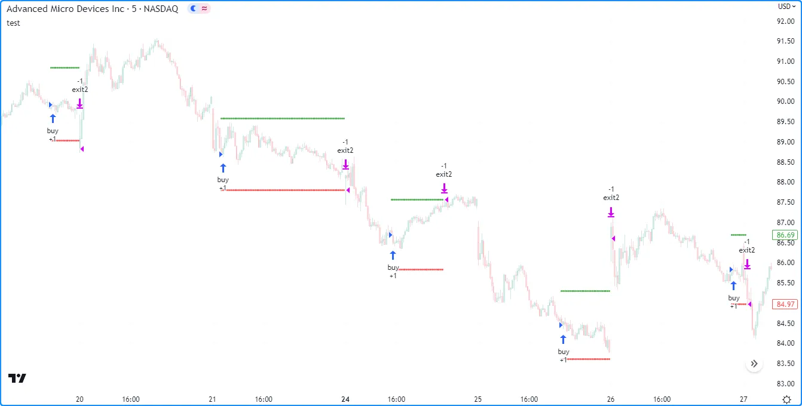

```c
//@version=5
strategy("Exit demo", "test", overlay = true)

//@variable Is `true` on every 100th bar.
buyCondition = bar_index % 100 == 0

//@variable Stop-loss price for exit commands.
var float stopLoss   = na
//@variable Take-profit price for exit commands.
var float takeProfit = na

// Place orders upon `buyCondition`.
if buyCondition
    if strategy.position_size == 0.0
        stopLoss   := close * 0.99
        takeProfit := close * 1.01
    strategy.entry("buy", strategy.long)
    strategy.exit("exit1", "buy1", stop = stopLoss, limit = takeProfit) // Does nothing. "buy1" order doesn't exist.
    strategy.exit("exit2", "buy", stop = stopLoss, limit = takeProfit)

// Set `stopLoss` and `takeProfit` to `na` when price touches either, i.e., when the strategy simulates an exit.
if low <= stopLoss or high >= takeProfit
    stopLoss   := na
    takeProfit := na

plot(stopLoss, "SL", color.red, style = plot.style_circles)
plot(takeProfit, "TP", color.green, style = plot.style_circles)
```

__Note que:__

- Ordens de limite e stop de cada comando de saída não necessariamente preenchem nos preços especificados. Estratégias podem preencher ordens limite a preços melhores e ordens de stop a preços piores, dependendo da gama de valores disponíveis para o emulador do broker.

Se um usuário não fornecer um argumento `from_entry` na chamada [strategy.exit()](https://br.tradingview.com/pine-script-reference/v5/#fun_strategy%7Bdot%7Dexit), a função criará ordens de saída para cada entrada aberta.

Neste exemplo, a estratégia cria ordens de entrada "buy1" e "buy2" e chama [strategy.exit()](https://br.tradingview.com/pine-script-reference/v5/#fun_strategy%7Bdot%7Dexit) sem um argumento `from_entry` a cada 100 barras. Como pode ser visto pelas marcas de ordem no gráfico, uma vez que o preço de mercado atinge os valores `stopLoss` ou `takeProfit`, a estratégia preenche uma ordem de saída para as entradas "buy1" e "buy2":

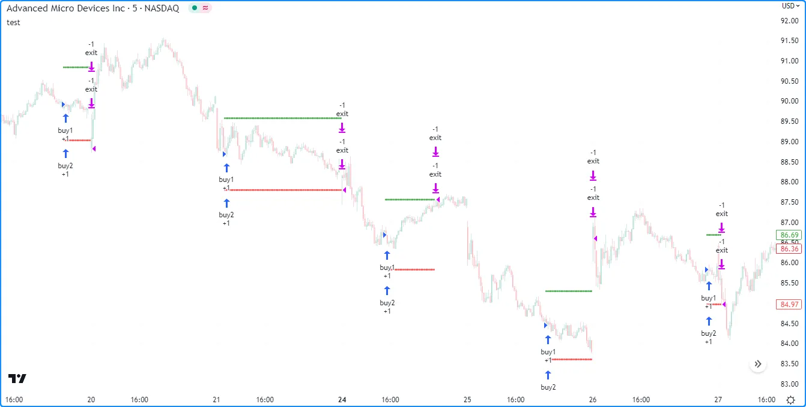

```c
//@version=5
strategy("Exit all demo", "test", overlay = true, pyramiding = 2)

//@variable Is `true` on every 100th bar.
buyCondition = bar_index % 100 == 0

//@variable Stop-loss price for exit commands.
var float stopLoss   = na
//@variable Take-profit price for exit commands.
var float takeProfit = na

// Place orders upon `buyCondition`.
if buyCondition
    if strategy.position_size == 0.0
        stopLoss   := close * 0.99
        takeProfit := close * 1.01
    strategy.entry("buy1", strategy.long)
    strategy.entry("buy2", strategy.long)
    strategy.exit("exit", stop = stopLoss, limit = takeProfit) // Places orders to exit all open entries.

// Set `stopLoss` and `takeProfit` to `na` when price touches either, i.e., when the strategy simulates an exit.
if low <= stopLoss or high >= takeProfit
    stopLoss   := na
    takeProfit := na

plot(stopLoss, "SL", color.red, style = plot.style_circles)
plot(takeProfit, "TP", color.green, style = plot.style_circles)
```

É possível que uma estratégia saia do mesmo ID de entrada mais de uma vez, o que facilita a formação de estratégias de saída em múltiplos níveis. Ao realizar múltiplos comandos de saída, a quantidade de cada ordem deve ser uma porção da quantidade negociada, com a soma não excedendo a posição aberta. Se a `qty` da função for menor que o tamanho da posição de mercado atual, a estratégia simulará uma saída parcial. Se o valor de `qty` exceder a quantidade da posição aberta, ele reduzirá a ordem, pois não pode preencher mais _contratos/ações/lotes/unidades_ (_contracts/shares/lots/units_) do que a posição aberta.

No exemplo abaixo, foi alterado o script anterior "Exit demo" para simular duas ordens de stop-loss e take-profit por entrada. A estratégia coloca uma ordem de "compra" com uma `qty` de duas ações, ordens de stop-loss e take-profit "exit1" com uma `qty` de uma ação, e ordens de stop-loss e take-profit "exit2" com uma `qty` de três ações:

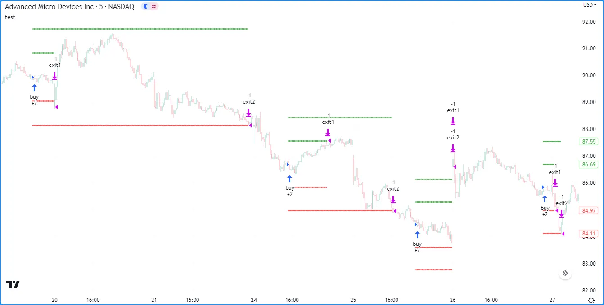

```c
//@version=5
strategy("Multiple exit demo", "test", overlay = true)

//@variable Is `true` on every 100th bar.
buyCondition = bar_index % 100 == 0

//@variable Stop-loss price for "exit1" commands.
var float stopLoss1 = na
//@variable Stop-loss price for "exit2" commands.
var float stopLoss2 = na
//@variable Take-profit price for "exit1" commands.
var float takeProfit1 = na
//@variable Take-profit price for "exit2" commands.
var float takeProfit2 = na

// Place orders upon `buyCondition`.
if buyCondition
    if strategy.position_size == 0.0
        stopLoss1   := close * 0.99
        stopLoss2   := close * 0.98
        takeProfit1 := close * 1.01
        takeProfit2 := close * 1.02
    strategy.entry("buy", strategy.long, qty = 2)
    strategy.exit("exit1", "buy", stop = stopLoss1, limit = takeProfit1, qty = 1)
    strategy.exit("exit2", "buy", stop = stopLoss2, limit = takeProfit2, qty = 3)

// Set `stopLoss1` and `takeProfit1` to `na` when price touches either.
if low <= stopLoss1 or high >= takeProfit1
    stopLoss1   := na
    takeProfit1 := na
// Set `stopLoss2` and `takeProfit2` to `na` when price touches either.
if low <= stopLoss2 or high >= takeProfit2
    stopLoss2   := na
    takeProfit2 := na

plot(stopLoss1, "SL1", color.red, style = plot.style_circles)
plot(stopLoss2, "SL2", color.red, style = plot.style_circles)
plot(takeProfit1, "TP1", color.green, style = plot.style_circles)
plot(takeProfit2, "TP2", color.green, style = plot.style_circles)
```

Como pode se ver pelas marcas de ordem no gráfico, a estratégia preencheu as ordens "exit2" apesar do valor `qty` especificado exceder a quantidade negociada. Em vez de usar essa quantidade, o script reduziu o tamanho das ordens para corresponder à posição restante.

__Note que:__

- Todas as ordens geradas a partir de uma chamada [strategy.exit()](https://br.tradingview.com/pine-script-reference/v5/#fun_strategy%7Bdot%7Dexit) pertencem ao mesmo grupo [strategy.oca.reduce](./05_18_estrategias.md#strategyocareduce), o que significa que, quando qualquer ordem é preenchida, a estratégia reduz todas as outras para corresponder à posição aberta.

É importante notar que as ordens produzidas por este comando reservam uma porção da posição de mercado aberta para saída. [strategy.exit()](https://br.tradingview.com/pine-script-reference/v5/#fun_strategy%7Bdot%7Dexit) não pode colocar uma ordem para sair de uma parte da posição já reservada para saída por outro comando de saída.

O script a seguir simula uma ordem de mercado "compra" para 20 ações há 100 barras com ordens "limit" e "stop" de 19 e 20 ações, respectivamente. No gráfico, a estratégia executou a ordem "stop" primeiro. No entanto, a quantidade negociada foi de apenas uma ação. Como o script colocou a ordem "limit" primeiro, a estratégia reservou sua `qty` (19 ações) para fechar a posição aberta, deixando apenas uma ação para ser fechada pela ordem "stop":

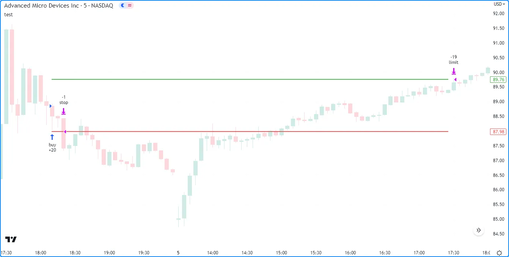

```c
//@version=5
strategy("Reserved exit demo", "test", overlay = true)

//@variable "stop" exit order price.
var float stop   = na
//@variable "limit" exit order price
var float limit  = na
//@variable Is `true` 100 bars before the `last_bar_index`.
longCondition = last_bar_index - bar_index == 100 

if longCondition
    stop  := close * 0.99
    limit := close * 1.01 
    strategy.entry("buy", strategy.long, 20)
    strategy.exit("limit", limit = limit,  qty = 19)
    strategy.exit("stop", stop = stop, qty = 20)

bool showPlot = strategy.position_size != 0
plot(showPlot ? stop : na, "Stop", color.red, 2, plot.style_linebr)
plot(showPlot ? limit : na, "Limit 1", color.green, 2, plot.style_linebr)
```

Outra característica chave da função [strategy.exit()](https://br.tradingview.com/pine-script-reference/v5/#fun_strategy%7Bdot%7Dexit) é que ela pode criar _trailing stops_, ou seja, ordens de stop-loss que acompanham o preço de mercado por uma quantidade especificada sempre que o preço se move para um valor melhor na direção favorável. Essas ordens têm dois componentes: o nível de ativação e o _trail offset_;
- O nível de ativação é o valor que o preço de mercado deve cruzar para ativar o cálculo do trailing stop, expresso em ticks via o parâmetro `trail_points` ou como um valor de preço via o parâmetro `trail_price`. Se uma chamada de saída contiver ambos os argumentos, o argumento `trail_price` terá precedência.
- O _trail offset_ é a distância que o stop seguirá atrás do preço de mercado, expresso em ticks via o parâmetro `trail_offset`.

Para [strategy.exit()](https://br.tradingview.com/pine-script-reference/v5/#fun_strategy%7Bdot%7Dexit) criar e ativar trailing stops, a chamada da função deve conter os argumentos `trail_offset` e `trail_price` ou `trail_points`.

O exemplo abaixo mostra um trailing stop em ação e visualiza seu comportamento. A estratégia simula uma ordem de entrada longa na barra 100 barras antes da última barra no gráfico e, em seguida, um trailing stop na próxima barra. O script tem duas entradas: uma controla o _trail offset_ de nível de ativação (ou seja, a quantidade além do preço de entrada necessária para ativar o stop), e a outra controla o _trail offset_ (ou seja, a distância a seguir atrás do preço de mercado quando ele se move para um valor melhor na direção desejada).

A linha tracejada verde no gráfico mostra o nível que o preço de mercado deve cruzar para acionar a ordem de trailing stop. Após o preço cruzar esse nível, o script plota uma linha azul para significar o trailing stop. Quando o preço sobe para um novo valor máximo, o que é favorável para a estratégia, pois significa que o valor da posição está aumentando, o stop também sobe para manter uma distância de `trailingStopOffset` ticks atrás do preço atual. Quando o preço diminui ou não atinge um novo ponto alto, o valor do stop permanece o mesmo. Eventualmente, o preço cruza abaixo do stop, acionando a saída:

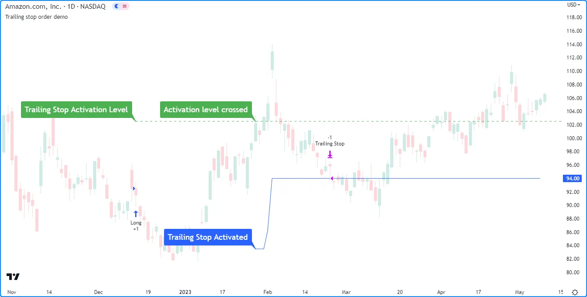

```c
//@version=5
strategy("Trailing stop order demo", overlay = true, margin_long = 100, margin_short = 100)

//@variable Offset used to determine how far above the entry price (in ticks) the activation level will be located. 
activationLevelOffset = input(1000, "Activation Level Offset (in ticks)")
//@variable Offset used to determine how far below the high price (in ticks) the trailing stop will trail the chart.
trailingStopOffset = input(2000, "Trailing Stop Offset (in ticks)")

//@function Displays text passed to `txt` when called and shows the `price` level on the chart.
debugLabel(price, txt, lblColor, hasLine = false) =>
    label.new(
         bar_index, price, text = txt, color = lblColor, textcolor = color.white,
         style = label.style_label_lower_right, size = size.large
     )
    if hasLine
        line.new(
             bar_index, price, bar_index + 1, price, color = lblColor, extend = extend.right,
             style = line.style_dashed
         )

//@variable The price at which the trailing stop activation level is located.
var float trailPriceActivationLevel = na
//@variable The price at which the trailing stop itself is located.
var float trailingStop = na
//@variable Caclulates the value that Trailing Stop would have if it were active at the moment.
theoreticalStopPrice = high - trailingStopOffset * syminfo.mintick

// Generate a long market order to enter 100 bars before the last bar.
if last_bar_index - bar_index == 100
    strategy.entry("Long", strategy.long)

// Generate a trailing stop 99 bars before the last bar.
if last_bar_index - bar_index == 99
    trailPriceActivationLevel := open + syminfo.mintick * activationLevelOffset
    strategy.exit(
         "Trailing Stop", from_entry = "Long", trail_price = trailPriceActivationLevel, 
         trail_offset = trailingStopOffset
     )
    debugLabel(trailPriceActivationLevel, "Trailing Stop Activation Level", color.green, true)

// Visualize the trailing stop mechanic in action.
// If there is an open trade, check whether the Activation Level has been achieved.
// If it has been achieved, track the trailing stop by assigning its value to a variable.
if strategy.opentrades == 1
    if na(trailingStop) and high > trailPriceActivationLevel
        debugLabel(trailPriceActivationLevel, "Activation level crossed", color.green)
        trailingStop := theoreticalStopPrice
        debugLabel(trailingStop, "Trailing Stop Activated", color.blue)

    else if theoreticalStopPrice > trailingStop
        trailingStop := theoreticalStopPrice

// Visualize the movement of the trailing stop.
plot(trailingStop, "Trailing Stop")
```

#### `strategy.close()` e `strategy.close_all()`

Esses comandos simulam posições de saída usando ordens de mercado. As funções fecham negociações ao serem chamadas, em vez de em um preço específico.

O exemplo abaixo demonstra uma estratégia simples que coloca uma ordem de "compra" via [strategy.entry()](https://br.tradingview.com/pine-script-reference/v5/#fun_strategy%7Bdot%7Dentry) a cada 50 barras e a fecha com uma ordem de mercado usando [strategy.close()](https://br.tradingview.com/pine-script-reference/v5/#fun_strategy%7Bdot%7Dclose) 25 barras depois:

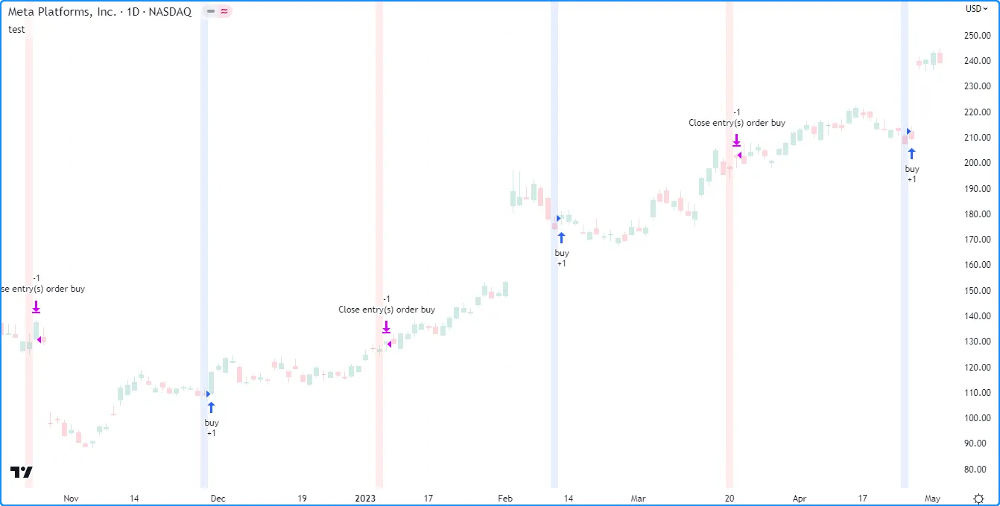

```c
//@version=5
strategy("Close demo", "test", overlay = true)

//@variable Is `true` on every 50th bar.
buyCond = bar_index % 50 == 0
//@variable Is `true` on every 25th bar except for those that are divisible by 50.
sellCond = bar_index % 25 == 0 and not buyCond

if buyCond
    strategy.entry("buy", strategy.long)
if sellCond
    strategy.close("buy")

bgcolor(buyCond ? color.new(color.blue, 90) : na)
bgcolor(sellCond ? color.new(color.red, 90) : na)
```

Ao contrário da maioria dos outros comandos de colocação de ordens, o parâmetro `id` de [strategy.close()](https://br.tradingview.com/pine-script-reference/v5/#fun_strategy%7Bdot%7Dclose) faz referência a um ID de entrada existente para fechar. Se o `id` especificado não existir, o comando não executará uma ordem. Se uma posição foi formada a partir de várias entradas com o mesmo ID, o comando fechará todas as entradas simultaneamente.

Para demonstrar, o script a seguir coloca uma ordem de "compra" a cada 25 barras. O script fecha todas as entradas "buy" a cada 100 barras. Incluído `pyramiding = 3` na declaração da [strategy()](https://br.tradingview.com/pine-script-reference/v5/#fun_strategy) para permitir que a estratégia simule até três ordens na mesma direção:

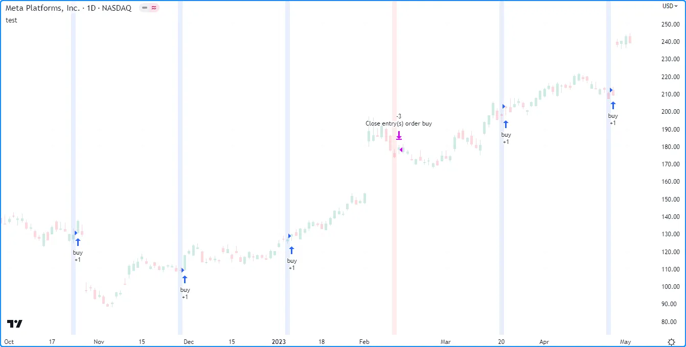

```c
//@version=5
strategy("Multiple close demo", "test", overlay = true, pyramiding = 3)

//@variable Is `true` on every 100th bar.
sellCond = bar_index % 100 == 0
//@variable Is `true` on every 25th bar except for those that are divisible by 100.
buyCond = bar_index % 25 == 0 and not sellCond

if buyCond
    strategy.entry("buy", strategy.long)
if sellCond
    strategy.close("buy")

bgcolor(buyCond ? color.new(color.blue, 90) : na)
bgcolor(sellCond ? color.new(color.red, 90) : na)
```

Para casos em que um script tem várias entradas com IDs diferentes, o comando [strategy.close_all()](https://br.tradingview.com/pine-script-reference/v5/#fun_strategy%7Bdot%7Dclose_all) pode ser útil, pois fecha todas as entradas, independentemente de seus IDs.

O script abaixo coloca ordens de entrada "A", "B" e "C" sequencialmente com base no número de negociações abertas, depois fecha todas com uma única ordem de mercado:

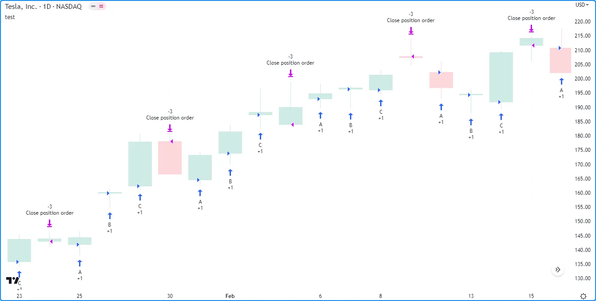

```c
//@version=5
strategy("Close multiple ID demo", "test", overlay = true, pyramiding = 3)

switch strategy.opentrades
    0 => strategy.entry("A", strategy.long)
    1 => strategy.entry("B", strategy.long)
    2 => strategy.entry("C", strategy.long)
    3 => strategy.close_all()
```

#### `strategy.cancel()` e `strategy.cancel_all()`

Esses comandos permitem que uma estratégia cancele ordens pendentes, ou seja, aquelas geradas por [strategy.exit()](https://br.tradingview.com/pine-script-reference/v5/#fun_strategy%7Bdot%7Dexit) ou por [strategy.order()](https://br.tradingview.com/pine-script-reference/v5/#fun_strategy%7Bdot%7Dorder) ou [strategy.entry()](https://br.tradingview.com/pine-script-reference/v5/#fun_strategy%7Bdot%7Dentry) quando usam argumentos `limit` ou `stop`.

A estratégia a seguir simula uma ordem de limite de "compra" 500 ticks abaixo do preço de fechamento de 100 barras atrás, depois cancela a ordem na barra seguinte. O script desenha uma linha horizontal no `limitPrice` e colore o fundo de verde e laranja para indicar quando a ordem de limite é colocada e cancelada, respectivamente. Nada aconteceu quando o preço de mercado cruzou o `limitPrice` porque a estratégia já havia cancelado a ordem:

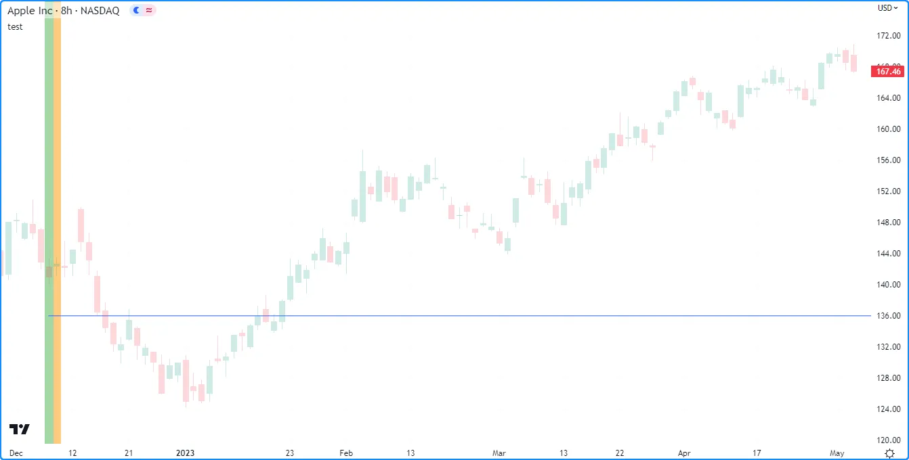

```c
//@version=5
strategy("Cancel demo", "test", overlay = true)

//@variable Draws a horizontal line at the `limit` price of the "buy" order.
var line limitLine = na

//@variable Returns `color.green` when the strategy places the "buy" order, `color.orange` when it cancels the order.
color bgColor = na

if last_bar_index - bar_index == 100
    float limitPrice = close - syminfo.mintick * 500
    strategy.entry("buy", strategy.long, limit = limitPrice)
    limitLine := line.new(bar_index, limitPrice, bar_index + 1, limitPrice, extend = extend.right)
    bgColor := color.new(color.green, 50)

if last_bar_index - bar_index == 99
    strategy.cancel("buy")
    bgColor := color.new(color.orange, 50)

bgcolor(bgColor)
```

Assim como [strategy.close()](https://br.tradingview.com/pine-script-reference/v5/#fun_strategy%7Bdot%7Dclose), o parâmetro `id` de [strategy.cancel()](https://br.tradingview.com/pine-script-reference/v5/#fun_strategy%7Bdot%7Dcancel) refere-se ao ID de uma entrada existente. Este comando não fará nada se o parâmetro `id` referenciar um ID que não exista. Quando houver várias ordens pendentes com o mesmo ID, este comando cancelará todas de uma vez.

Neste exemplo, foi modificado o script anterior para colocar uma ordem de limite de "compra" em três barras consecutivas a partir de 100 barras atrás. A estratégia cancela todas elas depois que o `bar_index` está a 97 barras da barra mais recente, resultando em nada acontecer quando o preço cruza qualquer uma das linhas:

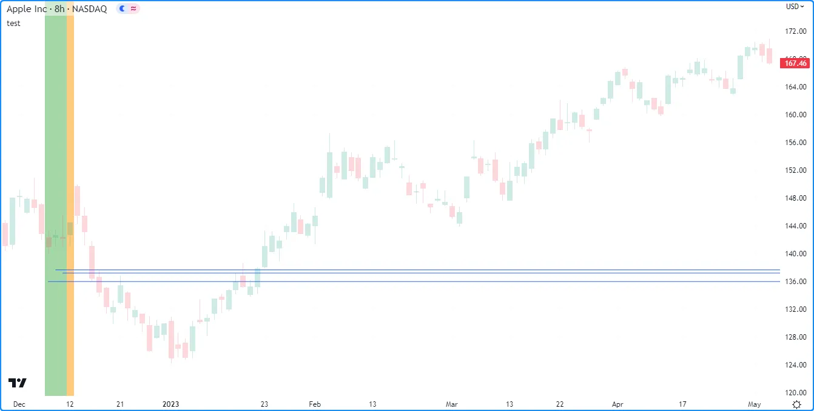

```c
//@version=5
strategy("Multiple cancel demo", "test", overlay = true, pyramiding = 3)

//@variable Draws a horizontal line at the `limit` price of the "buy" order.
var line limitLine = na

//@variable Returns `color.green` when the strategy places the "buy" order, `color.orange` when it cancels the order.
color bgColor = na

if last_bar_index - bar_index <= 100 and last_bar_index - bar_index >= 98
    float limitPrice = close - syminfo.mintick * 500
    strategy.entry("buy", strategy.long, limit = limitPrice)
    limitLine := line.new(bar_index, limitPrice, bar_index + 1, limitPrice, extend = extend.right)
    bgColor := color.new(color.green, 50)

if last_bar_index - bar_index == 97
    strategy.cancel("buy")
    bgColor := color.new(color.orange, 50)

bgcolor(bgColor)
```

__Note que:__

- Foi adicionado `pyramiding = 3` à declaração do script para permitir que três ordens [strategy.entry()](https://br.tradingview.com/pine-script-reference/v5/#fun_strategy%7Bdot%7Dentry) sejam preenchidas. Alternativamente, o script obteria o mesmo resultado usando [strategy.order()](https://br.tradingview.com/pine-script-reference/v5/#fun_strategy%7Bdot%7Dorder) já que não é sensível à configuração `pyramiding`.

É importante notar que nem [strategy.cancel()](https://br.tradingview.com/pine-script-reference/v5/#fun_strategy%7Bdot%7Dcancel) nem [strategy.cancel_all()](https://br.tradingview.com/pine-script-reference/v5/#fun_strategy%7Bdot%7Dcancel_all) podem cancelar ordens de _mercado_, pois a estratégia as executa imediatamente no próximo tick. Estratégias não podem cancelar ordens depois de preenchidas. Para fechar uma posição aberta, use [strategy.close()](https://br.tradingview.com/pine-script-reference/v5/#fun_strategy%7Bdot%7Dclose) ou [strategy.close_all()](https://br.tradingview.com/pine-script-reference/v5/#fun_strategy%7Bdot%7Dclose_all).

Este exemplo simula uma ordem de mercado "compra" 100 barras atrás, depois tenta cancelar todas as ordens pendentes na barra seguinte. Como a estratégia já preencheu a ordem de "compra", o comando [strategy.cancel_all()](https://br.tradingview.com/pine-script-reference/v5/#fun_strategy%7Bdot%7Dcancel_all) não faz nada neste caso, pois não há ordens pendentes para cancelar:

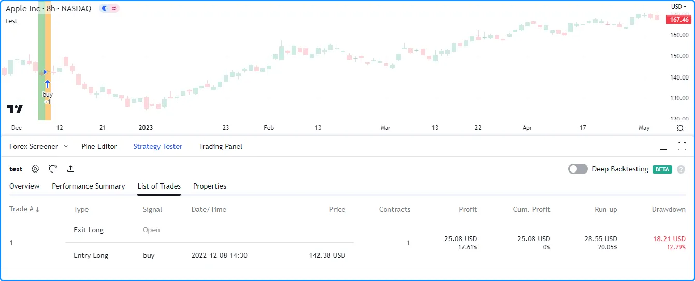

```c
//@version=5
strategy("Cancel market demo", "test", overlay = true)

//@variable Returns `color.green` when the strategy places the "buy" order, `color.orange` when it tries to cancel.
color bgColor = na

if last_bar_index - bar_index == 100
    strategy.entry("buy", strategy.long)
    bgColor := color.new(color.green, 50)

if last_bar_index - bar_index == 99
    strategy.cancel_all()
    bgColor := color.new(color.orange, 50)

bgcolor(bgColor)
```

### Dimensionamento de Posições

As estratégias do Pine Script apresentam duas maneiras de controlar o tamanho das negociações simuladas:

- Definir um tipo e valor de quantidade fixa padrão para todas as ordens usando os argumentos `default_qty_type` e `default_qty_value` na função [strategy()](https://br.tradingview.com/pine-script-reference/v5/#fun_strategy), que também define os valores padrão na aba "_Propriedades_" "_Properties_" das configurações do script.
- Especificar o argumento `qty` ao chamar [strategy.entry()](https://br.tradingview.com/pine-script-reference/v5/#fun_strategy%7Bdot%7Dentry). Quando um usuário fornece esse argumento para a função, o script ignora o valor e tipo de quantidade padrão da estratégia.

O exemplo a seguir simula ordens de "Compra" de tamanho `longAmount` sempre que o preço `low` for igual ao valor `lowest`, e ordens de "Venda" de tamanho `shortAmount` quando o preço `high` for igual ao valor `highest`:

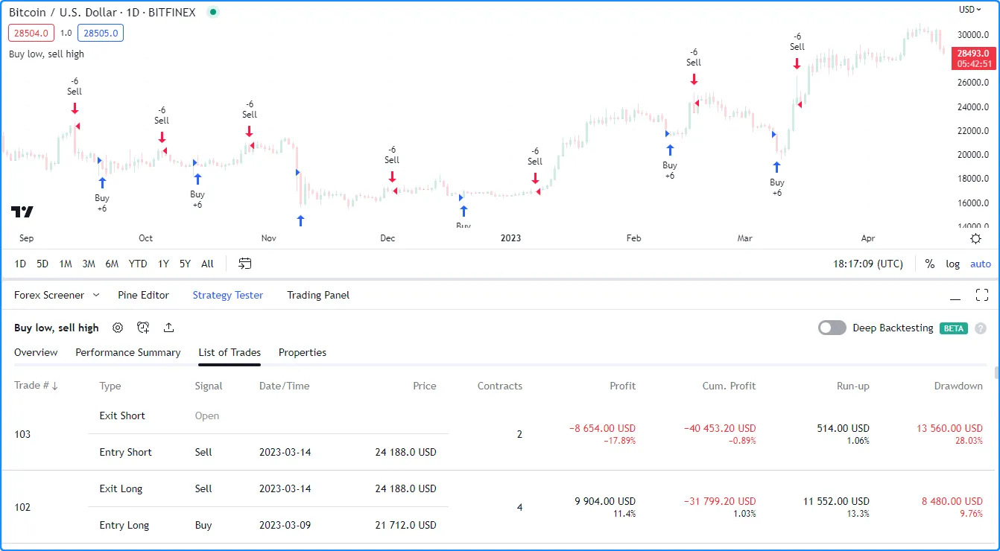

```c
//@version=5
strategy("Buy low, sell high", overlay = true, default_qty_type = strategy.cash, default_qty_value = 5000)

int   length      = input.int(20, "Length")
float longAmount  = input.float(4.0, "Long Amount")
float shortAmount = input.float(2.0, "Short Amount")

float highest = ta.highest(length)
float lowest  = ta.lowest(length)

switch
    low == lowest   => strategy.entry("Buy", strategy.long, longAmount)
    high == highest => strategy.entry("Sell", strategy.short, shortAmount)
```

No exemplo acima, embora tenha sido especificado os argumentos `default_qty_type` e `default_qty_value` na declaração, o script não usa esses valores padrão para as ordens simuladas. Em vez disso, ele dimensiona as ordens como `longAmount` e `shortAmount` de unidades. Caso quieira que o script use o tipo e valor padrão, deve remover a especificação `qty` das chamadas [strategy.entry()](https://br.tradingview.com/pine-script-reference/v5/#fun_strategy%7Bdot%7Dentry):

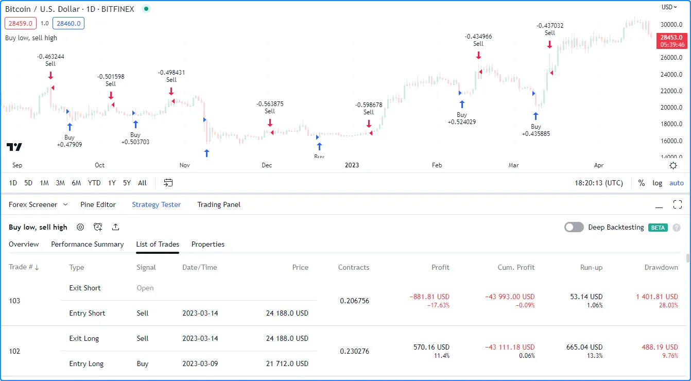

```c
//@version=5
strategy("Buy low, sell high", overlay = true, default_qty_type = strategy.cash, default_qty_value = 5000)

int length = input.int(20, "Length")

float highest = ta.highest(length)
float lowest  = ta.lowest(length)

switch
    low == lowest   => strategy.entry("Buy", strategy.long)
    high == highest => strategy.entry("Sell", strategy.short)
```

## Fechando uma Posição de Mercado

Embora seja possível simular uma saída de uma ordem de entrada específica mostrada na aba [Lista de Negociações](./05_18_estrategias.md#lista-de-negociações) do módulo [Testador de Estratégia](./05_18_estrategias.md#testador-de-estratégia), todas as ordens são vinculadas de acordo com as regras FIFO (primeiro a entrar, primeiro a sair). Se o usuário não especificar o parâmetro `from_entry` em uma chamada [strategy.exit()](https://br.tradingview.com/pine-script-reference/v5/#fun_strategy%7Bdot%7Dexit), a estratégia sairá da posição de mercado aberta começando pela primeira ordem de entrada que a abriu.

O exemplo a seguir simula duas ordens sequencialmente: "Buy1" ao preço de mercado para as últimas 100 barras e "Buy2" uma vez que o tamanho da posição corresponda ao tamanho de "Buy1". A estratégia só coloca uma ordem de saída quando o `positionSize` é de 15 unidades. O script não fornece um argumento `from_entry` para o comando [strategy.exit()](https://br.tradingview.com/pine-script-reference/v5/#fun_strategy%7Bdot%7Dexit), então a estratégia coloca ordens de saída para todas as posições abertas cada vez que chama a função, começando pela primeira. Ele plota o `positionSize` em um painel separado para referência visual:

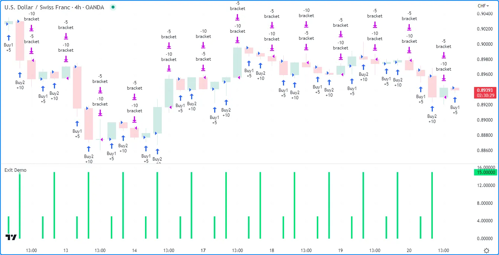

```c
//@version=5
strategy("Exit Demo", pyramiding = 2)

float positionSize = strategy.position_size

if positionSize == 0 and last_bar_index - bar_index <= 100
    strategy.entry("Buy1", strategy.long, 5)
else if positionSize == 5
    strategy.entry("Buy2", strategy.long, 10)
else if positionSize == 15
    strategy.exit("bracket", loss = 10, profit = 10)

plot(positionSize == 0 ? na : positionSize, "Position Size", color.lime, 4, plot.style_histogram)
```

__Note que:__

- É incluído `pyramiding = 2` na declaração do script para permitir que ele simule duas ordens consecutivas na mesma direção.

Suponha que precisasse sair de "Buy2" antes de "Buy1". Veja o que acontece se instruir a estratégia para fechar "Buy2" antes de "Buy1" quando ambas as ordens forem preenchidas:

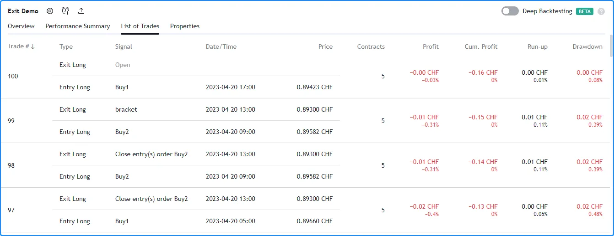

```c
//@version=5
strategy("Exit Demo", pyramiding = 2)

float positionSize = strategy.position_size

if positionSize == 0 and last_bar_index - bar_index <= 100
    strategy.entry("Buy1", strategy.long, 5)
else if positionSize == 5
    strategy.entry("Buy2", strategy.long, 10)
else if positionSize == 15
    strategy.close("Buy2")
    strategy.exit("bracket", "Buy1", loss = 10, profit = 10)

plot(positionSize == 0 ? na : positionSize, "Position Size", color.lime, 4, plot.style_histogram)
```

Na aba "Lista de Negociações" do _Testador de Estratégia_, em vez de fechar a posição "Buy2" com [strategy.close()](https://br.tradingview.com/pine-script-reference/v5/#fun_strategy%7Bdot%7Dclose), ela fecha a quantidade de "Buy1" primeiro, que é metade da quantidade da ordem de fechamento, depois fecha metade da posição "Buy2", pois o emulador do broker segue as regras FIFO por padrão. Os usuários podem alterar esse comportamento especificando `close_entries_rule = "ANY"` na função [strategy()](https://br.tradingview.com/pine-script-reference/v5/#fun_strategy).

<!-- ## Grupos OCA

Grupos One-Cancels-All (OCA) permitem que uma estratégia cancele total ou parcialmente outras ordens após a execução de comandos de colocação de ordens, incluindo [strategy.entry()](https://br.tradingview.com/pine-script-reference/v5/#fun_strategy%7Bdot%7Dentry) e [strategy.order()](https://br.tradingview.com/pine-script-reference/v5/#fun_strategy%7Bdot%7Dorder), com o mesmo `oca_name`, dependendo do `oca_type` que o usuário fornecer na chamada da função. -->

#### `strategy.oca.reduce`
