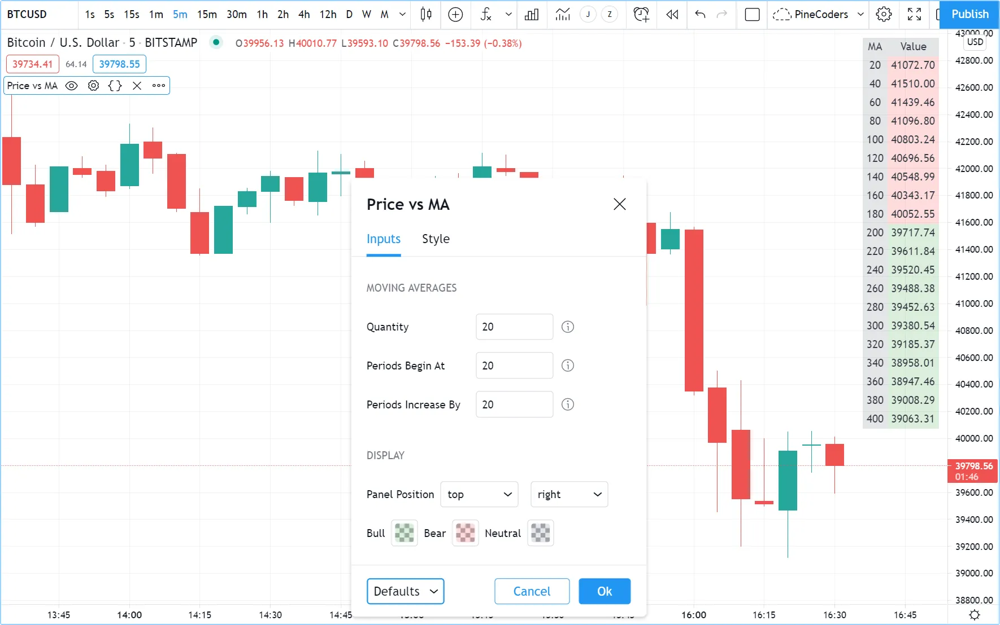
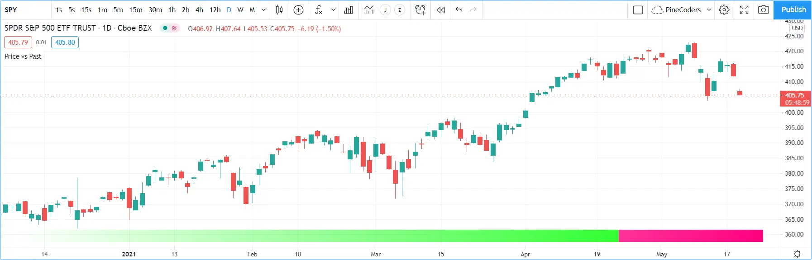

# Tables (_Tabelas_)

Tabelas são objetos que podem ser usados para posicionar informações em locais específicos e fixos no espaço visual de um script. Ao contrário de todos os outros gráficos ou objetos desenhados no Pine Script, as tabelas não estão ancoradas a barras específicas; elas _flutuam_ no espaço do script, seja no modo sobreposto ou no modo painel, em estudos ou estratégias, independentemente das barras do gráfico visualizadas ou do fator de zoom usado.

As tabelas contêm células organizadas em colunas e linhas, semelhantes a uma planilha. Elas são criadas e populadas em dois passos distintos:

1. A estrutura e os atributos principais de uma tabela são definidos usando [table.new()](https://br.tradingview.com/pine-script-reference/v5/#fun_table%7Bdot%7Dnew), que retorna um ID de tabela que atua como um ponteiro para a tabela, assim como fazem os IDs de rótulo, linha ou array. A chamada [table.new()](https://br.tradingview.com/pine-script-reference/v5/#fun_table%7Bdot%7Dnew) cria o objeto da tabela, mas não o exibe.
2. Uma vez criada, e para ser exibida, a tabela deve ser populada usando uma chamada [table.cell()](https://br.tradingview.com/pine-script-reference/v5/#fun_table%7Bdot%7Dcell) para cada célula. As células da tabela podem conter texto ou não. Este segundo passo é quando a largura e a altura das células são definidas.

A maioria dos atributos de uma tabela previamente criada pode ser alterada usando as funções `table.set_*()`. Atributos de células previamente populadas podem ser modificados usando as funções `table.cell_set_*()`.

Uma tabela é posicionada no espaço do indicador ancorando-a a uma das nove referências: os quatro cantos ou pontos médios, incluindo o centro. As tabelas são posicionadas expandindo a tabela a partir de sua âncora, então uma tabela ancorada na referência [position.middle_right](https://br.tradingview.com/pine-script-reference/v5/#const_position%7Bdot%7Dmiddle_right) será desenhada expandindo para cima, para baixo e para a esquerda a partir dessa âncora.

Existem dois modos disponíveis para determinar a largura/altura das células da tabela:

- Um modo automático padrão calcula a largura/altura das células em uma coluna/linha usando o texto mais largo/alto nelas.
- Um modo explícito permite que os programadores definam a largura/altura das células usando uma porcentagem do espaço x/y disponível no indicador.

Os conteúdos exibidos na tabela sempre representam o último estado da tabela, conforme foi desenhada na última execução do script, na última barra do conjunto de dados. Ao contrário dos valores exibidos na "Janela de Dados" "_Data Window_" ou nos valores do indicador, os conteúdos variáveis exibidos nas tabelas não mudarão conforme o usuário do script move o cursor sobre barras específicas do gráfico. Por essa razão, é altamente recomendável restringir a execução de todas as chamadas `table.*()` apenas às primeiras ou últimas barras do conjunto de dados. Assim:

- Use a palavra-chave [var](https://br.tradingview.com/pine-script-reference/v5/#kw_var) para declarar tabelas.
- Envolva todas as outras chamadas dentro de um bloco [if](https://br.tradingview.com/pine-script-reference/v5/#kw_if) [barstate.islast](https://br.tradingview.com/pine-script-reference/v5/#var_barstate%7Bdot%7Dislast).

> __Observação!__\
> Múltiplas tabelas podem ser usadas em um script, desde que cada uma seja ancorada a uma posição diferente. Cada objeto de tabela é identificado por seu próprio ID. Os limites na quantidade de células em todas as tabelas são determinados pelo número total de células usadas em um script.

## Criando Tabelas

Ao criar uma tabela usando [table.new()](https://br.tradingview.com/pine-script-reference/v5/#fun_table%7Bdot%7Dnew), três parâmetros são obrigatórios: a posição da tabela e seu número de colunas e linhas. Cinco outros parâmetros são opcionais: a cor de fundo da tabela, a cor e largura da moldura externa da tabela, e a cor e largura das bordas ao redor de todas as células, excluindo a moldura externa. Todos os atributos da tabela, exceto seu número de colunas e linhas, podem ser modificados usando funções setter: [table.set_position()](https://br.tradingview.com/pine-script-reference/v5/#fun_table%7Bdot%7Dset_position), [table.set_bgcolor()](https://br.tradingview.com/pine-script-reference/v5/#fun_table%7Bdot%7Dset_bgcolor), [table.set_frame_color()](https://br.tradingview.com/pine-script-reference/v5/#fun_table%7Bdot%7Dset_frame_color), [table.set_frame_width()](https://br.tradingview.com/pine-script-reference/v5/#fun_table%7Bdot%7Dset_frame_width), [table.set_border_color()](https://br.tradingview.com/pine-script-reference/v5/#fun_table%7Bdot%7Dset_border_color) e [table.set_border_width()](https://br.tradingview.com/pine-script-reference/v5/#fun_table%7Bdot%7Dset_border_width).

As tabelas podem ser deletadas usando [table.delete()](https://br.tradingview.com/pine-script-reference/v5/#fun_table%7Bdot%7Ddelete), e seu conteúdo pode ser removido seletivamente usando [table.clear()](https://br.tradingview.com/pine-script-reference/v5/#fun_table%7Bdot%7Dclear).

Ao popularem células usando [table.cell()](https://br.tradingview.com/pine-script-reference/v5/#fun_table%7Bdot%7Dcell), é necessário fornecer um argumento para quatro parâmetros obrigatórios: o ID da tabela à qual a célula pertence, seu índice de coluna e linha usando índices que começam em zero, e a string de texto que a célula contém, que pode ser nula. Sete outros parâmetros são opcionais: a largura e altura da célula, os atributos do texto (cor, alinhamento horizontal e vertical, tamanho), e a cor de fundo da célula. Todos os atributos da célula podem ser modificados usando funções setter: [table.cell_set_text()](https://br.tradingview.com/pine-script-reference/v5/#fun_table%7Bdot%7Dcell_set_text), [table.cell_set_width()](https://br.tradingview.com/pine-script-reference/v5/#fun_table%7Bdot%7Dcell_set_width), [table.cell_set_height()](https://br.tradingview.com/pine-script-reference/v5/#fun_table%7Bdot%7Dcell_set_height), [table.cell_set_text_color()](https://br.tradingview.com/pine-script-reference/v5/#fun_table%7Bdot%7Dcell_set_text_color), [table.cell_set_text_halign()](https://br.tradingview.com/pine-script-reference/v5/#fun_table%7Bdot%7Dcell_set_text_halign), [table.cell_set_text_valign()](https://br.tradingview.com/pine-script-reference/v5/#fun_table%7Bdot%7Dcell_set_text_valign), [table.cell_set_text_size()](https://br.tradingview.com/pine-script-reference/v5/#fun_table%7Bdot%7Dcell_set_text_size) e [table.cell_set_bgcolor()](https://br.tradingview.com/pine-script-reference/v5/#fun_table%7Bdot%7Dcell_set_bgcolor).

Lembre-se de que cada chamada sucessiva a [table.cell()](https://br.tradingview.com/pine-script-reference/v5/#fun_table%7Bdot%7Dcell) redefine __todas__ as propriedades da célula, excluindo quaisquer propriedades definidas por chamadas anteriores a [table.cell()](https://br.tradingview.com/pine-script-reference/v5/#fun_table%7Bdot%7Dcell) na mesma célula.

### Colocando um Valor Único em uma Posição Fixa

O exemplo abaixo, colocará o valor do ATR no canto superior direito do gráfico. Primeiro, cria-se uma tabela de uma célula, depois popula-se essa célula:

```c
//@version=5
indicator("ATR", "", true)
// We use `var` to only initialize the table on the first bar.
var table atrDisplay = table.new(position.top_right, 1, 1)
// We call `ta.atr()` outside the `if` block so it executes on each bar.
myAtr = ta.atr(14)
if barstate.islast
    // We only populate the table on the last bar.
    table.cell(atrDisplay, 0, 0, str.tostring(myAtr))
```


__Note que:__

- Usa-se a palavra-chave [var](https://br.tradingview.com/pine-script-reference/v5/#kw_var) ao criar a tabela com [table.new()](https://br.tradingview.com/pine-script-reference/v5/#fun_table%7Bdot%7Dnew).
- Popula-se a célula dentro de um bloco [if](https://br.tradingview.com/pine-script-reference/v5/#kw_if) [barstate.islast](https://br.tradingview.com/pine-script-reference/v5/#var_barstate%7Bdot%7Dislast) usando [table.cell()](https://br.tradingview.com/pine-script-reference/v5/#fun_table%7Bdot%7Dcell).
- Ao popular a célula, não se especifica a `largura` ou `altura`. A largura e altura da célula ajustar-se-ão automaticamente ao texto que contém.
- Invoca-se `ta.atr(14)` antes da entrada no bloco [if](https://br.tradingview.com/pine-script-reference/v5/#kw_if) para que seja avaliado em cada barra. Se fosse usado `str.tostring(ta.atr(14))` dentro do bloco [if](https://br.tradingview.com/pine-script-reference/v5/#kw_if), a função não teria sido avaliada corretamente porque seria chamada na última barra do conjunto de dados sem ter calculado os valores necessários das barras anteriores.

Segue sugestão para melhorias de usabilidade e estética do script:

```c
//@version=5
indicator("ATR", "", true)
atrPeriodInput = input.int(14,  "ATR period", minval = 1, tooltip = "Using a period of 1 yields True Range.")

var table atrDisplay = table.new(position.top_right, 1, 1, bgcolor = color.gray, frame_width = 2, frame_color = color.black)
myAtr = ta.atr(atrPeriodInput)
if barstate.islast
    table.cell(atrDisplay, 0, 0, str.tostring(myAtr, format.mintick), text_color = color.white)
```


__Note que:__

- Usou-se [table.new()](https://br.tradingview.com/pine-script-reference/v5/#fun_table%7Bdot%7Dnew) para definir uma cor de fundo, uma cor de moldura e sua largura.
- Ao popular a célula com [table.cell()](https://br.tradingview.com/pine-script-reference/v5/#fun_table%7Bdot%7Dcell), definiu-se o texto para ser exibido em branco.
- Passou-se [format.mintick](https://br.tradingview.com/pine-script-reference/v5/#const_format%7Bdot%7Dmintick) como um segundo argumento para a função [str.tostring()](https://br.tradingview.com/pine-script-reference/v5/#fun_str%7Bdot%7Dtostring) para restringir a precisão do ATR à precisão do tick do gráfico.
- Agora usa-se uma entrada para permitir que o usuário do script especifique o período do ATR. A entrada também inclui uma dica de ferramenta, que o usuário pode ver ao passar o mouse sobre o ícone "i" na aba "Configurações/Entradas" "_Settings/Inputs_" do script.

## Colorindo o Fundo do Gráfico

Este exemplo usa uma tabela de uma célula para colorir o fundo do gráfico com base no estado bull/bear do RSI:

```c
//@version=5
indicator("Chart background", "", true)
bullColorInput = input.color(color.new(color.green, 95), "Bull", inline = "1")
bearColorInput = input.color(color.new(color.red, 95), "Bear", inline = "1")
// ————— Function colors chart bg on RSI bull/bear state.
colorChartBg(bullColor, bearColor) =>
    var table bgTable = table.new(position.middle_center, 1, 1)
    float r = ta.rsi(close, 20)
    color bgColor = r > 50 ? bullColor : r < 50 ? bearColor : na
    if barstate.islast
        table.cell(bgTable, 0, 0, width = 100, height = 100, bgcolor = bgColor)

colorChartBg(bullColorInput, bearColorInput)
```

__Note que:__

- São fornecidos aos usuários inputs que permitem especificar as cores bull/bear a serem usadas para o fundo, enviando essas cores de input como argumentos para a função `colorChartBg()`.
- Uma nova tabela é criada apenas uma vez, usando a palavra-chave [var](https://br.tradingview.com/pine-script-reference/v5/#kw_var) para declarar a tabela.
- [table.cell()](https://br.tradingview.com/pine-script-reference/v5/#fun_table%7Bdot%7Dcell) é usada apenas na última barra para especificar as propriedades da célula. A célula é feita com a largura e altura do espaço do indicador, para cobrir todo o gráfico.

## Criando um Painel de Exibição

Tabelas são ideais para criar painéis de exibição sofisticados. Elas permitem que os painéis de exibição estejam sempre visíveis em uma posição constante e proporcionam formatação mais flexível, pois as propriedades de cada célula são controladas separadamente: cor de fundo, cor do texto, tamanho e alinhamento, etc.

Aqui, cria-se um painel básico de exibição mostrando uma quantidade selecionada pelo usuário de valores de MAs. Exibe-se o período na primeira coluna e o valor com um fundo verde/vermelho/cinza que varia conforme a posição do preço em relação a cada MA. Quando o preço está acima/abaixo da MA, o fundo da célula é colorido com a cor bull/bear. Quando a MA está entre a [abertura](https://br.tradingview.com/pine-script-reference/v5/#var_open) e o [fechamento](https://br.tradingview.com/pine-script-reference/v5/#var_close) da barra atual, o fundo da célula é da cor neutra:



```c
//@version=5
indicator("Price vs MA", "", true)

var string GP1 = "Moving averages"
int     masQtyInput    = input.int(20, "Quantity", minval = 1, maxval = 40, group = GP1, tooltip = "1-40")
int     masStartInput  = input.int(20, "Periods begin at", minval = 2, maxval = 200, group = GP1, tooltip = "2-200")
int     masStepInput   = input.int(20, "Periods increase by", minval = 1, maxval = 100, group = GP1, tooltip = "1-100")

var string GP2 = "Display"
string  tableYposInput = input.string("top", "Panel position", inline = "11", options = ["top", "middle", "bottom"], group = GP2)
string  tableXposInput = input.string("right", "", inline = "11", options = ["left", "center", "right"], group = GP2)
color   bullColorInput = input.color(color.new(color.green, 30), "Bull", inline = "12", group = GP2)
color   bearColorInput = input.color(color.new(color.red, 30), "Bear", inline = "12", group = GP2)
color   neutColorInput = input.color(color.new(color.gray, 30), "Neutral", inline = "12", group = GP2)

var table panel = table.new(tableYposInput + "_" + tableXposInput, 2, masQtyInput + 1)
if barstate.islast
    // Table header.
    table.cell(panel, 0, 0, "MA", bgcolor = neutColorInput)
    table.cell(panel, 1, 0, "Value", bgcolor = neutColorInput)

int period = masStartInput
for i = 1 to masQtyInput
    // ————— Call MAs on each bar.
    float ma = ta.sma(close, period)
    // ————— Only execute table code on last bar.
    if barstate.islast
        // Period in left column.
        table.cell(panel, 0, i, str.tostring(period), bgcolor = neutColorInput)
        // If MA is between the open and close, use neutral color. If close is lower/higher than MA, use bull/bear color.
        bgColor = close > ma ? open < ma ? neutColorInput : bullColorInput : open > ma ? neutColorInput : bearColorInput
        // MA value in right column.
        table.cell(panel, 1, i, str.tostring(ma, format.mintick), text_color = color.black, bgcolor = bgColor)
    period += masStepInput
```

__Note que:__

- Os usuários podem selecionar a posição da tabela a partir dos inputs, bem como as cores bull/bear/neutra a serem usadas para o fundo das células da coluna direita.
- A quantidade de linhas da tabela é determinada pelo número de MAs que o usuário escolhe exibir. Adiciona-se uma linha para os cabeçalhos das colunas.
- Mesmo que as células da tabela sejam populadas apenas na última barra, é necessário executar as chamadas para [ta.sma()](https://br.tradingview.com/pine-script-reference/v5/#fun_ta%7Bdot%7Dsma) em cada barra para produzir os resultados corretos. O aviso do compilador que aparece ao compilar o código pode ser ignorado com segurança.
- Os inputs são separados em duas seções usando `group` e os relevantes são juntados na mesma linha usando `inline`. Ferramentas de dicas são fornecidas para documentar os limites de certos campos usando `tooltip`.

## Exibindo um Heatmap

O próximo projeto é um heatmap, que indicará a relação bull/bear do preço atual em relação aos seus valores passados. Para isso, será usada uma tabela posicionada na parte inferior do gráfico. Apenas cores serão exibidas, portanto, nossa tabela não conterá texto; simplesmente será colorido o fundo de suas células para produzir o heatmap. O heatmap usa um período de lookback selecionável pelo usuário. Ele percorre esse período para determinar se o preço está acima/abaixo de cada barra no passado, exibindo uma intensidade progressivamente mais clara da cor bull/bear à medida que avançamos no passado:



```c
//@version=5
indicator("Price vs Past", "", true)

var int MAX_LOOKBACK = 300

int     lookBackInput  = input.int(150, minval = 1, maxval = MAX_LOOKBACK, step = 10)
color   bullColorInput = input.color(#00FF00ff, "Bull", inline = "11")
color   bearColorInput = input.color(#FF0080ff, "Bear", inline = "11")

// ————— Function draws a heatmap showing the position of the current `_src` relative to its past `_lookBack` values.
drawHeatmap(src, lookBack) =>
    // float src     : evaluated price series.
    // int   lookBack: number of past bars evaluated.
    // Dependency: MAX_LOOKBACK

    // Force historical buffer to a sufficient size.
    max_bars_back(src, MAX_LOOKBACK)
    // Only run table code on last bar.
    if barstate.islast
        var heatmap = table.new(position.bottom_center, lookBack, 1)
        for i = 1 to lookBackInput
            float transp = 100. * i / lookBack
            if src > src[i]
                table.cell(heatmap, lookBack - i, 0, bgcolor = color.new(bullColorInput, transp))
            else
                table.cell(heatmap, lookBack - i, 0, bgcolor = color.new(bearColorInput, transp))

drawHeatmap(high, lookBackInput)
```

__Note que:__

- Um período máximo de lookback é definido como uma constante `MAX_LOOKBACK`. Este é um valor importante e é usado para dois propósitos: especificar o número de colunas que serão criadas em nossa tabela de uma linha, e especificar o período de lookback necessário para o argumento `_src` em nossa função, forçando o Pine Script™ a criar um tamanho de buffer histórico que permita referir-se à quantidade necessária de valores passados de `_src` no loop [for](https://br.tradingview.com/pine-script-reference/v5/#kw_for).
- É oferecida aos usuários a possibilidade de configurar as cores bull/bear nos inputs e usa-se `inline` para colocar as seleções de cores na mesma linha.
- Dentro da função, o código de criação da tabela é incluído em um constructo [if](https://br.tradingview.com/pine-script-reference/v5/#kw_if) [barstate.islast](https://br.tradingview.com/pine-script-reference/v5/#var_barstate%7Bdot%7Dislast) para que ele seja executado apenas na última barra do gráfico.
- A inicialização da tabela é feita dentro da declaração [if](https://br.tradingview.com/pine-script-reference/v5/#kw_if). Por causa disso, e do fato de que usa-se a palavra-chave [var](https://br.tradingview.com/pine-script-reference/v5/#kw_var), a inicialização ocorre apenas na primeira vez que o script é executado na última barra. Note que esse comportamento é diferente das declarações usuais [var](https://br.tradingview.com/pine-script-reference/v5/#kw_var) no escopo global do script, onde a inicialização ocorre na primeira barra do conjunto de dados, em [bar_index](https://br.tradingview.com/pine-script-reference/v5/#var_bar_index) zero.
- Não se especifica um argumento para o parâmetro `text` nas chamadas [table.cell()](https://br.tradingview.com/pine-script-reference/v5/#fun_table%7Bdot%7Dcell), então uma string vazia é usada.
- A transparência é calculada de modo que a intensidade das cores diminua à medida que se avança no histórico.
- Gera-se cores dinamicamente para criar diferentes transparências das cores base conforme necessário.
- Ao contrário de outros objetos exibidos em scripts Pine, as células deste heatmap não estão vinculadas a barras de gráfico. O período de lookback configurado determina quantas células da tabela o heatmap contém, e o heatmap não mudará à medida que o gráfico for panoramado horizontalmente ou dimensionado.
- O número máximo de células que podem ser exibidas no espaço visual do script dependerá da resolução do dispositivo de visualização e da porção da tela usada pelo gráfico. Telas de maior resolução e janelas mais largas permitirão exibir mais células da tabela.

## Dicas

- Ao criar tabelas em scripts de estratégia, lembre-se de que, a menos que a estratégia use `calc_on_every_tick = true`, o código da tabela incluído em blocos [if](https://br.tradingview.com/pine-script-reference/v5/#kw_if) [barstate.islast](https://br.tradingview.com/pine-script-reference/v5/#var_barstate%7Bdot%7Dislast) não será executado em cada atualização em tempo real, portanto, a tabela não será exibida como esperado.
- Lembre-se de que chamadas sucessivas a [table.cell()](https://br.tradingview.com/pine-script-reference/v5/#fun_table%7Bdot%7Dcell) sobrescrevem as propriedades da célula especificadas por chamadas anteriores a [table.cell()](https://br.tradingview.com/pine-script-reference/v5/#fun_table%7Bdot%7Dcell). Use as funções setter para modificar as propriedades de uma célula.
- Controle a execução do seu código da tabela de forma sábia, restringindo-o apenas às barras necessárias. Isso economiza recursos do servidor e seus gráficos serão exibidos mais rapidamente, beneficiando todos.
