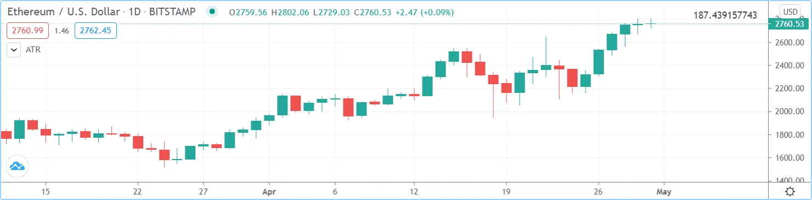
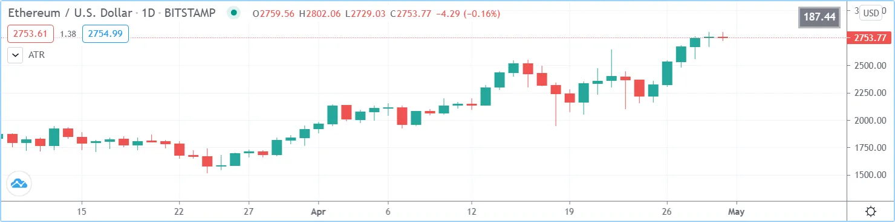

# Tables (_Tabelas_)

Tabelas são objetos que podem ser usados para posicionar informações em locais específicos e fixos no espaço visual de um script. Ao contrário de todos os outros gráficos ou objetos desenhados no Pine Script, as tabelas não estão ancoradas a barras específicas; elas _flutuam_ no espaço do script, seja no modo sobreposto ou no modo painel, em estudos ou estratégias, independentemente das barras do gráfico visualizadas ou do fator de zoom usado.

As tabelas contêm células organizadas em colunas e linhas, semelhantes a uma planilha. Elas são criadas e populadas em dois passos distintos:

1. A estrutura e os atributos principais de uma tabela são definidos usando [table.new()](https://br.tradingview.com/pine-script-reference/v5/#fun_table%7Bdot%7Dnew), que retorna um ID de tabela que atua como um ponteiro para a tabela, assim como fazem os IDs de rótulo, linha ou array. A chamada [table.new()](https://br.tradingview.com/pine-script-reference/v5/#fun_table%7Bdot%7Dnew) cria o objeto da tabela, mas não o exibe.
2. Uma vez criada, e para ser exibida, a tabela deve ser populada usando uma chamada [table.cell()](https://br.tradingview.com/pine-script-reference/v5/#fun_table%7Bdot%7Dcell) para cada célula. As células da tabela podem conter texto ou não. Este segundo passo é quando a largura e a altura das células são definidas.

A maioria dos atributos de uma tabela previamente criada pode ser alterada usando as funções `table.set_*()`. Atributos de células previamente populadas podem ser modificados usando as funções `table.cell_set_*()`.

Uma tabela é posicionada no espaço do indicador ancorando-a a uma das nove referências: os quatro cantos ou pontos médios, incluindo o centro. As tabelas são posicionadas expandindo a tabela a partir de sua âncora, então uma tabela ancorada na referência [position.middle_right](https://br.tradingview.com/pine-script-reference/v5/#const_position%7Bdot%7Dmiddle_right) será desenhada expandindo para cima, para baixo e para a esquerda a partir dessa âncora.

Existem dois modos disponíveis para determinar a largura/altura das células da tabela:

- Um modo automático padrão calcula a largura/altura das células em uma coluna/linha usando o texto mais largo/alto nelas.
- Um modo explícito permite que os programadores definam a largura/altura das células usando uma porcentagem do espaço x/y disponível no indicador.

Os conteúdos exibidos na tabela sempre representam o último estado da tabela, conforme foi desenhada na última execução do script, na última barra do conjunto de dados. Ao contrário dos valores exibidos na "Janela de Dados" "_Data Window_" ou nos valores do indicador, os conteúdos variáveis exibidos nas tabelas não mudarão conforme o usuário do script move o cursor sobre barras específicas do gráfico. Por essa razão, é altamente recomendável restringir a execução de todas as chamadas `table.*()` apenas às primeiras ou últimas barras do conjunto de dados. Assim:

- Use a palavra-chave [var](https://br.tradingview.com/pine-script-reference/v5/#kw_var) para declarar tabelas.
- Envolva todas as outras chamadas dentro de um bloco [if](https://br.tradingview.com/pine-script-reference/v5/#kw_if) [barstate.islast](https://br.tradingview.com/pine-script-reference/v5/#var_barstate%7Bdot%7Dislast).

> __Observação!__\
> Múltiplas tabelas podem ser usadas em um script, desde que cada uma seja ancorada a uma posição diferente. Cada objeto de tabela é identificado por seu próprio ID. Os limites na quantidade de células em todas as tabelas são determinados pelo número total de células usadas em um script.

## Criando Tabelas

Ao criar uma tabela usando [table.new()](https://br.tradingview.com/pine-script-reference/v5/#fun_table%7Bdot%7Dnew), três parâmetros são obrigatórios: a posição da tabela e seu número de colunas e linhas. Cinco outros parâmetros são opcionais: a cor de fundo da tabela, a cor e largura da moldura externa da tabela, e a cor e largura das bordas ao redor de todas as células, excluindo a moldura externa. Todos os atributos da tabela, exceto seu número de colunas e linhas, podem ser modificados usando funções setter: [table.set_position()](https://br.tradingview.com/pine-script-reference/v5/#fun_table%7Bdot%7Dset_position), [table.set_bgcolor()](https://br.tradingview.com/pine-script-reference/v5/#fun_table%7Bdot%7Dset_bgcolor), [table.set_frame_color()](https://br.tradingview.com/pine-script-reference/v5/#fun_table%7Bdot%7Dset_frame_color), [table.set_frame_width()](https://br.tradingview.com/pine-script-reference/v5/#fun_table%7Bdot%7Dset_frame_width), [table.set_border_color()](https://br.tradingview.com/pine-script-reference/v5/#fun_table%7Bdot%7Dset_border_color) e [table.set_border_width()](https://br.tradingview.com/pine-script-reference/v5/#fun_table%7Bdot%7Dset_border_width).

As tabelas podem ser deletadas usando [table.delete()](https://br.tradingview.com/pine-script-reference/v5/#fun_table%7Bdot%7Ddelete), e seu conteúdo pode ser removido seletivamente usando [table.clear()](https://br.tradingview.com/pine-script-reference/v5/#fun_table%7Bdot%7Dclear).

Ao popularem células usando [table.cell()](https://br.tradingview.com/pine-script-reference/v5/#fun_table%7Bdot%7Dcell), é necessário fornecer um argumento para quatro parâmetros obrigatórios: o ID da tabela à qual a célula pertence, seu índice de coluna e linha usando índices que começam em zero, e a string de texto que a célula contém, que pode ser nula. Sete outros parâmetros são opcionais: a largura e altura da célula, os atributos do texto (cor, alinhamento horizontal e vertical, tamanho), e a cor de fundo da célula. Todos os atributos da célula podem ser modificados usando funções setter: [table.cell_set_text()](https://br.tradingview.com/pine-script-reference/v5/#fun_table%7Bdot%7Dcell_set_text), [table.cell_set_width()](https://br.tradingview.com/pine-script-reference/v5/#fun_table%7Bdot%7Dcell_set_width), [table.cell_set_height()](https://br.tradingview.com/pine-script-reference/v5/#fun_table%7Bdot%7Dcell_set_height), [table.cell_set_text_color()](https://br.tradingview.com/pine-script-reference/v5/#fun_table%7Bdot%7Dcell_set_text_color), [table.cell_set_text_halign()](https://br.tradingview.com/pine-script-reference/v5/#fun_table%7Bdot%7Dcell_set_text_halign), [table.cell_set_text_valign()](https://br.tradingview.com/pine-script-reference/v5/#fun_table%7Bdot%7Dcell_set_text_valign), [table.cell_set_text_size()](https://br.tradingview.com/pine-script-reference/v5/#fun_table%7Bdot%7Dcell_set_text_size) e [table.cell_set_bgcolor()](https://br.tradingview.com/pine-script-reference/v5/#fun_table%7Bdot%7Dcell_set_bgcolor).

Lembre-se de que cada chamada sucessiva a [table.cell()](https://br.tradingview.com/pine-script-reference/v5/#fun_table%7Bdot%7Dcell) redefine __todas__ as propriedades da célula, excluindo quaisquer propriedades definidas por chamadas anteriores a [table.cell()](https://br.tradingview.com/pine-script-reference/v5/#fun_table%7Bdot%7Dcell) na mesma célula.

<!-- ### Colocando um Valor Único em uma Posição Fixa

O exemplo abaixo, colocará o valor do ATR no canto superior direito do gráfico. Primeiro, cria-se uma tabela de uma célula, depois popula-se essa célula:

```c
//@version=5
indicator("ATR", "", true)
// We use `var` to only initialize the table on the first bar.
var table atrDisplay = table.new(position.top_right, 1, 1)
// We call `ta.atr()` outside the `if` block so it executes on each bar.
myAtr = ta.atr(14)
if barstate.islast
    // We only populate the table on the last bar.
    table.cell(atrDisplay, 0, 0, str.tostring(myAtr))
```



__Note que:__

- Usa-se a palavra-chave [var](https://br.tradingview.com/pine-script-reference/v5/#kw_var) ao criar a tabela com [table.new()](https://br.tradingview.com/pine-script-reference/v5/#fun_table%7Bdot%7Dnew).
- Popula-se a célula dentro de um bloco [if](https://br.tradingview.com/pine-script-reference/v5/#kw_if) [barstate.islast](https://br.tradingview.com/pine-script-reference/v5/#var_barstate%7Bdot%7Dislast) usando [table.cell()](https://br.tradingview.com/pine-script-reference/v5/#fun_table%7Bdot%7Dcell).
- Ao popular a célula, não se especifica a `largura` ou `altura`. A largura e altura da célula ajustar-se-ão automaticamente ao texto que contém.
- Invoca-se `ta.atr(14)` antes da entrada no bloco [if](https://br.tradingview.com/pine-script-reference/v5/#kw_if) para que seja avaliado em cada barra. Se fosse usado `str.tostring(ta.atr(14))` dentro do bloco [if](https://br.tradingview.com/pine-script-reference/v5/#kw_if), a função não teria sido avaliada corretamente porque seria chamada na última barra do conjunto de dados sem ter calculado os valores necessários das barras anteriores.

Segue sugestão para melhorias de usabilidade e estética do script:

```c
//@version=5
indicator("ATR", "", true)
atrPeriodInput = input.int(14,  "ATR period", minval = 1, tooltip = "Using a period of 1 yields True Range.")

var table atrDisplay = table.new(position.top_right, 1, 1, bgcolor = color.gray, frame_width = 2, frame_color = color.black)
myAtr = ta.atr(atrPeriodInput)
if barstate.islast
    table.cell(atrDisplay, 0, 0, str.tostring(myAtr, format.mintick), text_color = color.white)
```



__Note que:__

- Usou-se [table.new()](https://br.tradingview.com/pine-script-reference/v5/#fun_table%7Bdot%7Dnew) para definir uma cor de fundo, uma cor de moldura e sua largura.
- Ao popular a célula com [table.cell()](https://br.tradingview.com/pine-script-reference/v5/#fun_table%7Bdot%7Dcell), definiu-se o texto para ser exibido em branco.
- Passou-se [format.mintick](https://br.tradingview.com/pine-script-reference/v5/#const_format%7Bdot%7Dmintick) como um segundo argumento para a função [str.tostring()](https://br.tradingview.com/pine-script-reference/v5/#fun_str%7Bdot%7Dtostring) para restringir a precisão do ATR à precisão do tick do gráfico.
- Agora usa-se uma entrada para permitir que o usuário do script especifique o período do ATR. A entrada também inclui uma dica de ferramenta, que o usuário pode ver ao passar o mouse sobre o ícone "i" na aba "Configurações/Entradas" "_Settings/Inputs_" do script. -->
