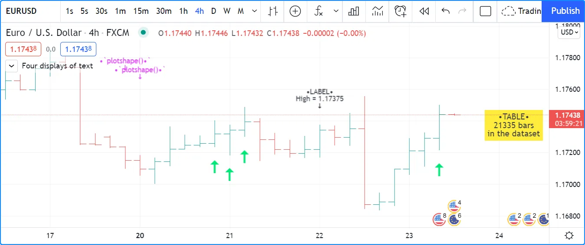
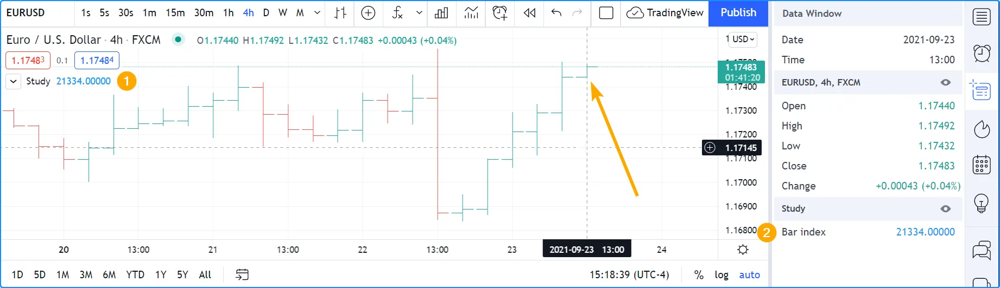
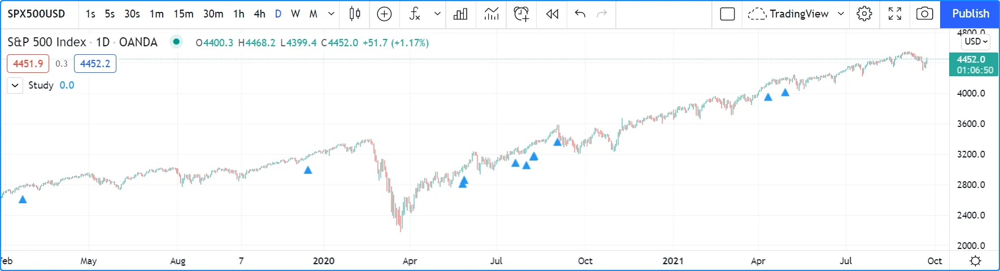
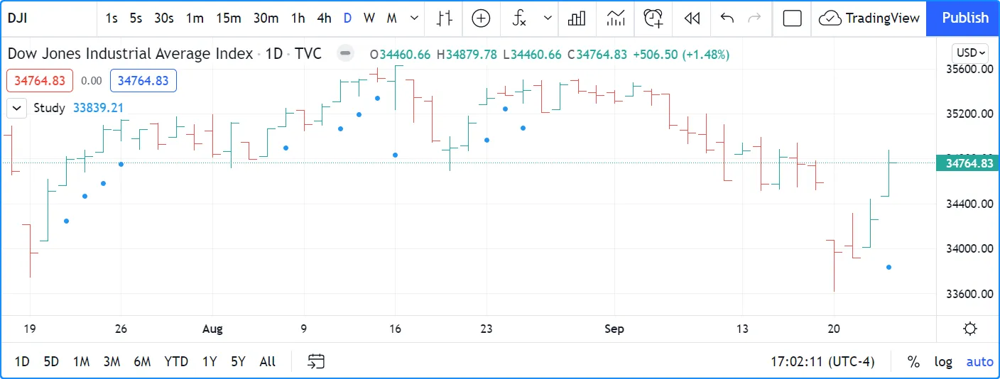
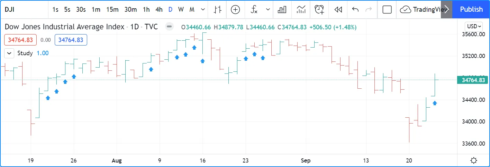
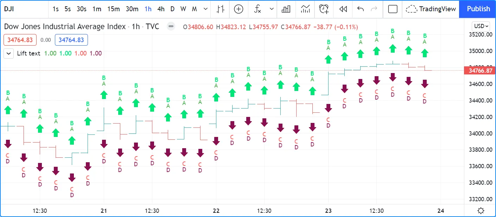
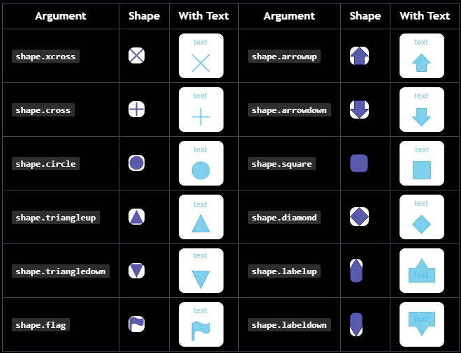

# Text e Shapes (_Texto e Formas_)

É possível exibir texto ou formas usando cinco maneiras diferentes no Pine Script:

- [plotchar()](https://br.tradingview.com/pine-script-reference/v5/#fun_plotchar)
- [plotshape()](https://br.tradingview.com/pine-script-reference/v5/#fun_plotshape)
- [plotarrow()](https://br.tradingview.com/pine-script-reference/v5/#fun_plotarrow)
- _Labels_ criados com [label.new()](https://br.tradingview.com/pine-script-reference/v5/#fun_label%7Bdot%7Dnew)
- Tabelas criadas com [table.new()](https://br.tradingview.com/pine-script-reference/v5/#fun_table%7Bdot%7Dnew) (veja [Tabelas](./05_19_tables.md))

Qual utilizar depende das necessidades:

- As tabelas podem exibir texto em várias posições relativas nos gráficos que não se movem conforme os usuários rolam ou ampliam o gráfico horizontalmente. Seu conteúdo não está vinculado a barras. Em contraste, o texto exibido com [plotchar()](https://br.tradingview.com/pine-script-reference/v5/#fun_plotchar), [plotshape()](https://br.tradingview.com/pine-script-reference/v5/#fun_plotshape) ou [label.new()](https://br.tradingview.com/pine-script-reference/v5/#fun_label%7Bdot%7Dnew) está sempre vinculado a uma barra específica, movendo-se com a posição da barra no gráfico. Veja a página sobre [Tabelas](./05_19_tables.md) para mais informações.
- Três funções podem exibir formas predefinidas: [plotshape()](https://br.tradingview.com/pine-script-reference/v5/#fun_plotshape), [plotarrow()](https://br.tradingview.com/pine-script-reference/v5/#fun_plotarrow) e _labels_ criados com [label.new()](https://br.tradingview.com/pine-script-reference/v5/#fun_label%7Bdot%7Dnew).
- [plotarrow()](https://br.tradingview.com/pine-script-reference/v5/#fun_plotarrow) não pode exibir texto, apenas setas para cima ou para baixo.
- [plotchar()](https://br.tradingview.com/pine-script-reference/v5/#fun_plotchar) e [plotshape()](https://br.tradingview.com/pine-script-reference/v5/#fun_plotshape) podem exibir texto não dinâmico em qualquer barra ou em todas as barras do gráfico.
- [plotchar()](https://br.tradingview.com/pine-script-reference/v5/#fun_plotchar) pode exibir apenas um caractere, enquanto [plotshape()](https://br.tradingview.com/pine-script-reference/v5/#fun_plotshape) pode exibir strings, incluindo quebras de linha.
- [label.new()](https://br.tradingview.com/pine-script-reference/v5/#fun_label%7Bdot%7Dnew) pode exibir no máximo 500 _labels_ no gráfico. Seu texto __pode__ conter texto dinâmico, ou "series string". Quebras de linha também são suportadas no texto dos _labels_.
- Enquanto [plotchar()](https://br.tradingview.com/pine-script-reference/v5/#fun_plotchar) e [plotshape()](https://br.tradingview.com/pine-script-reference/v5/#fun_plotshape) podem exibir texto com um deslocamento fixo no passado ou futuro, que não pode mudar durante a execução do script, cada chamada [label.new()](https://br.tradingview.com/pine-script-reference/v5/#fun_label%7Bdot%7Dnew) pode usar um deslocamento "series" que pode ser calculado dinamicamente.

Estas são algumas considerações sobre strings no Pine Script:

- Como o parâmetro `text` em [plotchar()](https://br.tradingview.com/pine-script-reference/v5/#fun_plotchar) e [plotshape()](https://br.tradingview.com/pine-script-reference/v5/#fun_plotshape) requer um argumento "const string", ele não pode conter valores como preços que só podem ser conhecidos na barra ("series string").
- Para incluir valores "series" no texto exibido usando [label.new()](https://br.tradingview.com/pine-script-reference/v5/#fun_label%7Bdot%7Dnew), eles precisam ser convertidos em strings usando [str.tostring()](https://br.tradingview.com/pine-script-reference/v5/#fun_str%7Bdot%7Dtostring).
- O operador de concatenação para strings no Pine é `+`. Ele é usado para juntar componentes de string em uma única string, por exemplo, `msg = "Chart symbol: " + syminfo.tickerid` (onde [syminfo.tickerid](https://br.tradingview.com/pine-script-reference/v5/#var_syminfo%7Bdot%7Dtickerid) é uma variável incorporada que retorna as informações de troca e símbolo do gráfico em formato de string).
- Os caracteres exibidos por todas essas funções podem ser caracteres Unicode, que podem incluir símbolos Unicode. Veja este script [Explorando Unicode](https://br.tradingview.com/script/0rFQOCKf-Exploring-Unicode/) para ter uma ideia do que pode ser feito com caracteres Unicode.
- A cor ou o tamanho do texto às vezes podem ser controlados usando parâmetros de função, mas nenhuma formatação inline (negrito, itálico, monoespaço, etc.) é possível.
- O texto dos scripts Pine sempre é exibido no gráfico na fonte Trebuchet MS, que é usada em muitos textos do TradingView, incluindo este.

Este script exibe texto usando os quatro métodos disponíveis no Pine Script:

```c
//@version=5
indicator("Four displays of text", overlay = true)
plotchar(ta.rising(close, 5), "`plotchar()`", "🠅", location.belowbar, color.lime, size = size.small)
plotshape(ta.falling(close, 5), "`plotchar()`", location = location.abovebar, color = na, text = "•`plotshape()•`\n🠇", textcolor = color.fuchsia, size = size.huge)

if bar_index % 25 == 0
    label.new(bar_index, na, "•LABEL•\nHigh = " + str.tostring(high, format.mintick) + "\n🠇", yloc = yloc.abovebar, style = label.style_none, textcolor = color.black, size = size.normal)

printTable(txt) => var table t = table.new(position.middle_right, 1, 1), table.cell(t, 0, 0, txt, bgcolor = color.yellow)
printTable("•TABLE•\n" + str.tostring(bar_index + 1) + " bars\nin the dataset")
```



__Note que:__

- O método usado para exibir cada string de texto é mostrado com o texto, exceto para as setas para cima em verde-lima exibidas usando [plotchar()](https://br.tradingview.com/pine-script-reference/v5/#fun_plotchar), pois só pode exibir um caractere.
- As chamadas de rótulo e tabela podem ser inseridas em estruturas condicionais para controlar quando são executadas, enquanto [plotchar()](https://br.tradingview.com/pine-script-reference/v5/#fun_plotchar) e [plotshape()](https://br.tradingview.com/pine-script-reference/v5/#fun_plotshape) não podem. Sua plotagem condicional deve ser controlada usando seu primeiro argumento, que é um "bool series" cujo valor `true` ou `false` determina quando o texto é exibido.
- Os valores numéricos exibidos na tabela e nos _labels_ são convertidos em string usando [str.tostring()](https://br.tradingview.com/pine-script-reference/v5/#fun_str%7Bdot%7Dtostring).
- Utiliza-se o operador `+` para concatenar componentes de string.
- [plotshape()](https://br.tradingview.com/pine-script-reference/v5/#fun_plotshape) é projetado para exibir uma forma com texto acompanhante. Seu parâmetro `size` controla o tamanho da forma, não do texto. É usado [na](https://br.tradingview.com/pine-script-reference/v5/#var_na) para seu argumento `color` para que a forma não seja visível.
- Ao contrário de outros textos, o texto da tabela não se moverá ao rolar ou redimensionar o gráfico.
- Algumas strings de texto contêm a seta Unicode 🠇 (U+1F807).
- Algumas strings de texto contêm a sequência `\n` que representa uma nova linha.

## `plotchar()`

Esta função é útil para exibir um único caractere nas barras. Tem a seguinte sintaxe:

```c
plotchar(series, title, char, location, color, offset, text, textcolor, editable, size, show_last, display, force_overlay) → void
```

Veja a [entrada do Manual de Referência para plotchar()](https://br.tradingview.com/pine-script-reference/v5/#fun_plotchar) para detalhes sobre seus parâmetros.

Conforme explicado na seção sobre [quando a escala do script deve ser preservada](./06_02_debugging.md#sem-afetar-a-escala) da página sobre [depuração](./06_02_debugging.md), a função pode ser usada para exibir e inspecionar valores na Janela de Dados ou nos valores do indicador exibidos à direita do nome do script no gráfico:

```c
//@version=5
indicator("", "", true)
plotchar(bar_index, "Bar index", "", location.top)
```



__Note que:__

- O cursor está na última barra do gráfico.
- O valor de [bar_index](https://br.tradingview.com/pine-script-reference/v5/#var_bar_index) nessa barra é exibido nos valores do indicador (1) e na Janela de Dados (2).
- Utiliza-se [location.top](https://br.tradingview.com/pine-script-reference/v5/#const_location%7Bdot%7Dtop) porque o padrão [location.abovebar](https://br.tradingview.com/pine-script-reference/v5/#const_location%7Bdot%7Dabovebar) colocaria o preço em jogo na escala do script, o que frequentemente interfere com outras plotagens.

O [plotchar()](https://br.tradingview.com/pine-script-reference/v5/#fun_plotchar) também funciona bem para identificar pontos específicos no gráfico ou para validar se as condições são `true` quando é esperado que sejam. Este exemplo exibe uma seta para cima abaixo das barras onde [close](https://br.tradingview.com/pine-script-reference/v5/#var_close), [high](https://br.tradingview.com/pine-script-reference/v5/#var_high) e [volume](https://br.tradingview.com/pine-script-reference/v5/#var_volume) estão todos subindo por dois barras:

```c
//@version=5
indicator("", "", true)
bool longSignal = ta.rising(close, 2) and ta.rising(high, 2) and (na(volume) or ta.rising(volume, 2))
plotchar(longSignal, "Long", "▲", location.belowbar, color = na(volume) ? color.gray : color.blue, size = size.tiny)
```



__Note que:__

- Usa-se `(na(volume) or ta.rising(volume, 2))` para que o script funcione em símbolos sem dados de [volume](https://br.tradingview.com/pine-script-reference/v5/#var_volume). Se não considerasse quando não há dados de [volume](https://br.tradingview.com/pine-script-reference/v5/#var_volume), que é o que `na(volume)` faz ao ser `true` quando não há volume, o valor da variável `longSignal` nunca seria `true` porque `ta.rising(volume, 2)` resultaria em `false` nesses casos.
- É mostrado a seta em cinza quando não há volume, para lembrar que todas as três condições básicas não estão sendo atendidas.
- Como [plotchar()](https://br.tradingview.com/pine-script-reference/v5/#fun_plotchar) agora está exibindo um caractere no gráfico, é utilizado `size = size.tiny` para controlar seu tamanho.
- Foi adaptado o argumento `location` para exibir o caractere abaixo das barras.

Caso não importe em plotar apenas círculos, também pode usar [plot()](https://br.tradingview.com/pine-script-reference/v5/#fun_plot) para alcançar um efeito semelhante:

```c
//@version=5
indicator("", "", true)
longSignal = ta.rising(close, 2) and ta.rising(high, 2) and (na(volume) or ta.rising(volume, 2))
plot(longSignal ? low - ta.tr : na, "Long", color.blue, 2, plot.style_circles)
```

Este método tem o inconveniente de que, como não há mecanismo de posicionamento relativo com [plot()](https://br.tradingview.com/pine-script-reference/v5/#fun_plot), é preciso deslocar os círculos para baixo usando algo como [ta.tr](https://br.tradingview.com/pine-script-reference/v5/#var_ta%7Bdot%7Dtr) (o "True Range" da barra):




## `plotshape()`

Esta função é útil para exibir formas predefinidas e/ou texto nas barras. A sintaxe é a seguinte:

```c
plotshape(series, title, style, location, color, offset, text, textcolor, editable, size, show_last, display, force_overlay) → void
```

Veja a [entrada do Manual de Referência para plotshape()](https://br.tradingview.com/pine-script-reference/v5/#fun_plotshape) para detalhes sobre seus parâmetros.

O uso da função para alcançar mais ou menos o mesmo resultado que no segundo exemplo da seção anterior:

```c
//@version=5
indicator("", "", true)
longSignal = ta.rising(close, 2) and ta.rising(high, 2) and (na(volume) or ta.rising(volume, 2))
plotshape(longSignal, "Long", shape.arrowup, location.belowbar)  
```

Note que aqui, em vez de usar um caractere de seta, é utilizado o argumento `shape.arrowup` para o parâmetro `style`.



É possível usar diferentes chamadas de [plotshape()](https://br.tradingview.com/pine-script-reference/v5/#fun_plotshape) para sobrepor texto nas barras. Será necessário usar `\n` seguido de um caractere especial não imprimível que não seja removido para preservar a funcionalidade da nova linha. Aqui está sendo usado um espaço em branco de largura zero do Unicode (U+200E). Embora não visível nas strings do código a seguir, ele está presente e pode ser copiado/colado. O caractere Unicode especial precisa ser o __último__ na string para texto ascendente e o __primeiro__ quando plotando abaixo da barra e o texto for descendente:

```c
//@version=5
indicator("Lift text", "", true)
plotshape(true, "", shape.arrowup,   location.abovebar, color.green,  text = "A")
plotshape(true, "", shape.arrowup,   location.abovebar, color.lime,   text = "B\n​")
plotshape(true, "", shape.arrowdown, location.belowbar, color.red,    text = "C")
plotshape(true, "", shape.arrowdown, location.belowbar, color.maroon, text = "​\nD")
```



As formas disponíveis que podem ser usadas com o parâmetro `style` são:




# Labels
