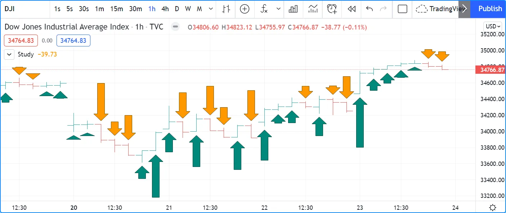
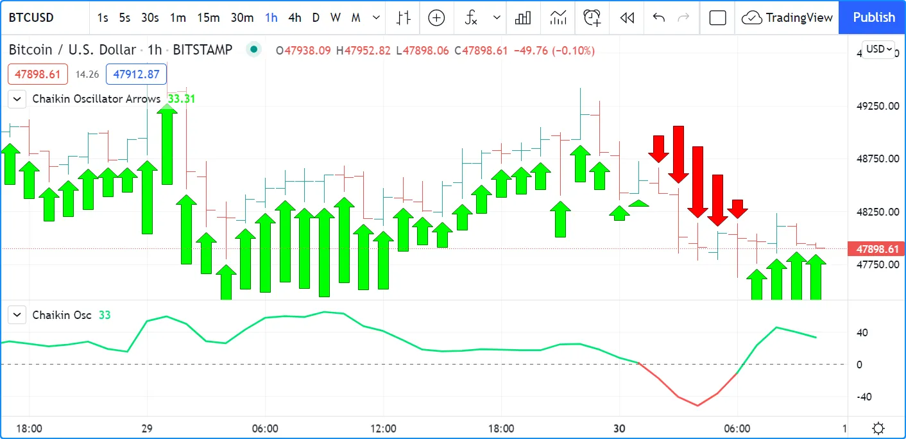
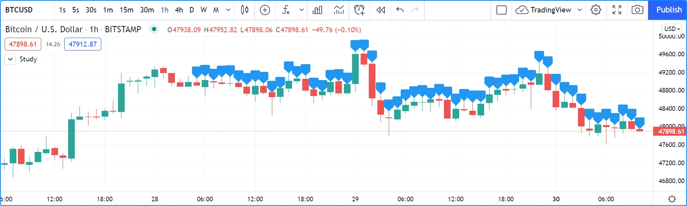
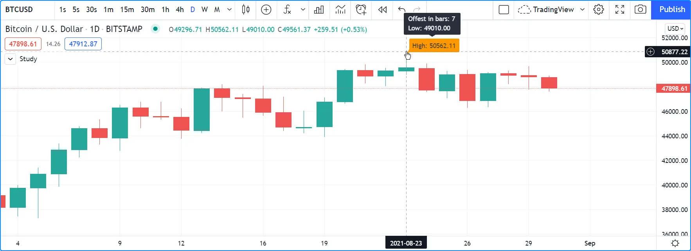
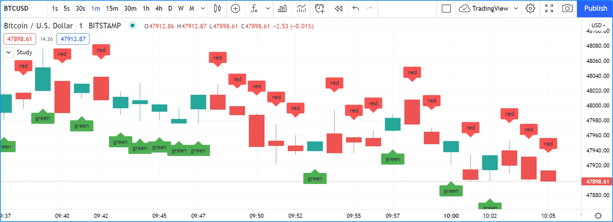

# Text e Shapes (_Texto e Formas_)

É possível exibir texto ou formas usando cinco maneiras diferentes no Pine Script:

- [plotchar()](https://br.tradingview.com/pine-script-reference/v5/#fun_plotchar)
- [plotshape()](https://br.tradingview.com/pine-script-reference/v5/#fun_plotshape)
- [plotarrow()](https://br.tradingview.com/pine-script-reference/v5/#fun_plotarrow)
- _Labels_ criados com [label.new()](https://br.tradingview.com/pine-script-reference/v5/#fun_label%7Bdot%7Dnew)
- Tabelas criadas com [table.new()](https://br.tradingview.com/pine-script-reference/v5/#fun_table%7Bdot%7Dnew) (veja [Tabelas](./05_19_tables.md))

Qual utilizar depende das necessidades:

- As tabelas podem exibir texto em várias posições relativas nos gráficos que não se movem conforme os usuários rolam ou ampliam o gráfico horizontalmente. Seu conteúdo não está vinculado a barras. Em contraste, o texto exibido com [plotchar()](https://br.tradingview.com/pine-script-reference/v5/#fun_plotchar), [plotshape()](https://br.tradingview.com/pine-script-reference/v5/#fun_plotshape) ou [label.new()](https://br.tradingview.com/pine-script-reference/v5/#fun_label%7Bdot%7Dnew) está sempre vinculado a uma barra específica, movendo-se com a posição da barra no gráfico. Veja a página sobre [Tabelas](./05_19_tables.md) para mais informações.
- Três funções podem exibir formas predefinidas: [plotshape()](https://br.tradingview.com/pine-script-reference/v5/#fun_plotshape), [plotarrow()](https://br.tradingview.com/pine-script-reference/v5/#fun_plotarrow) e _labels_ criados com [label.new()](https://br.tradingview.com/pine-script-reference/v5/#fun_label%7Bdot%7Dnew).
- [plotarrow()](https://br.tradingview.com/pine-script-reference/v5/#fun_plotarrow) não pode exibir texto, apenas setas para cima ou para baixo.
- [plotchar()](https://br.tradingview.com/pine-script-reference/v5/#fun_plotchar) e [plotshape()](https://br.tradingview.com/pine-script-reference/v5/#fun_plotshape) podem exibir texto não dinâmico em qualquer barra ou em todas as barras do gráfico.
- [plotchar()](https://br.tradingview.com/pine-script-reference/v5/#fun_plotchar) pode exibir apenas um caractere, enquanto [plotshape()](https://br.tradingview.com/pine-script-reference/v5/#fun_plotshape) pode exibir strings, incluindo quebras de linha.
- [label.new()](https://br.tradingview.com/pine-script-reference/v5/#fun_label%7Bdot%7Dnew) pode exibir no máximo 500 _labels_ no gráfico. Seu texto __pode__ conter texto dinâmico, ou "series string". Quebras de linha também são suportadas no texto dos _labels_.
- Enquanto [plotchar()](https://br.tradingview.com/pine-script-reference/v5/#fun_plotchar) e [plotshape()](https://br.tradingview.com/pine-script-reference/v5/#fun_plotshape) podem exibir texto com um deslocamento fixo no passado ou futuro, que não pode mudar durante a execução do script, cada chamada [label.new()](https://br.tradingview.com/pine-script-reference/v5/#fun_label%7Bdot%7Dnew) pode usar um deslocamento "series" que pode ser calculado dinamicamente.

Estas são algumas considerações sobre strings no Pine Script:

- Como o parâmetro `text` em [plotchar()](https://br.tradingview.com/pine-script-reference/v5/#fun_plotchar) e [plotshape()](https://br.tradingview.com/pine-script-reference/v5/#fun_plotshape) requer um argumento "const string", ele não pode conter valores como preços que só podem ser conhecidos na barra ("series string").
- Para incluir valores "series" no texto exibido usando [label.new()](https://br.tradingview.com/pine-script-reference/v5/#fun_label%7Bdot%7Dnew), eles precisam ser convertidos em strings usando [str.tostring()](https://br.tradingview.com/pine-script-reference/v5/#fun_str%7Bdot%7Dtostring).
- O operador de concatenação para strings no Pine é `+`. Ele é usado para juntar componentes de string em uma única string, por exemplo, `msg = "Chart symbol: " + syminfo.tickerid` (onde [syminfo.tickerid](https://br.tradingview.com/pine-script-reference/v5/#var_syminfo%7Bdot%7Dtickerid) é uma variável incorporada que retorna as informações de troca e símbolo do gráfico em formato de string).
- Os caracteres exibidos por todas essas funções podem ser caracteres Unicode, que podem incluir símbolos Unicode. Veja este script [Explorando Unicode](https://br.tradingview.com/script/0rFQOCKf-Exploring-Unicode/) para ter uma ideia do que pode ser feito com caracteres Unicode.
- A cor ou o tamanho do texto às vezes podem ser controlados usando parâmetros de função, mas nenhuma formatação inline (negrito, itálico, monoespaço, etc.) é possível.
- O texto dos scripts Pine sempre é exibido no gráfico na fonte Trebuchet MS, que é usada em muitos textos do TradingView, incluindo este.

Este script exibe texto usando os quatro métodos disponíveis no Pine Script:

```c
//@version=5
indicator("Four displays of text", overlay = true)
plotchar(ta.rising(close, 5), "`plotchar()`", "🠅", location.belowbar, color.lime, size = size.small)
plotshape(ta.falling(close, 5), "`plotchar()`", location = location.abovebar, color = na, text = "•`plotshape()•`\n🠇", textcolor = color.fuchsia, size = size.huge)

if bar_index % 25 == 0
    label.new(bar_index, na, "•LABEL•\nHigh = " + str.tostring(high, format.mintick) + "\n🠇", yloc = yloc.abovebar, style = label.style_none, textcolor = color.black, size = size.normal)

printTable(txt) => var table t = table.new(position.middle_right, 1, 1), table.cell(t, 0, 0, txt, bgcolor = color.yellow)
printTable("•TABLE•\n" + str.tostring(bar_index + 1) + " bars\nin the dataset")
```


__Note que:__

- O método usado para exibir cada string de texto é mostrado com o texto, exceto para as setas para cima em verde-lima exibidas usando [plotchar()](https://br.tradingview.com/pine-script-reference/v5/#fun_plotchar), pois só pode exibir um caractere.
- As chamadas de _label_ e tabela podem ser inseridas em estruturas condicionais para controlar quando são executadas, enquanto [plotchar()](https://br.tradingview.com/pine-script-reference/v5/#fun_plotchar) e [plotshape()](https://br.tradingview.com/pine-script-reference/v5/#fun_plotshape) não podem. Sua plotagem condicional deve ser controlada usando seu primeiro argumento, que é um "bool series" cujo valor `true` ou `false` determina quando o texto é exibido.
- Os valores numéricos exibidos na tabela e nos _labels_ são convertidos em string usando [str.tostring()](https://br.tradingview.com/pine-script-reference/v5/#fun_str%7Bdot%7Dtostring).
- Utiliza-se o operador `+` para concatenar componentes de string.
- [plotshape()](https://br.tradingview.com/pine-script-reference/v5/#fun_plotshape) é projetado para exibir uma forma com texto acompanhante. Seu parâmetro `size` controla o tamanho da forma, não do texto. É usado [na](https://br.tradingview.com/pine-script-reference/v5/#var_na) para seu argumento `color` para que a forma não seja visível.
- Ao contrário de outros textos, o texto da tabela não se moverá ao rolar ou redimensionar o gráfico.
- Algumas strings de texto contêm a seta Unicode 🠇 (U+1F807).
- Algumas strings de texto contêm a sequência `\n` que representa uma nova linha.

## `plotchar()`

Esta função é útil para exibir um único caractere nas barras. Tem a seguinte sintaxe:

```c
plotchar(series, title, char, location, color, offset, text, textcolor, editable, size, show_last, display, force_overlay) → void
```

Veja a [entrada do Manual de Referência para plotchar()](https://br.tradingview.com/pine-script-reference/v5/#fun_plotchar) para detalhes sobre seus parâmetros.

Conforme explicado na seção sobre [quando a escala do script deve ser preservada](./06_02_debugging.md#sem-afetar-a-escala) da página sobre [depuração](./06_02_debugging.md), a função pode ser usada para exibir e inspecionar valores na Janela de Dados ou nos valores do indicador exibidos à direita do nome do script no gráfico:

```c
//@version=5
indicator("", "", true)
plotchar(bar_index, "Bar index", "", location.top)
```


__Note que:__

- O cursor está na última barra do gráfico.
- O valor de [bar_index](https://br.tradingview.com/pine-script-reference/v5/#var_bar_index) nessa barra é exibido nos valores do indicador (1) e na Janela de Dados (2).
- Utiliza-se [location.top](https://br.tradingview.com/pine-script-reference/v5/#const_location%7Bdot%7Dtop) porque o padrão [location.abovebar](https://br.tradingview.com/pine-script-reference/v5/#const_location%7Bdot%7Dabovebar) colocaria o preço em jogo na escala do script, o que frequentemente interfere com outras plotagens.

O [plotchar()](https://br.tradingview.com/pine-script-reference/v5/#fun_plotchar) também funciona bem para identificar pontos específicos no gráfico ou para validar se as condições são `true` quando é esperado que sejam. Este exemplo exibe uma seta para cima abaixo das barras onde [close](https://br.tradingview.com/pine-script-reference/v5/#var_close), [high](https://br.tradingview.com/pine-script-reference/v5/#var_high) e [volume](https://br.tradingview.com/pine-script-reference/v5/#var_volume) estão todos subindo por dois barras:

```c
//@version=5
indicator("", "", true)
bool longSignal = ta.rising(close, 2) and ta.rising(high, 2) and (na(volume) or ta.rising(volume, 2))
plotchar(longSignal, "Long", "▲", location.belowbar, color = na(volume) ? color.gray : color.blue, size = size.tiny)
```


__Note que:__

- Usa-se `(na(volume) or ta.rising(volume, 2))` para que o script funcione em símbolos sem dados de [volume](https://br.tradingview.com/pine-script-reference/v5/#var_volume). Se não considerasse quando não há dados de [volume](https://br.tradingview.com/pine-script-reference/v5/#var_volume), que é o que `na(volume)` faz ao ser `true` quando não há volume, o valor da variável `longSignal` nunca seria `true` porque `ta.rising(volume, 2)` resultaria em `false` nesses casos.
- É mostrado a seta em cinza quando não há volume, para lembrar que todas as três condições básicas não estão sendo atendidas.
- Como [plotchar()](https://br.tradingview.com/pine-script-reference/v5/#fun_plotchar) agora está exibindo um caractere no gráfico, é utilizado `size = size.tiny` para controlar seu tamanho.
- Foi adaptado o argumento `location` para exibir o caractere abaixo das barras.

Caso não importe em plotar apenas círculos, também pode usar [plot()](https://br.tradingview.com/pine-script-reference/v5/#fun_plot) para alcançar um efeito semelhante:

```c
//@version=5
indicator("", "", true)
longSignal = ta.rising(close, 2) and ta.rising(high, 2) and (na(volume) or ta.rising(volume, 2))
plot(longSignal ? low - ta.tr : na, "Long", color.blue, 2, plot.style_circles)
```

Este método tem o inconveniente de que, como não há mecanismo de posicionamento relativo com [plot()](https://br.tradingview.com/pine-script-reference/v5/#fun_plot), é preciso deslocar os círculos para baixo usando algo como [ta.tr](https://br.tradingview.com/pine-script-reference/v5/#var_ta%7Bdot%7Dtr) (o "True Range" da barra):


## `plotshape()`

Esta função é útil para exibir formas predefinidas e/ou texto nas barras. A sintaxe é a seguinte:

```c
plotshape(series, title, style, location, color, offset, text, textcolor, editable, size, show_last, display, force_overlay) → void
```

Veja a [entrada do Manual de Referência para plotshape()](https://br.tradingview.com/pine-script-reference/v5/#fun_plotshape) para detalhes sobre seus parâmetros.

O uso da função para alcançar mais ou menos o mesmo resultado que no segundo exemplo da seção anterior:

```c
//@version=5
indicator("", "", true)
longSignal = ta.rising(close, 2) and ta.rising(high, 2) and (na(volume) or ta.rising(volume, 2))
plotshape(longSignal, "Long", shape.arrowup, location.belowbar)  
```

Note que aqui, em vez de usar um caractere de seta, é utilizado o argumento `shape.arrowup` para o parâmetro `style`.


É possível usar diferentes chamadas de [plotshape()](https://br.tradingview.com/pine-script-reference/v5/#fun_plotshape) para sobrepor texto nas barras. Será necessário usar `\n` seguido de um caractere especial não imprimível que não seja removido para preservar a funcionalidade da nova linha. Aqui está sendo usado um espaço em branco de largura zero do Unicode (U+200E). Embora não visível nas strings do código a seguir, ele está presente e pode ser copiado/colado. O caractere Unicode especial precisa ser o __último__ na string para texto ascendente e o __primeiro__ quando plotando abaixo da barra e o texto for descendente:

```c
//@version=5
indicator("Lift text", "", true)
plotshape(true, "", shape.arrowup,   location.abovebar, color.green,  text = "A")
plotshape(true, "", shape.arrowup,   location.abovebar, color.lime,   text = "B\n​")
plotshape(true, "", shape.arrowdown, location.belowbar, color.red,    text = "C")
plotshape(true, "", shape.arrowdown, location.belowbar, color.maroon, text = "​\nD")
```


As formas disponíveis que podem ser usadas com o parâmetro `style` são:


## `plotarrow()`

A função [plotarrow](https://br.tradingview.com/pine-script-reference/v5/#fun_plotarrow) exibe setas para cima ou para baixo de comprimento variável, com base no valor relativo da série usada no primeiro argumento da função. A sintaxe é a seguinte:

```c
plotarrow(series, title, colorup, colordown, offset, minheight, maxheight, editable, show_last, display, force_overlay) → void
```

Veja a [entrada do Manual de Referência para plotarrow()](https://br.tradingview.com/pine-script-reference/v5/#fun_plotarrow) para detalhes sobre seus parâmetros.

O parâmetro `series` em [plotarrow()](https://br.tradingview.com/pine-script-reference/v5/#fun_plotarrow) não é um "series bool" como em [plotchar()](https://br.tradingview.com/pine-script-reference/v5/#fun_plotchar) e [plotshape()](https://br.tradingview.com/pine-script-reference/v5/#fun_plotshape); é um "series int/float" e há mais do que um simples valor `true` ou `false` determinando quando as setas são plotadas. Esta é a lógica que governa como o argumento fornecido para `series` afeta o comportamento de [plotarrow()](https://br.tradingview.com/pine-script-reference/v5/#fun_plotarrow):

- `series > 0`: Uma seta para cima é exibida, cujo comprimento será proporcional ao valor relativo da série naquela barra em relação a outros valores da série.
- `series < 0`: Uma seta para baixo é exibida, com tamanho proporcional usando as mesmas regras.
- `series == 0 ou na(series)`: Nenhuma seta é exibida.

Os tamanhos máximos e mínimos possíveis para as setas (em pixels) podem ser controlados usando os parâmetros `minheight` e `maxheight`.

Aqui está um script simples ilustrando como [plotarrow()](https://br.tradingview.com/pine-script-reference/v5/#fun_plotarrow) funciona:

```c
//@version=5
indicator("", "", true)
body = close - open
plotarrow(body, colorup = color.teal, colordown = color.orange)
```



Repare como a altura das setas é proporcional ao tamanho relativo dos corpos das barras.

Qualquer série pode ser usada para plotar as setas. Aqui é usado o valor do "Oscilador de Chaikin" "_Chaikin Oscillator_" para controlar a localização e o tamanho das setas:

```c
//@version=5
indicator("Chaikin Oscillator Arrows", overlay = true)
fastLengthInput = input.int(3,  minval = 1)
slowLengthInput = input.int(10, minval = 1)
osc = ta.ema(ta.accdist, fastLengthInput) - ta.ema(ta.accdist, slowLengthInput)
plotarrow(osc)
```



Repare que o "Oscilador de Chaikin" "_Chaikin Oscillator_" é exibido em um painel abaixo do gráfico, para que seja possível ver quais valores são usados para determinar a posição e o tamanho das setas.

## Labels

Os _labels_ estão disponíveis a partir da v4. Funcionam de maneira muito diferente de [plotchar()](https://br.tradingview.com/pine-script-reference/v5/#fun_plotchar) e [plotshape()](https://br.tradingview.com/pine-script-reference/v5/#fun_plotshape).

_Labels_ são objetos, como [linhas e caixas](./05_12_lines_e_boxes.md), ou [tabelas](./05_19_tables.md). Como eles, são referenciados usando um ID, que atua como um ponteiro. IDs de _labels_ são do tipo "label". Assim como outros objetos, os IDs de _labels_ são "time series" e todas as funções usadas para gerenciá-los aceitam argumentos "series", o que os torna muito flexíveis.

> __Observação!__\
> Nos gráficos do TradingView, um conjunto completo de "_Ferramentas de Desenho_" "_Drawing Tools_" permite que os usuários criem e modifiquem desenhos usando ações do mouse. Embora às vezes possam parecer semelhantes a objetos de desenho criados com código Pine Script, são entidades não relacionadas. Objetos de desenho criados usando código Pine não podem ser modificados com ações do mouse, e desenhos feitos manualmente na interface do usuário do gráfico não são visíveis em scripts Pine.

_Labels_ são vantajosos porque:

- Permitem que valores "series" sejam convertidos em texto e colocados nos gráficos. Isso significa que são ideais para exibir valores que não podem ser conhecidos antecipadamente, como valores de preços, níveis de suporte e resistência, ou quaisquer outros valores que o script calcular.
- Suas opções de posicionamento são mais flexíveis do que as funções `plot*()`.
- Oferecem mais modos de exibição.
- Ao contrário das funções `plot*()`, as funções de manipulação de _labels_ podem ser inseridas em estruturas condicionais ou de loop, facilitando o controle de seu comportamento.
- É possível adicionar tooltips aos _labels_.

Uma desvantagem de usar _labels_ em comparação com [plotchar()](https://br.tradingview.com/pine-script-reference/v5/#fun_plotchar) e [plotshape()](https://br.tradingview.com/pine-script-reference/v5/#fun_plotshape) é que é possível desenhar apenas uma quantidade limitada deles no gráfico. O padrão é cerca de 50, mas pode-se usar o parâmetro `max_labels_count` na declaração [indicator()](https://br.tradingview.com/pine-script-reference/v5/#fun_indicator) ou [strategy()](https://br.tradingview.com/pine-script-reference/v5/#fun_strategy) para especificar até 500. _Labels_, como [linhas e caixas](./05_12_lines_e_boxes.md), são gerenciados usando um mecanismo de "_coleta de lixo_" "_garbage collection_" que exclui os mais antigos no gráfico, de modo que apenas os _labels_ mais recentemente desenhados sejam visíveis.

A caixa de ferramentas de built-ins para gerenciar _labels_ está no namespace `label`. Inclui:

- [label.new()](https://br.tradingview.com/pine-script-reference/v5/#fun_label%7Bdot%7Dnew) para criar _labels_.
- Funções `label.set_*()` para modificar as propriedades de um _label_ existente.
- Funções `label.get_*()` para ler as propriedades de um _label_ existente.
- [label.delete()](https://br.tradingview.com/pine-script-reference/v5/#fun_label%7Bdot%7Ddelete) para excluir _labels_.
- O array [label.all](https://br.tradingview.com/pine-script-reference/v5/#var_label%7Bdot%7Dall), que sempre contém os IDs de todos os _labels_ visíveis no gráfico. O tamanho do array dependerá do número máximo de _labels_ para o script e quantos deles foram desenhados. `array.size(label.all)` retornará o tamanho do array.

### Criando e Modificando _Labels_

A função [label.new()](https://br.tradingview.com/pine-script-reference/v5/#fun_label%7Bdot%7Dnew) cria um novo _label_. Tem a seguinte assinatura:

```c
label.new(x, y, text, xloc, yloc, color, style, textcolor, size, textalign, tooltip, force_overylay) → series label
```

As funções _setter_ que permitem alterar as propriedades de um _label_ são:

- [label.set_x()](https://br.tradingview.com/pine-script-reference/v5/#fun_label%7Bdot%7Dset_x)
- [label.set_y()](https://br.tradingview.com/pine-script-reference/v5/#fun_label%7Bdot%7Dset_y)
- [label.set_xy()](https://br.tradingview.com/pine-script-reference/v5/#fun_label%7Bdot%7Dset_xy)
- [label.set_text()](https://br.tradingview.com/pine-script-reference/v5/#fun_label%7Bdot%7Dset_text)
- [label.set_xloc()](https://br.tradingview.com/pine-script-reference/v5/#fun_label%7Bdot%7Dset_xloc)
- [label.set_yloc()](https://br.tradingview.com/pine-script-reference/v5/#fun_label%7Bdot%7Dset_yloc)
- [label.set_color()](https://br.tradingview.com/pine-script-reference/v5/#fun_label%7Bdot%7Dset_color)
- [label.set_style()](https://br.tradingview.com/pine-script-reference/v5/#fun_label%7Bdot%7Dset_style)
- [label.set_textcolor()](https://br.tradingview.com/pine-script-reference/v5/#fun_label%7Bdot%7Dset_textcolor)
- [label.set_size()](https://br.tradingview.com/pine-script-reference/v5/#fun_label%7Bdot%7Dset_size)
- [label.set_textalign()](https://br.tradingview.com/pine-script-reference/v5/#fun_label%7Bdot%7Dset_textalign)
- [label.set_tooltip()](https://br.tradingview.com/pine-script-reference/v5/#fun_label%7Bdot%7Dset_tooltip)

Todas têm uma assinatura semelhante. A de [label.set_color()](https://br.tradingview.com/pine-script-reference/v5/#fun_label%7Bdot%7Dset_color) é:

```c
label.set_color(id, color) → void
```

Onde:

- `id` é o ID do _label_ cuja propriedade deve ser modificada.
- O próximo parâmetro é a propriedade do _label_ a ser modificada. Depende da função setter usada. [label.set_xy()](https://br.tradingview.com/pine-script-reference/v5/#fun_label%7Bdot%7Dset_xy) altera duas propriedades, portanto, possui dois desses parâmetros.

É assim que se pode criar _labels_ em sua forma mais simples:

```c
//@version=5
indicator("", "", true)
label.new(bar_index, high)
```



__Note que:__

- O _label_ é criado com os parâmetros `x = bar_index` (o índice da barra atual, [bar_index](https://br.tradingview.com/pine-script-reference/v5/#var_bar_index)) e `y = high` (o valor [high](https://br.tradingview.com/pine-script-reference/v5/#var_high) da barra).
- Não é fornecido um argumento para o parâmetro `text` da função. Seu valor padrão sendo uma string vazia, nenhum texto é exibido.
- Nenhuma lógica controla a chamada [label.new()](https://br.tradingview.com/pine-script-reference/v5/#fun_label%7Bdot%7Dnew), então _labels_ são criados em cada barra.
- Apenas os últimos 54 _labels_ são exibidos porque a chamada [indicator()](https://br.tradingview.com/pine-script-reference/v5/#fun_indicator) não usa o parâmetro `max_labels_count` para especificar um valor diferente do padrão (~50).
- _Labels_ persistem nas barras até que o script os exclua usando [label.delete()](https://br.tradingview.com/pine-script-reference/v5/#fun_label%7Bdot%7Ddelete) ou a coleta de lixo os remova.

No próximo exemplo, um _label_ é exibido na barra com o valor mais alto de [high](https://br.tradingview.com/pine-script-reference/v5/#var_high) nos últimos 50 barras:

```c
//@version=5
indicator("", "", true)

// Find the highest `high` in last 50 bars and its offset. Change its sign so it is positive.
LOOKBACK = 50
hi = ta.highest(LOOKBACK)
highestBarOffset = -ta.highestbars(LOOKBACK)

// Create label on bar zero only.
var lbl = label.new(na, na, "", color = color.orange, style = label.style_label_lower_left)
// When a new high is found, move the label there and update its text and tooltip.
if ta.change(hi)
    // Build label and tooltip strings.
    labelText = "High: " + str.tostring(hi, format.mintick)
    tooltipText = "Offset in bars: " + str.tostring(highestBarOffset) + "\nLow: " + str.tostring(low[highestBarOffset], format.mintick)
    // Update the label's position, text and tooltip.
    label.set_xy(lbl, bar_index[highestBarOffset], hi)
    label.set_text(lbl, labelText)
    label.set_tooltip(lbl, tooltipText)
```



__Note que:__

- O _label_ é criado apenas na primeira barra, utilizando a palavra-chave [var](https://br.tradingview.com/pine-script-reference/v5/#kw_var) para declarar a variável `lbl` que contém o ID do _label_. Os argumentos `x`, `y` e `text` nessa chamada de [label.new()](https://br.tradingview.com/pine-script-reference/v5/#fun_label%7Bdot%7Dnew) são irrelevantes, pois o _label_ será atualizado nas barras seguintes. No entanto, cuida-se de usar a `color` e `style` desejadas para os _labels_, para que não precisem ser atualizadas posteriormente.
- Em cada barra, detecta-se se um novo valor máximo foi encontrado testando alterações no valor de `hi`.
- Quando ocorre uma mudança no valor máximo, o _label_ é atualizado com novas informações. Para isso, três chamadas `label.set*()` são usadas para alterar as informações relevantes do _label_. Refere-se ao _label_ usando a variável `lbl`, que contém o ID do _label_. O script mantém o mesmo _label_ em todas as barras, movendo-o e atualizando suas informações quando um novo valor máximo é detectado.

Aqui, um _label_ é criado em cada barra, mas suas propriedades são definidas condicionalmente, dependendo da polaridade da barra:

```c
//@version=5
indicator("", "", true)
lbl = label.new(bar_index, na)
if close >= open
    label.set_text(lbl, "green")
    label.set_color(lbl, color.green)
    label.set_yloc(lbl, yloc.belowbar)
    label.set_style(lbl, label.style_label_up)
else
    label.set_text(lbl, "red")
    label.set_color(lbl, color.red)
    label.set_yloc(lbl, yloc.abovebar)
    label.set_style(lbl, label.style_label_down)
```

 -->
