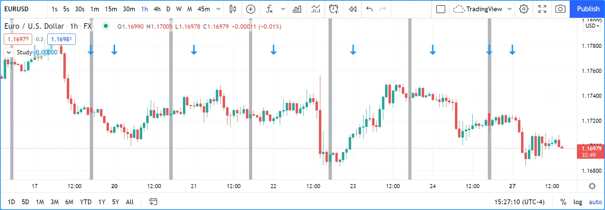
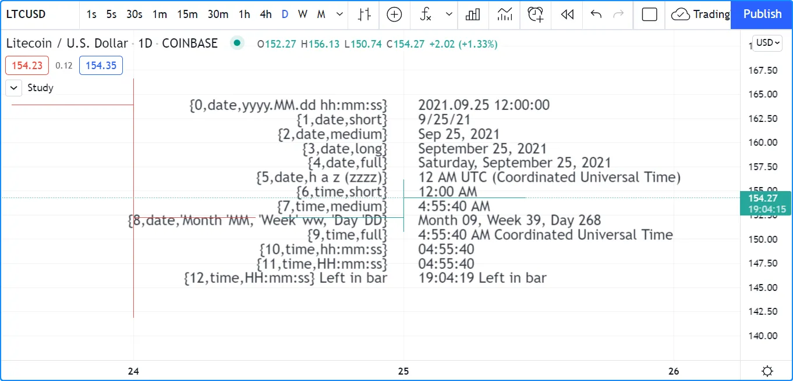

# Time (_Tempo_)

## Quatro Referências

Quatro referências diferentes entram em jogo ao usar valores de data e hora no Pine Script:

1. __Fuso horário UTC__: O formato nativo para valores de tempo no Pine Script é o __tempo Unix em milissegundos__. O tempo Unix é o tempo decorrido desde o __Unix Epoch em 1º de janeiro de 1970__. Veja aqui a [hora atual em Unix em segundos](https://www.unixtimestamp.com/pt) e aqui para mais informações sobre o [Tempo Unix](https://pt.wikipedia.org/wiki/Era_Unix). Um valor para o tempo Unix é chamado de _timestamp_. __Timestamps Unix__ são sempre expressos no fuso horário UTC (ou "GMT", ou "GMT+0"). Eles são medidos a partir de uma referência fixa, ou seja, o Epoch Unix, e não variam com fusos horários. Algumas funcionalidades incorporadas usam o fuso horário UTC como referência.
2. __Fuso horário da bolsa__: Uma segunda referência de tempo importante para os traders é o fuso horário da bolsa onde um instrumento é negociado. Algumas funcionalidades incorporadas, como [hour](https://br.tradingview.com/pine-script-reference/v5/#var_hour), retornam valores no fuso horário da bolsa por padrão.
3. __Parâmetro `timezone`__: Algumas funções que normalmente retornam valores no fuso horário da bolsa, como [hour()](https://br.tradingview.com/pine-script-reference/v5/#fun_hour), incluem um parâmetro `timezone` que permite adaptar o resultado da função para outro fuso horário. Outras funções, como [time()](https://br.tradingview.com/pine-script-reference/v5/#fun_time), incluem os parâmetros `session` e `timezone`. Nesses casos, o argumento `timezone` se aplica a como o argumento `session` é interpretado — não ao valor de _tempo_ retornado pela função.
4. __Fuso horário do gráfico__: Este é o fuso horário escolhido pelo usuário no gráfico usando o campo "_Configurações do Gráfico/Símbolo/Fuso Horário_" "_Chart Settings/Symbol/Time Zone_". Esta configuração afeta apenas a exibição de datas e horários no gráfico. Não afeta o comportamento dos scripts Pine, e eles não têm visibilidade sobre essa configuração.

Ao discutir variáveis ou funções, será notado se elas retornam datas ou horários em UTC ou no fuso horário da bolsa. Scripts não têm visibilidade sobre a configuração de fuso horário do usuário no gráfico.

## Funções e Variáveis Incorporadas de Tempo

Pine Script possui _variáveis_ "__incorporadas__" "__built-in__" para:

- Obter informações de timestamp da barra atual (fuso horário UTC): [time](https://br.tradingview.com/pine-script-reference/v5/#var_time) e [time_close](https://br.tradingview.com/pine-script-reference/v5/#var_time_close)
- Obter informações de timestamp para o início do dia de negociação atual (fuso horário UTC): [time_tradingday](https://br.tradingview.com/pine-script-reference/v5/#var_time_tradingday)
- Obter o horário atual em incrementos de um segundo (fuso horário UTC): [timenow](https://br.tradingview.com/pine-script-reference/v5/#var_timenow)
- Recuperar valores de calendário e tempo da barra (fuso horário da bolsa): [year](https://br.tradingview.com/pine-script-reference/v5/#var_year), [month](https://br.tradingview.com/pine-script-reference/v5/#var_month), [weekofyear](https://br.tradingview.com/pine-script-reference/v5/#var_weekofyear), [dayofmonth](https://br.tradingview.com/pine-script-reference/v5/#var_dayofmonth), [dayofweek](https://br.tradingview.com/pine-script-reference/v5/#var_dayofweek), [hour](https://br.tradingview.com/pine-script-reference/v5/#var_hour), [minute](https://br.tradingview.com/pine-script-reference/v5/#var_minute) e [second](https://br.tradingview.com/pine-script-reference/v5/#var_second)
- Retornar o fuso horário da bolsa do símbolo do gráfico com [syminfo.timezone](https://br.tradingview.com/pine-script-reference/v5/#var_syminfo%7Bdot%7Dtimezone)

Também há _funções_ __incorporadas__ que podem:

- Retornar timestamps de barras de outros períodos com [time()](https://br.tradingview.com/pine-script-reference/v5/#fun_time) e [time_close()](https://br.tradingview.com/pine-script-reference/v5/#fun_time_close), sem a necessidade de uma chamada [request.security()](https://br.tradingview.com/pine-script-reference/v5/#fun_request%7Bdot%7Dsecurity)
- Recuperar valores de calendário e tempo de qualquer timestamp, que podem ser ajustados com um fuso horário: [year()](https://br.tradingview.com/pine-script-reference/v5/#fun_year), [month()](https://br.tradingview.com/pine-script-reference/v5/#fun_month), [weekofyear()](https://br.tradingview.com/pine-script-reference/v5/#fun_weekofyear), [dayofmonth()](https://br.tradingview.com/pine-script-reference/v5/#fun_dayofmonth), [dayofweek()](https://br.tradingview.com/pine-script-reference/v5/#fun_dayofweek), [hour()](https://br.tradingview.com/pine-script-reference/v5/#fun_hour), [minute()](https://br.tradingview.com/pine-script-reference/v5/#fun_minute) e [second()](https://br.tradingview.com/pine-script-reference/v5/#fun_second)
- Criar um timestamp usando [timestamp()](https://br.tradingview.com/pine-script-reference/v5/#fun_timestamp)
- Converter um timestamp para uma string de data/hora formatada para exibição, usando [str.format()](https://br.tradingview.com/pine-script-reference/v5/#fun_str%7Bdot%7Dformat)
- Inserir valores de data e hora. Veja a seção sobre [Entradas](./05_09_inputs.md).
- Trabalhar com [informações de sessão](./05_17_sessoes.md).

## Fuso Horário

Os usuários do TradingView podem alterar o fuso horário usado para exibir os horários das barras em seus gráficos. Scripts Pine não têm visibilidade sobre essa configuração. Embora haja uma variável [syminfo.timezone](https://br.tradingview.com/pine-script-reference/v5/#var_syminfo%7Bdot%7Dtimezone) para retornar o fuso horário da bolsa onde o instrumento do gráfico é negociado, __não__ existe um equivalente `chart.timezone`.

Ao exibir horários no gráfico, esta é uma maneira de fornecer aos usuários um meio de ajustar os valores de tempo do seu script aos do gráfico deles. Dessa forma, os horários exibidos podem corresponder ao fuso horário usado pelos traders em seu gráfico:


```c
//@version=5
indicator("Time zone control")
MS_IN_1H = 1000 * 60 * 60
TOOLTIP01 = "Enter your time zone's offset (+ or −), including a decimal fraction if needed."
hoursOffsetInput = input.float(0.0, "Timezone offset (in hours)", minval = -12.0, maxval = 14.0, step = 0.5, tooltip = TOOLTIP01)

printTable(txt) => 
    var table t = table.new(position.middle_right, 1, 1)
    table.cell(t, 0, 0, txt, text_halign = text.align_right, bgcolor = color.yellow)

msOffsetInput = hoursOffsetInput * MS_IN_1H
printTable(
  str.format("Last bar''s open time UTC: {0,date,HH:mm:ss yyyy.MM.dd}", time) +
  str.format("\nLast bar''s close time UTC: {0,date,HH:mm:ss yyyy.MM.dd}", time_close) +
  str.format("\n\nLast bar''s open time EXCHANGE: {0,date,HH:mm:ss yyyy.MM.dd}", time(timeframe.period, syminfo.session, syminfo.timezone)) +
  str.format("\nLast bar''s close time EXCHANGE: {0,date,HH:mm:ss yyyy.MM.dd}", time_close(timeframe.period, syminfo.session, syminfo.timezone)) +
  str.format("\n\nLast bar''s open time OFFSET ({0}): {1,date,HH:mm:ss yyyy.MM.dd}", hoursOffsetInput, time + msOffsetInput) +
  str.format("\nLast bar''s close time OFFSET ({0}): {1,date,HH:mm:ss yyyy.MM.dd}", hoursOffsetInput, time_close + msOffsetInput) +
  str.format("\n\nCurrent time OFFSET ({0}): {1,date,HH:mm:ss yyyy.MM.dd}", hoursOffsetInput, timenow + msOffsetInput))
```

__Note que:__

- Converte-se o deslocamento do usuário expresso em horas para milissegundos com `msOffsetInput`. Em seguida, adiciona-se esse deslocamento a um timestamp em formato UTC antes de convertê-lo para o formato de exibição, por exemplo, `time + msOffsetInput` e `timenow + msOffsetInput`.
- Utiliza-se um `tooltip` para fornecer _instruções_ aos usuários.
- Fornecem-se valores `minval` e `maxval` para proteger o campo de entrada e um valor `step` de 0,5 para que, quando utilizarem as setas para cima/baixo do campo, possam entender intuitivamente que frações podem ser usadas.
- A função [str.format()](https://br.tradingview.com/pine-script-reference/v5/#fun_str%7Bdot%7Dformat) formata os valores de tempo, nomeadamente o horário da última barra e o horário atual.

Algumas funções que normalmente retornam valores no fuso horário da bolsa fornecem meios para adaptar o resultado a outro fuso horário por meio do parâmetro `timezone`. Este script ilustra como fazer isso com [hour()](https://br.tradingview.com/pine-script-reference/v5/#fun_hour):


```c
//@version=5
indicator('`hour(time, "GMT+0")` in orange')
color BLUE_LIGHT = #0000FF30
plot(hour, "", BLUE_LIGHT, 8)
plot(hour(time, syminfo.timezone))
plot(hour(time, "GMT+0"),"UTC", color.orange)
```

__Note que:__

- A variável [hour](https://br.tradingview.com/pine-script-reference/v5/#var_hour) e a função [hour()](https://br.tradingview.com/pine-script-reference/v5/#fun_hour) normalmente retornam um valor no fuso horário da bolsa. Assim, os plots em azul para `hour` e `hour(time, syminfo.timezone)` se sobrepõem. Usar a forma de função com `syminfo.timezone` é redundante se a hora da bolsa for necessária.
- A linha laranja plotando `hour(time, "GMT+0")`, no entanto, retorna a hora da barra em UTC, ou horário "GMT+0", que neste caso é quatro horas a menos que a hora da bolsa, já que a MSFT é negociada na NASDAQ, cujo fuso horário é UTC-4.

### Strings de Fuso Horário

O argumento usado para o parâmetro `timezone` em funções como [time()](https://br.tradingview.com/pine-script-reference/v5/#fun_time), [timestamp()](https://br.tradingview.com/pine-script-reference/v5/#fun_timestamp), [hour()](https://br.tradingview.com/pine-script-reference/v5/#fun_hour), etc., pode estar em diferentes formatos, que podem ser encontrados na página de referência [IANA time zone database name](https://en.wikipedia.org/wiki/List_of_tz_database_time_zones). Os conteúdos das colunas "TZ database name", "UTC offset ±hh:mm" e "UTC DST offset ±hh:mm" da tabela dessa página podem ser usados.

Para expressar um deslocamento de +5,5 horas a partir do UTC, essas strings encontradas na página de referência são todas equivalentes:

- `"GMT+05:30"`
- `"Asia/Calcutta"`
- `"Asia/Colombo"`
- `"Asia/Kolkata"`

Deslocamentos "_não-fracionários_" "_non-fractional_" podem ser expressos na forma `"GMT+5"`. `"GMT+5.5"` não é permitido.

## Variáveis de Tempo

### `time` e `time_close`

O plot de [time](https://br.tradingview.com/pine-script-reference/v5/#var_time) e [time_close](https://br.tradingview.com/pine-script-reference/v5/#var_time_close), o timestamp Unix em milissegundos do horário de abertura e fechamento da barra:


```c
//@version=5
indicator("`time` and `time_close` values on bars")
plot(time, "`time`")
plot(time_close, "`time_close`")
```

__Note que:__

- As variáveis [time](https://br.tradingview.com/pine-script-reference/v5/#var_time) e [time_close](https://br.tradingview.com/pine-script-reference/v5/#var_time_close) retornam um timestamp em [UNIX time](https://en.wikipedia.org/wiki/Unix_time), que é independente do fuso horário selecionado pelo usuário no gráfico. Neste caso, a configuração de fuso horário do __gráfico__ é o fuso horário da bolsa, então, qualquer que seja o símbolo no gráfico, o fuso horário da bolsa será usado para exibir os valores de data e hora no cursor do gráfico. O fuso horário da NASDAQ é UTC-4, mas isso afeta apenas a exibição de valores de data/hora no gráfico; não impacta os valores plotados pelo script.
- O último valor de [time](https://br.tradingview.com/pine-script-reference/v5/#var_time) para o plot mostrado na escala é o número de milissegundos decorridos desde 00:00:00 UTC de 1º de janeiro de 1970 até o horário de abertura da barra. Corresponde às 17:30 do dia 27 de setembro de 2021. No entanto, como o gráfico usa o fuso horário UTC-4 (o fuso horário da NASDAQ), exibe o horário 13:30, quatro horas antes do horário UTC.
- A diferença entre os dois valores na última barra é o número de milissegundos em uma hora (1000 * 60 * 60 = 3.600.000) por ser um gráfico de 1H.

### `time_tradingday`

A variável [time_tradingday](https://br.tradingview.com/pine-script-reference/v5/#var_time_tradingday) é útil quando um símbolo é negociado em sessões noturnas que começam e terminam em dias de calendário diferentes. Por exemplo, isso acontece nos mercados forex, onde uma sessão pode abrir no domingo às 17:00 e fechar na segunda-feira às 17:00.

A variável retorna o horário de início do dia de negociação em [tempo UNIX](https://pt.wikipedia.org/wiki/Era_Unix) quando usada em _timeframes_ de 1D ou menos. Quando usada em _timeframes_ superiores a 1D, retorna o horário de início do último dia de negociação na barra (por exemplo, em 1W, retornará o horário de início do último dia de negociação da semana).

### `timenow`

O [timenow](https://br.tradingview.com/pine-script-reference/v5/#var_timenow) retorna a hora atual em [tempo UNIX](https://pt.wikipedia.org/wiki/Era_Unix). Funciona em tempo real, mas também quando um script é executado em barras históricas. Em tempo real, seus scripts perceberão mudanças apenas quando forem executados em atualizações de feed. Quando não ocorrem atualizações, o script fica inativo, portanto, não pode atualizar sua exibição. Veja a página sobre o [modelo de execução](./04_01_modelo_de_execucao.md) do Pine Script para mais informações.

Este script usa os valores de [timenow](https://br.tradingview.com/pine-script-reference/v5/#var_timenow) e [time_close](https://br.tradingview.com/pine-script-reference/v5/#var_time_close) para calcular uma contagem regressiva em tempo real para barras intradiárias. Ao contrário da contagem regressiva no gráfico, esta só será atualizada quando uma atualização de feed causar a execução de outra iteração do script:

```c
//@version=5
indicator("", "", true)

printTable(txt) => 
    var table t = table.new(position.middle_right, 1, 1)
    table.cell(t, 0, 0, txt, text_halign = text.align_right, bgcolor = color.yellow)

printTable(str.format("{0,time,HH:mm:ss.SSS}", time_close - timenow))
```

### Variáveis de Datas e Horários do Calendário

Variáveis de data e hora do calendário, como [year](https://br.tradingview.com/pine-script-reference/v5/#var_year), [month](https://br.tradingview.com/pine-script-reference/v5/#var_month), [weekofyear](https://br.tradingview.com/pine-script-reference/v5/#var_weekofyear), [dayofmonth](https://br.tradingview.com/pine-script-reference/v5/#var_dayofmonth), [dayofweek](https://br.tradingview.com/pine-script-reference/v5/#var_dayofweek), [hour](https://br.tradingview.com/pine-script-reference/v5/#var_hour), [minute](https://br.tradingview.com/pine-script-reference/v5/#var_minute) e [second](https://br.tradingview.com/pine-script-reference/v5/#var_second) podem ser úteis para testar datas ou horários específicos e como argumentos para [timestamp()](https://br.tradingview.com/pine-script-reference/v5/#fun_timestamp).

Ao testar datas ou horários específicos, é necessário considerar a possibilidade de o script ser executado em _timeframes_ onde a condição testada não pode ser detectada ou para casos em que uma barra com o requisito específico não existirá. Suponha, por exemplo, que se deseje detectar o primeiro dia de negociação do mês. Este script mostra como usar apenas [dayofmonth](https://br.tradingview.com/pine-script-reference/v5/#var_dayofmonth) não funcionará quando um gráfico semanal for usado ou quando não houver negociação no primeiro dia do mês:


```c
//@version=5
indicator("", "", true)
firstDayIncorrect = dayofmonth == 1
firstDay = ta.change(time("M"))
plotchar(firstDayIncorrect, "firstDayIncorrect", "•", location.top, size = size.small)
bgcolor(firstDay ? color.silver : na)
```

__Note que:__

- Usar `ta.change(time("M"))` é mais robusto, pois funciona em todos os meses (#1 e #2), exibidos como o fundo prateado, enquanto o ponto azul detectado usando `dayofmonth == 1` não funciona (#1) quando o primeiro dia de negociação de setembro ocorre no dia 2.
- A condição `dayofmonth == 1` será `true` em todas as barras do primeiro dia do mês, mas `ta.change(time("M"))` será `true` apenas na primeira.

Se quiser que o script seja exibido apenas para os anos de 2020 em diante, pode usar:

```c
//@version=5
indicator("", "", true)
plot(year >= 2020 ? close : na, linewidth = 3)
```

### `syminfo.timezone()`

O [syminfo.timezone](https://br.tradingview.com/pine-script-reference/v5/#var_syminfo%7Bdot%7Dtimezone) retorna o fuso horário da bolsa do símbolo do gráfico. Pode ser útil quando um parâmetro `timezone` está disponível em uma função e deseja-se mencionar que está usando explicitamente o fuso horário da bolsa. Geralmente é redundante, pois quando nenhum argumento é fornecido para `timezone`, assume-se o fuso horário da bolsa.

## Funções de Tempo

### `time()` e `time_close()`

As funções [time()](https://br.tradingview.com/pine-script-reference/v5/#fun_time) e [time_close()](https://br.tradingview.com/pine-script-reference/v5/#fun_time_close) têm a seguinte assinatura:

```c
time(timeframe, session, timezone) → series int
time_close(timeframe, session, timezone) → series int
```

Três __argumentos__ aceitos:

##### `timeframe`

Uma string no formato [timeframe.period](https://br.tradingview.com/pine-script-reference/v5/#var_timeframe%7Bdot%7Dperiod).

##### `session`

Uma string opcional no formato de especificação de sessão: `"hhmm-hhmm[:days]"`, onde a parte `[:days]` é opcional. Veja a página sobre [sessões](./05_17_sessoes.md) para mais informações.

##### `timezone`

Um valor opcional que qualifica o argumento para `session` quando um é usado.

Veja as entradas de [time()](https://br.tradingview.com/pine-script-reference/v5/#fun_time) e [time_close()](https://br.tradingview.com/pine-script-reference/v5/#fun_time_close) no Manual de Referência para mais informações.

A função [time()](https://br.tradingview.com/pine-script-reference/v5/#fun_time) é mais frequentemente usada para:

1. Testar se uma barra está em um período de tempo específico, o que exigirá o uso do parâmetro `session`. Nesses casos, `timeframe.period`, ou seja, o período do gráfico, será frequentemente usado para o primeiro parâmetro. Ao usar a função dessa maneira, confia-se no fato de que ela retornará [na](https://br.tradingview.com/pine-script-reference/v5/#var_na) quando a barra não fizer parte do período especificado no argumento `session`.
2. Detectar mudanças em períodos de tempo superiores ao do gráfico, usando o período de tempo superior para o argumento `timeframe`. Ao usar a função para esse propósito, procura-se mudanças no valor retornado, o que significa que a barra de período superior mudou. Isso geralmente exigirá o uso de [ta.change()](https://br.tradingview.com/pine-script-reference/v5/#fun_ta%7Bdot%7Dchange) para testar, por exemplo, `ta.change(time("D"))` retornará a mudança no tempo quando uma nova barra de período superior entrar, então o resultado da expressão será convertido em um valor "bool" quando usado em uma expressão condicional. O resultado "bool" será `true` quando houver uma mudança e `false` quando não houver mudança.

#### Testando Sessões

Um exemplo do primeiro caso é determinar se o horário de início de uma barra faz parte de um período entre 11:00 e 13:00:

AndTimeclose()-01.D7rt1wV__1zldez.webp)

```c
//@version=5
indicator("Session bars", "", true)
inSession = not na(time(timeframe.period, "1100-1300"))
bgcolor(inSession ? color.silver : na)
```

__Note que:__

- `time(timeframe.period, "1100-1300")` verifica se o período do gráfico inclui o horário de abertura da barra entre 11:00 e 13:00, inclusive. A função retorna o horário de abertura se a barra estiver na sessão. Se __não__ estiver, a função retorna [na](https://br.tradingview.com/pine-script-reference/v5/#var_na).
- Interessa-se em identificar os casos quando [time()](https://br.tradingview.com/pine-script-reference/v5/#fun_time) não retorna [na](https://br.tradingview.com/pine-script-reference/v5/#var_na), pois isso significa que a barra está na sessão, então testa-se `not na(...)`. O valor de retorno real de [time()](https://br.tradingview.com/pine-script-reference/v5/#fun_time) quando não é [na](https://br.tradingview.com/pine-script-reference/v5/#var_na) não é utilizado; interessa-se apenas se retorna [na](https://br.tradingview.com/pine-script-reference/v5/#var_na) ou não.

#### Testando Mudanças em _Timeframes_ Maiores

Muitas vezes, é útil detectar mudanças em um _timeframe_ maior. Por exemplo, pode-se querer detectar mudanças no dia de negociação enquanto está em gráficos intradiários. Nesses casos, pode-se usar o fato de que `time("D")` retorna o horário de abertura da barra de 1D, mesmo que o gráfico esteja em um _timeframe_ intradiário, como 1H:



```c
//@version=5
indicator("", "", true)
bool newDay = ta.change(time("D"))
bgcolor(newDay ? color.silver : na)

newExchangeDay = ta.change(dayofmonth)
plotchar(newExchangeDay, "newExchangeDay", "🠇", location.top, size = size.small)
```

__Note que:__

- A variável `newDay` detecta mudanças no horário de abertura de barras de 1D, seguindo as convenções para o símbolo do gráfico, que usa sessões noturnas das 17:00 às 17:00. Muda de valor quando uma nova sessão começa.
- Como `newExchangeDay` detecta mudanças no [dayofmonth](https://br.tradingview.com/pine-script-reference/v5/#var_dayofmonth) do dia do calendário, ele muda quando o dia muda no gráfico.
- Os dois métodos de detecção de mudanças só coincidem no gráfico quando há dias sem negociação. Nos domingos, por exemplo, ambos os métodos de detecção identificarão uma mudança, pois o dia do calendário muda do último dia de negociação (sexta-feira) para o primeiro dia do calendário da nova semana, domingo, que é quando a sessão noturna de segunda-feira começa às 17:00.

### Funções de Datas e Horários do Calendário

Funções de data e hora do calendário, como [year()](https://br.tradingview.com/pine-script-reference/v5/#fun_year), [month()](https://br.tradingview.com/pine-script-reference/v5/#fun_month), [weekofyear()](https://br.tradingview.com/pine-script-reference/v5/#fun_weekofyear), [dayofmonth()](https://br.tradingview.com/pine-script-reference/v5/#fun_dayofmonth), [dayofweek()](https://br.tradingview.com/pine-script-reference/v5/#fun_dayofweek), [hour()](https://br.tradingview.com/pine-script-reference/v5/#fun_hour), [minute()](https://br.tradingview.com/pine-script-reference/v5/#fun_minute) e [second()](https://br.tradingview.com/pine-script-reference/v5/#fun_second) podem ser úteis para testar datas ou horários específicos. Possuem assinatures semelhantes ao [dayofmonth()](https://br.tradingview.com/pine-script-reference/v5/#fun_dayofmonth):

```c
dayofmonth(time) → series int
dayofmonth(time, timezone) → series int
```

Isso irá plotar o dia de abertura da barra onde o tempo 1º de janeiro de 2021 às 00:00 cai entre seus valores [time](https://br.tradingview.com/pine-script-reference/v5/#var_time) e [time_close](https://br.tradingview.com/pine-script-reference/v5/#var_time_close):

```c
//@version=5
indicator("")
exchangeDay = dayofmonth(timestamp("2021-01-01"))
plot(exchangeDay)
```

O valor será o dia 31 ou o dia 1, dependendo do dia do calendário em que a sessão abre no símbolo do gráfico. A data para símbolos negociados 24x7 em bolsas usando o fuso horário UTC será o dia 1. Para símbolos negociados em bolsas no fuso horário UTC-4, a data será o dia 31.

### `timestamp()`

A função [timestamp()](https://br.tradingview.com/pine-script-reference/v5/#fun_timestamp) possui algumas assinaturas diferentes:

```c
timestamp(year, month, day, hour, minute, second) → simple/series int
timestamp(timezone, year, month, day, hour, minute, second) → simple/series int
timestamp(dateString) → const int
```

A única diferença entre os dois primeiros é o parâmetro `timezone`. Seu valor padrão é [syminfo.timezone](https://br.tradingview.com/pine-script-reference/v5/#var_syminfo%7Bdot%7Dtimezone). Consulte a seção [Strings de Fuso Horário](./05_21_time.md#strings-de-fuso-horário) desta página para valores válidos.

A terceira forma é usada como um valor `defval` em [input.time()](https://br.tradingview.com/pine-script-reference/v5/#fun_input%7Bdot%7Dtime). Consulte a entrada [timestamp()](https://br.tradingview.com/pine-script-reference/v5/#fun_timestamp) no Manual de Referência para mais informações.

[timestamp()](https://br.tradingview.com/pine-script-reference/v5/#fun_timestamp) é útil para gerar um timestamp para uma data específica. Para gerar um timestamp para 1º de janeiro de 2021, use qualquer um destes métodos:

```c
//@version=5
indicator("")
yearBeginning1 = timestamp("2021-01-01")
yearBeginning2 = timestamp(2021, 1, 1, 0, 0)
printTable(txt) => var table t = table.new(position.middle_right, 1, 1), table.cell(t, 0, 0, txt, bgcolor = color.yellow)
printTable(str.format("yearBeginning1: {0,date,yyyy.MM.dd hh:mm}\nyearBeginning2: {1,date,yyyy.MM.dd hh:mm}", yearBeginning1, yearBeginning1))
```

Deslocamentos podem ser usados nos argumentos de [timestamp()](https://br.tradingview.com/pine-script-reference/v5/#fun_timestamp). Aqui, subtrai-se 2 do valor fornecido para seu parâmetro `day` para obter a data/hora da última barra do gráfico há dois dias. Observe que, devido aos diferentes alinhamentos de barras em vários instrumentos, a barra identificada no gráfico pode não estar exatamente a 48 horas de distância, embora o valor retornado pela função esteja correto:

```c
//@version=5
indicator("")
twoDaysAgo = timestamp(year, month, dayofmonth - 2, hour, minute)
printTable(txt) => var table t = table.new(position.middle_right, 1, 1), table.cell(t, 0, 0, txt, bgcolor = color.yellow)
printTable(str.format("{0,date,yyyy.MM.dd hh:mm}", twoDaysAgo))
```

## Formatação de Datas e Horas

Timestamps podem ser formatados usando [str.format()](https://br.tradingview.com/pine-script-reference/v5/#fun_str%7Bdot%7Dformat). Estes são exemplos de vários formatos:



```c
//@version=5
indicator("", "", true)

print(txt, styl) => 
    var alignment = styl == label.style_label_right ? text.align_right : text.align_left
    var lbl = label.new(na, na, "", xloc.bar_index, yloc.price, color(na), styl, color.black, size.large, alignment)
    if barstate.islast
        label.set_xy(lbl, bar_index, hl2[1])
        label.set_text(lbl, txt)

var string format = 
  "{0,date,yyyy.MM.dd hh:mm:ss}\n" +
  "{1,date,short}\n" +
  "{2,date,medium}\n" +
  "{3,date,long}\n" +
  "{4,date,full}\n" +
  "{5,date,h a z (zzzz)}\n" +
  "{6,time,short}\n" +
  "{7,time,medium}\n" +
  "{8,date,'Month 'MM, 'Week' ww, 'Day 'DD}\n" +
  "{9,time,full}\n" + 
  "{10,time,hh:mm:ss}\n" +
  "{11,time,HH:mm:ss}\n" +
  "{12,time,HH:mm:ss} Left in bar\n"

print(format, label.style_label_right)
print(str.format(format,
  time, time, time, time, time, time, time, 
  timenow, timenow, timenow, timenow, 
  timenow - time, time_close - timenow), label.style_label_left)
```
