# Debugging (_Depuração_)

A integração próxima entre o Pine Editor e a interface de gráficos do TradingView facilita a depuração interativa e eficiente do código Pine Script, permitindo que scripts produzam resultados dinâmicos em vários locais, dentro e fora do gráfico. Programadores podem utilizar esses resultados para refinar os comportamentos do script e garantir que tudo funcione conforme esperado.

Quando um programador entende as técnicas apropriadas para inspecionar os diversos comportamentos que podem ser encontrados ao escrever um script, é possível identificar e resolver rapidamente potenciais problemas no código, proporcionando uma experiência de codificação mais tranquila. Esta página demonstra algumas das formas mais úteis de depurar código ao trabalhar com Pine Script.

> __Observação!__\
> Antes de prosseguir, recomenda-se familiarizar-se com o [Modelo de Execução](./04_01_modelo_de_execucao.md) e o [Sistema de Tipos](./04_09_tipagem_do_sistema.md) do Pine Script, pois é crucial entender esses detalhes ao depurar no ambiente Pine Script.

## A Disposição do Terreno

Scripts Pine podem gerar seus resultados de várias maneiras diferentes, que os programadores podem utilizar para depuração.

As funções `plot*()` podem exibir resultados em um painel de gráfico, na linha de status do script, na escala de preços (eixo-y) e na "Janela de Dados" "_Data Window_", fornecendo maneiras simples e convenientes de depurar valores numéricos e condicionais:


```c
//@version=5
indicator("The lay of the land - Plots")

// Plot the `bar_index` in all available locations.
plot(bar_index, "bar_index", color.teal, 3)
```

__Note que:__

- As saídas da linha de status de um script só serão exibidas ao habilitar a caixa de seleção "Valores" "_Values_" na seção "Indicadores" "_Indicators_" das configurações da "Linha de Status" "_Status line_" do gráfico.
- As escalas de preços só exibirão valores ou nomes de plots ao habilitar as opções no menu suspenso "Indicadores e Financeiros" nas configurações de "Escalas e Linhas" do gráfico.

A função [bgcolor()](https://br.tradingview.com/pine-script-reference/v5/#fun_bgcolor) exibe cores no fundo do painel do script, e a função [barcolor()](https://br.tradingview.com/pine-script-reference/v5/#fun_barcolor) altera as cores das barras ou velas do gráfico principal. Ambas as funções fornecem uma maneira simples de visualizar condições:


```c
//@version=5
indicator("The lay of the land - Background and bar colors")

//@variable Is `true` if the `close` is rising over 2 bars.
bool risingPrice = ta.rising(close, 2)

// Highlight the chart background and color the main chart bars based on `risingPrice`.
bgcolor(risingPrice ? color.new(color.green, 70) : na, title= "`risingPrice` highlight")
barcolor(risingPrice ? color.aqua : chart.bg_color, title = "`risingPrice` bar color")
```

Os [tipos de desenho](./04_09_tipagem_do_sistema.md#tipos-de-desenho) do Pine ([line](./05_12_lines_e_boxes.md#lines-linhas), [box](./05_12_lines_e_boxes.md#boxes-caixas), [polyline](./05_12_lines_e_boxes.md#polylines-polilinhas), [label](./05_20_text_e_shapes.md#labels)) produzem desenhos no painel do script. Embora não retornem resultados em outros locais, como a linha de status ou a "Janela de Dados" "_Data Window_", fornecem soluções alternativas e flexíveis para inspecionar valores numéricos, condições e strings diretamente no gráfico:


```c
//@version=5
indicator("The lay of the land - Drawings", overlay = true)

//@variable Is `true` when the time changes on the "1D" timeframe.
bool newDailyBar = timeframe.change("1D")
//@variable The previous bar's `bar_index` from when `newDailyBar` last occurred.
int closedIndex = ta.valuewhen(newDailyBar, bar_index - 1, 0)
//@variable The previous bar's `close` from when `newDailyBar` last occurred.
float closedPrice = ta.valuewhen(newDailyBar, close[1], 0)

if newDailyBar
    //@variable Draws a line from the previous `closedIndex` and `closedPrice` to the current values.
    line debugLine = line.new(closedIndex[1], closedPrice[1], closedIndex, closedPrice, width = 2)
    //@variable Variable info to display in a label.
    string debugText = "'1D' bar closed at: \n(" + str.tostring(closedIndex) + ", " + str.tostring(closedPrice) + ")"
    //@variable Draws a label at the current `closedIndex` and `closedPrice`.
    label.new(closedIndex, closedPrice, debugText, color = color.purple, textcolor = color.white)
```

As funções `log.*()` produzem resultados nos [Pine Logs](./06_02_debugging.md#pine-logs). Sempre que um script chama qualquer uma dessas funções, uma mensagem é registrada no painel de [Pine Logs](./06_02_debugging.md#pine-logs), juntamente com um carimbo de data/hora e opções de navegação para identificar os horários específicos, barras do gráfico e linhas de código que acionaram o log:


```c
//@version=5
indicator("The lay of the land - Pine Logs")

//@variable The natural logarithm of the current `high - low` range.
float logRange = math.log(high - low)

// Plot the `logRange`.
plot(logRange, "logRange")

if barstate.isconfirmed
    // Generate an "error" or "info" message on the confirmed bar, depending on whether `logRange` is defined.
    switch 
        na(logRange) => log.error("Undefined `logRange` value.")
        =>              log.info("`logRange` value: " + str.tostring(logRange))
else
    // Generate a "warning" message for unconfirmed values.
    log.warning("Unconfirmed `logRange` value: " + str.tostring(logRange))
```

Pode-se aplicar qualquer uma das opções acima, ou uma combinação delas, para estabelecer rotinas de depuração que atendam às suas necessidades e preferências, dependendo dos tipos de dados e estruturas com os quais estão trabalhando. Veja as seções abaixo para explicações detalhadas de várias técnicas de depuração.

## Valores Numéricos

Ao criar código no Pine Script, trabalhar com números é inevitável. Portanto, para garantir que um script funcione conforme o esperado, é crucial entender como inspecionar os valores numéricos ([int](./04_09_tipagem_do_sistema.md#int) e [float](./04_09_tipagem_do_sistema.md#float)) que ele recebe e calcula.

> __Observação!__\
> Esta seção discute abordagens fundamentais _baseadas em gráficos_ para depuração de números. Scripts também podem converter números em [strings](./04_09_tipagem_do_sistema.md#string), permitindo inspecionar números usando técnicas relacionadas a strings. Para mais informações, veja as seções [Strings](./06_02_debugging.md#strings) e [Pine Logs](./06_02_debugging.md#pine-logs).

## Plotando Números

Uma das maneiras mais simples de inspecionar os valores numéricos de um script é usar as funções `plot*()`, que podem exibir resultados graficamente no gráfico e mostrar números formatados na linha de status do script, na escala de preços e na "Janela de Dados" "_Data Window_". Os locais onde uma função `plot*()` exibe seus resultados dependem do parâmetro `display`. Por padrão, seu valor é [display.all](https://br.tradingview.com/pine-script-reference/v5/#const_display.all).

> __Observação!__\
> Apenas o _escopo global_ de um script pode conter chamadas `plot*()`, o que significa que essas funções só podem aceitar variáveis globais e literais. Elas não podem usar variáveis declaradas nos escopos locais de [loops](./04_08_loops.md), [estruturas condicionais](./04_07_estruturas_condicionais.md) ou [funções definidas pelo usuário](./04_11_funcoes_definidas_pelo_usuario.md) e [métodos](./04_13_metodos.md#métodos-definidos-pelo-usuário).

O exemplo a seguir utiliza a função [plot()](https://br.tradingview.com/pine-script-reference/v5/#fun_plot) para exibir a variação de 1 barra no valor da variável incorporada [time](https://br.tradingview.com/pine-script-reference/v5/#var_time) medida em timeframes do gráfico (por exemplo, um valor plotado de 1 no gráfico "1D" significa que há uma diferença de um dia entre os horários de abertura das barras atual e anterior). Inspecionar essa série pode ajudar a identificar lacunas de tempo nos dados do gráfico, o que é uma informação útil ao projetar indicadores baseados em tempo.

Como não há especificação de argumento `display`, a função usa [display.all](https://br.tradingview.com/pine-script-reference/v5/#const_display.all), o que significa que mostrará dados em _todos_ os locais possíveis, como mostrado abaixo:


```c
//@version=5
indicator("Plotting numbers demo", "Time changes")

//@variable The one-bar change in the chart symbol's `time` value, measured in units of the chart timeframe.
float timeChange = ta.change(time) / (1000.0 * timeframe.in_seconds())

// Display the `timeChange` in all possible locations.
plot(timeChange, "Time difference (in chart bar units)", color.purple, 3) 
```

__Note que:__

- Os números exibidos na linha de status do script e na "Janela de Dados" refletem os valores plotados na localização do cursor do gráfico. Essas áreas mostrarão o valor da barra mais recente quando o ponteiro do mouse não estiver no gráfico.
- O número na escala de preços reflete o valor mais recente disponível no gráfico visível.

### Sem Afetar a Escala

Ao depurar vários valores numéricos em um script, pode ser necessário inspecioná-los sem interferir nas escalas de preços ou sobrecarregar as saídas visuais no painel do gráfico, pois escalas distorcidas e plots sobrepostos podem dificultar a avaliação dos resultados.

Uma maneira simples de inspecionar números sem adicionar mais visuais ao painel do gráfico é alterar os valores `display` nas chamadas `plot*()` do script para outras variáveis ou expressões `display.*`.

Um exemplo prático envolve a criação de um script que calcula uma média móvel ponderada personalizada dividindo a [soma](https://br.tradingview.com/pine-script-reference/v5/#fun_math.sum) dos valores `weight * close` pela [soma](https://br.tradingview.com/pine-script-reference/v5/#fun_math.sum) da série `weight`:


```c
//@version=5
indicator("Plotting without affecting the scale demo", "Weighted Average", true)

//@variable The number of bars in the average.
int lengthInput = input.int(20, "Length", 1)

//@variable The weight applied to the price on each bar.
float weight = math.pow(close - open, 2)

//@variable The numerator of the average.
float numerator = math.sum(weight * close, lengthInput)
//@variable The denominator of the average.
float denominator = math.sum(weight, lengthInput)

//@variable The `lengthInput`-bar weighted average.
float average = numerator / denominator

// Plot the `average`.
plot(average, "Weighted Average", linewidth = 3)
```

Para inspecionar as variáveis usadas no cálculo do `average` e ajustar o resultado, a exibição dos valores `weight`, `numerator` e `denominator` com a função [plot()](https://br.tradingview.com/pine-script-reference/v5/#fun_plot) em todos os locais pode dificultar a identificação da linha `average` no gráfico, devido às diferentes escalas de cada variável:


```c
//@version=5
indicator("Plotting without affecting the scale demo", "Weighted Average", true)

//@variable The number of bars in the average.
int lengthInput = input.int(20, "Length", 1)

//@variable The weight applied to the price on each bar.
float weight = math.pow(close - open, 2)

//@variable The numerator of the average.
float numerator = math.sum(close * weight, lengthInput)
//@variable The denominator of the average.
float denominator = math.sum(weight, lengthInput)

//@variable The `lengthInput`-bar weighted average.
float average = numerator / denominator

// Plot the `average`.
plot(average, "Weighted Average", linewidth = 3)

// Create debug plots for the `weight`, `numerator`, and `denominator`.
plot(weight, "weight", color.purple)
plot(numerator, "numerator", color.teal)
plot(denominator, "denominator", color.maroon)
```

Embora seja possível ocultar plots individuais na aba "Estilo" "_Style_" das configurações do script, isso também impede a inspeção dos resultados em qualquer outro local. Para visualizar simultaneamente os valores das variáveis e preservar a escala do gráfico, é possível alterar os valores `display` nos plots de depuração.

A versão abaixo inclui uma variável `debugLocations` nas chamadas de depuração [plot()](https://br.tradingview.com/pine-script-reference/v5/#fun_plot) com um valor de `display.all - display.pane` para especificar que todos os locais _exceto_ o painel do gráfico mostrarão os resultados. Agora é possível inspecionar os valores do cálculo sem a desordem extra:


```c
//@version=5
indicator("Plotting without affecting the scale demo", "Weighted Average", true)

//@variable The number of bars in the average.
int lengthInput = input.int(20, "Length", 1)

//@variable The weight applied to the price on each bar.
float weight = math.pow(close - open, 2)

//@variable The numerator of the average.
float numerator = math.sum(close * weight, lengthInput)
//@variable The denominator of the average.
float denominator = math.sum(weight, lengthInput)

//@variable The `lengthInput`-bar weighted average.
float average = numerator / denominator

// Plot the `average`.
plot(average, "Weighted Average", linewidth = 3)

//@variable The display locations of all debug plots.
debugLocations = display.all - display.pane
// Create debug plots for the `weight`, `numerator`, and `denominator`.
plot(weight, "weight", color.purple, display = debugLocations)
plot(numerator, "numerator", color.teal, display = debugLocations)
plot(denominator, "denominator", color.maroon, display = debugLocations)
```

### A Partir de Escopos Locais

Os _escopos locais_ de um script são seções de código indentado dentro de [estruturas condicionais](./04_07_estruturas_condicionais.md), [funções](./04_11_funcoes_definidas_pelo_usuario.md) e [métodos](./04_13_metodos.md#métodos-definidos-pelo-usuário). Ao trabalhar com variáveis declaradas nesses escopos, utilizar as funções `plot*()` para exibir seus valores diretamente _não funcionará_, pois os plots só funcionam com literais e variáveis _globais_.

Para exibir os valores de uma variável local usando plots, é possível atribuir seus resultados a uma variável global e passar essa variável para a chamada `plot*()`.

> __Observação!__\
> A abordagem descrita abaixo funciona para variáveis locais declaradas dentro de [estruturas condicionais](./04_07_estruturas_condicionais.md). Empregar um processo semelhante para [funções](./04_11_funcoes_definidas_pelo_usuario.md) e [métodos](./04_13_metodos.md#métodos-definidos-pelo-usuário) requer [coleções](./04_09_tipagem_do_sistema.md#coleções), [tipos definidos pelo usuário](./04_09_tipagem_do_sistema.md#tipos-definidos-pelo-usuário) ou outros tipos de referência incorporados. Veja a seção [Depuração de funções](./06_02_debugging.md#depurando-funções) para mais informações.

Por exemplo, este script calcula a variação máxima e mínima de todos os tempos no preço de [close](https://br.tradingview.com/pine-script-reference/v5/#var_close) em um período `lengthInput`. Ele usa uma estrutura [if](https://br.tradingview.com/pine-script-reference/v5/#kw_if) para declarar uma variável local `change` e atualizar as variáveis globais `maxChange` e `minChange` uma vez a cada `lengthInput` barras:

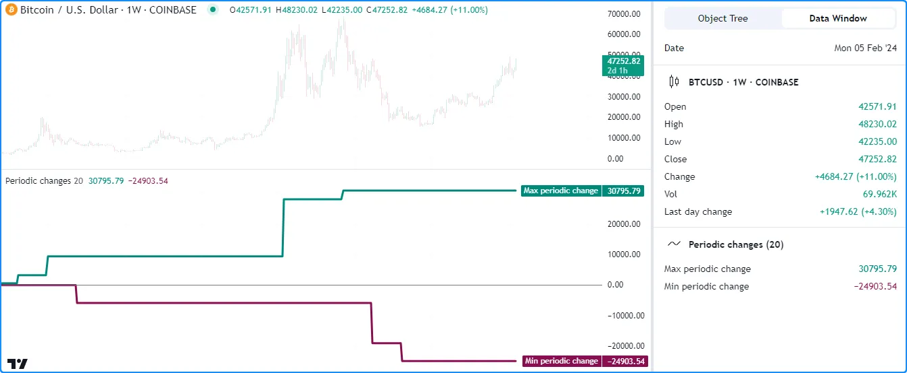

```c
//@version=5
indicator("Plotting numbers from local scopes demo", "Periodic changes")

//@variable The number of chart bars in each period.
int lengthInput = input.int(20, "Period length", 1)

//@variable The maximum `close` change over each `lengthInput` period on the chart.
var float maxChange = na
//@variable The minimum `close` change over each `lengthInput` period on the chart.
var float minChange = na

//@variable Is `true` once every `lengthInput` bars.
bool periodClose = bar_index % lengthInput == 0

if periodClose
    //@variable The change in `close` prices over `lengthInput` bars.
    float change = close - close[lengthInput]
    // Update the global `maxChange` and `minChange`.
    maxChange := math.max(nz(maxChange, change), change)
    minChange := math.min(nz(minChange, change), change)

// Plot the `maxChange` and `minChange`.
plot(maxChange, "Max periodic change", color.teal, 3)
plot(minChange, "Min periodic change", color.maroon, 3)
hline(0.0, color = color.gray, linestyle = hline.style_solid)
```

Para inspecionar o histórico da variável `change` usando um plot, é necessário atribuir seu valor a outra variável _global_ para uso em uma função `plot*()`.

Abaixo, foi adicionada uma variável `debugChange` com um valor inicial de [na](https://br.tradingview.com/pine-script-reference/v5/#var_na) no escopo global, e o script reatribui seu valor dentro da estrutura [if](https://br.tradingview.com/pine-script-reference/v5/#kw_if) usando a variável local `change`. Agora, é possível usar [plot()](https://br.tradingview.com/pine-script-reference/v5/#fun_plot) com a variável `debugChange` para visualizar o histórico de valores disponíveis em `change`:

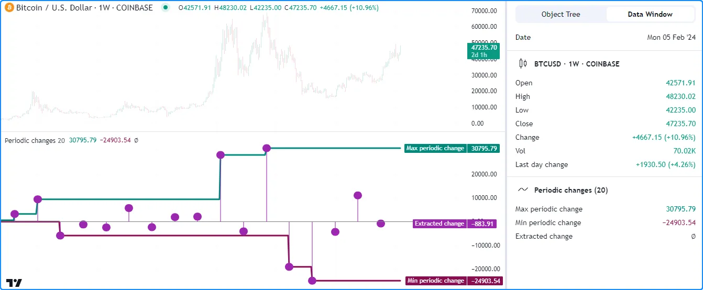

```c
//@version=5
indicator("Plotting numbers from local scopes demo", "Periodic changes")

//@variable The number of chart bars in each period.
int lengthInput = input.int(20, "Period length", 1)

//@variable The maximum `close` change over each `lengthInput` period on the chart.
var float maxChange = na
//@variable The minimum `close` change over each `lengthInput` period on the chart.
var float minChange = na

//@variable Is `true` once every `lengthInput` bars.
bool periodClose = bar_index % lengthInput == 0

//@variable Tracks the history of the local `change` variable.
float debugChange = na

if periodClose
    //@variable The change in `close` prices over `lengthInput` bars.
    float change = close - close[lengthInput]
    // Update the global `maxChange` and `minChange`.
    maxChange := math.max(nz(maxChange, change), change)
    minChange := math.min(nz(minChange, change), change)
    // Assign the `change` value to the `debugChange` variable.
    debugChange := change

// Plot the `maxChange` and `minChange`.
plot(maxChange, "Max periodic change", color.teal, 3)
plot(minChange, "Min periodic change", color.maroon, 3)
hline(0.0, color = color.gray, linestyle = hline.style_solid)

// Create a debug plot to visualize the `change` history.
plot(debugChange, "Extracted change", color.purple, 15, plot.style_areabr)
```

__Note que:__

- O script usa [plot.style_areabr](https://br.tradingview.com/pine-script-reference/v5/#const_plot.style_areabr) no plot de depuração, que não se conecta sobre valores [na](https://br.tradingview.com/pine-script-reference/v5/#var_na) como o estilo padrão faz.
- Quando o valor plotado da barra visível mais à direita é [na](https://br.tradingview.com/pine-script-reference/v5/#var_na), o número na escala de preços representa o último valor _não-na_ antes dessa barra, se existir.

## Com Desenhos

Uma abordagem alternativa para inspecionar graficamente o histórico de valores numéricos de um script é usar os [tipos de desenho](./04_09_tipagem_do_sistema.md#tipos-de-desenho) do Pine, incluindo [linhas](./05_12_lines_e_boxes.md#lines-linhas), [caixas](./05_12_lines_e_boxes.md#boxes-caixas), [polilinhas](./05_12_lines_e_boxes.md#polylines-polilinhas) e [labels](./05_20_text_e_shapes.md#labels).

Embora os desenhos do Pine não exibam resultados em nenhum outro lugar além do painel do gráfico, scripts podem criá-los a partir de _escopos locais_, incluindo os escopos de [funções](./04_11_funcoes_definidas_pelo_usuario.md) e [métodos](./04_13_metodos.md#métodos-definidos-pelo-usuário) (veja a seção [Depuração de funções](./06_02_debugging.md#depurando-funções) para saber mais). Além disso, scripts podem posicionar desenhos em _qualquer_ localização disponível no gráfico, independentemente do [bar_index](https://br.tradingview.com/pine-script-reference/v5/#var_bar_index) atual.

Por exemplo, ao revisitar o script "Periodic changes" da [seção anterior](./06_02_debugging.md#a-partir-de-escopos-locais), é possível inspecionar o histórico da variável local `change` _sem_ usar um plot. Neste caso, evita-se declarar uma variável global separada e, em vez disso, cria-se objetos de desenho diretamente do escopo local da estrutura [if](https://br.tradingview.com/pine-script-reference/v5/#kw_if).

O script abaixo é uma modificação do script anterior que usa [caixas](./05_12_lines_e_boxes.md#boxes-caixas) para visualizar o comportamento da variável `change`. Dentro do escopo da estrutura [if](https://br.tradingview.com/pine-script-reference/v5/#kw_if), ele chama [box.new()](https://br.tradingview.com/pine-script-reference/v5/#fun_box.new) para criar uma [caixa](https://br.tradingview.com/pine-script-reference/v5/#type_box) que se estende desde a barra `lengthInput` barras atrás até o [bar_index](https://br.tradingview.com/pine-script-reference/v5/#var_bar_index) atual:

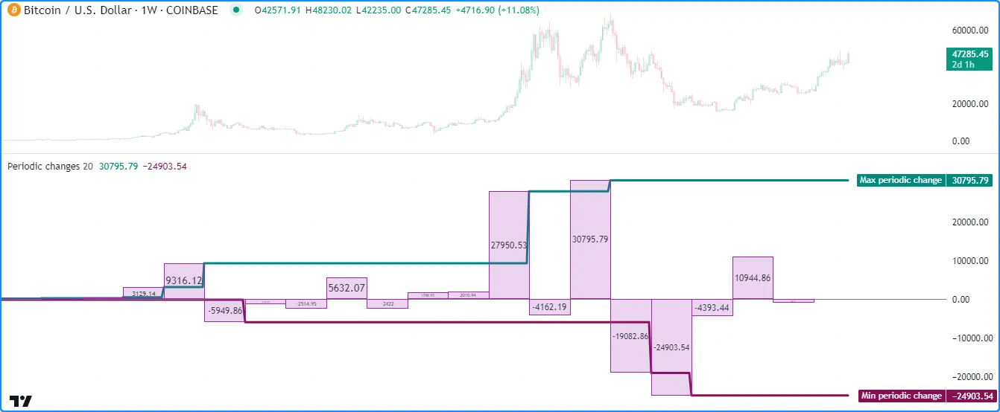

```c
//@version=5
indicator("Drawing numbers from local scopes demo", "Periodic changes", max_boxes_count = 500)

//@variable The number of chart bars in each period.
int lengthInput = input.int(20, "Period length", 1)

//@variable The maximum `close` change over each `lengthInput` period on the chart.
var float maxChange = na
//@variable The minimum `close` change over each `lengthInput` period on the chart.
var float minChange = na

//@variable Is `true` once every `lengthInput` bars.
bool periodClose = bar_index % lengthInput == 0

if periodClose
    //@variable The change in `close` prices over `lengthInput` bars.
    float change = close - close[lengthInput]
    // Update the global `maxChange` and `minChange`.
    maxChange := math.max(nz(maxChange, change), change)
    minChange := math.min(nz(minChange, change), change)
    //@variable Draws a box on the chart to visualize the `change` value.
    box debugBox = box.new(
         bar_index - lengthInput, math.max(change, 0.0), bar_index, math.min(change, 0.0),
         color.purple, bgcolor = color.new(color.purple, 80), text = str.tostring(change)
     )

// Plot the `maxChange` and `minChange`.
plot(maxChange, "Max periodic change", color.teal, 3)
plot(minChange, "Min periodic change", color.maroon, 3)
hline(0.0, color = color.gray, linestyle = hline.style_solid)
```

__Note que:__

- O script inclui `max_boxes_count = 500` na função [indicator()](https://br.tradingview.com/pine-script-reference/v5/#fun_indicator), o que permite mostrar até 500 [caixas](./05_12_lines_e_boxes.md#boxes-caixas) no gráfico.
- Foram usados [math.max(change, 0.0)](https://br.tradingview.com/pine-script-reference/v5/#fun_math.max) e [math.min(change, 0.0)](https://br.tradingview.com/pine-script-reference/v5/#fun_math.min) na função [box.new()](https://br.tradingview.com/pine-script-reference/v5/#fun_box.new) como os valores `top` e `bottom`.
- A chamada [box.new()](https://br.tradingview.com/pine-script-reference/v5/#fun_box.new) inclui [str.tostring(change)](https://br.tradingview.com/pine-script-reference/v5/#fun_str.tostring) como argumento `text` para exibir uma _"representação em string"_ do valor "float" da variável `change` em cada desenho de [caixa](https://br.tradingview.com/pine-script-reference/v5/#type_box). Veja [esta seção](./06_02_debugging.md#representando-outros-tipos) para mais informações sobre como representar dados com strings.

Para mais informações sobre o uso de [caixas](./05_12_lines_e_boxes.md#boxes-caixas) e outros [tipos de desenho](./04_09_tipagem_do_sistema.md#tipos-de-desenho) relacionados, veja a página [Linhas e Caixas](./05_12_lines_e_boxes.md) do Manual do Usuário.

## Condições

Muitos scripts criados no Pine envolvem declarar e avaliar _condições_ para ditar ações específicas do script, como acionar diferentes padrões de cálculo, visuais, sinais, alertas, ordens de estratégia, etc. Portanto, é essencial entender como inspecionar as condições que um script usa para garantir a execução adequada.

> __Observação!__\
> Esta seção discute técnicas de depuração baseadas em visuais de gráficos. Para saber mais sobre _registro_ de condições, veja a seção [Pine Logs](./06_02_debugging.md#pine-logs).

### Como Números

Uma maneira possível de depurar as condições de um script é definir _valores numéricos_ baseados nelas, o que permite inspecioná-las usando abordagens numéricas, como as descritas na [seção anterior](./06_02_debugging.md#valores-numéricos).

Um exemplo simples calcula a razão entre o preço [ohlc4](https://br.tradingview.com/pine-script-reference/v5/#var_ohlc4) e a [média móvel](https://br.tradingview.com/pine-script-reference/v5/#fun_ta.sma) de `lengthInput` barras. Ele atribui uma condição à variável `priceAbove` que retorna `true` sempre que o valor da razão excede 1 (ou seja, o preço está acima da média).

Para inspecionar as ocorrências da condição, foi criada uma variável `debugValue` atribuída ao resultado de uma expressão que usa o operador ternário [?:](https://br.tradingview.com/pine-script-reference/v5/#op_?:) para retornar 1 quando `priceAbove` é `true` e 0 caso contrário. O script plota o valor da variável em todos os locais disponíveis:

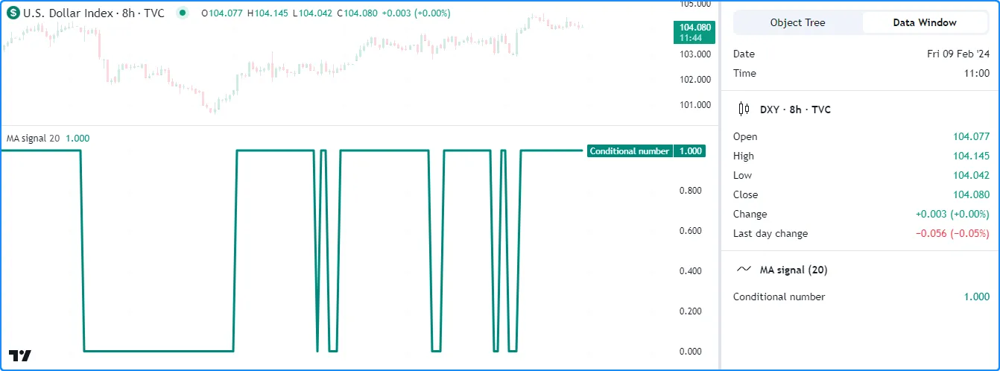

```c
//@version=5
indicator("Conditions as numbers demo", "MA signal")

//@variable The number of bars in the moving average calculation.
int lengthInput = input.int(20, "Length", 1)

//@variable The ratio of the `ohlc4` price to its `lengthInput`-bar moving average.
float ratio = ohlc4 / ta.sma(ohlc4, lengthInput)

//@variable The condition to inspect. Is `true` when `ohlc4` is above its moving average, `false` otherwise.
bool priceAbove = ratio > 1.0
//@variable Returns 1 when the `priceAbove` condition is `true`, 0 otherwise.
int debugValue = priceAbove ? 1 : 0

// Plot the `debugValue.
plot(debugValue, "Conditional number", color.teal, 3)
```

__Note que:__

- Representar valores "bool" usando números também permite que scripts exibam formas ou caracteres condicionais em locais específicos do eixo-y com [plotshape()](https://br.tradingview.com/pine-script-reference/v5/#fun_plotshape) e [plotchar()](https://br.tradingview.com/pine-script-reference/v5/#fun_plotchar), além de facilitar a depuração condicional com [plotarrow()](https://br.tradingview.com/pine-script-reference/v5/#fun_plotarrow). Veja a [próxima seção](./06_02_debugging.md#plotando-formas-condicionais) para saber mais.

### Plotando Formas Condicionais

As funções [plotshape()](https://br.tradingview.com/pine-script-reference/v5/#fun_plotshape) e [plotchar()](https://br.tradingview.com/pine-script-reference/v5/#fun_plotchar) são úteis para depurar condições, pois podem plotar formas ou caracteres em locais absolutos ou relativos do gráfico sempre que contiverem um argumento `true` ou _não-na_/_non-na_ `series`.

Essas funções também podem exibir representações _numéricas_ da `series` na linha de status do script e na "Janela de Dados", sendo também úteis para depurar [números](./06_02_debugging.md#valores-numéricos). Um modo simples e prático de depurar números com essas funções está demonstrado na seção [Dicas](./06_02_debugging.md#dicas).

Os locais dos plots no gráfico dependem do parâmetro `location`, que por padrão é [location.abovebar](https://br.tradingview.com/pine-script-reference/v5/#const_location.abovebar).

> __Observação!__\
> Ao usar [location.abovebar](https://br.tradingview.com/pine-script-reference/v5/#const_location.abovebar) ou [location.belowbar](https://br.tradingview.com/pine-script-reference/v5/#const_location.belowbar), a função posiciona as formas/caracteres em relação aos preços do _gráfico principal_. Se o script plota seus valores em um painel de gráfico separado, recomenda-se depurar com outras opções de `location` para evitar interferir na escala do painel.

Inspecionando uma condição usando essas funções, o script a seguir calcula um [RSI](https://br.tradingview.com/pine-script-reference/v5/#fun_ta.rsi) com um comprimento `lengthInput` e uma variável `crossBelow`, cujo valor é o resultado de uma condição que retorna `true` quando o RSI cruza abaixo de 30. Ele chama [plotshape()](https://br.tradingview.com/pine-script-reference/v5/#fun_plotshape) para exibir um círculo próximo ao topo do painel sempre que a condição ocorre:

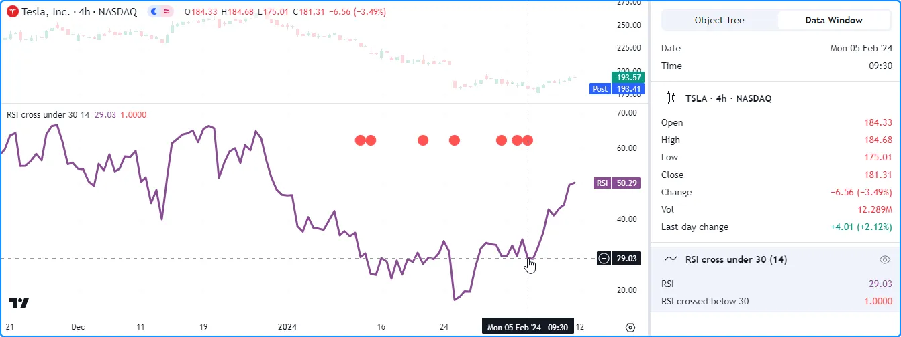

```c
//@version=5
indicator("Conditional shapes demo", "RSI cross under 30")

//@variable The length of the RSI.
int lengthInput = input.int(14, "Length", 1)

//@variable The calculated RSI value.
float rsi = ta.rsi(close, lengthInput)

//@variable Is `true` when the `rsi` crosses below 30, `false` otherwise.
bool crossBelow = ta.crossunder(rsi, 30.0)

// Plot the `rsi`.
plot(rsi, "RSI", color.rgb(136, 76, 146), linewidth = 3)
// Plot the `crossBelow` condition as circles near the top of the pane.
plotshape(crossBelow, "RSI crossed below 30", shape.circle, location.top, color.red, size = size.small)
```

__Note que:__

- A linha de status e a "Janela de Dados" exibem um valor de 1 quando `crossBelow` é `true` e 0 quando é `false`.

Para exibir as formas em locais _precisos_ em vez de relativos ao painel do gráfico, é possível usar [números condicionais](./06_02_debugging.md#valores-numéricos) e [location.absolute](https://br.tradingview.com/pine-script-reference/v5/#const_location.absolute) na chamada de [plotshape()](https://br.tradingview.com/pine-script-reference/v5/#fun_plotshape).

Neste exemplo, o script anterior foi modificado criando uma variável `debugNumber` que retorna o valor do `rsi` quando `crossBelow` é `true` e [na](https://br.tradingview.com/pine-script-reference/v5/#var_na) caso contrário. A função [plotshape()](https://br.tradingview.com/pine-script-reference/v5/#fun_plotshape) usa essa nova variável como argumento `series` e [location.absolute](https://br.tradingview.com/pine-script-reference/v5/#const_location.absolute) como argumento `location`:

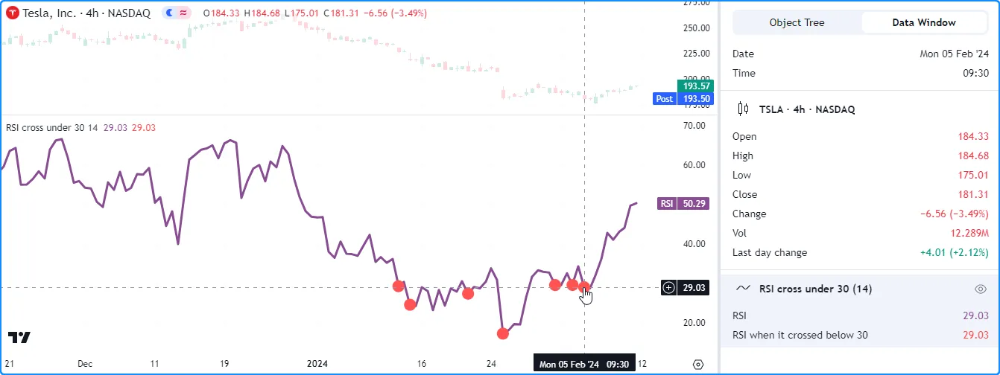

```c
//@version=5
indicator("Conditional shapes demo", "RSI cross under 30")

//@variable The length of the RSI.
int lengthInput = input.int(14, "Length", 1)

//@variable The calculated RSI value.
float rsi = ta.rsi(close, lengthInput)

//@variable Is `true` when the `rsi` crosses below 30, `false` otherwise.
bool crossBelow = ta.crossunder(rsi, 30.0)
//@variable Returns the `rsi` when `crossBelow` is `true`, `na` otherwise.
float debugNumber = crossBelow ? rsi : na

// Plot the `rsi`.
plot(rsi, "RSI", color.rgb(136, 76, 146), linewidth = 3)
// Plot circles at the `debugNumber`.
plotshape(debugNumber, "RSI when it crossed below 30", shape.circle, location.absolute, color.red, size = size.small)
```

__Note que:__

- Como foi passada uma série _numérica_ para a função, o plot condicional agora mostra os valores do `debugNumber` na linha de status e na "Janela de Dados" em vez de 1 ou 0.

Outro modo prático de depurar condições é usar [plotarrow()](https://br.tradingview.com/pine-script-reference/v5/#fun_plotarrow). Essa função plota uma seta com localização relativa aos preços do _gráfico principal_ sempre que o argumento `series` não é zero e não é [na](https://br.tradingview.com/pine-script-reference/v5/#var_na). O comprimento de cada seta varia com o valor da `series` fornecida. Assim como [plotshape()](https://br.tradingview.com/pine-script-reference/v5/#fun_plotshape) e [plotchar()](https://br.tradingview.com/pine-script-reference/v5/#fun_plotchar), [plotarrow()](https://br.tradingview.com/pine-script-reference/v5/#fun_plotarrow) também pode exibir resultados numéricos na linha de status e na "Janela de Dados" "_Data Window_".

> __Observação!__\
> Como essa função sempre posiciona setas em relação aos preços do gráfico principal, recomenda-se usá-la apenas se o script ocupar o painel do gráfico principal para evitar interferir na escala.

Este exemplo mostra um modo alternativo de inspecionar a condição `crossBelow` usando [plotarrow()](https://br.tradingview.com/pine-script-reference/v5/#fun_plotarrow). Nesta versão, `overlay` está definido como `true` na função [indicator()](https://br.tradingview.com/pine-script-reference/v5/#fun_indicator) e foi adicionada uma chamada de [plotarrow()](https://br.tradingview.com/pine-script-reference/v5/#fun_plotarrow) para visualizar os valores condicionais. O `debugNumber` neste exemplo mede o quanto o `rsi` caiu abaixo de 30 cada vez que a condição ocorre:

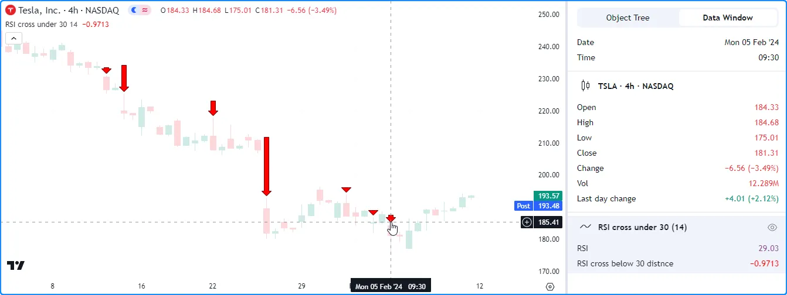

```c
//@version=5
indicator("Conditional shapes demo", "RSI cross under 30", true)

//@variable The length of the RSI.
int lengthInput = input.int(14, "Length", 1)

//@variable The calculated RSI value.
float rsi = ta.rsi(close, lengthInput)

//@variable Is `true` when the `rsi` crosses below 30, `false` otherwise.
bool crossBelow = ta.crossunder(rsi, 30.0)
//@variable Returns `rsi - 30.0` when `crossBelow` is `true`, `na` otherwise.
float debugNumber = crossBelow ? rsi - 30.0 : na

// Plot the `rsi`.
plot(rsi, "RSI", color.rgb(136, 76, 146), display = display.data_window)
// Plot circles at the `debugNumber`.
plotarrow(debugNumber, "RSI cross below 30 distnce")
```

__Note que:__

- O valor `display` na função [plot()](https://br.tradingview.com/pine-script-reference/v5/#fun_plot) do `rsi` foi definido como [display.data_window](https://br.tradingview.com/pine-script-reference/v5/#const_display.data_window) para [preservar a escala do gráfico](./06_02_debugging.md#sem-afetar-a-escala).

Para saber mais sobre [plotshape()](https://br.tradingview.com/pine-script-reference/v5/#fun_plotshape), [plotchar()](https://br.tradingview.com/pine-script-reference/v5/#fun_plotchar) e [plotarrow()](https://br.tradingview.com/pine-script-reference/v5/#fun_plotarrow), veja a página [Textos e Formas](./05_20_text_e_shapes.md) deste manual.

### Cores Condicionais

Uma maneira elegante de representar visualmente condições no Pine é criar expressões que retornem valores de [cor](./04_09_tipagem_do_sistema.md#color) com base nos estados `true` ou `false`, pois os scripts podem usá-los para controlar a aparência de [objetos de desenho](./04_09_tipagem_do_sistema.md#tipos-de-desenho) ou os resultados de chamadas `plot*()`, [fill()](https://br.tradingview.com/pine-script-reference/v5/#fun_fill), [bgcolor()](https://br.tradingview.com/pine-script-reference/v5/#fun_bgcolor) ou [barcolor()](https://br.tradingview.com/pine-script-reference/v5/#fun_barcolor).

> __Observação!__\
> Assim como as funções `plot*()`, scripts só podem chamar [fill()](https://br.tradingview.com/pine-script-reference/v5/#fun_fill), [bgcolor()](https://br.tradingview.com/pine-script-reference/v5/#fun_bgcolor) e [barcolor()](https://br.tradingview.com/pine-script-reference/v5/#fun_barcolor) a partir do _escopo global_, e as funções não podem aceitar variáveis locais.

Por exemplo, este script calcula a variação nos preços de [close](https://br.tradingview.com/pine-script-reference/v5/#var_close) ao longo de `lengthInput` barras e declara duas variáveis "bool" para identificar quando a variação de preço é positiva ou negativa.

O script usa esses valores "bool" como condições em expressões [ternárias](https://br.tradingview.com/pine-script-reference/v5/#op_?:) para atribuir os valores de três variáveis "color", e depois usa essas variáveis como argumentos `color` em [plot()](https://br.tradingview.com/pine-script-reference/v5/#fun_plot), [bgcolor()](https://br.tradingview.com/pine-script-reference/v5/#fun_bgcolor) e [barcolor()](https://br.tradingview.com/pine-script-reference/v5/#fun_barcolor) para depurar os resultados:

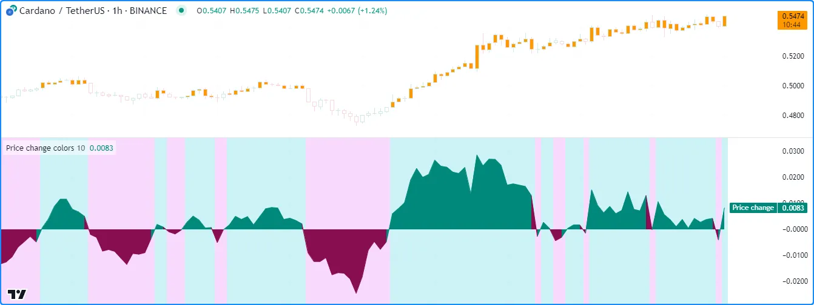

```c
//@version=5
indicator("Conditional colors demo", "Price change colors")

//@variable The number of bars in the price change calculation.
int lengthInput = input.int(10, "Length", 1)

//@variable The change in `close` prices over `lengthInput` bars.
float priceChange = ta.change(close, lengthInput)

//@variable Is `true` when the `priceChange` is a positive value, `false` otherwise.
bool isPositive = priceChange > 0
//@variable Is `true` when the `priceChange` is a negative value, `false` otherwise.
bool isNegative = priceChange < 0

//@variable Returns a color for the `priceChange` plot to show when `isPositive`, `isNegative`, or neither occurs.
color plotColor = isPositive ? color.teal : isNegative ? color.maroon : chart.fg_color
//@variable Returns an 80% transparent color for the background when `isPositive` or `isNegative`, `na` otherwise.
color bgColor = isPositive ? color.new(color.aqua, 80) : isNegative ? color.new(color.fuchsia, 80) : na
//@variable Returns a color to emphasize chart bars when `isPositive` occurs. Otherwise, returns the `chart.bg_color`.
color barColor = isPositive ? color.orange : chart.bg_color

// Plot the `priceChange` and color it with the `plotColor`.
plot(priceChange, "Price change", plotColor, style = plot.style_area)
// Highlight the pane's background with the `bgColor`.
bgcolor(bgColor, title = "Background highlight")
// Emphasize the chart bars with positive price change using the `barColor`.
barcolor(barColor, title = "Positive change bars")
```

__Note que:__

- A função [barcolor()](https://br.tradingview.com/pine-script-reference/v5/#fun_barcolor) sempre colore as barras do gráfico principal, independentemente de o script ocupar outro painel do gráfico, e o gráfico só exibirá os resultados se as barras estiverem visíveis.

Veja as páginas [Cores](./05_07_cores.md), [Preenchimentos](./05_08_fills.md), [Backgrounds](./05_02_background.md) e [Coloração de Barras](./05_03_coloracao_de_barras.md) para mais informações sobre como trabalhar com cores, preencher plots, destacar fundos e colorir barras.

### Usando Desenhos

Os [tipos de desenho](./04_09_tipagem_do_sistema.md#tipos-de-desenho) do Pine Script fornecem maneiras flexíveis de visualizar condições no gráfico, especialmente quando as condições estão dentro de escopos locais.

Considere o seguinte script, que calcula um `filter` personalizado com um parâmetro de suavização (`alpha`) que altera seu valor dentro de uma estrutura [if](https://br.tradingview.com/pine-script-reference/v5/#kw_if) com base nas condições recentes de [volume](https://br.tradingview.com/pine-script-reference/v5/#var_volume):

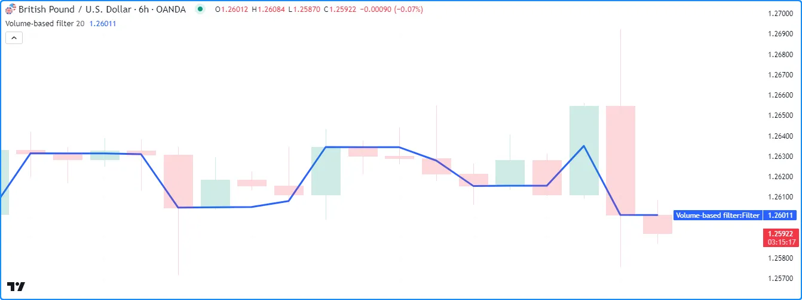

```c
//@version=5
indicator("Conditional drawings demo", "Volume-based filter", true)

//@variable The number of bars in the volume average.
int lengthInput = input.int(20, "Volume average length", 1)

//@variable The average `volume` over `lengthInput` bars.
float avgVolume = ta.sma(volume, lengthInput)

//@variable A custom price filter based on volume activity.
float filter = close
//@variable The smoothing parameter of the filter calculation. Its value depends on multiple volume conditions.
float alpha = na

// Set the `alpha` to 1 if `volume` exceeds its `lengthInput`-bar moving average.
if volume > avgVolume
    alpha := 1.0
// Set the `alpha` to 0.5 if `volume` exceeds its previous value.
else if volume > volume[1]
    alpha := 0.5
// Set the `alpha` to 0.01 otherwise.
else
    alpha := 0.01

// Calculate the new `filter` value.
filter := (1.0 - alpha) * nz(filter[1], filter) + alpha * close

// Plot the `filter`.
plot(filter, "Filter", linewidth = 3)
```

Para inspecionar as condições que controlam o valor de `alpha`, é possível usar vários métodos visuais no gráfico. No entanto, algumas abordagens exigem mais código e um tratamento cuidadoso.

Por exemplo, para visualizar as condições da estrutura [if](https://br.tradingview.com/pine-script-reference/v5/#kw_if) usando [formas plotadas](./06_02_debugging.md#plotando-formas-condicionais) ou [cores de fundo](./06_02_debugging.md#cores-condicionais), seria necessário criar variáveis ou expressões adicionais no escopo global para as funções `plot*()` ou [bgcolor()](https://br.tradingview.com/pine-script-reference/v5/#fun_bgcolor).

Alternativamente, é possível usar [tipos de desenho](./04_09_tipagem_do_sistema.md#tipos-de-desenho) para visualizar as condições de forma concisa sem esses passos extras.

A seguir, uma modificação do script anterior que chama [label.new()](https://br.tradingview.com/pine-script-reference/v5/#fun_label.new) dentro de ramificações específicas da [estrutura condicional](./04_07_estruturas_condicionais.md) para desenhar [labels](./05_20_text_e_shapes.md#labels) no gráfico sempre que essas ramificações são executadas. Essas alterações simples permitem identificar essas condições no gráfico com pouco código adicional:

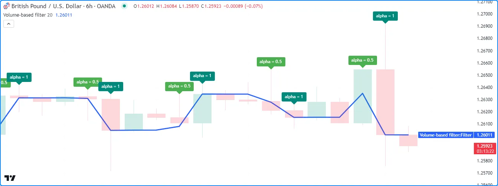

```c
//@version=5
indicator("Conditional drawings demo", "Volume-based filter", true, max_labels_count = 500)

//@variable The number of bars in the volume average.
int lengthInput = input.int(20, "Volume average length", 1)

//@variable The average `volume` over `lengthInput` bars.
float avgVolume = ta.sma(volume, lengthInput)

//@variable A custom price filter based on volume activity.
float filter = close
//@variable The smoothing parameter of the filter calculation. Its value depends on multiple volume conditions.
float alpha = na

// Set the `alpha` to 1 if `volume` exceeds its `lengthInput`-bar moving average.
if volume > avgVolume
    // Add debug label.
    label.new(chart.point.now(high), "alpha = 1", color = color.teal, textcolor = color.white)
    alpha := 1.0
// Set the `alpha` to 0.5 if `volume` exceeds its previous value.
else if volume > volume[1]
    // Add debug label.
    label.new(chart.point.now(high), "alpha = 0.5", color = color.green, textcolor = color.white)
    alpha := 0.5
// Set the `alpha` to 0.01 otherwise.
else
    alpha := 0.01

// Calculate the new `filter` value.
filter := (1.0 - alpha) * nz(filter[1], filter) + alpha * close

// Plot the `filter`.
plot(filter, "Filter", linewidth = 3)
```

__Note que:__

- As chamadas de [label.new()](https://br.tradingview.com/pine-script-reference/v5/#fun_label.new) foram adicionadas _acima_ das expressões de reatribuição de `alpha`, pois os tipos retornados de cada ramificação na estrutura [if](https://br.tradingview.com/pine-script-reference/v5/#kw_if) devem coincidir.
- A função [indicator()](https://br.tradingview.com/pine-script-reference/v5/#fun_indicator) inclui `max_labels_count = 500` para especificar que o script pode mostrar até 500 [labels](./05_20_text_e_shapes.md#labels) no gráfico.

### Condições Compostas e Aninhadas

Ao precisar identificar situações em que mais de uma condição pode ocorrer, é possível construir _condições compostas_ agregando condições individuais com operadores lógicos ([and](https://br.tradingview.com/pine-script-reference/v5/#kw_and), [or](https://br.tradingview.com/pine-script-reference/v5/#kw_or)).

Por exemplo, esta linha de código mostra uma variável `compoundCondition` que só retorna `true` se `condition1` e `condition2` ou `condition3` ocorrerem:

```c
bool compoundCondition = condition1 and (condition2 or condition3)
```

Alternativamente, é possível criar _condições aninhadas_ usando [estruturas condicionais](./04_07_estruturas_condicionais.md) ou [expressões ternárias](https://br.tradingview.com/pine-script-reference/v5/#op_?:). Por exemplo, esta estrutura [if](https://br.tradingview.com/pine-script-reference/v5/#kw_if) atribui `true` à variável `nestedCondition` se `condition1` e `condition2` ou `condition3` ocorrerem. No entanto, diferentemente da expressão lógica acima, as ramificações dessa estrutura também permitem que o script execute código adicional antes de atribuir o valor "bool":

```c
bool nestedCondition = false

if condition1
    // [additional_code]
    if condition2
        // [additional_code]
        nestedCondition := true
    else if condition3
        // [additional_code]
        nestedCondition := true
```

Em ambos os casos, seja trabalhando com condições compostas ou aninhadas no código, é importante validar os comportamentos das _condições individuais_ que as compõem para garantir que funcionem conforme o esperado.

Por exemplo, este script calcula um `rsi` e a `mediana` do `rsi` ao longo de `lengthInput` barras. Em seguida, cria cinco variáveis para representar diferentes condições singulares. O script usa essas variáveis em uma expressão lógica para atribuir um valor "bool" à variável `compoundCondition` e exibe os resultados de `compoundCondition` usando uma [cor de fundo condicional](./06_02_debugging.md#cores-condicionais):

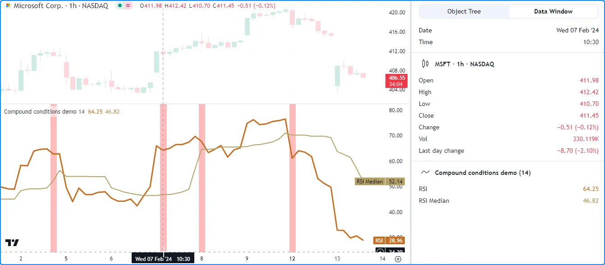

```c
//@version=5
indicator("Compound conditions demo")

//@variable The length of the RSI and median RSI calculations.
int lengthInput = input.int(14, "Length", 2)

//@variable The `lengthInput`-bar RSI.
float rsi = ta.rsi(close, lengthInput)
//@variable The `lengthInput`-bar median of the `rsi`.
float median = ta.median(rsi, lengthInput)

//@variable Condition #1: Is `true` when the 1-bar `rsi` change switches from 1 to -1.
bool changeNegative = ta.change(math.sign(ta.change(rsi))) == -2
//@variable Condition #2: Is `true` when the previous bar's `rsi` is greater than 70.
bool prevAbove70 = rsi[1] > 70.0
//@variable Condition #3: Is `true` when the current `close` is lower than the previous bar's `open`.
bool closeBelow = close < open[1]
//@variable Condition #4: Is `true` when the `rsi` is between 60 and 70.
bool betweenLevels = bool(math.max(70.0 - rsi, 0.0) * math.max(rsi - 60.0, 0.0))
//@variable Condition #5: Is `true` when the `rsi` is above the `median`.
bool aboveMedian = rsi > median

//@variable Is `true` when the first condition occurs alongside conditions 2 and 3 or 4 and 5.
bool compundCondition = changeNegative and ((prevAbove70 and closeBelow) or (betweenLevels and aboveMedian))

//Plot the `rsi` and the `median`.
plot(rsi, "RSI", color.rgb(201, 109, 34), 3)
plot(median, "RSI Median", color.rgb(180, 160, 102), 2)

// Highlight the background red when the `compundCondition` occurs.
bgcolor(compundCondition ? color.new(color.red, 60) : na, title = "compundCondition")
```

Visualizando apenas o resultado final de `compoundCondition` não é fácil entender seu comportamento, pois cinco condições singulares subjacentes determinam o valor final. Para depurar `compoundCondition` de forma eficaz, também é necessário inspecionar as condições que a compõem.

No exemplo abaixo, foram adicionadas cinco chamadas de [plotchar()](https://br.tradingview.com/pine-script-reference/v5/#fun_plotchar) para exibir [caracteres](./06_02_debugging.md#plotando-formas-condicionais) no gráfico e valores numéricos na linha de status e na "Janela de Dados" quando cada condição singular ocorre. Inspecionar cada um desses resultados fornece informações mais completas sobre o comportamento de `compoundCondition`:

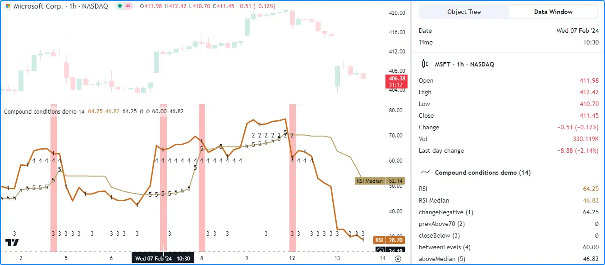

```c
//@version=5
indicator("Compound conditions demo")

//@variable The length of the RSI and median RSI calculations.
int lengthInput = input.int(14, "Length", 2)

//@variable The `lengthInput`-bar RSI.
float rsi = ta.rsi(close, lengthInput)
//@variable The `lengthInput`-bar median of the `rsi`.
float median = ta.median(rsi, lengthInput)

//@variable Condition #1: Is `true` when the 1-bar `rsi` change switches from 1 to -1.
bool changeNegative = ta.change(math.sign(ta.change(rsi))) == -2
//@variable Condition #2: Is `true` when the previous bar's `rsi` is greater than 70.
bool prevAbove70 = rsi[1] > 70.0
//@variable Condition #3: Is `true` when the current `close` is lower than the previous bar's `open`.
bool closeBelow = close < open[1]
//@variable Condition #4: Is `true` when the `rsi` is between 60 and 70.
bool betweenLevels = bool(math.max(70.0 - rsi, 0.0) * math.max(rsi - 60.0, 0.0))
//@variable Condition #5: Is `true` when the `rsi` is above the `median`.
bool aboveMedian = rsi > median

//@variable Is `true` when the first condition occurs alongside conditions 2 and 3 or 4 and 5.
bool compundCondition = changeNegative and ((prevAbove70 and closeBelow) or (betweenLevels and aboveMedian))

//Plot the `rsi` and the `median`.
plot(rsi, "RSI", color.rgb(201, 109, 34), 3)
plot(median, "RSI Median", color.rgb(180, 160, 102), 2)

// Highlight the background red when the `compundCondition` occurs.
bgcolor(compundCondition ? color.new(color.red, 60) : na, title = "compundCondition")

// Plot characters on the chart when conditions 1-5 occur.
plotchar(changeNegative ? rsi : na, "changeNegative (1)", "1", location.absolute, chart.fg_color)
plotchar(prevAbove70 ? 70.0 : na, "prevAbove70 (2)", "2", location.absolute, chart.fg_color)
plotchar(closeBelow ? close : na, "closeBelow (3)", "3", location.bottom, chart.fg_color)
plotchar(betweenLevels ? 60 : na, "betweenLevels (4)", "4", location.absolute, chart.fg_color)
plotchar(aboveMedian ? median : na, "aboveMedian (5)", "5", location.absolute, chart.fg_color)
```

__Note que:__

- Cada chamada de [plotchar()](https://br.tradingview.com/pine-script-reference/v5/#fun_plotchar) usa um [número condicional](./06_02_debugging.md#como-números) como argumento `series`. As funções exibem os valores numéricos na linha de status e na "Janela de Dados" "_Data Window_".
- Todas as chamadas de [plotchar()](https://br.tradingview.com/pine-script-reference/v5/#fun_plotchar), exceto a da condição `closeBelow`, usam [location.absolute](https://br.tradingview.com/pine-script-reference/v5/#const_location.absolute) como argumento `location` para exibir caracteres em locais precisos sempre que sua `series` não for [na](https://br.tradingview.com/pine-script-reference/v5/#var_na) (ou seja, a condição ocorre). A chamada para `closeBelow` usa [location.bottom](https://br.tradingview.com/pine-script-reference/v5/#const_location.bottom) para exibir seus caracteres próximo à parte inferior do painel.
- Nos exemplos desta seção, foram atribuídas condições individuais a variáveis separadas com nomes e anotações diretas. Embora esse formato não seja obrigatório para criar uma condição composta, pois é possível combinar condições diretamente dentro de uma expressão lógica, ele torna o código mais legível e fácil de depurar, conforme explicado na seção [Dicas](./06_02_debugging.md#dicas).

## Strings

[Strings](./04_09_tipagem_do_sistema.md#string) são sequências de caracteres alfanuméricos, de controle e outros (por exemplo, Unicode). São úteis na depuração de scripts, pois permitem representar os tipos de dados do script como texto legível e inspecioná-los com [tipos de desenho](./04_09_tipagem_do_sistema.md#tipos-de-desenho) que possuem propriedades relacionadas a texto, ou usando [Pine Logs](./06_02_debugging.md#pine-logs).

> __Observação!__\
> Esta seção discute conversões de "string" e inspeção de strings via [labels](./05_20_text_e_shapes.md#labels) e [tabelas](./05_19_tables.md). [Caixas](./05_12_lines_e_boxes.md#boxes-caixas) também podem exibir texto. No entanto, sua utilidade para depurar strings é mais limitada do que as técnicas abordadas nesta seção e na seção [Pine Logs](./06_02_debugging.md#pine-logs).

### Representando Outros Tipos

Os usuários podem criar representações em "string" de praticamente qualquer tipo de dado, facilitando a depuração eficaz quando outras abordagens podem não ser suficientes. Antes de explorar técnicas de inspeção com "string", será revisado brevemente maneiras de _representar_ os dados de um script usando strings.

O Pine Script inclui lógica predefinida para construir representações em "string" de vários outros tipos incorporados, como [int](./04_09_tipagem_do_sistema.md#int), [float](./04_09_tipagem_do_sistema.md#float), [bool](./04_09_tipagem_do_sistema.md#bool), [array](./04_14_arrays.md) e [matrix](./04_15_matrices.md). Scripts podem representar convenientemente esses tipos como strings por meio das funções [str.tostring()](https://br.tradingview.com/pine-script-reference/v5/#fun_str.tostring) e [str.format()](https://br.tradingview.com/pine-script-reference/v5/#fun_str.format).

Por exemplo, este trecho de código cria strings para representar múltiplos valores usando essas funções:

```c
//@variable Returns: "1.25"
string floatRepr = str.tostring(1.25)
//@variable Returns: "1"
string rounded0 = str.tostring(1.25, "#")
//@variable Returns: "1.3"
string rounded1 = str.tostring(1.25, "#.#")
//@variable Returns: "1.2500"
string trailingZeros = str.tostring(1.25, "#.0000")
//@variable Returns: "true"
string trueRepr = str.tostring(true)
//@variable Returns: "false"
string falseRepr = str.tostring(5 == 3)
//@variable Returns: "[1, 2, -3.14]"
string floatArrayRepr = str.tostring(array.from(1, 2.0, -3.14))
//@variable Returns: "[2, 20, 0]"
string roundedArrayRepr = str.tostring(array.from(2.22, 19.6, -0.43), "#")
//@variable Returns: "[Hello, World, !]"
string stringArrayRepr = str.tostring(array.from("Hello", "World", "!"))
//@variable Returns: "Test: 2.718 ^ 2 > 5: true"
string mixedTypeRepr = str.format("{0}{1, number, #.###} ^ 2 > {2}: {3}", "Test: ", math.e, 5, math.e * math.e > 5)

//@variable Combines all the above strings into a multi-line string.
string combined = str.format(
     "{0}\n{1}\n{2}\n{3}\n{4}\n{5}\n{6}\n{7}\n{8}\n{9}",
     floatRepr, rounded0, rounded1, trailingZeros, trueRepr,
     falseRepr, floatArrayRepr, roundedArrayRepr, stringArrayRepr,
     mixedTypeRepr
 )
```

Ao trabalhar com valores "int" que simbolizam timestamps UNIX, como os retornados por funções e variáveis relacionadas ao tempo, também é possível usar [str.format()](https://br.tradingview.com/pine-script-reference/v5/#fun_str.format) ou [str.format_time()](https://br.tradingview.com/pine-script-reference/v5/#fun_str.format_time) para convertê-los em strings de data legíveis. Este bloco de código demonstra várias maneiras de converter um timestamp usando essas funções:

```c
//@variable A UNIX timestamp, in milliseconds.
int unixTime = 1279411200000

//@variable Returns: "2010-07-18T00:00:00+0000"
string default = str.format_time(unixTime)
//@variable Returns: "2010-07-18"
string ymdRepr = str.format_time(unixTime, "yyyy-MM-dd")
//@variable Returns: "07-18-2010"
string mdyRepr = str.format_time(unixTime, "MM-dd-yyyy")
//@variable Returns: "20:00:00, 2010-07-17"
string hmsymdRepr = str.format_time(unixTime, "HH:mm:ss, yyyy-MM-dd", "America/New_York")
//@variable Returns: "Year: 2010, Month: 07, Day: 18, Time: 12:00:00"
string customFormat = str.format(
     "Year: {0, time, yyyy}, Month: {1, time, MM}, Day: {2, time, dd}, Time: {3, time, hh:mm:ss}",
     unixTime, unixTime, unixTime, unixTime
 )
```

Ao trabalhar com tipos que _não_ possuem representações em "string" incorporadas, como [color](./04_09_tipagem_do_sistema.md#color), [map](./04_16_mapas.md), [tipos definidos pelo usuário](./04_09_tipagem_do_sistema.md#tipos-definidos-pelo-usuário), etc., os programadores podem usar lógica personalizada ou formatação para construir representações. Por exemplo, este código chama [str.format()](https://br.tradingview.com/pine-script-reference/v5/#fun_str.format) para representar um valor "color" usando seus componentes [r](https://br.tradingview.com/pine-script-reference/v5/#fun_color.r), [g](https://br.tradingview.com/pine-script-reference/v5/#fun_color.g), [b](https://br.tradingview.com/pine-script-reference/v5/#fun_color.b) e [t](https://br.tradingview.com/pine-script-reference/v5/#fun_color.t):

```c
//@variable The built-in `color.maroon` value with 17% transparency.
color myColor = color.new(color.maroon, 17)

// Get the red, green, blue, and transparency components from `myColor`.
float r = color.r(myColor)
float g = color.g(myColor)
float b = color.b(myColor)
float t = color.t(myColor)

//@variable Returns: "color (r = 136, g = 14, b = 79, t = 17)"
string customRepr = str.format("color (r = {0}, g = {1}, b = {2}, t = {3})", r, g, b, t)
```

Existem inúmeras maneiras de representar dados usando strings. Ao escolher formatos de string para depuração, assegure-se de que os resultados sejam __legíveis__ e forneçam informações suficientes para uma inspeção adequada. Os segmentos a seguir explicam maneiras de validar strings exibindo-as no gráfico usando [labels](./05_20_text_e_shapes.md#labels), e a seção posterior explica como exibir strings como mensagens no painel [Pine Logs](./06_02_debugging.md#pine-logs).

### Usando _Labels_

[Labels](./05_20_text_e_shapes.md#labels) permitem que scripts exibam texto dinâmico ("series strings") em qualquer localização disponível no gráfico. Onde exibir esse texto no gráfico depende das informações que o programador deseja inspecionar e de suas preferências de depuração.

#### Em Barras Sucessivas

Ao inspecionar o histórico de valores que afetam a escala do gráfico ou ao trabalhar com múltiplas séries que possuem tipos diferentes, uma abordagem simples e útil para depuração é desenhar [labels](./05_20_text_e_shapes.md#labels) que exibem [representações em string](./06_02_debugging.md#representando-outros-tipos) em barras sucessivas.

Por exemplo, este script calcula quatro séries: `highestClose`, `percentRank`, `barsSinceHigh` e `isLow`. Ele usa [str.format()](https://br.tradingview.com/pine-script-reference/v5/#fun_str.format) para criar uma "string" formatada representando os valores das séries e um timestamp, e então chama [label.new()](https://br.tradingview.com/pine-script-reference/v5/#fun_label.new) para desenhar uma [label](https://br.tradingview.com/pine-script-reference/v5/#type_label) que exibe os resultados no [high](https://br.tradingview.com/pine-script-reference/v5/#var_high) de cada barra:

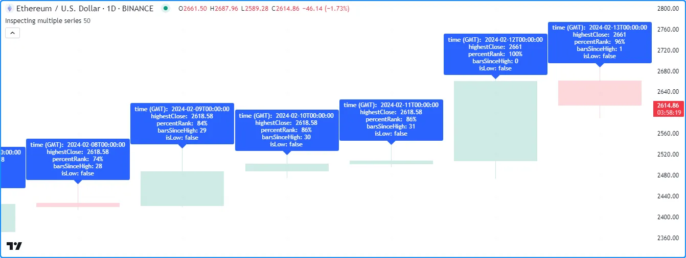

```c
//@version=5
indicator("Labels on successive bars demo", "Inspecting multiple series", true, max_labels_count = 500)

//@variable The number of bars in the calculation window.
int lengthInput = input.int(50, "Length", 1)

//@variable The highest `close` over `lengthInput` bars.
float highestClose = ta.highest(close, lengthInput)
//@variable The percent rank of the current `close` compared to previous values over `lengthInput` bars.
float percentRank = ta.percentrank(close, lengthInput)
//@variable The number of bars since the `close` was equal to the `highestClose`.
int barsSinceHigh = ta.barssince(close == highestClose)
//@variable Is `true` when the `percentRank` is 0, i.e., when the `close` is the lowest.
bool isLow = percentRank == 0.0

//@variable A multi-line string representing the `time`, `highestClose`, `percentRank`, `barsSinceHigh`, and `isLow`.
string debugString = str.format(
     "time (GMT): {0, time, yyyy-MM-dd'T'HH:mm:ss}\nhighestClose: {1, number, #.####}
     \npercentRank: {2, number, #.##}%\nbarsSinceHigh: {3, number, integer}\nisLow: {4}",
     time, highestClose, percentRank, barsSinceHigh, isLow
 )

//@variable Draws a label showing the `debugString` at each bar's `high`.
label debugLabel = label.new(chart.point.now(high), debugString, textcolor = color.white)
```

Embora o exemplo acima permita inspecionar os resultados das séries do script em qualquer barra com um desenho de [label](https://br.tradingview.com/pine-script-reference/v5/#type_label), desenhos consecutivos como esses podem desorganizar o gráfico, especialmente ao visualizar strings mais longas.

Uma maneira alternativa, mais compacta visualmente, de inspecionar os valores de barras sucessivas com [labels](./05_20_text_e_shapes.md#labels) é utilizar a propriedade `tooltip` em vez da propriedade `text`, já que uma [label](https://br.tradingview.com/pine-script-reference/v5/#type_label) só mostrará seu tooltip quando o cursor _pairar_ sobre ela.

A seguir, o script anterior foi modificado usando `debugString` como argumento `tooltip` em vez de `text` na chamada de [label.new()](https://br.tradingview.com/pine-script-reference/v5/#fun_label.new). Agora, é possível visualizar os resultados em barras específicas sem o ruído extra:

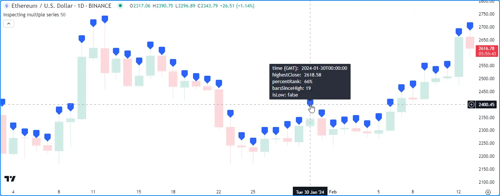

```c
//@version=5
indicator("Tooltips on successive bars demo", "Inspecting multiple series", true, max_labels_count = 500)

//@variable The number of bars in the calculation window.
int lengthInput = input.int(50, "Length", 1)

//@variable The highest `close` over `lengthInput` bars.
float highestClose = ta.highest(close, lengthInput)
//@variable The percent rank of the current `close` compared to previous values over `lengthInput` bars.
float percentRank = ta.percentrank(close, lengthInput)
//@variable The number of bars since the `close` was equal to the `highestClose`.
int barsSinceHigh = ta.barssince(close == highestClose)
//@variable Is `true` when the `percentRank` is 0, i.e., when the `close` is the lowest.
bool isLow = percentRank == 0.0

//@variable A multi-line string representing the `time`, `highestClose`, `percentRank`, `barsSinceHigh`, and `isLow`.
string debugString = str.format(
     "time (GMT): {0, time, yyyy-MM-dd'T'HH:mm:ss}\nhighestClose: {1, number, #.####}
     \npercentRank: {2, number, #.##}%\nbarsSinceHigh: {3, number, integer}\nisLow: {4}",
     time, highestClose, percentRank, barsSinceHigh, isLow
 )

//@variable Draws a label showing the `debugString` in a tooltip at each bar's `high`.
label debugLabel = label.new(chart.point.now(high), tooltip = debugString)
```

É importante notar que um script pode exibir até 500 desenhos de [label](https://br.tradingview.com/pine-script-reference/v5/#type_label), o que significa que os exemplos acima permitirão inspecionar as strings das 500 barras mais recentes do gráfico.

Se um programador deseja ver os resultados de barras _anteriores_ do gráfico, uma abordagem é criar uma lógica condicional que permita desenhos apenas dentro de um _timeframe_ específico, por exemplo:

```c
if time >= startTime and time <= endTime
    <create_drawing_id>
```

Se essa estrutura for utilizada no exemplo anterior com [chart.left_visible_bar_time](https://br.tradingview.com/pine-script-reference/v5/#var_chart.left_visible_bar_time) e [chart.right_visible_bar_time](https://br.tradingview.com/pine-script-reference/v5/#var_chart.right_visible_bar_time) como valores `startTime` e `endTime`, o script só criará [labels](./05_20_text_e_shapes.md#labels) nas __barras visíveis do gráfico__ e evitará desenhar em outras. Com essa lógica, é possível rolar para visualizar labels em _qualquer_ barra do gráfico, desde que haja até `max_labels_count` barras no intervalo visível:

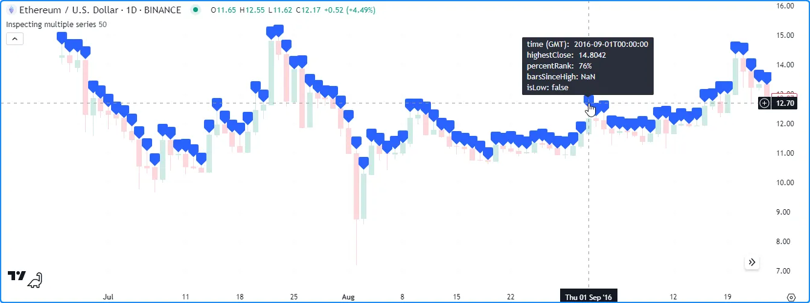

```c
//@version=5
indicator("Tooltips on visible bars demo", "Inspecting multiple series", true, max_labels_count = 500)

//@variable The number of bars in the calculation window.
int lengthInput = input.int(50, "Length", 1)

//@variable The highest `close` over `lengthInput` bars.
float highestClose = ta.highest(close, lengthInput)
//@variable The percent rank of the current `close` compared to previous values over `lengthInput` bars.
float percentRank = ta.percentrank(close, lengthInput)
//@variable The number of bars since the `close` was equal to the `highestClose`.
int barsSinceHigh = ta.barssince(close == highestClose)
//@variable Is `true` when the `percentRank` is 0, i.e., when the `close` is the lowest.
bool isLow = percentRank == 0.0

//@variable A multi-line string representing the `time`, `highestClose`, `percentRank`, `barsSinceHigh`, and `isLow`.
string debugString = str.format(
     "time (GMT): {0, time, yyyy-MM-dd'T'HH:mm:ss}\nhighestClose: {1, number, #.####}
     \npercentRank: {2, number, #.##}%\nbarsSinceHigh: {3, number, integer}\nisLow: {4}",
     time, highestClose, percentRank, barsSinceHigh, isLow
 )

if time >= chart.left_visible_bar_time and time <= chart.right_visible_bar_time
    //@variable Draws a label showing the `debugString` in a tooltip at each visible bar's `high`.
    label debugLabel = label.new(chart.point.now(high), tooltip = debugString)
```

__Note que:__

- Se o gráfico visível contiver mais barras do que os desenhos permitidos, o script só mostrará resultados nas barras mais recentes do intervalo visível. Para melhores resultados com esta técnica, dê zoom no gráfico para manter o intervalo visível limitado ao número permitido de desenhos.

### No Final do Gráfico

Uma abordagem frequente para depurar as strings de um script com [labels](./05_20_text_e_shapes.md#labels) é exibi-las no _final_ do gráfico, especialmente quando as strings não mudam ou quando apenas os valores de uma barra específica precisam ser analisados.

O script abaixo contém uma função definida pelo usuário `printLabel()`, que desenha uma [label](https://br.tradingview.com/pine-script-reference/v5/#type_label) no último tempo disponível no gráfico, independentemente de quando o script a chama. Nesta exemplo, a função é utilizada para exibir uma string "Hello world!", algumas informações básicas do gráfico e os valores atuais de OHLCV do feed de dados:

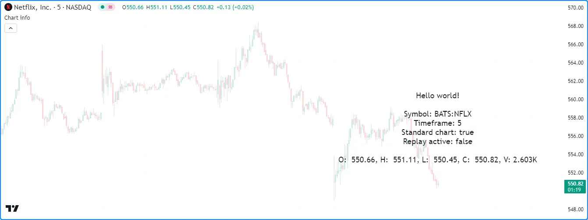

```c
//@version=5
indicator("Labels at the end of the chart demo", "Chart info", true)

//@function     Draws a label to print the `txt` at the last available time on the chart.
//              When called from the global scope, the label updates its text using the specified `txt` on every bar.
//@param txt    The string to display on the chart.
//@param price  The optional y-axis location of the label. If not specified, draws the label above the last chart bar.
//@returns      The resulting label ID.
printLabel(string txt, float price = na) =>
    int labelTime = math.max(last_bar_time, chart.right_visible_bar_time)
    var label result = label.new(
         labelTime, na, txt, xloc.bar_time, na(price) ? yloc.abovebar : yloc.price, na,
         label.style_none, chart.fg_color, size.large
     )
    label.set_text(result, txt)
    label.set_y(result, price)
    result

//@variable A formatted string containing information about the current chart.
string chartInfo = str.format(
     "Symbol: {0}:{1}\nTimeframe: {2}\nStandard chart: {3}\nReplay active: {4}",
     syminfo.prefix, syminfo.ticker, timeframe.period, chart.is_standard,
     str.contains(syminfo.tickerid, "replay")
 )

//@variable A formatted string containing OHLCV values.
string ohlcvInfo = str.format(
     "O: {0, number, #.#####}, H: {1, number, #.#####}, L: {2, number, #.#####}, C: {3, number, #.#####}, V: {4}",
     open, high, low, close, str.tostring(volume, format.volume)
 )

// Print "Hello world!" and the `chartInfo` at the end of the chart on the first bar.
if barstate.isfirst
    printLabel("Hello world!" + "\n\n\n\n\n\n\n")
    printLabel(chartInfo + "\n\n")

// Print current `ohlcvInfo` at the end of the chart, updating the displayed text as new data comes in.
printLabel(ohlcvInfo)
```

__Note que:__

- A função `printLabel()` define a coordenada x da [label](https://br.tradingview.com/pine-script-reference/v5/#type_label) desenhada usando o [max](https://br.tradingview.com/pine-script-reference/v5/#fun_math.max) de [last_bar_time](https://br.tradingview.com/pine-script-reference/v5/#var_last_bar_time) e [chart.right_visible_bar_time](https://br.tradingview.com/pine-script-reference/v5/#var_chart.right_visible_bar_time) para garantir que ela sempre mostre os resultados na última barra disponível.
- Quando chamada do _escopo global_, a função cria uma [label](https://br.tradingview.com/pine-script-reference/v5/#type_label) com propriedades `text` e `y` que atualizam em cada barra.
- Foram feitas três chamadas à função e adicionados caracteres de quebra de linha (`\n`) para demonstrar que é possível sobrepor os resultados de múltiplas [labels](./05_20_text_e_shapes.md#labels) no final do gráfico, se as strings tiverem espaçamento de linha adequado.

### Usando Tabelas

[Tabelas](./05_19_tables.md) exibem strings dentro de células organizadas em colunas e linhas em locais fixos relativos ao espaço visual do painel do gráfico. Podem servir como ferramentas versáteis de depuração baseadas no gráfico, pois, ao contrário das [labels](./05_20_text_e_shapes.md#labels), permitem que os programadores inspecionem uma ou _mais_ "series strings" em uma estrutura visual organizada, independente da escala do gráfico ou do índice da barra.

Por exemplo, este script calcula um `filter` personalizado cujo resultado é a razão da [EMA](https://br.tradingview.com/pine-script-reference/v5/#fun_ta.ema) dos preços de [close](https://br.tradingview.com/pine-script-reference/v5/#var_close) ponderados pela [EMA](https://br.tradingview.com/pine-script-reference/v5/#fun_ta.ema) da série `weight`. Para inspecionar as variáveis usadas no cálculo, ele cria uma instância de [tabela](https://br.tradingview.com/pine-script-reference/v5/#type_table) na primeira barra, inicializa as células da tabela na última barra histórica e depois atualiza as células necessárias com representações em "string" dos valores de `barsBack` barras atrás na barra mais recente do gráfico:

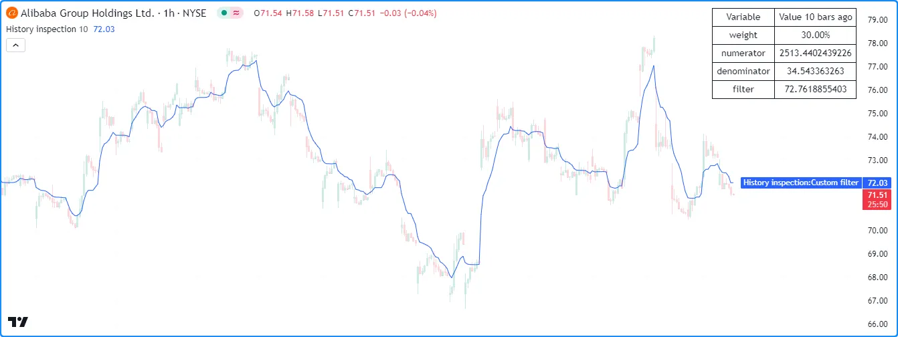

```c
//@version=5
indicator("Debugging with tables demo", "History inspection", true)

//@variable The number of bars back in the chart's history to inspect.
int barsBack = input.int(10, "Bars back", 0, 4999)

//@variable The percent rank of `volume` over 10 bars.
float weight = ta.percentrank(volume, 10)
//@variable The 10-bar EMA of `weight * close` values.
float numerator = ta.ema(weight * close, 10)
//@variable The 10-bar EMA of `weight` values.
float denominator = ta.ema(weight, 10)
//@variable The ratio of the `numerator` to the `denominator`.
float filter = numerator / denominator

// Plot the `filter`.
plot(filter, "Custom filter")

//@variable The color of the frame, border, and text in the `debugTable`.
color tableColor = chart.fg_color

//@variable A table that contains "string" representations of variable names and values on the latest chart bar.
var table debugTable = table.new(
     position.top_right, 2, 5, frame_color = tableColor, frame_width = 1, border_color = tableColor, border_width = 1
 )

// Initialize cells on the last confirmed historical bar.
if barstate.islastconfirmedhistory
    table.cell(debugTable, 0, 0, "Variable", text_color = tableColor)
    table.cell(debugTable, 1, 0, str.format("Value {0, number, integer} bars ago", barsBack), text_color = tableColor)
    table.cell(debugTable, 0, 1, "weight", text_color = tableColor)
    table.cell(debugTable, 1, 1, "", text_color = tableColor)
    table.cell(debugTable, 0, 2, "numerator", text_color = tableColor)
    table.cell(debugTable, 1, 2, "", text_color = tableColor)
    table.cell(debugTable, 0, 3, "denominator", text_color = tableColor)
    table.cell(debugTable, 1, 3, "", text_color = tableColor)
    table.cell(debugTable, 0, 4, "filter", text_color = tableColor)
    table.cell(debugTable, 1, 4, "", text_color = tableColor)

// Update value cells on the last available bar.
if barstate.islast
    table.cell_set_text(debugTable, 1, 1, str.tostring(weight[barsBack], format.percent))
    table.cell_set_text(debugTable, 1, 2, str.tostring(numerator[barsBack]))
    table.cell_set_text(debugTable, 1, 3, str.tostring(denominator[barsBack]))
    table.cell_set_text(debugTable, 1, 4, str.tostring(filter[barsBack]))
```

__Note que:__

- O script usa a palavra-chave [var](https://br.tradingview.com/pine-script-reference/v5/#kw_var) para especificar que a [tabela](https://br.tradingview.com/pine-script-reference/v5/#type_table) atribuída à variável `debugTable` na primeira barra persiste durante toda a execução do script.
- Este script modifica a tabela dentro de duas estruturas [if](https://br.tradingview.com/pine-script-reference/v5/#kw_if). A primeira estrutura inicializa as células com [table.cell()](https://br.tradingview.com/pine-script-reference/v5/#fun_table.cell) apenas na última barra histórica confirmada ([barstate.islastconfirmedhistory](https://br.tradingview.com/pine-script-reference/v5/#var_barstate.islastconfirmedhistory)). A segunda estrutura atualiza as propriedades `text` das células relevantes com [representações em string](./06_02_debugging.md#representando-outros-tipos) dos valores das variáveis usando chamadas [table.cell_set_text()](https://br.tradingview.com/pine-script-reference/v5/#fun_table.cell_set_text) na última barra disponível ([barstate.islast](https://br.tradingview.com/pine-script-reference/v5/#var_barstate.islast)).

É importante notar que, embora as tabelas possam fornecer utilidade para depuração, especialmente ao trabalhar com múltiplas séries ou criar logs no gráfico, elas têm um custo computacional mais alto do que outras técnicas discutidas nesta página e podem exigir _mais código_. Além disso, ao contrário das [labels](./06_02_debugging.md#usando-labels), só é possível visualizar o estado de uma tabela a partir da última execução do script. Portanto, recomenda-se usá-las _sabiamente_ e _com moderação_ durante a depuração, optando por abordagens _simplificadas_ quando possível. Para mais informações sobre o uso de objetos [tabela](https://br.tradingview.com/pine-script-reference/v5/#type_table), veja a página [Tabelas](./05_19_tables.md).

## Pine Logs

Pine Logs são _mensagens interativas_ que scripts podem gerar em pontos específicos de sua execução. Eles fornecem uma maneira poderosa para programadores inspecionarem os dados, condições e o fluxo de execução de um script com um código mínimo.

Ao contrário das outras ferramentas discutidas nesta página, os Pine Logs são projetados deliberadamente para depuração detalhada de scripts. Scripts não exibem Pine Logs no gráfico ou na Janela de Dados. Em vez disso, eles imprimem mensagens com timestamps no _Painel de Pine Logs_, que fornece recursos especializados de navegação e opções de filtragem.

Para acessar o Painel de Pine Logs, selecione "Pine Logs..." no menu "Mais" "_More_" do Editor ou no menu "Mais" "_More_" de um script carregado no gráfico que utiliza funções `log.*()`:

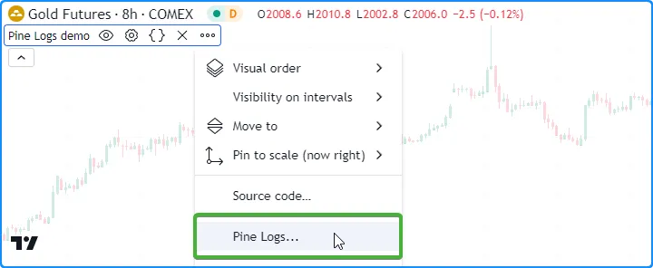

> __Observação!__\
> Somente __scripts pessoais__ podem gerar Pine Logs. Um script publicado _não pode_ criar logs, mesmo que tenha chamadas de função `log.*()` em seu código. É necessário considerar abordagens alternativas, como as descritas nas seções acima, ao [publicar scripts](./06_04_publicando_scripts.md) com funcionalidade de depuração.

### Criando Logs

Scripts podem criar logs chamando as funções no namespace `log.*()`.

Todas as funções `log.*()` têm as seguintes assinaturas:
    
```c
log.*(message) → void

log.*(formatString, arg0, arg1, ...) → void
```

A primeira sobrecarga registra uma `message` especificada no painel de Pine Logs. A segunda sobrecarga é semelhante a [str.format()](https://br.tradingview.com/pine-script-reference/v5/#fun_str.format), pois registra uma mensagem formatada com base no `formatString` e nos argumentos adicionais fornecidos na chamada.

Cada função `log.*()` tem um _nível de depuração_ diferente, permitindo que os programadores categorizem e [filtre](./06_02_debugging.md#filtrando-logs) os resultados mostrados no painel:

- A função [log.info()](https://br.tradingview.com/pine-script-reference/v5/#fun_log.info) registra uma entrada com o nível _"info"_ que aparece no painel com texto cinza.
- A função [log.warning()](https://br.tradingview.com/pine-script-reference/v5/#fun_log.warning) registra uma entrada com o nível _"warning"_ que aparece no painel com texto laranja.
- A função [log.error()](https://br.tradingview.com/pine-script-reference/v5/#fun_log.error) registra uma entrada com o nível _"error"_ que aparece no painel com texto vermelho.

Este código demonstra a diferença entre todas as três funções `log.*()`. Ele chama [log.info()](https://br.tradingview.com/pine-script-reference/v5/#fun_log.info), [log.warning()](https://br.tradingview.com/pine-script-reference/v5/#fun_log.warning) e [log.error()](https://br.tradingview.com/pine-script-reference/v5/#fun_log.error) na primeira barra disponível:

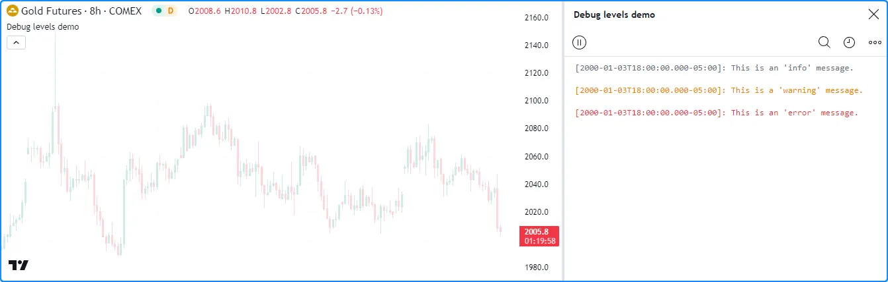

```c
//@version=5
indicator("Debug levels demo", overlay = true)

if barstate.isfirst
    log.info("This is an 'info' message.")
    log.warning("This is a 'warning' message.")
    log.error("This is an 'error' message.")
```

Pine Logs podem ser executados em qualquer lugar dentro da execução de um script. Eles permitem que os programadores rastreiem informações de barras históricas e monitorem como seus scripts se comportam em barras _não confirmadas_ em tempo real. Ao executar em barras históricas, os scripts geram uma nova mensagem uma vez para cada chamada `log.*()` em uma barra. Em barras em tempo real, as chamadas para as funções `log.*()` podem criar novas entradas em _cada novo tick_.

Por exemplo, este script calcula a razão média entre o valor `close - open` de cada barra e seu intervalo `high - low`. Quando o `denominator` não é zero "_nonzero_", o script chama [log.info()](https://br.tradingview.com/pine-script-reference/v5/#fun_log.info) para imprimir os valores das variáveis do cálculo em barras confirmadas e [log.warning()](https://br.tradingview.com/pine-script-reference/v5/#fun_log.warning) para imprimir os valores em barras não confirmadas. Caso contrário, ele usa [log.error()](https://br.tradingview.com/pine-script-reference/v5/#fun_log.error) para indicar que ocorreu uma divisão por zero, pois tais casos podem afetar o resultado `average`:

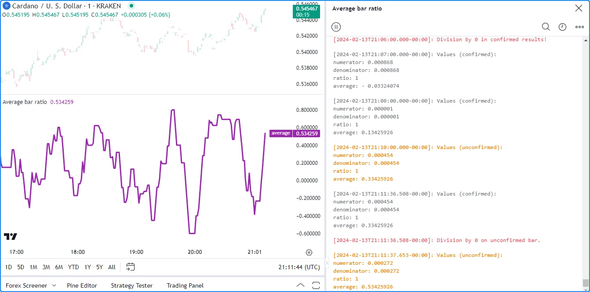

```c
//@version=5
indicator("Logging historical and realtime data demo", "Average bar ratio")

//@variable The current bar's change from the `open` to `close`.
float numerator = close - open
//@variable The current bar's `low` to `high` range.
float denominator = high - low
//@variable The ratio of the bar's open-to-close range to its full range.
float ratio = numerator / denominator
//@variable The average `ratio` over 10 non-na values.
float average = ta.sma(ratio, 10)

// Plot the `average`.
plot(average, "average", color.purple, 3)

if barstate.isconfirmed
    // Log a division by zero error if the `denominator` is 0.
    if denominator == 0.0
        log.error("Division by 0 in confirmed results!")
    // Otherwise, log the confirmed values.
    else
        log.info(
             "Values (confirmed):\nnumerator: {1, number, #.########}\ndenominator: {2, number, #.########}
             \nratio: {0, number, #.########}\naverage: {3, number, #.########}",
             ratio, numerator, denominator, average
         )
else
    // Log a division by zero error if the `denominator` is 0.
    if denominator == 0.0
        log.error("Division by 0 on unconfirmed bar.")
    // Otherwise, log the unconfirmed values.
    else
        log.warning(
             "Values (unconfirmed):\nnumerator: {1, number, #.########}\ndenominator: {2, number, #.########}
             \nratio: {0, number, #.########}\naverage: {3, number, #.########}",
             ratio, numerator, denominator, average
         )
```

__Note que:__

- Pine Logs _não retrocedem_ a cada tick em uma barra não confirmada, o que significa que os resultados para esses ticks aparecem no painel até que o script reinicie sua execução. Para registrar mensagens apenas em barras _confirmadas_, use [barstate.isconfirmed](https://br.tradingview.com/pine-script-reference/v5/#var_barstate.isconfirmed) nas condições que acionam uma chamada `log.*()`.
- Ao registrar em barras não confirmadas, recomenda-se garantir que esses logs contenham _informações exclusivas_ ou usem diferentes _níveis de depuração_ para que seja possível [filtrar](./06_02_debugging.md#filtrando-logs) os resultados conforme necessário.
- O painel de Pine Logs exibirá até as 10.000 entradas mais recentes para barras históricas. Se um script gerar mais de 10.000 logs em barras históricas e um programador precisar ver entradas anteriores, ele pode usar lógica condicional para limitar as chamadas `log.*()` a ocorrências específicas. Veja [esta](./06_02_debugging.md#usando-inputs) seção para um exemplo que limita a geração de logs a um _timeframe_ especificado pelo usuário.

### Inspecionando Logs

Pine Logs incluem alguns recursos úteis que simplificam o processo de inspeção. Sempre que um script gera um log, ele automaticamente prefixa a mensagem com um timestamp detalhado para indicar onde o evento de log ocorreu na série temporal. Além disso, cada entrada contém ícones __"Source code"__ e __"Scroll to bar"__, que aparecem ao passar o cursor sobre ela no painel de Pine Logs:

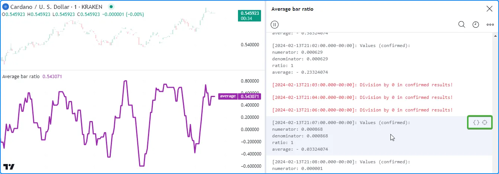

Clicar no ícone "Source code" de uma entrada abre o script no Pine Editor e destaca a linha específica de código que acionou o log:

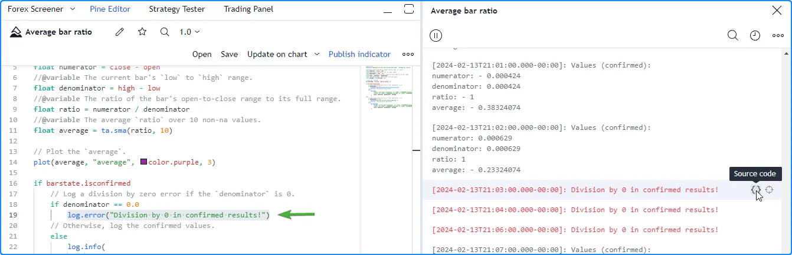

Clicar no ícone "Scroll to bar" de uma entrada navega o gráfico para a barra específica onde o log ocorreu e exibe temporariamente um tooltip contendo informações de tempo para essa barra:

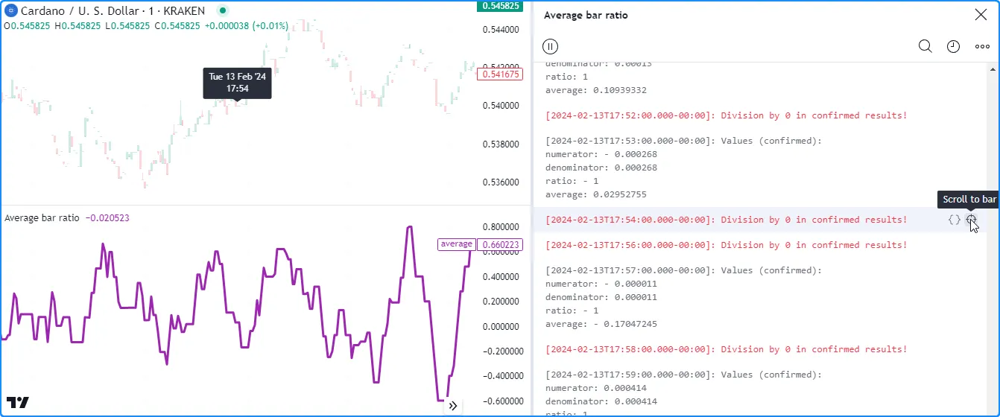

__Note que:__

- As informações de tempo no tooltip dependem do período do gráfico, assim como o rótulo do eixo x vinculado ao cursor do gráfico e às ferramentas de desenho. Por exemplo, o tooltip em um gráfico EOD mostrará apenas o dia da semana e a data, enquanto o tooltip em um gráfico de 10 segundos também conterá a hora do dia, incluindo segundos.

Quando um gráfico inclui mais de um script que gera logs, é importante notar que cada script mantém seu próprio histórico de mensagens _independente_. Para inspecionar as mensagens de um script específico quando vários estão no gráfico, selecione seu título no menu suspenso no topo do painel de Pine Logs:

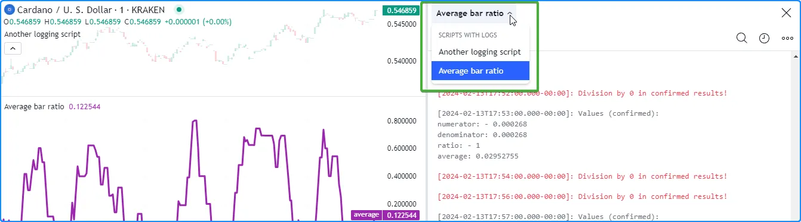

### Filtrando Logs

Um único script pode gerar inúmeros logs, dependendo das condições que acionam suas chamadas `log.*()`. Embora percorrer diretamente o histórico de logs para encontrar entradas específicas possa ser suficiente quando um script gera apenas algumas, isso pode se tornar difícil ao procurar centenas ou milhares de mensagens.

O painel de Pine Logs inclui várias opções para filtrar mensagens, permitindo simplificar os resultados isolando _sequências de caracteres_ específicas, _tempos de início_ e _níveis de depuração_.

Clicar no ícone "Search" no topo do painel abre uma barra de pesquisa, que corresponde ao texto para filtrar mensagens registradas. O filtro de pesquisa também destaca a parte correspondente de cada mensagem em azul para referência visual. Por exemplo, aqui, foi digitado "confirmed" para corresponder a todos os resultados gerados pelo script anterior com a palavra em algum lugar do texto:

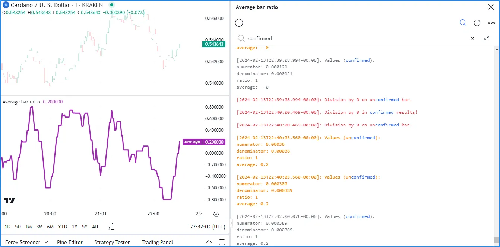

Note que os resultados dessa pesquisa também consideraram mensagens com _"unconfirmed"_ como correspondências, pois a palavra contém a consulta. É possível omitir essas correspondências selecionando a caixa de seleção "Whole Word" nas opções à direita da barra de pesquisa:

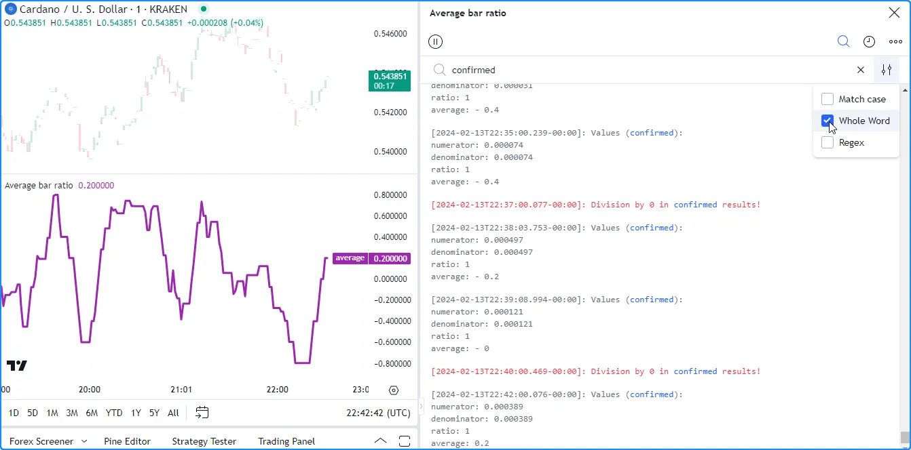

Esse filtro também suporta [expressões regulares (regex)](https://pt.wikipedia.org/wiki/Express%C3%A3o_regular), que permitem aos usuários realizar pesquisas avançadas que correspondem a _padrões de caracteres_ personalizados ao selecionar a caixa de seleção "Regex" nas opções de pesquisa. Por exemplo, essa regex corresponde a todas as entradas que contêm "average" seguido por uma sequência que representa um número maior que 0.5 e menor ou igual a 1:

```c
average:\s*(0\.[6-9]\d*|0\.5\d*[1-9]\d*|1\.0*)
```

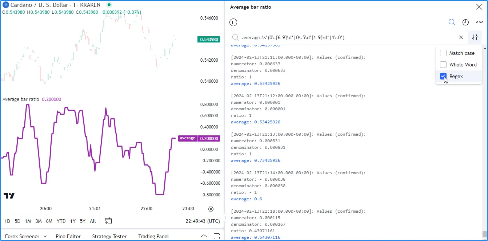

Clicar no ícone "Start date" abre um diálogo que permite aos usuários especificar a data e hora do primeiro log mostrado nos resultados:

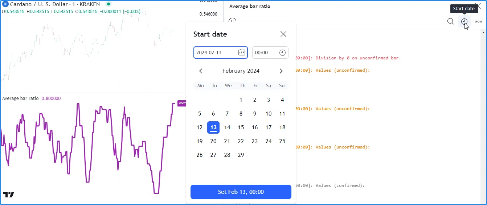

Após especificar o ponto de início, uma tag contendo o tempo de início aparecerá acima do histórico de logs:

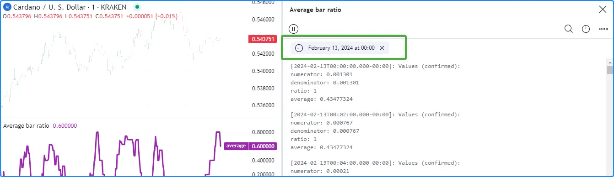

Os usuários podem filtrar os resultados por _nível de depuração_ usando as caixas de seleção disponíveis ao selecionar o ícone mais à direita nas opções de filtragem. Aqui, foram desativados os níveis "info" e "warning" para que os resultados contenham apenas mensagens de "error":

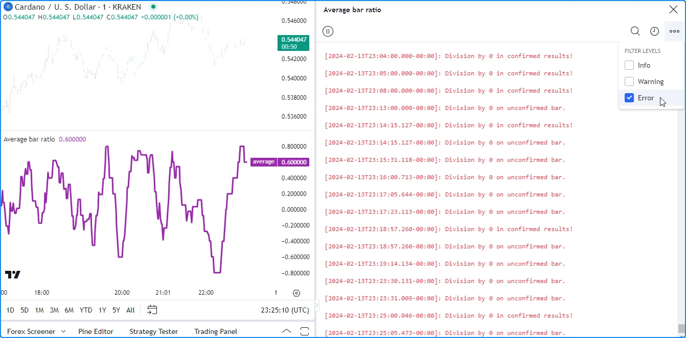

### Usando Inputs

Outra maneira mais envolvente de filtrar interativamente os resultados registrados de um script é criar [inputs](./05_09_inputs.md) vinculados a uma lógica condicional que ativa chamadas específicas de `log.*()` no código.

Este exemplo calcula uma [RMA](https://br.tradingview.com/pine-script-reference/v5/#fun_ta.rma) dos preços de [fechamento](https://br.tradingview.com/pine-script-reference/v5/#var_close) e declara algumas condições únicas para formar uma [condição composta](./06_02_debugging.md#condições-compostas-e-aninhadas). O script usa [log.info()](https://br.tradingview.com/pine-script-reference/v5/#fun_log.info) para exibir informações de depuração importantes no painel de Pine Logs, incluindo os valores da variável `compoundCondition` e as variáveis "bool" que determinam seu resultado.

As variáveis `filterLogsInput`, `logStartInput` e `logEndInput` são atribuídas respectivamente a uma chamada de [input.bool()](https://br.tradingview.com/pine-script-reference/v5/#fun_input.bool) e duas chamadas de [input.time()](https://br.tradingview.com/pine-script-reference/v5/#fun_input.time) para filtragem personalizada de logs. Quando `filterLogsInput` é `true`, o script gerará um novo log apenas se o [time](https://br.tradingview.com/pine-script-reference/v5/#var_time) da barra estiver entre os valores de `logStartInput` e `logEndInput`, permitindo isolar interativamente as entradas que ocorreram dentro de um _timeframe_ específico:

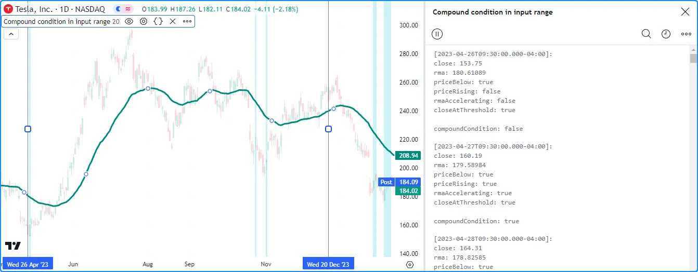

```c
//@version=5
indicator("Filtering logs using inputs demo", "Compound condition in input range", true)

//@variable The length for moving average calculations.
int lengthInput = input.int(20, "Length", 2)

//@variable If `true`, only allows logs within the input time range.
bool filterLogsInput = input.bool(true, "Only log in time range", group = "Log filter")
//@variable The starting time for logs if `filterLogsInput` is `true`.
int logStartInput = input.time(0, "Start time", group = "Log filter", confirm = true)
//@variable The ending time for logs if `filterLogsInput` is `true`.
int logEndInput = input.time(0, "End time", group = "Log filter", confirm = true)

//@variable The RMA of `close` prices.
float rma = ta.rma(close, lengthInput)

//@variable Is `true` when `close` exceeds the `rma`.
bool priceBelow = close <= rma
//@variable Is `true` when the current `close` is greater than the max of the previous `hl2` and `close`.
bool priceRising = close > math.max(hl2[1], close[1])
//@variable Is `true` when the `rma` is positively accelerating.
bool rmaAccelerating = rma - 2.0 * rma[1] + rma[2] > 0.0
//@variable Is `true` when the difference between `rma` and `close` exceeds 2 times the current ATR.
bool closeAtThreshold = rma - close > ta.atr(lengthInput) * 2.0
//@variable Is `true` when all the above conditions occur.
bool compoundCondition = priceBelow and priceRising and rmaAccelerating and closeAtThreshold

// Plot the `rma`.
plot(rma, "RMA", color.teal, 3)
// Highlight the chart background when the `compoundCondition` occurs.
bgcolor(compoundCondition ? color.new(color.aqua, 80) : na, title = "Compound condition highlight")

//@variable If `filterLogsInput` is `true`, is only `true` in the input time range. Otherwise, always `true`.
bool showLog = filterLogsInput ? time >= logStartInput and time <= logEndInput : true

// Log results for a confirmed bar when `showLog` is `true`.
if barstate.isconfirmed and showLog
    log.info(
         "\nclose: {0, number, #.#####}\nrma: {1, number, #.#####}\npriceBelow: {2}\npriceRising: {3}
         \nrmaAccelerating: {4}\ncloseAtThreshold: {5}\n\ncompoundCondition: {6}",
         close, rma, priceBelow, priceRising, rmaAccelerating, closeAtThreshold, compoundCondition
     )
```

__Note que:__

- As funções `input.*()` atribuídas às variáveis `filterLogsInput`, `logStartInput` e `logEndInput` incluem um argumento `group` para organizá-las e distingui-las nas configurações do script.
- As chamadas [input.time()](https://br.tradingview.com/pine-script-reference/v5/#fun_input.time) incluem `confirm = true` para que seja possível definir interativamente os tempos de início e término diretamente no gráfico. Para redefinir os inputs, selecione "Reset points…" nas opções do menu "More" do script.
- A condição que aciona cada chamada [log.info()](https://br.tradingview.com/pine-script-reference/v5/#fun_log.info) inclui [barstate.isconfirmed](https://br.tradingview.com/pine-script-reference/v5/#var_barstate.isconfirmed) para limitar a geração de logs às barras _confirmadas_.

## Depurando Funções

[Funções definidas pelo usuário](./04_11_funcoes_definidas_pelo_usuario.md) e [métodos](./04_11_funcoes_definidas_pelo_usuario.md#funções-definidas-pelo-usuário) são funções personalizadas escritas pelos usuários. Elas encapsulam sequências de operações que um script pode invocar posteriormente em sua execução.

Toda [função definida pelo usuário](./04_11_funcoes_definidas_pelo_usuario.md) ou [método](./04_11_funcoes_definidas_pelo_usuario.md#funções-definidas-pelo-usuário) tem um _escopo local_ que se incorpora ao escopo global do script. Os parâmetros na assinatura de uma função e as variáveis declaradas dentro do corpo da função pertencem a esse escopo local e _não_ são diretamente acessíveis ao escopo externo do script ou aos escopos de outras funções.

Os segmentos abaixo explicam algumas maneiras de os programadores depurarem os valores do escopo local de uma função. Este script serve como ponto de partida para os exemplos subsequentes. Ele contém uma função `customMA()` que retorna uma média móvel exponencial cujo parâmetro de suavização varia com base na distância do `source` fora dos 25º e 75º [percentis](https://br.tradingview.com/pine-script-reference/v5/#fun_ta.percentile_linear_interpolation) ao longo das barras `length`:

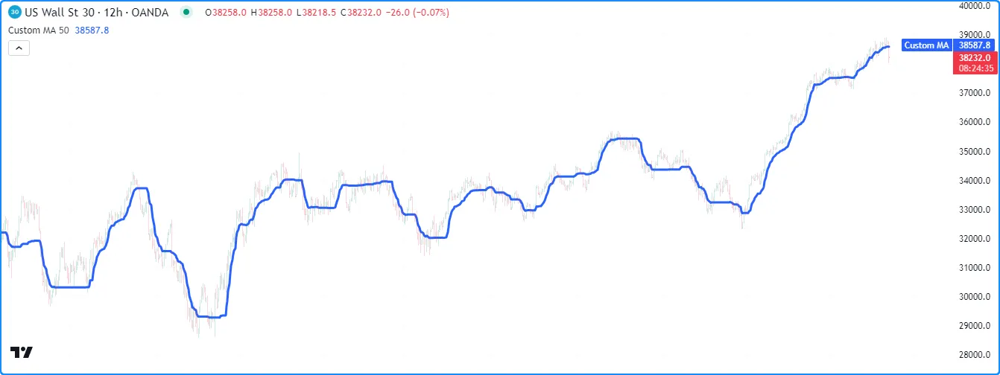

```c
//@version=5
indicator("Debugging functions demo", "Custom MA", true)

//@variable The number of bars in the `customMA()` calculation.
int lengthInput = input.int(50, "Length", 2)

//@function      Calculates a moving average that only responds to values outside the first and third quartiles.
//@param source  The series of values to process.
//@param length  The number of bars in the calculation.
//@returns       The moving average value.
customMA(float source, int length) =>
    //@variable The custom moving average.
    var float result = na
    // Calculate the 25th and 75th `source` percentiles.
    float q1 = ta.percentile_linear_interpolation(source, length, 25)
    float q3 = ta.percentile_linear_interpolation(source, length, 75)
    // Calculate the range values.
    float outerRange = math.max(source - q3, q1 - source, 0.0)
    float totalRange = ta.range(source, length)
    //@variable Half the ratio of the `outerRange` to the `totalRange`.
    float alpha = 0.5 * outerRange / totalRange
    // Mix the `source` with the `result` based on the `alpha` value.
    result := (1.0 - alpha) * nz(result, source) + alpha * source
    // Return the `result`.
    result

//@variable The `customMA()` result over `lengthInput` bars.
float maValue = customMA(close, lengthInput)

// Plot the `maValue`.
plot(maValue, "Custom MA", color.blue, 3)
```

### Extraindo Variáveis Locais

Quando um programador deseja inspecionar as variáveis locais de uma [função definida pelo usuário](./04_11_funcoes_definidas_pelo_usuario.md) [plotando](./06_02_debugging.md#plotando-números) seus valores, [colorindo](./06_02_debugging.md#cores-condicionais) o fundo ou as barras do gráfico, etc., ele deve _extrair_ os valores para o _escopo global_, pois as funções integradas que produzem esses outputs só podem aceitar variáveis globais e literais.

Como os valores retornados por uma função estão disponíveis no escopo onde a chamada ocorre, uma abordagem simples de extração é fazer a função retornar uma [tupla](./04_09_tipagem_do_sistema.md#tuples-tuplas) contendo todos os valores que precisam ser inspecionados.

Aqui, a função `customMA()` foi modificada para retornar uma [tupla](./04_09_tipagem_do_sistema.md#tuples-tuplas) contendo todas as variáveis calculadas pela função. Agora, a função pode ser chamada com uma _declaração de tupla_ para tornar os valores disponíveis no escopo global e inspecioná-los com [plots](./06_02_debugging.md#plotando-números):

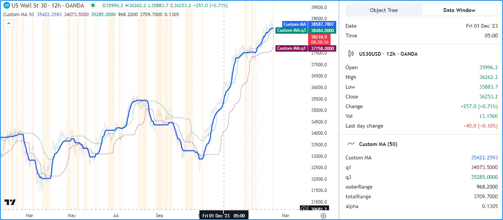

```c
//@version=5
indicator("Extracting local variables with tuples demo", "Custom MA", true)

//@variable The number of bars in the `customMA()` calculation.
int lengthInput = input.int(50, "Length", 2)

//@function      Calculates a moving average that only responds to values outside the first and third quartiles.
//@param source  The series of values to process.
//@param length  The number of bars in the calculation.
//@returns       The moving average value.
customMA(float source, int length) =>
    //@variable The custom moving average.
    var float result = na
    // Calculate the 25th and 75th `source` percentiles.
    float q1 = ta.percentile_linear_interpolation(source, length, 25)
    float q3 = ta.percentile_linear_interpolation(source, length, 75)
    // Calculate the range values.
    float outerRange = math.max(source - q3, q1 - source, 0.0)
    float totalRange = ta.range(source, length)
    //@variable Half the ratio of the `outerRange` to the `totalRange`.
    float alpha = 0.5 * outerRange / totalRange
    // Mix the `source` with the `result` based on the `alpha` value.
    result := (1.0 - alpha) * nz(result, source) + alpha * source
    // Return a tuple containing the `result` and other local variables.
    [result, q1, q3, outerRange, totalRange, alpha]

// Declare a tuple containing all values returned by `customMA()`.
[maValue, q1Debug, q3Debug, outerRangeDebug, totalRangeDebug, alphaDebug] = customMA(close, lengthInput)

// Plot the `maValue`.
plot(maValue, "Custom MA", color.blue, 3)

//@variable Display location for plots with different scale.
notOnPane = display.all - display.pane

// Display the extracted `q1` and `q3` values in all plot locations.
plot(q1Debug, "q1", color.new(color.maroon, 50))
plot(q3Debug, "q3", color.new(color.teal, 50))
// Display the other extracted values in the status line and Data Window to avoid impacting the scale.
plot(outerRangeDebug, "outerRange", chart.fg_color, display = notOnPane)
plot(totalRangeDebug, "totalRange", chart.fg_color, display = notOnPane)
plot(alphaDebug, "alpha", chart.fg_color, display = notOnPane)
// Highlight the chart when `alphaDebug` is 0, i.e., when the `maValue` does not change.
bgcolor(alphaDebug == 0.0 ? color.new(color.orange, 90) : na, title = "`alpha == 0.0` highlight")
```

__Note que:__

- Foi utilizado `display.all - display.pane` para os plots das variáveis `outerRangeDebug`, `totalRangeDebug` e `alphaDebug` para [evitar impactar a escala do gráfico](./06_02_debugging.md#sem-afetar-a-escala).
- O script também usa uma [cor condicional](./06_02_debugging.md#cores-condicionais) para destacar o [fundo](https://br.tradingview.com/pine-script-reference/v5/#fun_bgcolor) do painel do gráfico quando `debugAlpha` é 0, indicando que `maValue` não muda.

Outra maneira mais _avançada_ de extrair os valores das variáveis locais de uma função é passá-los para uma variável de _tipo de referência_ declarada no escopo global.

Os escopos de funções podem acessar variáveis globais para seus cálculos. Embora um script não possa reatribuir diretamente os valores de variáveis globais de dentro do escopo de uma função, ele pode atualizar os _elementos ou propriedades_ desses valores se eles forem tipos de referência, como [arrays](./04_14_arrays.md), [matrix](./04_15_matrices.md), [mapas](./04_16_mapas.md) e [tipos definidos pelo usuário](./04_09_tipagem_do_sistema.md#tipos-definidos-pelo-usuário).

Esta versão declara uma variável `debugData` no escopo global que referencia um [mapa](https://br.tradingview.com/pine-script-reference/v5/#type_map) com chaves "string" e valores "float". Dentro do escopo local da função `customMA()`, o script coloca _pares de chave-valor_ contendo o nome e o valor de cada variável local no mapa. Após chamar a função, o script plota os valores armazenados em `debugData`:

```c
//@version=5
indicator("Extracting local variables with reference types demo", "Custom MA", true)

//@variable The number of bars in the `customMA()` calculation.
int lengthInput = input.int(50, "Length", 2)

//@variable A map with "string" keys and "float" values for debugging the `customMA()`.
map<string, float> debugData = map.new<string, float>()

//@function      Calculates a moving average that only responds to values outside the first and third quartiles.
//@param source  The series of values to process.
//@param length  The number of bars in the calculation.
//@returns       The moving average value.
customMA(float source, int length) =>
    //@variable The custom moving average.
    var float result = na
    // Calculate the 25th and 75th `source` percentiles.
    float q1 = ta.percentile_linear_interpolation(source, length, 25),    map.put(debugData, "q1", q1)
    float q3 = ta.percentile_linear_interpolation(source, length, 75),    map.put(debugData, "q3", q3)
    // Calculate the range values.
    float outerRange = math.max(source - q3, q1 - source, 0.0),           map.put(debugData, "outerRange", outerRange)
    float totalRange = ta.range(source, length),                          map.put(debugData, "totalRange", totalRange)
    //@variable Half the ratio of the `outerRange` to the `totalRange`.
    float alpha = 0.5 * outerRange / totalRange,                          map.put(debugData, "alpha", alpha)
    // Mix the `source` with the `result` based on the `alpha` value.
    result := (1.0 - alpha) * nz(result, source) + alpha * source
    // Return the `result`.
    result

//@variable The `customMA()` result over `lengthInput` bars.
float maValue = customMA(close, lengthInput)

// Plot the `maValue`.
plot(maValue, "Custom MA", color.blue, 3)

//@variable Display location for plots with different scale.
notOnPane = display.all - display.pane

// Display the extracted `q1` and `q3` values in all plot locations.
plot(map.get(debugData, "q1"), "q1", color.new(color.maroon, 50))
plot(map.get(debugData, "q3"), "q3", color.new(color.teal, 50))
// Display the other extracted values in the status line and Data Window to avoid impacting the scale.
plot(map.get(debugData, "outerRange"), "outerRange", chart.fg_color, display = notOnPane)
plot(map.get(debugData, "totalRange"), "totalRange", chart.fg_color, display = notOnPane)
plot(map.get(debugData, "alpha"), "alpha", chart.fg_color, display = notOnPane)
// Highlight the chart when the extracted `alpha` is 0, i.e., when the `maValue` does not change.
bgcolor(map.get(debugData, "alpha") == 0.0 ? color.new(color.orange, 90) : na, title = "`alpha == 0.0` highlight")
```

__Note que:__

- Cada chamada de [map.put()](https://br.tradingview.com/pine-script-reference/v5/#fun_map.put) foi colocada na mesma linha da declaração de cada variável, separada por uma vírgula, para manter o código conciso e evitar adicionar linhas extras ao código `customMA()`.
- Utilizou-se [map.get()](https://br.tradingview.com/pine-script-reference/v5/#fun_map.get) para recuperar cada valor para as chamadas de [plot()](https://br.tradingview.com/pine-script-reference/v5/#fun_plot) e [bgcolor()](https://br.tradingview.com/pine-script-reference/v5/#fun_bgcolor) de depuração.

### Desenhos e Logs Locais

Diferente das funções `plot.*()` e outras que requerem valores acessíveis ao escopo global, os scripts podem gerar [objetos de desenho](./04_09_tipagem_do_sistema.md#tipos-de-desenho) e [Pine Logs](./06_02_debugging.md#pine-logs) diretamente dentro de uma função, permitindo que os programadores depurem as variáveis locais _sem_ extrair os valores para o escopo externo.

Neste exemplo, são usados [labels](./05_20_text_e_shapes.md#labels) e [Pine Logs](./06_02_debugging.md#pine-logs) para exibir [representações em string](./06_02_debugging.md#representando-outros-tipos) dos valores dentro do escopo `customMA()`. Dentro da função, o script chama [str.format()](https://br.tradingview.com/pine-script-reference/v5/#fun_str.format) para criar uma string formatada representando os dados do escopo local e, em seguida, chama [label.new()](https://br.tradingview.com/pine-script-reference/v5/#fun_label.new) e [log.info()](https://br.tradingview.com/pine-script-reference/v5/#fun_log.info) para, respectivamente, exibir o texto no gráfico em um tooltip e registrar uma mensagem "info" contendo o texto no painel de [Pine Logs](./06_02_debugging.md#pine-logs):

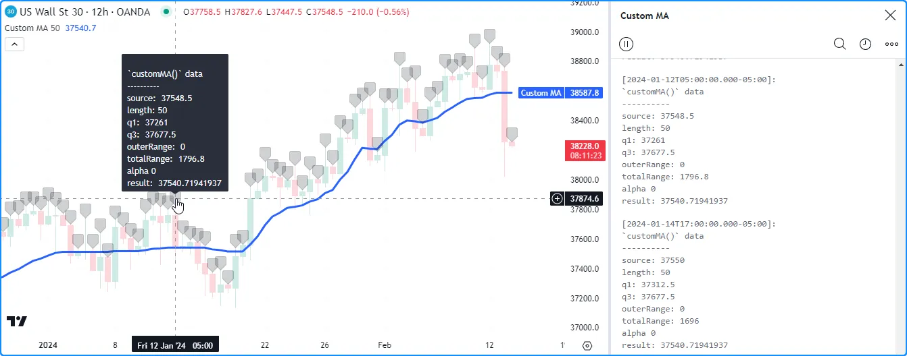

```c
//@version=5
indicator("Local drawings and logs demo", "Custom MA", true, max_labels_count = 500)

//@variable The number of bars in the `customMA()` calculation.
int lengthInput = input.int(50, "Length", 2)

//@function      Calculates a moving average that only responds to values outside the first and third quartiles.
//@param source  The series of values to process.
//@param length  The number of bars in the calculation.
//@returns       The moving average value.
customMA(float source, int length) =>
    //@variable The custom moving average.
    var float result = na
    // Calculate the 25th and 75th `source` percentiles.
    float q1 = ta.percentile_linear_interpolation(source, length, 25)
    float q3 = ta.percentile_linear_interpolation(source, length, 75)
    // Calculate the range values.
    float outerRange = math.max(source - q3, q1 - source, 0.0)
    float totalRange = ta.range(source, length)
    //@variable Half the ratio of the `outerRange` to the `totalRange`.
    float alpha = 0.5 * outerRange / totalRange
    // Mix the `source` with the `result` based on the `alpha` value.
    result := (1.0 - alpha) * nz(result, source) + alpha * source

    //@variable A formatted string containing representations of all local variables.
    string debugText = str.format(
         "\n`customMA()` data\n----------\nsource: {0, number, #.########}\nlength: {1}\nq1: {2, number, #.########}
         \nq3: {3, number, #.########}\nouterRange: {4, number, #.########}\ntotalRange: {5, number, #.########}
         \nalpha{6, number, #.########}\nresult: {7, number, #.########}",
         source, length, q1, q3, outerRange, totalRange, alpha, result
     )
    // Draw a label with a tooltip displaying the `debugText`.
    label.new(bar_index, high, color = color.new(chart.fg_color, 80), tooltip = debugText)
    // Print an "info" message in the Pine Logs pane when the bar is confirmed.
    if barstate.isconfirmed
        log.info(debugText)

    // Return the `result`.
    result

//@variable The `customMA()` result over `lengthInput` bars.
float maValue = customMA(close, lengthInput)

// Plot the `maValue`.
plot(maValue, "Custom MA", color.blue, 3)
```

__Note que:__

- Incluiu-se `max_labels_count = 500` na função [indicator()](https://br.tradingview.com/pine-script-reference/v5/#fun_indicator) para exibir [labels](./05_20_text_e_shapes.md#labels) para as 500 chamadas mais recentes de `customMA()`.
- A função usa [barstate.isconfirmed](https://br.tradingview.com/pine-script-reference/v5/#var_barstate.isconfirmed) em uma instrução [if](https://br.tradingview.com/pine-script-reference/v5/#kw_if) para chamar [log.info()](https://br.tradingview.com/pine-script-reference/v5/#fun_log.info) apenas em barras _confirmadas_, não registrando uma nova mensagem em cada tick em tempo real.

### Depurando Loops

[Loops](./04_08_loops.md) são estruturas que executam repetidamente um bloco de código com base em um _contador_ ([for](https://br.tradingview.com/pine-script-reference/v5/#kw_for)), no conteúdo de uma [coleção](./04_09_tipagem_do_sistema.md#coleções) ([for...in](https://br.tradingview.com/pine-script-reference/v5/#kw_for...in)) ou em uma _condição_ ([while](https://br.tradingview.com/pine-script-reference/v5/#kw_while)). Eles permitem que scripts realizem tarefas repetitivas sem a necessidade de linhas de código redundantes.

Cada instância de loop mantém um escopo local separado, ao qual todos os escopos externos não têm acesso. Todas as variáveis declaradas dentro do escopo de um loop são específicas para aquele loop, o que significa que não se pode usá-las em um escopo externo.

Assim como outras estruturas no Pine, há inúmeras maneiras possíveis de depurar loops. Esta seção explora algumas técnicas úteis, incluindo a extração de valores locais para [plots](./05_15_plots.md), inspeção de valores com [desenhos](./04_09_tipagem_do_sistema.md#tipos-de-desenho) e rastreamento da execução de um loop com [Pine Logs](./06_02_debugging.md#pine-logs).

Segue o script como ponto de partida para os exemplos nos segmentos a seguir. Ele agrega as taxas de variação do valor de [fechamento](https://br.tradingview.com/pine-script-reference/v5/#var_close) ao longo de 1 - `lookbackInput` barras e as acumula em um loop [for](https://br.tradingview.com/pine-script-reference/v5/#kw_for), depois divide o resultado por `lookbackInput` para calcular um valor médio final:

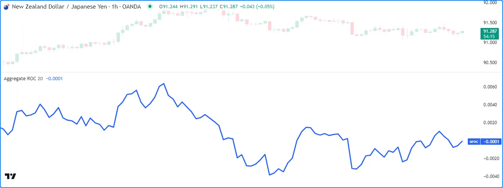

```c
//@version=5
indicator("Debugging loops demo", "Aggregate ROC")

//@variable The number of bars in the calculation.
int lookbackInput = input.int(20, "Lookback", 1)

//@variable The average ROC of `close` prices over each length from 1 to `lookbackInput` bars.
float aroc = 0.0

// Calculation loop.
for length = 1 to lookbackInput
    //@variable The `close` value `length` bars ago.
    float pastClose = close[length]
    //@variable The `close` rate of change over `length` bars.
    float roc = (close - pastClose) / pastClose
    // Add the `roc` to `aroc`.
    aroc += roc

// Divide `aroc` by the `lookbackInput`.
aroc /= lookbackInput

// Plot the `aroc`.
plot(aroc, "aroc", color.blue, 3)
```

__Note que:__

- O `aroc` é uma variável _global_ modificada dentro do loop, enquanto `pastClose` e `roc` são variáveis _locais_ inacessíveis ao escopo externo.

### Inspecionando uma Única Iteração

Quando um programador precisa se concentrar em uma iteração específica do loop, há várias técnicas que podem ser usadas, a maioria das quais envolve o uso de uma _condição_ dentro do loop para acionar ações de depuração, como extrair valores para variáveis externas, criar [desenhos](./04_09_tipagem_do_sistema.md#tipos-de-desenho), [registrar](./06_02_debugging.md#pine-logs) mensagens, etc.

Este exemplo inspeciona o valor local `roc` de uma única iteração do loop de três maneiras diferentes. Quando o valor do contador do loop é igual ao `debugCounterInput`, o script atribui o `roc` a uma variável `rocDebug` do escopo global para [plotar](./06_02_debugging.md#plotando-números), desenha uma linha vertical de 0 até o valor `roc` usando [line.new()](https://br.tradingview.com/pine-script-reference/v5/#fun_line.new) e registra uma mensagem no painel de [Pine Logs](./06_02_debugging.md#pine-logs) usando [log.info()](https://br.tradingview.com/pine-script-reference/v5/#fun_log.info):

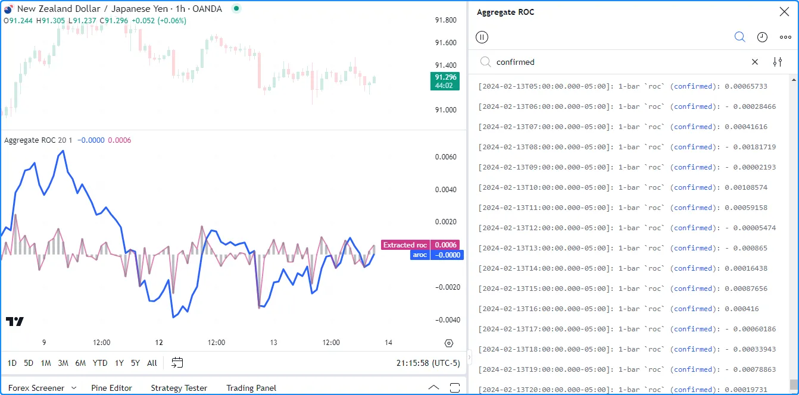

```c
//@version=5
indicator("Inspecting a single iteration demo", "Aggregate ROC", max_lines_count = 500)

//@variable The number of bars in the calculation.
int lookbackInput = input.int(20, "Lookback", 1)
//@variable The `length` value in the loop's execution where value extraction occurs.
int debugCounterInput = input.int(1, "Loop counter value", 1, group = "Debugging")

//@variable The `roc` value extracted from the loop.
float rocDebug = na

//@variable The average ROC of `close` over lags from 1 to `lookbackInput` bars.
float aroc = 0.0

// Calculation loop.
for length = 1 to lookbackInput
    //@variable The `close` value `length` bars ago.
    float pastClose = close[length]
    //@variable The `close` rate of change over `length` bars.
    float roc = (close - pastClose) / pastClose
    // Add the `roc` to `aroc`.
    aroc += roc

    // Trigger debug actions when the `length` equals the `debugCounterInput`.
    if length == debugCounterInput
        // Assign `roc` to `rocDebug` so the script can plot its value.
        rocDebug := roc
        // Draw a vertical line from 0 to the `roc` at the `bar_index`.
        line.new(bar_index, 0.0, bar_index, roc, color = color.new(color.gray, 50), width = 4)
        // Log an "info" message in the Pine Logs pane.
        log.info("{0}-bar `roc`{1}: {2, number, #.########}", length, barstate.isconfirmed ? " (confirmed)" : "", roc)

// Divide `aroc` by the `lookbackInput`.
aroc /= lookbackInput

// Plot the `aroc`.
plot(aroc, "aroc", color.blue, 3)

// Plot the `rocDebug`.
plot(rocDebug, "Extracted roc", color.new(color.rgb(206, 55, 136), 40), 2)
```

__Note que:__

- A chamada de [input.int()](https://br.tradingview.com/pine-script-reference/v5/#fun_input.int) atribuída ao `debugCounterInput` inclui um argumento `group` para distingui-la nas configurações do script.
- A chamada de [log.info()](https://br.tradingview.com/pine-script-reference/v5/#fun_log.info) inclui "(confirmed)" na mensagem formatada sempre que [barstate.isconfirmed](https://br.tradingview.com/pine-script-reference/v5/#var_barstate.isconfirmed) for `true`. Pesquisar esse texto no painel de [Pine Logs](./06_02_debugging.md#pine-logs) filtrará as entradas de barras não confirmadas. Veja a seção [Filtrando logs](./06_02_debugging.md#filtrando-logs) acima.

### Inspecionando Múltiplas Iterações

Ao inspecionar os valores de várias iterações do loop, muitas vezes é útil utilizar [coleções](./04_09_tipagem_do_sistema.md#coleções) ou strings para reunir os resultados para uso em funções de saída após o término do loop.

Esta versão demonstra algumas maneiras de coletar e exibir os valores do loop de todas as iterações. Ela declara uma string `logText` e um array `debugValues` no escopo global. Dentro do escopo local do loop [for](https://br.tradingview.com/pine-script-reference/v5/#kw_for), o script _concatena_ uma [representação em string](./06_02_debugging.md#representando-outros-tipos) do `length` e `roc` com `logText` e chama [array.push()](https://br.tradingview.com/pine-script-reference/v5/#fun_array.push) para adicionar o valor `roc` da iteração ao array `debugValues`.

Após o término do loop, o script [plota](./06_02_debugging.md#plotando-números) o [primeiro](https://br.tradingview.com/pine-script-reference/v5/#fun_array.first) e o [último](https://br.tradingview.com/pine-script-reference/v5/#fun_array.last) valor do array `debugValues`, desenha uma [label](https://br.tradingview.com/pine-script-reference/v5/#type_label) com um _tooltip_ mostrando uma [representação em string](./06_02_debugging.md#representando-outros-tipos) do [array](https://br.tradingview.com/pine-script-reference/v5/#type_array) e exibe o `logText` no painel de [Pine Logs](./06_02_debugging.md#pine-logs) quando a barra é confirmada:

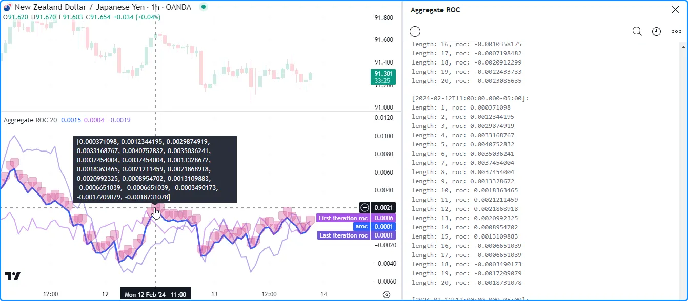

```c
//@version=5
indicator("Inspecting multiple iterations demo", "Aggregate ROC", max_labels_count = 500)

//@variable The number of bars in the calculation.
int lookbackInput = input.int(20, "Lookback", 1)

//@variable An array containing the `roc` value from each loop iteration.
array<float> debugValues = array.new<float>()
//@variable A "string" containing information about the `roc` on each iteration.
string logText = ""

//@variable The average ROC of `close` over lags from 1 to `lookbackInput` bars.
float aroc = 0.0

// Calculation loop.
for length = 1 to lookbackInput
    //@variable The `close` value `length` bars ago.
    float pastClose = close[length]
    //@variable The `close` rate of change over `length` bars.
    float roc = (close - pastClose) / pastClose
    // Add the `roc` to `aroc`.
    aroc += roc

    // Concatenate a new "string" representation with the `debugText`.
    logText += "\nlength: " + str.tostring(length) + ", roc: " + str.tostring(roc)
    // Push the `roc` value into the `debugValues` array.
    array.push(debugValues, roc)

// Divide `aroc` by the `lookbackInput`.
aroc /= lookbackInput

// Plot the `aroc`.
plot(aroc, "aroc", color.blue, 3)

// Plot the `roc` values from the first and last iteration.
plot(array.first(debugValues), "First iteration roc", color.new(color.rgb(166, 84, 233), 50), 2)
plot(array.last(debugValues), "Last iteration roc", color.new(color.rgb(115, 86, 218), 50), 2)
// Draw a label with a tooltip containing a "string" representation of the `debugValues` array.
label.new(bar_index, aroc, color = color.new(color.rgb(206, 55, 136), 70), tooltip = str.tostring(debugValues))
// Log the `logText` in the Pine Logs pane when the bar is confirmed.
if barstate.isconfirmed
    log.info(logText)
```

Outra maneira de inspecionar um loop ao longo de várias iterações é gerar logs [Pine Logs](./06_02_debugging.md#pine-logs) sequenciais ou criar/modificar [objetos de desenho](./04_09_tipagem_do_sistema.md#tipos-de-desenho) dentro do escopo do loop para rastrear seu padrão de execução com detalhes granulares.

Este exemplo usa [Pine Logs](./06_02_debugging.md#pine-logs) para rastrear o fluxo de execução do loop do script. Ele gera uma nova mensagem "info" em cada iteração para rastrear os cálculos do escopo local à medida que o loop progride em cada barra confirmada:

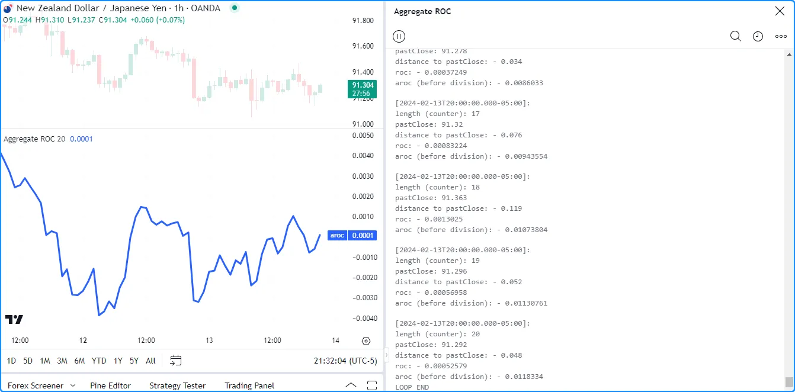

```c
//@version=5
indicator("Inspecting multiple iterations demo", "Aggregate ROC")

//@variable The number of bars in the calculation.
int lookbackInput = input.int(20, "Lookback", 1)

//@variable The average ROC of `close` over lags from 1 to `lookbackInput` bars.
float aroc = 0.0

// Calculation loop.
for length = 1 to lookbackInput
    //@variable The `close` value `length` bars ago.
    float pastClose = close[length]
    //@variable The `close` rate of change over `length` bars.
    float roc = (close - pastClose) / pastClose
    // Add the `roc` to `aroc`.
    aroc += roc
    if barstate.isconfirmed
        log.info(
             "{0}\nlength (counter): {1}\npastClose: {2, number, #.#####}\n
             distance to pastClose: {3, number, #.########}\nroc: {4, number, #.########}\n
             aroc (before division): {5, number, #.########}\n{6}",
             length == 1 ? "LOOP START" : "",
             length, pastClose, close - pastClose, roc, aroc,
             length == lookbackInput ? "LOOP END" : ""
         )

// Divide `aroc` by the `lookbackInput`.
aroc /= lookbackInput

// Plot the `aroc`.
plot(aroc, "aroc", color.blue, 3)
```

__Note que:__

- Ao gerar [logs](./06_02_debugging.md#pine-logs) ou desenhos iterativamente de dentro de um loop, evite a desordem desnecessária e busque uma navegação fácil. Mais não é sempre melhor para depuração, especialmente ao trabalhar dentro de loops.

## Dicas

### Organização e Legibilidade

Ao escrever scripts, é prudente priorizar códigos-fonte organizados e legíveis. Códigos organizados e fáceis de ler ajudam a agilizar o processo de depuração. Além disso, códigos bem escritos são mais fáceis de manter ao longo do tempo.

Aqui estão algumas dicas rápidas baseadas no [Guia de Estilo](./06_01_guia_de_estilo.md) e nos exemplos desta página:

- Procure seguir as recomendações gerais de [organização de scripts](./06_01_guia_de_estilo.md#organização-do-script). Organizar scripts usando essa estrutura facilita a localização e inspeção.
- Escolha nomes de variáveis e funções que sejam fáceis de _identificar_ e _compreender_. Veja a seção de [convenções de nomenclatura](./06_01_guia_de_estilo.md#convenções-de-nomeação) para alguns exemplos.
- Muitas vezes é útil atribuir temporariamente partes importantes de expressões a variáveis com nomes informativos enquanto depura. Dividir expressões em partes reutilizáveis ajuda a simplificar os processos de inspeção.
- Use _comentários_ e _anotações_ (`//@function`, `//@variable`, etc.) para documentar seu código. As anotações são particularmente úteis, pois o autosugest do Pine Editor exibe descrições de variáveis e funções em um pop-up ao passar o cursor sobre seus identificadores em qualquer parte do código.
- Lembre-se que, em muitos casos, _menos é mais_. Não se sobrecarregue com saídas de script excessivas ou informações desnecessárias enquanto depura. Mantenha as coisas simples e inclua apenas a quantidade de informação necessária.

### Acelerando Tarefas Repetitivas

Existem algumas técnicas úteis frequentemente utilizado ao depurar o código:

- O [plotchar()](https://br.tradingview.com/pine-script-reference/v5/#fun_plotchar) ou [plotshape()](https://br.tradingview.com/pine-script-reference/v5/#fun_plotshape) exibe rapidamente os resultados de variáveis e expressões "int", "float" ou "bool" na linha de status do script e na "Janela de Dados" "_Data Window_".
- Muitas vezes o [bgcolor()](https://br.tradingview.com/pine-script-reference/v5/#fun_bgcolor) funciona para visualizar o histórico de determinadas [condições](./06_02_debugging.md#condições) no gráfico.
- A versão de uma linha da função `printLabel()` desta [seção](./06_02_debugging.md#no-final-do-gráfico) serve para imprimir strings no final do gráfico.
- A chamada [label.new()](https://br.tradingview.com/pine-script-reference/v5/#fun_label.new) com um argumento `tooltip` mostra strings em tooltips [em barras sucessivas](./06_02_debugging.md#em-barras-sucessivas).
- As funções `log.*()` apresenta rapidamente dados com [representações em string](./06_02_debugging.md#representando-outros-tipos) no painel de [Pine Logs](./06_02_debugging.md#pine-logs).

Quando se estabelecem processos típicos de depuração, muitas vezes é útil criar _macros de teclado_ (_atalhos do teclado_) para acelerar tarefas repetitivas e gastar menos tempo configurando saídas de depuração em cada código.

O seguinte é um simples script _**A**uto**H**ot**K**ey_ (__não__ é código Pine Script) que inclui hotstrings para as cinco técnicas acima. O script gera snippets de código digitando uma sequência de caracteres especificada seguida por um espaço:

```text
; ————— This is AHK code, not Pine Script™. —————

; Specify that hotstrings trigger when they end with space, tab, linefeed, or carriage return.
#Hotstring EndChars `t `n `r

:X:,,show::SendInput, plotchar(%Clipboard%, "%Clipboard%", "", color = chart.fg_color, display = display.all - display.pane){Enter}
:X:,,highlight::SendInput, bgcolor(bool(%Clipboard%) ? color.new(color.orange, 80) : na, title = "%Clipboard% highlight"){Enter}
:X:,,print::SendInput, printLabel(string txt, float price = na) => int labelTime = math.max(last_bar_time, chart.right_visible_bar_time), var label result = label.new(labelTime, na, txt, xloc.bar_time, na(price) ? yloc.abovebar : yloc.price, na, label.style_none, chart.fg_color, size.large), label.set_text(result, txt), label.set_y(result, price), result`nprintLabel(){Left}
:X:,,tooltip::SendInput, label.new(bar_index, high, color = color.new(chart.fg_color, 70), tooltip = str.tostring(%Clipboard%)){Enter}
:X:,,log::SendInput, log.info(str.tostring(%Clipboard%)){Enter}
```

A macro ",,show" gera uma chamada [plotchar()](https://br.tradingview.com/pine-script-reference/v5/#fun_plotchar) que usa o conteúdo da área de transferência para os argumentos `series` e `title`. Copiar uma variável `variableName` ou a expressão `close > open` e digitar ",,show" seguido por um espaço produzirá, respectivamente:

```c
plotchar(variableName, "variableName", "", color = chart.fg_color, display = display.all - display.pane)
plotchar(close > open, "close > open", "", color = chart.fg_color, display = display.all - display.pane)
```

A macro ",,highlight" gera uma chamada [bgcolor()](https://br.tradingview.com/pine-script-reference/v5/#fun_bgcolor) que destaca o fundo do painel do gráfico com uma [cor condicional](./06_02_debugging.md#cores-condicionais) com base na variável ou expressão copiada para a área de transferência. Por exemplo, copiar a variável [barstate.isrealtime](https://br.tradingview.com/pine-script-reference/v5/#var_barstate.isrealtime) e digitar ",,highlight" seguido por um espaço produzirá:

```c
bgcolor(bool(barstate.isrealtime) ? color.new(color.orange, 80) : na, title = "barstate.isrealtime highlight")
```

A macro ",,print" gera a função `printLabel()` de uma linha e cria uma chamada `printLabel()` vazia com o cursor posicionado dentro dela. Tudo o que você precisa fazer após digitar ",,print" seguido por um espaço é inserir o texto que deseja exibir:

```c
printLabel(string txt, float price = na) => int labelTime = math.max(last_bar_time, chart.right_visible_bar_time), var label result = label.new(labelTime, na, txt, xloc.bar_time, na(price) ? yloc.abovebar : yloc.price, na, label.style_none, chart.fg_color, size.large), label.set_text(result, txt), label.set_y(result, price), result
printLabel()
```

A macro ",,tooltip" gera uma chamada [label.new()](https://br.tradingview.com/pine-script-reference/v5/#fun_label.new) com um argumento `tooltip` que usa [str.tostring()](https://br.tradingview.com/pine-script-reference/v5/#fun_str.tostring) no conteúdo da área de transferência. Copiar a variável `variableName` e digitar ",,tooltip" seguido por um espaço produz:

```c
label.new(bar_index, high, color = color.new(chart.fg_color, 70), tooltip = str.tostring(variableName))
```

A macro ",,log" gera uma chamada [log.info()](https://br.tradingview.com/pine-script-reference/v5/#fun_log.info) com um argumento `message` que usa [str.tostring()](https://br.tradingview.com/pine-script-reference/v5/#fun_str.tostring) no conteúdo da área de transferência para exibir representações em string de variáveis e expressões no painel de [Pine Logs](./06_02_debugging.md#pine-logs). Copiar a expressão `bar_index % 2 == 0` e digitar ",,log" seguido por um espaço produz:

```c
log.info(str.tostring(bar_index % 2 == 0))
```

__Note que:__

- O __AHK__ está disponível para dispositivos _Windows_. Pesquise outros softwares para empregar um processo semelhante se seu computador usar um sistema operacional diferente.
