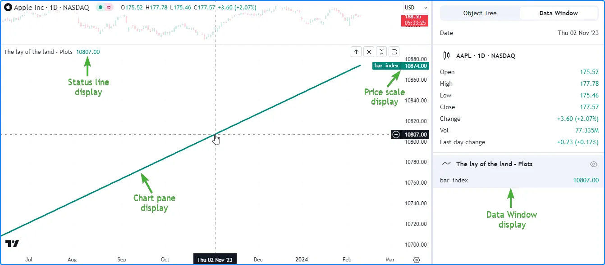
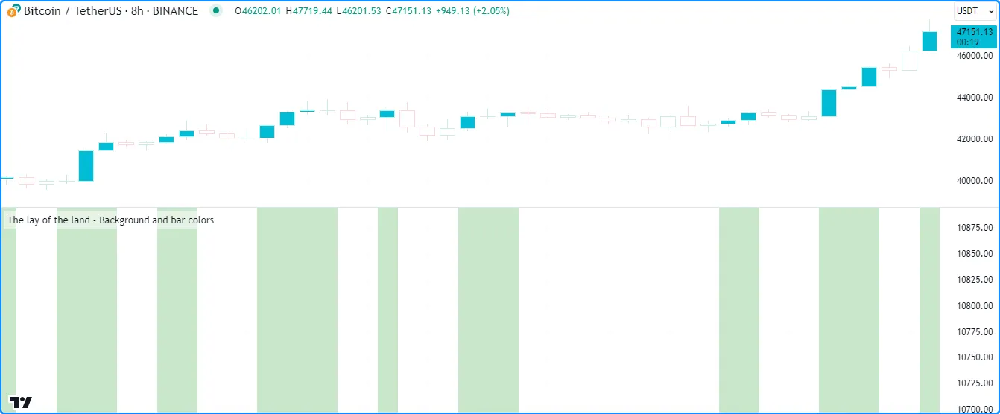
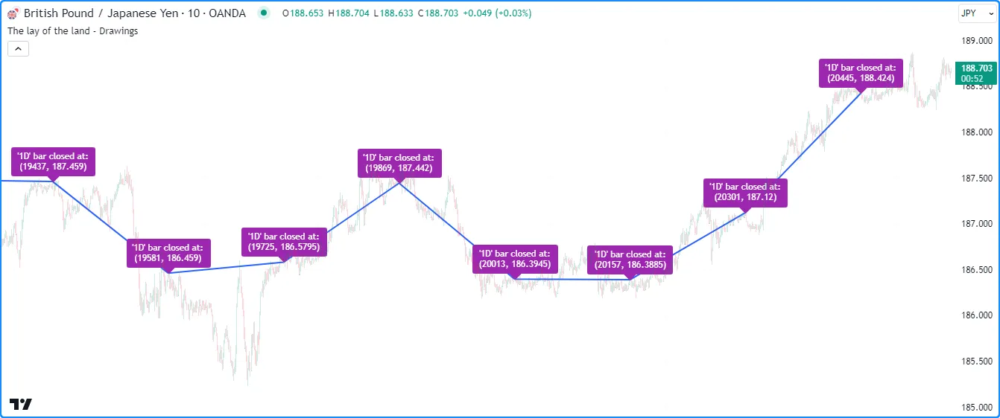
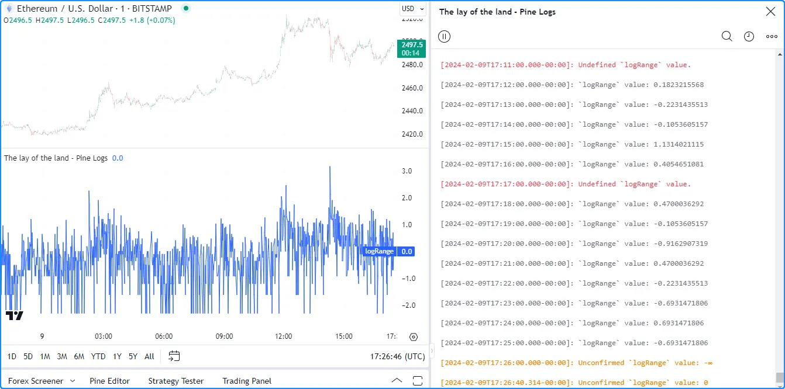
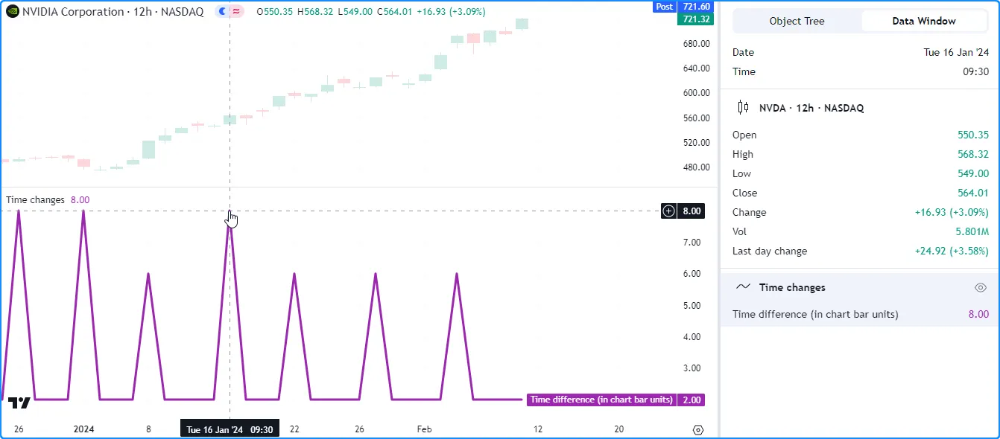
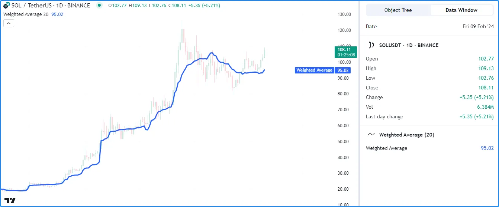
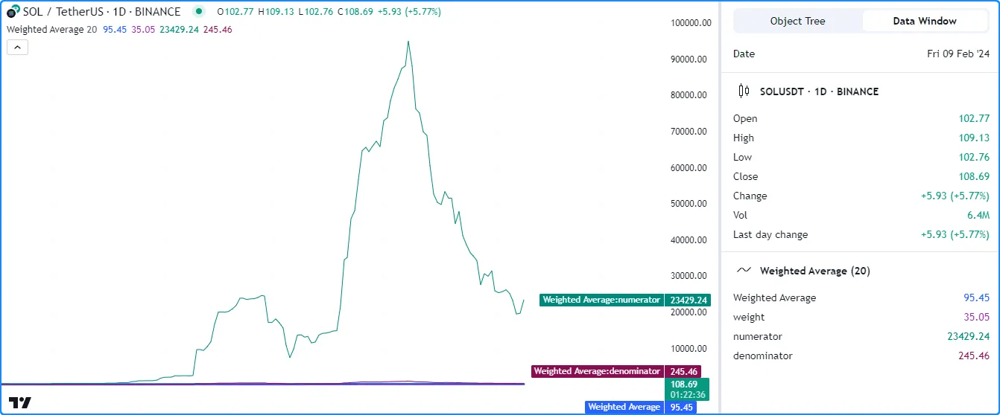
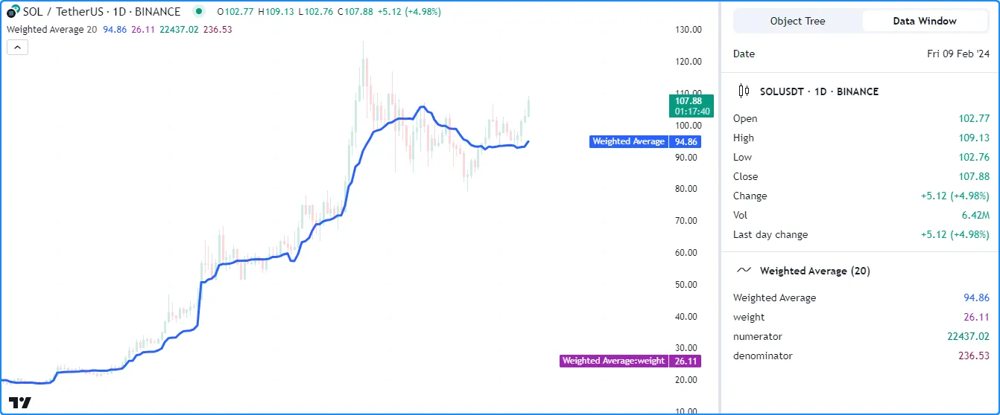

# Debugging (_Depuração_)

A integração próxima entre o Pine Editor e a interface de gráficos do TradingView facilita a depuração interativa e eficiente do código Pine Script, permitindo que scripts produzam resultados dinâmicos em vários locais, dentro e fora do gráfico. Programadores podem utilizar esses resultados para refinar os comportamentos do script e garantir que tudo funcione conforme esperado.

Quando um programador entende as técnicas apropriadas para inspecionar os diversos comportamentos que podem ser encontrados ao escrever um script, é possível identificar e resolver rapidamente potenciais problemas no código, proporcionando uma experiência de codificação mais tranquila. Esta página demonstra algumas das formas mais úteis de depurar código ao trabalhar com Pine Script.

> __Observação!__\
> Antes de prosseguir, recomenda-se familiarizar-se com o [Modelo de Execução](./04_01_modelo_de_execucao.md) e o [Sistema de Tipos](./04_09_tipagem_do_sistema.md) do Pine Script, pois é crucial entender esses detalhes ao depurar no ambiente Pine Script.

<!-- ## A Disposição do Terreno

Scripts Pine podem gerar seus resultados de várias maneiras diferentes, que os programadores podem utilizar para depuração.

As funções `plot*()` podem exibir resultados em um painel de gráfico, na linha de status do script, na escala de preços (eixo-y) e na "Janela de Dados" "_Data Window_", fornecendo maneiras simples e convenientes de depurar valores numéricos e condicionais:



```c
//@version=5
indicator("The lay of the land - Plots")

// Plot the `bar_index` in all available locations.
plot(bar_index, "bar_index", color.teal, 3)
```

__Note que:__

- As saídas da linha de status de um script só serão exibidas ao habilitar a caixa de seleção "Valores" "_Values_" na seção "Indicadores" "_Indicators_" das configurações da "Linha de Status" "_Status line_" do gráfico.
- As escalas de preços só exibirão valores ou nomes de plots ao habilitar as opções no menu suspenso "Indicadores e Financeiros" nas configurações de "Escalas e Linhas" do gráfico.

A função [bgcolor()](https://br.tradingview.com/pine-script-reference/v5/#fun_bgcolor) exibe cores no fundo do painel do script, e a função [barcolor()](https://br.tradingview.com/pine-script-reference/v5/#fun_barcolor) altera as cores das barras ou velas do gráfico principal. Ambas as funções fornecem uma maneira simples de visualizar condições:



```c
//@version=5
indicator("The lay of the land - Background and bar colors")

//@variable Is `true` if the `close` is rising over 2 bars.
bool risingPrice = ta.rising(close, 2)

// Highlight the chart background and color the main chart bars based on `risingPrice`.
bgcolor(risingPrice ? color.new(color.green, 70) : na, title= "`risingPrice` highlight")
barcolor(risingPrice ? color.aqua : chart.bg_color, title = "`risingPrice` bar color")
```

Os [tipos de desenho](./04_09_tipagem_do_sistema.md#tipos-de-desenho) do Pine ([line](./05_12_lines_e_boxes.md#lines-linhas), [box](./05_12_lines_e_boxes.md#boxes-caixas), [polyline](./05_12_lines_e_boxes.md#polylines-polilinhas), [label](./05_20_text_e_shapes.md#labels)) produzem desenhos no painel do script. Embora não retornem resultados em outros locais, como a linha de status ou a Janela de Dados, fornecem soluções alternativas e flexíveis para inspecionar valores numéricos, condições e strings diretamente no gráfico:



```c
//@version=5
indicator("The lay of the land - Drawings", overlay = true)

//@variable Is `true` when the time changes on the "1D" timeframe.
bool newDailyBar = timeframe.change("1D")
//@variable The previous bar's `bar_index` from when `newDailyBar` last occurred.
int closedIndex = ta.valuewhen(newDailyBar, bar_index - 1, 0)
//@variable The previous bar's `close` from when `newDailyBar` last occurred.
float closedPrice = ta.valuewhen(newDailyBar, close[1], 0)

if newDailyBar
    //@variable Draws a line from the previous `closedIndex` and `closedPrice` to the current values.
    line debugLine = line.new(closedIndex[1], closedPrice[1], closedIndex, closedPrice, width = 2)
    //@variable Variable info to display in a label.
    string debugText = "'1D' bar closed at: \n(" + str.tostring(closedIndex) + ", " + str.tostring(closedPrice) + ")"
    //@variable Draws a label at the current `closedIndex` and `closedPrice`.
    label.new(closedIndex, closedPrice, debugText, color = color.purple, textcolor = color.white)
```

As funções `log.*()` produzem resultados nos [Pine Logs](./06_02_debugging.md#pine-logs). Sempre que um script chama qualquer uma dessas funções, uma mensagem é registrada no painel de [Pine Logs](./06_02_debugging.md#pine-logs), juntamente com um carimbo de data/hora e opções de navegação para identificar os horários específicos, barras do gráfico e linhas de código que acionaram o log:



```c
//@version=5
indicator("The lay of the land - Pine Logs")

//@variable The natural logarithm of the current `high - low` range.
float logRange = math.log(high - low)

// Plot the `logRange`.
plot(logRange, "logRange")

if barstate.isconfirmed
    // Generate an "error" or "info" message on the confirmed bar, depending on whether `logRange` is defined.
    switch 
        na(logRange) => log.error("Undefined `logRange` value.")
        =>              log.info("`logRange` value: " + str.tostring(logRange))
else
    // Generate a "warning" message for unconfirmed values.
    log.warning("Unconfirmed `logRange` value: " + str.tostring(logRange))
```

Pode-se aplicar qualquer uma das opções acima, ou uma combinação delas, para estabelecer rotinas de depuração que atendam às suas necessidades e preferências, dependendo dos tipos de dados e estruturas com os quais estão trabalhando. Veja as seções abaixo para explicações detalhadas de várias técnicas de depuração.

## Valores Numéricos

Ao criar código no Pine Script, trabalhar com números é inevitável. Portanto, para garantir que um script funcione conforme o esperado, é crucial entender como inspecionar os valores numéricos ([int](./04_09_tipagem_do_sistema.md#int) e [float](./04_09_tipagem_do_sistema.md#float)) que ele recebe e calcula.

> __Observação!__\
> Esta seção discute abordagens fundamentais _baseadas em gráficos_ para depuração de números. Scripts também podem converter números em [strings](./04_09_tipagem_do_sistema.md#string), permitindo inspecionar números usando técnicas relacionadas a strings. Para mais informações, veja as seções [Strings](./06_02_debugging.md#strings) e [Pine Logs](./06_02_debugging.md#pine-logs).

## Plotando Números

Uma das maneiras mais simples de inspecionar os valores numéricos de um script é usar as funções `plot*()`, que podem exibir resultados graficamente no gráfico e mostrar números formatados na linha de status do script, na escala de preços e na Janela de Dados. Os locais onde uma função `plot*()` exibe seus resultados dependem do parâmetro `display`. Por padrão, seu valor é [display.all](https://br.tradingview.com/pine-script-reference/v5/#const_display.all).

> __Observação!__\
> Apenas o _escopo global_ de um script pode conter chamadas `plot*()`, o que significa que essas funções só podem aceitar variáveis globais e literais. Elas não podem usar variáveis declaradas nos escopos locais de [loops](./04_08_loops.md), [estruturas condicionais](./04_07_estruturas_condicionais.md) ou [funções definidas pelo usuário](./04_11_funcoes_definidas_pelo_usuario.md) e [métodos](./04_13_metodos.md#métodos-definidos-pelo-usuário).

O exemplo a seguir utiliza a função [plot()](https://br.tradingview.com/pine-script-reference/v5/#fun_plot) para exibir a variação de 1 barra no valor da variável incorporada [time](https://br.tradingview.com/pine-script-reference/v5/#var_time) medida em timeframes do gráfico (por exemplo, um valor plotado de 1 no gráfico "1D" significa que há uma diferença de um dia entre os horários de abertura das barras atual e anterior). Inspecionar essa série pode ajudar a identificar lacunas de tempo nos dados do gráfico, o que é uma informação útil ao projetar indicadores baseados em tempo.

Como não há especificação de argumento `display`, a função usa [display.all](https://br.tradingview.com/pine-script-reference/v5/#const_display.all), o que significa que mostrará dados em _todos_ os locais possíveis, como mostrado abaixo:



```c
//@version=5
indicator("Plotting numbers demo", "Time changes")

//@variable The one-bar change in the chart symbol's `time` value, measured in units of the chart timeframe.
float timeChange = ta.change(time) / (1000.0 * timeframe.in_seconds())

// Display the `timeChange` in all possible locations.
plot(timeChange, "Time difference (in chart bar units)", color.purple, 3) 
```

__Note que:__

- Os números exibidos na linha de status do script e na Janela de Dados refletem os valores plotados na localização do cursor do gráfico. Essas áreas mostrarão o valor da barra mais recente quando o ponteiro do mouse não estiver no gráfico.
- O número na escala de preços reflete o valor mais recente disponível no gráfico visível.

### Sem Afetar a Escala

Ao depurar vários valores numéricos em um script, pode ser necessário inspecioná-los sem interferir nas escalas de preços ou sobrecarregar as saídas visuais no painel do gráfico, pois escalas distorcidas e plots sobrepostos podem dificultar a avaliação dos resultados.

Uma maneira simples de inspecionar números sem adicionar mais visuais ao painel do gráfico é alterar os valores `display` nas chamadas `plot*()` do script para outras variáveis ou expressões `display.*`.

Um exemplo prático envolve a criação de um script que calcula uma média móvel ponderada personalizada dividindo a [soma](https://br.tradingview.com/pine-script-reference/v5/#fun_math.sum) dos valores `weight * close` pela [soma](https://br.tradingview.com/pine-script-reference/v5/#fun_math.sum) da série `weight`:



```c
//@version=5
indicator("Plotting without affecting the scale demo", "Weighted Average", true)

//@variable The number of bars in the average.
int lengthInput = input.int(20, "Length", 1)

//@variable The weight applied to the price on each bar.
float weight = math.pow(close - open, 2)

//@variable The numerator of the average.
float numerator = math.sum(weight * close, lengthInput)
//@variable The denominator of the average.
float denominator = math.sum(weight, lengthInput)

//@variable The `lengthInput`-bar weighted average.
float average = numerator / denominator

// Plot the `average`.
plot(average, "Weighted Average", linewidth = 3)
```

Para inspecionar as variáveis usadas no cálculo do `average` e ajustar o resultado, a exibição dos valores `weight`, `numerator` e `denominator` com a função [plot()](https://br.tradingview.com/pine-script-reference/v5/#fun_plot) em todos os locais pode dificultar a identificação da linha `average` no gráfico, devido às diferentes escalas de cada variável:



```c
//@version=5
indicator("Plotting without affecting the scale demo", "Weighted Average", true)

//@variable The number of bars in the average.
int lengthInput = input.int(20, "Length", 1)

//@variable The weight applied to the price on each bar.
float weight = math.pow(close - open, 2)

//@variable The numerator of the average.
float numerator = math.sum(close * weight, lengthInput)
//@variable The denominator of the average.
float denominator = math.sum(weight, lengthInput)

//@variable The `lengthInput`-bar weighted average.
float average = numerator / denominator

// Plot the `average`.
plot(average, "Weighted Average", linewidth = 3)

// Create debug plots for the `weight`, `numerator`, and `denominator`.
plot(weight, "weight", color.purple)
plot(numerator, "numerator", color.teal)
plot(denominator, "denominator", color.maroon)
```

Embora seja possível ocultar plots individuais na aba "Estilo" "_Style_" das configurações do script, isso também impede a inspeção dos resultados em qualquer outro local. Para visualizar simultaneamente os valores das variáveis e preservar a escala do gráfico, é possível alterar os valores `display` nos plots de depuração.

A versão abaixo inclui uma variável `debugLocations` nas chamadas de depuração [plot()](https://br.tradingview.com/pine-script-reference/v5/#fun_plot) com um valor de `display.all - display.pane` para especificar que todos os locais _exceto_ o painel do gráfico mostrarão os resultados. Agora é possível inspecionar os valores do cálculo sem a desordem extra:



```c
//@version=5
indicator("Plotting without affecting the scale demo", "Weighted Average", true)

//@variable The number of bars in the average.
int lengthInput = input.int(20, "Length", 1)

//@variable The weight applied to the price on each bar.
float weight = math.pow(close - open, 2)

//@variable The numerator of the average.
float numerator = math.sum(close * weight, lengthInput)
//@variable The denominator of the average.
float denominator = math.sum(weight, lengthInput)

//@variable The `lengthInput`-bar weighted average.
float average = numerator / denominator

// Plot the `average`.
plot(average, "Weighted Average", linewidth = 3)

//@variable The display locations of all debug plots.
debugLocations = display.all - display.pane
// Create debug plots for the `weight`, `numerator`, and `denominator`.
plot(weight, "weight", color.purple, display = debugLocations)
plot(numerator, "numerator", color.teal, display = debugLocations)
plot(denominator, "denominator", color.maroon, display = debugLocations)
``` -->

## Pine Logs

## Strings
