# Perfilamento e Otimização

Pine Script é uma linguagem compilada baseada em nuvem voltada para a execução eficiente de scripts repetidos. Quando um usuário adiciona um script Pine a um gráfico, ele é executado _numerosas_ vezes, uma vez para cada barra ou tick disponível nos feeds de dados que acessa, conforme explicado na página [Modelo de Execução](./04_01_modelo_de_execucao.md) deste manual.

O compilador Pine Script realiza automaticamente várias otimizações internas para acomodar scripts de vários tamanhos e ajudar na execução suave. No entanto, essas otimizações _não_ evitam gargalos de desempenho nas execuções dos scripts. Portanto, cabe aos programadores [perfilarem](./06_03_perfilamento_e_otimizacao.md#pine-profiler) o desempenho em tempo de execução de um script e identificarem maneiras de modificar blocos e linhas de código críticos quando precisam melhorar os tempos de execução.

Esta página aborda como perfilar e monitorar o tempo de execução de um script e suas execuções com o [Pine Profiler](./06_03_perfilamento_e_otimizacao.md#pine-profiler) e explica algumas maneiras de os programadores modificarem seu código para [otimizar](./06_03_perfilamento_e_otimizacao.md#otimização) o desempenho em tempo de execução.

## Pine Profiler

Antes de mergulhar na [otimização](./06_03_perfilamento_e_otimizacao.md#otimização), é prudente avaliar o tempo de execução de um script e identificar _gargalos_, ou seja, áreas no código que impactam substancialmente o desempenho geral. Com esses insights, os programadores podem garantir que se concentrem na otimização onde realmente importa, em vez de gastar tempo e esforço em códigos de baixo impacto.

Entre no _Pine Profiler_, uma ferramenta poderosa que analisa as execuções de todas as linhas e blocos de código significativos em um script e exibe informações úteis de desempenho ao lado das linhas dentro do Pine Editor. Ao inspecionar os resultados do Profiler, os programadores podem obter uma perspectiva mais clara sobre o tempo de execução geral do script, a distribuição do tempo de execução nas suas regiões de código significativas e as porções críticas que podem precisar de atenção e otimização extra.

### Profilando um Script

O Pine Profiler pode analisar o desempenho em tempo de execução de qualquer script _editável_ codificado em Pine Script v5. Para perfilar um script, adicione-o ao gráfico, abra o código-fonte no Pine Editor e selecione "Enable profiler mode" no menu suspenso ao lado da opção "Add to chart/Update on chart" no canto superior direito:

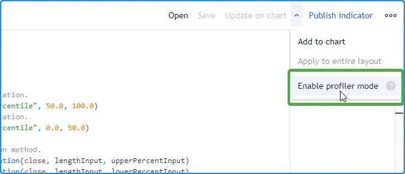

O script abaixo é utilizado como exemplo inicial de profiling, que calcula um `oscillator` personalizado com base nas distâncias médias do preço de [fechamento](https://br.tradingview.com/pine-script-reference/v5/#var_close) aos [percentis](https://br.tradingview.com/pine-script-reference/v5/#fun_ta.percentile_linear_interpolation) superior e inferior ao longo das barras `lengthInput`. Ele inclui alguns tipos diferentes de regiões de código _significativas_, que têm algumas diferenças na [interpretação](./06_03_perfilamento_e_otimizacao.md#interpretando-resultados-perfilados) durante a análise:

```c
//@version=5
indicator("Pine Profiler demo")

//@variable The number of bars in the calculations.
int lengthInput = input.int(100, "Length", 2)
//@variable The percentage for upper percentile calculation.
float upperPercentInput = input.float(75.0, "Upper percentile", 50.0, 100.0)
//@variable The percentage for lower percentile calculation.
float lowerPercentInput = input.float(25.0, "Lower percentile", 0.0, 50.0)

// Calculate percentiles using the linear interpolation method.
float upperPercentile = ta.percentile_linear_interpolation(close, lengthInput, upperPercentInput)
float lowerPercentile = ta.percentile_linear_interpolation(close, lengthInput, lowerPercentInput)

// Declare arrays for upper and lower deviations from the percentiles on the same line.
var upperDistances = array.new<float>(lengthInput), var lowerDistances = array.new<float>(lengthInput)

// Queue distance values through the `upperDistances` and `lowerDistances` arrays based on excessive price deviations.
if math.abs(close - 0.5 * (upperPercentile + lowerPercentile)) > 0.5 * (upperPercentile - lowerPercentile)
    array.push(upperDistances, math.max(close - upperPercentile, 0.0))
    array.shift(upperDistances)
    array.push(lowerDistances, math.max(lowerPercentile - close, 0.0))
    array.shift(lowerDistances)

//@variable The average distance from the `upperDistances` array.
float upperAvg = upperDistances.avg()
//@variable The average distance from the `lowerDistances` array.
float lowerAvg = lowerDistances.avg()
//@variable The ratio of the difference between the `upperAvg` and `lowerAvg` to their sum.
float oscillator = (upperAvg - lowerAvg) / (upperAvg + lowerAvg)
//@variable The color of the plot. A green-based gradient if `oscillator` is positive, a red-based gradient otherwise.
color oscColor = oscillator > 0 ?
     color.from_gradient(oscillator, 0.0, 1.0, color.gray, color.green) :
     color.from_gradient(oscillator, -1.0, 0.0, color.red, color.gray)

// Plot the `oscillator` with the `oscColor`.
plot(oscillator, "Oscillator", oscColor, style = plot.style_area)
```

Uma vez ativado, o Profiler coleta informações de todas as execuções das linhas e blocos de código significativos do script e exibe barras e percentagens aproximadas de tempo de execução à esquerda das linhas de código no Pine Editor:

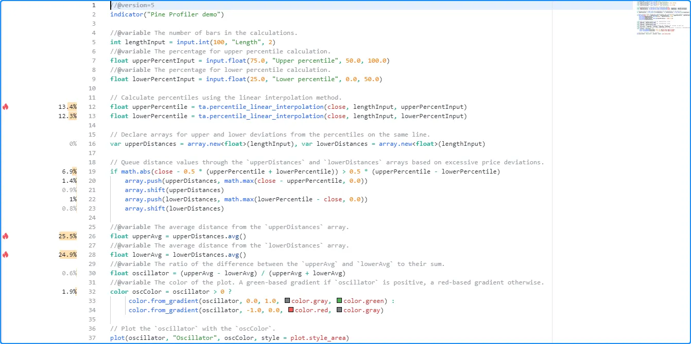

__Note que:__

- O Profiler rastreia cada execução de uma região de código significativa, incluindo as execuções em _ticks em tempo real_. Suas informações são atualizadas ao longo do tempo, conforme ocorrem novas execuções.
- Os resultados do Profiler __não__ aparecem para declarações de script, declarações de tipo, outras linhas de código _insignificantes_, como declarações de variáveis sem impacto tangível, _código não utilizado_ do qual as saídas do script não dependem ou _código repetitivo_ que o compilador otimiza durante a tradução. Veja [esta seção](./06_03_perfilamento_e_otimizacao.md#código-insignificante-inusitado-e-redundante) para mais informações.

Quando um script contém pelo menos _quatro_ linhas de código significativas, o Profiler inclui ícones de "chama" ao lado das _três principais_ regiões de código com maior impacto de desempenho. Se uma ou mais das regiões de código com maior impacto estiverem _fora_ das linhas visíveis no Pine Editor, um ícone de "chama" e um número indicando quantas linhas críticas estão fora da vista aparecerão na parte superior ou inferior da margem esquerda. Clicar no ícone fará a janela do Editor rolar verticalmente para mostrar a linha crítica mais próxima:

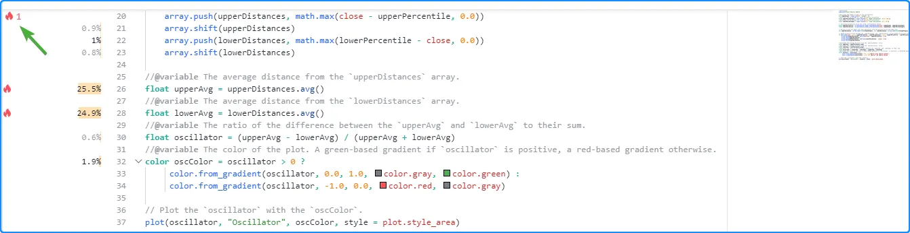

Ao passar o ponteiro do mouse sobre o espaço ao lado de uma linha, o código analisado é destacado e um tooltip com informações adicionais é exibido, incluindo o tempo gasto e o número de execuções. As informações mostradas ao lado de cada linha e no tooltip correspondente dependem da região de código perfilada. A [seção abaixo](./06_03_perfilamento_e_otimizacao.md#interpretando-resultados-perfilados) explica os diferentes tipos de código que o Profiler analisa e como interpretar seus resultados de desempenho.

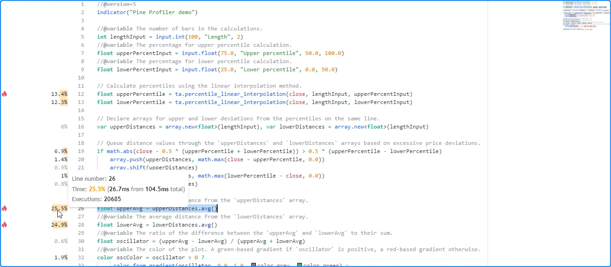

> __Observação!__\
> Assim como nas ferramentas de profiling para outras linguagens, o Pine Profiler _envolve_ um script e seu código significativo com [cálculos extras](./06_03_perfilamento_e_otimizacao.md#uma-visão-geral-do-funcionamento-interno-do-profiler) necessários para coletar dados de desempenho. Como tal, o uso de recursos do script __aumenta__ durante o profiling, e os resultados do Profiler refletem o tempo de execução do script com esses cálculos incluídos. Portanto, deve-se interpretar os resultados como __estimativas__ em vez de medições de desempenho precisas. Além disso, o Profiler não pode coletar e exibir dados de desempenho individuais para os _cálculos internos_ que também afetam o tempo de execução, incluindo os cálculos necessários para rastrear o desempenho, o que significa que os valores de tempo mostrados para todas as regiões de código de um script __não somarão__ exatamente 100% do tempo de execução geral.

### Interpretando Resultados Perfilados

#### Resultados de Linha Única

Para uma linha de código contendo expressões de linha única, a barra do Profiler e a percentagem exibida representam a porção relativa do tempo total de execução do script gasto nessa linha. O tooltip correspondente exibe três campos:

- O campo "Line number" indica a linha de código analisada.
- O campo "Time" mostra a percentagem de tempo de execução para a linha de código, o tempo de execução gasto nessa linha e o tempo total de execução do script.
- O campo "Executions" mostra o número de vezes que essa linha específica foi executada durante a execução do script.

Aqui, o ponteiro foi passado sobre o espaço ao lado da linha 12 do código perfilado para visualizar seu tooltip:

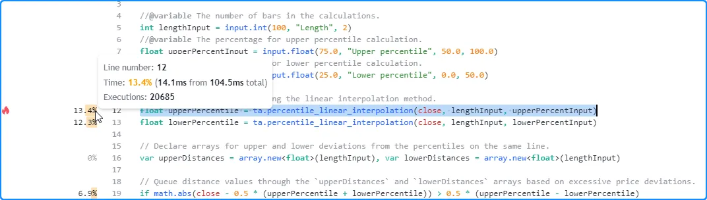

```c
float upperPercentile = ta.percentile_linear_interpolation(close, lengthInput, upperPercentInput)
```

__Note que:__

- As informações de tempo para a linha representam o tempo gasto completando _todas_ as execuções, __não__ o tempo gasto em uma única execução.
- Para estimar o tempo _médio_ gasto por execução, divida o tempo da linha pelo número de execuções. Neste caso, o tooltip mostra que a linha 12 levou cerca de 14,1 milissegundos para ser executada 20.685 vezes, o que significa que o tempo médio por execução foi aproximadamente 14,1 ms / 20685 = 0,0006816534 milissegundos (0,6816534 microssegundos).

Quando uma linha de código consiste em mais de uma expressão separada por vírgulas, o número de execuções mostrado no tooltip representa a _soma_ das execuções totais de cada expressão, e o valor do tempo exibido representa o tempo total gasto na avaliação de todas as expressões da linha.

Por exemplo, esta linha global do exemplo inicial inclui duas [declarações de variáveis](./04_06_declaracoes_de_variavel.md) separadas por vírgulas. Cada uma usa a palavra-chave [var](https://br.tradingview.com/pine-script-reference/v5/#kw_var), o que significa que o script só as executa uma vez na primeira barra disponível. Como visto no tooltip do Profiler para a linha, foram contadas _duas_ execuções (uma para cada expressão) e o valor do tempo mostrado é o resultado _combinado_ de ambas as expressões na linha:

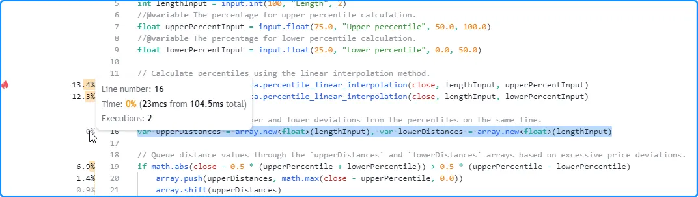

```c
var upperDistances = array.new<float>(lengthInput), var lowerDistances = array.new<float>(lengthInput)
```

__Note que:__

- Ao analisar scripts com mais de uma expressão na mesma linha, recomenda-se mover cada expressão para uma _linha separada_ para obter insights mais detalhados durante o profiling, especialmente se elas podem conter cálculos de _maior impacto_.

Ao usar [quebra de linha](./06_01_guia_de_estilo.md#quebra-de-linha) para fins de legibilidade ou estilísticos, o Profiler considera todas as partes de uma linha quebrada como parte da _primeira linha_ onde ela começa no Pine Editor.

Por exemplo, embora este código do script inicial ocupe mais de uma linha no Pine Editor, ele ainda é tratado como uma _única_ linha de código, e o tooltip do Profiler exibe resultados de linha única, com o campo "Line number" mostrando a _primeira_ linha no Editor que a linha quebrada ocupa:

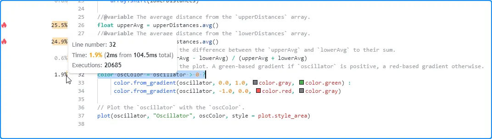

```c
color oscColor = oscillator > 0 ?
     color.from_gradient(oscillator, 0.0, 1.0, color.gray, color.green) :
     color.from_gradient(oscillator, -1.0, 0.0, color.red, color.gray)
```

#### Resultados de Blocos de Código

Para uma linha no início de um [loop](./04_08_loops.md) ou estrutura [condicional](./04_07_estruturas_condicionais.md), a barra do Profiler e a percentagem representam a porção relativa do tempo de execução do script gasto em __todo o bloco de código__, não apenas na linha única. O tooltip correspondente exibe quatro campos:

- O campo "Code block range" indica o intervalo de linhas incluídas na estrutura.
- O campo "Time" mostra a percentagem do tempo de execução do bloco de código, o tempo gasto em todas as execuções do bloco e o tempo total de execução do script.
- O campo "Line time" mostra a percentagem do tempo de execução da linha inicial do bloco, o tempo gasto nessa linha e o tempo total de execução do script. A interpretação difere para blocos [switch](https://br.tradingview.com/pine-script-reference/v5/#kw_switch) ou blocos [if](https://br.tradingview.com/pine-script-reference/v5/#kw_if) _com_ declarações [else if](https://br.tradingview.com/pine-script-reference/v5/#kw_if), pois os valores representam o tempo total gasto em __todas__ as declarações condicionais da estrutura. Veja abaixo para mais informações.
- O campo "Executions" mostra o número de vezes que o bloco de código foi executado durante a execução do script.

Aqui, o ponteiro foi passado sobre o espaço ao lado da linha 19 no script inicial, o início de uma estrutura [if](https://br.tradingview.com/pine-script-reference/v5/#kw_if) simples _sem_ declarações [else if](https://br.tradingview.com/pine-script-reference/v5/#kw_if). Como visto abaixo, o tooltip mostra informações de desempenho para todo o bloco de código e a linha atual:

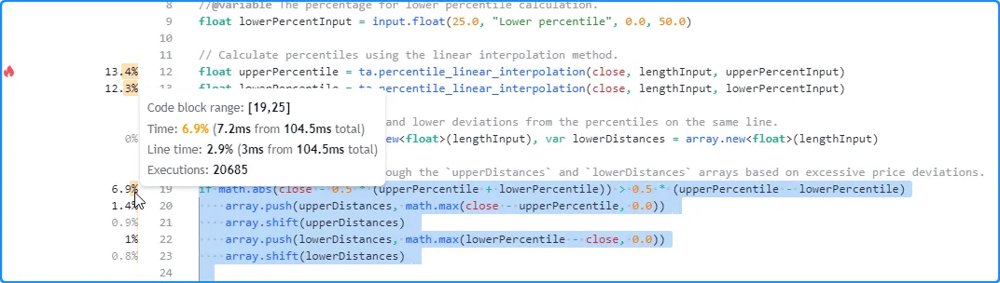

```c
if math.abs(close - 0.5 * (upperPercentile + lowerPercentile)) > 0.5 * (upperPercentile - lowerPercentile)
    array.push(upperDistances, math.max(close - upperPercentile, 0.0))
    array.shift(upperDistances)
    array.push(lowerDistances, math.max(lowerPercentile - close, 0.0))
    array.shift(lowerDistances)
```

__Note que:__

- O campo "Time" mostra que o tempo total gasto na avaliação da estrutura 20.685 vezes foi de 7,2 milissegundos.
- O campo "Line time" indica que o tempo de execução gasto na _primeira linha_ desta estrutura [if](https://br.tradingview.com/pine-script-reference/v5/#kw_if) foi de cerca de três milissegundos.

Os usuários também podem inspecionar os resultados das linhas e blocos aninhados dentro do intervalo do bloco de código para obter insights de desempenho mais granulares. Aqui, o ponteiro foi passado sobre o espaço ao lado da linha 20 dentro do bloco de código para visualizar seu [resultado de linha única](./06_03_perfilamento_e_otimizacao.md#resultados-de-linha-única):

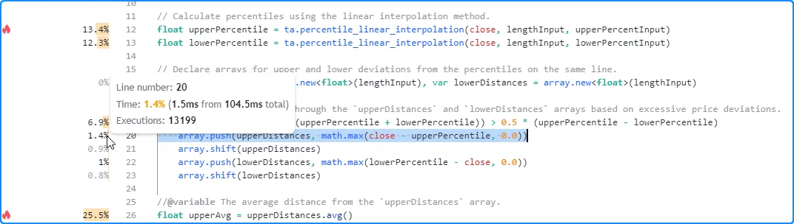

__Note que:__

- O número de execuções mostrado é _menor_ do que o resultado para todo o bloco de código, pois a condição que controla a execução desta linha não retorna `true` o tempo todo. O oposto se aplica ao código dentro de [loops](./04_08_loops.md), já que cada execução de uma declaração de loop pode acionar __várias__ execuções do bloco local do loop.

Ao perfilar uma estrutura [switch](https://br.tradingview.com/pine-script-reference/v5/#kw_switch) ou uma estrutura [if](https://br.tradingview.com/pine-script-reference/v5/#kw_if) que inclui declarações [else if](https://br.tradingview.com/pine-script-reference/v5/#kw_if), o campo "Line time" mostrará o tempo gasto na execução de __todas__ as expressões condicionais da estrutura, __não__ apenas a primeira linha do bloco. Os resultados para as linhas dentro do intervalo do bloco de código mostrarão o tempo de execução e as execuções para cada __bloco local__. Este formato é necessário para essas estruturas devido às limitações de cálculo e exibição do Profiler. Veja [esta seção](./06_03_perfilamento_e_otimizacao.md#uma-visão-geral-do-funcionamento-interno-do-profiler) para mais informações.

Por exemplo, o "Line time" para a estrutura [switch](https://br.tradingview.com/pine-script-reference/v5/#kw_switch) neste script representa o tempo gasto na avaliação de _todas as quatro_ declarações condicionais dentro de seu corpo, pois o Profiler _não pode_ rastreá-las separadamente. Os resultados para cada linha no intervalo do bloco de código representam as informações de desempenho para cada _bloco local_:

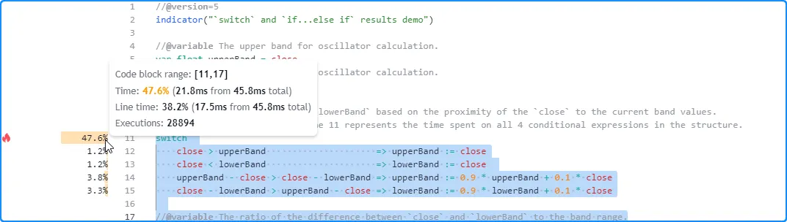

```c
//@version=5
indicator("`switch` and `if...else if` results demo")

//@variable The upper band for oscillator calculation.
var float upperBand = close
//@variable The lower band for oscillator calculation.
var float lowerBand = close

// Update the `upperBand` and `lowerBand` based on the proximity of the `close` to the current band values.
// The "Line time" field on line 11 represents the time spent on all 4 conditional expressions in the structure.
switch
    close > upperBand                     => upperBand := close
    close < lowerBand                     => lowerBand := close
    upperBand - close > close - lowerBand => upperBand := 0.9 * upperBand + 0.1 * close
    close - lowerBand > upperBand - close => lowerBand := 0.9 * lowerBand + 0.1 * close

//@variable The ratio of the difference between `close` and `lowerBand` to the band range.
float oscillator = 100.0 * (close - lowerBand) / (upperBand - lowerBand)

// Plot the `oscillator` as columns with a dynamic color.
plot(
     oscillator, "Oscillator", oscillator > 50.0 ? color.teal : color.maroon,
     style = plot.style_columns, histbase = 50.0
 )
```

Quando a lógica condicional em tais estruturas envolve cálculos significativos, os programadores podem precisar de informações de desempenho mais granulares para cada condição calculada. Uma maneira eficaz de alcançar essa análise é usar blocos [if](https://br.tradingview.com/pine-script-reference/v5/#kw_if) _aninhados_ em vez das estruturas mais compactas [switch](https://br.tradingview.com/pine-script-reference/v5/#kw_switch) ou [if...else if](https://br.tradingview.com/pine-script-reference/v5/#kw_if). Por exemplo, em vez de:

```c
switch
    <expression1> => <localBlock1>
    <expression2> => <localBlock2>
    =>               <localBlock3>
```

Ou:

```c
if <expression1>
    <localBlock1>
else if <expression2>
    <localBlock2>
else
    <localBlock3>
```

Pode-se usar blocos [if](https://br.tradingview.com/pine-script-reference/v5/#kw_if) aninhados para uma análise mais aprofundada, mantendo o mesmo fluxo lógico:

```c
if <expression1>
    <localBlock1>
else
    if <expression2>
        <localBlock2>
    else
        <localBlock3>
```

Abaixo, o exemplo anterior [switch](https://br.tradingview.com/pine-script-reference/v5/#kw_switch) foi alterado para uma estrutura [if](https://br.tradingview.com/pine-script-reference/v5/#kw_if) aninhada equivalente. Agora, é possível visualizar o tempo de execução e as execuções para cada parte significativa do padrão condicional individualmente:

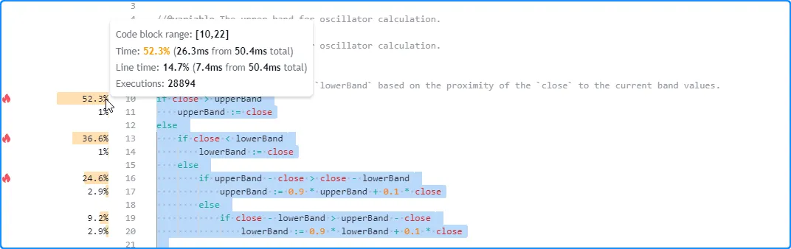

```c
//@version=5
indicator("`switch` and `if...else if` results demo")

//@variable The upper band for oscillator calculation.
var float upperBand = close
//@variable The lower band for oscillator calculation.
var float lowerBand = close

// Update the `upperBand` and `lowerBand` based on the proximity of the `close` to the current band values.
if close > upperBand
    upperBand := close
else
    if close < lowerBand
        lowerBand := close
    else
        if upperBand - close > close - lowerBand
            upperBand := 0.9 * upperBand + 0.1 * close
        else
            if close - lowerBand > upperBand - close
                lowerBand := 0.9 * lowerBand + 0.1 * close

//@variable The ratio of the difference between `close` and `lowerBand` to the band range.
float oscillator = 100.0 * (close - lowerBand) / (upperBand - lowerBand)

// Plot the `oscillator` as columns with a dynamic color.
plot(
     oscillator, "Oscillator", oscillator > 50.0 ? color.teal : color.maroon,
     style = plot.style_columns, histbase = 50.0
 )
```

__Note que:__

- Este mesmo processo também pode ser aplicado a [expressões ternárias](https://br.tradingview.com/pine-script-reference/v5/#op_?:). Quando os operandos de uma expressão ternária complexa contêm cálculos significativos, reorganizar a lógica em uma estrutura [if](https://br.tradingview.com/pine-script-reference/v5/#kw_if) aninhada permite resultados de Profiler mais detalhados, facilitando a identificação das partes críticas.

#### Chamadas de Funções Definidas pelo Usuário

[Funções definidas pelo usuário](./04_11_funcoes_definidas_pelo_usuario.md) e [métodos](./04_13_metodos.md#métodos-definidos-pelo-usuário) são funções escritas por usuários. Elas encapsulam sequências de código que um script pode executar várias vezes. Funções e métodos são frequentemente escritos para melhorar a modularidade, reutilização e manutenção do código.

As linhas de código indentadas dentro de uma função representam seu _escopo local_, ou seja, a sequência que é executada _cada vez_ que o script a chama. Diferente do código no escopo global do script, que é avaliado uma vez a cada execução, o código dentro de uma função pode ser ativado zero, uma ou _várias vezes_ em cada execução do script, dependendo das condições que acionam as chamadas, do número de chamadas que ocorrem e da lógica da função.

Essa distinção é crucial ao interpretar os resultados do Profiler. Quando um código perfilado contém chamadas de [funções definidas pelo usuário](./04_11_funcoes_definidas_pelo_usuario.md) ou [métodos](./04_13_metodos.md#métodos-definidos-pelo-usuário):

- Os resultados para cada _chamada de função_ refletem o tempo de execução alocado para ela e o número total de vezes que o script ativou essa chamada específica.
- As informações de tempo e execução para todo o código local _dentro_ do escopo de uma função refletem os resultados combinados de __todas__ as chamadas para a função.

Este exemplo contém uma função definida pelo usuário `similarity()` que estima a similaridade de duas séries, chamada pelo script apenas _uma vez_ no escopo global em cada execução. Nesse caso, os resultados do Profiler para o código dentro do corpo da função correspondem a essa chamada específica:

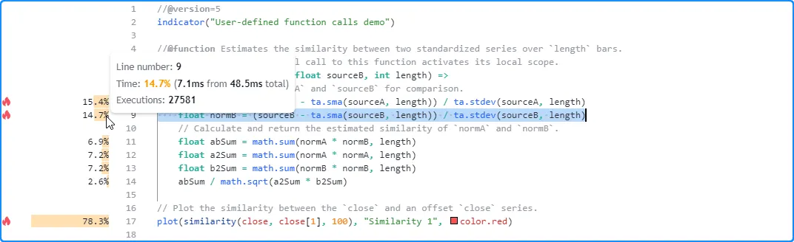

```c
//@version=5
indicator("User-defined function calls demo")

//@function Estimates the similarity between two standardized series over `length` bars.
//          Each individual call to this function activates its local scope.
similarity(float sourceA, float sourceB, int length) =>
    // Standardize `sourceA` and `sourceB` for comparison.
    float normA = (sourceA - ta.sma(sourceA, length)) / ta.stdev(sourceA, length)
    float normB = (sourceB - ta.sma(sourceB, length)) / ta.stdev(sourceB, length)
    // Calculate and return the estimated similarity of `normA` and `normB`.
    float abSum = math.sum(normA * normB, length)
    float a2Sum = math.sum(normA * normA, length)
    float b2Sum = math.sum(normB * normB, length)
    abSum / math.sqrt(a2Sum * b2Sum)

// Plot the similarity between the `close` and an offset `close` series.
plot(similarity(close, close[1], 100), "Similarity 1", color.red)
```

É adicionado o número de vezes que o script chama a função a cada execução. Aqui, o script foi alterado para chamar a [função definida pelo usuário](./04_11_funcoes_definidas_pelo_usuario.md) _cinco vezes_:

```c
//@version=5
indicator("User-defined function calls demo")

//@function Estimates the similarity between two standardized series over `length` bars.
//          Each individual call to this function activates its local scope.
similarity(float sourceA, float sourceB, int length) =>
    // Standardize `sourceA` and `sourceB` for comparison.
    float normA = (sourceA - ta.sma(sourceA, length)) / ta.stdev(sourceA, length)
    float normB = (sourceB - ta.sma(sourceB, length)) / ta.stdev(sourceB, length)
    // Calculate and return the estimated similarity of `normA` and `normB`.
    float abSum = math.sum(normA * normB, length)
    float a2Sum = math.sum(normA * normA, length)
    float b2Sum = math.sum(normB * normB, length)
    abSum / math.sqrt(a2Sum * b2Sum)

// Plot the similarity between the `close` and several offset `close` series.
plot(similarity(close, close[1], 100), "Similarity 1", color.red)
plot(similarity(close, close[2], 100), "Similarity 2", color.orange)
plot(similarity(close, close[4], 100), "Similarity 3", color.green)
plot(similarity(close, close[8], 100), "Similarity 4", color.blue)
plot(similarity(close, close[16], 100), "Similarity 5", color.purple)
```

Nesse caso, os resultados do código local não correspondem mais a uma _única_ avaliação por execução do script. Em vez disso, eles representam o tempo de execução _combinado_ e as execuções do código local de __todas as cinco__ chamadas. Como visto abaixo, os resultados após executar esta versão do script nos mesmos dados mostram 137.905 execuções do código local, _cinco vezes_ o número de quando o script continha apenas uma chamada da função `similarity()`:

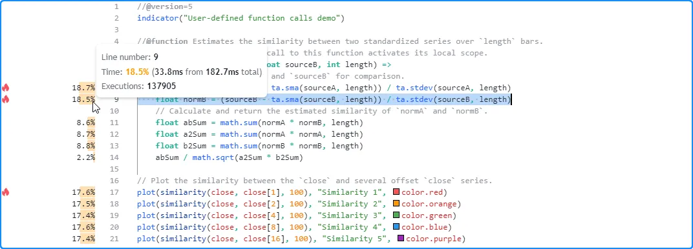

> __Observação!__\
> Quando os escopos locais de [funções definidas pelo usuário](./04_11_funcoes_definidas_pelo_usuario.md) ou [métodos](./04_13_metodos.md#métodos-definidos-pelo-usuário) de um script contêm chamadas para funções `request.*()`, a _forma traduzida_ do script extrai essas chamadas __fora__ dos escopos das funções e as avalia __separadamente__. Consequentemente, os resultados do Profiler para linhas com chamadas para essas [funções definidas pelo usuário](./04_11_funcoes_definidas_pelo_usuario.md) __não__ incluirão o tempo gasto nas chamadas `request.*()`. Veja a [seção abaixo](./06_03_perfilamento_e_otimizacao.md#solicitando-outros-contextos) para mais informações.

<!-- #### Solicitando Outros Contextos

Scripts Pine podem solicitar dados de outros _contextos_, ou seja, símbolos diferentes, _timeframes_ ou modificações de dados diferentes dos utilizados pelos dados do gráfico, chamando a família de funções `request.*()` ou especificando um `timeframe` alternativo na declaração [indicator()](https://br.tradingview.com/pine-script-reference/v5/#fun_indicator).

Quando um script solicita dados de outro contexto, ele avalia todos os escopos e cálculos necessários dentro desse contexto, conforme explicado na página [Outros _Timeframes_ e Dados](./05_14_outros_timeframes_e_dados.md). Esse comportamento pode afetar o tempo de execução das regiões de código do script e o número de vezes que são executadas.

As informações do Profiler para qualquer [linha](./06_03_perfilamento_e_otimizacao.md#resultados-de-linha-única) ou [bloco](./06_03_perfilamento_e_otimizacao.md#resultados-de-blocos-de-código) de código representam os resultados da execução do código em __todos os contextos necessários__, que podem ou não incluir os dados do gráfico. O Pine Script determina quais contextos executar o código com base nos cálculos necessários pelas solicitações de dados e saídas do script.

Vamos observar um exemplo simples. Este script inicial utiliza apenas os dados do gráfico para seus cálculos. Ele declara uma variável `pricesArray` com a palavra-chave [varip](https://br.tradingview.com/pine-script-reference/v5/#kw_varip), o que significa que o [array](https://br.tradingview.com/pine-script-reference/v5/#type_array) atribuído a ela persiste ao longo do histórico dos dados e de todos os ticks em tempo real disponíveis. Em cada execução, o script chama [array.push()](https://br.tradingview.com/pine-script-reference/v5/#fun_array.push) para adicionar um novo valor de [close](https://br.tradingview.com/pine-script-reference/v5/#var_close) ao [array](https://br.tradingview.com/pine-script-reference/v5/#type_array) e [plota](./05_15_plots.md) o [tamanho do array](https://br.tradingview.com/pine-script-reference/v5/#fun_array.size).

Após perfilar o script em todas as barras de um gráfico intradiário, vê-se que o número de elementos no `pricesArray` corresponde ao número de execuções que o Profiler mostra para a chamada [array.push()](https://br.tradingview.com/pine-script-reference/v5/#fun_array.push) na linha 8:

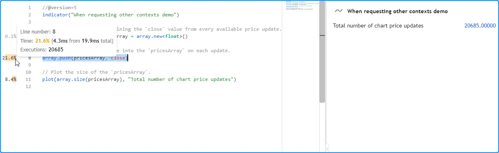

```c
//@version=5
indicator("When requesting other contexts demo")

//@variable An array containing the `close` value from every available price update.
varip array<float> pricesArray = array.new<float>()

// Push a new `close` value into the `pricesArray` on each update.
array.push(pricesArray, close)

// Plot the size of the `pricesArray`.
plot(array.size(pricesArray), "Total number of chart price updates")
```

Agora, ao avaliar o tamanho do `pricesArray` de _outro contexto_ em vez de usar os dados do gráfico. Abaixo, uma chamada [request.security()](https://br.tradingview.com/pine-script-reference/v5/#fun_request.security) foi adicionada com [array.size(pricesArray)](https://br.tradingview.com/pine-script-reference/v5/#fun_array.size) como argumento `expression` para recuperar o valor calculado no timeframe "1D" e plotar esse resultado.

Nesse caso, o número de execuções que o Profiler mostra na linha 8 ainda corresponde ao número de elementos no `pricesArray`. No entanto, não foi executado o mesmo número de vezes, pois o script não precisava dos _dados do gráfico_ nos cálculos. Foi necessário apenas inicializar o [array](https://br.tradingview.com/pine-script-reference/v5/#type_array) e avaliar [array.push()](https://br.tradingview.com/pine-script-reference/v5/#fun_array.push) em todos os dados _diários_ solicitados, que têm um número diferente de atualizações de preços em comparação com o gráfico intradiário atual:

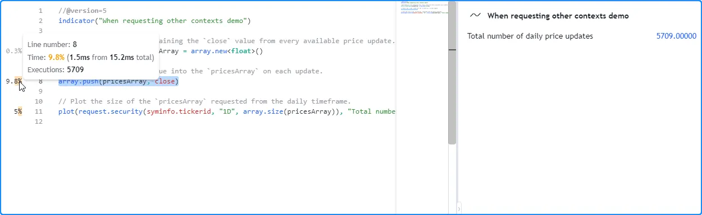

```c
//@version=5
indicator("When requesting other contexts demo")

//@variable An array containing the `close` value from every available price update.
varip array<float> pricesArray = array.new<float>()

// Push a new `close` value into the `pricesArray` on each update.
array.push(pricesArray, close)

// Plot the size of the `pricesArray` requested from the daily timeframe.
plot(request.security(syminfo.tickerid, "1D", array.size(pricesArray)), "Total number of daily price updates")
```

__Note que:__

- Os dados EOD solicitados neste exemplo tinham menos pontos de dados do que o gráfico intradiário, portanto, a chamada [array.push()](https://br.tradingview.com/pine-script-reference/v5/#fun_array.push) exigiu menos execuções nesse caso. No entanto, os feeds EOD __não__ têm limitações de histórico, o que significa que também é possível que os dados HTF solicitados abranjam __mais__ barras do que o gráfico do usuário, dependendo do timeframe, do provedor de dados e do [plano](https://br.tradingview.com/pricing) do usuário.

Se este script fosse plotar o valor de [array.size()](https://br.tradingview.com/pine-script-reference/v5/#fun_array.size) diretamente além do valor diário solicitado, seria necessário criar _dois_ [arrays](./04_14_arrays.md) (um para cada contexto) e executar [array.push()](https://br.tradingview.com/pine-script-reference/v5/#fun_array.push) tanto nos dados do gráfico _quanto_ nos dados do timeframe diário. Assim, a declaração na linha 5 será executada __duas vezes__ e os resultados na linha 8 refletirão o tempo e as execuções acumuladas da avaliação da chamada [array.push()](https://br.tradingview.com/pine-script-reference/v5/#fun_array.push) em __ambos os conjuntos de dados separados__:

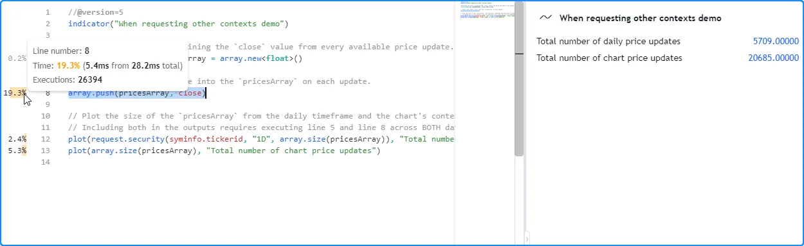

```c
//@version=5
indicator("When requesting other contexts demo")

//@variable An array containing the `close` value from every available price update.
varip array<float> pricesArray = array.new<float>()

// Push a new `close` value into the `pricesArray` on each update.
array.push(pricesArray, close)

// Plot the size of the `pricesArray` from the daily timeframe and the chart's context.
// Including both in the outputs requires executing line 5 and line 8 across BOTH datasets.  
plot(request.security(syminfo.tickerid, "1D", array.size(pricesArray)), "Total number of daily price updates")
plot(array.size(pricesArray), "Total number of chart price updates")
```

É importante notar que quando um script chama uma [função definida pelo usuário](./04_11_funcoes_definidas_pelo_usuario.md) ou um [método](./04_13_metodos.md#métodos-definidos-pelo-usuário) que contém chamadas `request.*()` em seu escopo local, a _forma traduzida_ do script extrai as chamadas `request.*()` __fora__ do escopo e encapsula as expressões das quais dependem dentro de __funções separadas__. Quando o script é executado, ele avalia as chamadas `request.*()` necessárias primeiro e, em seguida, __passa__ os dados solicitados para uma _forma modificada_ da [função definida pelo usuário](./04_11_funcoes_definidas_pelo_usuario.md).

Como o script traduzido executa as solicitações de dados de uma [função definida pelo usuário](./04_11_funcoes_definidas_pelo_usuario.md) separadamente __antes__ de avaliar cálculos não solicitados em seu escopo local, os resultados do Profiler para linhas contendo chamadas para a função __não__ incluirão o tempo gasto nos cálculos necessários para as solicitações de dados.

Como exemplo, o script a seguir contém uma função definida pelo usuário `getCompositeAvg()` com uma chamada [request.security()](https://br.tradingview.com/pine-script-reference/v5/#fun_request.security) que solicita a [math.avg()](https://br.tradingview.com/pine-script-reference/v5/#fun_math.avg) de 10 chamadas [ta.wma()](https://br.tradingview.com/pine-script-reference/v5/#fun_ta.wma) com diferentes argumentos `length` de um `symbol` especificado. O script usa a função para solicitar o resultado médio usando um ticker ID [Heikin Ashi](https://br.tradingview.com/pine-script-reference/v5/#fun_ticker.heikinashi):

```c
//@version=5
indicator("User-defined functions with `request.*()` calls demo", overlay = true)

int multInput = input.int(10, "Length multiplier", 1)

string tickerID = ticker.heikinashi(syminfo.tickerid)

getCompositeAvg(string symbol, int lengthMult) =>
    request.security(
         symbol, timeframe.period, math.avg(
             ta.wma(close, lengthMult), ta.wma(close, 2 * lengthMult), ta.wma(close, 3 * lengthMult), 
             ta.wma(close, 4 * lengthMult), ta.wma(close, 5 * lengthMult), ta.wma(close, 6 * lengthMult),
             ta.wma(close, 7 * lengthMult), ta.wma(close, 8 * lengthMult), ta.wma(close, 9 * lengthMult), 
             ta.wma(close, 10 * lengthMult)
         )
     )

plot(getCompositeAvg(tickerID, multInput), "Composite average", linewidth = 3)
```

Após perfilar o script, os usuários podem se surpreender ao ver que os resultados de tempo de execução mostrados dentro do corpo da função excedem __consideravelmente__ os resultados mostrados para a _única_ chamada `getCompositeAvg()`:

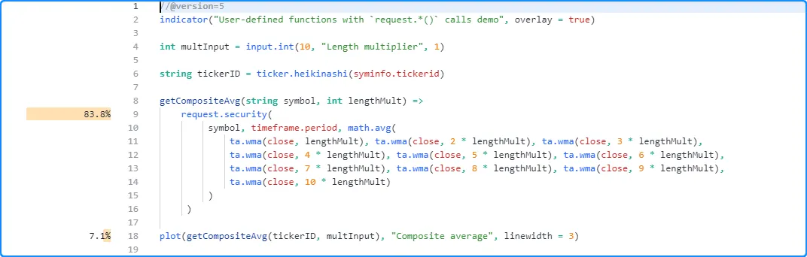

Os resultados aparecem dessa forma porque o script traduzido inclui modificações internas que _movem_ a chamada [request.security()](https://br.tradingview.com/pine-script-reference/v5/#fun_request.security) e sua expressão __fora__ do escopo da função, e o Profiler não tem como representar os resultados desses cálculos além de exibi-los ao lado da linha [request.security()](https://br.tradingview.com/pine-script-reference/v5/#fun_request.security) nesse cenário. O código abaixo ilustra aproximadamente como o script traduzido fica:

```c
//@version=5
indicator("User-defined functions with `request.*()` calls demo", overlay = true)

int multInput = input.int(10, "Length multiplier")

string tickerID = ticker.heikinashi(syminfo.tickerid)

secExpr(int lengthMult)=>
    math.avg(
         ta.wma(close, lengthMult), ta.wma(close, 2 * lengthMult), ta.wma(close, 3 * lengthMult),
         ta.wma(close, 4 * lengthMult), ta.wma(close, 5 * lengthMult), ta.wma(close, 6 * lengthMult),
         ta.wma(close, 7 * lengthMult), ta.wma(close, 8 * lengthMult), ta.wma(close, 9 * lengthMult),
         ta.wma(close, 10 * lengthMult)
     )

float sec = request.security(tickerID, timeframe.period, secExpr(multInput))

getCompositeAvg(float s) => s

plot(getCompositeAvg(sec), "Composite average", linewidth = 3)
```

__Note que:__

- O código `secExpr()` representa a __função separada__ usada por [request.security()](https://br.tradingview.com/pine-script-reference/v5/#fun_request.security) para calcular a expressão necessária no contexto solicitado.
- A chamada [request.security()](https://br.tradingview.com/pine-script-reference/v5/#fun_request.security) ocorre no __escopo externo__, fora da função `getCompositeAvg()`.
- A tradução reduziu substancialmente o código local de `getCompositeAvg()`. Agora, ele apenas retorna um valor passado para ele, já que todos os cálculos necessários da função ocorrem __fora__ de seu escopo. Devido a essa redução, os resultados de desempenho da chamada da função __não__ refletirão nenhum do tempo gasto nos cálculos necessários para a solicitação de dados. -->

## Otimização

## Código Insignificante, Inusitado e Redundante

## Uma Visão Geral do Funcionamento Interno do Profiler
