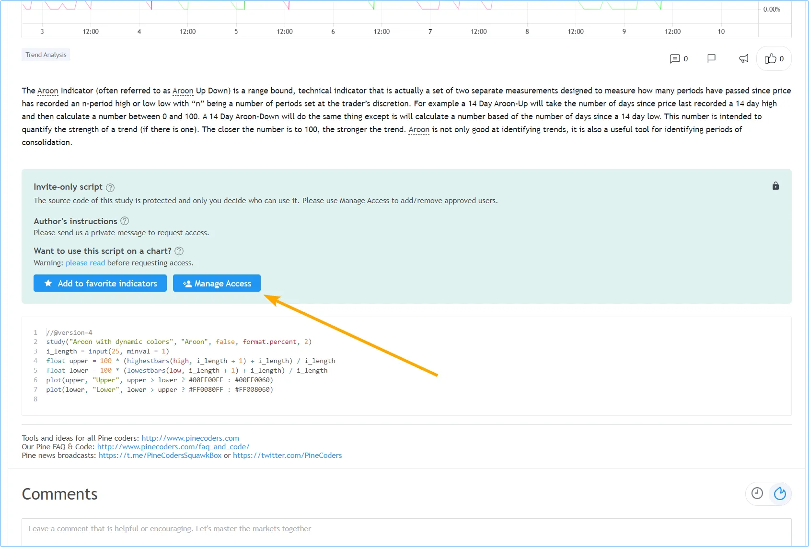
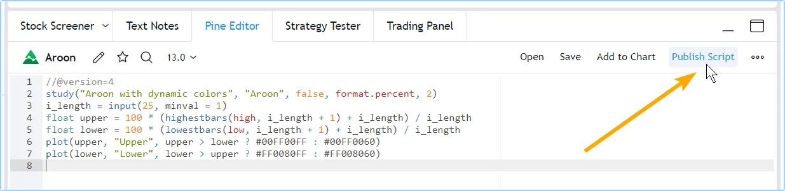
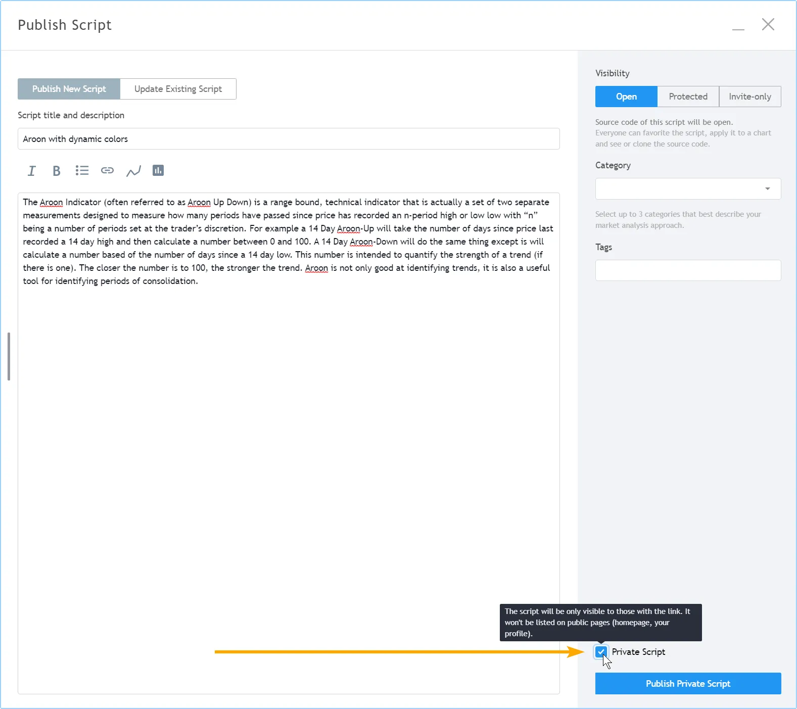
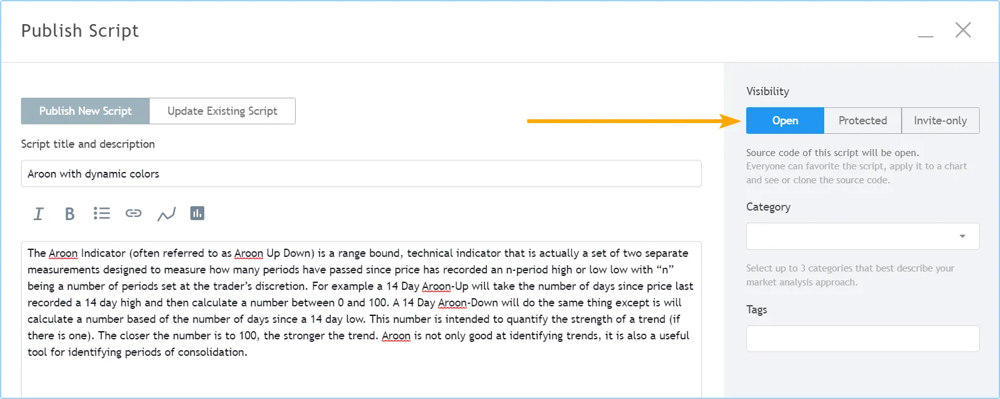
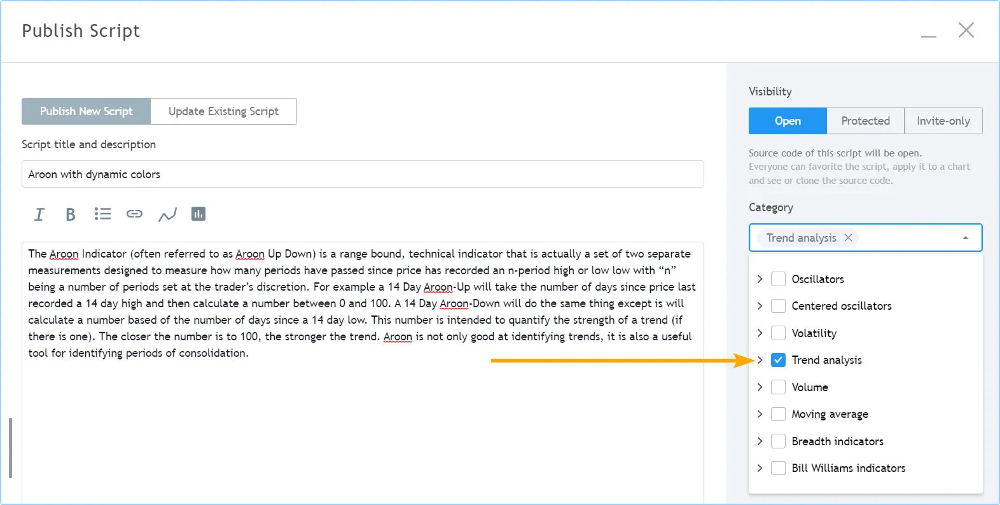
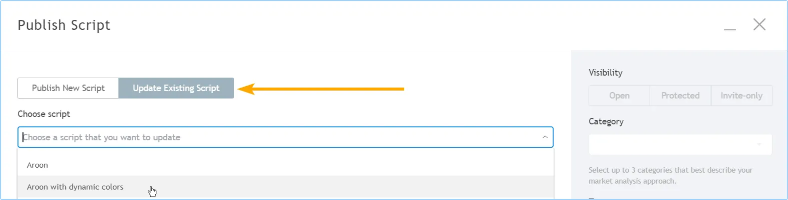
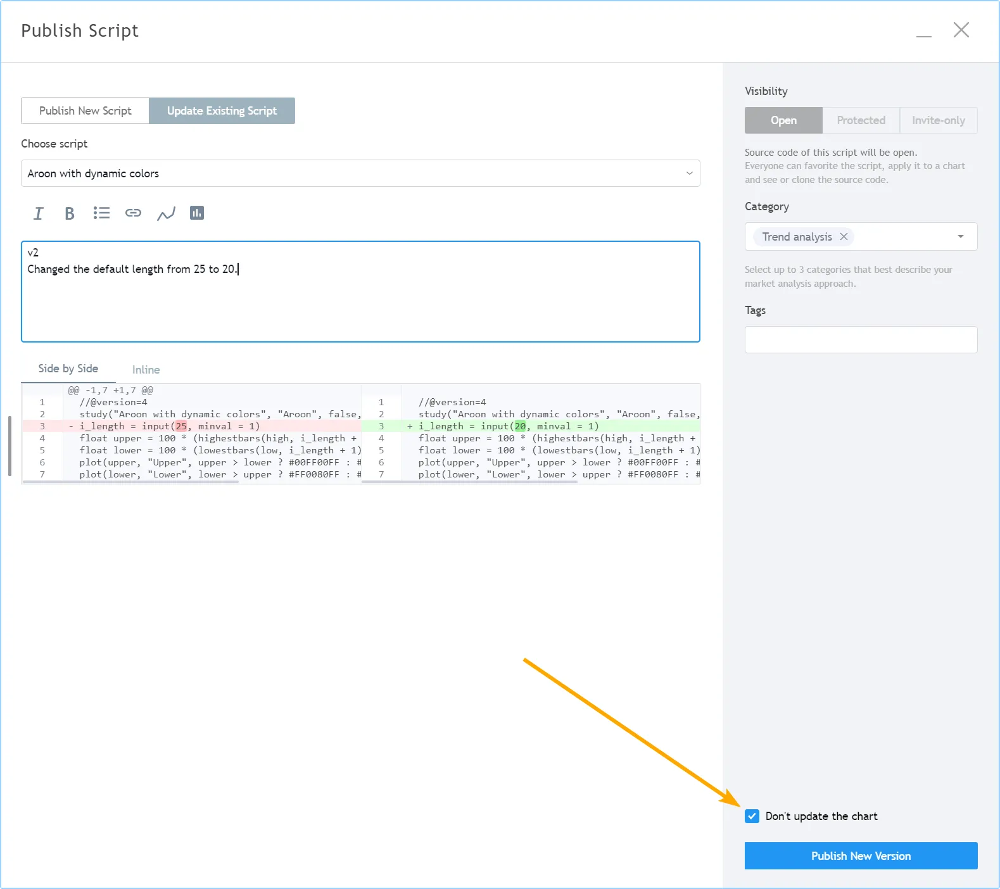

# Publicando Scripts

Programadores que desejam compartilhar seus scripts Pine com outros traders podem publicá-los.

> __Observação!__\
> Se você escreve scripts para uso pessoal, não há necessidade de publicá-los; você pode salvá-los no Pine Editor e usar o botão "Adicionar ao Gráfico" "_Add to Chart_" para adicionar seu script ao seu gráfico.

## Visibilidade e Acesso ao Script

Ao publicar um script, você controla sua __visibilidade__ e __acesso__:

- __Visibilidade__ é controlada ao escolher publicar __publicamente__ ou __privadamente__. Veja [Como as ideias e scripts privados diferem dos públicos?](https://br.tradingview.com/support/solutions/43000548335/) no Centro de Ajuda para mais detalhes. Publique publicamente quando você tiver escrito um script que acredita ser útil para outros usuários do TradingView. Scripts públicos estão sujeitos à moderação. Para evitar moderação, certifique-se de que sua publicação esteja em conformidade com as [Regras da Casa](https://br.tradingview.com/support/solutions/43000591638) e [Regras de Publicação de Scripts](https://br.tradingview.com/support/solutions/43000590599). Publique privadamente quando não quiser que seu script seja visível para todos os outros usuários, mas deseja compartilhá-lo com alguns amigos.
- __Acesso__ determina se os usuários verão seu código-fonte e como poderão usar seu script. Existem três tipos de acesso: _aberto_, _protegido_ (reservado para contas pagas) ou _somente convidado_ (reservado para contas Premium). Veja [Quais são os diferentes tipos de scripts publicados?](https://br.tradingview.com/support/solutions/43000482573) no Centro de Ajuda para mais detalhes.

<!-- ### Ao Publicar um Script

- O título da publicação é determinado pelo argumento usado para o parâmetro `title` na declaração do script [indicator()](https://br.tradingview.com/pine-script-reference/v5/#fun_indicator) ou [strategy()](https://br.tradingview.com/pine-script-reference/v5/#fun_strategy). Esse título também é usado quando os usuários do TradingView pesquisam nomes de scripts.
- O nome do seu script no gráfico será o argumento usado para o parâmetro `shorttitle` na declaração do script [indicator()](https://br.tradingview.com/pine-script-reference/v5/#fun_indicator) ou [strategy()](https://br.tradingview.com/pine-script-reference/v5/#fun_strategy), ou o argumento [title] em [library()](https://br.tradingview.com/pine-script-reference/v5/#fun_library).
- Seu script deve ter uma descrição explicando o que ele faz e como usá-lo.
- O gráfico que você está usando ao publicar se tornará visível na sua publicação, incluindo quaisquer outros scripts ou desenhos nele. Remova scripts ou desenhos não relacionados do seu gráfico antes de publicar seu script.
- O código do seu script pode ser atualizado posteriormente. Cada atualização pode incluir _notas de lançamento_ que aparecerão, datadas, sob sua descrição original.
- Scripts podem ser curtidos, compartilhados, comentados ou denunciados por outros usuários.
- Seus scripts publicados aparecem na guia "SCRIPTS" do seu perfil de usuário.
- Um _widget de script_ e uma _página de script_ são criados para o seu script. O widget de script é o espaço reservado do seu script que aparece nos feeds de scripts na plataforma. Ele contém o título do seu script, o gráfico e as primeiras linhas da sua descrição. Quando os usuários clicam no __widget__ do seu script, a __página__ do script é aberta. Ela contém todas as informações relacionadas ao seu script.

### Visibilidade

#### Público

Ao publicar um script público:

- Seu script será incluído nos [Scripts da Comunidade](https://br.tradingview.com/scripts), onde se torna visível para milhões de usuários do TradingView em todas as versões internacionalizadas do site.
- Sua publicação deve estar em conformidade com as [Regras da Casa](https://br.tradingview.com/support/solutions/43000591638) e [Regras de Publicação de Scripts](https://br.tradingview.com/support/solutions/43000590599).
- Se seu script for um script de convite, você deve estar em conformidade com os [Requisitos de Vendedor](https://br.tradingview.com/support/solutions/43000549951).
- Ele se torna acessível através das funções de busca de scripts.
- Você não poderá editar sua descrição original ou seu título, nem mudar sua visibilidade pública/privada, nem seu tipo de acesso (código aberto, protegido, somente convidado).
- Você não poderá excluir sua publicação.

#### Privado

Ao publicar um script privado:

- Ele não será visível para outros usuários, a menos que você compartilhe seu URL com eles.
- Ele é visível para você na guia "SCRIPTS" do seu perfil de usuário.
- Scripts privados são identificáveis pelos ícones de "X" e "cadeado" "_lock_" no canto superior direito do seu widget. O "X" é usado para excluí-lo.
- Ele não é moderado, a menos que você venda acesso a ele ou o torne público, pois então ele não é mais "privado" "_private_".
- Você pode atualizar sua descrição e título originais.
- Você não pode vincular ou mencioná-lo em nenhum conteúdo público do TradingView (ideias, descrições de scripts, comentários, chats, etc.).
- Ele não é acessível através das funções de busca de scripts.

### Acesso

Scripts públicos ou privados podem ser publicados usando um dos três tipos de acesso: aberto, protegido ou somente convidado. O tipo de acesso que você pode selecionar varia com o tipo de conta que você possui.

#### Aberto

O código Pine Script de scripts publicados como __abertos__ "__open__" é visível para todos os usuários. Scripts de código aberto no TradingView usam a licença Mozilla por padrão, mas você pode escolher qualquer licença que desejar. Você pode encontrar informações sobre licenciamento no [GitHub](https://help.github.com/articles/licensing-a-repository).

#### Protegido

O código de scripts __protegidos__ "__protected__" é oculto e ninguém além do autor pode acessá-lo. Embora o código do script não seja acessível, scripts protegidos podem ser usados livremente por qualquer usuário. Apenas contas Pro, Pro+ ou Premium podem publicar scripts públicos protegidos.

#### Somente Convidado

O tipo de acesso __somente convidado__ "__invite-only__" protege tanto o código do script quanto seu uso. O editor de um script somente convidado deve conceder acesso explicitamente a usuários individuais. Scripts somente convidado são usados principalmente por fornecedores de scripts que oferecem acesso pago aos seus scripts. Apenas contas Premium podem publicar scripts somente convidado, e eles devem estar em conformidade com os [Requisitos de Vendedor](https://br.tradingview.com/support/solutions/43000549951).

O TradingView não se beneficia das vendas de scripts. Transações envolvendo scripts somente convidado são estritamente entre usuários e vendedores; não envolvem o TradingView.

Scripts públicos somente convidado são os únicos scripts para os quais os vendedores podem pedir pagamento no TradingView.

Na página do script somente convidado, os autores verão um botão "Gerenciar Acesso" "_Manage Access_". A janela "Gerenciar Acesso" permite que os autores controlem quem tem acesso ao seu script.

## Preparando uma Publicação

1. Mesmo que você pretenda publicar publicamente, é sempre melhor começar com uma publicação privada, pois você pode usá-la para validar como será sua publicação final. Você pode editar o título, descrição, código ou gráfico das publicações privadas, e ao contrário dos scripts públicos, você pode excluir scripts privados quando não precisar mais deles, então eles são a maneira perfeita de praticar antes de compartilhar um script publicamente. Você pode ler mais sobre como preparar descrições de scripts na publicação [Como Escrevemos e Formatamos Descrições de Scripts](https://br.tradingview.com/chart/SSP/aOYEvBxw-How-We-Write-and-Format-Script-Descriptions).

2. Prepare seu gráfico. Carregue seu script no gráfico e remova outros scripts ou desenhos que não ajudarão os usuários a entender seu script. As plotagens do seu script devem ser fáceis de identificar no gráfico que será publicado com ele.

3. Carregue seu código no Pine Editor, se ainda não estiver. No Editor, clique no botão "Publicar Script":

4. Um pop-up aparecerá para lembrá-lo de que, se você publicar publicamente, é importante que sua publicação esteja em conformidade com as Regras da Casa. Após passar pelo pop-up, coloque sua descrição no campo abaixo do título do script. O título padrão proposto para sua publicação é o campo `title` do código do seu script. É sempre melhor usar esse título; ele facilita para os usuários encontrarem seu script se ele for público. Selecione a visibilidade da sua publicação. Se quiser publicar uma publicação privada, então marca a caixa de seleção "Script Privado" no canto inferior direito da janela "Publicar Script":

5. Selecione o tipo de acesso que você deseja para seu script: Aberto, Protegido ou Somente Convidado. Seleciona-se "Aberto" para código aberto.

6. Selecione as categorias apropriadas para seu script (pelo menos uma é obrigatória) e insira tags personalizadas opcionais.

7. Clique no botão "Publicar Script Privado" "_Publish Private Script_" no canto inferior direito da janela. Quando a publicação estiver completa, a página do script publicado aparecerá. Você terminou! Você pode confirmar a publicação acessando seu Perfil de Usuário e visualizando a guia "SCRIPTS". De lá, você poderá abrir a página do seu script e editar sua publicação privada usando o botão "Editar" no canto superior direito da página do seu script. Observe que você também pode atualizar publicações privadas, assim como pode com scripts públicos. Se você quiser compartilhar sua publicação privada com um amigo, envie o URL da página do seu script para ele de forma privada. Lembre-se de que você não pode compartilhar links para publicações privadas em conteúdos públicos do TradingView.

## Publicando um Script

Seja sua intenção publicar privadamente ou publicamente, siga primeiro os passos da seção anterior. Se você pretende publicar privadamente, você terá terminado. Se você pretende publicar publicamente e está satisfeito com o processo preparatório de validação da sua publicação privada, siga os mesmos passos acima, mas não marque a caixa "Script Privado" "_Private Script_" e clique no botão "Publicar Script Público" "_Publish Public Script_" no canto inferior direito da página "Publicar Script" "_Publish Script_".

Ao publicar um novo script público, você tem uma janela de 15 minutos para fazer alterações na sua descrição ou excluir a publicação. Depois disso, você não poderá mais alterar o título, a descrição, a visibilidade ou o tipo de acesso da sua publicação. Se você cometer um erro, envie uma mensagem para a conta moderadora [PineCoders](https://br.tradingview.com/u/PineCoders); eles moderam as publicações de scripts e ajudarão.

## Atualizando uma Publicação

Você pode atualizar publicações de scripts públicos ou privados. Ao atualizar um script, seu código deve ser diferente do código da versão publicada anteriormente. Você pode adicionar notas de lançamento com sua atualização. Elas aparecerão após a descrição original do seu script na página do script.

Por padrão, o gráfico usado ao atualizar substituirá o gráfico anterior na página do seu script. No entanto, você pode escolher não atualizar o gráfico da página do seu script. Observe que, embora você possa atualizar o gráfico exibido na página do script, o gráfico do widget do script não será atualizado.

Da mesma forma que você pode validar uma publicação pública publicando primeiro um script privado, você também pode validar uma atualização em uma publicação privada antes de prosseguir com ela em uma pública. O processo de atualização de um script publicado é o mesmo para scripts públicos e privados.

Se você pretende atualizar tanto o código quanto o gráfico do seu script publicado, prepare seu gráfico da mesma forma que faria para uma nova publicação. No exemplo a seguir, o gráfico da publicação __não__ será atualizado:

1. Como faria para uma nova publicação, carregue seu script no Editor e clique no botão "Publicar Script".

2. Uma vez na janela "Publicar Script", selecione o botão "Atualizar Script Existente" "_Update Existing Script_". Em seguida, selecione o script a ser atualizado no menu suspenso "Escolher script" "_Choose script_":

3. Insira suas notas de lançamento no campo de texto. As diferenças no seu código serão destacadas abaixo de suas notas de lançamento.

4. Caso não queira atualizar o gráfico da publicação, então marca a caixa de seleção "Não atualizar o gráfico" "_Don’t update the chart_":

5. Clique no botão "Publicar Nova Versão" "_Publish New Version_". Pronto.
 -->