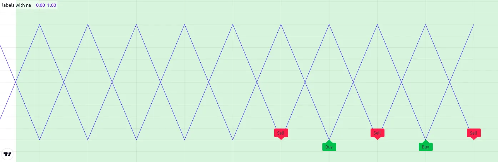
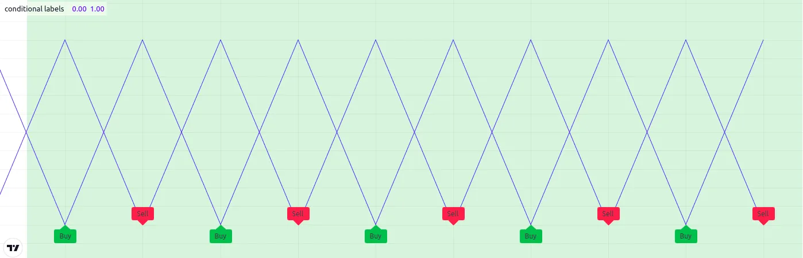

# Limitações

Como mencionado em na página de [Boas-vindas](./00_bem_vindo.md):

> _Cada script utiliza recursos computacionais na nuvem, portanto, limites são impostos para compartilhar esses recursos de maneira justa entre os usuários. O objetivo é definir o mínimo possível de limites, mas implementar tantos quantos necessário para que a plataforma funcione sem problemas. As limitações se aplicam à quantidade de dados solicitados de símbolos adicionais, tempo de execução, uso de memória e tamanho do script._

Se você desenvolver scripts complexos usando Pine Script, mais cedo ou mais tarde encontrará algumas das limitações impostas. Esta seção fornece uma visão geral das limitações que você pode encontrar. Atualmente, não há meios para que os programadores de Pine Script obtenham dados sobre os recursos consumidos por seus scripts. Espera-se que isso mude no futuro.

Enquanto isso, ao considerar grandes projetos, é mais seguro fazer uma prova de conceito para avaliar a probabilidade de seu script enfrentar limitações mais adiante no projeto.

Abaixo, são descritos os limites impostos no ambiente Pine Script.

## Tempo

### Compilação do Script

Os scripts devem ser compilados antes de serem executados nos gráficos. A compilação ocorre quando você salva um script no Pine Editor ou quando o adiciona ao gráfico. Um limite de dois minutos é imposto ao tempo de compilação, que dependerá do tamanho e da complexidade do seu script e se uma versão em cache de uma compilação anterior está disponível. Quando uma compilação excede o limite de dois minutos, um aviso é emitido. Preste atenção a esse aviso encurtando seu script, pois após três avisos consecutivos, uma proibição de uma hora nas tentativas de compilação é aplicada. A primeira coisa a considerar ao otimizar o código é evitar repetições usando funções para encapsular segmentos frequentemente usados e chamar funções em vez de repetir o código.

### Execução do Script

Uma vez compilado, o script pode ser executado. Veja os [Eventos que disparam a execução de um script](./04_01_modelo_de_execucao.md#eventos-desencadeando-a-execução-do-script) para uma lista dos eventos que disparam a execução de um script. O tempo alocado para a execução do script em todas as barras de um conjunto de dados varia com os tipos de conta. O limite é de 20 segundos para contas básicas, 40 para outras.

### Execução de Loops

O tempo de execução de qualquer loop em qualquer barra única é limitado a 500 milissegundos. O loop externo de loops embutidos conta como um único loop, portanto, ele expirará primeiro. Lembre-se de que, mesmo que um loop possa ser executado dentro do limite de 500 ms em uma barra específica, o tempo que leva para ser executado em todas as barras do conjunto de dados pode, ainda assim, fazer com que seu script exceda o limite total de tempo de execução. Por exemplo, o limite de tempo total de execução tornará impossível para seu script executar um loop de 400 ms em cada barra de um conjunto de dados de 20.000 barras, pois seu script precisaria de 8000 segundos para ser executado.

## Visuais do Gráfico

### Limites de Plotagem

Um máximo de 64 contagens de plotagens são permitidas por script. As funções que geram contagens de plotagens são:

- [plot()](https://br.tradingview.com/pine-script-reference/v5/#fun_plot)
- [plotarrow()](https://br.tradingview.com/pine-script-reference/v5/#fun_plotarrow)
- [plotbar()](https://br.tradingview.com/pine-script-reference/v5/#fun_plotbar)
- [plotcandle()](https://br.tradingview.com/pine-script-reference/v5/#fun_plotcandle)
- [plotchar()](https://br.tradingview.com/pine-script-reference/v5/#fun_plotchar)
- [plotshape()](https://br.tradingview.com/pine-script-reference/v5/#fun_plotshape)
- [alertcondition()](https://br.tradingview.com/pine-script-reference/v5/#fun_alertcondition)
- [bgcolor()](https://br.tradingview.com/pine-script-reference/v5/#fun_bgcolor)
- [fill()](https://br.tradingview.com/pine-script-reference/v5/#fun_fill), mas somente se sua `color` for da forma [series](https://br.tradingview.com/pine-script-reference/v5/#type_series).

As seguintes funções não geram contagens de plotagens:

- [hline()](https://br.tradingview.com/pine-script-reference/v5/#fun_hline)
- [line.new()](https://br.tradingview.com/pine-script-reference/v5/#fun_line%7Bdot%7Dnew)
- [label.new()](https://br.tradingview.com/pine-script-reference/v5/#fun_label%7Bdot%7Dnew)
- [table.new()](https://br.tradingview.com/pine-script-reference/v5/#fun_table%7Bdot%7Dnew)
- [box.new()](https://br.tradingview.com/pine-script-reference/v5/#fun_box%7Bdot%7Dnew)

Uma chamada de função pode gerar até sete contagens de plotagem, dependendo da função e de como ela é chamada. Quando seu script excede o máximo de 64 contagens de plotagem, a mensagem de erro de tempo de execução exibirá a contagem de plotagem gerada pelo seu script. Quando você chegar a esse ponto, poderá determinar quantas contagens de plotagem uma chamada de função gera comentando-a em um script. Enquanto seu script ainda lançar um erro, você poderá ver como a contagem de plotagem real diminui após comentar uma linha.

O exemplo a seguir mostra diferentes chamadas de função e o número de contagens de plotagem que cada uma gerará:

```c
//@version=5
indicator("Plot count example")

bool isUp = close > open
color isUpColor = isUp ? color.green : color.red
bool isDn = not isUp
color isDnColor = isDn ? color.red : color.green

// Uses one plot count each.
p1 = plot(close, color = color.white)
p2 = plot(open, color = na)

// Uses two plot counts for the `close` and `color` series.
plot(close, color = isUpColor)

// Uses one plot count for the `close` series.
plotarrow(close, colorup = color.green, colordown = color.red)

// Uses two plot counts for the `close` and `colorup` series.
plotarrow(close, colorup = isUpColor)

// Uses three plot counts for the `close`, `colorup`, and the `colordown` series.
plotarrow(close - open, colorup = isUpColor, colordown = isDnColor)

// Uses four plot counts for the `open`, `high`, `low`, and `close` series.
plotbar(open, high, low, close, color = color.white)

// Uses five plot counts for the `open`, `high`, `low`, `close`, and `color` series.
plotbar(open, high, low, close, color = isUpColor)

// Uses four plot counts for the `open`, `high`, `low`, and `close` series.
plotcandle(open, high, low, close, color = color.white, wickcolor = color.white, bordercolor = color.purple)

// Uses five plot counts for the `open`, `high`, `low`, `close`, and `color` series.
plotcandle(open, high, low, close, color = isUpColor, wickcolor = color.white, bordercolor = color.purple)

// Uses six plot counts for the `open`, `high`, `low`, `close`, `color`, and `wickcolor` series.
plotcandle(open, high, low, close, color = isUpColor, wickcolor = isUpColor , bordercolor = color.purple)

// Uses seven plot counts for the `open`, `high`, `low`, `close`, `color`, `wickcolor`, and `bordercolor` series.
plotcandle(open, high, low, close, color = isUpColor, wickcolor = isUpColor , bordercolor = isUp ? color.lime : color.maroon)

// Uses one plot count for the `close` series.
plotchar(close, color = color.white, text = "|", textcolor = color.white)

// Uses two plot counts for the `close`` and `color` series.
plotchar(close, color = isUpColor, text = "—", textcolor = color.white)

// Uses three plot counts for the `close`, `color`, and `textcolor` series.
plotchar(close, color = isUpColor, text = "O", textcolor = isUp ? color.yellow : color.white)

// Uses one plot count for the `close` series.
plotshape(close, color = color.white, textcolor = color.white)

// Uses two plot counts for the `close` and `color` series.
plotshape(close, color = isUpColor, textcolor = color.white)

// Uses three plot counts for the `close`, `color`, and `textcolor` series.
plotshape(close, color = isUpColor, textcolor = isUp ? color.yellow : color.white)

// Uses one plot count.
alertcondition(close > open, "close > open", "Up bar alert")

// Uses one plot count.
bgcolor(isUp ? color.yellow : color.white)

// Uses one plot count for the `color` series.
fill(p1, p2, color = isUpColor)
```

Este exemplo gera uma contagem de plotagem de 56. Ao adicionar duas instâncias adicionais da última chamada para [plotcandle()](https://www.tradingview.com/pine-script-reference/v5/#fun_plotcandle), o script lançará um erro afirmando que o script agora usa 70 contagens de plotagem, pois cada chamada adicional para [plotcandle()](https://www.tradingview.com/pine-script-reference/v5/#fun_plotcandle) gera sete contagens de plotagem, e 56 + (7 * 2) é 70.

### Limites de Linhas, Caixas, Polilinhas e _Labels_

Ao contrário das [plotagens](./05_15_plots.md), que podem cobrir todo o conjunto de dados do gráfico, scripts só mostrarão as últimas 50 [linhas](./05_12_lines_e_boxes.md#lines-linhas), [caixas](./05_12_lines_e_boxes.md#boxes-caixas), [polilinhas](./05_12_lines_e_boxes.md#polylines-polilinhas) e [_labels_](./05_20_text_e_shapes.md#labels) no gráfico por padrão. É possível aumentar o número máximo para cada um desses [tipos de desenho](./04_09_tipagem_do_sistema.md#tipos-de-desenho) por meio dos parâmetros `max_lines_count`, `max_boxes_count`, `max_polylines_count` e `max_labels_count` na declaração do script [indicator()](https://br.tradingview.com/pine-script-reference/v5/#fun_indicator) ou [strategy()](https://br.tradingview.com/pine-script-reference/v5/#fun_strategy). O número máximo de IDs de [linha](https://br.tradingview.com/pine-script-reference/v5/#type_line), [caixa](https://br.tradingview.com/pine-script-reference/v5/#type_box) e [_label_](https://br.tradingview.com/pine-script-reference/v5/#type_label) é 500, e o número máximo de IDs de [polilinha](https://br.tradingview.com/pine-script-reference/v5/#type_polyline) é 100.

No exemplo a seguir, define-se o número máximo de _labels_ recentes exibidos no gráfico para 100:

```c
//@version=5
indicator("Label limits example", max_labels_count = 100, overlay = true)
label.new(bar_index, high, str.tostring(high, format.mintick))
```

É importante observar que, ao definir qualquer uma das propriedades de um objeto de desenho para [na](https://br.tradingview.com/pine-script-reference/v5/#var_na), seu ID ainda existe e, portanto, contribui para o total de desenhos do script. Para demonstrar esse comportamento, o script a seguir desenha um _label_ "Buy" e "Sell" em cada barra, com valores `x` determinados pelas variáveis `longCondition` e `shortCondition`.

O valor `x` do _label_ "Buy" é [na](https://br.tradingview.com/pine-script-reference/v5/#var_na) quando o índice da barra é par, e o valor `x` do _label_ "Sell" é [na](https://br.tradingview.com/pine-script-reference/v5/#var_na) quando o índice da barra é ímpar. Embora o `max_labels_count` seja 10 neste exemplo, pode-se ver que o script exibe menos de 10 [_labels_](./05_20_text_e_shapes.md#labels) no gráfico, pois aqueles com valores [na](https://br.tradingview.com/pine-script-reference/v5/#var_na) também contam para o total:



```c
//@version=5

// Approximate maximum number of label drawings
MAX_LABELS = 10

indicator("labels with na", overlay = false, max_labels_count = MAX_LABELS)

// Add background color for the last MAX_LABELS bars.
bgcolor(bar_index > last_bar_index - MAX_LABELS ? color.new(color.green, 80) : na)

longCondition =  bar_index % 2 != 0
shortCondition = bar_index % 2 == 0

// Add "Buy" and "Sell" labels on each new bar.
label.new(longCondition ? bar_index : na,  0, text = "Buy", color = color.new(color.green, 0), style = label.style_label_up)
label.new(shortCondition ? bar_index : na, 0, text = "Sell", color = color.new(color.red, 0), style = label.style_label_down)

plot(longCondition  ? 1 : 0)
plot(shortCondition ? 1 : 0)
```

Para exibir o número desejado de _labels_, é necessário eliminar os desenhos de _labels_ indesejados em vez de definir suas propriedades como [na](https://br.tradingview.com/pine-script-reference/v5/#var_na). O exemplo abaixo usa uma estrutura [if](https://br.tradingview.com/pine-script-reference/v5/#kw_if) para desenhar condicionalmente os _labels_ "Buy" e "Sell", evitando que o script crie novos IDs de _labels_ quando não for necessário:



```c
//@version=5

// Approximate maximum number of label drawings
MAX_LABELS = 10

indicator("conditional labels", overlay = false, max_labels_count = MAX_LABELS)

// Add background color for the last MAX_LABELS bars.
bgcolor(bar_index > last_bar_index - MAX_LABELS ? color.new(color.green, 80) : na)

longCondition =  bar_index % 2 != 0
shortCondition = bar_index % 2 == 0

// Add a "Buy" label when `longCondition` is true.
if longCondition
    label.new(bar_index,  0, text = "Buy", color = color.new(color.green, 0), style = label.style_label_up)
// Add a "Sell" label when `shortCondition` is true.
if shortCondition
    label.new(bar_index, 0, text = "Sell", color = color.new(color.red, 0), style = label.style_label_down)

plot(longCondition  ? 1 : 0)
plot(shortCondition ? 1 : 0)
```

### Limites de Tabela

Scripts podem exibir um máximo de nove [tabelas](./05_19_tables.md) no gráfico, uma para cada uma das possíveis localizações: [position.bottom_center](https://br.tradingview.com/pine-script-reference/v5/#const_position%7Bdot%7Dbottom_center), [position.bottom_left](https://br.tradingview.com/pine-script-reference/v5/#const_position%7Bdot%7Dbottom_left), [position.bottom_right](https://br.tradingview.com/pine-script-reference/v5/#const_position%7Bdot%7Dbottom_right), [position.middle_center](https://br.tradingview.com/pine-script-reference/v5/#const_position%7Bdot%7Dmiddle_center), [position.middle_left](https://br.tradingview.com/pine-script-reference/v5/#const_position%7Bdot%7Dmiddle_left), [position.middle_right](https://br.tradingview.com/pine-script-reference/v5/#const_position%7Bdot%7Dmiddle_right), [position.top_center](https://br.tradingview.com/pine-script-reference/v5/#const_position%7Bdot%7Dtop_center), [position.top_left](https://br.tradingview.com/pine-script-reference/v5/#const_position%7Bdot%7Dtop_left) e [position.top_right](https://br.tradingview.com/pine-script-reference/v5/#const_position%7Bdot%7Dtop_right). Ao tentar colocar duas tabelas na mesma localização, apenas a instância mais recente será exibida no gráfico.

## Chamadas `request.*()`

### Número de Chamadas

Um script não pode conter mais de 40 chamadas para funções no namespace `request.*()`. Todas as instâncias dessas funções contam para esse limite, mesmo quando contidas dentro de blocos locais de [funções definidas pelo usuário](./04_11_funcoes_definidas_pelo_usuario.md) que não são utilizadas pela lógica principal do script. Essa limitação se aplica a todas as funções discutidas na página [Outros timeframes e dados](./05_14_outros_timeframes_e_dados.md), incluindo:

- [request.security()](https://br.tradingview.com/pine-script-reference/v5/#fun_request.security)
- [request.security_lower_tf()](https://br.tradingview.com/pine-script-reference/v5/#fun_request.security_lower_tf)
- [request.currency_rate()](https://br.tradingview.com/pine-script-reference/v5/#fun_request.currency_rate)
- [request.dividends()](https://br.tradingview.com/pine-script-reference/v5/#fun_request.dividends)
- [request.splits()](https://br.tradingview.com/pine-script-reference/v5/#fun_request.splits)
- [request.earnings()](https://br.tradingview.com/pine-script-reference/v5/#fun_request.earnings)
- [request.quandl()](https://br.tradingview.com/pine-script-reference/v5/#fun_request.quandl)
- [request.financial()](https://br.tradingview.com/pine-script-reference/v5/#fun_request.financial)
- [request.economic()](https://br.tradingview.com/pine-script-reference/v5/#fun_request.economic)
- [request.seed()](https://br.tradingview.com/pine-script-reference/v5/#fun_request.seed)

### Intrabars

Scripts podem recuperar até os 100.000 intrabars _mais recentes_ (barras de _timeframes_ menores) por meio das funções [request.security()](https://br.tradingview.com/pine-script-reference/v5/#fun_request.security) ou [request.security_lower_tf()](https://br.tradingview.com/pine-script-reference/v5/#fun_request.security_lower_tf).

O número de barras no intervalo de tempo do gráfico coberto por 100.000 intrabars varia com o número de intrabars que cada barra do gráfico contém. Por exemplo, solicitar dados do intervalo de 1 minuto enquanto o script está sendo executado em um gráfico de 60 minutos significa que cada barra do gráfico pode conter até 60 intrabars. Nesse caso, o número mínimo de barras do gráfico cobertas pela solicitação de intrabars é 1.666, pois 100.000 / 60 = 1.666,67. É importante notar, no entanto, que um provedor pode não relatar dados para _cada_ minuto dentro de uma hora. Portanto, tal solicitação pode cobrir mais barras do gráfico, dependendo dos dados disponíveis.

### Limite de Elementos de Tupla

Todas as chamadas de função `request.*()` em um script, tomadas em conjunto, não podem retornar mais de 127 elementos de tupla. Quando o tamanho combinado da tupla de todas as chamadas `request.*()` excede 127 elementos, pode-se utilizar [tipos definidos pelo usuário (UDTs)](./04_09_tipagem_do_sistema.md#tipos-definidos-pelo-usuário) para solicitar um maior número de valores.

O exemplo abaixo descreve essa limitação e a maneira de contorná-la. A primeira chamada [request.security()](https://br.tradingview.com/pine-script-reference/v5/#fun_request.security) representa o uso de uma tupla com 128 elementos como argumento `expression`. Como o número de elementos é maior que 127, resultaria em um erro.

Para evitar o erro, é possível usar esses mesmos valores como _campos_ dentro de um [objeto](./04_12_objetos.md) de um [UDT](./04_09_tipagem_do_sistema.md#tipos-definidos-pelo-usuário) e passar seu ID para a `expression`:

```c
//@version=5
indicator("Tuple element limit")

s1 = close
s2 = close * 2
...
s128 = close * 128

// Causes an error. 
[v1, v2, v3, ..., v128] = request.security(syminfo.tickerid, "1D", [s1, s2, s3, ..., s128])

// Works fine:
type myType
    float v1
    float v2
    float v3
    ...
    float v128

myObj = request.security(syminfo.tickerid, "1D", myType.new(s1, s2, s3, ..., s128))
```

__Note que:__

- Este exemplo descreve um cenário em que o script tenta avaliar 128 elementos de tupla em uma única chamada [request.security()](https://br.tradingview.com/pine-script-reference/v5/#fun_request.security). A mesma limitação se aplica se a solicitação de tupla for dividida em _múltiplas_ chamadas. Por exemplo, duas chamadas [request.security()](https://br.tradingview.com/pine-script-reference/v5/#fun_request.security) que recuperam uma tupla com 64 elementos cada também causarão um erro.

### Tamanho do Script e Memória

#### Tokens Compilados

Antes da execução de um script, o compilador o traduz para uma _Linguagem Intermediária_ (IL) tokenizada. O uso de uma IL permite que o Pine Script acomode scripts maiores, aplicando várias otimizações de memória e desempenho. O compilador determina o tamanho de um script com base no _número de tokens_ em sua forma IL, __não__ no número de caracteres ou linhas no código visualizado no Pine Editor.

A forma compilada de cada indicador, estratégia e script de biblioteca é limitada a 80.000 tokens. Quando um script importa bibliotecas, o número total de tokens de todas as bibliotecas importadas não pode exceder 1 milhão. Não há como inspecionar a forma compilada de um script, nem sua contagem de tokens IL. Assim, só será possível saber que o script excede o limite de tamanho quando o compilador atinge esse limite.

Na maioria dos casos, o tamanho compilado de um script provavelmente não atingirá o limite. No entanto, se um script compilado atingir o limite de tokens, as maneiras mais eficazes de diminuir os tokens compilados são reduzir o código repetitivo, encapsular chamadas redundantes dentro de funções e utilizar [bibliotecas](./05_11_libraries.md) sempre que possível.

É importante notar que o processo de compilação omite quaisquer variáveis, funções, tipos, etc. _não utilizados_ da forma IL final, onde "não utilizados" se refere a qualquer coisa que _não_ afete as saídas do script. Essa otimização impede que elementos supérfluos no código contribuam para a contagem de tokens IL do script.

Por exemplo, o script abaixo declara um [tipo definido pelo usuário](./04_09_tipagem_do_sistema.md#tipos-definidos-pelo-usuário) e um [método definido pelo usuário](./04_13_metodos.md#métodos-definidos-pelo-usuário) e define uma sequência de chamadas usando-os:

```c
//@version=5
indicator("My Script")
plot(close)

type myType
    float field = 10.0

method m(array<myType> a, myType v) =>
    a.push(v)

var arr = array.new<myType>()
arr.push(myType.new(25))
arr.m(myType.new())
```

Apesar da inclusão das chamadas [array.new<myType>()](https://br.tradingview.com/pine-script-reference/v5/#fun_array.new%3Ctype%3E), `myType.new()`, e `arr.m()` no script, a única coisa realmente __saída__ pelo script é `plot(close)`. O resto do código não afeta a saída. Portanto, a forma compilada deste script terá o _mesmo_ número de tokens que:

```c
//@version=5
indicator("My Script")
plot(close)
```

### Variáveis por Escopo

Scripts podem conter até 1.000 variáveis em cada um de seus escopos. Scripts Pine sempre contêm um escopo global, representado por código não indentado, e podem conter zero ou mais escopos locais. Escopos locais são seções de código indentado representando procedimentos executados dentro de [funções](./04_11_funcoes_definidas_pelo_usuario.md) e [métodos](./04_13_metodos.md#métodos-definidos-pelo-usuário), bem como estruturas [if](https://br.tradingview.com/pine-script-reference/v5/#kw_if), [switch](https://br.tradingview.com/pine-script-reference/v5/#kw_switch), [for](https://br.tradingview.com/pine-script-reference/v5/#kw_for), [for…in](https://br.tradingview.com/pine-script-reference/v5/#kw_for...in) e [while](https://br.tradingview.com/pine-script-reference/v5/#kw_while), que permitem um ou mais blocos locais. Cada bloco local conta como um escopo local.

Os ramos de uma expressão condicional usando o operador ternário [?:](https://br.tradingview.com/pine-script-reference/v5/#op_%7Bquestion%7D%7Bcolon%7D) não contam como blocos locais.

### Contagem de Escopos

O número total de escopos em um script, incluindo seu escopo global e cada escopo local das [funções definidas pelo usuário](./04_11_funcoes_definidas_pelo_usuario.md), [métodos](./04_13_metodos.md#métodos-definidos-pelo-usuário), [estruturas condicionais](./04_07_estruturas_condicionais.md) que ele usa, não pode exceder 500.

É importante notar que as funções [request.security()](https://br.tradingview.com/pine-script-reference/v5/#fun_request.security), [request.security_lower_tf()](https://br.tradingview.com/pine-script-reference/v5/#fun_request.security_lower_tf) e [request.seed()](https://br.tradingview.com/pine-script-reference/v5/#fun_request.seed) _duplicam_ os escopos necessários para avaliar os valores de seu argumento `expression` em outro contexto. Os escopos produzidos por cada chamada a essas funções `request.*()` também contam para o limite de escopos do script.

Por exemplo, suponha que se crie um script com uma variável global que depende dos escopos locais de 250 estruturas [if](https://br.tradingview.com/pine-script-reference/v5/#kw_if). A contagem total de escopos para esse script é _251_ (1 escopo global + 250 escopos locais):

```c
//@version=5
indicator("Scopes demo")

var x = 0

if close > 0
    x += 0
if close > 1
    x += 1
// ... Repeat this `if close > n` pattern until `n = 249`.
if close > 249
    x += 249

plot(x)
```

Como o número total de escopos está dentro do limite, ele será compilado com sucesso. Agora, suponha que seja chamada a função [request.security()](https://br.tradingview.com/pine-script-reference/v5/#fun_request.security) para avaliar o valor de `x` de outro contexto e [plotar](./05_15_plots.md) seu valor também. Nesse caso, isso efetivamente _dobra_ a contagem de escopos do script, pois o valor de `x` depende de _todos_ os escopos do script:

```c
//@version=5
indicator("Scopes demo")

var x = 0

if close > 0
    x += 0
if close > 1
    x += 1
// ... Repeat this `if close > n` pattern until `n = 249`.
if close > 249
    x += 249

plot(x)
plot(request.security(syminfo.tickerid, "1D", x)) // Causes compilation error since the scope count is now 502.
```

Isso pode ser resolvido encapsulando os blocos [if](https://br.tradingview.com/pine-script-reference/v5/#kw_if) dentro de uma [função definida pelo usuário](./04_11_funcoes_definidas_pelo_usuario.md), pois o escopo de uma função conta como um escopo embutido:

```c
//@version=5
indicator("Scopes demo")

f() =>
    var x = 0

    if close > 0
        x += 0
    if close > 1
        x += 1
    // ... Repeat this `if close > n` pattern until `n = 249`.
    if close > 249
        x += 249

plot(f())
plot(request.security(syminfo.tickerid, "1D", f())) // No compilation error.
```

### Tamanho da Solicitação de Compilação

O tamanho da solicitação de compilação para um script não pode exceder 5MB. A solicitação de compilação é toda a informação que é enviada para o compilador. Esta informação compreende o próprio script e quaisquer bibliotecas que o script importa.

Ao contrário do limite de tokens compilados, o limite de tamanho da solicitação inclui partes não utilizadas do código. Isso ocorre porque o script ainda não foi compilado, então qualquer código não utilizado ainda não foi otimizado.

Para reduzir o tamanho da solicitação de compilação, pode-se:

- Reduzir o tamanho do script otimizando o código.
- Reduzir o número de entradas do script (entradas do script são contadas separadamente).
- Remover quaisquer bibliotecas importadas que não sejam necessárias.
- Usar bibliotecas menores. A biblioteca inteira é enviada para compilação, independentemente de quais funções são chamadas.

### Coleções

Coleções do Pine Script ([arrays](./04_14_arrays.md), [matrix](./04_15_matrices.md) e [mapas](./04_16_mapas.md)) podem ter um máximo de 100.000 elementos. Cada par chave-valor em um mapa contém dois elementos, o que significa que [mapas](./04_16_mapas.md) podem conter no máximo 50.000 pares chave-valor.

## Outras Limitações

### Barras Máximas de Histórico

Referências a valores passados usando o operador de referência de histórico [[]](https://br.tradingview.com/pine-script-reference/v5/#op_[]) dependem do tamanho do buffer histórico mantido pelo runtime do Pine Script, que é limitado a um máximo de 5000 barras. [Esta página do Centro de Ajuda](https://br.tradingview.com/support/solutions/43000587849) discute o buffer histórico e como mudar seu tamanho usando o parâmetro `max_bars_back` ou a função [max_bars_back()](https://br.tradingview.com/pine-script-reference/v5/#fun_max_bars_back).

### Barras Máximas à Frente

Ao posicionar desenhos usando `xloc.bar_index`, é possível usar valores de índice de barra maiores do que o da barra atual como coordenadas _x_. Um máximo de 500 barras no futuro pode ser referenciado.

Este exemplo mostra como é usado o parâmetro '[maxval]' na chamada da função [input.int()](https://br.tradingview.com/pine-script-reference/v5/#fun_input%7Bdot%7Dint) para limitar o número de barras à frente que uma linha de projeção é desenhada para que nunca exceda o limite:

```c
//@version=5
indicator("Max bars forward example", overlay = true)

// This function draws a `line` using bar index x-coordinates.
drawLine(bar1, y1, bar2, y2) =>
    // Only execute this code on the last bar.
    if barstate.islast
        // Create the line only the first time this function is executed on the last bar.
        var line lin = line.new(bar1, y1, bar2, y2, xloc.bar_index)
        // Change the line's properties on all script executions on the last bar.
        line.set_xy1(lin, bar1, y1)
        line.set_xy2(lin, bar2, y2)

// Input determining how many bars forward we draw the `line`.
int forwardBarsInput = input.int(10, "Forward Bars to Display", minval = 1, maxval = 500)

// Calculate the line's left and right points.
int   leftBar  = bar_index[2]
float leftY    = high[2]
int   rightBar = leftBar + forwardBarsInput
float rightY   = leftY + (ta.change(high)[1] * forwardBarsInput)

// This function call is executed on all bars, but it only draws the `line` on the last bar.
drawLine(leftBar, leftY, rightBar, rightY)
```

### Barras do Gráfico

O número de barras que aparecem nos gráficos depende da quantidade de dados históricos disponíveis para o símbolo e intervalo de tempo do gráfico e do tipo de conta. Quando a data histórica necessária está disponível, o número mínimo de barras do gráfico é:

- 20.000 barras para o plano Premium.
- 10.000 barras para os planos Pro e Pro+.
- 5000 barras para outros planos.

### Ordens de Negociação em Backtesting

Um máximo de 9000 ordens pode ser colocado ao realizar backtesting de estratégias. Ao usar o Deep Backtesting, o limite é de 200.000.
