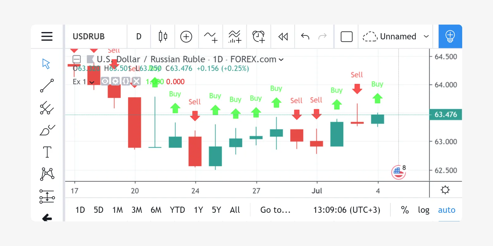
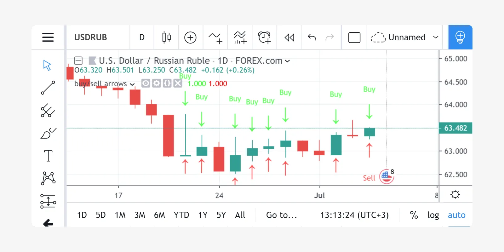
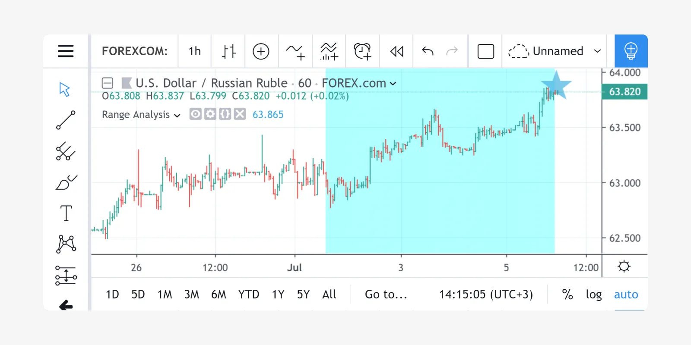

# FAQ

## Obter Preço Real de OHLC em um Gráfico Heikin Ashi

Suponha que haja um gráfico Heikin Ashi (ou Renko, Kagi, PriceBreak etc) e que foi adicionado um script Pine nele:

```c
//@version=5
indicator("Visible OHLC", overlay=true)
c = close
plot(c)
```

Pode-se notar que a variável `c` é um preço de fechamento (_close_) Heikin Ashi, que não é o mesmo que o preço real de OHLC. Isso ocorre porque a variável embutida `close` é sempre um valor que corresponde a uma barra visível (ou vela) no gráfico.

Então, como obter os preços reais de OHLC no código Pine Script, se o tipo de gráfico atual for não padrão? Deve-se usar a função `request.security` em combinação com a função `ticker.new`. Aqui está um exemplo:

```c
//@version=5
indicator("Real OHLC", overlay = true)
t = ticker.new(syminfo.prefix, syminfo.ticker)
realC = request.security(t, timeframe.period, close)
plot(realC)
```

De maneira semelhante, é possível obter outros preços de OHLC: _open_, _high_ e _low_.

## Obter Valores OHLC não Padrão em um Gráfico Padrão

Backtesting em tipos de gráfico não padrão (por exemplo, Heikin Ashi ou Renko) não é recomendado porque as barras nesses tipos de gráficos não representam movimentos reais de preço que seriam encontrados durante a negociação. Se deseja que sua estratégia entre e saia com preços reais, mas ainda use sinais baseados em Heikin Ashi, pode-se usar o mesmo método para obter valores de Heikin Ashi em um gráfico de velas regular:

```c
//@version=5
strategy("BarUpDn Strategy", overlay = true, default_qty_type = strategy.percent_of_equity, default_qty_value = 10)
maxIdLossPcntInput = input.float(1, "Max Intraday Loss(%)")
strategy.risk.max_intraday_loss(maxIdLossPcntInput, strategy.percent_of_equity)
needTrade() => close > open and open > close[1] ? 1 : close < open and open < close[1] ? -1 : 0
trade = request.security(ticker.heikinashi(syminfo.tickerid), timeframe.period, needTrade())
if trade == 1
    strategy.entry("BarUp", strategy.long)
if trade == -1
    strategy.entry("BarDn", strategy.short)
```

## Plotar Setas no Gráfico

Pode-se usar `plotshape` com os estilos `shape.arrowup` e `shape.arrowdown`:

```c
//@version=5
indicator('Ex 1', overlay = true)
condition = close >= open
plotshape(condition, color = color.lime, style = shape.arrowup, text = "Buy")
plotshape(not condition, color = color.red, style = shape.arrowdown, text = "Sell")
```



Pode-se usar a função `plotchar` com qualquer caractere unicode:

```c
//@version=5
indicator('buy/sell arrows', overlay = true)
condition = close >= open
plotchar(not condition, char='↓', color = color.lime, text = "Buy")
plotchar(condition, char='↑', location = location.belowbar, color = color.red, text = "Sell")
```



## Plotar uma Linha Horizontal Dinâmica

Existe a função `hline` no Pine Script, mas ela é limitada a plotar apenas um valor constante. Aqui está um script simples com uma solução alternativa para plotar uma `hline` variável:

```c
//@version=5
indicator("Horizontal line", overlay = true)
plot(close[10], trackprice = true, offset = -9999)
// `trackprice = true` plots horizontal line on close[10]
// `offset = -9999` hides the plot
plot(close, color = #FFFFFFFF)  // forces display
```

<!-- ## Plotar uma Linha Vertical sob Condição

```c
//@version=5
indicator("Vertical line", overlay = true, scale = scale.none)
// scale.none means do not resize the chart to fit this plot
// if the bar being evaluated is the last baron the chart (the most recent bar), then cond is true
cond = barstate.islast
// when cond is true, plot a histogram with a line with height value of 100,000,000,000,000,000,000.00
// (10 to the power of 20)
// when cond is false, plot no numeric value (nothing is plotted)
// use the style of histogram, a vertical bar
plot(cond ? 10e20 : na, style = plot.style_histogram)
```

## Acessar o Valor Anterior

```c
//@version=5
//...
s = 0.0
s := nz(s[1]) // Accessing previous values
if (condition)
    s := s + 1
```

## Obter a Máxima de 5 Dias

Olha para trás 5 dias a partir da barra atual, encontra a barra mais alta, plota um caractere estrela nesse nível de preço acima da barra atual



```c
//@version=5
indicator("High of last 5 days", overlay = true)

// Milliseconds in 5 days: millisecs * secs * mins * hours * days
MS_IN_5DAYS = 1000 * 60 * 60 * 24 * 5

// The range check begins 5 days from the current time.
leftBorder = timenow - time < MS_IN_5DAYS
// The range ends on the last bar of the chart.
rightBorder = barstate.islast

// ————— Keep track of highest `high` during the range.
// Intialize `maxHi` with `var` on bar zero only.
// This way, its value is preserved, bar to bar.
var float maxHi = na
if leftBorder
    if not leftBorder[1]
        // Range's first bar.
        maxHi := high
    else if not rightBorder
        // On other bars in the range, track highest `high`.
        maxHi := math.max(maxHi, high)

// Plot level of the highest `high` on the last bar.
plotchar(rightBorder ? maxHi : na, "Level", "—", location.absolute, size = size.normal)
// When in range, color the background.
bgcolor(leftBorder and not rightBorder ? color.new(color.aqua, 70) : na)
```

## Contar Barras em um Conjunto de Dados

Obter uma contagem de todas as barras no conjunto de dados carregado. Pode ser útil para calcular períodos de retrocesso flexíveis com base no número de barras.

```c
//@version=5
indicator("Bar Count", overlay = true, scale = scale.none)
plot(bar_index + 1, style = plot.style_histogram)
```

## Enumerar Barras em um Dia

```c
//@version=5
indicator("My Script", overlay = true, scale = scale.none)

isNewDay() =>
    d = dayofweek
    na(d[1]) or d != d[1]

plot(ta.barssince(isNewDay()), style = plot.style_cross)
```

## Encontrar os Valores Mais Altos e Mais Baixos para todo o Conjunto de Dados

```c
//@version=5
indicator("", "", true)

allTimetHi(source) =>
    var atHi = source
    atHi := math.max(atHi, source)

allTimetLo(source) =>
    var atLo = source
    atLo := math.min(atLo, source)

plot(allTimetHi(close), "ATH", color.green)
plot(allTimetLo(close), "ATL", color.red)
```

## Consultar o último valor não-_na_

Use o script abaixo para evitar lacunas em uma série:

```c
//@version=5
indicator("")
series = close >= open ? close : na
vw = fixnan(series)
plot(series, style = plot.style_linebr, color = color.red)  // series has na values
plot(vw)  // all na values are replaced with the last non-empty value
``` -->
